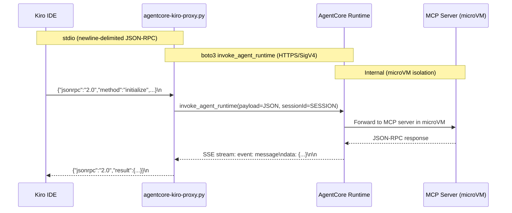

# Design Document

## Overview

The AgentCore Kiro Proxy is a single-file Python script that acts as a stdio-to-HTTP bridge between Kiro IDE and the AWS Bedrock AgentCore Runtime. It implements the MCP stdio transport (newline-delimited JSON-RPC on stdin/stdout) and translates each message into a boto3 `invoke_agent_runtime` API call, then parses the SSE response stream back into JSON-RPC for Kiro.

### Key Design Decisions

1. **Single-file, zero-dependency (beyond boto3)**: The EC2 already has Python 3.9 and boto3. No virtualenv, no pip install, no build step. Copy one file and configure mcp.json.

2. **Transparent forwarding**: The proxy does not interpret MCP semantics (tool schemas, capabilities). It forwards all JSON-RPC messages verbatim to AgentCore and returns responses verbatim. This means the proxy never needs updating when tools are added/removed on the server side.

3. **One session per process**: Each proxy process generates a unique `runtimeSessionId` on startup. Kiro spawns one process per MCP server entry, so each user gets their own AgentCore microVM session automatically.

4. **Synchronous request/response**: Kiro sends one request at a time over stdio and waits for the response. The proxy processes messages sequentially — no concurrency needed within a single process.

5. **Stderr for all diagnostics**: stdout is exclusively for MCP JSON-RPC responses. All logging, errors, and debug output goes to stderr where Kiro can capture it for diagnostics.

## Architecture



### Component Layout

```
┌─────────────────────────────────────────────────────────┐
│  agentcore-kiro-proxy.py (single file)                  │
│                                                         │
│  ┌───────────────┐  ┌──────────────┐  ┌─────────────┐  │
│  │  StdinReader   │  │  AgentCore   │  │  SSEParser  │  │
│  │               │  │  Client      │  │             │  │
│  │ - line buffer │  │ - boto3      │  │ - frame     │  │
│  │ - JSON parse  │  │ - session ID │  │   parsing   │  │
│  │ - EOF detect  │  │ - retry      │  │ - JSON      │  │
│  └───────┬───────┘  └──────┬───────┘  └──────┬──────┘  │
│          │                 │                 │          │
│          ▼                 ▼                 ▼          │
│  ┌─────────────────────────────────────────────────────┐│
│  │                  Main Loop                          ││
│  │  read stdin → forward to AgentCore → parse SSE →   ││
│  │  write stdout                                      ││
│  └─────────────────────────────────────────────────────┘│
│                                                         │
│  ┌─────────────────────────────────────────────────────┐│
│  │  Logger (stderr only)                               ││
│  └─────────────────────────────────────────────────────┘│
└─────────────────────────────────────────────────────────┘
```

### Execution Flow

1. **Startup**: Parse CLI args/env vars, create boto3 client, generate session ID, log banner to stderr
2. **Main loop**: Read one line from stdin → parse JSON → forward to AgentCore → parse SSE response → write JSON line to stdout → repeat
3. **Shutdown**: On EOF/SIGTERM/SIGINT, finish in-flight request, log shutdown, exit

## Components and Interfaces

### 1. StdinReader

Reads newline-delimited JSON-RPC messages from stdin.

```python
class StdinReader:
    """Reads complete JSON-RPC messages from stdin, one per line."""
    
    def read_message(self) -> Optional[dict]:
        """Read and parse one JSON-RPC message. Returns None on EOF."""
        # Reads a line from stdin
        # Strips whitespace
        # Parses JSON
        # Returns parsed dict or None on EOF
```

**Interface contract**:
- Input: raw bytes/text from stdin
- Output: parsed JSON dict, or None on EOF
- Error: logs malformed JSON to stderr, skips the line

### 2. AgentCoreClient

Wraps the boto3 `invoke_agent_runtime` call with retry logic and session management.

```python
class AgentCoreClient:
    """Manages communication with AgentCore Runtime via boto3."""
    
    def __init__(self, agent_runtime_id: str, region: str, session_id: str):
        self.client = boto3.client('bedrock-agentcore', region_name=region)
        self.agent_runtime_id = agent_runtime_id
        self.session_id = session_id
    
    def invoke(self, payload: dict) -> str:
        """Send JSON-RPC payload to AgentCore, return raw SSE response body.
        
        Retries up to 3 times on transient errors with exponential backoff.
        Regenerates session ID on session-expired errors.
        """
```

**Interface contract**:
- Input: JSON-RPC message as dict
- Output: raw SSE response body as string
- Error: raises after 3 retries exhausted, or on non-retryable errors

### 3. SSEParser

Parses the SSE response format from AgentCore into JSON-RPC payloads.

```python
class SSEParser:
    """Parses Server-Sent Events response from AgentCore Runtime."""
    
    @staticmethod
    def parse(raw_body: str) -> List[dict]:
        """Parse SSE frames and extract JSON-RPC payloads.
        
        SSE format: event: message\\ndata: {json}\\n\\n
        Handles multi-line data fields by concatenation.
        Returns list of parsed JSON-RPC response objects.
        """
```

**Interface contract**:
- Input: raw SSE body string
- Output: list of parsed JSON-RPC dicts (typically one per response)
- Error: logs malformed frames to stderr, returns error JSON-RPC for unparseable data

### 4. Main Loop / Message Router

Orchestrates the read-forward-parse-write cycle.

```python
def main():
    """Entry point: parse args, create components, run message loop."""
    # 1. Parse CLI args / env vars
    # 2. Configure logging to stderr
    # 3. Create AgentCoreClient with generated session ID
    # 4. Log startup banner
    # 5. Loop: read_message() → invoke() → parse() → write stdout
    # 6. Handle signals (SIGTERM, SIGINT) for graceful shutdown
```

### 5. Configuration

The proxy accepts configuration via CLI args with env var fallbacks:

| Parameter | CLI Flag | Env Var | Default |
|-----------|----------|---------|---------|
| Runtime ID | `--runtime-id` | `AGENTCORE_RUNTIME_ID` | (required) |
| Region | `--region` | `AWS_REGION` | `us-east-1` |
| Log level | `--verbose` | `LOG_LEVEL` | `INFO` |

### 6. Kiro MCP Configuration Entry

```json
{
  "mcpServers": {
    "agentcore-mcp-rag": {
      "type": "command",
      "command": "python3",
      "args": ["/home/ec2-user/eib-mcp-rag-server/tools/agentcore-kiro-proxy.py", "--runtime-id", "mdc_mcp_rag_server-TMXDllG2Wi"],
      "env": {
        "AWS_REGION": "us-east-1"
      }
    }
  }
}
```

## Data Models

### JSON-RPC Message (stdin/stdout)

All messages conform to JSON-RPC 2.0:

```python
# Request (from Kiro)
{
    "jsonrpc": "2.0",
    "id": 1,              # integer or string, absent for notifications
    "method": "tools/call",
    "params": { ... }
}

# Response (to Kiro)
{
    "jsonrpc": "2.0",
    "id": 1,
    "result": { ... }     # or "error": {"code": ..., "message": ..., "data": ...}
}

# Notification (no id, no response expected)
{
    "jsonrpc": "2.0",
    "method": "notifications/initialized",
    "params": {}
}
```

### invoke_agent_runtime API Call

```python
response = client.invoke_agent_runtime(
    agentRuntimeId='mdc_mcp_rag_server-TMXDllG2Wi',
    runtimeSessionId=session_id,      # 33+ chars, UUID-based
    contentType='application/json',
    accept='application/json, text/event-stream',
    payload=json.dumps(jsonrpc_message).encode('utf-8'),
    qualifier='DEFAULT'
)
```

### invoke_agent_runtime Response

```python
{
    'ResponseMetadata': { ... },
    'runtimeSessionId': 'session-id-string',
    'mcpSessionId': 'mcp-session-id',
    'contentType': 'text/event-stream',
    'statusCode': 200,
    'response': <botocore.response.StreamingBody>
}
```

### SSE Frame Format

```
event: message
data: {"jsonrpc":"2.0","id":1,"result":{"protocolVersion":"2024-11-05",...}}

```

The `data:` field contains the complete JSON-RPC response to forward to Kiro.

### Session ID Format

```python
import uuid
session_id = f"kiro-proxy-{uuid.uuid4().hex}"
# Example: "kiro-proxy-a1b2c3d4e5f6a7b8c9d0e1f2a3b4c5d6" (43 chars, exceeds 33 minimum)
```

### Error Response Format

When the proxy itself encounters an error (not forwarded from AgentCore):

```python
{
    "jsonrpc": "2.0",
    "id": original_request_id,  # or null if unknown
    "error": {
        "code": -32603,         # Internal error
        "message": "AgentCore invocation failed after 3 retries",
        "data": {
            "exception": "ThrottlingException",
            "detail": "Rate exceeded"
        }
    }
}
```


## Correctness Properties

*A property is a characteristic or behavior that should hold true across all valid executions of a system — essentially, a formal statement about what the system should do. Properties serve as the bridge between human-readable specifications and machine-verifiable correctness guarantees.*

### Property 1: JSON-RPC Message Round-Trip

*For any* valid JSON-RPC message (request, response, or notification), serializing it as a single line of JSON and then parsing that line back should produce an object identical to the original.

**Validates: Requirements 1.1, 1.2**

### Property 2: SSE Parsing Extracts Correct Payload

*For any* valid JSON-RPC response object, wrapping it in SSE format (`event: message\ndata: {json}\n\n`) — including cases where the data spans multiple `data:` lines — and then parsing the SSE frame should produce the original JSON-RPC object.

**Validates: Requirements 3.1, 3.2, 3.3, 3.5**

### Property 3: Transparent Forwarding Preserves Message Fields

*For any* JSON-RPC message with arbitrary `method`, `params`, and `id` fields, the payload sent to the AgentCore `invoke_agent_runtime` API must contain identical `method`, `params`, and `id` values to the original stdin message.

**Validates: Requirements 5.5**

### Property 4: Session ID Invariants

*For any* generated session ID, it must be at least 33 characters long. *For any* two independently generated session IDs, they must be distinct.

**Validates: Requirements 4.1, 8.1**

### Property 5: Error Responses Are Well-Formed JSON-RPC

*For any* error condition (boto3 exception, malformed SSE data, retry exhaustion), the proxy must produce a valid JSON-RPC error response with integer `code` field equal to `-32603`, a non-empty string `message` field, and the original request's `id` (or `null` if unknown).

**Validates: Requirements 2.5, 3.4, 7.2**

### Property 6: Retry Behavior on Transient Errors

*For any* retryable boto3 exception (throttling, transient network error), the proxy must attempt the API call exactly 3 additional times before returning an error response. The total number of `invoke_agent_runtime` calls must equal 4 (1 original + 3 retries).

**Validates: Requirements 7.1, 7.2**

### Property 7: Resilience — Proxy Survives Single-Message Errors

*For any* sequence of JSON-RPC requests where one request triggers an error (exception during processing), the proxy must return an error response for that request and successfully process subsequent requests without restarting.

**Validates: Requirements 7.3, 7.4**

## Error Handling

### Error Categories and Responses

| Error Category | Source | Proxy Behavior | JSON-RPC Error Code |
|---|---|---|---|
| Malformed stdin JSON | Kiro sends invalid JSON | Log to stderr, skip line, continue | N/A (no valid id to respond to) |
| boto3 retryable error | Network/throttling | Retry 3x with exponential backoff | -32603 after exhaustion |
| boto3 non-retryable error | Auth failure, invalid ARN | Return error immediately | -32603 |
| Session expired | AgentCore session timeout | Generate new session ID, retry once | (transparent to Kiro) |
| Malformed SSE response | AgentCore returns bad data | Log raw frame, return error | -32603 |
| Unhandled exception | Bug in proxy code | Log traceback, return error, continue | -32603 |

### Retry Strategy

```python
RETRYABLE_EXCEPTIONS = (
    'ThrottlingException',
    'ServiceUnavailableException', 
    'InternalServerException',
    'RequestTimeoutException',
)

MAX_RETRIES = 3
BASE_DELAY = 0.5  # seconds
# Delays: 0.5s, 1.0s, 2.0s (exponential backoff)
```

### Signal Handling

- **SIGTERM**: Set shutdown flag, finish in-flight request, exit 0
- **SIGINT**: Same as SIGTERM (Ctrl+C from terminal)
- **EOF on stdin**: Kiro closed the connection, finish in-flight, exit 0

### Error Response Construction

```python
def make_error_response(request_id, code, message, data=None):
    """Construct a JSON-RPC error response."""
    error = {"code": code, "message": message}
    if data:
        error["data"] = data
    return {
        "jsonrpc": "2.0",
        "id": request_id,
        "error": error
    }
```

## Testing Strategy

### Property-Based Tests (Hypothesis)

The proxy's pure functions (JSON-RPC serialization, SSE parsing, session ID generation, error response construction) are well-suited for property-based testing. We'll use **Hypothesis** (Python's standard PBT library, available via pip).

**Configuration:**
- Minimum 100 iterations per property test
- Each test tagged with: `# Feature: agentcore-kiro-proxy, Property N: {description}`

**Properties to implement:**
1. JSON-RPC round-trip (serialize → parse)
2. SSE parsing round-trip (wrap → parse)
3. Transparent forwarding (mock boto3, verify payload identity)
4. Session ID invariants (length, uniqueness)
5. Error response format (always well-formed)
6. Retry count (exactly 3 retries on retryable errors)
7. Resilience (proxy continues after errors)

### Unit Tests (pytest)

Example-based tests for specific scenarios:

- **Startup**: Verify banner logged to stderr with version, runtime ID, region, session ID
- **EOF handling**: Send EOF, verify clean exit within 5 seconds
- **Notification forwarding**: Send `notifications/initialized`, verify forwarded (no response expected)
- **Session reuse**: Multiple requests use same session ID
- **Session recovery**: Mock session-expired error, verify new session ID generated and retry
- **CLI argument parsing**: `--runtime-id`, `--region`, `--verbose`, env var fallbacks
- **Signal handling**: SIGTERM/SIGINT trigger graceful shutdown
- **Credential error**: Mock NoCredentialsError, verify clear stderr message

### Integration Tests (manual, on EC2)

- Start proxy with real AgentCore Runtime
- Send `initialize` → verify capabilities response
- Send `tools/list` → verify 51 tools returned
- Send `tools/call` with `get_server_info` → verify response
- Two simultaneous proxy instances → verify independent sessions

### Test File Location

```
tests/
  test_agentcore_kiro_proxy.py      # Unit + property tests
```

### Test Dependencies

```
pytest
hypothesis
```

These are test-only dependencies, not required for the proxy itself.
