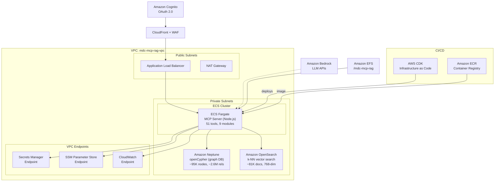
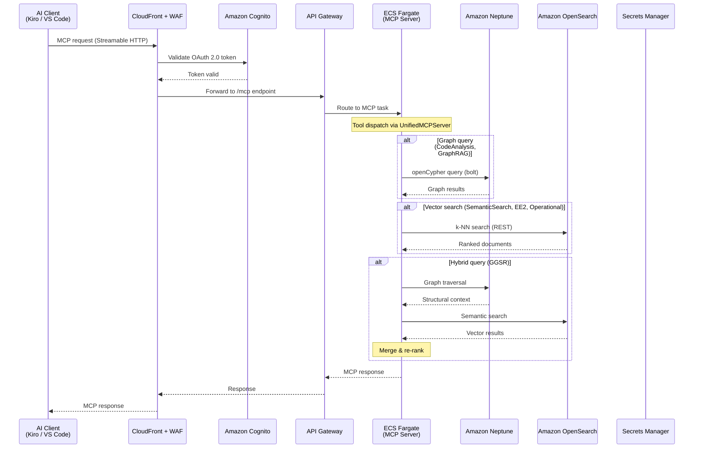
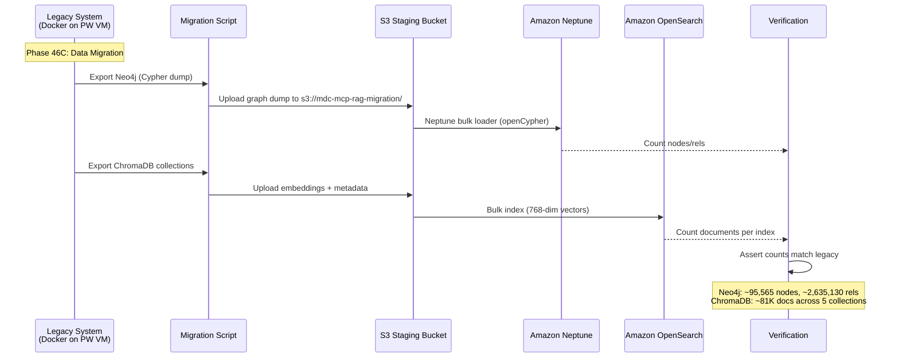

# Design Document: AWS Infrastructure Port (MDC MCP RAG — Phase 46)

## Overview

This design specifies the migration of the MDC MCP RAG Server from its legacy Docker-based infrastructure on NOAA Parallel Works VMs to AWS-native services on EC2. The system provides 51 MCP tools across 9 modules for NOAA Global Workflow AI assistance, backed by ChromaDB (vector search, ~81K documents, 5 collections) and Neo4j (graph database, ~95K nodes, ~2.6M relationships).

The port replaces Docker Compose orchestration, Docker MCP Gateway, and container-managed databases with AWS-managed equivalents: Amazon Neptune (graph), Amazon OpenSearch (vector search), ECS Fargate (MCP server hosting), API Gateway (HTTP transport), and CDK for infrastructure as code. The MCP server's 51-tool interface must remain backward-compatible throughout the migration. The persistent data root shifts from `/mcp_rag_eib` to `/mdc-mcp-rag`, and all new infrastructure code uses `mdc-mcp-rag` naming per the EIB → MDC institutional rename.

A phased rollout strategy ensures the legacy system remains operational via the `eib-mcp-gateway` MCP connection while AWS services are brought online incrementally. The adapter pattern in the data access layer (`UnifiedDataAccess → GraphDatabase / VectorDatabase`) provides the seam for swapping backends without modifying tool modules.

## Architecture

### Target AWS Service Topology



### Legacy → AWS Component Mapping

| Legacy Component | Script | AWS Replacement | Status |
|---|---|---|---|
| Directory structure (`/mcp_rag_eib`) | `01-directories.sh` | EFS mount at `/mdc-mcp-rag` | Phase 46A |
| System dependencies | `02-system-deps.sh` | Amazon Linux 2 AMI + Dockerfile | Phase 46A |
| Docker engine | `03-docker.sh` | Not needed (ECS Fargate) | Eliminated |
| Node.js runtime | `04-nodejs.sh` | Dockerfile base image | Phase 46B |
| Python & Spack | `05-python-spack.sh` | Python Lambda layer / pip in container | Phase 46D |
| ChromaDB (Docker container) | `06-chromadb.sh` | Amazon OpenSearch Serverless | Phase 46C |
| MCP Server (Node.js) | `07-mcp-server.sh` | ECS Fargate service | Phase 46B |
| Neo4j + n8n (Docker Compose) | `08-services.sh` | Amazon Neptune Serverless | Phase 46C |
| Desktop VNC | `09-desktop-vnc.sh` | Not needed (Kiro IDE) | Eliminated |
| Health checks | `10-verification.sh` | CloudWatch + custom health endpoint | Phase 46E |
| Docker MCP Gateway | `11-docker-mcp-gateway.sh` | API Gateway (Streamable HTTP) | Phase 46B |
| Static mode gateway | `12-static-mode-gateway.sh` | CloudFront + ALB routing | Phase 46B |
| Container cleanup | `13-container-cleanup.sh` | ECS task lifecycle (automatic) | Eliminated |
| File permissions | `14-final-ownership.sh` | IAM task roles + EFS POSIX | Phase 46A |
| GitHub Copilot CLI | `15-github-copilot-cli.sh` | Not needed (Kiro IDE) | Eliminated |

## Sequence Diagrams

### MCP Tool Request Flow (AWS)



### Data Migration Flow



## Components and Interfaces

### Component 1: Database Adapter Layer

**Purpose**: Abstract database access so tool modules work identically against legacy (ChromaDB/Neo4j) or AWS (OpenSearch/Neptune) backends. This is the critical migration seam.

**Interface** (extends existing `src/data/` contracts):

```math
\begin{aligned}
&\textbf{interface } VectorDatabaseAdapter\\
&\quad connect() \rightarrow Promise\langle void \rangle\\
&\quad query(collection: String, text: String, opts: QueryOptions) \rightarrow Promise\langle QueryResult \rangle\\
&\quad multiCollectionQuery(collections: String[], text: String, opts) \rightarrow Promise\langle QueryResult \rangle\\
&\quad addDocuments(collection: String, docs: Document[]) \rightarrow Promise\langle void \rangle\\
&\quad listCollections() \rightarrow Promise\langle CollectionInfo[] \rangle\\
&\quad getCollectionCount(collection: String) \rightarrow Promise\langle \mathbb{N} \rangle\\
&\quad healthCheck(opts) \rightarrow Promise\langle HealthStatus \rangle\\
&\quad close() \rightarrow Promise\langle void \rangle
\end{aligned}
```

```math
\begin{aligned}
&\textbf{interface } GraphDatabaseAdapter\\
&\quad connect() \rightarrow Promise\langle void \rangle\\
&\quad query(cypher: String, params: Map) \rightarrow Promise\langle Record[] \rangle\\
&\quad findCallers(name: String) \rightarrow Promise\langle Node[] \rangle\\
&\quad traceCallChain(name: String, depth: \mathbb{N}) \rightarrow Promise\langle Path[] \rangle\\
&\quad getStatistics() \rightarrow Promise\langle GraphStats \rangle\\
&\quad healthCheck() \rightarrow Promise\langle HealthStatus \rangle\\
&\quad close() \rightarrow Promise\langle void \rangle
\end{aligned}
```

**Responsibilities**:
- Implement `VectorDatabaseAdapter` for both ChromaDB (legacy) and OpenSearch (AWS)
- Implement `GraphDatabaseAdapter` for both Neo4j (legacy) and Neptune (AWS)
- Backend selection via environment configuration (`MCP_ENV` + `DB_BACKEND` env var)
- Transparent to all 51 MCP tools — no tool code changes required

### Component 2: MCP Server Container (ECS Fargate)

**Purpose**: Host the Node.js MCP server as a containerized ECS Fargate service with Streamable HTTP transport.

**Responsibilities**:
- Run `UnifiedMCPServer.js` in `full` scenario mode
- Expose Streamable HTTP endpoint (replacing Docker MCP Gateway on port 18888)
- Connect to Neptune and OpenSearch via VPC networking
- Pull secrets from Secrets Manager at startup
- Report health to ALB target group health checks
- Auto-scale based on request volume

### Component 3: API Gateway + CloudFront Layer

**Purpose**: Replace the Docker MCP Gateway (Go binary on port 18888) with AWS-managed HTTP routing, TLS termination, and OAuth 2.0 authentication.

**Responsibilities**:
- CloudFront distribution with WAF for DDoS protection
- API Gateway routes `/mcp` to ECS Fargate service
- Cognito user pool for OAuth 2.0 token validation (RFC9728)
- Protected Resource Metadata endpoint for MCP client discovery

### Component 4: CDK Infrastructure Stacks

**Purpose**: Define all AWS infrastructure as code using AWS CDK (TypeScript), following the four-stack pattern from the AWS MCP deployment guidance.

**Stack Decomposition**:

| Stack | Resources | Dependencies |
|---|---|---|
| `MdcVpcStack` | VPC, subnets, NAT Gateway, VPC endpoints | None |
| `MdcDataStack` | Neptune cluster, OpenSearch domain, EFS, S3 | VpcStack |
| `MdcSecurityStack` | Cognito, WAF, Secrets Manager, IAM roles | VpcStack |
| `MdcServerStack` | ECS cluster, Fargate service, ALB, API Gateway, CloudFront | All above |

### Component 5: Configuration & Secrets Management

**Purpose**: Replace hardcoded environment variables and `mcp-env.sh` with AWS-native configuration.

**Mapping**:

| Legacy Config | AWS Service | Key Path |
|---|---|---|
| `NEO4J_PASSWORD` | Secrets Manager | `mdc-mcp-rag/neptune/credentials` |
| `CHROMADB_URL` | SSM Parameter Store | `/mdc-mcp-rag/opensearch/endpoint` |
| `NEO4J_URI` | SSM Parameter Store | `/mdc-mcp-rag/neptune/endpoint` |
| `GITHUB_TOKEN` | Secrets Manager | `mdc-mcp-rag/github/token` |
| `MCP_ENV` | ECS task definition env | Environment variable |
| Auth tokens | Cognito | User pool client credentials |

## Data Models

### OpenSearch Index Design (replacing ChromaDB collections)

```math
\begin{aligned}
&\textbf{type } OpenSearchIndex = \{\\
&\quad name: String,\\
&\quad mappings: \{\\
&\quad\quad embedding: \{type: \text{"knn\_vector"}, dimension: 768, method: \{\\
&\quad\quad\quad engine: \text{"nmslib"}, space\_type: \text{"cosinesimil"}, name: \text{"hnsw"}\\
&\quad\quad \}\},\\
&\quad\quad content: \{type: \text{"text"}\},\\
&\quad\quad metadata: \{type: \text{"object"}, dynamic: true\},\\
&\quad\quad source\_file: \{type: \text{"keyword"}\},\\
&\quad\quad chunk\_id: \{type: \text{"keyword"}\},\\
&\quad\quad collection\_name: \{type: \text{"keyword"}\}\\
&\quad \}\\
&\}
\end{aligned}
```

**ChromaDB → OpenSearch Index Mapping**:

| ChromaDB Collection | OpenSearch Index | Documents | Notes |
|---|---|---|---|
| `code-with-context-v8-0-0` | `mdc-code-context` | ~58,761 | Largest; Python, Fortran, Shell source |
| `global-workflow-docs-v8-0-0` | `mdc-workflow-docs` | ~3,514 | Documentation, READMEs |
| `jjobs-v8-0-0` | `mdc-jjobs` | ~700 | J-Job scripts with structured metadata |
| `community-summaries` | `mdc-community-summaries` | ~828 | Hierarchical community embeddings (4 levels) |
| `ee2-standards-v5-0-0-enhanced` | `mdc-ee2-standards` | ~34 | EE2/NCO compliance standards |

**Embedding Configuration**:
- Model: `all-mpnet-base-v2` (768 dimensions, same as legacy)
- Similarity: Cosine similarity via HNSW algorithm
- OpenSearch k-NN plugin with `nmslib` engine

### Neptune Graph Schema (replacing Neo4j)

Neptune supports openCypher, so existing Cypher queries work with minimal changes.

**Node Labels** (28 types, preserved from Neo4j):

```math
\begin{aligned}
&NodeLabels = \{FortranSubroutine, FortranFunction, FortranModule, FortranProgram,\\
&\quad PythonFunction, CodeFunction, ShellScript, ShellFunction,\\
&\quad EnvironmentVariable, Commit, File, Component, Community, \ldots\}
\end{aligned}
```

**Relationship Types** (23 types, preserved):

```math
\begin{aligned}
&RelTypes = \{CALLS, USES, DEFINES, IMPORTS, DEPENDS\_ON\_ENV,\\
&\quad AUTHORED, HAS\_METHOD, MEMBER\_OF, PARENT\_OF, INTERACTS\_WITH,\\
&\quad SOURCES, INVOKES, EXECUTES, \ldots\}
\end{aligned}
```

**Neptune-Specific Considerations**:
- APOC procedures → Neptune does not support APOC; replace with openCypher equivalents or Gremlin
- GDS (Graph Data Science) → Neptune ML or custom algorithms via SageMaker
- Community detection (Leiden algorithm) → Pre-computed communities stored as nodes (already materialized in Phase 24E-5)
- Bolt protocol → Neptune supports bolt-compatible endpoint for openCypher

## Algorithmic Pseudocode

### Database Backend Selection Algorithm

```math
\begin{aligned}
&\textbf{Algorithm: } selectDatabaseBackend\\
&\textbf{Input: } env \in \{development, devops, staging, production, aws\}\\
&\textbf{Output: } (vectorAdapter, graphAdapter) \in VectorDatabaseAdapter \times GraphDatabaseAdapter\\
&\textbf{Precondition: } env \in ValidEnvironments\\
&\textbf{Postcondition: } \text{both adapters are connected and healthy}\\
&\\
&\quad backend \gets \text{SSM.getParameter}(\text{"/mdc-mcp-rag/db-backend"}) \lor env\\
&\\
&\quad \textbf{match } backend \textbf{ with}\\
&\quad\quad | \text{"aws"} \rightarrow\\
&\quad\quad\quad neptuneEndpoint \gets \text{SSM.getParameter}(\text{"/mdc-mcp-rag/neptune/endpoint"})\\
&\quad\quad\quad osEndpoint \gets \text{SSM.getParameter}(\text{"/mdc-mcp-rag/opensearch/endpoint"})\\
&\quad\quad\quad vectorAdapter \gets \text{new } OpenSearchAdapter(osEndpoint)\\
&\quad\quad\quad graphAdapter \gets \text{new } NeptuneAdapter(neptuneEndpoint)\\
&\quad\quad | \text{"legacy"} \rightarrow\\
&\quad\quad\quad vectorAdapter \gets \text{new } ChromaDBAdapter(\text{getChromaConfig}())\\
&\quad\quad\quad graphAdapter \gets \text{new } Neo4jAdapter(\text{getNeo4jConfig}())\\
&\quad\quad | \_ \rightarrow \textbf{error}(\text{"Unknown backend: "} \| backend)\\
&\\
&\quad \textbf{await } vectorAdapter.connect()\\
&\quad \textbf{await } graphAdapter.connect()\\
&\\
&\quad \textbf{assert } vectorAdapter.healthCheck().status = \text{"healthy"}\\
&\quad \textbf{assert } graphAdapter.healthCheck().status = \text{"healthy"}\\
&\\
&\quad \textbf{return } (vectorAdapter, graphAdapter)
\end{aligned}
```

**Preconditions:**
- Environment variable `MCP_ENV` or SSM parameter `/mdc-mcp-rag/db-backend` is set
- Network connectivity to target database endpoints exists
- IAM role has permissions for SSM GetParameter and Secrets Manager GetSecretValue

**Postconditions:**
- Both adapters are connected and pass health checks
- Tool modules receive adapters transparently via `UnifiedDataAccess`

**Loop Invariants:** N/A (no loops)

### OpenSearch Vector Query Algorithm

```math
\begin{aligned}
&\textbf{Algorithm: } openSearchVectorQuery\\
&\textbf{Input: } indexName \in String, queryText \in String, k \in \mathbb{N}, filters \in Map\\
&\textbf{Output: } results \in QueryResult\\
&\textbf{Precondition: } indexName \neq \emptyset \wedge queryText \neq \emptyset \wedge k > 0\\
&\textbf{Postcondition: } |results.documents| \leq k \wedge \forall d \in results.documents: d.score \in [0, 1]\\
&\\
&\quad embedding \gets \text{generateEmbedding}(queryText) \quad \triangleright \text{MPNet 768-dim}\\
&\quad \textbf{assert } |embedding| = 768\\
&\\
&\quad body \gets \{\\
&\quad\quad size: k,\\
&\quad\quad query: \{\\
&\quad\quad\quad knn: \{\\
&\quad\quad\quad\quad embedding: \{vector: embedding, k: k\}\\
&\quad\quad\quad \}\\
&\quad\quad \}\\
&\quad \}\\
&\\
&\quad \textbf{if } filters \neq \emptyset \textbf{ then}\\
&\quad\quad body.query \gets \{bool: \{must: [body.query.knn], filter: \text{buildFilters}(filters)\}\}\\
&\quad \textbf{end if}\\
&\\
&\quad response \gets \textbf{await } osClient.search(\{index: indexName, body\})\\
&\\
&\quad results \gets response.hits.hits.\text{map}(hit \mapsto \{\\
&\quad\quad id: hit.\_id,\\
&\quad\quad content: hit.\_source.content,\\
&\quad\quad metadata: hit.\_source.metadata,\\
&\quad\quad score: hit.\_score\\
&\quad \})\\
&\\
&\quad \textbf{return } \{documents: results, total: response.hits.total.value\}
\end{aligned}
```

**Preconditions:**
- OpenSearch domain is accessible and index exists
- Embedding model (`all-mpnet-base-v2`) is loaded
- k-NN plugin is enabled on the index

**Postconditions:**
- Returns at most `k` documents ranked by cosine similarity
- All scores normalized to [0, 1]
- Results are compatible with existing `_formatQueryResults()` output format

**Loop Invariants:** N/A

### Neptune openCypher Query Adapter Algorithm

```math
\begin{aligned}
&\textbf{Algorithm: } neptuneQueryAdapter\\
&\textbf{Input: } cypher \in String, params \in Map\\
&\textbf{Output: } records \in Record[]\\
&\textbf{Precondition: } cypher \neq \emptyset \wedge \text{isValidOpenCypher}(cypher)\\
&\textbf{Postcondition: } \forall r \in records: r \text{ conforms to Neo4j Record interface}\\
&\\
&\quad \triangleright \text{Step 1: Transform APOC calls to openCypher equivalents}\\
&\quad transformedCypher \gets cypher\\
&\\
&\quad \textbf{for each } pattern \in APOCReplacements \textbf{ do}\\
&\quad\quad \textbf{assert } \text{all previously transformed patterns are valid openCypher}\\
&\quad\quad \textbf{if } transformedCypher.\text{contains}(pattern.apoc) \textbf{ then}\\
&\quad\quad\quad transformedCypher \gets transformedCypher.\text{replace}(pattern.apoc, pattern.openCypher)\\
&\quad\quad \textbf{end if}\\
&\quad \textbf{end for}\\
&\\
&\quad \triangleright \text{Step 2: Execute via Neptune bolt endpoint}\\
&\quad session \gets neptuneDriver.\text{session}(\{database: \text{"neptune"}\})\\
&\quad result \gets \textbf{await } session.\text{run}(transformedCypher, params)\\
&\\
&\quad \triangleright \text{Step 3: Convert Neptune records to Neo4j-compatible format}\\
&\quad records \gets result.records.\text{map}(r \mapsto \text{convertRecord}(r))\\
&\\
&\quad \textbf{await } session.\text{close}()\\
&\quad \textbf{return } records
\end{aligned}
```

**Preconditions:**
- Neptune cluster is accessible via bolt endpoint
- Cypher query uses only openCypher-compatible syntax (or APOC calls have known replacements)
- IAM authentication is configured for Neptune access

**Postconditions:**
- Output records match the interface expected by `GraphDatabase._recordToObject()`
- APOC procedures are transparently replaced with openCypher equivalents
- Session is properly closed after query execution

**Loop Invariants:**
- All previously transformed APOC patterns produce valid openCypher syntax
- The semantic meaning of the query is preserved after each transformation

### APOC Replacement Map

```math
\begin{aligned}
&APOCReplacements = \{\\
&\quad (\text{apoc.path.expand}, \text{variable-length path patterns}),\\
&\quad (\text{apoc.algo.dijkstra}, \text{Neptune shortest path or Gremlin}),\\
&\quad (\text{apoc.periodic.iterate}, \text{batched UNWIND queries}),\\
&\quad (\text{apoc.create.node}, \text{standard CREATE}),\\
&\quad (\text{apoc.merge.node}, \text{MERGE with ON CREATE SET / ON MATCH SET})\\
&\}
\end{aligned}
```

### Data Migration Algorithm

```math
\begin{aligned}
&\textbf{Algorithm: } migrateData\\
&\textbf{Input: } legacyConfig \in Config, awsConfig \in Config\\
&\textbf{Output: } migrationReport \in MigrationReport\\
&\textbf{Precondition: } \text{legacy system accessible} \wedge \text{AWS services provisioned}\\
&\textbf{Postcondition: } \\
&\quad nodeCount_{Neptune} = nodeCount_{Neo4j} \wedge relCount_{Neptune} = relCount_{Neo4j}\\
&\quad \wedge \forall c \in Collections: docCount_{OpenSearch}(c) = docCount_{ChromaDB}(c)\\
&\\
&\quad \triangleright \text{Phase 1: Export from legacy}\\
&\quad graphDump \gets \text{neo4jAdmin.dump}(legacyConfig.neo4j)\\
&\quad \textbf{for each } collection \in \{\text{code-context, workflow-docs, jjobs, community-summaries, ee2-standards}\} \textbf{ do}\\
&\quad\quad \textbf{assert } \text{all previously exported collections are complete}\\
&\quad\quad vectorDump[collection] \gets \text{chromaDB.export}(collection) \quad \triangleright \text{embeddings + metadata + content}\\
&\quad \textbf{end for}\\
&\\
&\quad \triangleright \text{Phase 2: Stage in S3}\\
&\quad \text{s3.upload}(\text{"s3://mdc-mcp-rag-migration/graph/"}, graphDump)\\
&\quad \text{s3.upload}(\text{"s3://mdc-mcp-rag-migration/vectors/"}, vectorDump)\\
&\\
&\quad \triangleright \text{Phase 3: Load into AWS services}\\
&\quad \text{neptuneBulkLoader.load}(awsConfig.neptune, \text{"s3://mdc-mcp-rag-migration/graph/"})\\
&\\
&\quad \textbf{for each } (collection, index) \in CollectionIndexMap \textbf{ do}\\
&\quad\quad \textbf{assert } \text{all previously loaded indices have correct document counts}\\
&\quad\quad \text{openSearchBulk.index}(awsConfig.opensearch, index, vectorDump[collection])\\
&\quad \textbf{end for}\\
&\\
&\quad \triangleright \text{Phase 4: Verify}\\
&\quad \textbf{assert } \text{neptune.nodeCount}() = 95565\\
&\quad \textbf{assert } \text{neptune.relCount}() = 2635130\\
&\quad \textbf{for each } (collection, index) \in CollectionIndexMap \textbf{ do}\\
&\quad\quad \textbf{assert } \text{opensearch.docCount}(index) = \text{chromaDB.docCount}(collection)\\
&\quad \textbf{end for}\\
&\\
&\quad \textbf{return } migrationReport
\end{aligned}
```

**Preconditions:**
- Legacy Neo4j and ChromaDB are accessible and healthy
- AWS Neptune cluster and OpenSearch domain are provisioned and empty
- S3 staging bucket exists with appropriate IAM permissions
- Neptune bulk loader IAM role has S3 read access

**Postconditions:**
- All node counts, relationship counts, and document counts match between legacy and AWS
- Embedding dimensions are preserved (768-dim MPNet)
- Graph topology (labels, relationship types, properties) is identical

**Loop Invariants:**
- All previously exported/loaded collections maintain data integrity
- Document counts are verified after each collection load


## Key Functions with Formal Specifications

### Function 1: `createOpenSearchAdapter()`

```math
\begin{aligned}
&\textbf{function } createOpenSearchAdapter(endpoint: String, region: String) \rightarrow OpenSearchAdapter
\end{aligned}
```

**Preconditions:**
- `endpoint` is a valid OpenSearch domain endpoint URL
- `region` is a valid AWS region string
- IAM credentials available via instance profile or task role
- OpenSearch domain has k-NN plugin enabled

**Postconditions:**
- Returns adapter implementing `VectorDatabaseAdapter` interface
- Adapter uses AWS Signature V4 for authentication
- All methods produce output compatible with existing `VectorDatabase.js` return types
- `query()` returns results in same format as `ChromaDB._formatQueryResults()`

### Function 2: `createNeptuneAdapter()`

```math
\begin{aligned}
&\textbf{function } createNeptuneAdapter(endpoint: String, port: \mathbb{N}) \rightarrow NeptuneAdapter
\end{aligned}
```

**Preconditions:**
- `endpoint` is a valid Neptune cluster endpoint
- `port` is the Neptune bolt port (default 8182)
- IAM authentication is configured for Neptune
- Neptune cluster supports openCypher queries

**Postconditions:**
- Returns adapter implementing `GraphDatabaseAdapter` interface
- `query()` transparently transforms APOC calls to openCypher equivalents
- All methods produce output compatible with existing `GraphDatabase._recordToObject()` format
- Connection uses Neptune IAM authentication (not username/password)

### Function 3: `resolveConfig()`

```math
\begin{aligned}
&\textbf{function } resolveConfig(env: String) \rightarrow Config
\end{aligned}
```

**Preconditions:**
- `env` ∈ {`development`, `devops`, `staging`, `production`, `aws`}
- If `env = aws`: SSM Parameter Store and Secrets Manager are accessible

**Postconditions:**
- Returns complete configuration object with all database endpoints and credentials
- Secrets are fetched from Secrets Manager (not hardcoded)
- Configuration is cached for the lifetime of the process (no repeated API calls)
- Falls back to environment variables if SSM/Secrets Manager unavailable

### Function 4: `migrateCollection()`

```math
\begin{aligned}
&\textbf{function } migrateCollection(chromaUrl: String, collection: String, osEndpoint: String, index: String) \rightarrow MigrationResult
\end{aligned}
```

**Preconditions:**
- ChromaDB collection exists and is accessible at `chromaUrl`
- OpenSearch index `index` is created with correct k-NN mapping (768-dim)
- Sufficient memory for batch processing (collections up to ~59K documents)

**Postconditions:**
- All documents from ChromaDB collection are indexed in OpenSearch
- Embeddings are preserved exactly (no re-embedding required)
- Metadata fields are mapped to OpenSearch document fields
- `docCount(opensearch, index) = docCount(chromadb, collection)`

**Loop Invariants:**
- For batch processing: all previously indexed batches are committed and searchable
- Running document count matches expected count for processed batches

## Example Usage

### Adapter Pattern Usage (Tool Module Perspective)

```math
\begin{aligned}
&\triangleright \text{Tool modules see no difference between legacy and AWS backends}\\
&\\
&\textbf{let } config = resolveConfig(MCP\_ENV)\\
&\textbf{let } (vectorDB, graphDB) = selectDatabaseBackend(config)\\
&\textbf{let } dataAccess = \text{new } UnifiedDataAccess(vectorDB, graphDB)\\
&\\
&\triangleright \text{Hybrid query works identically on both backends}\\
&\textbf{let } results = \textbf{await } dataAccess.hybridQuery(\text{"forecast initialization"}, \{\\
&\quad maxResults: 10,\\
&\quad enrichGraph: true,\\
&\quad collections: [\text{"mdc-code-context"}, \text{"mdc-workflow-docs"}]\\
&\})\\
&\\
&\triangleright \text{Graph traversal works identically}\\
&\textbf{let } callChain = \textbf{await } graphDB.traceCallChain(\text{"forecast"}, 3)\\
&\\
&\triangleright \text{Health check reports backend type}\\
&\textbf{let } health = \textbf{await } dataAccess.healthCheck()\\
&\textbf{match } health.backend \textbf{ with}\\
&\quad | \text{"aws"} \rightarrow \text{log}(\text{"Neptune + OpenSearch"})\\
&\quad | \text{"legacy"} \rightarrow \text{log}(\text{"Neo4j + ChromaDB"})
\end{aligned}
```

### CDK Deployment Usage

```math
\begin{aligned}
&\triangleright \text{Deploy all stacks}\\
&\textbf{let } app = \text{new } CDK.App()\\
&\\
&\textbf{let } vpc = \text{new } MdcVpcStack(app, \text{"MDC-VPC"})\\
&\textbf{let } data = \text{new } MdcDataStack(app, \text{"MDC-Data"}, \{vpc\})\\
&\textbf{let } security = \text{new } MdcSecurityStack(app, \text{"MDC-Security"}, \{vpc\})\\
&\textbf{let } server = \text{new } MdcServerStack(app, \text{"MDC-Server"}, \{vpc, data, security\})\\
&\\
&\triangleright \text{Outputs}\\
&\text{server.mcpEndpoint} \rightarrow \text{"https://dXXXXXX.cloudfront.net/mcp"}\\
&\text{data.neptuneEndpoint} \rightarrow \text{"wss://mdc-neptune.cluster-XXX.region.neptune.amazonaws.com:8182/opencypher"}\\
&\text{data.opensearchEndpoint} \rightarrow \text{"https://mdc-opensearch-XXX.region.aoss.amazonaws.com"}
\end{aligned}
```

### Migration Script Usage

```math
\begin{aligned}
&\triangleright \text{Run from legacy system with AWS credentials}\\
&\\
&\textbf{let } legacy = \{neo4j: \text{"bolt://localhost:7687"}, chromadb: \text{"http://localhost:8080"}\}\\
&\textbf{let } aws = \{neptune: \text{SSM}(\text{"/mdc-mcp-rag/neptune/endpoint"}), opensearch: \text{SSM}(\text{"/mdc-mcp-rag/opensearch/endpoint"})\}\\
&\\
&\textbf{let } report = \textbf{await } migrateData(legacy, aws)\\
&\\
&\textbf{assert } report.graph.nodesExported = report.graph.nodesImported\\
&\textbf{assert } report.graph.relsExported = report.graph.relsImported\\
&\textbf{for each } c \in report.collections \textbf{ do}\\
&\quad \textbf{assert } c.docsExported = c.docsImported\\
&\textbf{end for}
\end{aligned}
```

## Correctness Properties

*A property is a characteristic or behavior that should hold true across all valid executions of a system — essentially, a formal statement about what the system should do. Properties serve as the bridge between human-readable specifications and machine-verifiable correctness guarantees.*

### Property 1: Tool Interface Preservation

*For any* MCP tool among the 51 tools, when invoked on the AWS backend, the output JSON schema shall be identical to the output produced by the same tool on the legacy backend.

**Validates: Requirements 3.2**

### Property 2: Adapter Output Compatibility

*For any* query input, the OpenSearch adapter `query()` output shall conform to the same structure as ChromaDB `_formatQueryResults()`, and the Neptune adapter `query()` output shall conform to the same structure as Neo4j `_recordToObject()`.

**Validates: Requirements 1.6, 1.7**

### Property 3: APOC Transformation Semantic Preservation

*For any* Cypher query containing a known APOC procedure call, the Neptune adapter's transformed openCypher query shall produce semantically equivalent results to the original query executed on Neo4j.

**Validates: Requirements 2.7**

### Property 4: Data Completeness

*For any* dataset migrated from the legacy system, the Neptune node count shall equal the Neo4j node count, the Neptune relationship count shall equal the Neo4j relationship count, and for each collection, the OpenSearch index document count shall equal the corresponding ChromaDB collection document count.

**Validates: Requirements 4.5, 4.6, 4.7, 15.4**

### Property 5: Migration Idempotence

*For any* migration execution, running the Migration_Script a second time on the same data shall produce the same final state as running it once — no duplicate data, no missing data, and identical counts.

**Validates: Requirements 4.8, 14.5**

### Property 6: Embedding Fidelity

*For any* document, the 768-dimensional MPNet embedding stored in OpenSearch after migration shall be bitwise identical to the embedding stored in the source ChromaDB collection.

**Validates: Requirements 5.1**

### Property 7: Score Normalization

*For any* vector query result returned by the OpenSearch adapter, all cosine similarity scores shall be in the range [0, 1].

**Validates: Requirements 5.3**

### Property 8: Search Equivalence

*For any* search query (including queries with metadata filters and multi-collection queries), the ranking of results from OpenSearch shall have a similarity within 5% tolerance (epsilon = 0.05) compared to the ranking from ChromaDB for the same query.

**Validates: Requirements 6.1, 6.2, 6.3**

### Property 9: Health Check Accuracy

*For any* combination of database connection states, the Health_Endpoint shall report `healthy` if and only if both the vector database and graph database are connected, at least 5 indices exist, and node count is greater than zero. When either database is unreachable, the Health_Endpoint shall report `degraded` identifying the specific unavailable database.

**Validates: Requirements 11.1, 11.2**

### Property 10: Graceful Degradation

*For any* MCP tool that does not depend on an unavailable database, the tool shall continue to function correctly when that database is unreachable, and tools depending on a missing OpenSearch index shall return empty results with a warning.

**Validates: Requirements 11.3, 14.1, 14.2**

### Property 11: Secret Non-Exposure

*For any* CDK stack output, environment variable, log entry, or configuration file produced by the system, no secret value (database credentials, API tokens, Cognito client secrets) shall appear in plaintext.

**Validates: Requirements 8.5, 8.6**

### Property 12: Configuration Caching

*For any* sequence of configuration lookups within a single process lifetime, only the first lookup shall result in an API call to Secrets Manager or SSM Parameter Store; all subsequent lookups shall return cached values.

**Validates: Requirements 8.3**

### Property 13: Retry Exponential Backoff

*For any* sequence of Neptune connection retry attempts, the delay between attempts shall follow exponential backoff (5s, 10s, 20s) with a maximum delay of 60s.

**Validates: Requirements 14.4**

## Error Handling

### Error Scenario 1: Neptune Connection Failure

**Condition**: Neptune cluster is unreachable (network issue, cluster stopped, IAM auth failure)
**Response**: `GraphDatabaseAdapter.connect()` throws `NeptuneConnectionError` with endpoint and error details. `UnifiedDataAccess` marks graph tools as degraded. MCP server continues in `core` mode (filesystem-only tools remain available).
**Recovery**: CloudWatch alarm triggers. ECS task retries connection with exponential backoff (5s, 10s, 20s, max 60s). If cluster is stopped, auto-start via Lambda trigger.

### Error Scenario 2: OpenSearch Index Missing

**Condition**: Expected index (e.g., `mdc-code-context`) does not exist in OpenSearch domain
**Response**: `VectorDatabaseAdapter.listCollections()` returns partial list. Health check reports `degraded` with missing index names. Semantic search tools return empty results for affected collections with warning message.
**Recovery**: Migration script can be re-run for specific indices. CDK deployment includes index creation as custom resource.

### Error Scenario 3: APOC Query Incompatibility

**Condition**: A Cypher query uses an APOC procedure not in the `APOCReplacements` map
**Response**: `NeptuneAdapter.query()` catches Neptune error, logs the unsupported APOC call, and throws `UnsupportedQueryError` with the specific APOC procedure name.
**Recovery**: Add the APOC procedure to the replacement map. For complex APOC calls, implement as a Gremlin traversal fallback. Track all APOC usage in a compatibility matrix during migration.

### Error Scenario 4: Secrets Manager Throttling

**Condition**: Too many `GetSecretValue` calls during high-concurrency startup
**Response**: `resolveConfig()` uses cached secrets with TTL. If cache miss and API throttled, falls back to environment variables with warning log.
**Recovery**: Secrets are cached for 5 minutes. ECS tasks stagger startup. VPC endpoint for Secrets Manager avoids internet routing.

### Error Scenario 5: Data Migration Partial Failure

**Condition**: Migration script fails mid-way (e.g., S3 upload timeout, Neptune bulk loader error)
**Response**: Migration is idempotent — each collection/index tracks a watermark. Re-running skips already-migrated data. Verification step reports exact counts for each collection.
**Recovery**: Re-run migration script. It resumes from last successful watermark. Final verification asserts exact count parity.

## Testing Strategy

### Unit Testing Approach

- Adapter interface compliance: Each adapter (OpenSearch, Neptune, ChromaDB, Neo4j) tested against the same interface contract
- Mock-based testing for AWS SDK calls (Secrets Manager, SSM, OpenSearch client, Neptune driver)
- APOC replacement map: Each transformation tested with input/output Cypher pairs
- Configuration resolution: Test all environment combinations and fallback paths

### Property-Based Testing Approach

**Property Test Library**: `fast-check` (already in Node.js ecosystem)

- **P1 (Interface Preservation)**: Generate random tool invocations, assert output schema matches between legacy and AWS adapters
- **P2 (Data Completeness)**: Generate random document sets, migrate, assert count equality
- **P4 (Embedding Fidelity)**: Generate random embedding vectors, round-trip through OpenSearch, assert bitwise equality
- **P5 (Search Relevance)**: Generate random query strings, compare top-k rankings between ChromaDB and OpenSearch

### Integration Testing Approach

- Deploy test stacks via CDK in isolated VPC
- Run full MCP tool suite against AWS backends
- Compare outputs with legacy system (golden file testing)
- Load testing: Verify 51 tools under concurrent access
- Migration dry-run: Full data migration to test environment, verify counts

## Performance Considerations

| Metric | Legacy (Docker) | AWS Target | Notes |
|---|---|---|---|
| Vector query latency | ~50ms (ChromaDB local) | ~100-200ms (OpenSearch) | Network hop added; mitigate with VPC endpoint |
| Graph query latency | ~20ms (Neo4j local) | ~50-100ms (Neptune) | Neptune Serverless cold start; use provisioned for hot path |
| MCP request E2E | ~200ms (stdio local) | ~500ms (HTTP + auth) | CloudFront caching for metadata; keep-alive connections |
| Startup time | ~5s (npm start) | ~30s (Fargate cold start) | Pre-warm with minimum task count = 1 |
| Data migration | N/A | ~2-4 hours (81K docs + 95K nodes) | One-time; parallelizable per collection |

**Optimization Strategies**:
- Neptune: Use provisioned capacity (not Serverless) for consistent latency on graph queries
- OpenSearch: Use UltraWarm storage for infrequently accessed indices (ee2-standards)
- ECS: Minimum desired count = 1 to avoid cold starts; scale to 3 under load
- Connection pooling: Reuse Neptune bolt sessions and OpenSearch HTTP connections across requests

## Security Considerations

### Authentication & Authorization

- **External access**: OAuth 2.0 via Amazon Cognito (RFC9728 Protected Resource Metadata)
- **Internal (VPC)**: IAM roles for ECS tasks → Neptune, OpenSearch, Secrets Manager
- **Neptune**: IAM authentication (no username/password)
- **OpenSearch**: Fine-grained access control with IAM backend role mapping

### Network Security

- All database services in private subnets (no public IPs)
- VPC endpoints for AWS services (Secrets Manager, SSM, CloudWatch, S3)
- Security groups: ECS → Neptune (port 8182), ECS → OpenSearch (port 443)
- WAF on CloudFront: Rate limiting, geo-restriction, SQL injection protection
- No SSH access to ECS tasks (use ECS Exec for debugging)

### Data Protection

- Encryption at rest: Neptune (KMS), OpenSearch (KMS), EFS (KMS), S3 (SSE-S3)
- Encryption in transit: TLS 1.2+ for all connections
- Secrets rotation: Cognito client secrets rotated via Secrets Manager rotation Lambda
- No credentials in CDK outputs, environment variables, or container logs

## Dependencies

| Dependency | Version | Purpose |
|---|---|---|
| AWS CDK | v2.x | Infrastructure as code |
| `@aws-sdk/client-opensearch` | latest | OpenSearch API client |
| `@opensearch-project/opensearch` | ^2.x | OpenSearch Node.js client |
| `neo4j-driver` | ^5.x | Neptune bolt protocol (openCypher) |
| `@aws-sdk/client-secrets-manager` | latest | Secrets retrieval |
| `@aws-sdk/client-ssm` | latest | Parameter Store access |
| `@modelcontextprotocol/sdk` | existing | MCP protocol (unchanged) |
| `sentence-transformers` | existing | MPNet embedding model (unchanged) |
| `fast-check` | ^3.x | Property-based testing |

### AWS Services

| Service | Configuration | Estimated Monthly Cost |
|---|---|---|
| Neptune Serverless | 1-8 NCU, openCypher | ~$50-200 |
| OpenSearch Serverless | 2 OCU (search + index) | ~$350 |
| ECS Fargate | 1 vCPU, 2GB, min 1 task | ~$36 |
| CloudFront | Moderate traffic | ~$50 |
| ALB | 1 ALB | ~$17 |
| Cognito | <50K MAU (free tier) | $0 |
| Secrets Manager | 5 secrets | ~$2 |
| EFS | 10GB | ~$3 |
| NAT Gateway | 1 AZ | ~$37 |
| **Total** | | **~$545-745/month** |

## Phased Rollout Plan

### Phase 46A: Foundation (Week 1-2)
- CDK project scaffolding (`MdcVpcStack`, `MdcSecurityStack`)
- VPC with public/private subnets, NAT Gateway, VPC endpoints
- EFS filesystem mounted at `/mdc-mcp-rag`
- Secrets Manager entries for all credentials
- SSM Parameter Store for configuration

### Phase 46B: MCP Server on ECS (Week 2-3)
- Dockerfile for MCP server (Node.js base image)
- `MdcServerStack`: ECS cluster, Fargate task definition, ALB
- API Gateway with Streamable HTTP route to ECS
- CloudFront + WAF distribution
- Cognito user pool and OAuth 2.0 flow
- MCP server running in `core` mode (no databases yet)

### Phase 46C: Database Migration (Week 3-5)
- `MdcDataStack`: Neptune cluster, OpenSearch domain
- Database adapter layer (`OpenSearchAdapter`, `NeptuneAdapter`)
- Data migration scripts (Neo4j → Neptune, ChromaDB → OpenSearch)
- Verification: count parity, sample query comparison
- MCP server switches to `full` mode on AWS backends

### Phase 46D: Ingestion Pipeline Adaptation (Week 5-6)
- Adapt 7 ingestion scripts for AWS backends
- Python ingestion scripts use OpenSearch bulk API and Neptune bolt
- Embedding generation unchanged (MPNet model)
- Test full re-ingestion cycle on AWS

### Phase 46E: Validation & Cutover (Week 6-7)
- Full MCP tool suite integration tests against AWS backends
- Performance benchmarking (latency comparison)
- CloudWatch dashboards and alarms
- Cutover: Update `.kiro/settings/mcp.json` to point to AWS endpoint
- Legacy system kept as read-only fallback for 2 weeks
