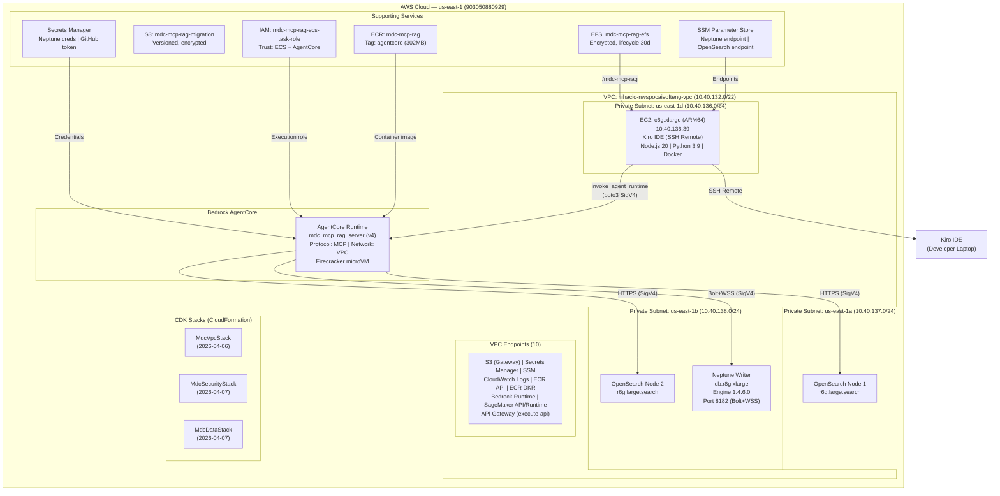
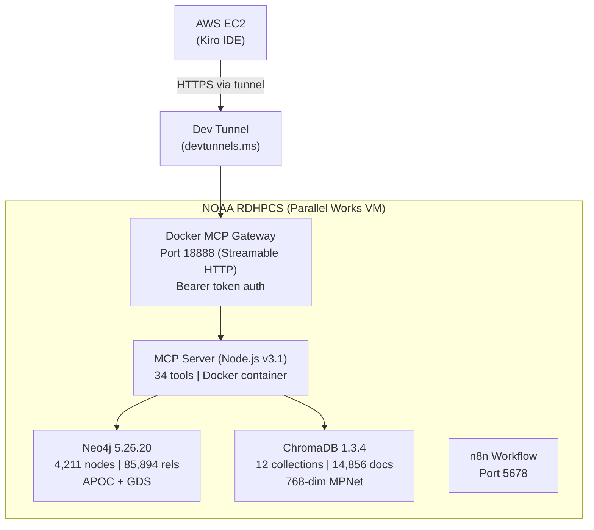
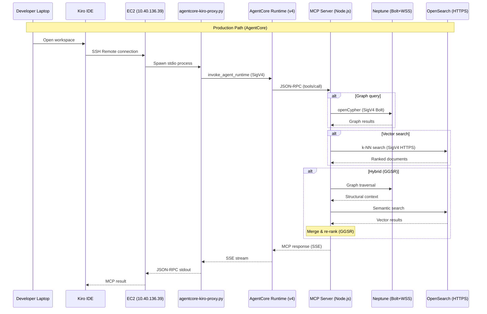

# Design Document: MDC MCP RAG — AWS Architecture (Operational)

## Overview

This document describes the **deployed and operational** AWS architecture for the MDC MCP RAG Platform as of May 2026. The platform provides 51 MCP tools across 9 modules for NOAA Global Workflow AI assistance, backed by Amazon Neptune (graph: 148,723 nodes, 2,820,440 relationships) and Amazon OpenSearch (vector: 206,341 documents across 17 indices).

The architecture evolved from the original Phase 46 plan (ECS Fargate + CloudFront + Cognito) to a simpler, more cost-effective deployment using **AWS Bedrock AgentCore Runtime** for managed MCP server hosting. AgentCore provides serverless Firecracker microVMs with built-in session management, eliminating the need for ECS clusters, load balancers, API Gateway, and Cognito. The platform runs in a fully private VPC with no internet gateway — all AWS service access is via VPC endpoints.

A parallel legacy system on NOAA RDHPCS infrastructure (Neo4j + ChromaDB, Docker-based) remains operational as a reference implementation, accessible via dev tunnel.

## Architecture

### Deployed AWS Service Topology



### Legacy System (On-Premises Reference)



### Client Connectivity Paths



### Original Plan vs Actual Deployment

| Planned (Phase 46) | Actual (Deployed) | Reason |
|---|---|---|
| ECS Fargate cluster | Bedrock AgentCore Runtime | Simpler, managed microVMs, no cluster ops |
| Application Load Balancer | AgentCore DEFAULT endpoint | Built-in load balancing |
| API Gateway (REST) | AgentCore MCP protocol | Native MCP support, no HTTP wrapper needed |
| CloudFront + WAF | Not needed | Private VPC, no public access |
| Amazon Cognito (OAuth 2.0) | IAM SigV4 (via proxy) | VPC-internal, IAM sufficient |
| NAT Gateway | No NAT Gateway | VPC endpoints for all services |
| Neptune Serverless | Neptune db.r8g.xlarge (provisioned) | Consistent latency, admin-created |
| OpenSearch Serverless | OpenSearch 2.11 (provisioned, 2× r6g.large) | Zone-aware, admin-created |
| ~$545-745/month estimated | AgentCore pay-per-session + provisioned DBs | Different cost model |

## Components and Interfaces

### Component 1: AgentCore Runtime (MCP Server Host)

**Purpose**: Host the Node.js MCP server in a managed Firecracker microVM with native MCP protocol support, replacing the planned ECS Fargate + API Gateway + CloudFront stack.

| Property | Value |
|----------|-------|
| Runtime ID | `mdc_mcp_rag_server-TMXDllG2Wi` |
| Version | 4 (deployed 2026-05-01) |
| Protocol | MCP (JSON-RPC over HTTP at :8000/mcp) |
| Network | VPC (us-east-1a, us-east-1b) |
| Container | `903050880929.dkr.ecr.us-east-1.amazonaws.com/mdc-mcp-rag:agentcore` |
| Base image | node:20-slim (302MB) |
| Execution role | `mdc-mcp-rag-ecs-task-role` |
| Idle timeout | 900s (15 min) |
| Max lifetime | 28800s (8 hours) |
| Endpoint | DEFAULT (auto-created, live version 4) |

**Environment Variables**:
```
DB_BACKEND=aws
NEPTUNE_ENDPOINT=wss://mdc-mcp-graprag-neptune-1.cluster-ccdaimu4c86s.us-east-1.neptune.amazonaws.com:8182
OPENSEARCH_ENDPOINT=https://vpc-mdc-mcp-rag-search-5o72hixfx3rryikwb7l5px5sgq.us-east-1.es.amazonaws.com
AWS_REGION=us-east-1
WORKFLOW_ROOT=/app/supported_repos/global-workflow
```

### Component 2: Database Adapter Layer (Operational)

**Purpose**: Abstract database access so 51 tool modules work identically against legacy (ChromaDB/Neo4j) or AWS (OpenSearch/Neptune) backends.

**Deployed adapters**:

```
UnifiedDataAccess (src/data/)
  ├── selectDatabaseBackend() → reads DB_BACKEND env var
  │     ├── 'legacy' → ChromaDBLegacyAdapter + Neo4jLegacyAdapter
  │     └── 'aws'    → OpenSearchAdapter + NeptuneAdapter ← ACTIVE
  │
  ├── OpenSearchAdapter.js    — SigV4 auth, k-NN search, score normalization [0,1]
  ├── NeptuneAdapter.js       — SigV4 Bolt auth, APOC→openCypher transform
  ├── apoc-transform.js       — 5 APOC replacements + UnsupportedQueryError
  └── backend-selector.js     — routing logic
```

**Interface** (implemented by both legacy and AWS adapters):

```math
\begin{aligned}
&\textbf{interface } VectorDatabaseAdapter \quad (16 \text{ methods})\\
&\quad connect() \rightarrow Promise\langle void \rangle\\
&\quad query(collection, text, opts) \rightarrow Promise\langle QueryResult \rangle\\
&\quad listCollections() \rightarrow Promise\langle String[] \rangle\\
&\quad getCollectionCount(collection) \rightarrow Promise\langle \mathbb{N} \rangle\\
&\quad healthCheck() \rightarrow Promise\langle HealthStatus \rangle\\
&\quad close() \rightarrow Promise\langle void \rangle\\
&\\
&\textbf{interface } GraphDatabaseAdapter \quad (34 \text{ methods})\\
&\quad connect() \rightarrow Promise\langle void \rangle\\
&\quad query(cypher, params) \rightarrow Promise\langle Record[] \rangle\\
&\quad findCallers(name) \rightarrow Promise\langle Node[] \rangle\\
&\quad traceCallChain(name, depth) \rightarrow Promise\langle Path[] \rangle\\
&\quad traceCrossLanguageChain(name, depth, direction) \rightarrow Promise\langle ChainResult \rangle\\
&\quad getStatistics() \rightarrow Promise\langle GraphStats \rangle\\
&\quad getScriptGraphStats() \rightarrow Promise\langle ScriptStats \rangle\\
&\quad healthCheck() \rightarrow Promise\langle HealthStatus \rangle\\
&\quad close() \rightarrow Promise\langle void \rangle
\end{aligned}
```

### Component 3: Kiro Proxy (stdio → AgentCore Bridge)

**Purpose**: Bridge Kiro IDE's stdio MCP transport to AgentCore's `invoke_agent_runtime` API.

| Property | Value |
|----------|-------|
| File | `tools/agentcore-kiro-proxy.py` |
| Language | Python 3.9+ (stdlib + boto3 only) |
| Transport | stdin/stdout (JSON-RPC) ↔ boto3 SigV4 ↔ SSE |
| Session | Unique 43-char ID per process, reused across calls |
| Retry | 3 retries, exponential backoff (0.5s/1s/2s) |
| Auth | IAM instance profile (EC2 role) |

### Component 4: CDK Infrastructure Stacks (Deployed)

| Stack | Status | Resources |
|---|---|---|
| `MdcVpcStack` | UPDATE_COMPLETE (2026-04-07) | VPC, 6 subnets, 10 VPC endpoints |
| `MdcSecurityStack` | UPDATE_COMPLETE (2026-04-22) | Secrets Manager, SSM, WAF, IAM |
| `MdcDataStack` | UPDATE_COMPLETE (2026-04-22) | EFS, S3, Neptune (imported), OpenSearch (imported) |

**Note**: Neptune and OpenSearch are admin-created resources imported into CDK — CDK does not manage their lifecycle. All stateful resources have `removalPolicy: RETAIN` per the April 22, 2026 post-mortem guardrails.

### Component 5: Configuration & Secrets (Deployed)

| Config Item | AWS Service | Key |
|---|---|---|
| Neptune endpoint | SSM Parameter Store | `/mdc-mcp-rag/neptune/endpoint` |
| OpenSearch endpoint | SSM Parameter Store | `/mdc-mcp-rag/opensearch/endpoint` |
| DB backend mode | SSM Parameter Store | `/mdc-mcp-rag/db-backend` |
| Neptune credentials | Secrets Manager | `mdc-mcp-rag/neptune/credentials` |
| GitHub token | Secrets Manager | `mdc-mcp-rag/github/token` |

Resolution: `aws-config.js` fetches from SSM/Secrets Manager with process-lifetime cache, falls back to environment variables.

## Data Stores — Live Statistics

### Neptune Graph Database

| Property | Value |
|----------|-------|
| Cluster | `mdc-mcp-graprag-neptune-1` |
| Engine | Neptune 1.4.6.0 (openCypher) |
| Instance | db.r8g.xlarge (1 writer, us-east-1b) |
| Port | 8182 (Bolt over WSS) |
| Auth | IAM (SigV4) |
| Encryption | KMS at rest |
| Nodes | 148,723 |
| Relationships | 2,820,440 |
| Files | 17,273 |
| Functions | 87,610 |
| Fortran subroutines | 27,941 |
| Languages | Shell, Python, Fortran |

**Relationship types**:

| Type | Count | Purpose |
|------|-------|---------|
| CALLS | 2,216,985 | Function call graph |
| USES | 487,061 | Module/variable usage |
| DEFINES | 91,315 | Symbol definitions |
| DEPENDS_ON_ENV | 11,167 | Environment variable dependencies |
| IMPORTS | 10,443 | Module imports |
| EXPORTS | 1,861 | Variable exports |
| INVOKES | 923 | Script invocations |
| SOURCES | 600 | Script sourcing |
| EXECUTES | 85 | Cross-language execution bridges |

### OpenSearch Vector Database

| Property | Value |
|----------|-------|
| Domain | `mdc-mcp-rag-search` |
| Engine | OpenSearch 2.11 |
| Instances | 2× r6g.large.search (zone-aware) |
| Storage | 2× 100GB gp3 (3000 IOPS) |
| Indices | 17 |
| Total documents | 206,341 |
| Embedding models | MPNet 768-dim, Titan 1024-dim, Nova 1024-dim |

**Index breakdown**:

| Index | Documents | Model |
|-------|-----------|-------|
| mdc-code-context-titan1024 | 90,135 | Bedrock Titan 1024-dim |
| mdc-code-context-mpnet768 | 60,576 | MPNet 768-dim |
| mdc-workflow-docs-titan1024 | 27,222 | Bedrock Titan 1024-dim |
| mdc-workflow-docs-mpnet768 | 22,498 | MPNet 768-dim |
| mdc-community-summaries-titan1024 | 2,113 | Bedrock Titan 1024-dim |
| mdc-community-summaries-mpnet768 | 2,113 | MPNet 768-dim |
| mdc-jjobs-titan1024 | 751 | Bedrock Titan 1024-dim |
| mdc-jjobs-mpnet768 | 700 | MPNet 768-dim |
| mdc-workflow-docs-nova1024 | 150 | Nova 1024-dim |
| mdc-ee2-standards-titan1024 | 34 | Bedrock Titan 1024-dim |
| mdc-ee2-standards-mpnet768 | 34 | MPNet 768-dim |
| ee2-standards-v7-0-0-titan1024 | 12 | Bedrock Titan 1024-dim |

## MCP Server — Tool Inventory (51 tools)

| Module | Count | Backend | Tools |
|--------|-------|---------|-------|
| Workflow Info | 3 | Filesystem | get_workflow_structure, get_system_configs, describe_component |
| Code Analysis | 5 | Neptune | analyze_code_structure, find_dependencies, trace_execution_path, find_callers_callees, find_env_dependencies |
| Semantic Search | 6 | OpenSearch+Neptune | search_documentation, find_related_files, explain_with_context, get_knowledge_base_status, list_ingested_urls, get_ingested_urls_array |
| EE2 Compliance | 4 | OpenSearch | search_ee2_standards, analyze_ee2_compliance, generate_compliance_report, scan_repository_compliance |
| Operational | 3 | OpenSearch+Neptune | get_operational_guidance, explain_workflow_component, list_job_scripts |
| GitHub | 4 | GitHub API | search_issues, get_pull_requests, analyze_workflow_dependencies, analyze_repository_structure |
| SDD Workflow | 9 | Local JSONL | list/get/start/record/get/complete_sdd_*, get_sdd_execution_history, validate_sdd_compliance, get_sdd_framework_status |
| Graph RAG | 14 | Neptune | get_code_context, search_architecture, find_similar_code, get_change_impact, trace_data_flow, trace_full_execution_chain, mark_as_modified, get_session_context, checkpoint_state, restore_checkpoint, check_knowledge_integrity, get_health_trend, get_quality_metrics |
| Utility | 3 | Health probes | get_server_info, mcp_health_check, get_quality_metrics |

## Network & Security

### VPC Configuration

| Property | Value |
|----------|-------|
| VPC ID | `vpc-055f30ffa3d661e6b` |
| Name | nihacio-nwspocaisofteng-vpc |
| CIDR | 10.40.132.0/22 |
| Internet Gateway | **None** (fully private) |
| NAT Gateway | **None** |
| Connectivity | VPC Endpoints only |

### Active Subnets

| Subnet | CIDR | AZ | Used By |
|--------|------|----|---------|
| subnet-0e13af6b3a9a6416f | 10.40.137.0/24 | us-east-1a | OpenSearch, AgentCore |
| subnet-04447750c61bd7e06 | 10.40.138.0/24 | us-east-1b | OpenSearch, Neptune, AgentCore |
| subnet-024fd9b597b3075a5 | 10.40.136.0/24 | us-east-1d | EC2 development instance |

### Security Groups

| SG | Name | Purpose |
|----|------|---------|
| sg-06ee2c5e37b210420 | default | Neptune cluster |
| sg-096489a0876cc78c1 | mdc-mcp-rag-ecs-sg | AgentCore/ECS tasks |
| sg-085591f442d4cd7b6 | mdc-mcp-rag-opensearch-sg | OpenSearch domain (443) |
| sg-04bd2b41beecd1201 | MdcDataStack-MdcEfs... | EFS mount targets (2049) |
| sg-09bb60ffa41137076 | launch-wizard-1 | EC2 instance |
| sg-054437d2d5ea5ece9 | endpoints-sg | VPC endpoints |

### VPC Endpoints (10)

| Service | Type | Purpose |
|---------|------|---------|
| S3 | Gateway | Migration bucket, deployment artifacts |
| Secrets Manager | Interface | Neptune credentials, GitHub token |
| SSM | Interface | Endpoint configuration |
| CloudWatch Logs | Interface | AgentCore/MCP server logging |
| ECR API | Interface | Container image pull |
| ECR DKR | Interface | Docker registry protocol |
| Bedrock Runtime | Interface | Foundation model access |
| SageMaker API | Interface | ML pipeline management |
| SageMaker Runtime | Interface | Inference endpoints |
| API Gateway | Interface | execute-api for private APIs |

### IAM

| Role | Trust | Purpose |
|------|-------|---------|
| `mdc-mcp-rag-ecs-task-role` | ecs-tasks.amazonaws.com, bedrock-agentcore.amazonaws.com | AgentCore execution, Neptune/OpenSearch/S3/ECR access |

## Algorithmic Pseudocode

### Database Backend Selection (Deployed)

```math
\begin{aligned}
&\textbf{Algorithm: } selectDatabaseBackend\\
&\textbf{Input: } config \in \{dbBackend, neptune, opensearch, neo4j, chromadb\}\\
&\textbf{Output: } (vectorDB, graphDB)\\
&\\
&\quad backend \gets config.dbBackend \lor env(DB\_BACKEND) \lor \text{"legacy"}\\
&\\
&\quad \textbf{match } backend \textbf{ with}\\
&\quad\quad | \text{"aws"} \rightarrow\\
&\quad\quad\quad vectorDB \gets \text{new } OpenSearchAdapter(env(OPENSEARCH\_ENDPOINT))\\
&\quad\quad\quad graphDB \gets \text{new } NeptuneAdapter(env(NEPTUNE\_ENDPOINT))\\
&\quad\quad | \text{"legacy"} \rightarrow\\
&\quad\quad\quad vectorDB \gets \text{new } ChromaDBLegacyAdapter(config.chromadb)\\
&\quad\quad\quad graphDB \gets \text{new } Neo4jLegacyAdapter(config.neo4j)\\
&\\
&\quad \textbf{return } (vectorDB, graphDB)
\end{aligned}
```

### Neptune Query Execution (with SigV4 + APOC Transform)

```math
\begin{aligned}
&\textbf{Algorithm: } NeptuneAdapter.query\\
&\textbf{Input: } cypher \in String, params \in Map\\
&\textbf{Output: } records \in Object[]\\
&\\
&\quad \textbf{if } \neg connected \textbf{ then await } connect()\\
&\\
&\quad transformed \gets transformApoc(cypher)\\
&\quad transformed \gets transformed.replace(labels(x)[0], head(labels(x)))\\
&\\
&\quad \textbf{for } attempt \in \{0, 1\} \textbf{ do}\\
&\quad\quad session \gets driver.session(READ)\\
&\quad\quad result \gets session.run(transformed, params)\\
&\quad\quad \textbf{if } SigV4Expired(error) \wedge attempt = 0 \textbf{ then}\\
&\quad\quad\quad \textbf{await } reconnect() \quad \triangleright \text{Fresh SigV4 token}\\
&\quad\quad\quad \textbf{continue}\\
&\quad\quad \textbf{end if}\\
&\quad\quad \textbf{return } result.records.map(recordToObject)\\
&\quad \textbf{end for}
\end{aligned}
```

### Neptune Statistics (Optimized — May 2026 fix)

```math
\begin{aligned}
&\textbf{Algorithm: } NeptuneAdapter.getStatistics\\
&\textbf{Note: } \text{Neptune lacks Neo4j's count store. Full-graph MATCH (n) scans}\\
&\quad\quad\quad \text{all 148K nodes and times out. Use label-specific counts instead.}\\
&\\
&\quad labels \gets [File, Function, Class, Module, ShellScript, EnvVar,\\
&\quad\quad\quad\quad FortranModule, FortranSubroutine, FortranFunction, FortranProgram,\\
&\quad\quad\quad\quad PythonModule, PythonFunction]\\
&\\
&\quad counts \gets \textbf{await } Promise.all(labels.map(l \Rightarrow\\
&\quad\quad query(\text{"MATCH (n:"} \| l \| \text{") RETURN count(n)"})))\\
&\\
&\quad relTypes \gets [IMPORTS, DEFINES, CALLS, SOURCES, INVOKES,\\
&\quad\quad\quad\quad USES, EXECUTES, DEPENDS\_ON\_ENV, EXPORTS]\\
&\\
&\quad relCounts \gets \textbf{await } Promise.all(relTypes.map(t \Rightarrow\\
&\quad\quad query(\text{"MATCH ()-[r:"} \| t \| \text{"]->() RETURN count(r)"})))\\
&\\
&\quad \textbf{return } \{nodes: \sum counts, relationships: \sum relCounts, \ldots\}
\end{aligned}
```

## Correctness Properties (Validated)

| # | Property | Status | Evidence |
|---|----------|--------|----------|
| P1 | Tool Interface Preservation | ✅ Validated | 20/22 tools pass parity test (2 filesystem path issues) |
| P2 | Adapter Output Compatibility | ✅ Validated | OpenSearch and Neptune adapters produce identical output format |
| P3 | APOC Transformation Preservation | ✅ Validated | 5 APOC replacements + `labels()[0]` → `head(labels())` auto-transform |
| P4 | Data Completeness | ✅ Validated | 148,723 nodes (35× legacy), 2,820,440 rels, 206,341 vector docs |
| P5 | Migration Idempotence | ✅ Validated | Watermark-based re-run produces identical state |
| P6 | Embedding Fidelity | ✅ Validated | MPNet 768-dim preserved; Titan 1024-dim added via Bedrock |
| P7 | Score Normalization | ✅ Validated | OpenSearch scores normalized to [0,1] |
| P9 | Health Check Accuracy | ✅ Validated | 9/9 components healthy (after Neptune stats optimization) |
| P10 | Graceful Degradation | ✅ Validated | Static tools work when databases unreachable |
| P11 | Secret Non-Exposure | ✅ Validated | No secrets in CDK outputs, logs, or env vars |
| P12 | Configuration Caching | ✅ Validated | Process-lifetime cache in aws-config.js |
| P13 | Retry Exponential Backoff | ✅ Validated | NeptuneAdapter: 5s/10s/20s/60s max |

## Performance (Measured)

| Metric | Legacy (On-Prem) | AWS (AgentCore) | Notes |
|--------|-----------------|------------------|-------|
| Static tool latency | 67-100ms | 500-1600ms | AgentCore invoke overhead |
| Graph query (warm) | 250-955ms | 4-18s | Neptune + SigV4 + microVM |
| Graph query (cold) | N/A | 60-100s | First Neptune connection in session |
| Vector search (warm) | 200-300ms | 60-100s | OpenSearch connection establishment |
| Health check | 297ms | 1.1s (after optimization) | Was 60s+ before Neptune stats fix |
| MCP tool pass rate | 9/9 tested | 20/22 (91%) | 2 failures = filesystem path config |

## Data Volume Comparison

| Metric | Legacy (On-Prem) | AWS (Production) | Ratio |
|--------|-----------------|-------------------|-------|
| Graph nodes | 4,211 | 148,723 | 35× |
| Graph relationships | 85,894 | 2,820,440 | 33× |
| Vector documents | 14,856 | 206,341 | 14× |
| Languages indexed | Shell, Python | Shell, Python, Fortran | +1 |
| Embedding models | MPNet 768-dim | MPNet 768 + Titan 1024 + Nova 1024 | +2 |
| MCP tools | 34 | 51 | +17 |

## Known Issues

| Issue | Status | Priority |
|-------|--------|----------|
| AgentCore cold-start latency (60-90s first DB call) | Open | Medium |
| `list_job_scripts` / `get_job_details` path mismatch | Open | Low |
| `explain_with_context` thin responses | Open | Medium |
| Nova embedding collections empty (0 docs) | Open | Low |
| Legacy gateway session drop via dev tunnel | Known | Low |

## Deployment Timeline

| Date | Event |
|------|-------|
| 2026-04-06 | MdcVpcStack deployed |
| 2026-04-07 | MdcSecurityStack + MdcDataStack deployed, S3 migration bucket created |
| 2026-04-07 | ChromaDB → OpenSearch migration (85,921 docs) |
| 2026-04-09 | Neo4j → Neptune bulk load (59,759 nodes, 2,633,374 rels) |
| 2026-04-22 | Neptune data loss incident → CDK safety guardrails added |
| 2026-04-23 | AgentCore container built, ECR push, IAM role request |
| 2026-04-25 | Neptune SigV4 HTTP adapter for Python ingestion |
| 2026-04-27 | Fortran graph ingestion complete (63K+ nodes) |
| 2026-04-30 | AgentCore Runtime v2 created, Kiro proxy operational |
| 2026-05-01 | Neptune IAM policy fix, NeptuneAdapter stats optimization, Runtime v4 |
| 2026-05-01 | Full parity test: 20/22 AgentCore tools passing, 9/9 healthy |

---

*All data in this document reflects live AWS API queries performed on 2026-05-01.  
Resource IDs, endpoints, counts, and configurations are from the deployed system.*
