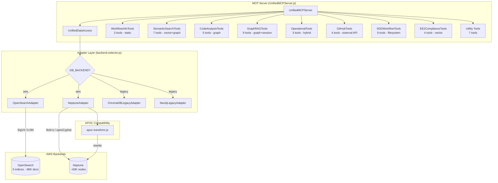
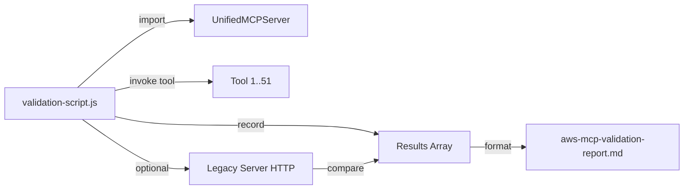

# Design Document: AWS MCP Server Validation

## Overview

This design covers the systematic validation of the AWS-native MCP server (`mdc-mcp-rag-aws`) running on EC2 with `DB_BACKEND=aws`. The server connects to OpenSearch (vector search via SigV4 auth) and Neptune (graph queries via Bolt protocol with openCypher) through the adapter pattern built in Phase 48.

The validation effort has three pillars:

1. **Connection validation** — Confirm both AWS backends (OpenSearch, Neptune) connect and return healthy status with expected data counts.
2. **Tool-by-tool validation** — Invoke all 51 tools across 9 modules against the AWS backends and record pass/fail results.
3. **Parity comparison** — Compare key query results between the AWS server and the legacy `eib-mcp-gateway` to confirm functional equivalence before cutover.

The validation is driven by a Node.js validation script that programmatically invokes each tool, captures results, and produces a markdown report.

## Architecture

The system under validation follows the adapter pattern established in Phase 48:



### Validation Script Architecture



The validation script instantiates `UnifiedMCPServer` with `DB_BACKEND=aws`, iterates through all 51 registered tools with representative arguments, and records each result as pass/fail/error. For parity checks, it also calls the legacy server via its dev tunnel HTTP endpoint.

## Components and Interfaces

### 1. Validation Script (`scripts/validate-aws-mcp.js`)

The main orchestrator that:
- Instantiates `UnifiedMCPServer` with AWS backend configuration
- Defines a test manifest mapping each tool name to representative arguments
- Invokes each tool, captures the response, and classifies as pass/fail/error
- Optionally invokes the legacy server for parity comparison on key queries
- Produces a structured markdown report

```javascript
// Test manifest entry structure
{
  toolName: 'search_documentation',
  args: { query: 'data assimilation', max_results: 5 },
  module: 'SemanticSearchTools',
  validate: (result) => {
    // Returns { passed: boolean, details: string }
    const text = result?.content?.[0]?.text || '';
    return {
      passed: text.includes('Search Results') && !text.includes('No results'),
      details: `Got ${text.length} chars of output`
    };
  }
}
```

### 2. Tool Test Manifest

A structured map of all 51 tools organized by module, each with:
- `toolName`: The registered MCP tool name
- `args`: Representative arguments that exercise the AWS backend
- `module`: The tool module category for reporting
- `validate`: A function that inspects the result and returns pass/fail with details

### 3. Parity Comparator

For the 5 key parity queries (Requirement 14), the script:
- Calls the AWS server tool
- Calls the legacy server via HTTP POST to the dev tunnel endpoint
- Compares results structurally (overlapping IDs, score deltas, node counts)
- Reports differences

### 4. Report Generator

Produces `docs/aws-mcp-validation-report.md` with:
- Summary: total/passed/failed/error counts
- Per-module breakdown table
- Detailed error logs for failures
- Parity comparison results
- Timestamp and environment info

### Key Interfaces

| Interface | Protocol | Auth | Purpose |
|-----------|----------|------|---------|
| OpenSearch | HTTPS | SigV4 (IAM role) | Vector k-NN search, index listing, health |
| Neptune | Bolt+s (WSS:8182) | IAM (neo4j.auth.none()) | openCypher graph queries |
| Legacy Server | HTTPS (dev tunnel) | Bearer token | Parity comparison queries |
| MCP stdio | stdin/stdout JSON-RPC | None | Normal tool invocation path |

## Data Models

### Validation Result

```typescript
interface ToolValidationResult {
  toolName: string;           // e.g. 'search_documentation'
  module: string;             // e.g. 'SemanticSearchTools'
  status: 'pass' | 'fail' | 'error';
  durationMs: number;         // Wall-clock execution time
  details: string;            // Human-readable result summary
  error?: string;             // Error message if status === 'error'
  stackTrace?: string;        // Stack trace if status === 'error'
}
```

### Parity Comparison Result

```typescript
interface ParityResult {
  queryName: string;          // e.g. 'search_documentation:data_assimilation'
  awsResult: any;             // Raw AWS server response
  legacyResult: any;          // Raw legacy server response
  match: boolean;             // Whether results are within tolerance
  differences: string[];      // List of specific differences found
}
```

### Validation Report

```typescript
interface ValidationReport {
  timestamp: string;
  environment: {
    dbBackend: 'aws';
    opensearchEndpoint: string;
    neptuneEndpoint: string;
    nodeVersion: string;
  };
  summary: {
    totalTools: number;
    passed: number;
    failed: number;
    errors: number;
  };
  byModule: Record<string, {
    total: number;
    passed: number;
    failed: number;
    errors: number;
  }>;
  results: ToolValidationResult[];
  parityResults?: ParityResult[];
}
```

### APOC Transform Input/Output

```typescript
// Input: Cypher query potentially containing APOC calls
type CypherQuery = string;

// Output: Neptune-compatible openCypher query
type OpenCypherQuery = string;

// transformApoc(cypher: CypherQuery): OpenCypherQuery
// Throws UnsupportedQueryError for unknown APOC procedures
```

### OpenSearch Collection-to-Index Mapping

```typescript
const COLLECTION_TO_INDEX: Record<string, string> = {
  'code-with-context-v8-0-0':       'mdc-code-context',
  'global-workflow-docs-v8-0-0':    'mdc-workflow-docs',
  'jjobs-v8-0-0':                   'mdc-jjobs',
  'community-summaries':            'mdc-community-summaries',
  'ee2-standards-v5-0-0-enhanced':  'mdc-ee2-standards',
};
```

## Correctness Properties

*A property is a characteristic or behavior that should hold true across all valid executions of a system — essentially, a formal statement about what the system should do. Properties serve as the bridge between human-readable specifications and machine-verifiable correctness guarantees.*

Most of this feature is integration testing against live AWS services (Neptune, OpenSearch), which is not suitable for property-based testing. However, the APOC transform module and the report generator contain pure functions with meaningful input variation that benefit from PBT.

### Property 1: APOC path.expand transform produces valid variable-length path

*For any* valid start node name, min depth, max depth (where min ≤ max and both are non-negative integers), and path variable name, calling `transformApoc` on a well-formed `CALL apoc.path.expand(...)` query SHALL produce a string containing `MATCH <pathVar> = (<startNode>)-[*<minDepth>..<maxDepth>]->()` and SHALL NOT contain the substring `apoc.`.

**Validates: Requirements 13.1**

### Property 2: APOC merge.node transform produces valid MERGE statement

*For any* valid label list, identity properties object, onCreate properties object, onMatch properties object, and alias name, calling `transformApoc` on a well-formed `CALL apoc.merge.node(...)` query SHALL produce a string containing `MERGE`, `ON CREATE SET`, and `ON MATCH SET` clauses with the alias name, and SHALL NOT contain the substring `apoc.`.

**Validates: Requirements 13.2**

### Property 3: Non-APOC query passthrough

*For any* Cypher query string that does not contain the substring `apoc.`, calling `transformApoc` SHALL return the exact same string unchanged (identity property).

**Validates: Requirements 13.3**

### Property 4: Unsupported APOC procedure error

*For any* Cypher query containing `apoc.<procedure>` where `<procedure>` is not one of the 5 supported procedures (`path.expand`, `algo.dijkstra`, `periodic.iterate`, `create.node`, `merge.node`), calling `transformApoc` SHALL throw an `UnsupportedQueryError` whose `procedure` property contains the unsupported procedure name.

**Validates: Requirements 13.4**

### Property 5: Report generation correctness

*For any* array of `TestResult` objects with varying `suite`, `status`, and `name` fields, the generated markdown report SHALL contain a summary where `total` equals the array length, `passed` equals the count of results with `status === 'pass'`, `failed` equals the count with `status === 'fail'`, and every unique `suite` value appears as a section heading in the report.

**Validates: Requirements 15.3, 15.4**

## Error Handling

### Connection Failures

- **Neptune unreachable**: `NeptuneAdapter.connect()` retries 4 times with exponential backoff (5s, 10s, 20s, 60s). After exhaustion, the test records `status: 'error'` with the connection error message. Other suites continue.
- **OpenSearch unreachable**: `OpenSearchAdapter.connect()` fails immediately (no retry). The test records `status: 'error'`. Graph-only tools can still be tested.
- **Legacy server unreachable**: Parity comparison is skipped entirely. The report notes "Legacy comparison skipped — server unreachable."

### Tool Invocation Failures

- Each tool call is wrapped in a try/catch with a per-tool timeout (default 30s).
- On timeout, the result is `status: 'error'` with message `Timeout after 30000ms`.
- On exception, the result captures `error.message` and `error.stack`.
- The script never aborts on a single tool failure — all tools are attempted.

### Assertion Failures

- Assertion failures produce `status: 'fail'` (not `'error'`).
- Each failed assertion includes the assertion type, expected value, and actual value snippet.
- Multiple assertions per test: all are evaluated even if the first fails.

### Partial Degradation

- If Neptune is down but OpenSearch is up, graph-dependent tools fail while vector tools pass.
- If OpenSearch is down but Neptune is up, vector-dependent tools fail while graph tools pass.
- Static tools (WorkflowInfoTools, SDDWorkflowTools) always run regardless of backend status.

## Testing Strategy

### Integration Tests (Primary)

The validation script itself IS the integration test suite. It tests all 51 tools against live AWS backends. Each tool invocation is a real call to Neptune/OpenSearch/GitHub.

Test execution:
```bash
node mcp_server_node/scripts/validate-aws-mcp.js
# Options:
#   --skip-legacy     Skip parity comparison with legacy server
#   --skip-github     Skip GitHub API tools (avoids rate limits)
#   --verbose         Print full response text for each tool
#   --timeout 60000   Per-tool timeout in ms (default: 30000)
```

### Property-Based Tests

Using `fast-check` (Node.js PBT library). Minimum 100 iterations per property.

Test file: `mcp_server_node/scripts/test-apoc-transform-properties.js`

Properties tested:
1. **Feature: aws-mcp-server-validation, Property 1**: APOC path.expand transform
2. **Feature: aws-mcp-server-validation, Property 2**: APOC merge.node transform
3. **Feature: aws-mcp-server-validation, Property 3**: Non-APOC passthrough
4. **Feature: aws-mcp-server-validation, Property 4**: Unsupported APOC error
5. **Feature: aws-mcp-server-validation, Property 5**: Report generation correctness

### Unit Tests (Example-Based)

Specific scenarios not covered by properties:
- Server startup with `DB_BACKEND=aws` resolves all imports (Req 1.1–1.4)
- `withRetry` retries exactly 4 times on persistent failure (Req 2.2)
- `withRetry` succeeds on second attempt (Req 2.2)
- OpenSearch `_toIndex()` maps all 5 known collection names correctly (Req 6.6)
- Static tools return expected content markers (Req 5.1–5.3, 11.1–11.5)

### Parity Tests

Compare AWS vs legacy results for 5 key queries (Req 14.1–14.5):
1. `search_documentation` with "data assimilation" — check document ID overlap
2. `get_code_context` with "setuprad" — check graph node names
3. `trace_full_execution_chain` with "JGLOBAL_FORECAST" — check chain nodes
4. `get_knowledge_base_status` — check counts within tolerance
5. `find_env_dependencies` with "HOMEgfs" — check script name overlap
