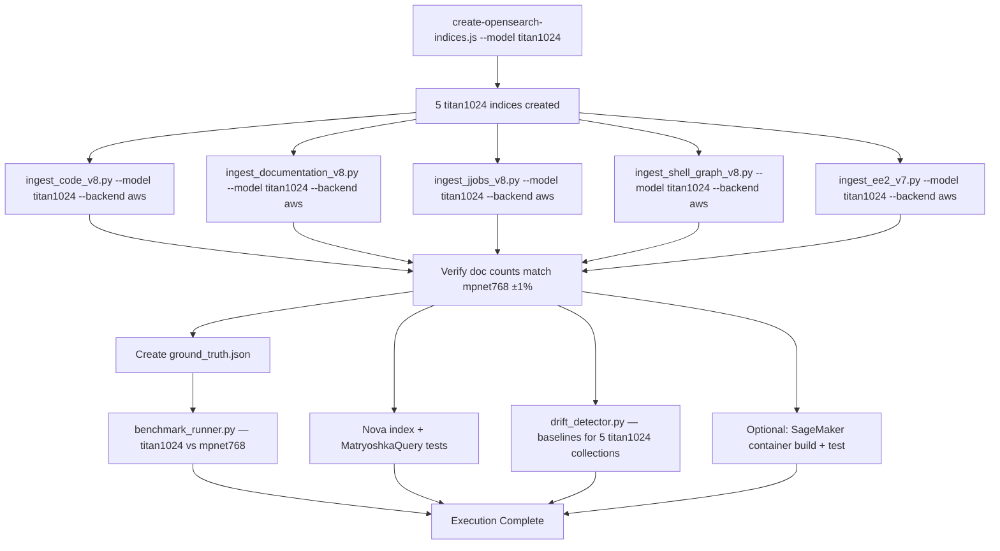

# Design Document: Bedrock Embedding Re-Ingestion

## Overview

This design covers the execution of the Bedrock embedding re-ingestion pipeline against existing AWS infrastructure. All code was built in Phase 49 (embedding registry, Bedrock provider, model-aware ingestion scripts, OpenSearch index creation, hybrid search, Matryoshka queries, benchmarking, drift detection). Phase 50/50b completed the S3 migration, populating 5 OpenSearch indices with 85,921 documents using mpnet768 embeddings.

This spec is an **execution plan**, not an architecture design. The work consists of:

1. Creating 5 new titan1024 OpenSearch indices (1024-dim, HNSW, cosinesimil)
2. Re-ingesting all 5 collections with Bedrock Titan V2 embeddings via existing `--model titan1024 --backend aws` flags
3. Creating a ground truth file and benchmarking titan1024 vs mpnet768
4. Testing Nova Matryoshka queries at multiple dimension levels
5. Establishing drift detection baselines for titan1024 collections
6. Optionally building and testing the SageMaker container for offloaded processing

### Key Infrastructure

| Component | Endpoint / Identifier |
|---|---|
| OpenSearch | `vpc-mdc-mcp-rag-search-5o72hixfx3rryikwb7l5px5sgq.us-east-1.es.amazonaws.com` |
| Neptune | `mdc-mcp-rag-neptune.cluster-ccdaimu4c86s.us-east-1.neptune.amazonaws.com:8182` |
| Bedrock Model | `amazon.titan-embed-text-v2:0` (1024-dim) |
| Nova Model | `amazon.nova-multimodal-embed-v1` (256/512/1024/3072-dim, Matryoshka) |
| S3 Drift Reports | `s3://mdc-mcp-rag-drift-reports/drift-reports/` |
| S3 Benchmark Reports | `s3://mdc-mcp-rag-benchmark-reports/benchmark-reports/` |

### Existing Collections (mpnet768 baseline)

| Index | Approx Docs |
|---|---|
| `mdc-code-context-mpnet768` | 60,576 |
| `mdc-workflow-docs-mpnet768` | 22,498 |
| `mdc-jjobs-mpnet768` | 700 |
| `mdc-community-summaries-mpnet768` | 2,113 |
| `mdc-ee2-standards-mpnet768` | 34 |
| **Total** | **85,921** |

## Architecture

Since all code is already built, the architecture is the existing Phase 49 pipeline. The execution flow is:



### Data Flow

Each ingestion script follows the same path:

1. `BaseIngester._parse_common_args()` reads `--model titan1024 --backend aws`
2. `EmbeddingModelRegistry.get_profile('titan1024')` returns the `ModelProfile` (Bedrock, 1024-dim)
3. `create_provider(profile)` returns a `BedrockProvider` instance
4. `CollectionNamer(profile).get_name(domain, version)` produces model-aware collection names (e.g., `code-with-context-v8-0-0-titan1024`)
5. `aws_backend._to_index()` maps collection names to OpenSearch index names (e.g., `mdc-code-context-titan1024`)
6. `OpenSearchVectorClient` bulk-indexes documents with 1024-dim Titan embeddings

## Components and Interfaces

All components are pre-built. This section documents the interfaces used during execution.

### Index Creation

- **Script**: `mcp_server_node/scripts/create-opensearch-indices.js`
- **CLI**: `node scripts/create-opensearch-indices.js --model titan1024`
- **Behavior**: Creates 5 indices with 1024-dim knn_vector, HNSW (ef_construction=512, m=16), cosinesimil space, BM25 `content` field. Idempotent — skips existing indices.

### Ingestion Scripts

| Script | Collection Domain | Target Index |
|---|---|---|
| `ingest_code_v8.py` | code-with-context | `mdc-code-context-titan1024` |
| `ingest_documentation_v8.py` | global-workflow-docs | `mdc-workflow-docs-titan1024` |
| `ingest_jjobs_v8.py` | jjobs | `mdc-jjobs-titan1024` |
| `ingest_shell_graph_v8.py` | community-summaries | `mdc-community-summaries-titan1024` |
| `ingest_ee2_v7.py` | ee2-standards | `mdc-ee2-standards-titan1024` |

All scripts accept `--model titan1024 --backend aws` flags. The `BedrockProvider` handles Titan API calls with exponential backoff on throttling errors.

### Embedding Provider Chain

- **`EmbeddingModelRegistry`** → `ModelProfile(short_name='titan1024', provider='bedrock', model_id='amazon.titan-embed-text-v2:0', dimensions=1024)`
- **`BedrockProvider`** → `boto3.client('bedrock-runtime').invoke_model()` with `{"inputText": text, "outputEmbeddingLength": 1024}`
- **Error handling**: `EmbeddingError` raised on API failures; ingestion scripts implement retry logic

### Search Components

- **`HybridSearchBuilder`** (`src/data/search/HybridSearchBuilder.js`): Builds BM25 + k-NN hybrid queries with RRF fusion. Auto-detects code identifiers (camelCase, snake_case, dot.notation, file paths) and boosts BM25 weight by 2x.
- **`MatryoshkaQuery`** (`src/data/search/MatryoshkaQuery.js`): Truncates query vectors to a specified prefix dimension and uses `script_score` cosine similarity for lower-dimension searches against Nova indices.

### Benchmarking

- **Script**: `mcp_server_node/scripts/benchmark_runner.py`
- **Input**: Ground truth JSON file mapping queries → expected relevant doc IDs
- **Output**: Precision@5, Precision@10, Recall@5, Recall@10, MRR, nDCG per model/search-mode. Markdown table + S3 upload.

### Drift Detection

- **Script**: `mcp_server_node/scripts/drift_detector.py`
- **CLI**: `python3 drift_detector.py <collection> --backend aws --sample-size 100`
- **Behavior**: Samples N documents, re-embeds with current model, computes cosine similarity. Uploads report to S3.

### SageMaker (Optional)

- **Dockerfile**: `mcp_server_node/scripts/Dockerfile.sagemaker`
- **Launcher**: `mcp_server_node/scripts/sagemaker_launcher.py`
- **CLI**: `python3 sagemaker_launcher.py ingest_ee2_v7.py --model titan1024 --backend aws --dry-run`

## Data Models

### OpenSearch Index Mapping (titan1024)

Each of the 5 titan1024 indices uses this mapping:

```json
{
  "settings": {
    "index": {
      "knn": true,
      "knn.algo_param.ef_search": 512,
      "number_of_shards": 2,
      "number_of_replicas": 1
    }
  },
  "mappings": {
    "properties": {
      "embedding": {
        "type": "knn_vector",
        "dimension": 1024,
        "method": {
          "name": "hnsw",
          "engine": "nmslib",
          "space_type": "cosinesimil",
          "parameters": { "ef_construction": 512, "m": 16 }
        }
      },
      "content": { "type": "text" },
      "metadata": { "type": "object", "dynamic": true },
      "source_file": { "type": "keyword" },
      "chunk_id": { "type": "keyword" },
      "collection_name": { "type": "keyword" },
      "model_profile": { "type": "keyword" }
    }
  }
}
```

### ModelProfile (titan1024)

```python
ModelProfile(
    short_name="titan1024",
    provider="bedrock",
    model_id="amazon.titan-embed-text-v2:0",
    dimensions=1024,
    provider_params={"outputEmbeddingLength": 1024}
)
```

### Ground Truth File Format

```json
{
  "queries": [
    {
      "query": "How does the forecast job handle restart files?",
      "collection": "global-workflow-docs",
      "relevant_doc_ids": ["doc-id-1", "doc-id-2", "doc-id-3"]
    }
  ]
}
```

### Drift Report Format

```json
{
  "collection_name": "mdc-code-context-titan1024",
  "sample_size": 100,
  "mean_similarity": 0.998,
  "min_similarity": 0.992,
  "drifted": false,
  "stale_documents": [],
  "timestamp": "2025-01-15T12:00:00Z"
}
```

### Benchmark Report Format

```json
{
  "queries": 20,
  "results": {
    "mpnet768-vector": { "precision_at_k": {5: 0.80, 10: 0.75}, "recall_at_k": {5: 0.40, 10: 0.60}, "mrr": 0.85, "ndcg": 0.78 },
    "titan1024-hybrid": { "...": "..." }
  },
  "timestamp": "2025-01-15T12:00:00Z"
}
```


## Correctness Properties

*A property is a characteristic or behavior that should hold true across all valid executions of a system — essentially, a formal statement about what the system should do. Properties serve as the bridge between human-readable specifications and machine-verifiable correctness guarantees.*

Most of this spec is operational execution (running existing scripts against live infrastructure), which is best validated by integration tests and smoke tests. However, three components have pure-function logic suitable for property-based testing:

### Property 1: MatryoshkaQuery truncation preserves prefix and uses script_score

*For any* query vector of length N and any target dimension D where 1 ≤ D < N, `MatryoshkaQuery.build(vector, { dimensions: D })` SHALL produce a `script_score` query whose `params.query_vector` is exactly the first D elements of the input vector.

**Validates: Requirements 7.2, 7.3**

### Property 2: HybridSearchBuilder hybrid mode produces dual-clause query

*For any* non-empty query text and any query vector, `HybridSearchBuilder.build(text, vector, { searchMode: 'hybrid' })` SHALL produce a query body containing both a `match` clause on the `content` field and a `knn` clause on the `embedding` field, with `minimum_should_match: 1`.

**Validates: Requirements 10.1**

### Property 3: Code identifier detection auto-boosts BM25 weight

*For any* query string containing at least one code identifier pattern (camelCase, snake_case, dot.notation, or file/path), and any base `bm25Weight` W, `HybridSearchBuilder.build(query, vector, { searchMode: 'hybrid', bm25Weight: W })` SHALL produce a `match` clause with boost equal to `2 * W`.

**Validates: Requirements 10.2**

## Error Handling

Since this is an execution spec using existing code, error handling is already implemented. Key error paths during execution:

### Bedrock API Throttling
- **Trigger**: Bedrock returns `ThrottlingException` during embedding generation
- **Handler**: `BedrockProvider` raises `EmbeddingError`; ingestion scripts implement retry with exponential backoff
- **Operator action**: Monitor logs for repeated throttling; consider reducing batch concurrency or using SageMaker for offloaded processing

### OpenSearch Index Already Exists
- **Trigger**: `create-opensearch-indices.js` finds an existing index
- **Handler**: Script skips the index and logs `[SKIP] <index> — already exists`
- **Operator action**: None required — idempotent behavior

### Document Count Mismatch
- **Trigger**: titan1024 doc count differs from mpnet768 baseline by more than 1%
- **Handler**: No automatic handler — operator must investigate
- **Operator action**: Check ingestion logs for errors, verify source data hasn't changed, re-run failed collections

### Drift Detection Threshold Breach
- **Trigger**: `drift_detector.py` reports `mean_similarity < 0.95`
- **Handler**: Script exits with code 1 and prints warning
- **Operator action**: Investigate whether Bedrock model version changed or source data was modified

### SageMaker Job Failure
- **Trigger**: SageMaker Processing Job fails
- **Handler**: `sagemaker_launcher.py --status <job_name>` reports failure reason
- **Operator action**: Check CloudWatch logs, verify IAM role permissions, retry

### Missing Environment Variables
- **Trigger**: Required env vars (`OPENSEARCH_ENDPOINT`, `AWS_REGION`, `SAGEMAKER_ROLE_ARN`) not set
- **Handler**: Scripts exit with descriptive error messages
- **Operator action**: Set the required environment variables before re-running

## Testing Strategy

### Assessment: PBT Applicability

This spec is primarily an **execution/operations** spec — running existing scripts with new flags against live AWS infrastructure. Most acceptance criteria are integration tests or smoke tests. However, three pure-function components (MatryoshkaQuery, HybridSearchBuilder) are suitable for property-based testing.

### Property-Based Tests (3 properties)

- **Library**: `fast-check` (JavaScript, already available in the project)
- **Iterations**: Minimum 100 per property
- **Tag format**: `Feature: bedrock-embedding-reingestion, Property N: <property_text>`

| Property | Component | What Varies |
|---|---|---|
| 1: Truncation preserves prefix | `MatryoshkaQuery.build()` | Vector length, target dimensions |
| 2: Hybrid dual-clause structure | `HybridSearchBuilder.build()` | Query text, vector, options |
| 3: Code identifier BM25 boost | `HybridSearchBuilder._containsCodeIdentifiers()` + `build()` | Query strings with/without code patterns, bm25Weight |

### Integration Tests

The bulk of validation is integration testing against live AWS infrastructure:

| Test | Script/Command | Validates |
|---|---|---|
| Index creation | `node create-opensearch-indices.js --model titan1024` | Req 1.1–1.5 |
| Code ingestion | `python3 ingest_code_v8.py --model titan1024 --backend aws` | Req 2.1–2.5 |
| Docs ingestion | `python3 ingest_documentation_v8.py --model titan1024 --backend aws` | Req 3.1–3.3 |
| Remaining ingestion | 3 scripts for jjobs, community-summaries, ee2-standards | Req 4.1–4.4 |
| Benchmark run | `python3 benchmark_runner.py ground_truth.json --vector-spaces ...` | Req 6.1–6.4 |
| Nova + Matryoshka | Create nova1024 index, ingest subset, run queries at 256/512/1024 | Req 7.1, 7.4 |
| Drift baselines | `python3 drift_detector.py <collection> --backend aws --sample-size 100` × 5 | Req 8.1–8.4 |
| SageMaker (optional) | `docker build`, `docker push`, `sagemaker_launcher.py --dry-run` | Req 9.1–9.5 |
| Hybrid search | 5+ hybrid queries against titan1024 indices | Req 10.1–10.4 |

### Smoke Tests

Post-execution verification checks:

- Verify 10 total indices via `_cat/indices` (Req 1.5)
- Verify titan1024 doc counts match mpnet768 ±1% per collection (Req 2.3, 3.3, 4.4)
- Verify drift baselines show mean_similarity ≥ 0.99 (Req 8.2)
- Verify ground truth file exists at expected path with ≥ 20 queries (Req 5.1, 5.4)

### Unit Tests (Example-Based)

- Verify `SageMakerJobLauncher.estimate_cost()` returns correct cost for known instance types (Req 9.3)
- Verify ground truth file format matches `benchmark_runner.py` expectations (Req 5.2, 5.4)
- Verify `create-opensearch-indices.js` skips existing indices on second run (Req 1.4)
