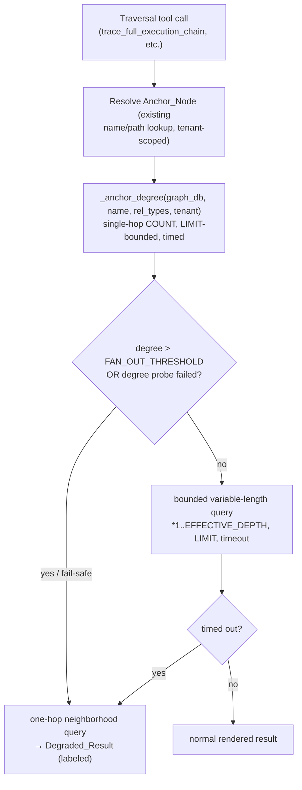

# Design Document — `bounded-graph-traversal`

## Overview

Add bounded-traversal guards to the five graph-traversal tools so a query from a
hyper-connected node (`JGLOBAL_FORECAST`, 500+ edges) degrades to a labeled
partial result instead of timing out or OOM-ing Neptune. The change is confined
to the tool layer (`graph_rag.py`, `code_analysis.py`) plus one additive parameter
on `NeptuneAdapter.query` and a new shared constants/helpers module
(`_traversal_bounds.py`). No ingestion, schema, or tenant-logic change; no
re-ingestion.

Three guards stack, cheapest first:

1. **Pre-flight degree check** — a single-hop `count` over the traversal's edge
   set tells us the Anchor_Node's degree *before* any variable-length expansion.
   Over the Fan_Out_Threshold → skip expansion, return a one-hop Degraded_Result.
2. **Effective depth cap** — clamp caller `max_depth` to a conservative per-tool
   ceiling and always emit an explicit `*1..N` bound (never unbounded).
3. **Statement timeout backstop** — every traversal query carries a client-side
   timeout (via `asyncio.wait_for`); on timeout the tool returns a Degraded_Result
   rather than raising.

The degree check is the primary fix (it prevents the explosion). The depth cap and
timeout are defense-in-depth for moderately-connected nodes and unforeseen shapes.

## Architecture



### Affected tools and their current unbounded patterns

| Tool | Helper | Current pattern | After |
|------|--------|-----------------|-------|
| `trace_full_execution_chain` | `_cross_language_nodes` | `(start)-[:6types*1..10]->(n)` LIMIT 200 | degree-gated, `*1..5`, timeout |
| `trace_execution_path` / `find_callers_callees` | `_call_chain` | `(f)-[:CALLS*1..5]->(callee)` LIMIT 200 | degree-gated, `*1..4`, timeout |
| `trace_data_flow` | inline shortestPath | `shortestPath(*1..10)` LIMIT 3 | depth-capped `*1..5`, timeout |
| `find_dependencies` | `_circular_dependencies` | `(a)-[:IMPORTS*2..5]->(a)` LIMIT 20 | timeout + LIMIT push (no anchor, global) |
| `get_change_impact` | indirect 2-hop | fixed `-[:..]->()-[:..]->()` | timeout (already shallow) |

`shortestPath` is less explosive than open variable-length expansion (Neptune
optimizes it), so for `trace_data_flow` the depth cap + timeout suffice; the degree
gate is applied to the open-expansion tools.

## Components and Interfaces

### New module: `mcp_server_python/scripts/../src/tools/_traversal_bounds.py`

Single home for the tunables (R6.1) and the shared helpers.

```python
import os

def _int_env(name: str, default: int) -> int:
    try:
        v = int(os.environ.get(name, ""))
        return v if v > 0 else default
    except (TypeError, ValueError):
        return default

def _float_env(name: str, default: float) -> float:
    try:
        v = float(os.environ.get(name, ""))
        return v if v > 0 else default
    except (TypeError, ValueError):
        return default

# R6.1, R6.2, R6.3 — one location, env-overridable, conservative defaults.
FAN_OUT_THRESHOLD: int = _int_env("MCP_TRAVERSAL_FANOUT_THRESHOLD", 100)
FULL_CHAIN_DEPTH:  int = _int_env("MCP_TRAVERSAL_FULLCHAIN_DEPTH", 5)
CALL_CHAIN_DEPTH:  int = _int_env("MCP_TRAVERSAL_CALLCHAIN_DEPTH", 4)
DATA_FLOW_DEPTH:   int = _int_env("MCP_TRAVERSAL_DATAFLOW_DEPTH", 5)
RESULT_LIMIT:      int = _int_env("MCP_TRAVERSAL_RESULT_LIMIT", 200)
TIMEOUT_S:       float = _float_env("MCP_TRAVERSAL_TIMEOUT_S", 30.0)
```

#### `async def anchor_degree(graph_db, name, rel_types, tenant, scope_pred="") -> int | None`

Runs a single-hop, count-only probe — never a variable-length pattern (R1.4):

```cypher
MATCH (a)-[r:<rel_types>]-(x)
WHERE (a.name = $name OR a.path = $name) <scope_pred>
RETURN count(r) AS deg
```

- `rel_types` is the pipe-joined edge set the caller will traverse (so the degree
  reflects the relevant fan-out).
- Direction-agnostic `-[r]-` for the probe (counts both in and out; conservative).
- Passed `tenant=` so the adapter applies label-prefix rewriting, and the
  caller's `scope_pred` (the `_scope_and(...)` fragment) so it is tenant-scoped
  exactly like the real traversal.
- Wrapped with the Statement_Timeout. On exception or timeout returns `None`,
  which callers treat as "assume hub" (R1.5 fail-safe).

#### `def effective_depth(requested: int, ceiling: int) -> tuple[int, bool]`

Returns `(min(requested, ceiling), clamped_flag)`. The flag drives the
response note (R2.3).

#### `def degraded_notice(anchor, degree, threshold) -> str`

Renders the standard `[INFO] Highly connected node ...` block (R4.2, R4.3).

### `NeptuneAdapter.query` — additive timeout parameter (R5.1, R5.5)

```python
async def query(self, cypher, params=None, *, tenant=None,
                timeout: float | None = None) -> list[dict]:
    ...
    if tenant is not None and tenant.label_prefix:
        cypher = self._rewrite_cypher(cypher, tenant)
    params = params or {}
    coro = asyncio.to_thread(self._run_session, cypher, params)
    if timeout is not None:
        try:
            rows = await asyncio.wait_for(coro, timeout=timeout)
        except asyncio.TimeoutError as exc:
            self._metrics["queries_failed"] += 1
            raise NeptuneAdapterError(
                f"query exceeded {timeout}s statement timeout",
                status=None, cause=exc,
            ) from exc
    else:
        rows = await coro
    return rows
```

Client-side enforcement via `asyncio.wait_for` is the portable backstop (R5.5).
Note: the underlying thread keeps running until Neptune returns, but the *tool*
unblocks at the timeout and renders a Degraded_Result; the orphaned thread is
bounded by Neptune's own cluster `neptune_query_timeout`. (A follow-up could pass
the HTTP `queryTimeoutMillis` to abort server-side; out of scope here, noted in
Open Questions.)

Default `timeout=None` preserves every existing call site unchanged (R5.4, R7.3).

### Tool-layer integration pattern

Each open-expansion traversal helper gains the same three-step preamble. Example
for `_call_chain`:

```python
from src.tools._traversal_bounds import (
    CALL_CHAIN_DEPTH, RESULT_LIMIT, TIMEOUT_S, FAN_OUT_THRESHOLD,
    anchor_degree, effective_depth, degraded_notice,
)

async def _call_chain(graph_db, function_name, max_depth, entity_type):
    rel_set = "SOURCES|INVOKES|EXECUTES" if entity_type == "shell" else "CALLS"
    deg = await anchor_degree(graph_db, function_name, rel_set,
                              _tenant(), _scope_and("a"))
    if deg is None or deg > FAN_OUT_THRESHOLD:
        return _ONE_HOP, deg            # caller renders Degraded_Result
    depth, clamped = effective_depth(max_depth, CALL_CHAIN_DEPTH)
    cypher = (f"MATCH p=(f)-[:{rel_set}*1..{depth}]->(callee) "
              f"WHERE f.name = $name{_scope_and('f')} "
              f"RETURN callee.name AS callee, callee.filepath AS file, "
              f"length(p) AS depth LIMIT {RESULT_LIMIT}")
    rows = await graph_db.query(cypher, {"name": function_name},
                                tenant=_tenant(), timeout=TIMEOUT_S)
    ...
```

The one-hop Degraded_Result query is a plain single-hop expand with the same
`rel_set`, `LIMIT RESULT_LIMIT`, and timeout.

`trace_full_execution_chain`'s `_cross_language_nodes` follows the same shape with
`FULL_CHAIN_DEPTH` and the six-edge `CROSS_LANGUAGE_EDGES` set. `trace_data_flow`
applies `effective_depth(max_depth, DATA_FLOW_DEPTH)` + timeout to its shortestPath
(no degree gate — shortestPath does not explode the same way). `_circular_dependencies`
gets the timeout + keeps its `LIMIT 20`.

### LIMIT push-down (R3.3)

Today `get_change_impact`'s indirect query and `trace_data_flow`'s outgoing query
do `... ORDER BY ... LIMIT n`, which forces full materialization before the sort.
For the variable-length open-expansion helpers (`_call_chain`,
`_cross_language_nodes`) the queries already `RETURN ... LIMIT n` with no trailing
re-sort, so Neptune can stop enumerating early once the gate lets them run. The
design keeps those free of post-`WITH` sorts so the `LIMIT` stays push-down-able.

## Data Models

No new persistent data. In-memory only:

```python
@dataclass(frozen=True)
class TraversalBudget:
    depth: int          # effective depth after clamp
    depth_clamped: bool # whether caller max_depth was reduced
    limit: int          # row limit applied
    timeout_s: float    # statement timeout applied

@dataclass(frozen=True)
class DegreeProbe:
    degree: int | None  # None = probe failed/timed out -> treat as hub
    is_hub: bool         # degree is None or > FAN_OUT_THRESHOLD
```

The graph schema, node properties, and relationship types are unchanged.

## Correctness Properties

### Property 1: Bounded depth always

For any caller-supplied `max_depth` (including negative, zero, or very large
values), every variable-length pattern a Traversal_Tool emits has an explicit
finite upper bound `*1..N` with `1 <= N <=` the tool's Effective_Depth ceiling.

**Validates: Requirements 2.1, 2.2, 2.4**

### Property 2: Hub short-circuit

For any Anchor_Node whose measured Node_Degree exceeds the Fan_Out_Threshold (or
whose degree probe fails), the Traversal_Tool issues no variable-length expansion
query and returns a Degraded_Result that is a successful (non-`[ERROR]`) response.

**Validates: Requirements 1.2, 1.5, 4.1, 4.4**

### Property 3: Non-hub equivalence

For any Anchor_Node whose Node_Degree is within the Fan_Out_Threshold and whose
natural result set is within the row LIMIT, the Traversal_Tool returns the same
result set (same nodes/edges, same ordering where previously defined) as the
pre-feature implementation.

**Validates: Requirements 3.4, 7.3**

### Property 4: Timeout never raises

For any traversal query that exceeds its Statement_Timeout, the Traversal_Tool
returns either a Degraded_Result or a clear timeout notice — never an unhandled
exception propagated to the caller.

**Validates: Requirements 5.3, 8.1**

### Property 5: Tenant scoping preserved

Every query a Traversal_Tool emits (degree probe, one-hop degraded, and the
variable-length expansion) carries the same tenant label-prefix rewriting and
`_scope_and` predicate the pre-feature traversal used, so results never cross
tenant boundaries.

**Validates: Requirements 7.4, 7.5**

## Error Handling

| Condition | Behavior | Requirement |
|-----------|----------|-------------|
| Degree probe times out / errors | treat as hub → Degraded_Result | 1.5 |
| Anchor degree > threshold | skip expansion → one-hop Degraded_Result | 1.2, 4.1 |
| Expansion query times out | catch `NeptuneAdapterError` (timeout) → Degraded_Result | 5.3 |
| One-hop degraded query also times out | return timeout notice (still non-`[ERROR]` content) | 4.4, 5.3 |
| `max_depth` ≤ 0 or huge | clamp to `[1, ceiling]` | 2.1 |
| Anchor not found | existing "not found" path, unchanged | 7.3 |

All timeout/guard events are logged at info level, ASCII-only, no payloads (R8.1, R8.2).

## Testing Strategy

### Unit tests (`tests/unit/test_traversal_bounds.py`, new)

- `effective_depth`: clamps large/zero/negative `max_depth` into `[1, ceiling]`;
  sets the clamped flag correctly.
- `anchor_degree`: returns the count for a small node; returns `None` on a mocked
  query exception/timeout (fail-safe).
- `degraded_notice`: includes node name, measured degree, and threshold.
- Env overrides: setting `MCP_TRAVERSAL_*` changes the module constants on reload;
  invalid values fall back to defaults.
- `NeptuneAdapter.query(timeout=...)`: mocked slow `_run_session` → raises
  `NeptuneAdapterError` with timeout message; `timeout=None` path unchanged.

### Tool tests (extend existing `test_code_analysis_tools.py` / `test_graph_rag_tools.py`)

- Hub path: mock `MockGraphDB` so the degree probe returns > threshold; assert the
  tool returns the Degraded_Result (one-hop, labeled, non-`[ERROR]`) and that no
  variable-length query was issued (inspect `call_log` for absence of `*1..`).
- Non-hub path: degree under threshold → assert the bounded `*1..N` query is
  issued with the capped depth and `LIMIT`, and the rendered result matches the
  pre-feature expectation.
- Timeout path: mock the expansion query to raise the timeout error → assert
  Degraded_Result, no exception.
- Tenant scoping: assert every emitted query (probe, degraded, expansion) is
  called with `tenant=` set and carries the `_scope_and` predicate.

### Property-based tests (`tests/properties/test_traversal_bounds_props.py`, new)

One Hypothesis test per correctness property:

- P1: random `max_depth` (incl. negative/zero/huge) → emitted pattern always
  `*1..N` with `1 <= N <= ceiling`.
- P2: random degree values; degree > threshold or `None` → Degraded_Result,
  no expansion query.
- P3: non-hub fixture with a deterministic small graph → byte-equal rendered
  output vs the pre-feature snapshot.
- P4: expansion mocked to time out at random points → never raises.
- P5: random tenant ids → every emitted query carries the tenant.

### Live validation (gated, Phase A — operator-run)

After deploy to a candidate runtime version, call
`trace_full_execution_chain(start="JGLOBAL_FORECAST", tenant_id="gw")` and
`find_callers_callees(function_name="JGLOBAL_FORECAST")` against the live `gw`
baseline. Confirm a bounded Degraded_Result returns within the timeout instead of
the prior OOM/timeout, and that a normal node (e.g. `setuprad`) still returns its
full call graph.

## Open Questions

1. **Server-side abort vs client-side timeout.** This design enforces the timeout
   client-side (`asyncio.wait_for`), which unblocks the tool but leaves the Neptune
   thread running until the cluster `neptune_query_timeout` fires. A stronger
   version would pass the openCypher `queryTimeoutMillis` HTTP parameter so Neptune
   aborts the statement. Deferred — needs confirmation the vendored
   `NeptuneHTTPAdapter` forwards that parameter. Documented for a follow-up.
2. **Per-tool vs global Fan_Out_Threshold.** Starting with a single global
   threshold (100). If different tools need different thresholds (cross-language
   chains tolerate fewer than single-edge call chains), promote to per-tool
   constants — the constants module already isolates this.
3. **Degree probe direction.** The probe counts both directions (`-[r]-`). If a
   directional traversal (forward-only) has a hub only on the reverse side, the
   probe is conservative (may degrade a query that would have been fine). Accepted
   as the safe default; revisit if it over-triggers.
