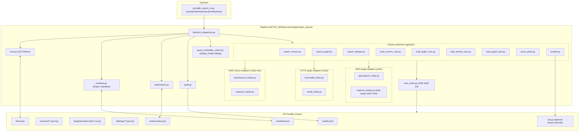
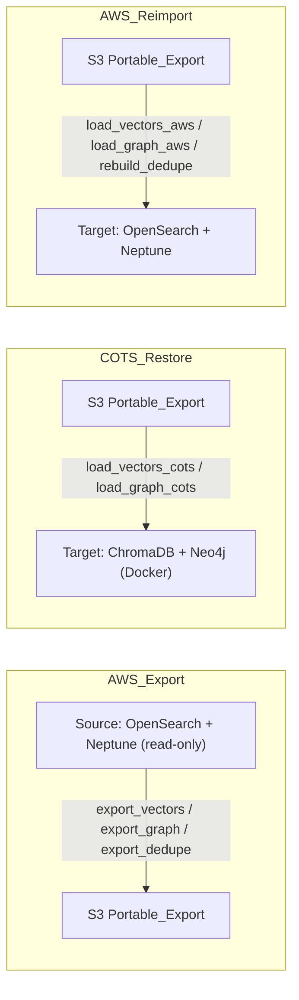
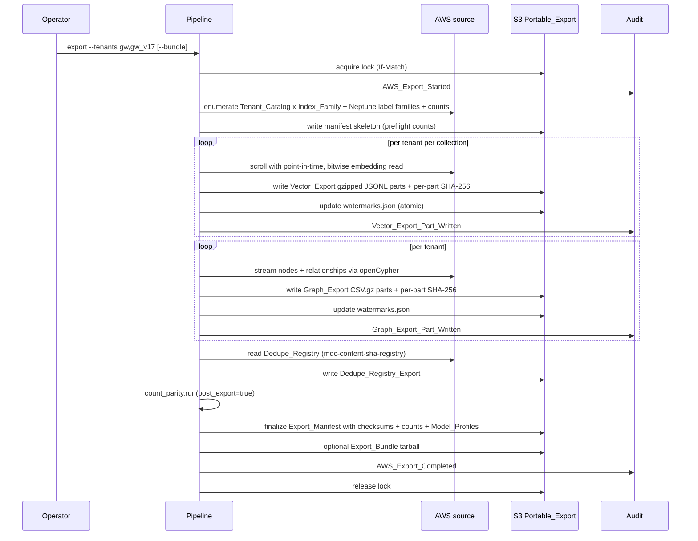

# Design Document — `cross-platform-data-persistence`

## Overview

The `Cross_Platform_Data_Persistence_System` is the **outbound mirror** of the
inbound `migrate-to-aws.js` pipeline that originally moved the GOTS Docker /
ChromaDB + Neo4j stack into AWS. It produces an engine-neutral
`Portable_Export` of the entire Knowledge_Base in S3, which can then be
**COTS_Restore**d into ChromaDB + Neo4j on a Docker host or **AWS_Reimport**ed
back into OpenSearch + Neptune at a later date — the round-trip that the
funding-resilience case rests on.

Two persistence modes are named in the requirements:

- **Native_Snapshot mode** — AWS-only, fast, engine-proprietary. Owned by
  `nih-sandbox-cost-control`. Referenced here, not implemented here.
- **Portable_Export mode** — engine-neutral, cross-platform. The new
  capability; everything below is about this mode.

Three transfer directions are supported, each implemented as a discrete
operator-invokable phase set:

- **AWS_Export** — read OpenSearch + Neptune, write Vector_Export +
  Graph_Export to S3.
- **COTS_Restore** — read Portable_Export from S3, load into ChromaDB + Neo4j.
- **AWS_Reimport** — read Portable_Export from S3, load into OpenSearch +
  Neptune.

The central design choice is that **the Portable_Export in S3 is the
contract**. Every direction writes or reads exactly the same artifacts under
the same layout, validated against the same schema, verified by the same
Count_Parity_Check. The pipeline is **read-only on every source** and applies
operator gating before any destructive write to a target.

The deliverables land at `SETUP_AWS/provisioning/portable_export/` alongside
the existing host-provisioning runbooks.

## Architecture

### Component view



### Direction pipelines (which adapters serve as Source vs Target)



### AWS_Export sequence



### COTS_Restore sequence

```mermaid
sequenceDiagram
  participant O as Operator
  participant P as Pipeline
  participant S3 as S3 Portable_Export
  participant CD as ChromaDB
  participant N4 as Neo4j
  participant V as Verifier
  participant A as Audit

  O->>P: restore --artefact <s3-or-bundle> --target cots
  P->>S3: read + validate Export_Manifest (schema_version)
  P->>P: query_embedder_check vs Model_Profile per collection
  P->>CD: probe non-empty?
  P->>N4: probe non-empty?
  P->>O: confirmation gate (display plan, demand phrase or --yes)
  P->>A: COTS_Restore_Started (Query_Compatible / Query_Incompatible flags)
  loop per Vector_Export part
    P->>S3: read part, verify SHA-256
    P->>CD: collection.add(ids, documents, embeddings, metadatas) [bitwise; no recompute]
    P->>S3: update watermarks.json
  end
  loop per Graph_Export part
    P->>S3: read part, verify SHA-256
    P->>N4: bulk import via neo4j-admin import or transactional write
  end
  P->>V: Count_Parity_Check (source manifest vs CD/N4 destination)
  alt Verifier passes
    P->>A: COTS_Restore_Completed (with Query_Compatible flags)
  else Verifier fails
    P->>A: Verifier_Failed; exit non-zero
  end
```

### AWS_Reimport sequence

```mermaid
sequenceDiagram
  participant O as Operator
  participant P as Pipeline
  participant S3 as S3 Portable_Export
  participant OW as OpenSearch
  participant NL as Neptune-loader
  participant V as Verifier
  participant A as Audit

  O->>P: reimport --artefact s3://... --env <name>
  P->>S3: read + validate Export_Manifest
  P->>OW: probe targets non-empty?
  P->>O: confirmation gate
  P->>A: AWS_Reimport_Started
  loop per Vector_Export part
    P->>OW: ensure index exists with knn_vector mapping matching Model_Profile dim
    P->>S3: read part, verify SHA-256
    P->>OW: bulk index (preserve embedding bytes)
  end
  P->>NL: start Neptune bulk-loader job pointing at <prefix>/graph/<tenant>/
  P->>NL: poll until LOAD_COMPLETED
  P->>P: rebuild Dedupe_Registry from re-imported content (deterministic)
  P->>V: Count_Parity_Check (manifest vs OS/Neptune destination)
  alt pass
    P->>A: AWS_Reimport_Completed
  else fail
    P->>A: Verifier_Failed; exit non-zero
  end
```

## Format Decisions

### Vector_Export: gzipped JSONL (primary)

Requirement 13.1 explicitly mandates gzipped exports, and the inbound migration
already uses gzipped JSON. Sticking to the same shape simplifies the symmetry
contract: same format on both inbound and outbound paths.

Per-record schema (one JSON object per line):

```json
{
  "id": "doc_8f3a1c2e",
  "content": "...source text used for embedding...",
  "embedding": [0.0123, -0.0456, ...],
  "metadata": {"source_file": "...", "tenant_id": "gw_v17", "...": "..."},
  "model_profile": "titan1024",
  "collection_name": "gw_v17_mdc-code-context-titan1024",
  "chunk_id": "chunk_42"
}
```

The `embedding` array length equals the Model_Profile's `dimensions`
(mpnet768=768, titan1024=1024, nova256/512/1024/3072 sized accordingly).
Numeric encoding follows JSON's standard double-precision float text
representation; bitwise preservation is verified against the source via
per-part SHA-256.

A target part size of ≤ 64 MB compressed keeps any single part downloadable
on a constrained host and keeps SHA-256 verification fast.

### Graph_Export: openCypher property-graph CSV (Neptune-loader format)

Neptune's bulk-loader CSV format is a superset of `neo4j-admin import`'s CSV
format — the same files load on both engines unchanged. This satisfies R3.2
(Neptune bulk loader) and R2.2 (Neo4j load) with one artifact per part.

Layout per tenant:

```
<prefix>/graph/<tenant>/
  nodes/
    File-<part>.csv.gz
    FortranSubroutine-<part>.csv.gz
    ShellScript-<part>.csv.gz
    ...
  rels/
    CALLS-<part>.csv.gz
    USES-<part>.csv.gz
    INVOKES-<part>.csv.gz
    ...
```

One CSV per (label, part) so node-by-label parallelism and partial restores
are clean. Part size target ≤ 256 MB compressed.

For tenant-prefixed labels (e.g. `GW_V17_FortranSubroutine`), the prefix is
preserved verbatim (R7.3) so `AWS_Reimport` recreates the same labels and
`COTS_Restore` lands them in Neo4j with the same names — Neo4j has no native
multi-tenancy, but it accepts arbitrary label strings, so the prefix becomes
the tenant scoper.

### Export_Bundle (offline transfer, R12.1)

When the Operator passes `--bundle`, the pipeline produces a single
`<prefix>.tar.gz` containing the `manifest.json`, every Vector_Export part,
every Graph_Export part, and the Dedupe_Registry_Export, in the same internal
layout. Restore from a bundle is byte-equivalent to restore from S3 (R12.4).

### Lock + watermarks: S3 If-Match conditional writes

Same mechanism as `nih-sandbox-cost-control`'s state file. Native S3
conditional PUT on `If-Match: <etag>` is sufficient and keeps the storage
footprint inside the already-required state bucket. Lock at
`<prefix>/lock.json`; watermark at `<prefix>/watermarks.json`. Both updated
atomically.

### Compression and integrity (R13.1, R13.2, R13.3)

- All Vector_Export and Graph_Export parts are gzipped.
- Per-part SHA-256 computed during write and recorded in the Export_Manifest.
- Restore verifies each part's SHA-256 against the manifest before consuming
  it; mismatch refuses that part and exits non-zero.

## Components and Interfaces

### Pipeline package (`SETUP_AWS/provisioning/portable_export/`)

```
portable_export/
  __init__.py
  portable_export_cli.py        # argparse: {export|restore|reimport|verify|status}
  direction_dispatcher.py       # direction -> {source_adapters, target_adapters, defaults}
  config.py                     # env -> S3 buckets, KMS key, endpoints, tenant catalog
  lock.py                       # S3 If-Match acquire/release/break
  manifest.py                   # Export_Manifest dataclass + reader/writer
  watermarks.py                 # atomic JSON updates
  audit.py                      # JSONL records to CW + per-op S3 + local fallback
  query_embedder_check.py       # Model_Profile -> available embedder matrix
  kms_writer.py                 # SSE-KMS PUT helpers + streaming SHA-256
  bundle.py                     # tar.gz pack/unpack for Export_Bundle
  adapters/
    __init__.py                 # SourceReader / TargetWriter protocols
    opensearch_reader.py        # scroll / scan; enumerate Index_Family
    neptune_reader.py           # openCypher streaming export
    chromadb_writer.py          # collection.add(); pinned ChromaDB version
    neo4j_writer.py             # neo4j-admin import shell-out OR transactional
    opensearch_writer.py        # index ensure + bulk insert; knn_vector mapping
    neptune_loader.py           # POST /loader; poll status
  phases/
    export_vectors.py
    export_graph.py
    export_dedupe.py
    load_vectors_cots.py
    load_graph_cots.py
    load_vectors_aws.py
    load_graph_aws.py
    rebuild_dedupe_aws.py
    count_parity.py
  schemas/
    vector_export_schema.json   # JSONL record shape
    graph_node_csv_schema.json  # Neptune-loader CSV header rules
    graph_rel_csv_schema.json
    manifest_schema.json
  tests/
```

### Adapter protocols

```python
class SourceReader(Protocol):
    """Read-only side. Strict invariant: no source mutation, ever."""
    def list_index_families(self, tenants: list[str]) -> list[str]: ...
    def scroll_records(self, index: str, batch: int) -> Iterator[list[dict]]: ...
    def list_graph_label_families(self, tenants: list[str]) -> list[str]: ...
    def stream_nodes(self, tenant: str) -> Iterator[NodeRow]: ...
    def stream_relationships(self, tenant: str) -> Iterator[RelRow]: ...
    def read_dedupe_registry(self) -> Iterator[DedupeRow]: ...

class TargetWriter(Protocol):
    """Write side. Pre-write probe + confirmation gate handled outside."""
    def probe_non_empty(self) -> dict: ...   # per-collection / per-tenant
    def ensure_collection_or_index(self, name: str, model_profile: str): ...
    def bulk_insert_vectors(self, collection: str, records: Iterable[dict]): ...
    def load_graph_bundle(self, tenant: str, nodes_uris, rels_uris): ...
    def rebuild_dedupe(self) -> int: ...
    def count_collection(self, collection: str) -> int: ...
    def count_graph(self, tenant: str) -> tuple[int, int]: ...
```

The phase modules are direction-agnostic — they call
`source.scroll_records()` and `target.bulk_insert_vectors()` and never
branch on which engine is on either side.

### Direction dispatcher

| Direction | Source readers | Target writers | Default Tenant_Catalog | Default scope |
|-----------|---------------|----------------|------------------------|----------------|
| `AWS_Export` | OpenSearch + Neptune | (none — writes to S3) | every tenant present | full vectors + graph + dedupe |
| `COTS_Restore` | (reads S3) | ChromaDB + Neo4j | manifest's `tenants` | full restore |
| `AWS_Reimport` | (reads S3) | OpenSearch + Neptune | manifest's `tenants` | full restore + dedupe rebuild |

### CLI surface

```
portable_export_cli.py export    --env <name> [--tenants gw,gw_v17]
                                   [--collections code,docs] [--vectors-only|--graph-only]
                                   [--prefix s3://.../portable-export/<env>/<id>/]
                                   [--bundle] [--resume] [--dry-run]

portable_export_cli.py restore   --artefact <s3-prefix-or-bundle-path>
                                   --target cots [--chromadb-url URL] [--neo4j-uri URI]
                                   [--tenants ...] [--collections ...]
                                   [--yes] [--break-lock] [--resume] [--dry-run]

portable_export_cli.py reimport  --artefact s3://...
                                   --env <name>
                                   [--tenants ...] [--collections ...]
                                   [--yes] [--resume] [--dry-run]

portable_export_cli.py verify    --artefact <s3-or-bundle>
                                   [--target {aws|cots}] [--env <name>]
                                   [--tolerance 0.0]

portable_export_cli.py status    --artefact <s3-or-bundle>
```

`status` reads manifest + watermarks + lock without acquiring the lock.
`--dry-run` prints the full plan with zero mutation.

## Data Models

### Export_Manifest (`<prefix>/manifest.json`)

```json
{
  "schema_version": "1.0.0",
  "manifest_id": "8f3a1c2e-2026-06-15-prod",
  "produced_at": "2026-06-15T20:14:33Z",
  "produced_by": "arn:aws:sts::903050880929:assumed-role/operator/terry",
  "tool_version": "portable_export 1.0.0",
  "source_endpoints": {
    "opensearch": "https://vpc-mdc-mcp-rag-search-...es.amazonaws.com",
    "neptune": "https://mdc-mcp-graprag-neptune-1.cluster-...neptune.amazonaws.com:8182"
  },
  "tenants": ["gw", "gw_v17"],
  "scope": {"vectors": true, "graph": true, "dedupe": true,
            "selected_collections": null},
  "model_profiles": {
    "titan1024": {"dimensions": 1024, "provider": "bedrock",
                  "model_id": "amazon.titan-embed-text-v2:0"},
    "mpnet768": {"dimensions": 768, "provider": "local",
                 "model_id": "all-mpnet-base-v2"}
  },
  "vector_exports": [
    {"tenant_id": "gw", "collection_name": "mdc-code-context-titan1024",
     "model_profile": "titan1024",
     "record_count": 90135,
     "parts": ["vectors/gw/mdc-code-context-titan1024/000.jsonl.gz", "..."],
     "sha256_per_part": ["ab12...", "..."]}
  ],
  "graph_exports": [
    {"tenant_id": "gw", "node_count": 148976, "relationship_count": 4555408,
     "node_parts": ["graph/gw/nodes/File-000.csv.gz", "..."],
     "rel_parts": ["graph/gw/rels/CALLS-000.csv.gz", "..."],
     "sha256_per_part": [...]}
  ],
  "dedupe_export": {
    "format": "exported",
    "parts": ["dedupe/gw/000.jsonl.gz", "dedupe/gw_v17/000.jsonl.gz"],
    "sha256_per_part": [...]
  },
  "totals": {
    "vector_records": 252013,
    "graph_nodes": 229972,
    "graph_relationships": 5833739,
    "dedupe_entries": 52754
  },
  "preflight_counts": {
    "neptune_per_tenant": {"gw": {"nodes": 148976, "rels": 4555408},
                            "gw_v17": {"nodes": 80996, "rels": 1278331}},
    "opensearch_per_index": {"mdc-code-context-titan1024": 90135, "...": 0}
  }
}
```

### Lock (`<prefix>/lock.json`)

```json
{
  "holder_arn": "arn:aws:sts::...:assumed-role/operator/terry",
  "operation_id": "8f3a1c2e-...",
  "operation": "AWS_Export",
  "acquired_at": "2026-06-15T20:14:33Z",
  "expected_release_by": "2026-06-15T22:14:33Z"
}
```

Acquired via S3 PUT with `IfMatch=<etag>`; concurrent writers receive 412 →
operation refused. Stale lock past `expected_release_by` cleanable via
`--break-lock`.

### Watermarks (`<prefix>/watermarks.json`)

```json
{
  "manifest_id": "8f3a1c2e-...",
  "operation_id": "8f3a1c2e-...",
  "phase": "export_vectors",
  "completed_units": [
    {"phase": "export_vectors", "tenant": "gw", "collection": "mdc-code-context-titan1024", "part": 0},
    {"phase": "export_vectors", "tenant": "gw", "collection": "mdc-code-context-titan1024", "part": 1}
  ],
  "in_flight_unit": {"phase": "export_vectors", "tenant": "gw", "collection": "mdc-code-context-titan1024", "part": 2},
  "updated_at": "2026-06-15T20:42:11Z"
}
```

R9.1 requires the unit granularity `(phase, collection, model_profile,
tenant)`; the schema captures all four (collection encodes model_profile via
the suffix; tenant carried explicitly).

### Query_Embedder availability matrix (R4.3, R4.4, R4.5)

| Restore target | mpnet768 | titan1024 | nova{256,512,1024,3072} |
|----------------|----------|-----------|--------------------------|
| AWS (`AWS_Reimport`) | yes (locally embeddable + Bedrock available) | yes | yes |
| COTS with Bedrock IAM | yes (locally embeddable) | yes (Bedrock for query embed) | yes (Bedrock for query embed) |
| COTS without Bedrock | yes (locally embeddable) | **Query_Incompatible** (data loaded; cannot serve queries) | **Query_Incompatible** |

`query_embedder_check.py` runs at restore start, reports per-collection
`Query_Compatible` or `Query_Incompatible`, completes the load regardless
(R4.5), and surfaces the per-Model_Profile compatibility flags in the
`COTS_Restore_Completed` audit record.

## Correctness Properties

### Property 1: Engine-neutral readability

Every Vector_Export part is parseable as gzipped JSONL by any tool that can
open `gzip` and `json` (no OpenSearch dependency). Every Graph_Export part is
loadable by both `neptune-loader` and `neo4j-admin import` without
transformation.

**Validates: Requirements 1.1, 1.2, 1.5, 2.1, 2.2, 3.1, 3.2**

### Property 2: No-re-embedding invariant

For every transfer direction, the embedding bytes written to the destination
are bitwise-equal to the embedding bytes read from the source. The
Export_Manifest's per-part SHA-256 confirms preservation; restore verifies the
SHA-256 before writing to the destination.

**Validates: Requirements 5.1, 5.2, 5.3, 13.2, 13.3**

### Property 3: Round-trip fidelity (counts and embeddings)

For any AWS_Export immediately followed by an AWS_Reimport, the resulting
OpenSearch per-index document counts and Neptune per-tenant node and
relationship counts equal the source counts captured in the Export_Manifest's
`preflight_counts`, and the stored embeddings are bitwise-identical.

**Validates: Requirements 6.1, 6.2, 6.3, 6.4**

### Property 4: COTS_Restore completeness

For any AWS_Export immediately followed by a COTS_Restore, ChromaDB's
per-collection `count()` and Neo4j's per-tenant node and relationship counts
equal the source counts in the Export_Manifest, modulo collections marked
`Query_Incompatible` for which the data is loaded but the target cannot
embed queries.

**Validates: Requirements 6.5, 2.1, 2.2, 2.3, 4.4, 4.5**

### Property 5: Source immutability

No phase of any direction issues a create / delete / replace / modify call
against the source data plane. AWS_Export is strictly read-only against
OpenSearch and Neptune; COTS_Restore and AWS_Reimport are read-only against
the S3 Portable_Export.

**Validates: Requirements 1.5, 5.1, 5.2**

### Property 6: Idempotency and watermarked resume

Re-running any phase that has already completed performs no writes (R9.3).
Re-running any phase after interruption with `--resume` skips every unit
already marked complete and re-executes only incomplete units exactly once
(R9.2).

**Validates: Requirements 9.1, 9.2, 9.3, 9.4**

### Property 7: Confirmation precedes destructive write

No write API call against any destination resource (ChromaDB collection,
Neo4j label, OpenSearch index, Neptune cluster) is issued before the
operator confirmation completes (interactive phrase or `--yes` token).

**Validates: Requirements 15.1, 15.2**

### Property 8: Tenant completeness and prefix preservation

Every tenant present in the Tenant_Catalog at AWS_Export time appears in the
Export_Manifest's `tenants` field with a recorded count (zero counts for
tenants without data, R7.5). For non-default tenants, OpenSearch index
prefixes (`gw_v17_`) and Neptune label prefixes (`GW_V17_`) are preserved
verbatim through every direction (R7.3, R3.4).

**Validates: Requirements 7.1, 7.2, 7.3, 7.4, 7.5, 3.4**

### Property 9: Dedupe registry round-trip

Either the Dedupe_Registry is exported with `(collection, sha)` composite
keys preserved (R8.2) and restored verbatim, or AWS_Reimport deterministically
rebuilds it from the re-imported content such that the resulting registry
entries equal the source's content-derived entries (R8.3, R8.4).

**Validates: Requirements 8.1, 8.2, 8.3, 8.4**

## Error Handling

| Condition | Behaviour | Requirement |
|-----------|-----------|-------------|
| S3 lock contended | refuse, exit non-zero, audit `Concurrent_Operation_Refused` | (design contract; not in 1-15 directly) |
| Manifest schema_version major > supported | refuse Restore, exit non-zero, audit `Manifest_Schema_Unsupported` | 11.3 |
| Per-part SHA-256 mismatch on read | refuse to load that part, exit non-zero, audit `Part_Checksum_Mismatch` | 13.4 |
| Vector_Export record missing `(id, content, embedding, model_profile)` | record id as error, continue with remaining records | 2.4 |
| Target OpenSearch index exists with incompatible mapping | report conflict, do not write, exit non-zero | 3.5 |
| Restore target missing matching Query_Embedder | mark Query_Incompatible, complete load anyway, surface in completion report | 4.4, 4.5 |
| Confirmation phrase mismatch (interactive) | no destination write, exit 0, audit `Confirmation_Declined` | 15.1, 15.2 |
| `--resume` against mismatched manifest_id | refuse, exit non-zero, audit `Watermark_Mismatch` | 9.2 |
| Count_Parity_Check fails | exit non-zero, audit `Verifier_Failed` enumerating mismatches | 10.2 |
| Bundle artifact missing the expected internal layout | refuse, exit non-zero, audit `Bundle_Layout_Invalid` | 12.4 |
| AWS_Export source has tenant with zero data | record zero count, continue | 7.5 |

## Testing Strategy

### Unit tests (`SETUP_AWS/provisioning/portable_export/tests/`)

- **Adapter contract tests** — for each adapter, mock the underlying client
  (botocore Stubber for OpenSearch / Neptune / S3; in-memory ChromaDB; an
  embedded or mocked Neo4j) and assert every protocol method honors its
  contract.
- **Format roundtrip** — synthetic batches of vector records → write
  Vector_Export JSONL → read back → assert byte-equality of every field
  including `embedding` array values. Same for Graph_Export CSV.
- **Direction dispatcher** — every direction resolves correctly; invalid
  combinations refused.
- **Lock + watermarks** — stale-ETag write refused; watermark mismatch
  surfaces; atomic update under simulated kill mid-write.
- **Manifest** — schema validation; refusal on major mismatch.
- **Query_Embedder check** — table-driven matrix: every (target, profile)
  combination resolves to Query_Compatible or Query_Incompatible correctly.
- **Count_Parity_Check** — mismatched counts trigger `Verifier_Failed`;
  tolerance applies; per-collection / per-tenant / per-Model_Profile
  granularity.
- **Property 5 (source immutability) test** — assert every adapter call
  during any AWS_Export run is read-only; fails if any future code path
  introduces a mutation.

### Integration tests (with a small fixture corpus)

- **End-to-end AWS_Export → AWS_Reimport** — small fixture corpus → Export →
  Reimport into a second moto-emulated AWS stack → Count_Parity_Check passes;
  Property 3 holds (counts equal, embeddings bitwise).
- **End-to-end AWS_Export → COTS_Restore** — Docker-fixtures ChromaDB +
  Neo4j; Count_Parity_Check passes; Property 4 holds; Query_Incompatible
  flags surface correctly when ChromaDB has no Bedrock.
- **Bundle round-trip** — produce Export_Bundle, restore from bundle on a
  network-disconnected fixture, assert byte-equivalence with the S3-native
  restore (R12.4).
- **Resume round-trip** — kill an Export at part N, re-run with `--resume`,
  assert the completed manifest is byte-equal to the non-interrupted run.

### Operator-gated live acceptance

- **Phase A**: `--dry-run` AWS_Export against the live `dev` env, golden-file
  the printed plan.
- **Phase B**: real AWS_Export of `gw` tenant only to a dedicated
  `s3://.../portable-export/dev/<id>/` prefix. Verify `manifest.totals`
  match `get_knowledge_base_status(tenant_id="gw")` byte-for-byte.
- **Phase C**: AWS_Reimport from that artifact into a `dev-reimport`
  destination — Count_Parity_Check passes; Property 3 holds live.
- **Phase D (optional)**: COTS_Restore on a Docker fixture host — Property 4
  holds live; Query_Compatible/Query_Incompatible flags reported.
- All phases STOP-AND-CONFIRM gated.

## Open Questions

1. **`pyarrow` availability on COTS hosts** — the design currently uses
   gzipped JSONL primary (R13.1 mandates gzip), which avoids the `pyarrow`
   dependency. If a future operator wants Parquet for size, the format can be
   added as a sibling primary; the schema is the same.
2. **ChromaDB version pinning** — the original migration targeted ChromaDB
   v0.4.x; later versions had breaking API changes. The `chromadb_writer.py`
   adapter must pin a supported range and refuse on mismatch.
3. **Neptune-loader vs streaming insert threshold** — the loader API expects
   S3-resident files and runs an async job; streaming `INSERT` over the
   openCypher endpoint works for any size but is slower. Recommend the loader
   API for any reimport over ~10K nodes; document the threshold.
4. **Dedupe_Registry export-vs-rebuild policy** — R8.1 allows either
   approach. Recommend export-by-default (cheap; ~52K records) with an
   explicit `--rebuild-dedupe` flag for the rare case where the registry is
   suspect; rebuild semantics are documented as deterministic from content
   hashes.
5. **Bundle size on disk** — full-corpus bundles are estimated at ~2 GB
   compressed (252K vectors × ~3-5 KB each + graph). Operator runbook should
   call out disk-space requirements for offline restore hosts.
6. **GPG manifest signing** — not in the requirements but worth flagging:
   for any artifact that may travel off-AWS (Mode_E1 / Export_Bundle), an
   optional GPG signature on the manifest gives tamper detection. Defer to a
   later wave; cheap to add post-hoc since the signature is over the
   manifest-as-bytes.
