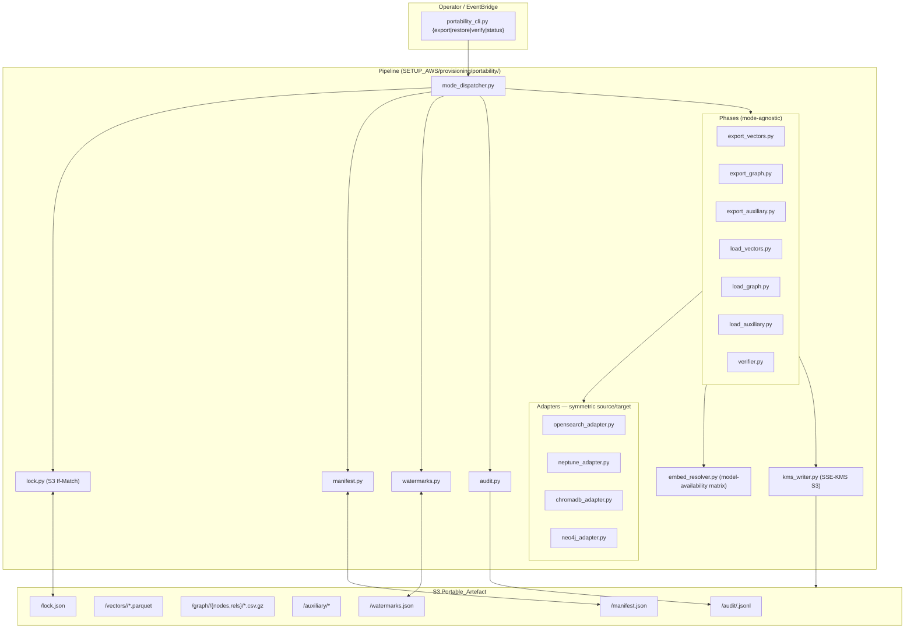
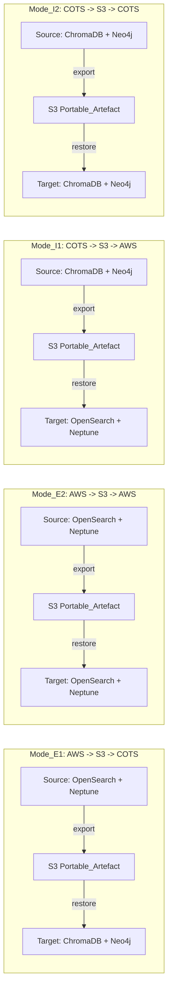
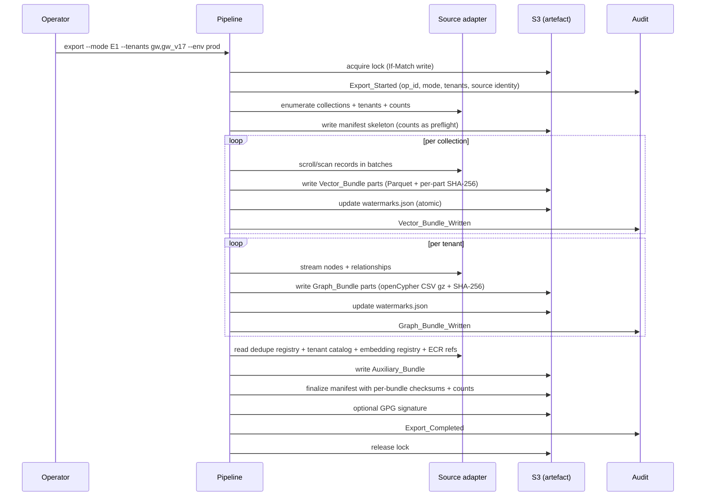
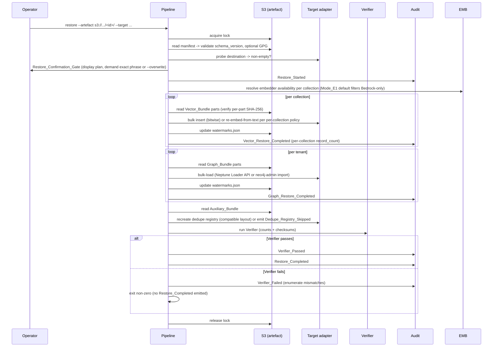

# Design Document — `cross-platform-data-portability`

## Overview

The `Portable_Data_Roundtrip_System` is a **single bidirectional pipeline** with
four invocation modes (E1 / E2 / I1 / I2) and two distinct file formats (vector
records and property-graph CSV). It is structurally a port of the original
`migrate-to-aws.js` 5-phase pipeline (export-vectors → export-graph →
load-vectors → load-graph → verify) re-implemented in Python on the v8 stack
and made symmetric so that "source" and "target" can be either the AWS data
plane (OpenSearch + Neptune) or the COTS data plane (ChromaDB + Neo4j).

The design's central insight is that **the artefact in S3 is the spec**.
Every Export writes a self-describing `Portable_Artefact` (manifest + bundles
+ checksums + watermarks). Every Restore reads the artefact, validates the
manifest's `schema_version` against its supported major, and replays the
bundles into the target. This decouples Export and Restore by time, by
platform, and by operator — a Restore three months later in a different AWS
account or on a Docker laptop reads exactly the same bytes.

This spec is independent of `nih-sandbox-cost-control` (which uses native
engine snapshots for AWS-only fast hibernation). The two systems share only
the bucket layout at the bucket level (`<state-bucket>`, `<audit-bucket>`,
`<artefact-bucket>`); cost-control writes under `cost-control/`, this spec
writes under `portability/`.

The deliverables land at `SETUP_AWS/provisioning/portability/`.

## Architecture

### Component view



### Mode pipelines (which adapters serve as Source vs Target)



### Export sequence (any mode)



### Restore sequence (any mode)



## Format Decisions

These are the central design choices. Each is the recommended primary
format with the rejected alternative documented for the record.

### Vector format: **Parquet (primary), gzipped JSONL (sidecar)**

| | Parquet | JSONL.gz |
|---|---------|----------|
| Size on disk | smallest (columnar + compression) | larger (~3-5x) |
| Random access | fast (row-group skip) | sequential only |
| Schema discovery | embedded | needs `_schema.json` sibling |
| Reader complexity | needs `pyarrow` | any text tool |
| `jq` debuggability | no | yes |
| ChromaDB ingest | via `pyarrow` chunks | via streaming JSON |

Decision: **Parquet primary** for the bundle bytes. JSONL.gz produced as a
sidecar for ad-hoc inspection in small (≤1MB) collections only. Both
honor the same record schema (R1.1).

Vector record schema (Parquet column types):

| field | type | nullable | notes |
|-------|------|----------|-------|
| `id` | string | no | source-side document id, unique within collection |
| `content` | string | no | raw text used for embedding; UTF-8 |
| `embedding` | list<float32> | no | length == `model_profile.dimensions` |
| `metadata` | string | yes | JSON-encoded object (Parquet's nested types are awkward across implementations; encoding as a JSON string keeps the format engine-neutral and preserves arbitrary keys) |
| `model_profile` | string | no | one of `mpnet768`, `titan1024`, `nova256/512/1024/3072` |
| `collection_name` | string | no | with or without tenant prefix per `Tenant_Prefix_Handling` |
| `chunk_id` | string | yes | source-side chunk id when distinct from `id` |
| `tenant_id` | string | yes | populated when `Tenant_Prefix_Handling=Flatten` |

### Graph format: **Neptune CSV (superset of `neo4j-admin import`)**

Neptune's openCypher bulk-loader CSV format is a superset of the
`neo4j-admin import` CSV format — node files use the column header
`~id` plus property columns and `~label`; relationship files use
`~id`, `~from`, `~to`, `~label`. Both Neptune and Neo4j accept the
same files unchanged.

Layout per tenant:

```
<artefact_prefix>/graph/<tenant>/
  nodes/
    File-<part>.csv.gz
    FortranSubroutine-<part>.csv.gz
    ShellScript-<part>.csv.gz
    ...
  rels/
    CALLS-<part>.csv.gz
    USES-<part>.csv.gz
    INVOKES-<part>.csv.gz
    ...
```

One CSV per (label, part) so node-by-label parallelism and partial
restores are clean. Part size targets ≤ 256 MB per file.

### Lock + watermarks: **S3 If-Match conditional writes**

Same mechanism as cost-control's state file. Native S3 conditional PUT
on the `If-Match: <etag>` header is sufficient, well-tested, and avoids
standing up DynamoDB. Lock object lives at
`<artefact_prefix>/lock.json`; watermark object at
`<artefact_prefix>/watermarks.json`. Both updated atomically by the
holding process.

### Compression and encoding

- Parquet: Snappy (default; good size+speed).
- CSV: `csv.gz` (`gzip` level 6; deterministic for checksums).
- JSONL sidecars: `gzip` level 6.
- All S3 PUTs: `ServerSideEncryption=aws:kms`, `SSEKMSKeyId=<configured>`.
  Bucket default-encryption verified at first PUT — refuses non-KMS
  buckets with `Bucket_Encryption_Misconfigured` (R11.2).

## Components and Interfaces

### Pipeline package (`SETUP_AWS/provisioning/portability/`)

```
portability/
  __init__.py
  portability_cli.py        # argparse: {export|restore|verify|status} flags
  mode_dispatcher.py        # mode -> {source_adapter, target_adapter, defaults}
  config.py                 # env -> S3 buckets, KMS key, endpoints
  lock.py                   # S3 If-Match lock acquire/release/break
  manifest.py               # Manifest dataclass + reader/writer + GPG hooks
  watermarks.py             # atomic JSON updates (write-temp + If-Match)
  audit.py                  # JSONL records (CW + per-op S3 + local fallback)
  embed_resolver.py         # model-availability matrix per target
  kms_writer.py             # SSE-KMS S3 PUT helpers + checksum streams
  adapters/
    __init__.py             # SourceAdapter / TargetAdapter protocols
    opensearch_adapter.py   # scroll/scan; bulk insert; index mapping discovery
    neptune_adapter.py      # cypher export streams + neptune-loader REST API
    chromadb_adapter.py     # collection.get(); collection.add()
    neo4j_adapter.py        # streaming reads; neo4j-admin import shell-out
  phases/
    export_vectors.py
    export_graph.py
    export_auxiliary.py
    load_vectors.py
    load_graph.py
    load_auxiliary.py
    verifier.py
  schemas/
    vector_record.parquet.schema.json
    graph_node.csv.schema.json
    graph_rel.csv.schema.json
    manifest.schema.json
  tests/
```

### Adapter protocols

```python
class SourceAdapter(Protocol):
    """Read-only side of any pipeline mode."""
    def list_collections(self, tenants: list[str]) -> list[str]: ...
    def scroll_records(self, collection: str, batch: int) -> Iterator[list[VectorRecord]]: ...
    def list_tenants_in_graph(self) -> list[str]: ...
    def stream_nodes(self, tenant: str) -> Iterator[NodeRow]: ...
    def stream_relationships(self, tenant: str) -> Iterator[RelRow]: ...
    def read_dedupe_registry(self) -> Iterator[DedupeRow]: ...
    def read_tenant_catalog(self) -> dict: ...

class TargetAdapter(Protocol):
    """Write side of any pipeline mode."""
    def probe_existing(self) -> ExistingState: ...   # for confirmation gate
    def bulk_insert_vectors(self, collection, records, *, conflict_policy): ...
    def load_graph_bundle(self, tenant, nodes_uris, rels_uris): ...
    def write_dedupe_registry(self, rows: Iterable[DedupeRow]): ...
    def count_collection(self, collection: str) -> int: ...
    def count_graph(self, tenant: str) -> tuple[int, int]: ...   # nodes, rels
```

The four concrete adapters implement either or both protocols. The phase
modules are mode-agnostic — they call `source.scroll_records()` /
`target.bulk_insert_vectors()` and never branch on which engine sits behind
them.

### Mode dispatcher

`mode_dispatcher.py` resolves a mode flag to a concrete adapter pair and
applies mode-specific defaults:

| Mode | Source | Target | Default Tenant_Prefix_Handling | Default model filter |
|------|--------|--------|--------------------------------|----------------------|
| E1 | OpenSearch+Neptune | ChromaDB+Neo4j | `Flatten` (COTS has no native tenancy) | mpnet768 only; titan/nova require `--include-bedrock-models` |
| E2 | OpenSearch+Neptune | OpenSearch+Neptune | `Preserve` | all profiles bitwise |
| I1 | ChromaDB+Neo4j | OpenSearch+Neptune | `Flatten`-or-`Preserve` per Manifest | source-determined |
| I2 | ChromaDB+Neo4j | ChromaDB+Neo4j | `Preserve` | all profiles bitwise |

### CLI surface

```
portability_cli.py export   --mode {E1|E2|I1|I2} --env <name>
                             [--tenants gw,gw_v17] [--collections code,docs]
                             [--prefix-handling preserve|flatten]
                             [--include-bedrock-models]
                             [--artefact-prefix s3://.../portability/<env>/<id>/]
                             [--gpg-key <key-id>] [--resume] [--dry-run]

portability_cli.py restore  --artefact s3://.../portability/<env>/<id>/
                             --target {aws|cots} [--env <name>]
                             [--tenants ...] [--collections ...]
                             [--conflict {error|skip|overwrite}]
                             [--re-embed-from-text <collection,...>]
                             [--overwrite] [--break-lock]
                             [--resume] [--dry-run]

portability_cli.py verify   --artefact s3://.../portability/<env>/<id>/
                             --target {aws|cots} [--env <name>]
                             [--tolerance <0.0..0.05>]

portability_cli.py status   --artefact s3://.../portability/<env>/<id>/
```

`status` reads the manifest + watermarks + lock object without acquiring the
lock and prints a plain-text summary. `--dry-run` prints the full plan
without any mutation.

## Data Models

### Manifest (`<artefact_prefix>/manifest.json`)

```json
{
  "schema_version": "1.0.0",
  "artefact_id": "8f3a1c2e-2026-06-15-prod",
  "produced_at": "2026-06-15T20:14:33Z",
  "produced_by": "arn:aws:sts::903050880929:assumed-role/operator/terry",
  "source_system": "aws-opensearch+neptune",
  "source_aws_account_id": "903050880929",
  "source_region": "us-east-1",
  "source_endpoints": {
    "opensearch": "https://vpc-mdc-mcp-rag-search-...es.amazonaws.com",
    "neptune": "https://mdc-mcp-graprag-neptune-1.cluster-...neptune.amazonaws.com:8182"
  },
  "tenants": ["gw", "gw_v17"],
  "tenant_prefix_handling": "Preserve",
  "embedding_profiles": {
    "mdc-code-context-titan1024": {"name": "titan1024", "dimensions": 1024, "provider": "bedrock", "model_id": "amazon.titan-embed-text-v2:0"},
    "mdc-workflow-docs-mpnet768": {"name": "mpnet768", "dimensions": 768, "provider": "local", "model_id": "all-mpnet-base-v2"}
  },
  "vector_bundles": [
    {"collection_name": "mdc-code-context-titan1024", "record_count": 90135,
     "parts": ["vectors/mdc-code-context-titan1024/000.parquet", "..."],
     "sha256": "ab12...cd34"}
  ],
  "graph_bundles": [
    {"tenant_id": "gw", "node_count": 148976, "relationship_count": 4555408,
     "parts": ["graph/gw/nodes/File-000.csv.gz", "graph/gw/rels/CALLS-000.csv.gz", "..."],
     "sha256": "ef56...78ab"}
  ],
  "auxiliary_bundles": [
    {"name": "dedupe_registry", "parts": ["auxiliary/dedupe_registry-000.jsonl.gz"], "sha256": "..."},
    {"name": "tenant_catalog", "parts": ["auxiliary/tenant_catalog.yaml"], "sha256": "..."},
    {"name": "embedding_registry", "parts": ["auxiliary/embedding_registry.json"], "sha256": "..."},
    {"name": "ecr_refs", "parts": ["auxiliary/ecr_refs.json"], "sha256": "..."}
  ],
  "totals": {
    "vector_records": 252013,
    "graph_nodes": 229972,
    "graph_relationships": 5833739,
    "artefact_bytes_uncompressed": 8421548317,
    "artefact_bytes_on_disk": 1932456789
  }
}
```

### Lock (`<artefact_prefix>/lock.json`)

```json
{
  "holder_arn": "arn:aws:sts::...:assumed-role/operator/terry",
  "operation_id": "8f3a1c2e-...",
  "operation": "export",
  "acquired_at": "2026-06-15T20:14:33Z",
  "expected_release_by": "2026-06-15T22:14:33Z"
}
```

Acquired via S3 PUT with `IfMatch=<etag>`; concurrent writers receive 412
PreconditionFailed → `Concurrent_Operation_Refused`. The
`expected_release_by` field allows stale-lock cleanup via `--break-lock`
once that timestamp is in the past.

### Watermarks (`<artefact_prefix>/watermarks.json`)

```json
{
  "artefact_id": "8f3a1c2e-...",
  "operation_id": "8f3a1c2e-...",
  "phase": "export_vectors",
  "completed_parts": [
    "vectors/mdc-code-context-titan1024/000.parquet",
    "vectors/mdc-code-context-titan1024/001.parquet"
  ],
  "in_flight_part": "vectors/mdc-code-context-titan1024/002.parquet",
  "updated_at": "2026-06-15T20:42:11Z"
}
```

### Audit record (one JSON object per line)

Same shape as cost-control's record (R12.1) with `mode` ∈ {E1, E2, I1, I2}
and `event_type` ∈ {`Export_Started`, `Vector_Bundle_Written`,
`Graph_Bundle_Written`, `Auxiliary_Bundle_Written`, `Manifest_Written`,
`Restore_Started`, `Vector_Restore_Completed`, `Graph_Restore_Completed`,
`Auxiliary_Restore_Skipped`, `Verifier_Passed`, `Verifier_Failed`,
`Export_Completed`, `Restore_Completed`, `Export_NoOp`,
`Concurrent_Operation_Refused`, `Confirmation_Declined`,
`Bucket_Encryption_Misconfigured`, `Manifest_Schema_Unsupported`,
`Watermark_Mismatch`, `Dedupe_Registry_Skipped`, `Scheduled_Export`}.

### Embedder-availability matrix

| Target | mpnet768 | titan1024 | nova{256,512,1024,3072} |
|--------|----------|-----------|--------------------------|
| AWS (Mode_E2, I1) | yes (locally embeddable + Bedrock available for query parity) | yes | yes |
| COTS with Bedrock IAM | yes | yes (bitwise OK; query-time embed via Bedrock) | yes (bitwise OK; query-time embed via Bedrock) |
| COTS without Bedrock | yes | bitwise OK but **unqueryable** without re-embed-from-text | bitwise OK but **unqueryable** without re-embed-from-text |

The `embed_resolver.py` consumes this matrix plus the operator's
`--include-bedrock-models` and `--re-embed-from-text` flags to decide,
per collection, whether the Restore copies vectors bitwise, re-embeds
from `content`, or skips the collection.

## Correctness Properties

### Property 1: Engine-neutral readability

Every Vector_Bundle is readable by `pyarrow.parquet.read_table` and every
Graph_Bundle is loadable by both `neptune-loader` and `neo4j-admin import`
without transformation. No artefact's readability depends on a specific
OpenSearch index version, a specific Neptune snapshot version, or any
other engine-proprietary on-disk format.

**Validates: Requirements 1.1, 1.2, 1.3**

### Property 2: Bitwise embedding preservation

For any Export operation, the SHA-256 of each Vector_Bundle's record bodies
is recorded in the Manifest. For any same-platform Restore (E2 / I2) on
default settings, the post-Restore embeddings read back from the
destination produce the same SHA-256 as the source.

**Validates: Requirements 2.1, 2.2, 2.3, 2.4**

### Property 3: Round-trip integrity (counts + checksums)

For any chain `Export(source) → Restore(target)` with verifier-pass, the
Verifier confirms per-collection record counts, per-tenant graph node
counts, and per-tenant relationship counts on the target match the
Manifest values within the configured tolerance (default 0%); per-bundle
SHA-256 checksums recomputed on the target match the Manifest values
exactly.

**Validates: Requirements 7.1, 7.2, 7.3, 7.4**

### Property 4: Watermarked resume

If any Export or Restore phase is killed and re-invoked with `--resume`
against the same artefact_id, every part marked complete in the
watermark file is skipped, every incomplete part is re-executed exactly
once, and the final manifest counts match the non-interrupted run.

**Validates: Requirements 8.1, 8.2, 8.3, 8.4**

### Property 5: Idempotency and concurrency refusal

(a) Re-issuing an Export over an already-current artefact (source-state
digest unchanged) is a no-op and exits 0. (b) Two concurrent Exports or
Restores against the same artefact_prefix: at most one acquires the lock;
the other receives 412 PreconditionFailed and exits non-zero with
`Concurrent_Operation_Refused`.

**Validates: Requirements 9.1, 9.2, 9.3**

### Property 6: Confirmation precedes destination mutation

No write API call against any destination resource (OpenSearch index,
Neptune cluster, ChromaDB collection, Neo4j label) is issued before
either the interactive `Restore_Confirmation_Gate` phrase matches the
declared phrase or the `--overwrite` non-interactive token is present
and recorded in the audit trail.

**Validates: Requirements 10.1, 10.2, 10.3, 10.4**

### Property 7: Source immutability

No Export operation issues any create / delete / replace / modify call
against the source data plane. Export is strictly read-only.

**Validates: Requirements 1.3, 5.1**

### Property 8: Tenant-prefix invertibility

For any Export with `Tenant_Prefix_Handling=Flatten` followed by a
Restore against a tenant-aware destination with the source tenant set,
the post-Restore tenant prefix structure is byte-equal to the source's
prefix structure (every `gw_v17_` index and `GW_V17_` label is recreated
with the same membership).

**Validates: Requirements 4.1, 4.2, 4.3, 4.4, 4.5**

## Error Handling

| Condition | Behaviour | Requirement |
|-----------|-----------|-------------|
| S3 lock contended (412 PreconditionFailed) | `Concurrent_Operation_Refused`, exit non-zero | 9.2, 9.3 |
| Manifest `schema_version` major > supported | `Manifest_Schema_Unsupported`, refuse Restore, exit non-zero | 5.4 |
| Per-bundle SHA-256 mismatch on read | `Bundle_Checksum_Mismatch`, refuse to load that bundle, exit non-zero | 7.3 |
| Bucket default-encryption not SSE-KMS | `Bucket_Encryption_Misconfigured`, refuse all writes, exit non-zero | 11.2 |
| `Re_embed_From_Text` on a destination with no available embedder | `Embedder_Unavailable`, exit non-zero before destination mutation | 3 |
| Confirmation phrase mismatch (interactive) | `Confirmation_Declined`, no destination mutation, exit 0 | 10.3 |
| `--resume` against mismatched `artefact_id` | `Watermark_Mismatch`, exit non-zero | 8.3 |
| Dedupe registry layout incompatible (e.g. AWS sha-registry → COTS) | `Dedupe_Registry_Skipped`, continue Restore with operator note | 6.5 |
| Verifier fails post-load | `Verifier_Failed` enumerating mismatches, no `Restore_Completed`, exit non-zero | 7.3, 7.4 |
| Bundle Restore partial failure | watermarks preserved; operator re-runs `--resume` to retry only the failed parts | 8.1, 8.2 |
| Stale lock past `expected_release_by` | operator may run `--break-lock` (logged in audit) | 9.3 |

## Testing Strategy

### Unit tests (`SETUP_AWS/provisioning/portability/tests/`)

- **Adapter contract tests** — for each of the four adapters, mock the
  underlying client (botocore Stubber for OpenSearch / Neptune; in-memory
  ChromaDB; embedded Neo4j or a `neo4j-driver` mock for Neo4j) and assert
  every Source/Target protocol method passes its API contract.
- **Format roundtrip** — given a synthetic batch of `VectorRecord`s, write
  Parquet → read back → assert byte-equality of each field including
  `embedding` floats (bit-equal). Same for Graph_Bundle CSV.
- **Mode dispatcher** — every mode resolves to the expected (source,
  target, defaults) tuple; invalid mode rejected.
- **Lock + watermarks** — stale-ETag write → `Concurrent_Operation_Refused`;
  watermark mismatch surfaces; atomic update under simulated kill.
- **Manifest** — schema validation; GPG sign + verify roundtrip; refusal on
  major mismatch.
- **Embed resolver** — table-driven matrix: each (target, profile, flag)
  combination resolves to bitwise / re-embed / skip / refuse correctly.
- **Verifier** — mismatched counts trigger `Verifier_Failed`; tolerance
  applies; checksum mismatch refuses load.
- **Property tests** — Hypothesis covering Properties 4 (resume), 5
  (idempotency), 7 (source immutability — assert no source-side mutation
  call across any export run).

### Integration tests (with a small fixture corpus)

- **End-to-end E2 roundtrip** — small fixture corpus → Export → Restore
  to a second AWS-emulated stack (moto + neptune-stub) → Verifier passes;
  Property 2 holds (bitwise checksums preserved).
- **End-to-end I2 roundtrip** — Docker-based ChromaDB + Neo4j fixtures;
  same shape as E2.
- **End-to-end E1 with re-embed-from-text** — fixture corpus uses
  titan1024 vectors; `--re-embed-from-text=...` re-generates with mpnet768
  on the COTS side; Verifier passes on counts; Manifest's per-collection
  `model_profile` reflects the re-embedded model.

### Operator-gated live acceptance

- **Phase A**: a `--dry-run` Export against the live `dev` env, golden-file
  the printed plan.
- **Phase B**: a real Export of `gw` (the smaller, populated tenant) to a
  dedicated `s3://.../portability/dev/<artefact_id>/` prefix; verify
  manifest counts match the live `get_knowledge_base_status` numbers
  byte-for-byte.
- **Phase C**: a Restore from that artefact into a second `dev-restore`
  env (or a Docker-based COTS box for E1); Verifier passes; Property 3
  holds live.
- All phases STOP-AND-CONFIRM gated.

## Open Questions

1. **Parquet writer choice** — `pyarrow` is the obvious default, but it
   pulls in ~80 MB of native deps. For the COTS box that may matter; the
   alternative is `fastparquet` (pure Python, smaller, slightly slower).
   Recommend `pyarrow` primary with a `fastparquet` fallback documented.
2. **Bedrock-from-COTS authentication** — when a COTS box wants to use
   Bedrock for query-time embedding against titan1024 vectors, what
   credential path is supported (IAM user keys, SSO, IAM Identity
   Center)? Defer to runbook; no code dependency.
3. **GPG signing scope** — sign only the manifest (cheap, sufficient
   for tamper detection because the manifest carries every bundle's
   SHA-256) or every bundle individually. Recommend manifest-only for
   simplicity.
4. **ChromaDB version compatibility** — the original migration targeted
   ChromaDB v0.4.x; ChromaDB has since had breaking API changes through
   v0.5.x and beyond. The adapter must pin a supported version range
   and refuse newer/older.
5. **Neptune-loader vs streaming insert** — for Restore into Neptune,
   the loader API expects S3-resident files and runs an async job;
   streaming `INSERT` over the openCypher endpoint works for any size
   but is slower. Loader API is recommended for any restore over ~10K
   nodes; document the threshold.
6. **Schedule_Mode targeting** — when the schedule fires, does it always
   write to a fresh `<artefact_id>` prefix, or rotate over a fixed set
   of prefixes (`weekly-1`, `weekly-2`, `weekly-3`, `weekly-4`)? Fixed
   rotation is simpler for lifecycle policies; recommend rotation with
   the most-recent always-readable prefix `weekly-latest` aliased.
