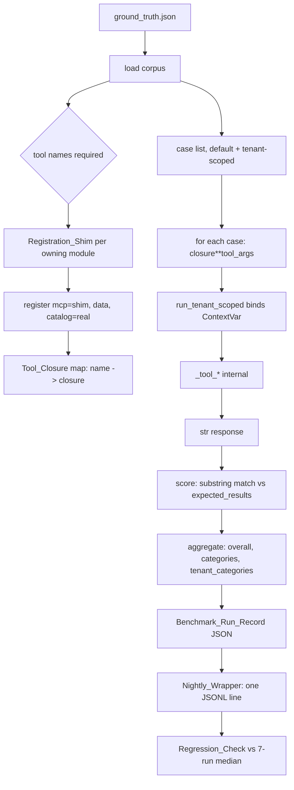

# Design Document

## Overview

Phase 79 froze Default_Tenant output byte-for-byte. That freeze is now the only
reason a known-wrong document total survives, the only reason `gw` integrity
findings stay unscoped, and the reason the three convergence follow-ups
serialize behind each other. Retiring it requires a replacement gate, and the
replacement gate does not exist: the nightly benchmark drives the Node_Harness,
which has no tenant concept and never touches the Python read path Phase 79
rewrote.

So this feature is mostly construction. Three artefacts are new:

- **`Benchmark_Harness`** (`mcp_server_python/scripts/run_benchmark.py`) — loads
  the Ground_Truth_Corpus, collects Tool_Closures through a Registration_Shim,
  invokes them, scores by the Node_Harness's formulas, and writes a
  Benchmark_Run_Record the Nightly_Wrapper already knows how to normalise.
- **Structural_Equivalence evaluator** (`mcp_server_python/tests/baselines/structural.py`)
  — parses a rendered reporter response into the three-part view Requirement 9
  defines, and compares two views.
- **Addressed-set check** (`mcp_server_python/tests/baselines/addressing.py`) —
  the Requirement 11 criterion 2 structural half, which cannot be a text parse
  and is not one.

Nothing under `mcp_server_python/src/` changes. That is stronger than
Requirement 15 criterion 3 asks for, and section "Decision 3" explains why it is
achievable.

### Investigation findings that shaped the design

Every claim below was confirmed by reading code or by executing a query against
the repository's own artefacts. None is inferred from the requirements document.

**1. The Regression_Check comparison is strict, and the threshold is relative.**
`run_benchmark_nightly.sh` line ~250 evaluates
`if med > 0 and cur_v < med * (1 - pct / 100.0)`. A drop of *exactly* the
threshold percentage does not fire. The comparison is a **relative** drop
against the trailing median, not an absolute point drop. Both facts are
load-bearing for the threshold decision and neither is stated in the
requirements.

**2. `mrr` and `coverage` are the same number, in both harnesses, by
construction.** All 147 scope observations across the 21 Node_Harness runs in
the Quality_Metrics_Log report `mrr == coverage` with zero deviations
(verified by executing over the log). The mechanism: `computeQueryMetrics`
computes `mrr` as the reciprocal rank of the first *response text* containing a
match, and an MCP text response carries exactly one text block, so
`resultTexts` has length 1 and per-case `mrr` is `1/1` when covered and `0`
otherwise — identical to the `covered` flag. Re-deriving per-case `mrr` as
`1.0 if matched else 0.0` over all 1,260 recorded cases produced zero
mismatches. A Python Tool_Closure returns `str`, so `resultTexts` is length 1
there too and the identity carries over. **Consequence: the Gated_Metric triple
`{mrr, precision_at_k, coverage}` has rank two. The gate is effectively over
`{coverage, precision_at_k}`.** Recorded because a reviewer counting three
independent signals would overestimate the gate.

**3. Metric-formula equality is provable hermetically, and it holds.** Each
Quality_Metrics_Log line carries a `queries[]` array with per-case `precision`,
`recall`, `mrr`, `latency_ms`, `matched_results`, and `expected_results`.
Re-computing every per-case value from `(len(matched_results),
len(expected_results), k=5)` with the Python formulas matched all 1,260
recorded cases exactly; re-aggregating each run's cases into `overall` and the
six `categories` blocks matched all 147 recorded scopes exactly, latency
percentiles included. This converts Requirement 5 criterion 1 from a prose
assertion into an executed differential test that needs no backend. It proves
the *arithmetic* is identical; it does not prove *score* comparability, which
depends on store content. See "Score comparability across the changeover".

**4. `expected_min_results` is read by neither harness.** The Node_Harness reads
`expected_results` for scoring and `expected_results.length` for the dry-run
line; `expected_min_results` appears nowhere in `computeQueryMetrics`,
`aggregateMetrics`, or `detectRegressions`. It is documentary in all 60 baseline
cases. Requirement 2 criterion 3 requires the field on every Tenant_Scoped_Case,
so it is carried; the design states its status rather than implying the harness
gates on it.

**5. Precision is clamped above `k`, so a case with more than five expected
entries loses resolution.** `precisionAtK = matched / min(k, len(expected))`
with `k = 5`, then clamped to `[0, 1]`. For the two baseline cases with six
expected entries, five matches and six matches both score `1.0`. This is why
Decision 2 caps every new Tenant_Scoped_Case at five expected entries: at
`len(expected) <= k`, `precision_at_k` equals `recall_at_k`, and since
`recall_at_k` is *not* a Gated_Metric, the cap is what puts a reporter case's
discriminating signal inside the gate.

**6. A bare collection name is a substring of its own prefixed form.**
`mdc-workflow-docs-titan1024` occurs inside
`gw_v17_mdc-workflow-docs-titan1024`. Under case-insensitive substring
scoring, an expected entry naming the shared unprefixed member would match a
render containing only the prefixed member — the exact regression the case
exists to catch would pass. Decision 2 anchors reporter-case expected entries on
the rendered list-item marker (`- `) to defeat this.

**7. The Node_Harness ignores unknown top-level corpus keys.** `loadCorpus`
spreads `raw` and iterates `Object.entries(raw.categories)` only. A sibling
top-level container is carried through the spread and never read. Adding
Tenant_Scoped_Cases under `categories`, by contrast, would change every
category's case count from 10 to 10+N on the Node side, silently shifting the
Node per-category aggregates that the shared Quality_Metrics_Log median is built
from — and would hand `tenant_id` to Node handlers that have no tenant concept,
scoring tenant cases as unscoped and depressing Node scores. Decision 2 uses the
sibling container.

**8. `[SKIP]` in the Integrity_Checker lives in the details cell, not the status
column.** `_check_path_consistency` and three siblings return
`_Check(name, True, "[SKIP] ...")`, which renders as
`| Path Consistency | [OK] | [SKIP] vector adapter does not expose a metadata
sampler |`. A Check_Verdict extractor that read only the status column would
score a real pass and a silent skip as equal — precisely the degradation the
relation must catch. The extractor consults both cells, with skip taking
precedence. The Health_Reporter's functional-probe table is the opposite shape:
`{"pass": "[OK]", "fail": "[ERROR]", "skip": "[SKIP]"}` is explicit in the
status cell.

**9. The three reporters use three different rendering idioms.** Confirmed
against the recorded baselines:

| Reporter | Physical_Collection + count | Check_Verdict |
|---|---|---|
| Status (default) | `  - mdc-jjobs-titan1024: 751 documents` | `- **Status:** [OK] Healthy` (twice: vector, graph) |
| *(amended)* | | the two lines collapse under one key — see below |
| Status (prefixed) | `  - gw_v17_mdc-jjobs-titan1024 (tenant): 92 documents` or `... (tenant): unprovisioned` | same |
| Integrity | none | `\| Path Consistency \| [OK] \| ... \|` table rows |
| Health | none | `[OK] **Vector Database**: healthy` |

**Amended 2026-08-19, after Task 6.1/6.2 implementation.** This finding said to
key the two `- **Status:**` lines by their enclosing section heading so vector and
graph stay distinguishable. **That is not achievable alongside R9.2.** The two
lines are byte-identical in the real capture (lines 16 and 37 of the recorded
status baseline), so no intrinsic key separates them, and the heading is destroyed
by two of the perturbations R9.2 insensitivity is tested with: line permutation
detaches a line from its heading, and heading rewriting changes the heading text
itself. Any heading-derived key therefore fails Property 2.

The two lines collapse under a single `Status` key. What that costs is the
vector-versus-graph attribution; what it must not cost is detection, and the first
implementation did lose detection. Collapsing by plain assignment is
last-write-wins, so a vector `FAIL` followed by a graph `PASS` yielded `PASS` and
the regression disappeared — while a graph-only failure was caught purely because
that line comes second in the render. An order-dependent gate is not a gate.

The collapse therefore keeps the **most severe** verdict, `FAIL` over `SKIP` over
`PASS`. `SKIP` outranking `PASS` rests on the same argument as the
`[SKIP]`-in-details-cell override: a check that quietly stopped running must not
read as one that passed. A parameterised regression test pins all three failure
directions and both no-op directions.

Recovering the attribution would need the health render to make its two status
lines distinguishable in their own text, which is a change under `src/` and out of
scope for a feature that changes no runtime behaviour.

The graph block emits `  - CALLS: 1020000` and `  - FortranSubroutine: 29605`,
which share the collection-line shape but lack the ` documents` /
` unprovisioned` terminal. That terminal is the discriminator, and it is the only
one available — a name-pattern match on `mdc-` would break for a renamed
collection and would falsely admit nothing useful.

**10. The R11.2 addressed-set check cannot read the render.** Phase 79 finding 6
established that the rendered `**Collection:**` field carries the *Logical*
collection name, and that `physical_collection` was added as a new result key
precisely so that field could stay put. So "the same set of Physical_Collections
is addressed" is not recoverable from Query_Tool output text. Further, the
capture harness's `_StubVectorDB` receives the *logical* name — the real adapter
calls `resolve_read_targets` internally, and the stub replaces the adapter
wholesale — so the existing scenarios cannot observe physical addressing either.
The check is therefore built on `resolve_read_targets` directly plus the
`adapters()` fixture, not on a parse. See "Query_Tool structural check".

### Notes on the requirements document

The requirements are the contract. These are readings the design commits to
where the text admits more than one, plus one place the text's stated rationale
does not survive contact with the code. No acceptance criterion changes.

| Requirement | Reading this design commits to |
|---|---|
| R2.6, "so that each of the three Follow_Up_Sequence changes has a case that exercises it" | The `get_knowledge_base_status` Tenant_Scoped_Case exercises the **prefixed** status branch (`_render_scoped_vector_status`). Follow-up 1 changes the `gw` total, which flows through the **default** branch (`_render_vector_status_block`) — a different function. The benchmark case does not gate follow-up 1; Structural_Equivalence plus R10.7's re-record does. The criterion is satisfied literally (the case exists and names the tool); the stated rationale over-reaches for one of the three, and the gate for that one is named here instead of left implicit. |
| R2.1, "no second corpus file" | Satisfied by a sibling top-level key in the same file. A container is not a file. |
| R2.3, "no additional Benchmark_Case field" | Constrains fields *within* a Benchmark_Case. The sibling container is not a Benchmark_Case field. |
| R2.5, "in each of the six Benchmark_Categories" | A case in the sibling container carrying `"category": "code_structure"` is in that Benchmark_Category. Category membership is the `category` value, not the containing key. |
| R9.2, "insensitive to label text, field wording" | Applies to *decorative* text — block headers, table header rows, field captions, bold markers, separators. The *identifying* text (a Physical_Collection name, a check name) is significant by R9.1, which keys counts and verdicts to it. A relation insensitive to identifying text could not name the differing collection in R9.3. |
| R10.7 | States the re-record affordance for the Status_Reporter's collection set. The design generalises it to all three parts of the relation and to all three reporters, because a gate no intended change can pass is not a gate, and R13.6 already establishes re-recording as first-class for a structural baseline. |
| R7.3, "differ only in the default value of `MCP_BENCHMARK_REGRESSION_PCT` and in comment text" | Decision 1 sets the Governing_Threshold to the value already in the wrapper, so the wrapper's functional content is byte-unchanged and only comment text moves. |
| R15.3, "SHALL be limited to the modules that evaluate..." | Satisfied vacuously: the set of modified `src/` files is empty. |

### Decision record

Seven decisions. The first two the requirements deferred; the rest were surfaced
during requirements review.

| # | Decision | Rejected alternative |
|---|---|---|
| 1 | Governing_Threshold **10 percent**, relative, against the trailing 7-run median, strict `<` | 5 (single-flip tripwire in four of six categories); 15 (buys nothing for coverage at 1.0, costs three cases of `overall` sensitivity and loosens precision materially) |
| 2 | Tenant_Scoped_Cases in a **sibling top-level container** `tenant_categories`, keyed by the same six category names, each case capped at five expected entries anchored on `- ` | Adding them under `categories` (shifts Node per-category counts and feeds `tenant_id` to Node handlers); a case-level `tenant` field (forbidden by R2.3) |
| 3 | Structural_Equivalence evaluator under **`tests/baselines/`** | Under `src/` (R15.3 permits it, but nothing in `src/` needs it and placing it there makes it importable by a tool) |
| 4 | Facade: **`create_data_access(config)` by default, injected facade overrides** | A `--hermetic` flag selecting a built-in stub (puts test fixtures in a production script) |
| 5 | Harness constructs **one real catalog** via `get_catalog()` and threads it into every `register()` call | Passing `catalog=None` (every Tenant_Scoped_Case would fail as a routing bug) |
| 6 | Harness is **backend-agnostic in structure, backend-specific in score**; `harness` field records backend and profile | Claiming cross-backend score comparability |
| 7 | Changeover archive is a **one-time operator step** reusing the wrapper's archive directory and naming | Filtering the log by the `harness` field at read time (a functional wrapper or reader change) |

#### Decision 1 — Governing_Threshold is 10 percent

Three numbers exist. They are not in conflict as numbers; they govern different
comparisons, and *that* is the disagreement Requirement 6 criterion 1 names.

| Declared | Where | Comparison basis | Consumer |
|---|---|---|---|
| `regression_threshold_pct: 5` | corpus `metrics_config` | previous **single run** | `run_benchmark.js::detectRegressions`, warn level |
| `critical_threshold_pct: 15` | corpus `metrics_config` | previous **single run** | same, error level, sets the Node exit code |
| `MCP_BENCHMARK_REGRESSION_PCT: 10` | Nightly_Wrapper | trailing **7-run median** | the wrapper's own Regression_Check, ERROR log lines |

Requirement 11 criterion 3 gates a proposed change on "trailing Median_Window
median", which is the wrapper's basis. So the Governing_Threshold must be the
wrapper's number, and Requirement 6 criterion 3 then requires the wrapper's
default to equal it. Choosing 10 makes that a no-op and leaves the wrapper's
functional content byte-identical — the strongest available reading of
Requirement 7 criterion 3.

The substantive question is whether 10 is the right sensitivity. Granularity
decides it. Each Benchmark_Category holds exactly ten Default_Tenant cases, so
category `coverage` moves in 0.1 steps — confirmed empirically: every distinct
category coverage value across 21 runs is a multiple of 0.1. Today's medians:

| Category | Median coverage | One flip = relative drop | Fires at 5? | at 10? | at 15? |
|---|---|---|---|---|---|
| `semantic_search` | 1.0 | 10.00% | yes | **no** | no |
| `ee2_compliance` | 1.0 | 10.00% | yes | **no** | no |
| `operational` | 1.0 | 10.00% | yes | **no** | no |
| `architecture` | 1.0 | 10.00% | yes | **no** | no |
| `cross_language` | 0.9 | 11.11% | yes | yes | no |
| `code_structure` | 0.7 | 14.29% | yes | yes | no |
| `overall` (60 cases) | 0.9333 | 1.79% | no | no | no |

The 1.0 row is where finding 1's strict `<` becomes load-bearing:
`0.9 < 1.0 * 0.90` is false, so a single flip in a category at full coverage
passes at exactly 10 and fires at two flips. That is the sensitivity this gate
wants — tolerate one case going dark, catch two.

At 5, four of six categories become single-flip tripwires. Given that four of
the 21 recorded runs are backend outages (coverage 0.30 and 0.6167), a nightly
job at 5 would generate false positives faster than it would generate signal.

At 15, coverage behaviour at 1.0 is *identical* to 10 (0.9 passes, 0.8 fires
at 20%), so the two coarse categories are the only place 15 buys anything —
and it pays for that by loosening `overall` from firing at six flips of 60 to
firing at nine, and by waving through a 14% relative precision drop, which at
`ee2_compliance`'s 0.89 is 0.125 absolute. Not a trade worth making to quiet two
categories.

**Governing_Threshold: 10 percent relative, per Benchmark_Category and for
`overall`, against the median of the trailing 7 Quality_Metrics_Log lines, with
a drop of exactly 10.00 percent passing.** Accompanying values, per Requirement
6 criterion 4: Median_Window 7 (`MCP_BENCHMARK_MEDIAN_WINDOW`),
`minimum_coverage_pct` 80 (corpus `metrics_config`).

Two consequences recorded rather than hidden. First, `code_structure` and
`cross_language` fire on a single case flip; the `overall` block, whose 60-case
granularity is six times finer, is the primary instrument and the per-category
blocks are the coarse localisers. Second, per finding 2 the three Gated_Metrics
are two independent signals.

Per Requirement 6 criterion 6: the corpus `metrics_config` values stay as they
are and remain in force for the Node_Harness's own in-process check and exit
code. Reconciliation names which number governs a Default_Tenant output change;
it does not reach inside the Node_Harness.

#### Decision 2 — Tenant_Scoped_Cases go in a sibling container

Finding 7 rules out `categories`. The corpus grows one sibling key:

```json
{
  "version": "1.1.0",
  "categories":        { "code_structure": [ ...the 60, unchanged... ], ... },
  "tenant_categories": { "code_structure": [ ...Tenant_Scoped_Cases... ], ... }
}
```

`categories` is byte-unchanged, satisfying Requirement 2 criterion 2 by
construction rather than by inspection. The Benchmark_Harness reads both and
tags each case with its origin; the Node_Harness reads only `categories` and is
unaffected. Corpus `version` moves to `1.1.0` and Requirement 4 criterion 10
carries it onto every Benchmark_Run_Record, so a log line's corpus generation is
recoverable.

**Tenant: `gw_v17`.** The most populated non-default tenant, and the one whose
live state is documented: 28,325 code documents, 10,523 workflow documents, 92
J-Job documents, a Fortran graph of 80,996 nodes and 1,278,330 relationships,
and several individually verified query results.

**Case slots.** Eight cases. Requirement 2 criterion 5 needs one per category;
criterion 6 needs the three named.

| id | Category | Tool | Args beyond `tenant_id` | What it gates |
|---|---|---|---|---|
| `cs_t01` | `code_structure` | `analyze_code_structure` | `file_path` of a v17 Fortran source | tenant graph label prefix (`GW_V17_File`) |
| `ss_t01` | `semantic_search` | `search_documentation` | `collection: global-workflow-docs-v8-0-0` | **R2.6 hybrid case** — two-member Resolved_Collection_Set, merge layer |
| `ar_t01` | `architecture` | `search_architecture` | `query` | Gap J tracker — known-zero today |
| `ee_t01` | `ee2_compliance` | `search_ee2_standards` | `query`, `category: environment_variables` | **shared-scope reachability** — the v17-prefixed EE2 index is empty, so a regression to prefix-only addressing scores 0 |
| `op_t01` | `operational` | `get_job_details` | `job_name: JGLOBAL_FORECAST` | tenant J-Job routing |
| `kb_t01` | `operational` | `get_knowledge_base_status` | — | **R2.6** — prefixed status branch |
| `ki_t01` | `operational` | `check_knowledge_integrity` | `sample_size: 50` | **R2.6** — prefixed integrity branch |
| `cl_t01` | `cross_language` | `trace_full_execution_chain` | `start: JGLOBAL_FORECAST`, `direction: forward` | cross-language traversal under a tenant prefix |

`ss_t01` names the Hybrid_Domain explicitly rather than relying on
`search_documentation`'s five-collection fan-out to include it. A gate should
assert what it means to assert.

`ar_t01` will score 0. `gw_v17_mdc-community-summaries-titan1024` holds zero
documents, so `search_architecture` returns an `[INFO] Skip_Block`. This is
deliberate: the case is the corpus's tracker for Gap J and flips to non-zero
when that pipeline runs. A case designed to score zero is only defensible
because Requirement 2 criteria 8 and 9 keep Tenant_Scoped_Case scores out of the
`categories` object, so it cannot depress the numbers the Default_Tenant gate
reads.

`ee_t01` is the strongest of the eight and worth naming as such. EE2 standards
are `shared` scope, so a correct read reaches the unprefixed
`mdc-ee2-standards-titan1024` and returns the same hits `gw` gets. The
`gw_v17_`-prefixed EE2 index exists and is empty. So this case scores near 1.0
when shared-scope routing works and 0 when it regresses to prefix-everything —
which is the defect Phase 79 existed to fix, now with a standing gate.

**What `expected_results` means for a reporter tool.** The existing scoring model
does not fit, and forcing it silently would be worse than saying so.

For a retrieval tool, a match means "the store returned the right content" — the
metric measures retrieval. For a reporter, the rendered text is a deterministic
function of the tenant and the router: given `tenant_id="gw_v17"`, the collection
list is fixed before any store is consulted. A reporter case therefore measures
*structure*, not quality, and it lands in a field named `coverage`. Three
accommodations, each concrete:

1. **Expected entries are Physical_Collection names for the status case and check
   names for the integrity case** — the two things the router and the check
   assembly determine. Both are computable offline from
   `tenant_collection_set(gw_v17)` and from the `_Check` construction sites, so
   these two cases are the only ones in the corpus whose expected values need no
   live observation to author.

2. **Entries are anchored on the rendered list marker.** Per finding 6, a bare
   `mdc-workflow-docs-titan1024` matches inside
   `gw_v17_mdc-workflow-docs-titan1024`. Entries are written
   `"- mdc-workflow-docs-titan1024"`. The two-character `- ` prefix is present in
   both status render paths and defeats the containment. A unit test asserts each
   reporter case's entries fail against a synthetic render containing only the
   prefixed members — so the anchoring cannot silently rot.

3. **Entries are capped at five.** Per finding 5, at `len(expected) <= k` the
   `precision_at_k` denominator is `len(expected)` and precision equals recall.
   Since `recall_at_k` is not gated and `precision_at_k` is, the cap is what
   makes a reporter case's fraction-of-expected-found signal reach the gate at
   full resolution. `tenant_collection_set(gw_v17)` has six members, so
   `kb_t01` names five and drops `mdc-community-summaries-titan1024`, which is
   redundant with `mdc-ee2-standards-titan1024` for the shared-reachability
   claim.

`expected_min_results` is carried on every new case for schema conformance and
set to `len(expected_results)`. Per finding 4 neither harness reads it; the
design records that rather than implying a gate.

**One trade-off accepted, with a named mitigation.** The retrieval-category
expected values (`cs_t01`, `ar_t01`, `op_t01`, `cl_t01`, and `ss_t01`'s content
terms) cannot be validated in the implementation environment — there is no live
backend. They are drawn from facts recorded in the repository (verified live
query results and label resolutions in the gap tracker, the tenant catalog, the
J-Job node counts), which is the best available basis and is not the same as
observation. The first live run is therefore a **calibration run**: the
Retirement_Record names every Tenant_Scoped_Case that scored 0 on it and
distinguishes an expected zero (`ar_t01`) from a miscalibration.

The mitigation is what makes this safe rather than merely honest. A
miscalibrated Tenant_Scoped_Case cannot trip the gate that governs a
Default_Tenant change, because Requirement 2 criterion 9 computes the
`categories` object — the object Requirement 11 criterion 3 reads — from
Default_Tenant cases only. A wrong tenant expectation shows up in the
tenant-scoped block, where it is a corpus bug to fix, not a false failure on
someone else's change.

#### Decision 3 — the evaluator lives under `tests/`

Requirement 9 criterion 6 requires deriving Physical_Collection names, document
counts, and Check_Verdicts from rendered response text. That is a parser of the
server's own output. Requirement 15 criterion 3 permits it in `src/`, but four
reasons put it in `mcp_server_python/tests/baselines/structural.py`:

1. No `src/` module needs it. It has exactly one caller, a test.
2. Placing it in `src/` makes it importable by a tool, which is the coupling
   Requirement 15 criteria 1 and 2 exist to prevent. A comparison relation over
   rendered output has no business being reachable from the code that produces
   that output.
3. It sits beside `capture.py`, which already owns the other comparison relation
   (`matches_baseline`). Byte_Equivalence and Structural_Equivalence are two
   readings of the same recorded baselines and belong in one place.
4. It makes Requirement 15 criteria 1 and 3 vacuously true — the set of modified
   `src/` files is empty. A reviewer can verify "no runtime behaviour change" by
   `git diff --stat mcp_server_python/src/` returning nothing, which is a
   stronger and cheaper check than reading two new modules to confirm no
   rendering path moved.

The same reasoning puts the Requirement 11 criterion 2 addressed-set check in
`tests/baselines/addressing.py`. Precedent: `capture.py`'s own module docstring
records that it lives under `tests/` because `scripts/` was frozen — the
placement question has been asked and answered here before.

The Benchmark_Harness is different and does go in `scripts/`: it is an operator
entry point invoked by the Nightly_Wrapper through `MCP_BENCHMARK_CMD`, it is
the Node_Harness's counterpart, and Requirement 1 criterion 1 fixes its path.
Requirement 15 criterion 1 keeps `src/` from importing it, which is the
constraint that matters.

#### Decision 4 — two facade modes, one construction site

Requirement 3 criterion 1 requires an injected facade; criterion 2 requires zero
backend traffic when one is injected. So the default path builds a real facade
and the injected path must not.

`run_benchmark(..., data=None)` builds via
`src.data.backend_selector.create_data_access(config)` with `config` from
`src.config.environment.load_config()` — the same call `mcp_server.py` makes, so
the harness sees exactly the backend the served runtime sees, honouring
`DB_BACKEND`, the endpoints, and the region. When `data` is not `None` it is
used verbatim and `create_data_access` is never reached, which makes criterion 2
structural rather than a matter of stub fidelity: the code path that opens a
socket is not entered.

The injected stub is `tests/baselines/capture.py`'s `_StubDataAccess`, extended
where the corpus needs it. It already serves the four vector methods
(`query`, `multi_collection_query`, `count_documents`, `sample_metadata`,
`list_collections`, `health_check`) and a cypher-shape-dispatching
`graph_db.query`, which is what the 13 corpus tools and the two reporter tools
reach. Two extensions are needed, both small:

- The corpus exercises graph shapes the four recorded reporter scenarios do not
  (call-graph neighbourhoods for `find_callers_callees`, dependency edges for
  `find_dependencies`, traversal chains for `trace_full_execution_chain` and
  `trace_data_flow`). `_StubGraphDB` already has a `fragments` override keyed by
  cypher substring; the benchmark fixture supplies fragments rather than new
  dispatch code.
- `get_operational_guidance` and `get_job_details` read the vector store and, for
  `include_config`, the filesystem. The recorded `get_operational_guidance.json`
  scenario already covers the vector half.

Reusing `_StubDataAccess` rather than writing a second stub matters: the
recorded responses are the same frozen store content the Structural_Equivalence
baselines are built from, so a benchmark test and a structural test that
disagree are disagreeing about rendering, not about data.

Requirement 3 criteria 5 and 6 bound the write surface: the Benchmark_Run_Record
directory is `MCP_BENCHMARK_RESULTS_DIR` when non-empty, and nothing else is
written. Note the Nightly_Wrapper already defaults that variable to
`${NODE_DIR}/test/benchmark/results` and locates the freshest `*.json` there, so
pointing `MCP_BENCHMARK_CMD` at the Python harness without also setting
`MCP_BENCHMARK_RESULTS_DIR` would have the wrapper read whichever file is newer
across both harnesses. The harness therefore defaults to a **separate**
directory (`mcp_server_python/test/benchmark/results`) and the operator sets
`MCP_BENCHMARK_RESULTS_DIR` to match. Recorded because the failure mode —
normalising a stale Node result into the log as if it were a Python run — is
silent.

#### Decision 5 — the harness threads a real catalog

`register(mcp, data=None, *, catalog=None)` is the shape for the six
tenant-scoped modules. The Registration_Shim captures Tool_Closures, but each
closure captured `data` and `catalog` lexically at registration time. Getting
either wrong is not a soft failure:

`catalog` is what `run_tenant_scoped(tenant_id, catalog, factory)` resolves
`tenant_id` against. With `catalog=None`, resolution raises and every
Tenant_Scoped_Case records an `error` — a corpus-wide failure that looks
exactly like a tenant routing bug. Requirement 1 criterion 6 and Requirement 3
criterion 3 would faithfully record eight zeros and the run would look like a
regression in tenant scoping.

The harness therefore calls `src.tenancy.runtime.get_catalog()` once and threads
the result into every tenant-scoped module's `register()`, mirroring
`mcp_server.py`'s `_TENANT_SCOPED_MODULES` list. A catalog load failure is
fatal to the run — exit 1 with a message naming the failure — rather than
degraded, because a benchmark that silently cannot express a tenant is worse
than one that does not run. This is the one place the harness deliberately
diverges from `mcp_server.py`, which warns and continues (correctly, for a
server that must boot).

Module-specific kwargs beyond `catalog`: `semantic_search` takes
`manifest_registry` and `repo_base`; `graph_rag` and `utility` take
`session_manager` / `state_dir`. The harness supplies a scratch `state_dir` under
`tempfile.mkdtemp()` so Requirement 3 criterion 6 holds, and omits
`manifest_registry` (the corpus's `search_documentation` cases do not reach the
manifest path).

#### Decision 6 — backend-agnostic structure, backend-specific score

See "Cross-backend and cross-form-factor design".

#### Decision 7 — the changeover archive

See "Score comparability across the changeover".

## Architecture

### Component placement and dependency direction

```
mcp_server_node/test/benchmark/ground_truth.json   corpus: categories (60, frozen)
                                                   + tenant_categories (8, new)
mcp_server_python/scripts/run_benchmark.py         Benchmark_Harness          (NEW)
mcp_server_python/scripts/run_benchmark_nightly.sh Nightly_Wrapper  (comment-only edit)

mcp_server_python/tests/baselines/capture.py       recorded stubs, masks (UNCHANGED)
mcp_server_python/tests/baselines/structural.py    Structural_Equivalence     (NEW)
mcp_server_python/tests/baselines/addressing.py    addressed-set + provenance (NEW)
mcp_server_python/tests/baselines/expected/        recorded addressed sets    (NEW)

mcp_server_python/src/**                           UNCHANGED
```

Dependency direction, stated because Requirement 15 criterion 1 turns on it:

```
run_benchmark.py  ->  src.tools.*           (imports register())
                  ->  src.data.backend_selector, src.config.environment
                  ->  src.tenancy.runtime
src.**            ->  (nothing new)
tests/baselines/structural.py  ->  stdlib only
tests/baselines/addressing.py  ->  src.data.read_router, src.config.tenants
```

`structural.py` importing nothing from `src` is deliberate: a parser that shared
a constant with the renderer it checks could not detect that constant changing.

### The invocation path, corpus case to score



Step H is the whole point of Requirement 1 criteria 3 and 4. The corpus case's
`tool_args` — `tenant_id` included — are handed to the **closure**, so
`run_tenant_scoped` binds the tenancy ContextVar and the attribution header is
applied, exactly as a consumer's call does. Calling `_tool_*` directly would skip
both and the harness would be blind to the class of defect it exists to catch.
Requirement 2 criterion 7 says the same thing from the other side: the harness
passes `tenant_id` as a keyword argument and never sets the ContextVar itself.

Two enforcement points, because a convention is not a guarantee:

- A source-text unit test asserts `run_benchmark.py` contains no `_tool_` token
  and no `run_tenant_scoped` token (Requirement 1 criterion 4).
- The Registration_Shim's `tool` method is the only way a closure enters the map,
  so there is no code path by which an internal could.

### Gate continuity, and why the order is not negotiable

Caveat 1 of the point of record is the ordering spine, and Requirement 8 makes it
checkable. Relaxing a freeze criterion before its replacement works leaves no
gate in either position, which is strictly worse than the status quo. The order:

| Stage | Lands | Gate on the Default_Tenant read path |
|---|---|---|
| 1 | Benchmark_Harness + corpus + hermetic tests | Byte_Equivalence (28 tests), untouched |
| 2 | `structural.py` + Structural_Equivalence tests + R6.3 supersession, **one change** | Structural for the three reporters; Byte_Equivalence still for Query_Tools |
| 3 | `addressing.py` + Query_Tool structural tests + benchmark comparison + R6.2 supersession, **one change** | Structural + benchmark for Query_Tools |
| 4 | Retirement_Record | — |

Requirement 8 criteria 2 and 3 are what forbid splitting stages 2 and 3 into
"relax the criterion" then "add the check". The atomicity is testable after the
fact: at no commit does `test_default_tenant_byte_equivalence.py` contain a
relaxed comparison without the corresponding structural assertion. Stage 1 is a
hard prerequisite for both because Requirement 11 criterion 3 cites a benchmark
comparison that cannot exist before the harness does.

## Components and Interfaces

### Benchmark_Harness — `mcp_server_python/scripts/run_benchmark.py`

```python
"""Python RAG benchmark harness (Phase 80 / default-tenant-freeze-retirement).

Mirrors ``mcp_server_node/scripts/run_benchmark.js``: loads the shared
ground-truth corpus, invokes registered tool closures, computes the same
quality metrics by the same formulas, and writes the result shape
``run_benchmark_nightly.sh`` normalises into ``quality_metrics.jsonl``.

Differs from the Node harness in three ways, all recorded in the design:
a Python tool closure returns ``str`` so text extraction is the identity;
tenant-scoped cases are read from the corpus's ``tenant_categories``
container and reported separately; and the ``categories`` object is
computed from default-tenant cases only, so it stays comparable with the
Node-harness history already in the log.
"""
```

Public surface:

| Name | Signature | Purpose |
|---|---|---|
| `main` | `(argv: list[str] \| None = None) -> int` | CLI entry; returns the exit status |
| `run_benchmark` | `(corpus, *, data=None, catalog=None, category=None, results_dir=None) -> BenchmarkRun` | The whole scored run; `data` is Requirement 3 criterion 1's injection point |
| `build_tool_map` | `(data, catalog, *, state_dir) -> dict[str, Callable]` | Registration_Shim collection |
| `score_case` | `(case: BenchmarkCase, response: str, k: int) -> CaseResult` | One case's metrics |
| `aggregate` | `(results: Sequence[CaseResult]) -> ScopeMetrics` | Requirement 4 criteria 2-5, 7 |

CLI: `--dry-run` (R1.7), `--category NAME` (R1.8, R1.9), `--tenant-only` and
`--default-only` as conveniences for a targeted run. All console output is ASCII
with `[OK]` / `[WARN]` / `[ERROR]` prefixes (R1.10), enforced by a unit test that
asserts every emitted string encodes to ASCII.

Exit status: `0` normally; `1` when `--category` names an unknown category
(R1.9), when the catalog fails to load (Decision 5), or when every case recorded
an `error` (R3.4). A scored run with a poor score exits `0` — the wrapper's
Regression_Check owns the quality verdict, and the wrapper already treats a
non-zero harness exit as `[WARN]` and continues.

### Registration_Shim

```python
class _ToolShim:
    """Collect the tool closures a module registers, keyed by tool name.

    Stands in for a ``FastMCP`` server. ``register()`` calls
    ``@mcp.tool(name=...)`` as a decorator factory, so ``tool`` returns a
    decorator that records the closure and hands it back unchanged --
    the module's own reference to the function is unaffected.
    """

    def __init__(self) -> None:
        self.tools: dict[str, Callable[..., Awaitable[str]]] = {}

    def tool(self, *args: Any, **kwargs: Any) -> Callable[[F], F]:
        def _decorate(fn: F) -> F:
            self.tools[kwargs.get("name") or fn.__name__] = fn
            return fn
        return _decorate
```

Three details the code must get right, each observed in the tree:

1. `@mcp.tool(...)` is always called with parentheses across the six modules, so
   `tool` is a decorator *factory* and never receives the function directly. The
   shim nonetheless handles the bare-callable form, because
   `error_analysis.register` uses `@mcp.tool()` with no arguments and a future
   module could use `@mcp.tool`.
2. The registered name comes from `name=` when present and from `fn.__name__`
   otherwise. Both forms appear in the tree.
3. `register()` may call other shim methods. Verified: the six modules the corpus
   needs call only `mcp.tool`. `utility.register` additionally reads `mcp` for
   `list_tools` inside a closure, not at registration; the shim exposes an
   `async list_tools()` returning `[]` so `get_server_info` degrades cleanly if a
   future corpus case names it.

Module ownership of the 15 tools the corpus reaches, confirmed by reading the
`@mcp.tool` sites:

| Module | Tools |
|---|---|
| `code_analysis` | `analyze_code_structure`, `find_dependencies`, `find_callers_callees`, `trace_full_execution_chain` |
| `semantic_search` | `search_documentation`, `explain_with_context`, `get_knowledge_base_status`, `check_knowledge_integrity` |
| `graph_rag` | `search_architecture`, `get_code_context`, `trace_data_flow` |
| `ee2_compliance` | `search_ee2_standards` |
| `operational` | `get_operational_guidance`, `list_job_scripts`, `get_job_details` |

Six modules including `utility`, which the corpus does not currently reach.
`mcp_health_check` is deliberately not a corpus case: it is server-global (no
`tenant_id` in its signature, confirmed), so it cannot be a Tenant_Scoped_Case,
and its Default_Tenant output is already gated by the Structural_Equivalence
scenario path. Adding it would add a row and no signal.

Which modules to register is derived from the corpus, not hardcoded: the harness
collects the set of `tool` values across the selected cases, maps each to its
owning module through a table, and registers only those. A corpus case naming an
unmapped tool yields Requirement 1 criterion 6's zero-scored record with an
`error` naming the absent tool, and the run continues.

### Structural_Equivalence evaluator — `tests/baselines/structural.py`

Requirement 9 defines a relation over three projections of a rendered response.
The module represents that as a value and compares values, so the relation is
inspectable and the failure messages of criteria 3, 4, and 5 have something to
name.

```python
@dataclass(frozen=True)
class StructuralView:
    """The Requirement 9 projection of one rendered reporter response.

    Attributes
    ----------
    collections
        ``physical_collection_name -> document_count``. A collection
        rendered ``unprovisioned`` maps to ``None``, which is distinct
        from ``0``: absent and present-but-empty are different findings
        and Phase 79 R9.5/R9.6 render them distinguishably.
    verdicts
        ``check_name -> Verdict``. ``Verdict`` is ``PASS``, ``FAIL``, or
        ``SKIP``.
    """

    collections: Mapping[str, int | None]
    verdicts: Mapping[str, Verdict]


def parse_structural(text: str) -> StructuralView: ...


def compare_structural(
    baseline: StructuralView, candidate: StructuralView
) -> list[str]:
    """Return findings; empty means Structural_Equivalence holds."""
```

**Extraction rules**, each derived from an observed render (finding 9) and each
covered by a unit test over that render:

| Element | Rule | Why not something looser |
|---|---|---|
| Collection line | A list item whose text ends in ` <int> documents` or ` unprovisioned`; the name is the token before the first `:`, with a trailing ` (<scope>)` annotation stripped | The graph block's `  - CALLS: 1020000` shares the list-item-with-colon shape. The terminal is the only structural discriminator available; matching on `mdc-` would break on a rename |
| Status verdict | A line whose text is a `Status` field carrying a `[OK]` / `[ERROR]` token; keyed by the enclosing section heading | Two `- **Status:**` lines exist (vector, graph). Keying by heading is what makes them distinguishable |
| Integrity verdict | A pipe-delimited row with three cells; verdict from cell 2's token, **overridden to `SKIP` when cell 3 opens with `[SKIP]`**; keyed by cell 1 | Finding 8. Reading cell 2 alone scores a real pass and a silent skip as equal |
| Health verdict | A line opening with a bracket token and carrying a bolded label then `: <status>`; keyed by the label | The functional-probe table is a pipe row and falls to the integrity rule, which is correct — its status cell is explicit |
| Everything else | Ignored | Requirement 9 criterion 2 |

Requirement 9 criterion 2's insensitivities fall out: `collections` and
`verdicts` are mappings, so line order is irrelevant; headings and captions are
never captured except as verdict keys; whitespace is normalised per line; a line
matching no rule contributes nothing.

`compare_structural` emits one finding per divergence, ordered
collections-then-verdicts and sorted by name so a failure message is stable:

- Criterion 3: `structural: collection present only in baseline: <name>` and the
  mirror. One finding per name, so a set difference of three names produces three
  findings rather than one opaque set diff.
- Criterion 4: `structural: <name> document count 129013 != 128262`.
- Criterion 5: `structural: check <name> verdict PASS != SKIP`.

Requirement 9 criterion 6 is satisfied by `parse_structural` taking `str`: the
same function reads a recorded `pre_change/*.md` baseline and a freshly rendered
response, so no separate baseline format exists and the relation cannot drift
between the two.

### Query_Tool structural check — `tests/baselines/addressing.py`

Requirement 11 criterion 2 has two halves and, per finding 10, neither is a text
parse.

**Addressed-set half.** For the Default_Tenant, the set of Physical_Collections a
Query_Tool addresses is `resolve_read_targets(c, T_gw, profile=p)` unioned over
the Logical_Collections that tool reads. That is a pure function of the router
and the collection constants, so the check records the expected set per tool and
compares:

```python
def addressed_set(tool_name: str, *, tenant, profile) -> frozenset[str]:
    """Physical collections ``tool_name`` addresses for ``tenant``.

    Reads the tool module's collection constants and routes each through
    ``resolve_read_targets``. Pure: no network, no filesystem, no
    collection-existence probe (Phase 79 R5.1).
    """
```

Recorded expectations live in `tests/baselines/expected/addressed_sets.json`,
keyed `tool_name -> profile -> sorted list`. A change that drops a collection
from a tool's fan-out changes the set and fails with the dropped name — which is
exactly the failure a quality score cannot see (Caveat 3) and byte-equivalence
saw only accidentally.

**Provenance half.** Every returned hit must carry a non-empty
`physical_collection`. This needs hits from a real adapter, so it reuses the
`adapters()` fixture in `tests/properties/conftest.py`, which parameterises a
`ChromaDBAdapter` and an `OpenSearchAdapter` over a stubbed client. Both are
swept, so provenance cannot be asserted on one backend and broken on the other.

The two halves are separate functions because they fail for different reasons and
a reviewer needs to know which. Requirement 11 criterion 5 makes the pairing
strict: passing the benchmark and failing either half is a gate failure.

## Data Models

### Benchmark_Case

Unchanged from the corpus's existing shape. Requirement 2 criterion 3 forbids a
new field, so tenant selection rides inside `tool_args`:

```python
@dataclass(frozen=True)
class BenchmarkCase:
    id: str
    question: str
    tool: str
    tool_args: dict[str, Any]
    expected_results: list[str]
    expected_min_results: int
    category: str              # one of the six Benchmark_Category names
    notes: str
    tenant_scoped: bool        # derived: "tenant_id" in tool_args
```

`tenant_scoped` is derived at load time, not stored. It equals
`"tenant_id" in tool_args`, which makes Requirement 2 criterion 8's partition a
function of the case data rather than of the container it was read from — so a
case placed in the wrong container is still classified correctly, and a unit test
asserts container and derivation agree.

### Benchmark_Run_Record

```jsonc
{
  "timestamp": "2026-08-19T04:12:33.114Z",   // R4.8
  "version": "1.0.0",                         // harness version
  "harness": "python:run_benchmark.py:aws:titan1024",  // R4.9
  "corpus_version": "1.1.0",                  // R4.10
  "total_queries": 68,
  "overall":    { /* 6 Quality_Metrics; default-tenant cases */ },
  "categories": { "code_structure": { /* 6 metrics */ }, ... },   // R2.9
  "tenant_overall":    { /* 6 metrics; tenant-scoped cases */ },  // R2.8
  "tenant_categories": { "code_structure": { /* 6 metrics */ }, ... },
  "queries": [ { "id": "cs_001", "precision": 1.0, "recall": 1.0,
                 "mrr": 1.0, "latency_ms": 2351,
                 "matched_results": [...], "expected_results": [...],
                 "tenant_id": null } ],
  "regression": { "compared_to": null, "warnings": [], "errors": [] }
}
```

Five notes:

1. `overall` and `categories` carry **Default_Tenant cases only** (R2.9). This is
   what keeps the object comparable with the 21 Node lines already in the log, and
   it is why a Tenant_Scoped_Case — including a deliberately-zero one — cannot
   move the number Requirement 11 criterion 3 gates on.
2. `tenant_overall` and `tenant_categories` are additive. The Nightly_Wrapper
   compacts the whole record onto one line, so they ride along; the
   Regression_Check iterates `row["categories"]` plus `row["overall"]` and never
   sees them, so they do not become gated metrics by accident. A future change can
   gate them by adding to that iteration.
3. `harness` is a compound value — runtime, script, backend, embedding profile —
   rather than the bare identifier Requirement 4 criterion 9 asks for. Per
   Decision 6, backend and profile are what a median window must not mix, so
   recording them in the provenance field is the cheap place to make that
   auditable. The criterion says "identifies the Benchmark_Harness"; a superset
   identifies it.
4. Per-case `tenant_id` is recorded so the partition is reconstructible from the
   record alone, without re-reading the corpus.
5. `regression` is emitted for shape parity with the Node record (the wrapper's
   `python3 -c json.dumps` pass-through does not care, but
   `get_quality_metrics` reads sibling keys and a missing one would render oddly).
   The Python harness populates it from the previous record in its own results
   directory using the corpus `metrics_config` thresholds — the Node harness's
   own basis — and leaves the median-window verdict to the wrapper.

### `StructuralView`

Given above. One modelling decision worth stating: `collections` maps to
`int | None` rather than `int`, so `unprovisioned` and `0 documents` are distinct
values. Collapsing them would make the relation blind to a collection
disappearing from a tenant's store, which is a real Phase 79 distinction
(R9.5/R9.6) and one the follow-ups can plausibly perturb.

## Score comparability across the changeover

Requirement 5 asks whether the first Python line can be compared against a
Node-built median. The answer splits, and the split is the substance.

**Formula equality: demonstrated.** Per finding 3, re-deriving all 1,260 recorded
per-case values and all 147 recorded aggregate scopes with the Python formulas
reproduced the Node numbers exactly. This lands as a test
(`tests/unit/test_benchmark_node_parity.py`) that reads the committed
Quality_Metrics_Log and asserts the equality, so the claim is executed on every
run rather than asserted once in a document. It covers Requirement 5 criterion 1
for all four metrics and both latency percentiles, and Requirement 5 criterion
2's `mrr == coverage` identity from both directions — empirically over 147
observations and structurally from the single-text-block argument.

**Score comparability: not demonstrated, and cannot be here.** Scores depend on
store content, and the implementation environment has no live backend
(Requirement 3 criterion 7 is a constraint, not a preference). Equal formulas
over different stores are not equal scores. Requirement 5 criterion 3's second
arm therefore applies: the Retirement_Record records that comparability was not
demonstrated, with the reason.

**So Requirement 5 criterion 4 triggers: the median window restarts.** Concretely
(Decision 7), a one-time operator step before the first Python line is appended:

```bash
STATE=/mcp_rag_eib/data/mcp-server/state          # MCP_HOST_STATE_DIR
ARCHIVE="${STATE}/benchmark-archive"              # MCP_BENCHMARK_ARCHIVE_DIR
STAMP="$(date -u +%Y%m%dT%H%M%SZ)"
mkdir -p "${ARCHIVE}"
gzip -c "${STATE}/quality_metrics.jsonl" \
  > "${ARCHIVE}/quality_metrics_${STAMP}.jsonl.gz"
: > "${STATE}/quality_metrics.jsonl"
```

Directory, filename pattern, and timestamp format are the wrapper's own
`rotate()` conventions, reused verbatim. The step is manual because `rotate()`
only fires above `KEEP_RUNS` (90) and the log holds 21 lines, so no code path
reaches it — and because Requirement 7 criterion 3 forbids adding one. The
Retirement_Record names the archive file and states that the Median_Window
restarts from zero (Requirement 5 criteria 4 and 6).

Behaviour of the readers against a restarted log, each verified against existing
code rather than assumed:

| Lines | `get_quality_metrics` | `get_quality_metrics(compare=true)` | Regression_Check |
|---|---|---|---|
| 0 | "`quality_metrics.jsonl` is empty" message | same | `insufficient_history`, no ERROR (R5.5) |
| 1 | renders overall + per-category | `previous` is `None`; no comparison block | `insufficient_history`, no ERROR (R5.5) |
| 2 | renders | renders the comparison (R7.5) | median over 1 prior value; `len(vals) < 2` skips the metric |
| >= 3 | renders | renders | live median |

Requirement 5 criterion 5 needs no code change: the wrapper's
`if len(rows) < 2` branch already emits `insufficient_history` and exits 0. Row 4
of the table records a second, subtler guard already present — the per-metric
`if len(vals) < 2: continue` means the gate is genuinely live only from the
third line, not the second. Worth stating because "the gate is armed" and "there
are two lines in the log" are not the same condition, and a reviewer citing the
benchmark on the second night after changeover would be citing nothing.

Requirement 7 criteria 4 and 5 are satisfied without a reader change: the Python
record is a superset of the Node record's keys, and `_render_quality_metrics`
reads `timestamp`, `overall`, and `categories` with `.get`, so the two extra
objects are inert.

## Cross-backend and cross-form-factor design

The three follow-ups this gate unblocks touch both deployments, so the harness's
relationship to `DB_BACKEND` needs stating rather than assuming.

**Structurally backend-agnostic.** The harness never reads `DB_BACKEND`. It calls
`load_config()` and `create_data_access(config)`, which is the same path
`mcp_server.py` takes, so it inherits whatever backend the environment selects —
OpenSearch plus Neptune under `aws`, ChromaDB plus Neo4j under `cots`. No
backend-conditional code exists in the harness, and a unit test asserts the
source contains no `DB_BACKEND` token. This mirrors Phase 79's Property 3
reasoning: the way to be backend-invariant is to take no backend argument.

**Not score-invariant, and the difference is not a defect.** Four independent
reasons two backends score the same corpus differently:

1. Different embedding models — `titan1024` on AWS, `mpnet768` on COTS — so
   different neighbourhoods for the same query.
2. Different physical collections holding different ingested content, per
   `PRODUCTION_INDICES_BY_PROFILE`.
3. Different score scales. `OpenSearchAdapter._format_hits` clamps `_score` to
   `[0, 1]` over a `bool.should` of BM25 and k-NN; ChromaDB returns a distance
   conversion. Phase 79 finding 7 established the clamp produces frequent exact
   ties on AWS.
4. Different graph engines with different capability surfaces — Gap J's Neo4j
   GDS versus Neptune's absent algorithm catalog means `search_architecture` has
   different content to retrieve.

Points 1 and 2 alone make the corpus a different retrieval problem. Points 3 and
4 mean even equal content would rank differently.

**Consequence: a median window is single-backend.** Mixing an `aws` line and a
`cots` line in one Quality_Metrics_Log would make the Regression_Check compare
two different retrieval problems and call the difference a regression. Three
things follow, and the first two are already true:

- The Nightly_Wrapper writes one log per deployment (paths come from
  `MCP_HOST_STATE_DIR` / `MCP_CONTAINER_STATE_DIR`), so separate deployments
  already have separate logs. No change.
- The `harness` field records backend and profile (Decision 6), so a mixed log is
  *detectable* after the fact rather than silently averaged.
- A cross-backend score comparison is out of scope for this feature and the
  Retirement_Record says so. What is in scope, and what the follow-ups need, is
  that each backend has *its own* armed gate — which the structure above gives
  without any per-backend code.

The structural checks are a different matter and are genuinely backend-invariant,
which is why they carry the weight the benchmark cannot. `addressed_set` is pure
routing arithmetic with no backend input, and the provenance half sweeps both
adapters through the `adapters()` fixture. So "you dropped a collection" is
caught identically on both deployments even though "you made retrieval worse" is
measured separately on each. That asymmetry is the concrete reason Requirement 11
criterion 4 insists the structural check is required *in addition to* the
benchmark rather than instead of it.

Form factor (`agentcore` versus `container`) does not reach the harness: it is an
operator script invoked from a shell, not a served runtime, and it reads
configuration through the same `load_config()` precedence either way. No
form-factor-conditional code.

## Correctness Properties

A property is a characteristic or behavior that should hold true across all
valid executions of a system — essentially, a formal statement about what the
system should do. Properties serve as the bridge between human-readable
specifications and machine-verifiable correctness guarantees.

The prework classified roughly a hundred acceptance criteria. A large fraction
are assertions about what a *document* says — the Retirement_Record, the Phase 79
spec, the baselines README — or about how the *repository* is shaped: a file
exists, a source token is absent, an import edge is absent. Those are not
properties; nothing varies and one check answers them completely. They are
enumerated under "Criteria deliberately not covered by a property".

The fourteen properties below concentrate where input genuinely varies: the
Structural_Equivalence relation over rendered text, the metric arithmetic over
case shapes, and the harness's accounting when cases fail.

Shared generators, defined in `tests/properties/conftest.py` alongside the
Phase 79 set (`logical_collections`, `tenants`, `prefixed_tenants`, `profiles`,
`adapters`), which this feature reuses rather than duplicates:

- `case_shapes()` — `(matched_count, expected_length, k)` triples, weighted to
  include `expected_length` of 0, 1, exactly `k`, and above `k`. The zero draw
  is Requirement 4 criterion 6's input and must not be incidental.
- `benchmark_cases()` — synthetic Benchmark_Cases over the corpus's 15 tool
  names, with `tenant_id` present or absent, and with non-ASCII text in
  `question` and `expected_results`.
- `structural_views()` — `StructuralView` values with generated collection
  names, counts including `None` for unprovisioned, and verdicts across
  `PASS`/`FAIL`/`SKIP`.
- `render_perturbations()` — a sequence drawn from line permutation, heading
  rewrite, caption rewrite, whitespace expansion, and insertion of a line naming
  no collection, count, or verdict. Applied to the four recorded reporter
  baselines under `tests/baselines/pre_change/`.
- `triple_perturbations()` — the dual: drop a collection, add a collection,
  change one count, flip one verdict. Exactly one per generated pair, so the
  finding is attributable.

### Property 1: Structural_Equivalence is an equivalence relation

*For any* `StructuralView` `v`, `compare_structural(v, v)` returns an empty
finding list. *For any* pair `(a, b)`, `compare_structural(a, b)` is empty if and
only if `compare_structural(b, a)` is empty. *For any* triple `(a, b, c)`, if
`compare_structural(a, b)` and `compare_structural(b, c)` are both empty then
`compare_structural(a, c)` is empty.

Reflexivity is what makes a re-recorded baseline a valid reference at all.
Symmetry is what makes the criterion 3 mirror finding well-defined — a relation
whose verdict depended on argument order would report a dropped collection in one
direction and nothing in the other. Transitivity is what lets the
Follow_Up_Sequence chain three successive re-records without the third silently
diverging from the first, which is the property Requirement 14 criterion 2's
serial ordering depends on.

**Function under test:** `tests.baselines.structural.compare_structural`

**Validates: Requirements 9.1, 13.6**

### Property 2: Insensitivity to non-identifying variation

*For any* rendered reporter response and *any* sequence of perturbations drawn
from line permutation, heading rewrite, field-caption rewrite, whitespace
expansion, and insertion of a line naming no Physical_Collection, no document
count, and no Check_Verdict, `compare_structural(parse_structural(original),
parse_structural(perturbed))` returns an empty finding list.

This is the half that makes the relation useful — it is what permits the three
Follow_Up_Sequence changes to reword a report. It is also the half a broken
relation passes trivially, which is why Property 3 is not optional.

**Functions under test:** `tests.baselines.structural.parse_structural` and
`compare_structural`, over the recorded `pre_change/*.md` reporter baselines

**Validates: Requirements 9.2, 9.6**

### Property 3: Sensitivity to the identifying triple, with attribution

*For any* rendered reporter response and *any single* perturbation of the
Requirement 9 criterion 1 triple — a Physical_Collection removed, a
Physical_Collection added, one document count changed, or one Check_Verdict
changed — `compare_structural` returns a non-empty finding list, exactly one
finding names the perturbed element, a collection-set finding names the
collection present in one side and absent from the other, a count finding names
both counts, and a verdict finding names both verdicts.

Two inputs are pinned alongside the generator rather than left to it, because
each is a real observed shape that a plausible extractor gets wrong and a random
generator would not construct:

- A render carrying `[SKIP]` in an integrity table's **details** cell while the
  status cell reads `[OK]` (finding 8). An extractor reading the status column
  alone scores a real pass and a silent skip as equal — the exact degradation
  this relation exists to catch.
- A render listing only `gw_v17_mdc-workflow-docs-titan1024` compared against a
  baseline expecting `mdc-workflow-docs-titan1024` (finding 6). Bare-substring
  extraction would find the shorter name inside the longer one and pass.

Properties 2 and 3 together are what stop the relation degrading into permitting
any change at all: Property 2 alone is satisfied by a relation that ignores
everything, Property 3 alone by byte equality.

**Function under test:** `tests.baselines.structural.compare_structural`

**Validates: Requirements 9.1, 9.3, 9.4, 9.5**

### Property 4: Scoring determinism

*For any* corpus selection and *any* injected data-access facade serving fixed
recorded responses, two successive `run_benchmark` invocations produce
Benchmark_Run_Records that are equal at every field except `timestamp`, the
per-case `latency_ms` values, and the derived `latency_p50_ms` and
`latency_p95_ms`.

No acceptance criterion states this directly, and it is included because every
comparison the feature's gate performs presupposes it. If two runs over identical
inputs can differ in `coverage`, then a Regression_Check exceedance is not
evidence of a change in the system — it is noise, and the Governing_Threshold is
calibrated against nothing. The injected facade is what makes the property cheap
to check: Requirement 3 criterion 1's seam removes the store as a variable.

**Function under test:** `scripts.run_benchmark.run_benchmark`

**Validates: Requirements 3.1, 3.2, 4.8**

### Property 5: Metric bounds, including the empty expectation

*For any* `(matched_count, expected_length, k)` triple with `matched_count`
between 0 and `expected_length` inclusive, every reported `precision_at_k`,
`recall_at_k`, `mrr`, and `coverage` value lies in `[0, 1]` inclusive. *For any*
Benchmark_Case whose `expected_results` is empty, the recorded `precision` is
exactly `0` and the recorded `recall` is exactly `0`.

The empty-expectation draw is the input that separates a correct implementation
from one that raises `ZeroDivisionError` or emits `nan` — which would serialize
into the Benchmark_Run_Record as invalid JSON and take the Nightly_Wrapper's
normalisation step down with it. Requirement 4 criterion 6 exists for that
reason, and the generator weights the draw rather than reaching it by chance.
Draws at `expected_length > k` exercise finding 5's clamp.

**Functions under test:** `scripts.run_benchmark.score_case` and
`scripts.run_benchmark.aggregate`

**Validates: Requirements 4.1, 4.2, 4.3, 4.4, 4.6**

### Property 6: `mrr` equals `coverage` at every aggregation

*For any* set of scored Benchmark_Cases, the aggregate `mrr` equals the aggregate
`coverage` exactly. *For any* single Benchmark_Case, the recorded `mrr` is `1.0`
when at least one expected entry matched and `0.0` otherwise.

This is an identity, not a range, and it is kept separate from Property 5 because
it carries a consequence a bounds property would hide: the Gated_Metric triple
`{mrr, precision_at_k, coverage}` has rank two, so the Regression_Check evaluates
two independent signals and not three. The mechanism is structural in both
harnesses — a Python Tool_Closure returns `str`, so the response-text sequence
has length one and the reciprocal rank of the first matching text is the
`covered` flag — and Requirement 5 criterion 2 requires that be stated as a
property of both rather than a coincidence of one. Property 7 confirms the same
identity empirically over the incumbent's recorded history.

**Functions under test:** `scripts.run_benchmark.score_case` and
`scripts.run_benchmark.aggregate`

**Validates: Requirements 4.5, 5.2**

### Property 7: Formula parity with the incumbent harness

*For any* per-case row in the committed Quality_Metrics_Log, recomputing
`precision`, `recall`, and `mrr` from `(len(matched_results),
len(expected_results), k=5)` with the Python functions reproduces the recorded
Node_Harness value exactly. *For any* aggregate scope in that log — the `overall`
object and each of the six `categories` values, across all 21 runs —
re-aggregating that run's cases with the Python functions reproduces every
recorded `precision_at_k`, `recall_at_k`, `mrr`, `coverage`, `latency_p50_ms`,
and `latency_p95_ms`.

Model-based, with the Node_Harness's committed output as the reference
implementation: 1,260 per-case observations and 147 aggregate scopes. This is
what converts Requirement 5 criterion 1 from a prose claim into an executed
differential check needing no backend, and it is the reason the Retirement_Record
can state formula equality as a finding rather than an assertion.

It does not subsume the metric-bounds property above, and the overlap is
deliberate. The log is a fixed sample: it contains no case with an empty
`expected_results`, so it cannot reach the corner that breaks a naive
implementation. The bounds property covers the input space; this one covers
agreement with the incumbent.

**Functions under test:** `scripts.run_benchmark.score_case` and
`scripts.run_benchmark.aggregate`, against
`sdd_framework/execution_state/quality_metrics.jsonl`

**Validates: Requirements 5.1, 5.2**

### Property 8: Corpus invariance under tenant-scoped extension

*For any* Benchmark_Case in the Ground_Truth_Corpus `categories` object, its
`id`, `question`, `tool`, `tool_args`, `expected_results`,
`expected_min_results`, `category`, and `notes` values equal a pinned
expectation, the canonical-JSON digest of the whole `categories` object equals a
recorded digest, and each of the six category lists holds exactly 10 cases.
*For any* Benchmark_Case in the `tenant_categories` object, its key set equals
the eight declared Benchmark_Case fields, `tool_args` carries a `tenant_id`, and
that `tenant_id` names a Tenant_Catalog tenant whose `index_prefix` is non-empty.

The digest clause is what protects Decision 2 by construction rather than by
inspection: any byte change under `categories` fails, including one a
field-by-field walk would miss. The count clause is the specific protection
against finding 7's failure mode — a tenant case added under `categories` would
shift a Node-visible per-category count from 10 to 11 and quietly move the shared
median the Regression_Check reads.

**Function under test:** `scripts.run_benchmark.load_corpus` over
`mcp_server_node/test/benchmark/ground_truth.json`

**Validates: Requirements 2.2, 2.3, 2.4**

### Property 9: Case selection and scope partition

*For any* Benchmark_Category name supplied as `--category`, the set of executed
case ids equals the set of corpus case ids carrying that `category` value. *For
any* pair of runs sharing a Default_Tenant case set but differing arbitrarily in
their Tenant_Scoped_Case sets and in those cases' scores, the `overall` object
and the `categories` object are equal across both runs, and the `categories` keys
are exactly the six Benchmark_Category names.

The second clause is the invariant that makes a deliberately-zero-scoring tenant
case safe. `ar_t01` scores 0 by design while Gap J is open; without this property
that zero would depress the number Requirement 11 criterion 3 gates a
Default_Tenant change on, and an unrelated author's change would fail on someone
else's corpus calibration. Selection and partition are one property because both
assert that each case lands in exactly the right bucket, over the same generated
corpora.

**Functions under test:** `scripts.run_benchmark.run_benchmark` and
`scripts.run_benchmark.aggregate`

**Validates: Requirements 1.8, 2.8, 2.9**

### Property 10: Total accounting under failure

*For any* corpus selection in which an arbitrary subset of cases name tools the
Registration_Shim did not collect and an arbitrary subset raise on invocation,
the Benchmark_Run_Record contains exactly one entry per selected case; every
entry for an unmapped or raising case reports `precision` 0, `recall` 0, `mrr` 0,
`covered` false, a `latency_ms`, and an `error` naming the absent tool or
carrying the exception message; every remaining case is scored normally; and the
process completes. *For* the boundary case in which every selected case records
an `error`, the reported `coverage` is `0` and the exit status is `1`.

One property rather than three: Requirement 1 criterion 6 and Requirement 3
criterion 3 state the same invariant under two triggers, and Requirement 3
criterion 4 is its boundary. The invariant that matters is the denominator — a
run that silently dropped a failing case would compute every metric over a
shrunken case set and report a *higher* score for a *worse* system, which is the
one failure mode a quality gate must not have.

**Function under test:** `scripts.run_benchmark.run_benchmark`

**Validates: Requirements 1.6, 3.3, 3.4**

### Property 11: Hermeticity of the injected path

*For any* corpus selection run with an injected data-access facade, no socket
connection is attempted, no Bedrock client is constructed, and no file is opened
for writing outside the Benchmark_Run_Record output directory.

Requirement 3 criterion 2 is structural first — `create_data_access` is never
reached when `data` is not `None`, so the code that opens a socket is not entered
— and this property is the backstop that catches an incidental import-time or
per-case client construction the structure does not cover. The write clause
matters for a different reason: the harness threads a `tempfile.mkdtemp()`
`state_dir` into `graph_rag` and `utility` registration, and a path bug there
would write session state into the repository.

**Function under test:** `scripts.run_benchmark.run_benchmark`, run under a
connect-raising socket guard and a write-raising filesystem guard

**Validates: Requirements 3.2, 3.6**

### Property 12: Closure collection and tenancy binding

*For any* subset of the corpus's referenced tool names, `build_tool_map` returns
a mapping whose keys include every name in that subset, and each value is the
identical coroutine object the owning module registered under that
`@mcp.tool(name=...)` value.

Identity holds **within a single registration pass**, and the distinction is not
pedantic: each module's `register` builds fresh closures on every call, so
registering a second time and comparing across passes would fail against perfectly
correct code. The invariant to test is that the shim introduces no wrapper around
what the module handed it — assert `_ToolShim.tool` returns the exact object it
received, for both registration idioms, and the map's contents follow, since the
shim's decorator is the only thing that populates it. *For any* Tenant_Scoped_Case, the tenant active in
the tenancy ContextVar during the invoked closure's execution is the case's
`tenant_id`.

The first clause sweeps both registration idioms present in the tree — a
decorator factory with `name=` and a bare `@mcp.tool()` taking `fn.__name__` —
because the shim handles both and a module switching idioms must not silently
drop a tool. The second clause is Requirement 2 criterion 7 observed from the
inside: it is the only way to confirm the harness reaches tenancy the way a
consumer does rather than the way a test double would. Its negative half — that
the harness calls no internal implementation and does not invoke the
tenancy-scoping helper itself — is a source assertion, since a property cannot
prove the absence of a call path.

**Amended 2026-08-19, after Task 3.1/3.2 implementation.** That source assertion
was first written as "contains no `_tool_` and no `run_tenant_scoped` token", and
as a raw substring check it is unsatisfiable: `build_tool_map`, the function name
Task 3.1 mandates, contains `_tool_` as a substring. Measured against the landed
harness, a naive search finds four matches and every one of them is that mandated
name — a docstring reference, a comment, the definition, and the call site.

The check must therefore be **boundary-anchored or call-shaped**, not a substring
search. `\b_tool_` finds zero matches in the landed file, because in
`build_tool_map` the underscore is preceded by a word character and so no word
boundary exists there. A call-shaped pattern such as
`(^|[^A-Za-z0-9])_tool_[a-z]` likewise finds zero. Either expresses the real
invariant, which is that no internal implementation is *called*, rather than that
a character sequence is absent.

The `run_tenant_scoped` half needs no such care and the landed file contains zero
occurrences, including in prose — its docstrings name the helper descriptively
instead. But a source assertion that forbids naming a thing in a comment is
weaker than it looks anyway, since the constraint that matters is the call, not
the mention.

**Functions under test:** `scripts.run_benchmark.build_tool_map` and the
collected Tool_Closures against `src.tenancy.runtime`

**Validates: Requirements 1.2, 1.3, 2.7**

### Property 13: Addressed-set invariance and hit provenance

*For any* Query_Tool and *any* Embedding_Profile, the set of Physical_Collections
`addressed_set(tool, tenant=T_gw, profile=p)` reports equals the recorded
expectation in `tests/baselines/expected/addressed_sets.json`, and computing it
issues no network request, no filesystem read, and no collection-existence probe.
*For any* returned hit from either Vector_Adapter, the hit carries a non-empty
`physical_collection` whose value is a member of the addressed set.

Two clauses because they fail for different reasons and a reviewer needs to know
which, mirroring how Phase 79's Property 10 pairs cap and provenance. The
addressed-set clause is the check a quality score structurally cannot make: a
change that drops one member of a two-member Resolved_Collection_Set may leave
`coverage` untouched while halving what the tool can see. That asymmetry is why
Requirement 11 criterion 4 makes the structural check additional rather than
substitutive, and why criterion 5 treats a benchmark pass with a structural
failure as a gate failure.

**Functions under test:** `tests.baselines.addressing.addressed_set` over
`src.data.read_router.resolve_read_targets`; the provenance clause against
`ChromaDBAdapter.query` and `OpenSearchAdapter.query` through the `adapters()`
fixture

**Validates: Requirements 11.2, 11.6**

### Property 14: Emitted artefact conformance

*For any* corpus selection, every `precision_at_k`, `recall_at_k`, `mrr`, and
`coverage` value in the Benchmark_Run_Record is a float rounded to at most 4
decimal places, every `latency_p50_ms` and `latency_p95_ms` value is an integer,
the record carries a `harness` field and a `corpus_version` field equal to the
loaded corpus's `version`, and every string the run writes to standard output or
standard error encodes to ASCII.

The ASCII clause is a property rather than a smoke check because it varies with
input in a way that is easy to miss: a corpus case whose `question` or expected
entry carries a non-ASCII character, or a backend exception whose message does,
flows straight into a console line. The generator draws non-ASCII into both, and
into the exception messages Property 10's error paths surface. Requirement 1
criterion 10 exists because emoji and smart quotes break MCP stdio, and the
harness's own console output is one of the few places in this feature that emits
free text derived from data.

The rounding clause guards the serialization boundary. An unrounded float can
serialize with 17 significant digits, and the Nightly_Wrapper compacts the record
through `json.dumps` into a single log line that `get_quality_metrics` later
reads and re-rounds for display — so an unrounded value is not a correctness
defect but it does make two log lines that represent the same score compare
unequal, which is exactly the kind of spurious delta the Regression_Check should
never see.

**Functions under test:** `scripts.run_benchmark.run_benchmark` and
`scripts.run_benchmark.aggregate`

**Validates: Requirements 1.10, 4.7, 4.9, 4.10**

### Criteria deliberately not covered by a property

Recorded so the coverage argument is auditable rather than implied. This feature
has an unusually large population here, and the reason is structural rather than
a gap: retiring a standing rule is largely an act of amending documents, and a
document assertion has no input space.

| Criterion | Why not a property | Covered by |
|---|---|---|
| R5.1, R5.3, R5.4, R5.6, R6.1, R6.2, R6.4, R6.5, R6.6, R8.4, R8.5, R10.1-R10.4, R10.7, R11.1, R11.3-R11.5, R12.1-R12.5, R13.2, R13.3, R13.5, R13.6, R14.1-R14.5, R15.7 | Assertions about what a markdown artefact states — the Retirement_Record, the Phase 79 requirements and design documents, the baselines README. Nothing varies; one content check is complete | Document-content unit tests, listed under "Testing Strategy" |
| R1.1, R2.1, R13.1, R13.4, R15.1, R15.2, R15.3 | File-existence, import-graph, and diff-shape assertions over a fixed repository state | Targeted unit tests; R15.3 by `git diff --stat mcp_server_python/src/` returning empty |
| R1.4, R6.3, R7.2, R7.3 | Source-text and source-digest assertions over one fixed file each | Source assertions; R7.3 by comparing comment-stripped wrapper content to its recorded pre-change form |
| R1.5, R1.7, R1.9, R3.5, R5.5 | Specific CLI modes and failure inputs with fixed observables and no meaningful input space | Unit tests; R5.5 additionally pins the two-line case where the wrapper's own per-metric `len(vals) < 2` guard still skips |
| R2.5, R2.6, R10.5, R10.6 | Counting and coverage guards over a fixed corpus and a fixed scenario set | Unit assertions, in the shape of the existing `test_required_r63_reporting_tools_are_covered` guard. R2.6's hybrid clause is *computed* through `resolve_read_targets` rather than asserted by collection name |
| R7.1, R7.4, R7.5 | Integration across a shell wrapper and an existing reader this feature does not modify; behaviour does not vary meaningfully with input | One wrapper invocation and two renders against a synthetic log |
| R8.1, R8.2, R8.3 | Constraints on the *sequence of revisions*, not on behaviour at any revision. No sampled code state can demonstrate an ordering held | The staged plan in "Gate continuity", plus a post-hoc history assertion that each supersession commit carries its replacement check |
| R3.7, R8.6, R15.4, R15.5, R15.6 | Suite-level and lint-level meta observations; 100 iterations find nothing 1 does not | Full-suite failure-set comparison, a marker meta-test, and a `pycodestyle` run over the changed file list |

Two criteria appear both here and in a property's `Validates` tag, and the
duplication is deliberate rather than an oversight. **R5.1** requires the
Retirement_Record to *state* whether the formulas agree; Property 7 *establishes*
that they do. **R13.6** requires the README to state that a structural baseline
is re-recordable while a byte baseline is not; Property 1's transitivity clause is
what makes that true rather than merely asserted. In both cases the document
assertion and the property carry different halves of the criterion, so both are
listed.

Two others deserve naming rather than tabulating. **R8.1 through R8.3 are the
feature's central safety constraints and none is property-testable** — they
constrain history, and history is not an input. The staged sequence in "Gate
continuity" is the real instrument; the history assertion only confirms after the
fact that the sequence was followed. **R15.4 is checked as a set, not a count.**
A count comparison would pass if one pre-existing failure were fixed while a new
one appeared, which is precisely the substitution the criterion exists to catch.

## Error Handling

Two failure taxonomies meet here and they have opposite defaults. The harness
degrades: a case that cannot run is recorded as a zero and the run continues,
because a partial benchmark is informative and an aborted one is not. The
configuration and gate layers fail hard: a threshold that cannot be resolved or a
catalog that cannot be loaded stops the run, because a benchmark that silently
cannot express a tenant is worse than one that did not execute.

### What exits non-zero, and what does not

The distinction matters more than usual because the Nightly_Wrapper's own
semantics are asymmetric, and this was verified against the script rather than
assumed: a non-zero harness exit is logged `[WARN]` and the wrapper *continues*
(line 79), while a missing result file is logged `[ERROR]` and the wrapper
*exits 1* (lines 84-86). The Regression_Check block always ends `sys.exit(0)` —
a detected regression emits a structured `[ERROR]` line to stderr and changes no
exit status.

**So the real failure condition is an absent Benchmark_Run_Record, not a poor
score.** The harness is built to that contract: every path that can produce a
record produces one.

| Condition | Harness exit | Record written | Rationale |
|---|---|---|---|
| Normal run, any score | 0 | yes | The wrapper's Regression_Check owns the quality verdict (R11.3) |
| Some cases error | 0 | yes | Partial signal; the errors are in the record (R1.6, R3.3) |
| **Every** case errors | 1 | **yes**, `coverage` 0 | R3.4. The record is still written so the wrapper does not also report a missing file — one failure, one signal |
| `--category` names an unknown value | 1 | no | R1.9. Nothing was selected, so there is nothing to record |
| Corpus absent or malformed | 1 | no | No case list exists |
| Catalog load fails | 1 | no | Decision 5 |
| `--dry-run` | 0 | no | R1.7 |

The all-error row is the one worth dwelling on. Exiting 1 *and* writing a record
looks redundant and is not: without the record the wrapper reports "no benchmark
result JSON found" and exits 1, which reads as a harness or scheduling fault. With
it, the log gains a line whose `coverage` is 0 and whose per-case `error` fields
name the actual cause, and the next night's Regression_Check has a datum. A
backend outage should be visible in the quality history, not a hole in it — and
four of the 21 recorded Node runs are exactly such outages, which is how the
threshold analysis in Decision 1 could account for them.

### Corpus and selection failures

| Condition | Detection | Behaviour |
|---|---|---|
| Corpus file absent | `FileNotFoundError` on open | `[ERROR]` naming the resolved path, exit 1 |
| Corpus not valid JSON | `json.JSONDecodeError` | `[ERROR]` naming the path and the decoder's line and column, exit 1 |
| `categories` absent or not an object | Post-load shape check | `[ERROR]` naming the missing key, exit 1 |
| `tenant_categories` absent | Post-load shape check | **Not an error.** Treated as empty; the run scores Default_Tenant cases only. The container is an extension, and a corpus predating it must still run |
| A case is missing a required field | Per-case shape check at load | `[ERROR]` naming the case `id` and the field, exit 1. A malformed corpus is an authoring bug to fix, not a case to score zero |
| `--category` names an unknown value | Membership test against the six names | Message naming all six, exit 1 (R1.9) |
| `--category` names a valid but empty category | Selection yields zero cases | `[WARN]`, write a record whose `overall` reports `coverage` 0 over 0 cases, exit 0. Distinct from the all-error case: nothing failed |

The `tenant_categories`-absent row and the missing-field row point in opposite
directions on purpose. An absent container is a corpus from before this feature
and must still run — that is what keeps the Node corpus and the Python harness
independently versionable. A present-but-malformed case is a mistake someone just
made, and scoring it zero would bury the mistake inside a plausible-looking
score.

### Per-case failures

Both triggers converge on one record shape, which is what Property 10 asserts:

```jsonc
{ "id": "cs_007", "precision": 0, "recall": 0, "mrr": 0, "covered": false,
  "latency_ms": 12, "error": "no closure registered for tool 'find_orphans'",
  "matched_results": [], "expected_results": [...], "tenant_id": null }
```

| Trigger | Detection | `error` content |
|---|---|---|
| Tool name absent from the map | Key miss in `build_tool_map` result | Names the absent tool (R1.6) |
| Closure raises | `except Exception` around the awaited call | The exception message (R3.3) |
| Closure returns a non-`str` | Type check on the return value | Names the observed type. Defensive: no current tool does this, and a future one that did would otherwise score 0 with no explanation |
| Unknown `tenant_id` in `tool_args` | `UnknownTenantError` from `run_tenant_scoped` | Propagates as the raising case above, so a misspelled tenant in the corpus reports as one bad case rather than a routing failure |

`latency_ms` is recorded even on the error paths, so a case that failed slowly is
distinguishable from one that failed immediately — an adapter timeout looks
different from a missing key, and the latency percentiles stay meaningful.

The exception handler catches `Exception` and not `BaseException`, so
`KeyboardInterrupt` and `SystemExit` still terminate the run. A benchmark that
swallowed Ctrl-C while working through 68 cases would be a nuisance rather than a
safeguard.

### Structural comparison failures

A structural comparison failure is a *test* failure, not a runtime condition, and
its whole job is to be legible. `compare_structural` returns a list of findings
rather than a bool, and the caller renders every one. One finding per divergence,
ordered collections-then-verdicts and sorted by name so the message is stable
across runs:

| Divergence | Finding | Requirement |
|---|---|---|
| Collection in baseline only | `structural: collection present only in baseline: mdc-content-sha-registry` | R9.3 |
| Collection in candidate only | `structural: collection present only in candidate: <name>` | R9.3 |
| Count differs | `structural: mdc-workflow-docs-titan1024 document count 129013 != 128262` | R9.4 |
| Verdict differs | `structural: check Path Consistency verdict PASS != SKIP` | R9.5 |

A set difference of three names produces three findings, not one opaque set diff.
That is deliberate: the Follow_Up_Sequence's first entry is expected to change
exactly one collection in the `gw` status total, and a reviewer needs to read
"exactly this one moved" off the failure directly. Requirement 10 criterion 7's
re-record is then a decision made against a named collection rather than against
a diff.

Two parse-time conditions inside the evaluator:

- **A response yielding an empty `StructuralView`** — no collection line, no
  verdict — compares equal to any other empty view, which would make the relation
  vacuously true for a reporter whose rendering broke entirely. The comparison
  helper therefore asserts non-emptiness of the baseline view before comparing,
  and fails naming the scenario. A relation that passes because it found nothing
  to check is the failure mode a reviewer would never see.
- **A malformed count** — a collection line whose numeric field does not parse —
  raises rather than defaulting to 0 or `None`. `None` already means
  unprovisioned (a real Phase 79 distinction) and 0 already means
  provisioned-empty; a third meaning silently folded into either would make the
  relation blind to exactly the state transition it is meant to see.

### Log-history conditions

Requirement 5 criterion 5 needs no code change — the wrapper's `len(rows) < 2`
branch already prints `insufficient_history` and exits 0 — but the behaviour is
tabulated because the changeover archive deliberately produces this state:

| Log lines | Regression_Check | `get_quality_metrics` | `compare=true` |
|---|---|---|---|
| 0 | `insufficient_history`, exit 0, no ERROR | "is empty" message | same |
| 1 | `insufficient_history`, exit 0, no ERROR | renders overall + categories | no comparison block |
| 2 | runs, but every metric hits `len(vals) < 2` and is skipped | renders | renders the comparison (R7.5) |
| >= 3 | live median over the trailing window | renders | renders |

Row 3 is the subtle one and it is a real trap. Two lines satisfy the wrapper's
outer guard, so the check reports `status: ok` — but the per-metric
`if len(vals) < 2: continue` means no metric was actually evaluated. "The check
reported ok" and "the gate is armed" are different statements on the second night
after the archive, and a reviewer citing the benchmark then would be citing
nothing. The Retirement_Record states the arming date.

### Nothing this feature writes to production paths

The harness writes exactly one artefact: the Benchmark_Run_Record, under
`MCP_BENCHMARK_RESULTS_DIR` when non-empty (R3.5), otherwise under its own
default directory — deliberately *not* the Node results directory, because the
wrapper locates the freshest `*.json` there and would otherwise normalise a stale
Node record into the log as though it were a Python run. That failure is silent,
which is why the default diverges rather than being shared.

Its `state_dir` for `graph_rag` and `utility` registration is a
`tempfile.mkdtemp()` scratch path, so no session state, checkpoint, or health
history reaches the repository or the deployed state directory. Property 11
enforces both halves with a write-raising guard. The archive step that restarts
the median window is an operator action, not a harness action, for the same
reason: Requirement 7 criterion 3 forbids adding a code path for it.

## Testing Strategy

### Dual approach

Property tests establish the two algebras this feature introduces — the
Structural_Equivalence relation over rendered text, and the scoring arithmetic
over case shapes. Unit tests pin what properties cannot express: the content of
seven markdown artefacts, the absence of two source tokens, the emptiness of one
`git diff`, and a handful of specific CLI failure inputs. A model-based
differential test carries the one claim that needs neither a generator nor a
backend — agreement with the incumbent harness over its own recorded output.
None substitutes for the others, and the balance is unusual for this repository:
the document-assertion population is large because retiring a standing rule is
largely an act of amending documents.

### The hermetic constraint

Every test in this feature runs with no AWS credential, no reachable MCP server,
and no live backend (R3.7). That is a constraint on the environment the work is
performed in, not a preference, and it shapes three things:

- The benchmark tests drive `run_benchmark(data=...)` with the injected facade
  (R3.1). The default `create_data_access` path is never entered, so
  Requirement 3 criterion 2 holds structurally rather than by stub fidelity.
- A **connect-raising socket guard** is installed for the benchmark tests, so an
  accidental live call fails loudly instead of passing slowly or hanging. This is
  the same technique Phase 79 used for router purity, and it is what makes
  Property 11 an assertion rather than an aspiration.
- The stub is `tests/baselines/capture.py`'s `_StubDataAccess`, extended with
  graph fragments for the call-graph, dependency, and traversal shapes the corpus
  reaches. Reusing it rather than writing a second stub is load-bearing: the
  recorded responses are the same frozen store content the
  Structural_Equivalence baselines are built from, so a benchmark test and a
  structural test that disagree are disagreeing about *rendering*, not about
  data.

What the hermetic constraint costs is stated plainly in Decision 2 rather than
here: the retrieval-category Tenant_Scoped_Case expectations cannot be validated
without a live run, so the first live run is a calibration run and the
Retirement_Record names every case that scored zero on it.

### Where the tests live

| File | Content | Marker |
|---|---|---|
| `tests/properties/test_structural_equivalence.py` | Properties 1, 2, 3 | `property` |
| `tests/properties/test_benchmark_scoring.py` | Properties 4, 5, 6, 9, 10, 14 | `property` |
| `tests/properties/test_benchmark_hermetic.py` | Properties 11, 12 | `property` |
| `tests/properties/test_addressed_sets.py` | Property 13 | `property` |
| `tests/unit/test_benchmark_node_parity.py` | Property 7 (model-based over the committed log) | `unit` |
| `tests/unit/test_benchmark_harness.py` | Corpus shape (Property 8), CLI modes, exit statuses, the corpus and selection failure table | `unit` |
| `tests/unit/test_benchmark_wrapper_integration.py` | R7.1, R7.4, R7.5, the log-history table, R6.3 | `unit` |
| `tests/unit/test_default_tenant_byte_equivalence.py` | **Modified**: reporter scenarios move to Structural_Equivalence (R10.5); Query_Tool scenarios gain the addressed-set and provenance assertions (R11.6) | `unit` |
| `tests/unit/test_freeze_retirement_records.py` | The document-assertion population: Retirement_Record, Phase 79 spec supersessions, baselines README | `unit` |
| `tests/unit/test_no_runtime_change.py` | R15.1-R15.3, R15.5 | `unit` |

Property tests use Hypothesis, already in use across `tests/properties/`, at a
minimum of 100 examples with `deadline=None`. Each carries a comment referencing
this document, matching the Phase 79 convention:

```python
# Feature: default-tenant-freeze-retirement, Property 3: Sensitivity to the
# identifying triple, with attribution
@pytest.mark.property
@settings(max_examples=200, deadline=None)
@given(baseline=reporter_renders(), perturbation=triple_perturbations())
def test_p3_triple_perturbation_is_detected_and_named(baseline, perturbation):
    ...
```

`max_examples=200` on Properties 2 and 3 rather than 100: the perturbation
generators draw from a small discrete space, and the interesting draws
(a perturbation that lands on the one collection whose count is `None`, a
permutation that moves a table row across its header) are individually
low-probability.

### Markers

Only `unit`, `property`, and `parity` are registered in `pyproject.toml`, and the
suite runs under `--strict-markers`, so an unregistered marker is a collection
error rather than a silent no-op. This feature adds no marker (R15.5). A meta-test
asserts the marker set collected from the files it adds is a subset of the three
registered names — which is the assertion that actually holds the line, since
`--strict-markers` would catch a *typo* but not a well-intentioned new registration.

No test in this feature carries `parity`: that marker means dual-server
Node-plus-Python parity requiring both runtimes live, and Property 7 achieves the
parity claim differently, against the Node harness's committed *output* rather
than against a running Node server. Worth naming because "parity with the Node
harness" is exactly what Property 7 establishes, and a reader would reasonably
expect the marker.

### Testing the wrapper integration without a live log (R7.1, R7.4, R7.5)

`get_quality_metrics` reads `quality_metrics.jsonl` from a `state_dir`, and
`utility.register(mcp, data, *, state_dir=...)` accepts that path explicitly. That
is the hermetic seam, and it needs no new production code:

1. Write a synthetic two-line log of Python-derived Benchmark_Run_Records into
   `tmp_path`.
2. Register the `utility` module against the same `_ToolShim` the harness uses,
   with `state_dir=tmp_path`.
3. Invoke the collected `get_quality_metrics` closure with `compare=False` and
   `compare=True`.
4. Assert the overall block and all six category blocks render, that the
   comparison block renders under `compare=True` (R7.5), and that no `Unknown` or
   `N/A` placeholder appears for a field the record actually carries (R7.4).

Reusing the Registration_Shim here rather than importing the internal renderer is
the point: it exercises the same collection mechanism Property 12 covers, so the
integration test and the harness cannot drift apart in how they reach a tool.

R7.1 — exactly one appended line — is the one genuine subprocess test. The
wrapper runs once with `MCP_BENCHMARK_CMD` pointing at the harness in
injected-facade mode, with `MCP_BENCHMARK_RESULTS_DIR` and the state directory
redirected under `tmp_path`. Assert the log grew by exactly one line and that the
line parses as the record. One invocation, not a sweep: nothing varies with input
and each iteration costs a subprocess.

### Testing the log-history behaviour without waiting for nights

The Regression_Check is an inline `python3 -` heredoc inside the wrapper, so it
is reachable by extracting the block and driving it against synthetic logs. Four
inputs cover the table in "Error Handling": 0 lines, 1 line, 2 lines, and 8 lines
with a known median and one line engineered to sit just above and just below the
threshold. The just-above case is what pins finding 1's strict `<` — a drop of
exactly 10.00 percent must pass, and an off-by-one in the comparison operator
would otherwise surface only in production.

### Reconciling with the suite baseline (R8.6, R15.4)

The suite baseline is **1784 passed, 4 failed, 0 skipped**. The four failures
are pre-existing and named in Requirement 15 criterion 4:
`test_environment.py::test_known_modules_covers_nine_tool_modules`,
`test_error_analysis.py::test_extract_ci_error_signal_tool`,
`test_workflow_info_tools.py::test_resolve_workflow_root_default_when_envs_empty`,
and `test_tenancy.py::TestP6WorkflowRootContainment::test_workflow_root_is_contained`.
None is related to the read path, the benchmark, or the baselines.

The check is a **set comparison, not a count comparison**. A count would pass if
one pre-existing failure were fixed while a new one appeared — precisely the
substitution the criterion exists to catch. The assertion is that the failing
node-id set after this feature equals the recorded four exactly.

**A fifth failure is attributable, and it is the expected transitional state.**
`test_default_tenant_byte_equivalence.py` currently asserts Byte_Equivalence for
the three reporter scenarios. The moment a Follow_Up_Sequence change alters
Default_Tenant reporter output, that assertion fails — which is the freeze doing
its job and the reason this feature exists. Between the stage-2 change landing and
the follow-up's re-record, the same module asserts Structural_Equivalence instead,
and the reporter scenarios pass again. So a fifth failure appearing during the
transition is attributable to exactly one module and one comparison, and the
recorded failure set is updated in the same change that causes it rather than
tolerated as drift.

Requirement 8 criterion 6 is what makes this checkable: the supersession and its
replacement check land together (R8.2, R8.3), so there is no revision at which
the reporter scenarios are neither byte-frozen nor structurally checked. If the
suite shows five failures at any commit and the fifth is not that module, the
staging was violated.

Zero skips is itself worth preserving. A skipped test in a suite that gates a
freeze retirement is indistinguishable from a passing one at a glance, and the
current suite has none — so the marker meta-test additionally asserts no test
this feature adds is conditionally skipped on credentials or backend
availability. The hermetic constraint makes that achievable: there is nothing to
skip *for*.

### Style and the changed-file gate

`pycodestyle` over the changed file list, with no finding (R15.6). Interpreter is
`python3.12`; the suite runs as
`cd mcp_server_python && python3.12 -m pytest <target> -q`.

### What this strategy does not claim

The property suite establishes that the structural relation is an equivalence
relation, that it is blind to rewording and sensitive to the identifying triple
with attribution, that the scoring arithmetic is bounded, deterministic, and
formula-identical to the incumbent, and that the harness accounts for every case
under failure while touching no backend and writing nothing stray.

It does not establish that the Python harness's *scores* are comparable with the
Node harness's history. That depends on store content, and there is no live
backend here — which is why Requirement 5 criterion 3's second arm applies and
the median window restarts. It does not establish that the corpus's
retrieval-category tenant expectations are correctly calibrated; the first live
run does that, and Decision 2 records the mitigation that keeps a miscalibration
out of the Default_Tenant gate. It does not establish cross-backend score
comparability, which "Cross-backend and cross-form-factor design" places out of
scope. And it does not establish that the three live-invocation entries of the
Phase 79 Verification_Record are met — they remain unmet and operator-gated, and
Requirement 8 criterion 5 requires the Retirement_Record say so rather than let
retirement imply a live verification that has not occurred.
