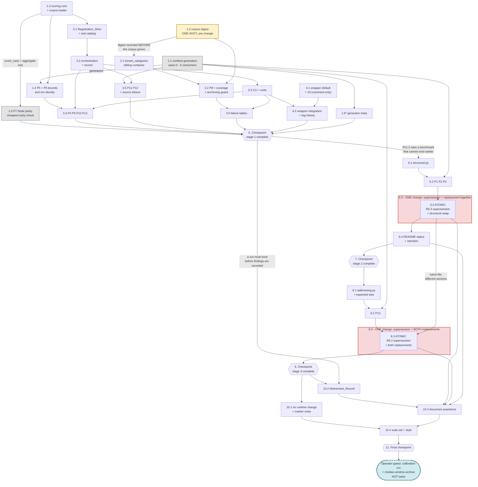

# Implementation Plan: default-tenant-freeze-retirement

## Overview

This feature retires the Phase 79 Default_Tenant byte-freeze as a standing rule
and keeps the capture machinery as a tool. Most of the work is construction: the
replacement gate does not exist, because the nightly benchmark drives the
Node_Harness, which has no tenant concept and never touches the Python read path
Phase 79 rewrote.

Three artefacts are new and nothing under `mcp_server_python/src/` changes:

- `mcp_server_python/scripts/run_benchmark.py` (Benchmark_Harness)
- `mcp_server_python/tests/baselines/structural.py` (Structural_Equivalence)
- `mcp_server_python/tests/baselines/addressing.py` (addressed-set + provenance)

The plan follows the design's "Gate continuity" staging exactly. The ordering is
not a preference: relaxing a freeze criterion before its replacement works leaves
no gate in either position, which is strictly worse than the status quo.

| Stage | Tasks | Gate on the Default_Tenant read path during the stage |
|---|---|---|
| 1 | 1-4 | Byte_Equivalence (28 tests), untouched |
| 2 | 6 | Structural for the three reporters; Byte_Equivalence still for Query_Tools |
| 3 | 8 | Structural + benchmark for Query_Tools |
| 4 | 10 | -- |

### The atomicity constraint, stated once and enforced in two places

**Task 6.3 and Task 8.3 are each ONE change. Neither may be split into "relax the
criterion" then "add the check".** R8.2 and R8.3 require that a supersession and
its replacement land in the same change, so that no revision exists in which a
freeze criterion is relaxed and its replacement check is absent. A plan that
splits them satisfies the ordering and still permits a one-commit ungated window,
which is exactly what those criteria forbid.

Tasks 6.1, 6.2, 8.1, and 8.2 deliberately land *before* their atomic sub-task.
Each adds a module or a property suite that nothing consumes yet, so the freeze is
still fully in force at those revisions. The atomic unit is the sub-task that
touches `tests/unit/test_default_tenant_byte_equivalence.py` together with the
Phase 79 spec.

### Hard sequencing constraints

1. **Task 1.2 precedes Task 2.1.** The `categories` digest must be recorded from
   the corpus as it stands *before* `tenant_categories` is added. Recording it
   after pins the post-change state and Property 8 proves nothing.
2. **Stage 1 precedes stages 2 and 3 entirely.** R11.3 cites a benchmark
   comparison that cannot exist before the harness does.
3. **Task 1.5 (Property 7) sits immediately after Task 1.3 (the scoring core),
   not at the end.** It reads the committed `quality_metrics.jsonl` and needs no
   corpus, no closures, and no backend, so it is the cheapest available validation
   of the scoring arithmetic and should fail early if the formulas are wrong.
4. **Task 1.1 lands in wave 0.** The five generators in
   `tests/properties/conftest.py` are consumed by properties in tasks 1.4, 3.4,
   3.5, 6.2, and 8.2. Same reasoning that moved Phase 79's Task 2.4 to wave 0.
5. **Tasks 6.3 and 8.3 must not be scheduled concurrently.** Both modify
   `tests/unit/test_default_tenant_byte_equivalence.py` -- 6.3 the three reporter
   scenarios, 8.3 the four Query_Tool scenarios. Different sections of one file,
   and 6.3 precedes 8.3.
6. **Task 10.2 (the Retirement_Record) comes after stage 1 has produced a run.**
   R5.3 and R6.2 record measured findings, and Decision 2 makes the first live run
   a calibration run whose zero-scoring cases must be named.
7. **`scripts/run_benchmark.py` is written by 1.3, 3.1, 3.2, and 3.3** in that
   order, each in a distinct wave.

### What cannot be completed in this environment

Named here rather than written as tasks that cannot pass:

- **The calibration run is operator-gated.** No AWS credentials and no live
  backend, so the retrieval-category Tenant_Scoped_Case expectations
  (`cs_t01`, `ar_t01`, `op_t01`, `cl_t01`, and `ss_t01`'s content terms) cannot be
  validated here. Task 10.2 writes the Retirement_Record with a named,
  explicitly-incomplete calibration section; the operator fills it from the first
  live run. Decision 2's mitigation is what makes this safe: R2.9 keeps
  Tenant_Scoped_Case scores out of the `categories` object, so a miscalibrated
  tenant case cannot fail someone else's Default_Tenant change.
- **The median-window archive is a one-time operator step, not a task.** R7.3
  forbids adding a code path for it, and the wrapper's `rotate()` only fires above
  `KEEP_RUNS` (90) against a 21-line log. Task 10.2 records the command, the
  archive filename, and the restart; the operator runs it before the first Python
  line is appended.
- **The three live-invocation entries of the Phase 79 Verification_Record remain
  unmet and operator-gated.** R8.5 requires the Retirement_Record say so and name
  the hermetic tests that stand in for each, rather than let retirement imply a
  live verification that has not occurred.
- **No deploy.** This feature changes no runtime behaviour (R15), so nothing here
  requires a redeploy.

### Standing constraints for every task

- **Nothing under `mcp_server_python/src/` changes.** This is stronger than R15.3
  asks for and it is the cheapest reviewer check available: `git diff --stat
  mcp_server_python/src/` returns empty. Task 10.1 asserts it.
- **Everything hermetic.** No AWS credential, no reachable MCP server, no live
  backend (R3.7). Benchmark tests drive `run_benchmark(data=...)` with the
  injected facade under a connect-raising socket guard.
- **Interpreter `python3.12`.** Tests run as
  `cd mcp_server_python && python3.12 -m pytest <target> -q`.
- **Markers: only `unit`, `property`, `parity`.** This feature adds none (R15.5).
  No test in this feature carries `parity` -- that marker means dual-server
  live parity, and Property 7 achieves its parity claim against the Node
  harness's committed *output* instead.
- **ASCII-only** console and diagnostic output (R1.10). `pycodestyle` clean over
  every changed Python file (R15.6). numpy-style docstrings.
- **Suite baseline is 1784 passed, 4 failed, 0 skipped** -- the four named in
  R15.4. The comparison is a **set**, not a count.
- **Do not commit or push.**

## Tasks

- [x] 1. Scoring core, shared generators, and the pre-change corpus digest
  - Stage 1 foundations. Nothing here touches the corpus, the wrapper, or any
    freeze criterion, so all 28 byte-equivalence tests stay in force throughout.
  - **1.2 must complete before 2.1.** Ordering trap: a digest recorded after
    `tenant_categories` lands pins the post-change state and proves nothing.

  - [x] 1.1 Add the five shared Hypothesis generators to the properties conftest
    - Modify `mcp_server_python/tests/properties/conftest.py`, extending the
      existing Phase 79 set (`logical_collections`, `tenants`,
      `prefixed_tenants`, `profiles`, `adapters`) rather than duplicating it.
    - `case_shapes()` -- `(matched_count, expected_length, k)` triples, **weighted**
      to include `expected_length` of 0, 1, exactly `k`, and above `k`. The zero
      draw is R4.6's input and must not be reached incidentally; the above-`k`
      draw exercises the precision clamp.
    - `benchmark_cases()` -- synthetic Benchmark_Cases over the corpus's 15 tool
      names, with `tenant_id` present or absent, and with **non-ASCII text in
      `question` and in `expected_results`** so Property 14's ASCII clause has
      something to catch.
    - `structural_views()` -- `StructuralView` values with generated collection
      names, counts **including `None`** for unprovisioned, and verdicts across
      `PASS`/`FAIL`/`SKIP`.
    - `render_perturbations()` -- line permutation, heading rewrite, caption
      rewrite, whitespace expansion, and insertion of a line naming no
      collection, no count, and no verdict.
    - `triple_perturbations()` -- the dual: drop a collection, add a collection,
      change one count, flip one verdict. **Exactly one per generated pair**, so
      Property 3's attribution assertion has a single expected finding.
    - This task lands in wave 0. Its consumers are 1.4, 3.4, 3.5, 6.2, and 8.2.
    - _Requirements: 4.6, 9.1, 9.2, 9.5_

  - [x] 1.2 Record the pre-change corpus `categories` digest
    - New file
      `mcp_server_python/tests/baselines/expected/corpus_categories_digest.json`
      holding the canonical-JSON digest of the Ground_Truth_Corpus `categories`
      object as it stands **now**, at corpus `version` `1.0.0`, plus the
      per-category case count (10 each) and the pinned field values for all 60
      Corpus_Baseline_Set cases.
    - **Ordering trap, and the reason this is its own sub-task in wave 0:** the
      digest is the mechanism that makes R2.2 hold by construction rather than by
      inspection. Recorded after `tenant_categories` is added, it certifies the
      post-change bytes and Property 8's strongest clause becomes a tautology.
    - Canonicalise with `json.dumps(obj, sort_keys=True, separators=(",", ":"))`
      and record the algorithm name alongside the digest, so a future reader can
      recompute it without guessing.
    - Verified present state to pin against: six categories, 10 cases each, 13
      distinct tool names, corpus `version` `1.0.0`.
    - _Requirements: 2.2_

  - [x] 1.3 Create the harness module with the corpus loader and the scoring core
    - New file `mcp_server_python/scripts/run_benchmark.py`. This sub-task lands
      the data model and the pure arithmetic only -- no closures, no invocation,
      no CLI.
    - Module docstring per the design: state that it mirrors
      `mcp_server_node/scripts/run_benchmark.js` and name the three deliberate
      differences (a Python Tool_Closure returns `str` so text extraction is the
      identity; tenant cases come from `tenant_categories` and report separately;
      `categories` is computed from Default_Tenant cases only).
    - `BenchmarkCase` frozen dataclass with the eight corpus fields plus
      `tenant_scoped`, **derived** as `"tenant_id" in tool_args` rather than
      stored. Deriving it makes R2.8's partition a function of the case data, so a
      case placed in the wrong container is still classified correctly.
    - `load_corpus(path)` reading both `categories` and `tenant_categories`,
      tagging each case with its origin container. An **absent
      `tenant_categories` is not an error** -- treat it as empty so a corpus
      predating this feature still runs. A present-but-malformed case *is* an
      error naming the case `id` and the field, because scoring an authoring
      mistake as zero buries it inside a plausible number.
    - `score_case(case, response, k) -> CaseResult`: case-insensitive substring
      match of each `expected_results` entry against the response text;
      `precision = matched / min(k, len(expected))` clamped to `[0, 1]`;
      `recall = matched / len(expected)` clamped; `mrr` as the reciprocal of the
      1-based position of the first response text containing a match, and 0
      otherwise. **`expected_results` empty yields `precision` 0 and `recall` 0**
      -- not a `ZeroDivisionError` and not `nan`, which would serialize as invalid
      JSON and take the wrapper's normalisation step down with it.
    - `aggregate(results) -> ScopeMetrics`: means for `precision_at_k`,
      `recall_at_k`, and `mrr`; `coverage` as the covered-case count over the case
      count; `latency_p50_ms` and `latency_p95_ms` as integer percentiles.
    - Round the four quality metrics to 4 decimal places; report both latency
      values as integers.
    - `expected_min_results` is carried on the dataclass for schema conformance
      and **read by neither harness** -- confirmed absent from
      `computeQueryMetrics`, `aggregateMetrics`, and `detectRegressions`. Do not
      gate on it; a docstring line recording that it is documentary is enough.
    - _Requirements: 1.1, 4.1, 4.2, 4.3, 4.4, 4.5, 4.6, 4.7_

  - [x] 1.4 Property tests for metric bounds and the mrr/coverage identity
    - New file `mcp_server_python/tests/properties/test_benchmark_scoring.py`.
    - **Property 5: Metric bounds, including the empty expectation.** Over
      `case_shapes()`: every reported `precision_at_k`, `recall_at_k`, `mrr`, and
      `coverage` lies in `[0, 1]`; an empty `expected_results` records exactly 0
      for `precision` and 0 for `recall`.
    - **Property 6: `mrr` equals `coverage` at every aggregation.** Aggregate
      `mrr` equals aggregate `coverage` exactly; per-case `mrr` is `1.0` when at
      least one entry matched and `0.0` otherwise.
    - Property 6 is kept separate from Property 5 because it carries a consequence
      a bounds property hides: **the Gated_Metric triple
      `{mrr, precision_at_k, coverage}` has rank two, so the Regression_Check
      evaluates two independent signals, not three.** State that in a comment on
      the test -- a reviewer counting three would overestimate the gate.
    - Hypothesis at `max_examples=100`, `deadline=None`. Tag each test with a
      comment naming the design property, matching the Phase 79 convention:
      `# Feature: default-tenant-freeze-retirement, Property 5: ...`
    - _Requirements: 4.1, 4.2, 4.3, 4.4, 4.5, 4.6, 5.2_

  - [x] 1.5 Model-based formula parity against the committed metrics log
    - New file `mcp_server_python/tests/unit/test_benchmark_node_parity.py`,
      marker `unit`.
    - **Property 7: Formula parity with the incumbent harness.** For every
      per-case row in `sdd_framework/execution_state/quality_metrics.jsonl`,
      recompute `precision`, `recall`, and `mrr` from
      `(len(matched_results), len(expected_results), k=5)` with `score_case`'s
      arithmetic and assert exact equality with the recorded Node value. For every
      aggregate scope -- the `overall` object and each of the six `categories`
      values -- re-aggregate that run's cases with `aggregate` and assert every
      recorded `precision_at_k`, `recall_at_k`, `mrr`, `coverage`,
      `latency_p50_ms`, and `latency_p95_ms`.
    - Verified sample size to assert against: **21 runs, 1,260 per-case rows, 147
      aggregate scopes.** Assert those counts too, so a truncated or rotated log
      degrades the test loudly instead of silently passing over three rows.
    - Also assert the R5.2 identity empirically: all 147 scope observations report
      `mrr == coverage`.
    - **Sequenced here on purpose.** This needs no corpus, no closures, and no
      backend -- only `score_case` and `aggregate` from 1.3. It is the cheapest
      early check that the scoring core is right, and deferring it to the end
      would let a formula error propagate through every later task.
    - It does not subsume Property 5, and the overlap is deliberate: the log is a
      fixed sample containing no case with an empty `expected_results`, so it
      cannot reach the corner that breaks a naive implementation.
    - _Requirements: 5.1, 5.2_

  - [x]* 1.6 Generator meta-test for the weighted corners
    - New file
      `mcp_server_python/tests/properties/test_benchmark_fixture_meta.py`.
    - Assert `case_shapes()` actually reaches `expected_length` of 0, 1, exactly
      `k`, and above `k` within a bounded draw budget; that
      `benchmark_cases()` produces both tenant-scoped and unscoped cases and at
      least one non-ASCII string; and that `triple_perturbations()` applies
      exactly one mutation per pair.
    - Marked optional: this is a guard against future generator drift, not an
      acceptance criterion. Phase 79 marked its equivalent fixture meta-test the
      same way.
    - _Requirements: 4.6_

- [x] 2. Corpus extension with tenant-scoped cases
  - Requires 1.2 to have recorded the digest first.

  - [x] 2.1 Add the `tenant_categories` sibling container and bump the corpus version
    - Modify `mcp_server_node/test/benchmark/ground_truth.json`: add one sibling
      top-level key `tenant_categories`, keyed by the same six Benchmark_Category
      names, and move `version` to `1.1.0`.
    - **Leave `categories` byte-unchanged.** This satisfies R2.2 by construction.
    - **Why a sibling container and not `categories`:** the Node_Harness's
      `loadCorpus` spreads `raw` and iterates `Object.entries(raw.categories)`
      only, so an unknown top-level key is carried through and never read. Adding
      tenant cases under `categories` would instead change every category's
      Node-visible case count from 10 to 10+N, silently shifting the per-category
      aggregates the shared median is built from, and would hand `tenant_id` to
      Node handlers that have no tenant concept.
    - Eight cases, tenant `gw_v17`, per the design's slot table: `cs_t01`
      (`analyze_code_structure`), `ss_t01` (`search_documentation` naming
      `global-workflow-docs-v8-0-0` explicitly), `ar_t01` (`search_architecture`),
      `ee_t01` (`search_ee2_standards`), `op_t01` (`get_job_details`), `kb_t01`
      (`get_knowledge_base_status`), `ki_t01` (`check_knowledge_integrity`),
      `cl_t01` (`trace_full_execution_chain`).
    - Every case carries exactly the eight declared Benchmark_Case fields and no
      more; `tenant_id` rides inside `tool_args` (R2.3).
    - **Anchoring trap.** `mdc-workflow-docs-titan1024` is a substring of
      `gw_v17_mdc-workflow-docs-titan1024`, so under case-insensitive substring
      scoring a bare collection name would match a render containing only the
      prefixed member -- the exact regression the case exists to catch would pass.
      Write reporter-case entries anchored on the rendered list marker:
      `"- mdc-workflow-docs-titan1024"`. The two-character `- ` prefix is present
      in both status render paths.
    - **Five-entry cap.** At `len(expected) <= k` the precision denominator is
      `len(expected)` and precision equals recall; since `recall_at_k` is not
      gated and `precision_at_k` is, the cap is what puts a reporter case's
      fraction-found signal inside the gate at full resolution.
      `tenant_collection_set(gw_v17)` has six members, so `kb_t01` names five and
      drops `mdc-community-summaries-titan1024`, which is redundant with
      `mdc-ee2-standards-titan1024` for the shared-reachability claim.
    - `expected_min_results` set to `len(expected_results)` on every new case.
    - **`ar_t01` is expected to score 0** while Gap J is open
      (`gw_v17_mdc-community-summaries-titan1024` holds zero documents, so
      `search_architecture` returns an `[INFO] Skip_Block`). Record that in the
      case's `notes` so a reader does not mistake a tracker for a miscalibration.
    - Note in `notes` for `ee_t01` that it is the strongest of the eight: EE2
      standards are `shared` scope, the `gw_v17_`-prefixed EE2 index is empty, so
      the case scores near 1.0 when shared-scope routing works and 0 when it
      regresses to prefix-everything.
    - _Requirements: 2.1, 2.3, 2.4, 2.5, 2.6_

  - [x] 2.2 Corpus invariance, coverage, and anchoring guard assertions
    - New file `mcp_server_python/tests/unit/test_benchmark_corpus.py`.
    - **Property 8: Corpus invariance under tenant-scoped extension.** Every
      `categories` case matches its pinned expectation field-by-field; the
      canonical-JSON digest of the whole `categories` object equals the digest
      recorded in 1.2; each of the six category lists holds exactly 10 cases.
      Every `tenant_categories` case has exactly the eight declared fields,
      carries a `tenant_id` in `tool_args`, and that `tenant_id` names a
      Tenant_Catalog tenant whose `index_prefix` is non-empty.
    - The count clause is the specific protection against the failure mode above:
      a tenant case added under `categories` would move a Node-visible count from
      10 to 11 and quietly shift the shared median.
    - Assert `tenant_scoped` derivation agrees with the containing key for all 68
      cases, so a misfiled case is detected rather than silently reclassified.
    - **R2.5/R2.6 coverage assertions**, in the shape of the existing
      `test_required_r63_reporting_tools_are_covered` guard: at least one
      Tenant_Scoped_Case per category; at least one naming
      `get_knowledge_base_status`; at least one naming
      `check_knowledge_integrity`; at least one Query_Tool case whose
      Hybrid_Domain read resolves to a Resolved_Collection_Set of more than one
      member. **Compute the last one through `resolve_read_targets`** rather than
      asserting a collection name, so the assertion tracks the router instead of a
      string.
    - **Anchoring guard.** Assert each reporter case's `expected_results` entries
      fail to match a synthetic render containing *only* the `gw_v17_`-prefixed
      collection names. Without this, the `- ` anchoring can rot silently and the
      reporter cases quietly stop discriminating.
    - Marker `unit`. Per the design's file table, Property 8 lives with the unit
      corpus assertions rather than under `tests/properties/`.
    - _Requirements: 2.2, 2.3, 2.4, 2.5, 2.6_

- [x] 3. Harness closure collection, invocation, and emitted record
  - Writes `scripts/run_benchmark.py` in three ordered passes (3.1, 3.2, 3.3),
    each in its own wave.

  - [x] 3.1 Registration_Shim, `build_tool_map`, and the real catalog
    - Modify `mcp_server_python/scripts/run_benchmark.py`.
    - `_ToolShim` stands in for a `FastMCP` server: `tool(*args, **kwargs)`
      returns a decorator that records the closure under `kwargs["name"]` or
      `fn.__name__` and **returns the function unchanged**, so the module's own
      reference is unaffected.
    - **Handle both registration idioms.** The six modules the corpus reaches all
      call `@mcp.tool(...)` with parentheses, so `tool` is a decorator factory and
      never receives the function directly -- but `error_analysis.register` uses
      `@mcp.tool()` with no arguments and a future module could use bare
      `@mcp.tool`. Support the bare-callable form too.
    - Expose an `async list_tools()` returning `[]`, because
      `utility.register` reads `mcp` for `list_tools` inside a closure. Defensive
      only: the corpus does not currently reach `utility`.
    - `build_tool_map(data, catalog, *, state_dir)` derives which modules to
      register **from the corpus**, not from a hardcoded list: collect the set of
      `tool` values across the selected cases, map each to its owning module, and
      register only those. Verified ownership -- `code_analysis`:
      `analyze_code_structure`, `find_dependencies`, `find_callers_callees`,
      `trace_full_execution_chain`; `semantic_search`: `search_documentation`,
      `explain_with_context`, `get_knowledge_base_status`,
      `check_knowledge_integrity`; `graph_rag`: `search_architecture`,
      `get_code_context`, `trace_data_flow`; `ee2_compliance`:
      `search_ee2_standards`; `operational`: `get_operational_guidance`,
      `list_job_scripts`, `get_job_details`.
    - **`catalog=None` trap.** `run_tenant_scoped(tenant_id, catalog, factory)`
      resolves `tenant_id` against the catalog; with `None` it raises and **every
      Tenant_Scoped_Case records an error**, which reads exactly like a tenant
      routing bug. Call `src.tenancy.runtime.get_catalog()` once and thread the
      result into every tenant-scoped module's `register()`, mirroring
      `mcp_server.py`'s `_TENANT_SCOPED_MODULES` tuple (`semantic_search`,
      `code_analysis`, `graph_rag`, `operational`, `ee2_compliance`,
      `workflow_info`). A catalog load failure is **fatal** -- exit 1 naming the
      failure -- not degraded. This is the one place the harness deliberately
      diverges from `mcp_server.py`, which warns and continues, correctly, for a
      server that must boot.
    - Module-specific kwargs: `graph_rag` and `utility` take
      `session_manager` / `state_dir`; supply a `tempfile.mkdtemp()` scratch
      `state_dir` so R3.6 holds. Omit `manifest_registry` for `semantic_search`
      -- the corpus's cases do not reach the manifest path.
    - _Requirements: 1.2, 1.3, 1.4_

  - [x] 3.2 `run_benchmark` orchestration, per-case accounting, and the record
    - Modify `mcp_server_python/scripts/run_benchmark.py`.
    - `run_benchmark(corpus, *, data=None, catalog=None, category=None, results_dir=None) -> BenchmarkRun`.
    - **Facade seam (R3.1/R3.2).** With `data=None`, build via
      `src.data.backend_selector.create_data_access(config)` using
      `src.config.environment.load_config()` -- the same call `mcp_server.py`
      makes, so the harness sees the backend the served runtime sees. When `data`
      is not `None`, use it verbatim and **never reach `create_data_access`**,
      which makes zero-backend-traffic structural rather than a matter of stub
      fidelity.
    - Read no `DB_BACKEND` token anywhere in the module. Backend-invariance comes
      from taking no backend argument, mirroring Phase 79's Property 3 reasoning.
    - Invoke the collected **Tool_Closure** with the case's `tool_args` as keyword
      arguments, `tenant_id` included, so `run_tenant_scoped` binds the tenancy
      ContextVar and the attribution header is applied exactly as a consumer's
      call does. **Never call a `_tool_*` internal and never call
      `run_tenant_scoped` directly** -- doing either would skip the binding the
      harness exists to exercise.
    - Treat the return value as a **single response text** with no `content`-list
      unwrapping: a Python Tool_Closure returns `str`.
    - Per-case failure shape, one record for both triggers: `precision` 0,
      `recall` 0, `mrr` 0, `covered` false, a real `latency_ms`, and an `error`
      naming the absent tool or carrying the exception message. Then **continue**
      to the remaining cases. The invariant that matters is the denominator: a run
      that dropped a failing case would compute metrics over a shrunken set and
      report a *higher* score for a *worse* system.
    - Catch `Exception`, not `BaseException`, so `KeyboardInterrupt` still
      terminates a 68-case run. Add a defensive non-`str` return-type check whose
      `error` names the observed type -- no current tool does this, and a future
      one that did would otherwise score 0 with no explanation.
    - Partition per R2.8/R2.9: `overall` and `categories` from **Default_Tenant
      cases only**, keyed by the six Benchmark_Category names;
      `tenant_overall` and `tenant_categories` additive alongside. This is what
      keeps `categories` comparable with the 21 Node lines already in the log, and
      why a deliberately-zero tenant case cannot move the number R11.3 gates on.
    - Record fields: `timestamp`, `version`, `harness` (compound:
      runtime, script, backend, embedding profile -- a superset of R4.9's bare
      identifier, so a mixed median window is detectable after the fact),
      `corpus_version` equal to the loaded corpus's `version`, `total_queries`,
      the four metric objects, `queries[]` with per-case `tenant_id`, and a
      `regression` object for shape parity with the Node record.
    - **`MCP_BENCHMARK_RESULTS_DIR` collision trap.** The Nightly_Wrapper defaults
      that variable to `${NODE_DIR}/test/benchmark/results` (verified at
      `run_benchmark_nightly.sh` line 47) and locates the freshest `*.json` there.
      Pointing `MCP_BENCHMARK_CMD` at this harness without also setting the
      results dir would have the wrapper normalise **a stale Node record into the
      log as though it were a Python run** -- and that failure is silent. So:
      honour `MCP_BENCHMARK_RESULTS_DIR` when non-empty, and otherwise default to
      a **separate** directory, `mcp_server_python/test/benchmark/results`. Never
      share the Node default.
    - Write no file anywhere else (R3.6).
    - _Requirements: 1.5, 1.6, 2.7, 2.8, 2.9, 3.1, 3.2, 3.3, 3.5, 3.6, 4.8, 4.9, 4.10_

  - [x] 3.3 CLI surface and exit statuses
    - Modify `mcp_server_python/scripts/run_benchmark.py`: add
      `main(argv=None) -> int`.
    - `--dry-run`: validate the corpus, print the per-category case plan and the
      set of required tool names, invoke no closure, write no record, exit 0.
    - `--category NAME`: execute only cases carrying that `category` value. An
      unknown value emits a message **naming all six** Benchmark_Category names
      and exits 1. A valid-but-empty category is a `[WARN]` plus a record whose
      `overall` reports `coverage` 0 over 0 cases and exit 0 -- nothing failed.
    - `--tenant-only` / `--default-only` as conveniences. These two are not
      required by any criterion; include them only if they cost nothing.
    - Exit status contract: 0 normally **including a poor score** -- the wrapper's
      Regression_Check owns the quality verdict; 1 for an unknown `--category`, a
      catalog load failure, or an absent/malformed corpus; and for the all-error
      case, **exit 1 and still write the record** with `coverage` 0.
    - That last row looks redundant and is not. The wrapper logs a non-zero
      harness exit as `[WARN]` and **continues** (line 79), but logs a missing
      result file as `[ERROR]` and **exits 1** (lines 84-86). Writing the record
      means one failure produces one signal, and a backend outage becomes a
      visible line in the quality history rather than a hole in it -- which is how
      four of the 21 recorded Node runs could be accounted for in the threshold
      analysis.
    - All console output ASCII with `[OK]` / `[WARN]` / `[ERROR]` prefixes.
    - _Requirements: 1.7, 1.8, 1.9, 1.10_

  - [x] 3.4 Property tests for determinism, partition, accounting, and artefact shape
    - Modify `mcp_server_python/tests/properties/test_benchmark_scoring.py`.
    - **Property 4: Scoring determinism.** Two successive `run_benchmark`
      invocations over a fixed corpus selection and a fixed injected facade
      produce records equal at every field except `timestamp`, per-case
      `latency_ms`, and the two derived latency percentiles. No criterion states
      this directly; it is included because every comparison this feature's gate
      performs presupposes it -- if two runs over identical inputs can differ in
      `coverage`, a Regression_Check exceedance is noise and the
      Governing_Threshold is calibrated against nothing.
    - **Property 9: Case selection and scope partition.** `--category` executes
      exactly the corpus cases carrying that value. For any pair of runs sharing a
      Default_Tenant case set but differing arbitrarily in their
      Tenant_Scoped_Case sets **and in those cases' scores**, `overall` and
      `categories` are equal, and the `categories` keys are exactly the six names.
      The second clause is what makes `ar_t01`'s designed zero safe.
    - **Property 10: Total accounting under failure.** For any selection in which
      an arbitrary subset name uncollected tools and an arbitrary subset raise:
      exactly one record entry per selected case; every failed entry reports the
      zero shape with a `latency_ms` and a naming `error`; every other case scored
      normally; the process completes. At the boundary where every case errors,
      `coverage` is 0 and the exit status is 1.
    - **Property 14: Emitted artefact conformance.** Every quality metric is a
      float rounded to at most 4 places; both latency values are integers; the
      record carries `harness` and a `corpus_version` equal to the loaded corpus's
      `version`; every string written to stdout or stderr encodes to ASCII. The
      ASCII clause is a property rather than a smoke check because it varies with
      input: a case whose `question` or expected entry carries a non-ASCII
      character, or an exception whose message does, flows straight into a console
      line.
    - _Requirements: 1.6, 1.8, 1.10, 2.8, 2.9, 3.1, 3.2, 3.3, 3.4, 4.7, 4.8, 4.9, 4.10_

  - [x] 3.5 Hermeticity and closure-binding property tests
    - New file
      `mcp_server_python/tests/properties/test_benchmark_hermetic.py`.
    - **Property 11: Hermeticity of the injected path.** Under a
      **connect-raising socket guard** and a write-raising filesystem guard, a run
      with an injected facade attempts no socket connection, constructs no Bedrock
      client, and opens no file for writing outside the record output directory.
      R3.2 is structural first (`create_data_access` is never reached); this is the
      backstop for an incidental import-time or per-case client construction. The
      write clause matters independently: the harness threads a
      `tempfile.mkdtemp()` `state_dir` into `graph_rag` and `utility`
      registration, and a path bug there would write session state into the repo.
    - **Property 12: Closure collection and tenancy binding.** For any subset of
      referenced tool names, `build_tool_map` returns a mapping whose keys include
      every name, each value being the **identical coroutine object** the owning
      module registered. For any Tenant_Scoped_Case, the tenant active in the
      tenancy ContextVar during the closure's execution is the case's `tenant_id`
      -- the only way to confirm the harness reaches tenancy as a consumer does
      rather than as a test double would.
    - **Source-token assertions** in the same file, since a property cannot prove
      the absence of a call path: `scripts/run_benchmark.py` contains no `_tool_`
      token, no `run_tenant_scoped` token, and no `DB_BACKEND` token.
    - Extend `tests/baselines/capture.py`'s `_StubDataAccess` where the corpus
      needs it, via `_StubGraphDB`'s existing cypher-substring `fragments`
      override rather than new dispatch code: call-graph neighbourhoods for
      `find_callers_callees`, dependency edges for `find_dependencies`, and
      traversal chains for `trace_full_execution_chain` and `trace_data_flow`.
      **Reuse the stub rather than writing a second one** -- the recorded
      responses are the same frozen store content the Structural_Equivalence
      baselines are built from, so a benchmark test and a structural test that
      disagree are disagreeing about rendering, not about data.
    - _Requirements: 1.2, 1.3, 1.4, 2.7, 3.2, 3.6_

  - [x] 3.6 Unit tests for the corpus, selection, and failure tables
    - New file `mcp_server_python/tests/unit/test_benchmark_harness.py`.
    - Cover the design's Error Handling tables with fixed inputs: corpus absent;
      corpus not valid JSON (message names path, line, column); `categories`
      absent or not an object; **`tenant_categories` absent is not an error**; a
      case missing a required field errors naming the case `id` and the field;
      `--category` unknown lists all six and exits 1; `--category` valid but empty
      warns, writes a zero-coverage record, exits 0.
    - Cover each CLI mode's observable: `--dry-run` writes no file and invokes no
      closure; the all-error path both writes a record and exits 1; a scored run
      with a poor score exits 0.
    - Cover the per-case error shapes for all four triggers, including an unknown
      `tenant_id` in `tool_args` surfacing as **one bad case** rather than a
      run-wide routing failure.
    - Assert a malformed count and an empty-view condition behave as the design
      specifies once 6.1 exists; if 6.1 has not landed, leave that to 6.2.
    - Runs with no AWS credential and no reachable server (R3.7).
    - _Requirements: 1.6, 1.7, 1.9, 3.3, 3.4, 3.7_

- [x] 4. Threshold reconciliation and nightly wrapper integration

  - [x] 4.1 Align the wrapper's regression default with the Governing_Threshold
    - Modify `mcp_server_python/scripts/run_benchmark_nightly.sh`.
    - The Governing_Threshold is **10 percent, relative, per Benchmark_Category
      and for `overall`, against the median of the trailing 7 log lines, with a
      drop of exactly 10.00 percent passing** (the comparison is
      `cur_v < med * (1 - pct/100.0)`, strict `<`).
    - `MCP_BENCHMARK_REGRESSION_PCT`'s default is **already 10** (verified at line
      50), so R6.3 is satisfied with **no functional edit**. This sub-task is a
      comment-only change: record in the header comment that 10 is the
      Governing_Threshold named by the Retirement_Record, that it is relative
      against the `MCP_BENCHMARK_MEDIAN_WINDOW` (7) median, and that the corpus
      `metrics_config` values (`regression_threshold_pct` 5,
      `critical_threshold_pct` 15) govern the Node_Harness's own in-process check
      and exit code and are unchanged by this feature.
    - **Do not touch anything else in the wrapper.** R7.2 keeps its snapshot
      rotation, per-category Regression_Check, and structured ERROR emission
      unchanged; R7.3 limits the diff to this default and comment text. Since the
      default needs no change, the comment-stripped content must be byte-identical
      to its pre-change form -- 4.2 asserts that.
    - _Requirements: 6.3, 7.2, 7.3_

  - [x] 4.2 Wrapper integration and log-history tests
    - New file
      `mcp_server_python/tests/unit/test_benchmark_wrapper_integration.py`.
    - **R7.4/R7.5 hermetically, with no new production code.** `get_quality_metrics`
      reads `quality_metrics.jsonl` from a `state_dir`, and
      `utility.register(mcp, data, *, state_dir=...)` accepts that path: write a
      synthetic two-line log of Python-derived records into `tmp_path`, register
      `utility` against the same `_ToolShim` the harness uses with
      `state_dir=tmp_path`, and invoke the collected `get_quality_metrics` closure
      with `compare=False` and `compare=True`. Assert the overall block and all six
      category blocks render, the comparison block renders under `compare=True`,
      and no `Unknown` or `N/A` placeholder appears for a field the record carries.
    - Reusing the Registration_Shim here rather than importing the renderer is the
      point: the integration test and the harness cannot drift apart in how they
      reach a tool.
    - **R7.1 is the one genuine subprocess test.** Run the wrapper once with
      `MCP_BENCHMARK_CMD` pointing at the harness in injected-facade mode and both
      `MCP_BENCHMARK_RESULTS_DIR` and the state directory redirected under
      `tmp_path`. Assert the log grew by **exactly one** line and that the line
      parses as the record. One invocation, not a sweep -- nothing varies with
      input and each iteration costs a subprocess.
    - **Log-history table.** Extract the wrapper's inline `python3 -` heredoc and
      drive it against synthetic logs of 0, 1, 2, and 8 lines. 0 and 1 lines:
      `insufficient_history`, exit 0, no ERROR (R5.5, no code change needed). **2
      lines: the outer guard passes and reports ok, but every metric hits the
      per-metric `if len(vals) < 2: continue` and is skipped** -- assert that, and
      comment it, because "the check reported ok" and "the gate is armed" are
      different statements on the second night after the changeover.
    - The 8-line case pins **finding 1's strict `<`**: engineer one line at exactly
      10.00 percent below the median (must pass) and one just below it (must
      fire). An off-by-one in the comparison operator would otherwise surface only
      in production.
    - **R7.3 assertion**: compare the comment-stripped wrapper content to its
      recorded pre-change form and assert equality.
    - _Requirements: 5.5, 7.1, 7.3, 7.4, 7.5_

- [x] 5. Checkpoint - stage 1 complete, the replacement gate exists
  - Ensure all tests pass, ask the user if questions arise.
  - The Benchmark_Harness exists, drives Python Tool_Closures through the tenancy
    ContextVar, scores by formulas proven identical to the incumbent's over 1,260
    recorded cases, and slots in behind the wrapper. The corpus carries eight
    tenant-scoped cases without moving a byte of `categories`.
  - **No freeze criterion has been touched.** All 28 byte-equivalence tests are
    still in force. Confirm the failing-test set is still exactly the four named in
    R15.4, and `pycodestyle` is clean on every file added so far.
  - Confirm `git diff --stat mcp_server_python/src/` is empty.

- [x] 6. Stage 2 - Structural_Equivalence replaces the reporting freeze
  - **6.3 is ONE atomic change and must not be split.** R8.2 requires the R6.3
    supersession and its replacement check land together, so no revision exists in
    which the reporting freeze is relaxed and Structural_Equivalence is absent.
  - 6.1 and 6.2 land first on purpose: they add a module and a property suite that
    nothing consumes yet, so Byte_Equivalence is still fully in force at those
    revisions.

  - [x] 6.1 Build the Structural_Equivalence evaluator
    - New file `mcp_server_python/tests/baselines/structural.py`.
    - **Placement is deliberate.** R15.3 permits this in `src/`, but no `src/`
      module needs it (it has exactly one caller, a test), putting it in `src/`
      would make it importable by a tool -- the coupling R15.1 and R15.2 exist to
      prevent -- and it belongs beside `capture.py`, which already owns the other
      comparison relation. It also makes R15.1 and R15.3 vacuously true: the set
      of modified `src/` files stays empty. Precedent: `capture.py`'s own docstring
      records that it lives under `tests/` for a comparable reason.
    - **Import stdlib only.** A parser that shared a constant with the renderer it
      checks could not detect that constant changing.
    - `StructuralView` frozen dataclass: `collections: Mapping[str, int | None]`
      and `verdicts: Mapping[str, Verdict]` with `Verdict` in
      `PASS`/`FAIL`/`SKIP`. **`None` means unprovisioned and is distinct from
      `0`** -- absent and present-but-empty are different findings that Phase 79
      renders distinguishably, and collapsing them would blind the relation to a
      collection disappearing from a tenant's store.
    - `parse_structural(text) -> StructuralView` with the four extraction rules:
      - **Collection line**: a list item whose text ends in ` <int> documents` or
        ` unprovisioned`; name is the token before the first `:`, with a trailing
        ` (<scope>)` annotation stripped. **The terminal is the discriminator, and
        it is the only one available**: the graph block emits
        `  - CALLS: 1020000` and `  - FortranSubroutine: 29605`, which share the
        list-item-with-colon shape. Matching on `mdc-` instead would break on a
        rename and admit nothing useful.
      - **Status verdict**: a `Status` field line carrying an `[OK]` / `[ERROR]`
        token, **keyed by the enclosing section heading** -- two `- **Status:**`
        lines exist (vector, graph) and the heading is what distinguishes them.
      - **Integrity verdict**: a three-cell pipe row; verdict from cell 2's token,
        **overridden to `SKIP` when cell 3 opens with `[SKIP]`**. This is the
        highest-value trap in the module: `_check_path_consistency` and three
        siblings return `_Check(name, True, "[SKIP] ...")`, which renders as
        `| Path Consistency | [OK] | [SKIP] ... |`. An extractor reading the
        status column alone scores a real pass and a silent skip as **equal** --
        precisely the degradation this relation exists to catch.
      - **Health verdict**: a line opening with a bracket token carrying a bolded
        label then `: <status>`, keyed by the label. The functional-probe table is
        a pipe row and correctly falls to the integrity rule, whose status cell is
        explicit there.
      - Everything else ignored (R9.2).
    - `compare_structural(baseline, candidate) -> list[str]`: **one finding per
      divergence**, ordered collections-then-verdicts and sorted by name so the
      message is stable. A set difference of three names produces three findings,
      not one opaque set diff -- the first follow-up is expected to change exactly
      one collection in the `gw` status total, and a reviewer needs to read
      "exactly this one moved" off the failure directly.
      - `structural: collection present only in baseline: <name>` and the mirror.
      - `structural: <name> document count 129013 != 128262`.
      - `structural: check <name> verdict PASS != SKIP`.
    - Two parse-time conditions: **a baseline view that is empty** (no collection,
      no verdict) must fail naming the scenario rather than compare equal to
      another empty view -- a relation that passes because it found nothing to
      check is the failure mode a reviewer would never see. **A malformed count
      raises** rather than defaulting: `None` already means unprovisioned and `0`
      already means provisioned-empty, so a third meaning folded into either would
      blind the relation to the transition it exists to see.
    - R9.6 is satisfied by `parse_structural` taking `str`: the same function reads
      a recorded `pre_change/*.md` baseline and a fresh render, so no separate
      baseline format exists and the two cannot drift.
    - _Requirements: 9.1, 9.2, 9.3, 9.4, 9.5, 9.6_

  - [x] 6.2 Property tests for the relation
    - New file
      `mcp_server_python/tests/properties/test_structural_equivalence.py`.
    - **Property 1: Structural_Equivalence is an equivalence relation.**
      Reflexive, symmetric, transitive over `structural_views()`. Reflexivity is
      what makes a re-recorded baseline a valid reference at all; symmetry is what
      makes the R9.3 mirror finding well-defined; transitivity is what lets the
      Follow_Up_Sequence chain three successive re-records without the third
      silently diverging from the first, which R14.2's serial ordering depends on.
    - **Property 2: Insensitivity to non-identifying variation.** Over the recorded
      `pre_change/*.md` reporter baselines and `render_perturbations()`, the
      comparison returns no findings. This is the half that permits the follow-ups
      to reword a report -- and the half a broken relation passes trivially, which
      is why Property 3 is not optional.
    - **Property 3: Sensitivity to the identifying triple, with attribution.** A
      single perturbation from `triple_perturbations()` yields a non-empty finding
      list in which **exactly one** finding names the perturbed element, and the
      collection / count / verdict findings name what R9.3, R9.4, and R9.5 require.
    - **Pin two inputs alongside the generator**, because each is a real observed
      shape a plausible extractor gets wrong and a random generator would not
      construct: a render carrying `[SKIP]` in an integrity table's **details**
      cell while the status cell reads `[OK]`; and a render listing only
      `gw_v17_mdc-workflow-docs-titan1024` compared against a baseline expecting
      `mdc-workflow-docs-titan1024`, which bare-substring extraction would pass.
    - Properties 2 and 3 together are what stop the relation degrading into
      permitting any change at all: Property 2 alone is satisfied by a relation
      that ignores everything, Property 3 alone by byte equality. State that in a
      comment.
    - `max_examples=200` on Properties 2 and 3 rather than 100: the perturbation
      space is small and discrete, and the interesting draws (a perturbation
      landing on the one collection whose count is `None`, a permutation moving a
      table row across its header) are individually low-probability.
    - _Requirements: 9.1, 9.2, 9.3, 9.4, 9.5, 9.6, 13.6_

  - [x] 6.3 ATOMIC - supersede the reporting freeze and swap in the structural check
    - **ONE change. Do not split.** Every bullet below lands together. R8.2 forbids
      a revision in which the R6.3 relaxation is present and the structural check
      is not.
    - Modify
      `mcp_server_python/tests/unit/test_default_tenant_byte_equivalence.py`:
      compare each `get_knowledge_base_status`, `check_knowledge_integrity`, and
      `mcp_health_check` scenario against its recorded baseline under
      **Structural_Equivalence** instead of Byte_Equivalence (R10.5). Touch only
      the reporter scenarios; the four Query_Tool scenarios stay byte-frozen until
      8.3.
    - **Retain a coverage guard** asserting a scenario covering each of the three
      reporter tools is present (R10.6), so relaxing the comparison cannot shrink
      coverage. The existing `test_required_r63_reporting_tools_are_covered` is the
      shape to keep.
    - **Retain the earned-mask tests** that reject a mask over two identical runs
      and a mask broader than the volatile span (R13.4). The earned-mask guarantee
      must survive the relaxation.
    - Modify `.kiro/specs/shared-scope-query-routing/requirements.md`:
      - Record Requirement 6 criterion 3 as **superseded**, naming this feature as
        the superseding authority, and stating that Structural_Equivalence
        replaces Byte_Equivalence for the Status_Reporter, the Integrity_Checker,
        and the Health_Reporter (R10.1).
      - The superseding criterion **carries the three conditions of R9.1 as its
        own text**, not by reference alone (R10.2): equal set of
        Physical_Collection names, equal per-collection document count, equal
        per-check Check_Verdict.
      - Restate Requirement 10 criterion 5 in the form requiring the
        no-`tenant_id` Integrity_Checker sample to be drawn from the **union of
        the Default_Tenant's Resolved_Collection_Sets across the five
        Logical_Collections**, and replace its 2026-08-19 amendment note with a
        note naming this feature as the resolution of the structural conflict
        (R10.3).
    - Modify `.kiro/specs/shared-scope-query-routing/design.md`: state Property 8
      over **any Tenant** rather than over any Tenant whose `index_prefix` is
      non-empty, and replace its 2026-08-19 amendment note with a note naming this
      feature as the resolution (R10.4).
    - **Expected transitional failure.** Between this change and a follow-up's
      re-record, the reporter scenarios pass under the structural relation. If the
      suite shows a fifth failure at this commit and it is not this module, the
      staging was violated -- that is exactly what R8.6 makes checkable.
    - _Requirements: 8.2, 10.1, 10.2, 10.3, 10.4, 10.5, 10.6, 13.4_

  - [x] 6.4 Record the capture mechanism's status and the re-record affordance
    - Modify `mcp_server_python/tests/baselines/README.md`:
      - State that the Baseline_Capture_Mechanism is an **instrument available to
        a high-surface refactor rather than a standing gate**, naming this feature
        as the authority for that status (R13.2).
      - **Retain** the Phase 79 Reference_Revision
        `4eb422915bdf2728466e6ff5df449b7a539cdede` as the provenance of the
        `pre_change/` captures (R13.3).
      - State that a **Structural_Equivalence baseline is re-recordable from any
        revision**, in contrast to a Byte_Equivalence baseline, which is valid only
        from the revision immediately preceding the change it gates (R13.6).
        Property 1's transitivity clause is what makes this true rather than
        merely asserted; cite it.
      - Record the R10.7 re-record procedure: when a Follow_Up_Sequence change
        alters the set of Physical_Collections the Status_Reporter lists for the
        Default_Tenant, the `get_knowledge_base_status` recorded baseline is
        re-recorded to the corrected set **in that same change**, and the
        Retirement_Record names the altered collection. The design generalises
        this to all three parts of the relation and all three reporters, because a
        gate no intended change can pass is not a gate.
    - Add retention assertions to `tests/unit/test_freeze_retirement_records.py`
      scaffolding, or a small dedicated test if that file has not landed:
      `capture.py`, every `recorded_backend/*.json` scenario, and the
      `derive_masks` / `verify_masks_earned` / `matches_baseline` helpers are all
      still present (R13.1).
    - _Requirements: 10.7, 13.1, 13.2, 13.3, 13.6_

- [x] 7. Checkpoint - stage 2 complete, reporters gated structurally
  - Ensure all tests pass, ask the user if questions arise.
  - The three reporters are now gated by Structural_Equivalence, so the registry
    over-count can be corrected and `gw` integrity findings can be scoped. Query
    tools are **still byte-frozen** -- stage 3 has not run.
  - Confirm the failing-test set is still exactly the four named in R15.4, that the
    28-test byte-equivalence module still covers all seven scenarios, and that
    `git diff --stat mcp_server_python/src/` is empty.

- [ ] 8. Stage 3 - structural plus benchmark replaces the query-result freeze
  - **8.3 is ONE atomic change and must not be split.** R8.3 requires the R6.2
    supersession and **both** replacements -- the structural check and the
    benchmark comparison -- land together.
  - **8.3 must not be scheduled concurrently with 6.3.** Both modify
    `tests/unit/test_default_tenant_byte_equivalence.py`, in different sections,
    and 6.3 comes first.

  - [x] 8.1 Build the addressed-set and provenance checks
    - New files `mcp_server_python/tests/baselines/addressing.py` and
      `mcp_server_python/tests/baselines/expected/addressed_sets.json`.
    - **This check cannot read the render, and that is why it is not a parser.**
      Phase 79 established that the rendered `**Collection:**` field carries the
      *Logical* collection name and that `physical_collection` was added as a new
      result key precisely so that field could stay put. Further, the capture
      harness's `_StubVectorDB` receives the *logical* name because the real
      adapter calls `resolve_read_targets` internally and the stub replaces the
      adapter wholesale. So physical addressing is not recoverable from output
      text at all.
    - `addressed_set(tool_name, *, tenant, profile) -> frozenset[str]`: read the
      tool module's collection constants and route each through
      `src.data.read_router.resolve_read_targets`. **Pure** -- no network, no
      filesystem, no collection-existence probe.
    - `expected/addressed_sets.json` keyed `tool_name -> profile -> sorted list`.
    - **Provenance half as a separate function**, because the two fail for
      different reasons and a reviewer needs to know which. It needs hits from a
      real adapter, so reuse the `adapters()` fixture in
      `tests/properties/conftest.py`, which parameterises `ChromaDBAdapter` and
      `OpenSearchAdapter` over a stubbed client. **Sweep both**, so provenance
      cannot be asserted on one backend and broken on the other.
    - _Requirements: 11.2_

  - [ ] 8.2 Property test for addressed-set invariance and hit provenance
    - New file `mcp_server_python/tests/properties/test_addressed_sets.py`.
    - **Property 13.** For any Query_Tool and any profile, `addressed_set` equals
      the recorded expectation and computing it issues no network request, no
      filesystem read, and no existence probe. For any returned hit from either
      adapter, the hit carries a non-empty `physical_collection` whose value is a
      member of the addressed set.
    - The addressed-set clause is **the check a quality score structurally cannot
      make**: a change that drops one member of a two-member
      Resolved_Collection_Set may leave `coverage` untouched while halving what the
      tool can see. That asymmetry is why R11.4 makes the structural check
      additional rather than substitutive. Comment it.
    - _Requirements: 11.2, 11.6_

  - [ ] 8.3 ATOMIC - supersede the query-result freeze with both replacements
    - **ONE change. Do not split.** R8.3 forbids a revision in which the R6.2
      relaxation is present and either replacement is absent.
    - Modify
      `mcp_server_python/tests/unit/test_default_tenant_byte_equivalence.py`: for
      each Query_Tool scenario, assert the set of Physical_Collections addressed
      under the Default_Tenant is unchanged and that every returned hit carries a
      non-empty `physical_collection` (R11.6). Touch only the Query_Tool
      scenarios; 6.3 already moved the reporters.
    - Modify `.kiro/specs/shared-scope-query-routing/requirements.md`:
      - Record Requirement 6 criterion 2 as **superseded**, naming this feature as
        the superseding authority, and requiring **both** a structural check and a
        benchmark comparison in place of Byte_Equivalence (R11.1).
      - The structural half: a Query_Tool invoked without a `tenant_id` addresses
        the same set of Physical_Collections as before the change, and every
        returned hit carries a non-empty `physical_collection` (R11.2).
      - The benchmark half: no Gated_Metric of any Benchmark_Category and no
        Gated_Metric of `overall` drops below its trailing Median_Window median by
        more than the Governing_Threshold (R11.3).
      - State that the benchmark comparison **measures retrieval quality rather
        than correctness**, and that the structural check is required **in addition
        to** rather than in place of it (R11.4). State that a change passing the
        benchmark and failing the structural check is **failing the gate** (R11.5).
    - _Requirements: 8.3, 11.1, 11.2, 11.3, 11.4, 11.5, 11.6_

- [ ] 9. Checkpoint - stage 3 complete, the freeze is retired
  - Ensure all tests pass, ask the user if questions arise.
  - Both frozen criteria are superseded and every replacement is in place. No
    revision in the history has a relaxed criterion without its check -- confirm by
    walking the two supersession commits and checking each carries its replacement.
  - Confirm the failing-test set is still exactly the four named in R15.4.

- [ ] 10. Retirement_Record and the no-runtime-change gate

  - [ ] 10.1 Assert no runtime behaviour changed
    - New file `mcp_server_python/tests/unit/test_no_runtime_change.py`.
    - Assert `mcp_server_python/src/` contains **no import of the
      Benchmark_Harness** (R15.1); that the harness registers no tool on the
      served `FastMCP` instance, so the reported tool count is unchanged (R15.2);
      and that **`git diff --stat mcp_server_python/src/` returns empty** (R15.3),
      which satisfies that criterion vacuously and is a cheaper, stronger check
      than reading two new modules to confirm no rendering path moved.
    - **Marker meta-test** (R15.5): the marker set collected from the files this
      feature adds is a subset of `{unit, property, parity}`. `--strict-markers`
      catches a typo but not a well-intentioned new registration, so this is the
      assertion that actually holds the line.
    - Assert **no test this feature adds is conditionally skipped** on credentials
      or backend availability. The suite currently has zero skips, and a skipped
      test in a suite that gates a freeze retirement is indistinguishable from a
      passing one at a glance. The hermetic constraint makes this achievable --
      there is nothing to skip for.
    - _Requirements: 15.1, 15.2, 15.3, 15.5_

  - [ ] 10.2 Write the Retirement_Record
    - New single ASCII markdown document under `docs/reports/`.
    - **Threshold reconciliation (R6.1, R6.2, R6.4, R6.5, R6.6).** Name all three
      pre-existing thresholds and the comparison basis each governs: corpus
      `regression_threshold_pct` 5 and `critical_threshold_pct` 15, both against
      the **previous single run** and consumed by
      `run_benchmark.js::detectRegressions`; wrapper
      `MCP_BENCHMARK_REGRESSION_PCT` 10, against the **trailing 7-run median**.
      Name the Governing_Threshold as **10 percent relative against the trailing
      7-run median with a strict `<`**, name Median_Window 7 and
      `minimum_coverage_pct` 80 as the accompanying values, and state that the
      corpus values **remain in force for the Node_Harness's own check and exit
      code** so reconciliation does not silently alter that gate.
    - Include the granularity argument for why 10 and not 5 or 15: each category
      holds ten Default_Tenant cases so category `coverage` moves in 0.1 steps;
      at four of six categories sitting at median 1.0 the strict `<` makes a
      single flip pass at exactly 10 and two flips fire; at 5 those four become
      single-flip tripwires against a log in which four of 21 recorded runs are
      backend outages; at 15 coverage behaviour at 1.0 is identical to 10 while
      `overall` loosens from six flips of 60 to nine and a 14 percent relative
      precision drop passes.
    - **Score comparability (R5.1, R5.2, R5.3, R5.4, R5.6).** State per metric
      whether the formulas agree and name any difference -- they do agree, and
      Property 7 establishes it over 1,260 per-case rows and 147 aggregate scopes.
      State that all 147 scope observations report `mrr == coverage`, and that a
      Python Tool_Closure returns exactly one response text so per-case `mrr` is 0
      or 1, making the identity a property of **both** harnesses rather than a
      coincidence of one. Then record that **score comparability was not
      demonstrated**, with the reason: scores depend on store content and there is
      no live backend here. So R5.4 triggers -- name the archive file, the command,
      and state that the Median_Window restarts from zero, as a dated entry.
    - Record the archive command verbatim, using the wrapper's own `rotate()`
      directory, filename pattern, and timestamp format, and state that it is a
      **one-time operator step** because `rotate()` only fires above `KEEP_RUNS`
      (90) against a 21-line log and R7.3 forbids adding a code path.
    - Also record the arming subtlety: two lines satisfy the wrapper's outer guard
      and report `status: ok`, but the per-metric `len(vals) < 2` guard means no
      metric is evaluated until the third line. State the arming date.
    - **Gate continuity (R8.4, R8.5).** Name the two conditions that prevented
      earlier retirement -- the absence of a Python benchmark harness and the
      absence of live-invocation access -- and state for each whether this feature
      clears it. State that the **three live-invocation entries of the Phase 79
      Verification_Record remain unmet and operator-gated**, and name the hermetic
      test standing in for each, so retirement does not imply a live verification
      that has not occurred.
    - **Consumer_Audit (R12.1-R12.5).** Name every in-repo file that
      pattern-matches on rendered MCP response text and the element each matches
      on, including at minimum `tests/parity/parity_runner.py`,
      `tests/parity/test_self_parity.py`, `tests/unit/test_tenant_resolver.py`,
      `tests/unit/test_config_file_writes.py`,
      `tests/unit/test_tenant_tool_exposure.py`, and
      `tests/unit/test_attribution_branch.py`. State that out-of-repo consumers --
      Kiro sessions, CI pipelines, Tier B and Tier C agent wrappers -- **cannot be
      enumerated from this repository**, and record that as a bounded finding
      rather than a completed enumeration. State that the `**Collection:**` field
      rendered by `src/tools/semantic_search.py` carries the **Logical**
      collection name and that Phase 79 added `physical_collection` as a new key
      rather than repurposing `collection` in order to leave that field unmoved.
      Where a consumer matches an element a follow-up would alter, name it
      alongside that follow-up.
    - **Follow-up sequencing (R14.1-R14.5).** Name the Follow_Up_Sequence in order
      -- the `mdc-content-sha-registry` over-count in the `gw` status total, then
      Default_Tenant Integrity_Checker sampler scoping, then cross-member score
      fusion -- and state which of R6.2 or R6.3 governed each before this feature.
      State they run **one after another, not concurrently**, and that a
      Default_Tenant output change voids every baseline recorded before it. State
      that each cites
      `sdd_framework/workflows/phase80_default_tenant_freeze_retirement.md` as the
      authority. State that by the third entry the benchmark gate has been
      exercised by the first two. State that `DEFAULT_SEMANTIC_COLLECTION` profile
      pinning is a fourth Phase 79 follow-up this feature does not gate.
    - **Baseline provenance (R13.5).** Name the git revision any baseline recorded
      by this feature was captured from, and state that a baseline recorded before
      a Default_Tenant output change is void as a reference after it.
    - **Rollback (R15.7).** State that the Phase 79 configuration-level rollback --
      `MCP_COLLECTION_SCOPE_JSON` classifying all five Logical_Collections as
      `tenant` with an empty hybrid-domain list -- remains available with no code
      change and no redeploy.
    - **Calibration section, explicitly incomplete.** Per Decision 2 the first
      live run is a calibration run. Write the section with a named placeholder
      for each of the eight Tenant_Scoped_Cases, stating that the operator records
      which scored 0 and distinguishes an expected zero (`ar_t01`, pending Gap J)
      from a miscalibration. Record the mitigation that makes this safe: R2.9
      computes `categories` from Default_Tenant cases only, so a wrong tenant
      expectation is a corpus bug in the tenant-scoped block, not a false failure
      on someone else's change.
    - _Requirements: 5.1, 5.2, 5.3, 5.4, 5.6, 6.1, 6.2, 6.4, 6.5, 6.6, 8.4, 8.5, 12.1, 12.2, 12.3, 12.4, 12.5, 13.5, 14.1, 14.2, 14.3, 14.4, 14.5, 15.7_

  - [ ] 10.3 Document-content assertions over the record and the amended specs
    - New file `mcp_server_python/tests/unit/test_freeze_retirement_records.py`.
    - Assert the Retirement_Record exists under `docs/reports/`, is ASCII-only, and
      contains each element R5, R6, R8.4, R8.5, R12, R13.5, R14, and R15.7 require
      -- one assertion per criterion, each naming the criterion in its message so a
      failure says which clause is missing rather than that a document is short.
    - Assert the Phase 79 `requirements.md` records both supersessions naming this
      feature, that the R6.3 superseding criterion carries the three R9.1
      conditions as its own text, that R10.5 is restated in the union form, and
      that both 2026-08-19 amendment notes are replaced.
    - Assert the Phase 79 `design.md` states Property 8 over any Tenant.
    - Assert `tests/baselines/README.md` carries the instrument-not-a-gate status
      naming this feature, retains the Phase 79 Reference_Revision, and states the
      re-recordability contrast.
    - **Post-hoc history assertion for the staging (R8.1, R8.2, R8.3).** These
      three criteria constrain the *sequence of revisions*, not behaviour at any
      revision, so no sampled code state can demonstrate them and no property can
      either. Assert them against the history instead: walk the commits touching
      `tests/unit/test_default_tenant_byte_equivalence.py` and
      `.kiro/specs/shared-scope-query-routing/requirements.md`, and check that
      (a) no commit records either supersession before
      `mcp_server_python/scripts/run_benchmark.py` exists, which is R8.1; (b) the
      commit recording the R6.3 supersession also carries the structural
      comparison, which is R8.2; and (c) the commit recording the R6.2
      supersession also carries both the addressed-set assertions and the
      benchmark-comparison criterion, which is R8.3.
    - **Do not use `pytest.skip` when no supersession commit exists yet** -- 10.1
      asserts this feature adds no conditionally-skipped test. Fall back to the
      working-tree equivalent instead, which is always meaningful: assert that for
      each relaxed criterion currently present in the Phase 79 requirements, its
      replacement check is also present in the test module. The staged plan is the
      real instrument; this assertion only confirms after the fact that the
      sequence was followed.
    - These are unit assertions, not properties: nothing varies and one content
      check per clause is complete.
    - _Requirements: 8.1, 8.2, 8.3, 8.4, 8.5, 10.1, 10.2, 10.3, 10.4, 11.1, 11.4, 12.1, 12.2, 12.3, 13.2, 13.3, 13.6_

  - [ ] 10.4 Reconcile the suite baseline as a set, and run the style gate
    - Run the full suite: `cd mcp_server_python && python3.12 -m pytest -q`.
    - Assert the failing node-id **set** equals exactly the four pre-existing
      failures: `test_environment.py::test_known_modules_covers_nine_tool_modules`,
      `test_error_analysis.py::test_extract_ci_error_signal_tool`,
      `test_workflow_info_tools.py::test_resolve_workflow_root_default_when_envs_empty`,
      and
      `test_tenancy.py::TestP6WorkflowRootContainment::test_workflow_root_is_contained`.
    - **A set, not a count.** A count comparison passes if one pre-existing failure
      were fixed while a new one appeared, which is precisely the substitution
      R15.4 exists to catch.
    - Assert skips remain zero.
    - Run `pycodestyle` over every Python file this feature added or modified and
      assert no finding (R15.6).
    - _Requirements: 8.6, 15.4, 15.6_

- [ ] 11. Final checkpoint - the freeze is a tool, not a rule
  - Ensure all tests pass, ask the user if questions arise.
  - The Default_Tenant read path is gated by Structural_Equivalence for the three
    reporters and by a paired structural-plus-benchmark gate for the Query_Tools.
    The Baseline_Capture_Mechanism is retained and documented as an instrument. The
    three Follow_Up_Sequence changes are unblocked, in order, with the authority
    named.
  - Two things remain **operator-gated and are not tasks**: the median-window
    archive before the first Python log line, and the calibration run that fills
    the Retirement_Record's calibration section.

## Notes

- **The two atomic sub-tasks are 6.3 and 8.3.** Each lands a supersession together
  with its replacement check. Splitting either satisfies the ordering and still
  permits a one-commit window in which a freeze criterion is relaxed and nothing
  replaces it, which R8.2 and R8.3 forbid. The atomicity is verifiable after the
  fact: at no commit does `test_default_tenant_byte_equivalence.py` contain a
  relaxed comparison without the corresponding structural assertion.
- **Very few sub-tasks are optional.** Requirements 9 through 15 make the property
  suites, the structural evaluator, the addressed-set check, and every document
  amendment contractual deliverables. Only 1.6 (the generator meta-test) is marked
  `*` -- the design frames it as a guard against future generator drift rather
  than as a criterion, matching how Phase 79 marked its fixture meta-test.
- **Hard sequencing:** 1.2 before 2.1 (digest before the corpus grows); 1.1 in
  wave 0 (five consumers); all of stage 1 before stages 2 and 3 (R11.3 cites a
  comparison that cannot exist earlier); 6.3 before 8.3 and never concurrent
  (same file, different sections); 10.2 after a run exists.
- **Traps carried in task text rather than left to be re-derived:** the
  `MCP_BENCHMARK_RESULTS_DIR` collision that would silently normalise a stale Node
  record as a Python run (3.2); the `- ` anchoring that defeats containment of a
  shared collection name inside its prefixed form (2.1, guarded in 2.2);
  `[SKIP]` in the integrity details cell rather than the status column (6.1,
  pinned in 6.2); `catalog=None` making every tenant case look like a routing bug
  (3.1); the corpus digest ordering (1.2); the ` documents` / ` unprovisioned`
  terminal as the only available discriminator against the graph block's
  same-shaped lines (6.1); and the two-line log that reports `ok` while evaluating
  no metric (4.2).
- **The Gated_Metric triple has rank two.** `mrr` equals `coverage` in both
  harnesses by construction, so the Regression_Check evaluates
  `{coverage, precision_at_k}`. Recorded in 1.4 and again in the Retirement_Record
  because a reviewer counting three independent signals would overestimate the
  gate.
- **Independently shippable:** Tasks 1, 2, 3, and 4 together are the benchmark
  harness, which has standalone value as the first quality gate over the Python
  read path regardless of whether the freeze is ever retired. Task 6 is shippable
  once 6.1 and 6.2 land. Task 8 depends on nothing in Task 6 except the file
  ordering.
- **Rollback** for either atomic unit is `git revert` of that one commit, which
  restores the corresponding Byte_Equivalence criterion and its tests together.
  No data migration in either direction -- this feature creates, deletes, and
  writes nothing outside a benchmark results directory and a `mkdtemp` scratch
  path.
- **Out of scope and recorded as such:** cross-backend score comparability (two
  backends are two different retrieval problems -- different embedding models,
  different ingested content, different score scales, different graph capability
  surfaces); the `DEFAULT_SEMANTIC_COLLECTION` profile pinning follow-up; and the
  three Follow_Up_Sequence changes themselves, which this feature unblocks rather
  than performs.

## Task Dependency Graph



Execution waves for parallel scheduling. Tasks within a wave are independent;
wave N runs only after waves 0..N-1 complete. File-write conflicts are resolved by
wave separation -- `scripts/run_benchmark.py` is written by 1.3, 3.1, 3.2, and 3.3
in waves 0, 2, 3, and 4; `tests/properties/test_benchmark_scoring.py` by 1.4 and
3.4 in waves 1 and 5; `tests/unit/test_default_tenant_byte_equivalence.py` by 6.3
and 8.3 in waves 9 and 13; `.kiro/specs/shared-scope-query-routing/requirements.md`
by 6.3 and 8.3 in the same two waves.

```json
{
  "waves": [
    { "id": 0,  "tasks": ["1.1", "1.2", "1.3"] },
    { "id": 1,  "tasks": ["1.4", "1.5", "2.1"] },
    { "id": 2,  "tasks": ["1.6", "2.2", "3.1"] },
    { "id": 3,  "tasks": ["3.2"] },
    { "id": 4,  "tasks": ["3.3"] },
    { "id": 5,  "tasks": ["3.4", "3.5", "4.1"] },
    { "id": 6,  "tasks": ["3.6", "4.2"] },
    { "id": 7,  "tasks": ["6.1"] },
    { "id": 8,  "tasks": ["6.2"] },
    { "id": 9,  "tasks": ["6.3"] },
    { "id": 10, "tasks": ["6.4"] },
    { "id": 11, "tasks": ["8.1"] },
    { "id": 12, "tasks": ["8.2"] },
    { "id": 13, "tasks": ["8.3"] },
    { "id": 14, "tasks": ["10.1", "10.2"] },
    { "id": 15, "tasks": ["10.3"] },
    { "id": 16, "tasks": ["10.4"] }
  ]
}
```
