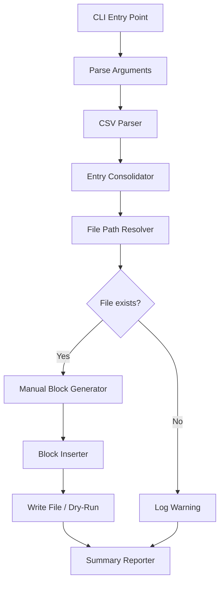

# Design Document: ECF Manual Documentation Generator

## Overview

The ECF Manual Documentation Generator is a Python CLI tool (`add_ecf_manual_docs.py`) that reads a CSV reference file containing job descriptions and troubleshooting guidance, then generates and inserts standardized `%manual` / `%end` documentation blocks into ecFlow `.ecf` script files. The tool targets approximately 81 entries across the `ecf/scripts/` tree in the global-workflow forked repository.

The tool is designed for idempotent operation: it can be safely re-run as the CSV reference evolves, replacing existing manual blocks with freshly generated content. It supports `--dry-run` for previewing changes and `--verbose` for detailed per-file logging.

### Key Design Decisions

1. **Python standard library only** — uses `csv`, `textwrap`, `pathlib`, `argparse`, and `re`. No third-party dependencies required.
2. **In-place file modification** — reads each `.ecf` file, splits at the insertion point, and writes back with the new manual block. No temp-file-rename dance needed since ecFlow scripts are small (<100 lines typically).
3. **Consolidation by Job Name** — multiple CSV rows with the same path are grouped before processing, producing a single Manual_Block with numbered sub-sections.
4. **Graceful degradation** — unresolved file paths produce warnings, not errors. The tool continues processing all remaining entries.

## Architecture



The architecture follows a pipeline pattern where each stage transforms or filters data before passing it downstream:

1. **CLI Entry Point** — parses `--base-dir`, `--csv-path`, `--dry-run`, `--verbose` flags
2. **CSV Parser** — reads all rows, handling quoted fields with embedded commas
3. **Entry Consolidator** — groups rows by Job Name into consolidated entries
4. **File Path Resolver** — maps each Job Name to an on-disk file path
5. **Manual Block Generator** — produces formatted `%manual`/`%end` text
6. **Block Inserter** — places the block at the correct location in the file
7. **Summary Reporter** — prints final statistics

## Components and Interfaces

### Component 1: CLI Module (`add_ecf_manual_docs.py`)

The single-file script containing all logic. Internal structure:

```python
def main() -> int:
    """Entry point. Returns 0 on success, non-zero on fatal error."""

def parse_args(argv: list[str] | None = None) -> argparse.Namespace:
    """Parse CLI arguments."""

def parse_csv(csv_path: Path) -> list[dict[str, str]]:
    """Parse CSV file, returning list of {job_name, description, troubleshooting}."""

def consolidate_entries(rows: list[dict[str, str]]) -> dict[str, ConsolidatedEntry]:
    """Group rows by job_name into ConsolidatedEntry instances."""

def resolve_file_path(job_name: str, base_dir: Path) -> Path | None:
    """Resolve a CSV job_name to an on-disk file path."""

def derive_task_name(ecf_filename: str) -> str:
    """Strip .ecf extension and leading 'j' to produce the task name."""

def format_manual_block(entry: ConsolidatedEntry, task_name: str) -> str:
    """Generate the complete %manual...%end block text."""

def wrap_text(text: str, width: int = 72) -> str:
    """Wrap text to specified width, preserving paragraph breaks."""

def sanitize_text(text: str) -> str:
    """Convert em-dashes to double-dashes, normalize whitespace."""

def insert_manual_block(file_content: str, manual_block: str) -> str:
    """Insert or replace the manual block in file content."""

def print_summary(stats: Stats) -> None:
    """Print execution summary to stdout."""
```

### Component 2: Data Types

```python
@dataclass
class CsvRow:
    job_name: str        # Relative path, e.g. "ecf/scripts/gfs/atmos/analysis/jgfs_atmos_analysis_calc.ecf"
    description: str     # Free-text description
    troubleshooting: str # Free-text troubleshooting guidance

@dataclass
class ConsolidatedEntry:
    job_name: str
    descriptions: list[str]       # One or more descriptions (multiple CSV rows)
    troubleshooting: list[str]    # One or more troubleshooting texts

@dataclass
class Stats:
    total_csv_entries: int = 0
    unique_files: int = 0
    files_updated: int = 0
    files_replaced: int = 0       # Had existing %manual block
    files_not_found: int = 0
    errors: int = 0
```

### Component 3: Interfaces

| Interface | Input | Output |
|-----------|-------|--------|
| `parse_csv` | `Path` to CSV file | `list[CsvRow]` |
| `consolidate_entries` | `list[CsvRow]` | `dict[str, ConsolidatedEntry]` keyed by job_name |
| `resolve_file_path` | job_name `str`, base_dir `Path` | `Path | None` |
| `derive_task_name` | ecf filename `str` | task name `str` |
| `format_manual_block` | `ConsolidatedEntry`, task_name `str` | block text `str` |
| `insert_manual_block` | file content `str`, block text `str` | modified content `str` |

## Data Models

### CSV Input Format

```
Job Name,Description,Troubleshooting
ecf/scripts/gfs/gempak/atmos/gempak/jgfs_atmos_gempak_master.ecf,Description text here,"Troubleshooting text, with commas"
```

- **Job Name**: Relative path from repository root to the `.ecf` file
- **Description**: Free text, may contain commas (quoted), em-dashes, multi-sentence content
- **Troubleshooting**: Free text, same formatting rules as Description

### Manual Block Output Format

**Single-entry format:**
```
%manual

TASK <task_name>

PURPOSE: <description wrapped at 72 chars>

TROUBLESHOOTING

<troubleshooting wrapped at 72 chars>

%end
```

**Consolidated (multi-entry) format:**
```
%manual

TASK <task_name>

PURPOSE:

1. <first description wrapped at 72 chars>

2. <second description wrapped at 72 chars>

TROUBLESHOOTING

1. <first troubleshooting wrapped at 72 chars>

2. <second troubleshooting wrapped at 72 chars>

%end
```

### File Modification Model

The insertion point is determined by this priority:

1. **Existing `%manual`...`%end` block** — replace it entirely (between markers inclusive)
2. **`%include <tail.h>` line present** — insert after it (with blank line separator)
3. **Neither found** — append at end of file

### Task Name Derivation

```
Input:  "jgfs_atmos_analysis_calc.ecf"
Step 1: Strip extension → "jgfs_atmos_analysis_calc"
Step 2: Strip leading 'j' → "gfs_atmos_analysis_calc"
Output: "gfs_atmos_analysis_calc"
```

### Path Resolution Strategy

```
Input job_name: "ecf/scripts/gfs/atmos/analysis/jgfs_atmos_analysis_calc.ecf"
base_dir: "/path/to/global-workflow_forked/"

Step 1: Try literal path → base_dir / job_name
Step 2: If not found, extract basename → "jgfs_atmos_analysis_calc.ecf"
Step 3: Walk ecf/scripts/ tree searching for that basename
Step 4: Return first match, or None if not found
```

## Correctness Properties

*A property is a characteristic or behavior that should hold true across all valid executions of a system — essentially, a formal statement about what the system should do. Properties serve as the bridge between human-readable specifications and machine-verifiable correctness guarantees.*

### Property 1: CSV parsing round-trip for quoted fields

*For any* string containing commas, when that string is formatted as a properly quoted CSV field (within a valid CSV row) and parsed by the CSV parser, the extracted field value SHALL equal the original string.

**Validates: Requirements 1.2**

### Property 2: Consolidation groups all entries

*For any* list of CSV rows where K rows share the same job_name, consolidating those rows SHALL produce exactly one ConsolidatedEntry for that job_name containing exactly K descriptions and K troubleshooting texts, preserving their order.

**Validates: Requirements 1.3**

### Property 3: Task name derivation

*For any* alphanumeric-plus-underscore string X, `derive_task_name("j" + X + ".ecf")` SHALL equal X.

**Validates: Requirements 3.2**

### Property 4: Manual block structural invariants

*For any* valid ConsolidatedEntry and task_name, the generated Manual_Block SHALL start with `%manual\n`, end with `%end\n`, contain exactly one `TASK <task_name>` line, contain a `PURPOSE:` section, and contain a `TROUBLESHOOTING` heading, in that order.

**Validates: Requirements 3.1**

### Property 5: All consolidated descriptions and troubleshooting texts appear in output

*For any* ConsolidatedEntry containing N descriptions (N >= 2) and M troubleshooting texts (M >= 2), the generated Manual_Block SHALL contain all N descriptions numbered (1. through N.) in the PURPOSE section and all M troubleshooting texts numbered (1. through M.) in the TROUBLESHOOTING section.

**Validates: Requirements 3.3, 3.4**

### Property 6: Insertion after tail.h preserves prefix content

*For any* .ecf file content containing a `%include <tail.h>` line, after inserting a Manual_Block, all content up to and including the `%include <tail.h>` line SHALL remain byte-for-byte identical to the original.

**Validates: Requirements 4.1, 4.4**

### Property 7: Existing manual block replacement produces single block

*For any* file content containing an existing `%manual`...`%end` block, after inserting a new Manual_Block, the result SHALL contain exactly one `%manual`...`%end` block, and that block SHALL match the newly generated content.

**Validates: Requirements 4.2**

### Property 8: Idempotent insertion

*For any* valid file content and Manual_Block, applying `insert_manual_block` once and then applying it again with the same block SHALL produce output identical to the first application. That is: `insert(insert(content, block), block) == insert(content, block)`.

**Validates: Requirements 5.1, 5.2**

### Property 9: Text wrapping respects 72-character limit

*For any* input text string, after wrapping with `wrap_text(text, width=72)`, every line in the output SHALL have length ≤ 72 characters, except lines containing a single word whose length exceeds 72 characters (which cannot be broken).

**Validates: Requirements 8.1**

### Property 10: Em-dash sanitization

*For any* input text containing one or more em-dash characters (U+2014 '—'), after applying `sanitize_text`, the output SHALL contain zero em-dash characters and each original em-dash SHALL be replaced by '--'.

**Validates: Requirements 8.3**

### Property 11: Paragraph preservation through wrapping

*For any* input text containing paragraph breaks (sequences of two or more consecutive newlines), after wrapping, the number of paragraph breaks in the output SHALL be at least equal to the number of paragraph breaks in the input.

**Validates: Requirements 8.2**

### Property 12: Trailing newline invariant

*For any* generated Manual_Block, the block SHALL end with exactly the sequence `%end\n` (one trailing newline after `%end`, with no additional trailing whitespace or newlines).

**Validates: Requirements 8.4**

### Property 13: Dry-run does not modify files

*For any* set of input files and CSV entries, when the Documentation_Generator is invoked with `--dry-run`, all files on disk SHALL remain byte-for-byte identical to their state before invocation.

**Validates: Requirements 7.2**

### Property 14: Summary statistics consistency

*For any* run of the Documentation_Generator, the sum of `files_updated + files_not_found + errors` SHALL equal the total number of unique job_names attempted.

**Validates: Requirements 6.3**

## Error Handling

### Error Categories

| Error | Severity | Behavior |
|-------|----------|----------|
| CSV file not found | FATAL | Exit with non-zero code, print to stderr |
| CSV parse error (malformed row) | WARNING | Skip row, log warning, continue |
| File path unresolved | WARNING | Log `[WARN] <job_name>: file not found`, continue |
| File read/write I/O error | ERROR | Log `[ERROR] <path>: <detail>`, increment error count, continue |
| No `%include <tail.h>` in file | INFO (verbose) | Append to end of file, log if verbose |
| Empty description/troubleshooting | WARNING | Generate block with placeholder text, log warning |

### Error Output Format

All console output uses ASCII-only markers for MCP compatibility:
- `[OK]` — file successfully updated
- `[WARN]` — non-fatal issue (file not found, empty field)
- `[ERROR]` — operation failed for a specific file
- `[DRY-RUN]` — action that would be taken (dry-run mode)

### Exit Codes

| Code | Meaning |
|------|---------|
| 0 | Success (all resolvable files processed) |
| 1 | Fatal error (CSV not found, invalid arguments) |
| 2 | Partial failure (some files had errors, but others succeeded) |

## Testing Strategy

### Property-Based Testing (Hypothesis)

The project uses **Hypothesis** (Python property-based testing library) for the correctness properties defined above. Each property test runs a minimum of 100 iterations with generated inputs.

**Library**: `hypothesis` with `@given` decorator and built-in strategies (`st.text()`, `st.lists()`, `st.from_regex()`, etc.)

**Test structure**:
```python
from hypothesis import given, settings
import hypothesis.strategies as st

@given(text=st.text(min_size=1, alphabet=st.characters(whitelist_categories=('L', 'N', 'P', 'Z'))))
@settings(max_examples=200)
def test_wrap_text_line_length(text):
    """Feature: ecf-manual-documentation, Property 9: Text wrapping respects 72-character limit"""
    result = wrap_text(text, width=72)
    for line in result.split('\n'):
        if ' ' in line or len(line) <= 72:
            assert len(line) <= 72
```

**Tag format**: Each property test includes a docstring comment: `Feature: ecf-manual-documentation, Property {N}: {title}`

**Configuration**: Minimum 100 examples per test (200 for critical properties like idempotency).

### Unit Tests (pytest)

Example-based tests for specific scenarios:

1. **CSV not found** — verify exit code and stderr message
2. **SKIPPED entries** — verify block contains "SKIPPED" text
3. **Verbose output** — verify per-file log lines are emitted
4. **Known file format** — test against the `example_doc.ecf` reference
5. **Real CSV subset** — test with 3-4 rows from the actual `ecf_script_discriptions.txt`

### Integration Tests

1. **End-to-end with temp directory** — create a temp tree with sample `.ecf` files and a small CSV, run the tool, verify all files are correctly modified
2. **Dry-run verification** — run with `--dry-run`, verify no files changed
3. **Idempotency integration** — run twice, diff the output (should be empty)

### Test File Location

Tests live at: `supported_repos/global-workflow_forked/tools/tests/test_add_ecf_manual_docs.py`

