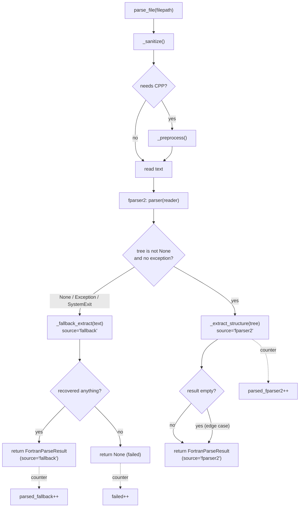

# Design Document — `fortran-parse-fallback`

## Overview

The Fortran AST ingester parses source with fparser2 and silently drops the
~15% of files fparser2 cannot handle (1,020 of 6,935 on `gw_v17`). This feature
adds a regex-based `Fallback_Extractor` inside `_fortran_parser.py` that runs
**only** when the fparser2 path returns `None`, recovering definition nodes
(MODULE/SUBROUTINE/FUNCTION/PROGRAM) and relationship edges (CALLS/USES) from the
already-sanitized, already-preprocessed source text.

**Design principle — additive and non-regressing.** The fallback never runs when
fparser2 succeeds, so accurate AST results keep full fidelity. The fallback
returns the exact same `FortranParseResult` dataclass, so the two-pass Neptune
write strategy in `ingest_fortran_graph_v8.py` needs zero changes. The fallback
is wrapped so it can never raise — a fallback bug degrades to "recovered nothing"
(the current behavior), never an aborted run.

**Blast radius.** One production file changes: `_fortran_parser.py` (the fallback
extractor, the `parse_file` wiring, a provenance field, and provenance counters).
`ingest_fortran_graph_v8.py` changes only its summary/report rendering to print
the fparser2/fallback/failed breakdown. No Neptune query, no tenant, no embedding
code is touched.

**Accepted imprecision.** The fallback is line-oriented regex, not a parser. It
does not resolve function return types, may miss line numbers for some callees,
and resolves containment by tracking the most-recently-opened MODULE block rather
than by AST nesting. This is acceptable: the edges (CALLS/USES) and definition
nodes are what the graph needs, and MERGE de-duplicates against any nodes a later
accurate parse might add.

## Architecture

### Parse flow (where the fallback slots in)



The fparser2 branch is unchanged from today except for setting `source` and
incrementing `parsed_fparser2`. The new branch is the `None`/exception path, which
currently just returns `None`.

### Why text, not the temp file

`parse_file` already produces `actual_path` — the sanitized and (if needed)
CPP-preprocessed temp file that fparser2 was given. The fallback reads that same
text so it benefits from merge-marker removal and dangling-continuation repair.
The fallback runs before the `finally` block deletes the temp files.

## Components and Interfaces

### 1. `FortranParseResult` — add provenance (R5.3, R4.1)

Add one optional field, defaulted so existing constructors and consumers are
unaffected:

```python
@dataclass
class FortranParseResult:
    file_path: str
    relative_path: str
    modules: list[dict] = field(default_factory=list)
    subroutines: list[dict] = field(default_factory=list)
    functions: list[dict] = field(default_factory=list)
    programs: list[dict] = field(default_factory=list)
    calls: list[dict] = field(default_factory=list)
    uses: list[dict] = field(default_factory=list)
    source: str = "fparser2"   # NEW: "fparser2" | "fallback"
```

`_result_node_counts` / `_result_rel_counts` already read only the list fields,
so they work unchanged (R4.5).

### 2. `FortranParser.stats` — add provenance counters (R5.1)

```python
self.stats = {
    "files_preprocessed": 0,
    "files_sanitized": 0,
    "files_parsed_fparser2": 0,   # NEW
    "files_parsed_fallback": 0,   # NEW
    "files_failed": 0,            # NEW
}
```

These are incremented inside `parse_file` (the single choke point), so both the
ingester's live mode and `--dry-run` see the same numbers (R5.4).

### 3. `parse_file` — wire the fallback (R1.1–R1.5)

```python
def parse_file(self, filepath):
    filepath = str(filepath)
    temp_paths = []
    try:
        actual_path = filepath
        sanitized = self._sanitize(filepath)
        if sanitized:
            actual_path = sanitized; temp_paths.append(sanitized)
            self.stats["files_sanitized"] += 1
        if self._needs_preprocessing(actual_path):
            pp = self._preprocess(actual_path)
            if pp:
                actual_path = pp; temp_paths.append(pp)
                self.stats["files_preprocessed"] += 1

        # --- primary: fparser2 ---
        tree = None
        try:
            reader = FortranFileReader(actual_path, ignore_comments=True)
            tree = self._parser(reader)
        except (Exception, SystemExit):
            tree = None

        if tree is not None:
            result = self._extract_structure(tree, filepath)
            result.source = "fparser2"
            self.stats["files_parsed_fparser2"] += 1
            return result

        # --- fallback: regex over the sanitized/preprocessed text ---
        result = self._fallback_extract(actual_path, filepath)
        if result is not None:
            self.stats["files_parsed_fallback"] += 1
            return result

        self.stats["files_failed"] += 1
        return None
    except (Exception, SystemExit):
        # Defensive outer guard preserves current never-raise contract.
        self.stats["files_failed"] += 1
        return None
    finally:
        for p in temp_paths:
            try: os.unlink(p)
            except OSError: pass
```

Note the inner `try` around fparser2 so a fparser2 `SystemExit` falls through to
the fallback rather than the outer guard (which would skip the fallback).

### 4. `_fallback_extract(actual_path, original_path)` — the new method (R2, R3, R4, R6)

Returns a `FortranParseResult(source="fallback")` or `None` when nothing is
recovered. Pure-text, never raises (its body is wrapped; on internal error it
returns `None` → counted as failed, R1.5).

Algorithm (single pass over logically-joined lines):

```
1. Read actual_path text (errors="replace"). On read error → return None.
2. Build "logical lines": strip full-line comments; join free-form trailing-'&'
   continuations into one logical line; record the physical line number of each
   logical line's first physical line.
3. For each logical line, strip an inline '!' comment (outside string literals).
4. Match, in priority order, against compiled regexes:
     END_RE        -> skip (R2.7)
     MODULE_RE     -> open module context; append module {name, line_start}
     END_MODULE    -> close module context
     PROGRAM_RE    -> append program {name, executable_name}
     SUBROUTINE_RE -> append subroutine {name, line_start, parent_module=cur_mod}
     FUNCTION_RE   -> append function {name, line_start, parent_module, return_type=None}
     CALL_RE       -> append call {callee, line, caller=None} (dedup on (callee,line))
     USE_RE        -> append use {module, only}
5. If all six lists empty -> return None. Else return FortranParseResult.
```

Module-context tracking gives best-effort containment (R4.2): a stack-free
"current module name, cleared on END MODULE" is sufficient because Fortran does
not nest modules.

### 5. Regex set (R2, R3, R6)

All compiled once at class scope, `re.IGNORECASE`, anchored to the start of the
stripped logical line so mid-line identifiers never match (R3.4, R6.2):

| Name | Pattern (conceptual) | Notes |
|------|----------------------|-------|
| `END_RE` | `^\s*end\s*(subroutine|function|module|program)\b` | skip closings (R2.7) |
| `MODULE_RE` | `^\s*module\s+(?!procedure\b)([a-z]\w*)` | excludes `MODULE PROCEDURE` (R2.1) |
| `SUBROUTINE_RE` | `^\s*(?:(?:pure|elemental|recursive|module)\s+)*subroutine\s+([a-z]\w*)` | prefix-aware (R2.2) |
| `FUNCTION_RE` | `^\s*(?:[a-z][\w()*: ]*?\s+)?function\s+([a-z]\w*)` | type/attr prefix tolerated (R2.3) |
| `PROGRAM_RE` | `^\s*program\s+([a-z]\w*)` | (R2.4) |
| `CALL_RE` | `^\s*call\s+([a-z]\w*)` | name only; args stripped by capture (R3.1, R3.4) |
| `USE_RE` | `^\s*use\s+([a-z]\w*)\s*(?:,\s*only\s*:\s*(.*))?` | captures ONLY clause (R3.2) |

`IF`/`DO`/`WHERE`/`FORALL`/`SELECT`/array refs never match `CALL_RE` because the
line must start with the `call` keyword followed by whitespace (R6.2). Comment-only
and inline-commented `CALL`s are removed in step 3 (R6.3).

### 6. Ingester summary/report (R5.2, R5.4)

`ingest_fortran_graph_v8.py` already prints a summary and writes a report. Add the
three counters to both the live summary block and `_dry_run`'s summary, pulling
from `fortran_parser.stats`. The `IngestionReportWriter` gains three increments
(or a single structured `parse_provenance` dict) at finalization.

## Data Models

No graph schema change. Fallback-produced results flow through the identical
write helpers (`_write_module_nodes`, `_write_subroutine_nodes`,
`_write_function_nodes`, `_write_program_nodes`, `_write_calls`, `_write_uses`,
`_write_contains`). Because `return_type` and some `line` values are `None`, the
existing `SET` clauses already tolerate null parameters (they write null), so no
writer change is required.

The CALLS placeholder MERGE behavior (creating a callee node by name) is unchanged
and applies equally to fallback-discovered calls.

## Error Handling

| Condition | Behavior | Requirement |
|-----------|----------|-------------|
| fparser2 raises / SystemExit / returns None | inner try → fall through to fallback | R1.2 |
| Fallback read error | return None (counted failed) | R1.3, R2 |
| Fallback internal exception | caught by its own guard → return None | R1.5 |
| Both paths recover nothing | return None, `files_failed++` | R1.3 |
| Re-ingest of same file | Neptune MERGE idempotent | R6.4 |

The outer `parse_file` guard is retained so the never-raise contract holds even
if both branches misbehave.

## Correctness Properties

These are the executable properties the implementation must uphold. Each maps to
a property-based test (Hypothesis) over generated Fortran-like source.

### Property 1: Fallback never runs on success

For any source fparser2 parses to a non-None tree, the returned result has
`source == "fparser2"` and the fallback extractor is not invoked.

**Validates: Requirements 1.1**

### Property 2: Fallback never raises

For any input bytes (including invalid UTF-8, truncated statements, random
noise), `parse_file` returns either a `FortranParseResult` or `None` — it never
propagates an exception.

**Validates: Requirements 1.5**

### Property 3: Definition recovery completeness

For a generated free-form file containing N well-formed
`SUBROUTINE`/`FUNCTION`/`MODULE`/`PROGRAM` definitions interleaved with arbitrary
non-definition noise lines, the fallback recovers exactly those N definitions (by
name), with no closings counted.

**Validates: Requirements 2.1, 2.2, 2.3, 2.4, 2.7**

### Property 4: Edge recovery completeness

For generated `CALL name(args)` and `USE mod, ONLY: ...` lines (including
`&`-continuation splits), every callee and module name is recovered exactly once
per (name, line).

**Validates: Requirements 3.1, 3.2, 3.3, 6.1**

### Property 5: No invented edges

For lines that are control constructs (`IF (`, `DO `, `WHERE`, `SELECT`),
array/function references, or commented-out `CALL`/`USE`, the fallback emits zero
call and zero use entries.

**Validates: Requirements 6.2, 6.3**

### Property 6: Result-shape invariance

Any fallback-produced result is a structurally valid `FortranParseResult` on
which `_result_node_counts` and `_result_rel_counts` return non-negative integer
totals without error.

**Validates: Requirements 4.1, 4.5**

### Property 7: Containment soundness

Every subroutine/function whose `parent_module` is non-None was defined textually
between a `MODULE m` and its matching `END MODULE`; definitions outside any module
block have `parent_module is None`.

**Validates: Requirements 4.2**

### Property 8: Provenance accounting

Across a batch, `files_parsed_fparser2 + files_parsed_fallback + files_failed`
equals the number of `parse_file` calls, and each file increments exactly one of
the three counters.

**Validates: Requirements 5.1**

## Testing Strategy

Unit tests in `tests/unit/test_fortran_fallback.py` (new), using inline source
fixtures written to `tmp_path`:

1. **Triggering** — a file fparser2 parses cleanly never gets `source="fallback"`;
   a deliberately malformed file that fparser2 rejects but is regex-recoverable
   returns `source="fallback"` with the expected lists (R1.1, R1.2).
2. **Definitions** — free-form fixture with `PURE SUBROUTINE`, `REAL FUNCTION`,
   `MODULE`, `PROGRAM`, plus `END *` lines; assert names captured and closings
   skipped (R2.2, R2.3, R2.4, R2.7).
3. **Relationships** — `CALL foo(a,b)` → callee `foo`; `USE m, ONLY: x, y` →
   module `m`, only `x, y`; continuation-split `CALL`/`USE` joined (R3.1–R3.3).
4. **Negative / false-positive guard** — `IF (x>0)`, `DO i=1,n`,
   `y = arr(call_count)`, a commented `! call bar`, and an inline
   `a = 1  ! call baz` produce zero call entries (R6.2, R6.3).
5. **Containment** — subroutine inside `MODULE m ... END MODULE m` gets
   `parent_module="m"`; one outside gets `None` (R4.2).
6. **Provenance counters** — after parsing a mixed batch, `stats` shows the
   correct `files_parsed_fparser2` / `files_parsed_fallback` / `files_failed`
   split (R5.1).
7. **Never-raises** — monkeypatch the fallback internals to raise; `parse_file`
   still returns `None` and increments `files_failed` (R1.5).
8. **Result shape** — `_result_node_counts` / `_result_rel_counts` run unchanged
   on a fallback result (R4.5).

Property-based test (Hypothesis) in `tests/properties/`: generate random valid
`SUBROUTINE name` / `CALL name` / `USE name` lines interleaved with noise; assert
every generated definition/edge is recovered and no edge is invented for noise
lines (R2, R3, R6.2).

A dry-run smoke check (manual, documented in tasks) runs the ingester with
`--dry-run` against `gw_v17` and confirms the fallback recovers a meaningful
fraction of the 1,020 previously-failed files and the summary prints the
provenance split.

## Design Decisions and Rationale

- **Regex over a second parser.** Adding another real Fortran parser (e.g. a
  tree-sitter grammar) is heavier and brings new dependencies and its own failure
  modes. The graph only needs definitions + CALLS/USES edges, which line-oriented
  regex recovers adequately. Chosen for minimal dependency footprint and bounded
  risk.
- **Run on the preprocessed text, not the raw file.** Reusing `actual_path` means
  CPP `#ifdef` blocks are already resolved and merge markers already removed, so
  the regex sees cleaner input and recovers more.
- **Provenance field defaulted to `"fparser2"`.** Keeps every existing
  `FortranParseResult(...)` construction and test valid without edits.
- **Never-raise via nested guards.** The fallback is best-effort recovery; it must
  not convert a single bad file into an aborted multi-hour ingestion.
- **No writer changes.** By matching the result shape exactly, the risky part of
  the pipeline (Neptune writes) is untouched, so this feature cannot regress the
  graph for files that already parse.
