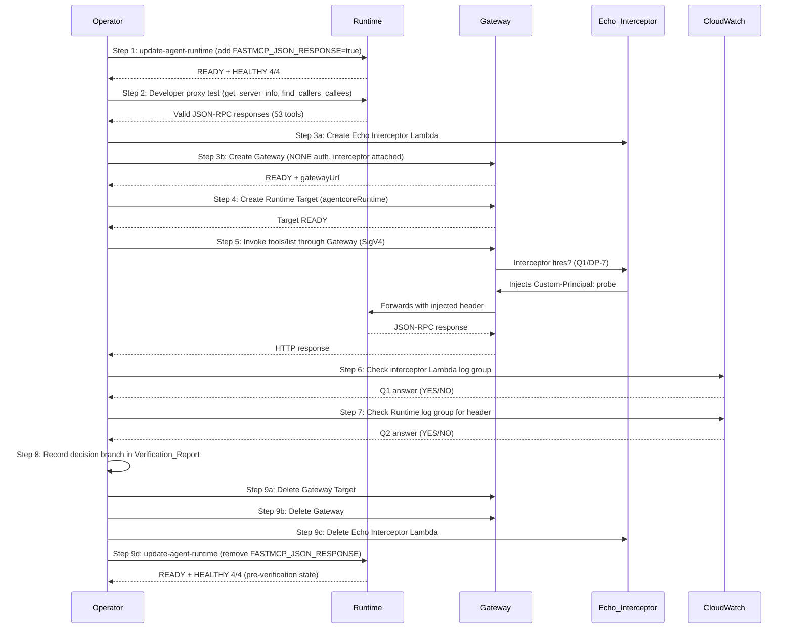

# Design: Gateway Interceptor Verification (Path C Task 0)

**Spec ID:** `gateway-interceptor-verification`
**Parent spec:** `.kiro/specs/mcp-external-access-alternative-gateway/` (Path C)
**Normative context:** `../mcp-external-access-revised/decision-log.md`,
`../mcp-external-access-alternative-gateway/design.md` (AD-C1, AD-C4, AD-C7, §9 Gate Register)

---

## Overview

This design is a **concrete, single-session execution plan** for verifying the two unverified
AWS platform behaviors that gate all of Path C:

- **DP-7 (AWS half):** Do REQUEST interceptor Lambdas fire for an `agentcoreRuntime` target
  on a Gateway when the MCP server responds with `Content-Type: application/json`?
- **DP-1 (confirmation):** Do headers injected by the interceptor
  (`X-Amzn-Bedrock-AgentCore-Runtime-Custom-*`) arrive at the MCP container?

```
┌─────────────────────────────────────────────────────────────────┐
│  VERIFICATION FLOW                                              │
│                                                                 │
│  Step 1: Enable json_response on the live Runtime               │
│                                                                 │
│  Step 2: Verify developer proxy still works (framing tolerance) │
│                                                                 │
│  Step 3: Create temporary Gateway + Echo Interceptor Lambda     │
│                                                                 │
│  Step 4: Create Runtime Target on the Gateway                   │
│                                                                 │
│  Step 5: Invoke through the Gateway                             │
│  ┌─────────┐    SigV4     ┌──────────┐    SigV4    ┌─────────┐  │
│  │  curl   │ ───────────> │ Gateway  │ ──────────> │ Runtime │  │
│  │ (local) │              │ + Echo   │             │ (MCP)   │  │
│  └─────────┘              │ Intercpt │             └─────────┘  │
│                           └──────────┘                          │
│ Step 6: Check CloudWatch for interceptor execution (Q1/DP-7)    │
│ Step 7: Check Runtime logs for injected header arrival (Q2/DP-1)│
│ Step 8: Record decision branch                                  │
│ Step 9: Rollback (delete Gateway, restore Runtime env vars)     │
└─────────────────────────────────────────────────────────────────┘
```

### 1.1 Architecture: Before / During / After

```
BEFORE (current state):
  Developer (Kiro) ──SigV4──> Runtime (SSE framing, no Gateway)

DURING VERIFICATION:
  Developer (Kiro) ──SigV4──> Runtime (JSON framing)  ← direct, unchanged transport
  Probe (curl)     ──SigV4──> Gateway ──SigV4──> Runtime (JSON framing)
                                 │
                          Echo_Interceptor (Lambda)
                          injects: X-...-Custom-Principal: probe

AFTER ROLLBACK:
  Developer (Kiro) ──SigV4──> Runtime (SSE framing, no Gateway)  ← identical to BEFORE
```

### 1.2 Environment Constants

| Constant | Value |
|---|---|
| Account | `903050880929` |
| Region | `us-east-1` |
| Runtime ID | `mdc_mcp_rag_server_python-v5K2F8BGrN` |
| Runtime ARN | `arn:aws:bedrock-agentcore:us-east-1:903050880929:runtime/mdc_mcp_rag_server_python-v5K2F8BGrN` |
| Runtime Role | `mdc-mcp-rag-ecs-task-role` |
| Container Image | `903050880929.dkr.ecr.us-east-1.amazonaws.com/mdc-mcp-rag:python-tenants-v16` |
| Subnets | `subnet-0e13af6b3a9a6416f`, `subnet-04447750c61bd7e06` |
| Security Group | `sg-096489a0876cc78c1` |
| EFS Access Point | `fsap-03e641f056b341f29` at `/mnt/workflow` |
| Current Env Vars | `DB_BACKEND=aws`, `NEPTUNE_ENDPOINT=https://mdc-mcp-graprag-neptune-1.cluster-ccdaimu4c86s.us-east-1.neptune.amazonaws.com:8182`, `OPENSEARCH_ENDPOINT=https://vpc-mdc-mcp-rag-search-5o72hixfx3rryikwb7l5px5sgq.us-east-1.es.amazonaws.com`, `AWS_REGION=us-east-1`, `MCP_STATELESS_HTTP=true`, `MCP_WORKFLOW_ROOT=/mnt/workflow` |

---

## Architecture

### 2.1 Execution Sequence

The verification executes nine steps in strict order. Each step has a precondition, an
action, and a success criterion. Failure at any step triggers the rollback procedure (§8).



### 2.2 IAM Strategy Under PowerUserRestrictions

`PowerUserRestrictions` blocks `iam:CreateRole`. The verification requires two roles:

| Role | Purpose | Strategy |
|---|---|---|
| Gateway Execution Role | Gateway assumes this to SigV4-sign requests to the Runtime | **Reuse `mdc-mcp-rag-ecs-task-role`** — it already has `bedrock-agentcore:InvokeAgentRuntime` permission since it is the Runtime's own task role. The Gateway needs exactly this permission to forward requests to the Runtime target. |
| Echo Interceptor Lambda Role | Lambda execution role for CloudWatch Logs write | **Check for an existing basic Lambda execution role** in the account (e.g., `AWSLambdaBasicExecutionRole`-prefixed). If none exists, **add it to `docs/mdc-external-access-alt-iam-request.txt`** for admin pre-creation. The role needs only `logs:CreateLogGroup`, `logs:CreateLogStream`, `logs:PutLogEvents`. |

**Step 0 (pre-flight):** Before any verification step, enumerate existing Lambda execution
roles to find one usable:

```bash
# List roles with "lambda" or "Lambda" in the name
aws iam list-roles --region us-east-1 \
  --query "Roles[?contains(RoleName, 'ambda')].{Name:RoleName,Arn:Arn}" \
  --output table
```

If no suitable role exists, the admin request is:

```
Role Name: mdc-gateway-verification-lambda-role
Trust Policy: lambda.amazonaws.com
Managed Policies: arn:aws:iam::aws:policy/service-role/AWSLambdaBasicExecutionRole
Purpose: Temporary — Echo Interceptor Lambda for gateway verification probe.
          Will be deleted after verification.
```

**For the Gateway execution role**, `mdc-mcp-rag-ecs-task-role` is the preferred choice. It
already trusts `bedrock-agentcore.amazonaws.com` (since it is the Runtime's role), and it
already has `bedrock-agentcore:InvokeAgentRuntime`. The Gateway's assume-role call requires
that the trust policy include `bedrock-agentcore.amazonaws.com` — which it does.

**If `mdc-mcp-rag-ecs-task-role` cannot be assumed by the Gateway** (its trust policy may be
scoped to the specific Runtime via `aws:SourceArn`), then a second admin request is needed:

```
Role Name: mdc-gateway-verification-exec-role
Trust Policy: bedrock-agentcore.amazonaws.com
Inline Policy: Allow bedrock-agentcore:InvokeAgentRuntime on the Runtime ARN
Purpose: Temporary — Gateway execution role for verification probe.
```

---

## Components and Interfaces

### 3.1 Step 1 — Runtime Framing Switch (update-agent-runtime)

Add `FASTMCP_JSON_RESPONSE=true` to the Runtime's environment variables. This causes
FastMCP to serve `Content-Type: application/json` instead of `text/event-stream`.

**Exact CLI command:**

```bash
aws bedrock-agentcore-control update-agent-runtime \
  --region us-east-1 \
  --agent-runtime-id mdc_mcp_rag_server_python-v5K2F8BGrN \
  --agent-runtime-artifact '{
    "containerConfiguration": {
      "containerUri": "903050880929.dkr.ecr.us-east-1.amazonaws.com/mdc-mcp-rag:python-tenants-v16"
    }
  }' \
  --role-arn arn:aws:iam::903050880929:role/mdc-mcp-rag-ecs-task-role \
  --network-configuration '{
    "networkMode": "VPC",
    "networkModeConfig": {
      "subnets": ["subnet-0e13af6b3a9a6416f", "subnet-04447750c61bd7e06"],
      "securityGroups": ["sg-096489a0876cc78c1"]
    }
  }' \
  --protocol-configuration '{"serverProtocol": "MCP"}' \
  --lifecycle-configuration '{"idleRuntimeSessionTimeout": 900, "maxLifetime": 28800}' \
  --metadata-configuration '{"requireMMDSV2": true}' \
  --environment-variables '{
    "DB_BACKEND": "aws",
    "NEPTUNE_ENDPOINT": "https://mdc-mcp-graprag-neptune-1.cluster-ccdaimu4c86s.us-east-1.neptune.amazonaws.com:8182",
    "OPENSEARCH_ENDPOINT": "https://vpc-mdc-mcp-rag-search-5o72hixfx3rryikwb7l5px5sgq.us-east-1.es.amazonaws.com",
    "AWS_REGION": "us-east-1",
    "MCP_STATELESS_HTTP": "true",
    "MCP_WORKFLOW_ROOT": "/mnt/workflow",
    "FASTMCP_JSON_RESPONSE": "true"
  }' \
  --filesystem-configurations '[{
    "efsAccessPoint": {
      "accessPointArn": "arn:aws:elasticfilesystem:us-east-1:903050880929:access-point/fsap-03e641f056b341f29",
      "mountPath": "/mnt/workflow"
    }
  }]'
```

**CRITICAL NOTES:**
- This is a **full-replacement API**. Every field must be present or it gets wiped.
- The only change from the current configuration is the addition of
  `"FASTMCP_JSON_RESPONSE": "true"` in `--environment-variables`.
- `MCP_STATELESS_HTTP` remains `true` — it is orthogonal and mandatory.

**Success criterion:** Wait for `status: READY`. Then verify:

```bash
# Poll until READY (typically 60-120 seconds)
aws bedrock-agentcore-control get-agent-runtime \
  --region us-east-1 \
  --agent-runtime-id mdc_mcp_rag_server_python-v5K2F8BGrN \
  --query '{Status: status, EnvVars: environmentVariables}'
```

Expected: `Status: READY`, `EnvVars` includes `FASTMCP_JSON_RESPONSE: "true"`.

### 3.2 Step 2 — Developer Proxy Verification

Confirm the developer SigV4 path works with JSON framing. The proxy at
`tools/agentcore-kiro-proxy.py` v1.2.0 is already framing-tolerant (AD-C7).

**Test via the MCP tools (Kiro session):**

```
1. Call get_server_info() — expect 53 tools, 10 active modules
2. Call mcp_health_check() — expect HEALTHY 4/4
3. Call find_callers_callees(function_name="setuprad") — expect non-empty graph result
```

**Success criterion:** All three calls return valid JSON-RPC responses. No `-32603 "Empty
SSE response"` errors. If any call fails, the proxy's framing tolerance has regressed —
halt and investigate before proceeding.

**Record in Verification_Report:**
- Actual fastmcp version reported by `get_server_info` (expected: `fastmcp 3.4.1`)
- Actual mcp library version (expected: `mcp 1.27.2`)
- Tool count (expected: 53)

### 3.3 Step 3 — Create Echo Interceptor Lambda and Gateway

#### 3.3.1 Echo Interceptor Lambda Source Code

Commit to `infrastructure/cdk/lambda/gateway_echo_interceptor/index.py`:

```python
"""Echo Interceptor — Gateway verification probe.

Minimal REQUEST interceptor for Path C Task 0 verification.
Logs event structure (header NAMES only, never values) and injects
a single fixed header:
  X-Amzn-Bedrock-AgentCore-Runtime-Custom-Principal: probe

SECURITY: Never log Authorization header values, request bodies,
or any token content. Only header names are logged.
"""

import json
import base64
import logging

log = logging.getLogger(__name__)
log.setLevel(logging.INFO)

INJECTED_HEADER_NAME = "X-Amzn-Bedrock-AgentCore-Runtime-Custom-Principal"
INJECTED_HEADER_VALUE = "probe"


def handler(event, context):
    """REQUEST interceptor entry point.

    The event shape for an HTTP/Runtime target is:
    {
      "http": {
        "gatewayRequest": {
          "path": "/{targetName}/invocations",
          "method": "POST",
          "headers": { ... },
          "body": "<base64-encoded-json-rpc>"
        }
      }
    }
    """
    try:
        # --- Log event structure (names only, never values) ---
        event_keys = list(event.keys())
        log.info("EVENT_KEYS: %s", json.dumps(event_keys))

        http_block = event.get("http", {})
        gateway_request = http_block.get("gatewayRequest", {})

        # Log header NAMES only (R4.4 / R8.3 — never log values)
        header_names = list((gateway_request.get("headers") or {}).keys())
        log.info("REQUEST_PATH: %s", gateway_request.get("path", "<missing>"))
        log.info("REQUEST_METHOD: %s", gateway_request.get("method", "<missing>"))
        log.info("HEADER_NAMES: %s", json.dumps(sorted(header_names)))
        log.info("BODY_PRESENT: %s", "body" in gateway_request)
        log.info("BODY_LENGTH: %d", len(gateway_request.get("body", "")))

        # --- Build transformed request ---
        # Start with existing headers, strip any client-supplied Custom-* headers
        original_headers = dict(gateway_request.get("headers") or {})
        cleaned_headers = {
            k: v for k, v in original_headers.items()
            if not k.lower().startswith(
                "x-amzn-bedrock-agentcore-runtime-custom-"
            )
        }

        # Inject the probe header (R4.3 — overwrites any client-supplied value)
        cleaned_headers[INJECTED_HEADER_NAME] = INJECTED_HEADER_VALUE

        log.info("INJECTED_HEADER: %s (value length: %d)",
                 INJECTED_HEADER_NAME, len(INJECTED_HEADER_VALUE))

        # Pass body through unchanged (still base64 for HTTP/Runtime targets)
        return {
            "interceptorOutputVersion": "1.0",
            "http": {
                "transformedGatewayRequest": {
                    "headers": cleaned_headers,
                    "body": gateway_request.get("body", ""),
                }
            },
        }

    except Exception as exc:
        # R4.7 — log error with event keys (never full body), return HTTP 500
        log.error("INTERCEPTOR_ERROR: %s | event_keys: %s",
                  str(exc), list(event.keys()))
        error_body = base64.b64encode(
            json.dumps({"error": "interceptor_error", "detail": str(exc)}).encode()
        ).decode()
        return {
            "interceptorOutputVersion": "1.0",
            "http": {
                "transformedGatewayResponse": {
                    "statusCode": 500,
                    "contentType": "application/json",
                    "body": error_body,
                }
            },
        }
```

#### 3.3.2 Deploy the Lambda

```bash
# Zip the Lambda code
cd infrastructure/cdk/lambda/gateway_echo_interceptor
zip -j /tmp/echo_interceptor.zip index.py

# Determine Lambda execution role ARN.
# Option A: reuse an existing basic execution role
LAMBDA_ROLE_ARN=$(aws iam list-roles --region us-east-1 \
  --query "Roles[?contains(RoleName, 'LambdaBasicExecution') || contains(RoleName, 'lambda-basic')].Arn | [0]" \
  --output text)

# Option B: if no existing role found, use the admin-pre-created role
# LAMBDA_ROLE_ARN="arn:aws:iam::903050880929:role/mdc-gateway-verification-lambda-role"

echo "Using Lambda role: ${LAMBDA_ROLE_ARN}"

# Create the Lambda function
aws lambda create-function \
  --region us-east-1 \
  --function-name mdc-gateway-echo-interceptor \
  --runtime python3.12 \
  --handler index.handler \
  --role "${LAMBDA_ROLE_ARN}" \
  --zip-file fileb:///tmp/echo_interceptor.zip \
  --timeout 10 \
  --memory-size 128 \
  --description "Temporary: Path C Task 0 gateway interceptor verification probe"

# Capture the Lambda ARN
INTERCEPTOR_ARN=$(aws lambda get-function \
  --region us-east-1 \
  --function-name mdc-gateway-echo-interceptor \
  --query 'Configuration.FunctionArn' \
  --output text)
echo "Interceptor ARN: ${INTERCEPTOR_ARN}"
```

**IMPORTANT:** The Lambda needs a resource-based policy allowing AgentCore to invoke it:

```bash
aws lambda add-permission \
  --region us-east-1 \
  --function-name mdc-gateway-echo-interceptor \
  --statement-id AllowAgentCoreGateway \
  --action lambda:InvokeFunction \
  --principal bedrock-agentcore.amazonaws.com \
  --source-account 903050880929
```

#### 3.3.3 Create the Gateway

```bash
# Gateway execution role — try reusing the Runtime's task role
GATEWAY_ROLE_ARN="arn:aws:iam::903050880929:role/mdc-mcp-rag-ecs-task-role"

aws bedrock-agentcore-control create-gateway \
  --region us-east-1 \
  --name "mdc-verification-gateway" \
  --description "Temporary: Path C Task 0 interceptor verification" \
  --role-arn "${GATEWAY_ROLE_ARN}" \
  --authorizer-type NONE \
  --exception-level DEBUG \
  --interceptor-configurations "[{
    \"interceptor\": {
      \"lambda\": {
        \"arn\": \"${INTERCEPTOR_ARN}\"
      }
    },
    \"interceptionPoints\": [\"REQUEST\"],
    \"inputConfiguration\": {
      \"passRequestHeaders\": true,
      \"payloadFilter\": {
        \"exclude\": [{\"field\": \"RESPONSE_BODY\"}]
      }
    }
  }]"
```

**Capture outputs:**

```bash
# Record Gateway ID and URL from the create-gateway response
GATEWAY_ID="<from response: gatewayId>"
GATEWAY_URL="<from response: gatewayUrl>"

# Poll until READY
aws bedrock-agentcore-control get-gateway \
  --region us-east-1 \
  --gateway-id "${GATEWAY_ID}" \
  --query '{Status: status, Url: gatewayUrl}'
```

**IF `create-gateway` fails** because `mdc-mcp-rag-ecs-task-role` is not assumable by the
Gateway service (trust policy scoped to Runtime only):

1. Record the exact error in the Verification_Report.
2. Add `mdc-gateway-verification-exec-role` to the admin IAM request document.
3. Wait for admin to create the role.
4. Retry with the new role ARN.

### 3.4 Step 4 — Create Runtime Target

```bash
aws bedrock-agentcore-control create-gateway-target \
  --region us-east-1 \
  --gateway-id "${GATEWAY_ID}" \
  --name "mdc-mcp-rag-runtime" \
  --description "Runtime target for interceptor verification" \
  --target-configuration '{
    "http": {
      "agentcoreRuntime": {
        "arn": "arn:aws:bedrock-agentcore:us-east-1:903050880929:runtime/mdc_mcp_rag_server_python-v5K2F8BGrN",
        "qualifier": "DEFAULT"
      }
    }
  }'
```

**Poll until READY:**

```bash
aws bedrock-agentcore-control get-gateway-target \
  --region us-east-1 \
  --gateway-id "${GATEWAY_ID}" \
  --target-id "<targetId from response>" \
  --query '{Status: status, Name: name}'
```

The Gateway endpoint for this target will be:
`${GATEWAY_URL}/mdc-mcp-rag-runtime/invocations`

### 3.5 Step 5 — Invoke Through the Gateway

The Gateway has `authorizer-type NONE`, so requests must be SigV4-signed against the Gateway
endpoint. Use `awscurl` or the `aws` CLI with SigV4:

```bash
# JSON-RPC payload for tools/list
PAYLOAD='{"jsonrpc":"2.0","id":1,"method":"tools/list","params":{}}'

# Method 1: awscurl (if installed)
awscurl --service bedrock-agentcore \
  --region us-east-1 \
  -X POST \
  -H "Content-Type: application/json" \
  -H "Accept: application/json" \
  -d "${PAYLOAD}" \
  "${GATEWAY_URL}/mdc-mcp-rag-runtime/invocations"

# Method 2: Python boto3 script (always available)
python3 -c "
import boto3, json
from botocore.auth import SigV4Auth
from botocore.awsrequest import AWSRequest
from botocore.credentials import Credentials
import urllib.request

session = boto3.Session(region_name='us-east-1')
creds = session.get_credentials().get_frozen_credentials()

url = '${GATEWAY_URL}/mdc-mcp-rag-runtime/invocations'
payload = json.dumps({'jsonrpc': '2.0', 'id': 1, 'method': 'tools/list', 'params': {}})

request = AWSRequest(method='POST', url=url,
                     data=payload,
                     headers={'Content-Type': 'application/json',
                              'Accept': 'application/json'})
SigV4Auth(creds, 'bedrock-agentcore', 'us-east-1').add_auth(request)

import urllib3
http = urllib3.PoolManager()
resp = http.request('POST', url,
                    body=payload.encode(),
                    headers=dict(request.headers))
print(f'STATUS: {resp.status}')
print(f'CONTENT-TYPE: {resp.headers.get(\"Content-Type\", \"<missing>\")}')
print(f'BODY: {resp.data.decode()[:2000]}')
"
```

**Also attempt with a forged Custom-Principal header** to test the overwrite property:

```bash
# Same payload but with a forged header — interceptor MUST overwrite it
python3 -c "
import boto3, json
from botocore.auth import SigV4Auth
from botocore.awsrequest import AWSRequest

session = boto3.Session(region_name='us-east-1')
creds = session.get_credentials().get_frozen_credentials()

url = '${GATEWAY_URL}/mdc-mcp-rag-runtime/invocations'
payload = json.dumps({'jsonrpc': '2.0', 'id': 1, 'method': 'tools/list', 'params': {}})

request = AWSRequest(method='POST', url=url,
                     data=payload,
                     headers={
                       'Content-Type': 'application/json',
                       'Accept': 'application/json',
                       'X-Amzn-Bedrock-AgentCore-Runtime-Custom-Principal': 'attacker-forged'
                     })
SigV4Auth(creds, 'bedrock-agentcore', 'us-east-1').add_auth(request)

import urllib3
http = urllib3.PoolManager()
resp = http.request('POST', url,
                    body=payload.encode(),
                    headers=dict(request.headers))
print(f'STATUS: {resp.status}')
print(f'BODY: {resp.data.decode()[:2000]}')
"
```

**Record in Verification_Report:**
- HTTP status code
- Response `Content-Type`
- Response body (first 2000 chars)
- Whether the response contains a valid JSON-RPC `tools/list` result

### 3.6 Step 6 — Check Whether Interceptor Fired (Q1 / DP-7)

```bash
# Find the interceptor Lambda's log group
LOG_GROUP="/aws/lambda/mdc-gateway-echo-interceptor"

# Query recent log events (last 15 minutes)
aws logs filter-log-events \
  --region us-east-1 \
  --log-group-name "${LOG_GROUP}" \
  --start-time $(python3 -c "import time; print(int((time.time() - 900) * 1000))") \
  --filter-pattern "EVENT_KEYS" \
  --query 'events[*].{Time:timestamp,Message:message}' \
  --output table
```

**Q1 Answer:**
- **YES** if at least one log entry contains `EVENT_KEYS` with `["http"]` shape.
- **NO** if the log group is empty or does not exist.

### 3.7 Step 7 — Check Whether Header Arrived at Container (Q2 / DP-1)

Two detection methods, ordered by preference:

**Method A: Runtime CloudWatch Logs (preferred — no code change)**

The MCP server may already log request headers at DEBUG level. Check:

```bash
# The Runtime's log group name follows the pattern:
# /aws/bedrock-agentcore/runtime/mdc_mcp_rag_server_python-v5K2F8BGrN
# or similar — check via:
aws logs describe-log-groups \
  --region us-east-1 \
  --log-group-name-prefix "/aws/bedrock-agentcore" \
  --query 'logGroups[*].logGroupName'

# Then search for the injected header name
RUNTIME_LOG_GROUP="<discovered log group>"
aws logs filter-log-events \
  --region us-east-1 \
  --log-group-name "${RUNTIME_LOG_GROUP}" \
  --start-time $(python3 -c "import time; print(int((time.time() - 900) * 1000))") \
  --filter-pattern "Custom-Principal" \
  --query 'events[*].{Time:timestamp,Message:message}' \
  --output table
```

**Method B: Invoke a tool that echoes request metadata**

The `get_server_info` tool does not expose headers, but the `mcp_health_check` tool's
response includes the execution environment. A more definitive approach: temporarily add a
debug log line to `mcp_server.py` that logs incoming header names when a
`Custom-Principal` header is present:

```python
# Temporary debug — add to mcp_server.py build_server() or a startup hook
# SECURITY: log header NAME only, never the value
import logging
_hdr_log = logging.getLogger("header_probe")
# In the request handling path, after headers are accessible:
if "x-amzn-bedrock-agentcore-runtime-custom-principal" in {h.lower() for h in headers}:
    _hdr_log.info("HEADER_PROBE: Custom-Principal header PRESENT")
```

**However**, modifying mcp_server.py requires rebuilding the container image and redeploying,
which is heavy for a one-time probe. The recommended approach is:

**Method C: Behavioral test — call a tool that returns different results based on principal**

Since the MCP server currently treats all requests as `developer-sigv4` (no auth middleware
yet), the header arrival cannot be confirmed purely by tool output. Therefore, **Method A
(Runtime CloudWatch log search) is the primary approach**. If the Runtime does not log
request headers, the verification must note this as an open item and recommend adding a
temporary debug log for a follow-up probe.

**Q2 Answer:**
- **YES** if CloudWatch logs show `Custom-Principal` in the request context.
- **INCONCLUSIVE** if Runtime logs do not include header-level detail.
- **NO** if Runtime logs show the request arrived but without the injected header.

### 3.8 Step 8 — Decision Matrix

Record the decision branch based on Q1 and Q2 answers:

| Q1 (Interceptor fired?) | Q2 (Header arrived?) | Decision |
|---|---|---|
| **YES** | **YES** | **Path C Runtime-target architecture CONFIRMED viable.** Proceed with `.kiro/specs/mcp-external-access-alternative-gateway/` Tasks 1–9. AD-C1 validated. Update Gate Register §9.2 Gate 1 to CLEARED. |
| **YES** | **NO** | **Header injection FAILED.** Interceptor fires but injected headers do not reach the container. Investigate: (a) are the headers in `metadataConfiguration.allowedRequestHeaders` on the target? (b) is the header name format correct? (c) does the Runtime need a configuration change to accept custom headers? Record findings and retry after fix before flipping DP-8. |
| **YES** | **INCONCLUSIVE** | Interceptor fires (good). Header arrival unconfirmed because Runtime logs lack header detail. **Proceed with cautious optimism** — add temporary debug logging, rebuild, and re-verify header arrival before full Path C implementation. |
| **NO** | (any) | **Interceptors do NOT fire for Runtime targets with JSON framing.** AD-C1 invalidated. Evaluate DP-8: the MCP-target architecture (uses the `mcp` interceptor payload with parsed JSON-RPC, no buffered-only restriction). Amend `design.md` AD-C1 before any further work. |

---

## Data Models

### 4.1 Verification_Report Schema

The report at `docs/reports/mcp-external-access-gateway-verification.md` must include:

```markdown
# MCP External Access — Gateway Interceptor Verification Report

**Date:** YYYY-MM-DD
**Operator:** <name>
**Runtime Version:** v<N> / python-tenants-v16
**Container Image:** 903050880929.dkr.ecr.us-east-1.amazonaws.com/mdc-mcp-rag:python-tenants-v16
**FastMCP Version:** <observed>
**MCP Library Version:** <observed>
**Gateway ID:** <gatewayId>
**Gateway Endpoint:** <gatewayUrl>
**Echo Interceptor ARN:** arn:aws:lambda:us-east-1:903050880929:function:mdc-gateway-echo-interceptor

## Pre-Verification State
- Runtime health: HEALTHY 4/4
- Tool count: 53
- Env vars: [list all 6]

## Step 1: Framing Switch
- update-agent-runtime command: [exact command]
- Status after update: READY / time elapsed
- Env vars confirmed: [list all 7 including FASTMCP_JSON_RESPONSE]

## Step 2: Developer Proxy Verification
- get_server_info: PASS/FAIL (tool count, fastmcp version)
- mcp_health_check: PASS/FAIL (component count)
- find_callers_callees("setuprad"): PASS/FAIL (result count)
- Any -32603 errors: YES/NO

## Step 3: Gateway + Interceptor Creation
- Lambda ARN: <arn>
- Lambda role: <role used>
- Gateway ID: <id>
- Gateway URL: <url>
- Gateway status: READY / time elapsed
- Any IAM errors: <detail or NONE>

## Step 4: Runtime Target
- Target ID: <id>
- Target status: READY / time elapsed

## Step 5: Gateway Invocation
- HTTP status: <code>
- Content-Type: <value>
- Response body (truncated): <first 500 chars>
- Valid JSON-RPC: YES/NO
- Forged header test: <status>

## Step 6: Q1 — Did the Interceptor Fire? (DP-7)
- **Answer: YES / NO**
- Evidence: <CloudWatch log excerpt — EVENT_KEYS line>

## Step 7: Q2 — Did the Header Arrive? (DP-1)
- **Answer: YES / NO / INCONCLUSIVE**
- Evidence: <CloudWatch log excerpt or behavioral observation>
- Header value observed: <"probe" or other>

## Decision Branch
- **[SELECTED BRANCH FROM DECISION MATRIX]**

## Unexpected Observations
- <any anomalies, latency, error codes, event structure surprises>

## Rollback
- Gateway deleted: YES/NO
- Lambda deleted: YES/NO
- Runtime restored: YES/NO
- Post-rollback health: HEALTHY 4/4 / <other>
- Post-rollback developer proxy: PASS/FAIL

## CLI Commands Used
[exact commands for full reproducibility]
```

### 4.2 Resource Inventory (for cleanup)

| Resource | Name / ID | Created at step | Deleted at step |
|---|---|---|---|
| Lambda Function | `mdc-gateway-echo-interceptor` | Step 3a | Step 9c |
| Lambda Permission | `AllowAgentCoreGateway` | Step 3a | deleted with function |
| Gateway | `mdc-verification-gateway` | Step 3b | Step 9b |
| Gateway Target | `mdc-mcp-rag-runtime` | Step 4 | Step 9a |
| Runtime env var | `FASTMCP_JSON_RESPONSE=true` | Step 1 | Step 9d |

---

## Correctness Properties

*A property is a characteristic or behavior that should hold true across all valid executions
of a system — essentially, a formal statement about what the system should do. Properties
serve as the bridge between human-readable specifications and machine-verifiable correctness
guarantees.*

### Property 1: Health Invariant

*For any* Runtime configuration change made during this verification (adding
`FASTMCP_JSON_RESPONSE=true`), the Runtime SHALL report HEALTHY 4/4 components and serve all
53 tools. A violation halts the verification and triggers immediate rollback.

**Validates: Requirements 1.5**

### Property 2: Developer Path Invariant

*For any* response framing mode (SSE or JSON), the Developer_Proxy SHALL successfully invoke
`get_server_info` and at least one graph-backed tool via SigV4 `invoke_agent_runtime` and
return valid JSON-RPC responses. A violation means the framing-tolerant proxy (AD-C7) has
regressed.

**Validates: Requirements 2.1, 2.2**

### Property 3: Header Fidelity

*For any* header injected by the Echo_Interceptor, if the interceptor fires AND the header
arrives at the container, the value observed SHALL be byte-for-byte identical to the value
set by the interceptor (`probe`). A mismatch means the trusted-context channel is unreliable.

**Validates: Requirements 5.6**

### Property 4: Rollback Fidelity

*For any* rollback of the Runtime configuration, the post-rollback Runtime state (as reported
by `GetAgentRuntime`) SHALL match the pre-verification configuration: same container image,
same 6 environment variables (no `FASTMCP_JSON_RESPONSE`), same network config, same EFS
mount, same lifecycle settings.

**Validates: Requirements 7.3, 7.4**

### Property 5: No JWT Authorizer

*For all* states of the Runtime during and after the verification, `GetAgentRuntime` SHALL
show no `customJWTAuthorizer`. This is a standing constraint from the parent spec.

**Validates: Requirements 8.1**

### Property 6: Full-Replacement Payload Completeness

*For any* `update-agent-runtime` call made during this verification, the request SHALL carry
the full lossless payload (all 8 fields: artifact, role, network, protocol, lifecycle,
metadata, env vars, filesystem). A partial payload silently wipes omitted fields.

**Validates: Requirements 1.2, 8.4**

---

## Error Handling

### 6.1 Step 1 Failures

| Error | Cause | Recovery |
|---|---|---|
| `update-agent-runtime` returns error | Partial payload, bad ARN, role issue | Verify current state via `get-agent-runtime`. Fix and retry with full payload. |
| Runtime stays in `UPDATING` > 5 min | Service-side delay | Wait up to 10 min. If still updating, check CloudWatch for container crash loops. |
| Runtime enters `FAILED` | Container crash (e.g., FastMCP rejects `FASTMCP_JSON_RESPONSE`) | Check Runtime CloudWatch logs for startup errors. Rollback immediately (§8). |
| Health check returns < 4/4 | Data layer unreachable (Neptune/OpenSearch) | This is unrelated to the framing change. Verify with a direct `get-agent-runtime` env var check. If `NEPTUNE_ENDPOINT` or `OPENSEARCH_ENDPOINT` were wiped, the full-replacement API ate them — rollback and retry with complete payload. |

### 6.2 Step 3 Failures

| Error | Cause | Recovery |
|---|---|---|
| `create-function` fails with `AccessDeniedException` | PowerUserRestrictions or missing Lambda role | Check if the Lambda role exists. If not, add to admin IAM request. |
| `create-gateway` fails with `ValidationException` | Role not assumable by `bedrock-agentcore.amazonaws.com` | The Gateway execution role's trust policy must include the AgentCore service principal. If `mdc-mcp-rag-ecs-task-role` doesn't have this, request a new role. |
| `create-gateway` fails with `ServiceQuotaExceededException` | Too many gateways in the account | Delete any leftover test gateways first. |

### 6.3 Step 5 Failures

| Error | Cause | Recovery |
|---|---|---|
| HTTP 401 / 403 from Gateway | SigV4 signing issue or Gateway requires specific auth | Check that the signing service is `bedrock-agentcore`, not `execute-api`. Retry with correct service name. |
| HTTP 500 from Gateway | Interceptor Lambda crash, target unreachable, or Runtime down | Check interceptor CloudWatch logs and Gateway CloudWatch logs. |
| HTTP 502 / 504 | Runtime timeout or network issue | Check Runtime health. The Gateway timeout may be shorter than the Runtime's response time for heavy tools. `tools/list` should be fast enough. |
| Empty response body | Streaming/buffering mismatch | This is actually useful data — record it. It may indicate interceptors don't fire for this framing mode. |

---

## Testing Strategy

### 7.1 This is infrastructure verification, not code under test

This spec verifies AWS platform behavior, not application logic. The "tests" are operational
probes against live AWS resources. Property-based testing does not apply — the inputs are
fixed (a single Runtime configuration, a single Gateway configuration, a single interceptor),
and the outputs are binary (the platform behavior either works or it doesn't).

### 7.2 Verification Checklist (manual, single-session)

| # | Check | Method | Pass Criterion |
|---|---|---|---|
| V1 | Runtime accepts `FASTMCP_JSON_RESPONSE=true` | `get-agent-runtime` status | `READY` |
| V2 | Runtime serves JSON framing | Developer proxy `get_server_info` | Valid response, 53 tools |
| V3 | Developer proxy framing tolerance | Three tool calls via proxy | No `-32603` errors |
| V4 | Gateway creation succeeds | `create-gateway` response | `READY` status |
| V5 | Runtime Target creation succeeds | `create-gateway-target` response | `READY` status |
| V6 | Gateway invocation succeeds | HTTP status from `tools/list` | `200` with valid JSON-RPC |
| V7 | Interceptor fires (Q1 / DP-7) | CloudWatch log search | `EVENT_KEYS` entry present |
| V8 | Header arrives (Q2 / DP-1) | CloudWatch log search or behavioral | `Custom-Principal` observed |
| V9 | Header value fidelity (Property 3) | Observed value == `probe` | Byte-for-byte match |
| V10 | Rollback restores pre-verification state | `get-agent-runtime` comparison | All fields match |
| V11 | Post-rollback health | `mcp_health_check` | HEALTHY 4/4, 53 tools |
| V12 | Post-rollback developer proxy | `get_server_info` via proxy | Valid response |

### 7.3 Time Budget

| Phase | Estimated Duration |
|---|---|
| Step 1 (framing switch + wait for READY) | 5 min |
| Step 2 (developer proxy verification) | 5 min |
| Step 3 (Lambda + Gateway creation) | 10 min |
| Step 4 (Runtime Target creation) | 5 min |
| Step 5 (invocations) | 10 min |
| Steps 6–7 (CloudWatch analysis) | 10 min |
| Step 8 (report writing) | 15 min |
| Step 9 (rollback + verification) | 10 min |
| **Total** | **~70 min** (within R8.6's 4-hour window) |

---

## Rollback Procedure

Execute in this exact order. Each step is independent — if one fails, continue with the
remaining steps.

### 8.1 Delete Gateway Target

```bash
aws bedrock-agentcore-control delete-gateway-target \
  --region us-east-1 \
  --gateway-id "${GATEWAY_ID}" \
  --target-id "<target-id>"
```

### 8.2 Delete Gateway

```bash
aws bedrock-agentcore-control delete-gateway \
  --region us-east-1 \
  --gateway-id "${GATEWAY_ID}"
```

### 8.3 Delete Echo Interceptor Lambda

```bash
aws lambda delete-function \
  --region us-east-1 \
  --function-name mdc-gateway-echo-interceptor
```

### 8.4 Restore Runtime Environment Variables

Remove `FASTMCP_JSON_RESPONSE` by issuing the full-replacement update with the original 6
env vars:

```bash
aws bedrock-agentcore-control update-agent-runtime \
  --region us-east-1 \
  --agent-runtime-id mdc_mcp_rag_server_python-v5K2F8BGrN \
  --agent-runtime-artifact '{
    "containerConfiguration": {
      "containerUri": "903050880929.dkr.ecr.us-east-1.amazonaws.com/mdc-mcp-rag:python-tenants-v16"
    }
  }' \
  --role-arn arn:aws:iam::903050880929:role/mdc-mcp-rag-ecs-task-role \
  --network-configuration '{
    "networkMode": "VPC",
    "networkModeConfig": {
      "subnets": ["subnet-0e13af6b3a9a6416f", "subnet-04447750c61bd7e06"],
      "securityGroups": ["sg-096489a0876cc78c1"]
    }
  }' \
  --protocol-configuration '{"serverProtocol": "MCP"}' \
  --lifecycle-configuration '{"idleRuntimeSessionTimeout": 900, "maxLifetime": 28800}' \
  --metadata-configuration '{"requireMMDSV2": true}' \
  --environment-variables '{
    "DB_BACKEND": "aws",
    "NEPTUNE_ENDPOINT": "https://mdc-mcp-graprag-neptune-1.cluster-ccdaimu4c86s.us-east-1.neptune.amazonaws.com:8182",
    "OPENSEARCH_ENDPOINT": "https://vpc-mdc-mcp-rag-search-5o72hixfx3rryikwb7l5px5sgq.us-east-1.es.amazonaws.com",
    "AWS_REGION": "us-east-1",
    "MCP_STATELESS_HTTP": "true",
    "MCP_WORKFLOW_ROOT": "/mnt/workflow"
  }' \
  --filesystem-configurations '[{
    "efsAccessPoint": {
      "accessPointArn": "arn:aws:elasticfilesystem:us-east-1:903050880929:access-point/fsap-03e641f056b341f29",
      "mountPath": "/mnt/workflow"
    }
  }]'
```

### 8.5 Post-Rollback Verification

```bash
# 1. Check Runtime is READY with original env vars
aws bedrock-agentcore-control get-agent-runtime \
  --region us-east-1 \
  --agent-runtime-id mdc_mcp_rag_server_python-v5K2F8BGrN \
  --query '{Status: status, EnvVars: environmentVariables}'
# Expected: READY, 6 env vars (no FASTMCP_JSON_RESPONSE)

# 2. Verify health and tool count via developer proxy
# (invoke get_server_info and mcp_health_check through Kiro)
```

**Success criterion:** Runtime is READY with exactly the original 6 env vars. Health check
reports HEALTHY 4/4 with 53 tools. Developer proxy returns valid responses.

---

## Appendix A: Gate Register Update Template

When the verification completes, update
`.kiro/specs/mcp-external-access-alternative-gateway/design.md` §9.2 Gate 1:

**If Q1=YES AND Q2=YES:**
```
| **1** | **Requirement 0 / Task 0 — do buffered interceptors fire ...** | ~~All Path C implementation.~~ | ~~Task 0~~ **CLEARED YYYY-MM-DD.** See `docs/reports/mcp-external-access-gateway-verification.md`. Interceptor fires for agentcoreRuntime target with JSON framing. Headers arrive at container. |
```

**If Q1=NO:**
```
| **1** | **Requirement 0 / Task 0 ...** | **All Path C implementation.** | **FAILED YYYY-MM-DD.** Interceptors do NOT fire for agentcoreRuntime targets with JSON framing. DP-8 decision required: evaluate MCP-target architecture. See verification report. |
```
