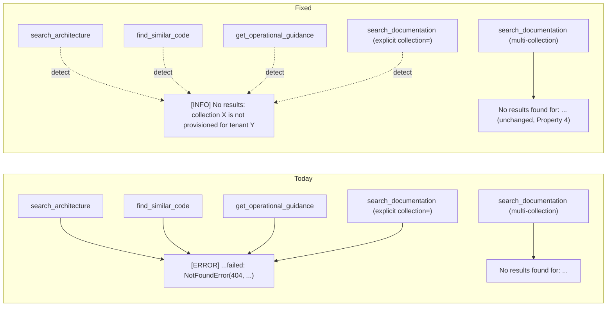

# Design Document — `graceful-missing-index-handling`

## Overview

A small, four-tool, tool-layer-only alignment. When an OpenSearch index is
genuinely absent for a tenant, the four affected tools currently return one
of two inconsistent shapes — three leak the raw `NotFoundError(404,
'index_not_found_exception', ...)` text; one (`search_documentation`
multi-collection) silently returns "No results". Both behaviours are
out-of-policy.

This spec adds a single Detect_Helper + a single Render_Helper to the
tool layer and routes each of the four tools' `except Exception` paths
through the helpers. A Missing_Index_Condition produces a clean
`[INFO]`-prefixed Skip_Block; every other exception keeps its current
rendering.

Total production change: ~25 lines of helper code + four ~3-line edits
in the tools (one per tool) + tests. No data-layer change. No new
dependency. No infra change. Same deploy pattern as
`opensearch-tenant-resolution-fix` and `health-check-bugfixes` — one
runtime image, one `update-agent-runtime`.

## Architecture



## Components and Interfaces

### Detect_Helper — `_is_missing_index_exc`

New helper in `src/tools/_common.py`:

```python
def _is_missing_index_exc(exc: BaseException) -> bool:
    """Return True iff the exception is an OpenSearch 'index_not_found_exception'.

    Detects two equivalent forms:

    * The structured opensearchpy ``NotFoundError`` whose ``error.type``
      is ``index_not_found_exception``.
    * The string-fallback case where the exception's ``str()`` form
      contains the literal token ``index_not_found_exception`` (covers
      the case when the upstream wraps the original error before it
      reaches the tool layer).

    The opensearchpy import is wrapped in try/except so the helper
    works in test environments that don't pull the AWS SDK.
    """
    try:
        from opensearchpy.exceptions import NotFoundError  # type: ignore
    except ImportError:  # pragma: no cover - dev/test path
        NotFoundError = None  # type: ignore[assignment]

    if NotFoundError is not None and isinstance(exc, NotFoundError):
        info = getattr(exc, "info", None) or {}
        err = info.get("error") if isinstance(info, dict) else None
        if isinstance(err, dict) and err.get("type") == "index_not_found_exception":
            return True

    return "index_not_found_exception" in str(exc)
```

The helper has zero hard dependencies. The opensearchpy path is
preferred (structured), the string path is the fallback.

### Render_Helper — `_missing_index_skip`

New helper in `src/tools/_common.py`:

```python
def _missing_index_skip(
    *,
    tool: str,
    query: str,
    collection: str,
    tenant_id: str | None,
) -> str:
    """Return the standardised Skip_Block markdown.

    Format:

        [INFO] {tool}: no results

        Collection '{collection}' is not provisioned for tenant
        '{tenant_id}'. Tip: use `get_knowledge_base_status(tenant_id=...)`
        to list collections that ARE provisioned for this tenant.
    """
    tid = tenant_id or "gw"
    coll_short = collection.split("/")[-1]  # cosmetic strip
    return (
        f"[INFO] {tool}: no results\n"
        f"\n"
        f"Collection '{coll_short}' is not provisioned for tenant "
        f"'{tid}'.\n"
        f"Tip: use `get_knowledge_base_status(tenant_id=\"{tid}\")` to list "
        f"collections that ARE provisioned for this tenant.\n"
    )
```

Pure ASCII, no payloads, no stack traces (R2.5).

### Tool wiring — four ~3-line edits

For each of the four affected tool wrappers, the existing
`except Exception as exc:` block gains a `_is_missing_index_exc` branch
*before* the existing `[ERROR]` formatter. Pattern:

```python
# search_architecture (graph_rag.py)
try:
    hits = await data.vector_db.query(
        COMMUNITY_COLLECTION, query, k=max_results,
        include_graph=False, tenant=_tenant(),
    )
except Exception as exc:
    if _is_missing_index_exc(exc):
        return _missing_index_skip(
            tool="search_architecture",
            query=query,
            collection=COMMUNITY_COLLECTION,
            tenant_id=_tenant_id_or_none(),
        )
    log.warning("search_architecture failed: %s", exc)
    return _error_text(f"search_architecture failed: {exc}")
```

- `find_similar_code` → same shape, `tool="find_similar_code"`,
  `collection=CODE_COLLECTION`.
- `get_operational_guidance` → same shape,
  `tool="get_operational_guidance"`,
  `collection=WORKFLOW_DOCS_COLLECTION`.
- `search_documentation` (explicit-`collection=` branch only) → same
  shape, `tool="search_documentation"`, `collection=collection`. The
  multi-collection branch is left exactly as today (Property 4 contract,
  R3.5 / R5.4).

Note: `_tenant_id_or_none()` is a tiny adapter that reads the active
`Tenant` via the existing `_tenant()` helper and returns its `tenant_id`
attribute or `None`. It lives next to `_tenant()` in the same module
(or in `_common.py` if multiple tools start needing it).

### What we explicitly do NOT change

- `OpenSearchAdapter.query` and `multi_collection_query` — no change.
  The per-collection swallow in `multi_collection_query` is preserved
  to keep `search_documentation` multi-collection mode byte-equivalent.
- `_render_vector_status_block` — that's
  `opensearch-tenant-resolution-fix`'s territory.
- The `[ERROR]` rendering for genuine non-404 exceptions (transport
  errors, auth failures, etc.) — unchanged.

## Data Models

No persistent data change. Two new pure-Python helpers with no state.

## Correctness Properties

### Property 1: Missing_Index_Condition detection is exact

For every exception `exc`, `_is_missing_index_exc(exc)` returns True iff
`exc` is an opensearchpy `NotFoundError` with
`error.type == 'index_not_found_exception'`, OR
`'index_not_found_exception' in str(exc)`. No false positives on
generic 404s (e.g. document-level missing) or generic transport errors.

**Validates: Requirements 1.1, 1.2, 1.3**

### Property 2: Skip_Block format invariants

Every output of `_missing_index_skip` begins with `[INFO]`, contains the
collection name, contains the tenant id (or literal `gw`), contains the
advisory line referencing `get_knowledge_base_status`, and is ASCII-only.

**Validates: Requirements 2.1, 2.2, 2.3, 2.4, 2.5**

### Property 3: Affected_Tools alignment

For each tool in `{search_architecture, find_similar_code,
get_operational_guidance, search_documentation (explicit-collection)}`,
when the underlying `vector_db.query` raises a Missing_Index_Condition,
the tool's rendered output is `_missing_index_skip(...)` for that
tool's own collection.

**Validates: Requirements 3.1, 3.2, 3.3, 3.4, 3.6**

### Property 4: Healthy-path byte-equivalence

For every Affected_Tool and every input that does NOT trigger
Missing_Index_Condition, the rendered output is byte-equivalent to the
pre-fix output on the same inputs against the same backend state.
Specifically: a normal hit list renders unchanged; a non-404 exception
renders unchanged; `search_documentation` multi-collection mode
rendering is unchanged in every case.

**Validates: Requirements 4.1, 4.2, 4.3, 4.4, 5.4**

## Error Handling

| Condition | Behaviour | Requirement |
|-----------|-----------|-------------|
| `vector_db.query` raises Missing_Index_Condition (single-collection callers) | Skip_Block returned | 3.1, 3.2, 3.3, 3.4, 3.6 |
| `vector_db.query` raises a non-404 exception | unchanged `[ERROR] ... failed: <exc>` | 4.2 |
| `multi_collection_query` swallows per-collection 404s and returns `[]` | unchanged `No results found for: "..."` | 3.5, 4.1 |
| `vector_db.query` returns hits normally | unchanged hit-list rendering | 4.1 |
| `_is_missing_index_exc` called from a context where opensearchpy is not importable | falls through to string-token detection | 1.3 |

## Testing Strategy

### Unit tests (`tests/unit/test_tool_common_helpers.py` — new file)

- `_is_missing_index_exc`:
  - opensearchpy `NotFoundError` with the right `error.type` → True.
  - opensearchpy `NotFoundError` with a different `error.type` (e.g.
    `document_missing_exception`) → False.
  - Synthetic exception whose `str()` contains
    `index_not_found_exception` → True.
  - Synthetic exception whose `str()` contains nothing relevant → False.
  - `BaseException` subclasses and odd shapes (e.g. `BaseException`
    raised directly) → False.
- `_missing_index_skip`:
  - Begins with `[INFO]`.
  - Contains the collection short name and the tenant id.
  - Contains the `get_knowledge_base_status` advisory.
  - ASCII-only assertion (`output.encode('ascii')` does not raise).

### Tool tests (extend the existing `test_*_tools.py` files)

For each of the four affected tools, two tests + one Bug-Condition
Exploration test:

1. **Healthy-path Property 4**: mock `vector_db.query` to return the
   existing fixture's hit list → rendered output byte-equivalent to a
   captured pre-fix snapshot string. Use the existing snapshot fixtures
   if the suite has them; otherwise embed the expected literal in the
   test (the same shape the tool already emits).
2. **Missing-index path**: mock `vector_db.query` to raise a synthetic
   opensearchpy-shaped 404 → output begins with `[INFO]`, contains the
   tool's collection name and tenant id.
3. **Non-404 path**: mock `vector_db.query` to raise a generic
   `RuntimeError("transport boom")` → output begins with `[ERROR]` and
   contains `transport boom` (R4.2).

### Bug-Condition Exploration test (workspace Bugfix Workflow)

One test per affected tool that:

- On the **unfixed** code (i.e. before applying the `_is_missing_index_exc`
  branch), asserts the rendered output begins with `[ERROR]` and
  contains the substring `index_not_found_exception`.
- On the **fixed** code, asserts the rendered output begins with
  `[INFO]` and contains the active tenant id and the collection name.
- Both directions confirmed before commit. Same pattern as the Bug 1 +
  Bug 2 exploration tests in `health-check-bugfixes`.

For `search_documentation` multi-collection mode (R3.5 / R5.4): an
additional Property 4 test asserts that when every backing
`multi_collection_query` collection 404s and `merged == []`, the
rendered output is the literal `No results found for: "..."` line, on
both the unfixed and fixed code (this path is unchanged).

### Live validation (Phase A of tasks)

Two probes per tool, against the live AgentCore runtime, after the
deploy:

- `search_architecture(tenant_id="gw_v17", query="ocean modeling")`
  → expect `[INFO]` Skip_Block (no `gw_v17_mdc-community-summaries-titan1024`).
- `find_similar_code(tenant_id="gw_v17", code_or_symbol="forecast")` →
  expect either ranked hits (after `opensearch-tenant-resolution-fix`'s
  Phase B alias creation) or `[INFO]` Skip_Block (before it).
- `get_operational_guidance(tenant_id="gw_v17", operation="failed
  forecast restart", platform="hera")` → expect ranked hits (the
  `gw_v17_mdc-workflow-docs-titan1024` index DOES have content).
- `search_documentation(tenant_id="gw_v17", query="GEMPAK",
  collection="ee2-standards-v5-0-0-enhanced")` → expect `[INFO]`
  Skip_Block (no v17 ee2-standards index).
- `search_architecture(tenant_id="gw", query="ocean modeling")` →
  expect ranked hits unchanged (Property 4 healthy path).

## Open Questions

None. The four-tool surface is finite, the detection predicate has a
clean structured form with a string fallback, and the Skip_Block shape
follows the existing `[INFO]` precedent already in the codebase. The
multi-collection swallow is preserved for byte-equivalence rather than
"fixed", since aligning it would require a wider data-layer signature
change (per-collection skip propagation) outside this spec's scope.
