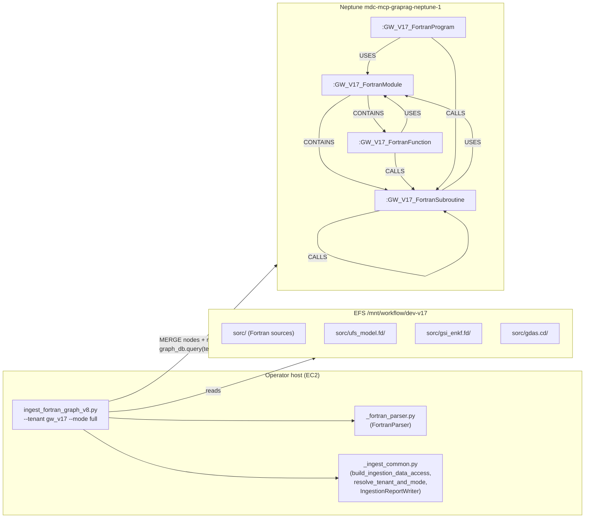
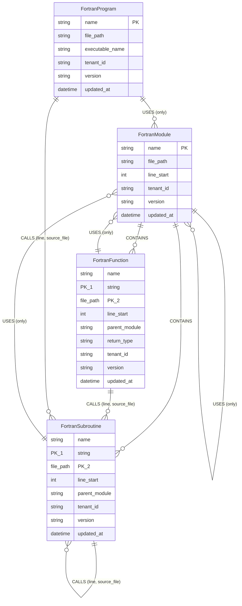
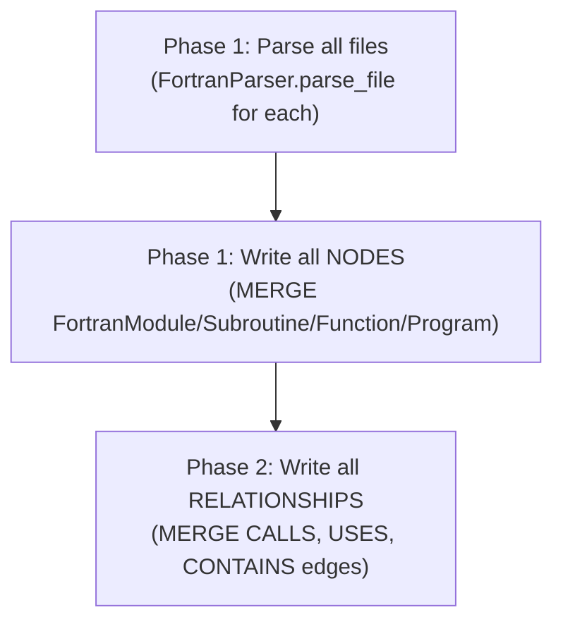
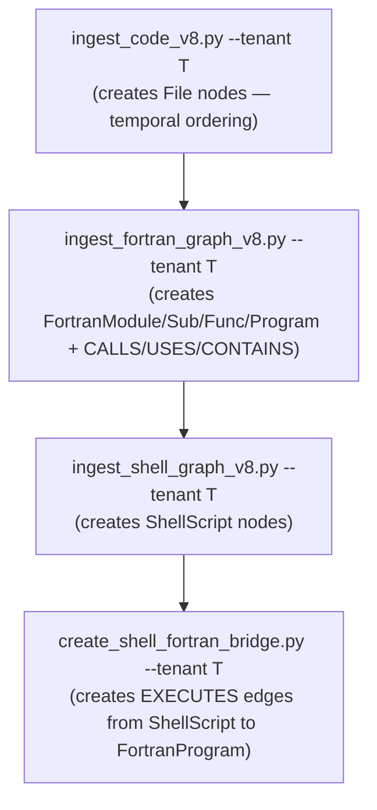

# Design Document — `graph-port-fortran-ast`

## Overview

Port the legacy Fortran graph ingestion script (`ingest_fortran_graph.py`,
1108 lines) from the Node.js codebase to the Python tenant-aware pipeline.
The port uses fparser2 to parse Fortran source files and creates a
comprehensive graph of Fortran code structure — FortranModule,
FortranSubroutine, FortranFunction, and FortranProgram nodes plus CALLS,
USES, and CONTAINS relationships — all scoped per tenant via label-prefix
isolation in Neptune.

**Why this matters now.** The v17 tenant re-ingest populated `GW_V17_File`
and `GW_V17_JJob` nodes, but `trace_full_execution_chain` cannot traverse
Fortran→Fortran call chains (no CALLS/USES edges from the maintained
pipeline). The Shell→Fortran bridge (`create_shell_fortran_bridge.py`,
already coded in `graph-port-shell-ops`) requires `FortranProgram` nodes
to exist before it can create EXECUTES edges. This feature creates those
nodes and the full Fortran call graph.

**Architecture principle.** Graph-only — no Bedrock embeddings, no
OpenSearch writes, no SHAIndex. Neptune `MERGE` provides idempotency.
The ingestion script follows the same `--tenant`, `--mode`,
`build_ingestion_data_access()`, and `IngestionReportWriter` patterns as
the v8 entry scripts.

**Baseline reference (unprefixed `gw` tenant):** 671 FortranProgram,
27,941 FortranSubroutine, 5,744 FortranFunction, 4,800 FortranModule
nodes + 2,216,985 CALLS + 487,061 USES edges. The `gw_v17` worktree
(shallow submodules) will be smaller but still substantial.

## Architecture

### Component diagram



### Data model



All node labels are prefixed with the tenant's `label_prefix` at write time
(e.g. `:GW_V17_FortranModule`). This is handled by f-string interpolation
in the cypher templates — NOT by the `_rewrite_cypher` mechanism (we pass
`tenant=None` to bypass it).

### Two-pass write strategy



The two-pass approach ensures all MERGE targets exist before edges reference
them. Phase 1 creates nodes so that Phase 2's MATCH clauses for relationship
endpoints will find their targets. This avoids the legacy script's approach
of creating placeholder nodes for unresolved call targets.

### Execution ordering



The Fortran AST ingester is independent of the shell graph (no cross-references
at node creation time). The bridge requires BOTH ShellScript nodes (from step C)
and FortranProgram nodes (from step B) to exist.

## Components and Interfaces

### 1. `_fortran_parser.py` — FortranParser (R2, R3, R4)

The most complex parser in the system. Wraps fparser2's AST traversal with
C preprocessor preprocessing, source sanitization, and include directory
discovery. Extracted as a testable module.

```python
# mcp_server_python/scripts/_fortran_parser.py

from __future__ import annotations

import os
import re
import subprocess
import tempfile
from dataclasses import dataclass, field
from pathlib import Path
from typing import Optional, Any

from fparser.common.readfortran import FortranFileReader
from fparser.two.parser import ParserFactory
from fparser.two.utils import walk
from fparser.two import Fortran2003 as f2003


@dataclass
class FortranParseResult:
    """Complete parse output for one Fortran source file."""
    file_path: str           # original path (not temp)
    relative_path: str       # relative to worktree_root
    modules: list[dict]      # [{name, line_start}]
    subroutines: list[dict]  # [{name, line_start, parent_module}]
    functions: list[dict]    # [{name, line_start, parent_module, return_type}]
    programs: list[dict]     # [{name, executable_name}]
    calls: list[dict]        # [{callee, line, caller}]
    uses: list[dict]         # [{module, only}]


# CPP directives that indicate preprocessing is needed
_CPP_DIRECTIVES = (
    '#ifdef', '#ifndef', '#if ', '#include', '#define',
    '#else', '#endif', '#undef', '#elif',
)

# Fortran extensions for discovery
FORTRAN_EXTENSIONS = frozenset([
    '.F90', '.f90', '.F', '.f', '.F95', '.f95',
    '.F03', '.f03', '.F08', '.f08',
])

# Directories to exclude from discovery
_EXCLUDED_DIRS = frozenset(['.git', 'build', 'test'])


class FortranParser:
    """Parse Fortran files using fparser2 with preprocessing and sanitization.

    Port of mcp_server_node/scripts/ingest_fortran_graph.py::FortranParser.
    Handles:
      - fparser2 AST traversal (Module_Stmt, Subroutine_Stmt, Function_Stmt,
        Program_Stmt, Call_Stmt, Use_Stmt)
      - C preprocessor preprocessing (cpp subprocess call)
      - Source sanitization (regex fixes for non-standard patterns)
      - Include directory discovery
    """

    # ── Sanitization patterns ──────────────────────────────────────────
    _MERGE_CONFLICT = re.compile(r'^(<{7}|>{7}|={7})')
    _WRITE_COMMA = re.compile(
        r'(\bwrite\s*\([^)]*\))\s*,', re.IGNORECASE
    )
    _NEW_STMT_KEYWORDS = (
        'TYPE', 'END', 'INTEGER', 'REAL', 'CHARACTER', 'LOGICAL',
        'PUBLIC', 'PRIVATE', 'CONTAINS', 'SUBROUTINE', 'FUNCTION',
        'MODULE', 'PROGRAM', 'USE ', 'IMPLICIT', 'INTERFACE', 'CALL ',
        'IF ', 'IF(', 'DO ', 'SELECT', 'WRITE', 'READ', 'OPEN',
        'CLOSE', 'ALLOCATE', 'DEALLOCATE', 'NULLIFY', 'CLASS',
        'ABSTRACT', 'PROCEDURE', 'GENERIC', 'FINAL', 'DATA ',
    )

    def __init__(self, worktree_root: str | Path):
        self._worktree_root = Path(worktree_root)
        self._parser = ParserFactory().create(std='f2003')
        self._include_dirs: list[str] | None = None

    # ── Public API ─────────────────────────────────────────────────────

    def discover_fortran_files(self) -> list[Path]:
        """Recursively discover Fortran source files under sorc/.

        Returns sorted list of absolute paths. Excludes .git/, build/,
        test/ directories. Traverses into submodule directories when
        checked out.
        """
        sorc_dir = self._worktree_root / 'sorc'
        if not sorc_dir.is_dir():
            raise FileNotFoundError(
                f"sorc/ directory not found in {self._worktree_root}. "
                "Source files are not available."
            )

        files: list[Path] = []
        for p in sorc_dir.rglob('*'):
            if not p.is_file():
                continue
            # Exclude banned directories
            if any(part in _EXCLUDED_DIRS for part in p.parts):
                continue
            if p.suffix in FORTRAN_EXTENSIONS:
                files.append(p)
        return sorted(files)

    def discover_include_dirs(self) -> list[str]:
        """Find directories containing .h/.inc/.fh files under sorc/."""
        if self._include_dirs is not None:
            return self._include_dirs

        sorc_dir = self._worktree_root / 'sorc'
        include_dirs: set[str] = set()
        if sorc_dir.is_dir():
            for root, dirs, filenames in os.walk(sorc_dir):
                # Skip excluded dirs
                dirs[:] = [d for d in dirs if d not in _EXCLUDED_DIRS]
                for f in filenames:
                    if f.endswith(('.h', '.inc', '.fh')):
                        include_dirs.add(root)
                        break
        self._include_dirs = sorted(include_dirs)
        return self._include_dirs

    def parse_file(self, filepath: str | Path) -> FortranParseResult | None:
        """Parse a Fortran file and extract AST structure.

        Pipeline: sanitize → CPP preprocess (if needed) → fparser2 parse.
        Returns None on failure (logged, does not raise).
        """
        filepath = str(filepath)
        temp_paths: list[str] = []

        try:
            actual_path = filepath

            # Step 1: Sanitize (dangling continuations, merge markers)
            sanitized = self._sanitize(filepath)
            if sanitized:
                actual_path = sanitized
                temp_paths.append(sanitized)

            # Step 2: CPP preprocess if directives present
            if self._needs_preprocessing(actual_path):
                preprocessed = self._preprocess(actual_path)
                if preprocessed:
                    actual_path = preprocessed
                    temp_paths.append(preprocessed)

            # Step 3: Parse with fparser2
            reader = FortranFileReader(actual_path, ignore_comments=True)
            tree = self._parser(reader)

            if tree is None:
                return None

            # Step 4: Extract structure (uses ORIGINAL filepath for metadata)
            return self._extract_structure(tree, filepath)

        except (Exception, SystemExit):
            return None
        finally:
            for p in temp_paths:
                try:
                    os.unlink(p)
                except OSError:
                    pass

    # ── Preprocessing ──────────────────────────────────────────────────

    def _needs_preprocessing(self, filepath: str) -> bool:
        """Check if file contains CPP directives."""
        try:
            with open(filepath, 'r', errors='replace') as f:
                for line in f:
                    stripped = line.lstrip()
                    if stripped.startswith('#') and any(
                        stripped.startswith(d) for d in _CPP_DIRECTIVES
                    ):
                        return True
        except OSError:
            return False
        return False

    def _preprocess(self, filepath: str) -> str | None:
        """Run cpp -traditional-cpp -nostdinc -P on the file."""
        include_dirs = self.discover_include_dirs()
        cmd = ['cpp', '-traditional-cpp', '-nostdinc', '-P']
        for d in include_dirs:
            cmd.extend(['-I', d])
        cmd.append(filepath)

        try:
            result = subprocess.run(
                cmd, capture_output=True, text=True, timeout=30
            )
            if result.returncode == 0 and result.stdout.strip():
                tmp = tempfile.NamedTemporaryFile(
                    mode='w', suffix='.f90', delete=False
                )
                tmp.write(result.stdout)
                tmp.close()
                return tmp.name
        except (subprocess.TimeoutExpired, FileNotFoundError, OSError):
            pass

        # Fallback: strip directives
        return self._strip_directives_fallback(filepath)

    def _strip_directives_fallback(self, filepath: str) -> str | None:
        """Comment out all # directives so fparser2 can parse."""
        try:
            with open(filepath, 'r', errors='replace') as f:
                lines = f.readlines()
        except OSError:
            return None

        cleaned = []
        for line in lines:
            if line.lstrip().startswith('#'):
                cleaned.append('! CPP: ' + line)
            else:
                cleaned.append(line)
        try:
            tmp = tempfile.NamedTemporaryFile(
                mode='w', suffix='.f90', delete=False
            )
            tmp.writelines(cleaned)
            tmp.close()
            return tmp.name
        except OSError:
            return None

    # ── Sanitization ───────────────────────────────────────────────────

    def _sanitize(self, filepath: str) -> str | None:
        """Fix non-standard patterns that cause fparser2 to fail.

        Fixes: dangling continuations, merge conflict markers,
        non-standard write commas.
        """
        try:
            with open(filepath, 'r', errors='replace') as f:
                lines = f.readlines()
        except OSError:
            return None

        modified = False
        i = 0
        while i < len(lines):
            stripped = lines[i].rstrip()
            code_part = stripped.lstrip()

            # Fix: merge conflict markers
            if self._MERGE_CONFLICT.match(code_part):
                lines[i] = '! [SANITIZED] ' + lines[i]
                modified = True
                i += 1
                continue

            # Fix: non-standard write comma
            if re.match(r'.*\bwrite\s*\([^)]*\)\s*,', code_part, re.IGNORECASE):
                new_line = self._WRITE_COMMA.sub(r'\1 ', lines[i])
                if new_line != lines[i]:
                    lines[i] = new_line
                    modified = True
                    i += 1
                    continue

            # Fix: dangling continuations
            if stripped.endswith('&') and not code_part.startswith('!'):
                j = i + 1
                while j < len(lines) and (
                    lines[j].strip() == '' or lines[j].strip().startswith('!')
                ):
                    j += 1
                dangling = False
                if j >= len(lines):
                    dangling = True
                elif j > i + 1:
                    next_code = lines[j].strip().upper()
                    if any(next_code.startswith(kw) for kw in self._NEW_STMT_KEYWORDS):
                        dangling = True
                if dangling:
                    if re.search(r',\s*&\s*$', stripped):
                        lines[i] = re.sub(r',\s*&\s*$', '\n', stripped) + '\n'
                        modified = True
                    elif '=' in stripped:
                        lines[i] = stripped[:-1] + "''\n"
                        modified = True
                    else:
                        lines[i] = stripped[:-1] + '\n'
                        modified = True
            i += 1

        if not modified:
            return None

        tmp = tempfile.NamedTemporaryFile(
            mode='w', suffix='.f90', delete=False
        )
        tmp.writelines(lines)
        tmp.close()
        return tmp.name

    # ── AST extraction ─────────────────────────────────────────────────

    def _extract_structure(
        self, tree: Any, filepath: str
    ) -> FortranParseResult:
        """Extract modules, subroutines, functions, calls, uses from AST."""
        rel_path = self._relative_path(filepath)

        modules: list[dict] = []
        subroutines: list[dict] = []
        functions: list[dict] = []
        programs: list[dict] = []
        calls: list[dict] = []
        uses: list[dict] = []

        # Track module containment context
        module_children: dict[str, list[str]] = {}  # module_name → [sub/func names]

        # Extract modules
        for node in walk(tree, f2003.Module_Stmt):
            try:
                name = str(node.items[1]).strip()
                line = getattr(node, 'item', None)
                line_num = line.span[0] if hasattr(line, 'span') else None
                modules.append({'name': name, 'line_start': line_num})
            except Exception:
                pass

        # Extract subroutines
        for node in walk(tree, f2003.Subroutine_Stmt):
            try:
                name = str(node.items[1]).strip()
                line = getattr(node, 'item', None)
                line_num = line.span[0] if hasattr(line, 'span') else None
                subroutines.append({
                    'name': name,
                    'line_start': line_num,
                    'parent_module': None,  # resolved below
                })
            except Exception:
                pass

        # Extract functions
        for node in walk(tree, f2003.Function_Stmt):
            try:
                name = str(node.items[1]).strip() if node.items[1] else 'unknown'
                line = getattr(node, 'item', None)
                line_num = line.span[0] if hasattr(line, 'span') else None
                functions.append({
                    'name': name,
                    'line_start': line_num,
                    'parent_module': None,
                    'return_type': None,
                })
            except Exception:
                pass

        # Extract programs
        for node in walk(tree, f2003.Program_Stmt):
            try:
                name = str(node.items[1]).strip() if node.items[1] else 'MAIN'
                programs.append({
                    'name': name,
                    'executable_name': self._infer_executable(filepath, name),
                })
            except Exception:
                pass

        # Extract CALL statements
        for node in walk(tree, f2003.Call_Stmt):
            try:
                callee = str(node.items[0]).strip()
                if '(' in callee:
                    callee = callee.split('(')[0].strip()
                line = getattr(node, 'item', None)
                line_num = line.span[0] if hasattr(line, 'span') else None
                calls.append({
                    'callee': callee,
                    'line': line_num,
                    'caller': None,
                })
            except Exception:
                pass

        # Extract USE statements
        for node in walk(tree, f2003.Use_Stmt):
            try:
                module_name = str(node.items[2]).strip() if node.items[2] else None
                if not module_name:
                    continue
                only_list = None
                if len(node.items) > 4 and node.items[4]:
                    only_list = str(node.items[4])
                uses.append({'module': module_name, 'only': only_list})
            except Exception:
                pass

        # Resolve parent_module for subroutines/functions
        # (Use module containment context from the AST)
        self._resolve_containment(tree, modules, subroutines, functions)

        return FortranParseResult(
            file_path=filepath,
            relative_path=rel_path,
            modules=modules,
            subroutines=subroutines,
            functions=functions,
            programs=programs,
            calls=calls,
            uses=uses,
        )

    def _resolve_containment(
        self, tree: Any,
        modules: list[dict],
        subroutines: list[dict],
        functions: list[dict],
    ) -> None:
        """Resolve parent_module for subroutines/functions within modules.

        Uses fparser2's Module node structure to identify which
        subroutines/functions are contained within which module.
        """
        try:
            from fparser.two import Fortran2003 as f2003_mod
            for mod_node in walk(tree, f2003_mod.Module):
                # Get module name from Module_Stmt
                mod_stmts = walk(mod_node, f2003_mod.Module_Stmt)
                mod_name = None
                for ms in mod_stmts:
                    try:
                        mod_name = str(ms.items[1]).strip()
                        break
                    except Exception:
                        pass
                if not mod_name:
                    continue

                # Find contained subroutines
                for sub_node in walk(mod_node, f2003_mod.Subroutine_Stmt):
                    try:
                        sub_name = str(sub_node.items[1]).strip()
                        for s in subroutines:
                            if s['name'] == sub_name and s['parent_module'] is None:
                                s['parent_module'] = mod_name
                                break
                    except Exception:
                        pass

                # Find contained functions
                for func_node in walk(mod_node, f2003_mod.Function_Stmt):
                    try:
                        func_name = str(func_node.items[1]).strip() if func_node.items[1] else None
                        if func_name:
                            for fn in functions:
                                if fn['name'] == func_name and fn['parent_module'] is None:
                                    fn['parent_module'] = mod_name
                                    break
                    except Exception:
                        pass
        except Exception:
            pass

    def _relative_path(self, filepath: str) -> str:
        """Get path relative to worktree root."""
        try:
            return str(Path(filepath).relative_to(self._worktree_root))
        except ValueError:
            return filepath

    def _infer_executable(self, filepath: str, program_name: str) -> str | None:
        """Infer executable name from sorc/*.fd path pattern."""
        parts = Path(filepath).parts
        for part in parts:
            if part.endswith('.fd'):
                return part.replace('.fd', '') + '.x'
        return None
```

### 2. `ingest_fortran_graph_v8.py` — Fortran graph ingestion entry script (R1, R5, R6, R7, R8, R9, R10, R11, R12)

```python
# mcp_server_python/scripts/ingest_fortran_graph_v8.py

import sys
from datetime import datetime, UTC
from pathlib import Path

from _ingest_common import (
    build_ingestion_parser, resolve_tenant_and_mode,
    resolve_worktree_root, build_ingestion_data_access,
)
from _fortran_parser import FortranParser, FortranParseResult


async def main() -> int:
    parser = build_ingestion_parser("Fortran AST graph ingestion (v8)")
    args = parser.parse_args()

    # Tenant + mode resolution
    catalog = load_catalog(catalog_path)
    tenant, mode = resolve_tenant_and_mode(args, catalog)
    worktree_root = resolve_worktree_root(tenant)
    prefix = tenant.label_prefix  # e.g. "GW_V17_" or "" for gw

    # Initialize parser
    fortran_parser = FortranParser(worktree_root)

    # Discover files
    try:
        files = fortran_parser.discover_fortran_files()
    except FileNotFoundError as e:
        print(f"[ERROR] {e}", file=sys.stderr)
        return 1

    print(f"[INFO] Discovered {len(files)} Fortran files")

    if args.dry_run:
        return _dry_run(fortran_parser, files)

    # Connect to Neptune (graph-only)
    uda, _ = await build_ingestion_data_access()
    graph_db = uda.graph_db

    report = IngestionReportWriter(tenant.tenant_id, tenant.branch, mode)
    report.increment("files_discovered", len(files))

    # ── Phase 1: Parse all files ───────────────────────────────────────
    all_results: list[FortranParseResult] = []
    for i, filepath in enumerate(files):
        result = fortran_parser.parse_file(filepath)
        if result:
            all_results.append(result)
            report.increment("files_parsed")
        else:
            report.increment("files_failed")

        if (i + 1) % 50 == 0:
            _log_progress(i + 1, len(files), report)

    # ── Phase 1 cont: Write all NODES ──────────────────────────────────
    for result in all_results:
        try:
            await _write_module_nodes(graph_db, prefix, result, tenant)
            await _write_subroutine_nodes(graph_db, prefix, result, tenant)
            await _write_function_nodes(graph_db, prefix, result, tenant)
            await _write_program_nodes(graph_db, prefix, result, tenant)
        except Exception as e:
            report.increment("write_errors")
            continue

    # ── Phase 2: Write all RELATIONSHIPS ───────────────────────────────
    for result in all_results:
        try:
            await _write_calls(graph_db, prefix, result)
            await _write_uses(graph_db, prefix, result)
            await _write_contains(graph_db, prefix, result)
        except Exception as e:
            report.increment("write_errors")
            continue

    report_path = report.finalize()
    await uda.close()
    return 0
```

### 3. Neptune write helpers — cypher templates (R5, R6)

All cypher uses f-string-interpolated back-tick-quoted labels with
`tenant=None` to bypass `_rewrite_cypher`. Same proven pattern as
`graph-port-shell-ops`.

```python
async def _write_module_nodes(graph_db, prefix: str, r: FortranParseResult, tenant):
    for mod in r.modules:
        cypher = (
            f"MERGE (m:`{prefix}FortranModule` {{name: $name}}) "
            f"SET m.file_path = $file_path, m.line_start = $line_start, "
            f"m.tenant_id = $tenant_id, m.version = $version, "
            f"m.updated_at = $updated_at"
        )
        await graph_db.query(cypher, params={
            "name": mod["name"],
            "file_path": r.relative_path,
            "line_start": mod.get("line_start"),
            "tenant_id": tenant.tenant_id,
            "version": "8.0.0",
            "updated_at": datetime.now(UTC).isoformat(),
        }, tenant=None)


async def _write_subroutine_nodes(graph_db, prefix: str, r: FortranParseResult, tenant):
    for sub in r.subroutines:
        cypher = (
            f"MERGE (s:`{prefix}FortranSubroutine` {{name: $name, file_path: $file_path}}) "
            f"SET s.line_start = $line_start, s.parent_module = $parent_module, "
            f"s.tenant_id = $tenant_id, s.version = $version, "
            f"s.updated_at = $updated_at"
        )
        await graph_db.query(cypher, params={
            "name": sub["name"],
            "file_path": r.relative_path,
            "line_start": sub.get("line_start"),
            "parent_module": sub.get("parent_module"),
            "tenant_id": tenant.tenant_id,
            "version": "8.0.0",
            "updated_at": datetime.now(UTC).isoformat(),
        }, tenant=None)


async def _write_function_nodes(graph_db, prefix: str, r: FortranParseResult, tenant):
    for func in r.functions:
        cypher = (
            f"MERGE (f:`{prefix}FortranFunction` {{name: $name, file_path: $file_path}}) "
            f"SET f.line_start = $line_start, f.parent_module = $parent_module, "
            f"f.return_type = $return_type, "
            f"f.tenant_id = $tenant_id, f.version = $version, "
            f"f.updated_at = $updated_at"
        )
        await graph_db.query(cypher, params={
            "name": func["name"],
            "file_path": r.relative_path,
            "line_start": func.get("line_start"),
            "parent_module": func.get("parent_module"),
            "return_type": func.get("return_type"),
            "tenant_id": tenant.tenant_id,
            "version": "8.0.0",
            "updated_at": datetime.now(UTC).isoformat(),
        }, tenant=None)


async def _write_program_nodes(graph_db, prefix: str, r: FortranParseResult, tenant):
    for prog in r.programs:
        cypher = (
            f"MERGE (p:`{prefix}FortranProgram` {{name: $name}}) "
            f"SET p.file_path = $file_path, p.executable_name = $exe_name, "
            f"p.tenant_id = $tenant_id, p.version = $version, "
            f"p.updated_at = $updated_at"
        )
        await graph_db.query(cypher, params={
            "name": prog["name"],
            "file_path": r.relative_path,
            "exe_name": prog.get("executable_name"),
            "tenant_id": tenant.tenant_id,
            "version": "8.0.0",
            "updated_at": datetime.now(UTC).isoformat(),
        }, tenant=None)


async def _write_calls(graph_db, prefix: str, r: FortranParseResult):
    """Phase 2: Create CALLS relationships.

    MERGE a placeholder FortranSubroutine for the callee if it doesn't exist,
    then MERGE the CALLS edge from a node in the current file to the callee.
    """
    for call in r.calls:
        cypher = (
            f"MERGE (callee:`{prefix}FortranSubroutine` {{name: $callee_name}}) "
            f"WITH callee "
            f"MATCH (caller) WHERE caller.file_path = $file_path "
            f"AND (caller:`{prefix}FortranSubroutine` "
            f"OR caller:`{prefix}FortranFunction` "
            f"OR caller:`{prefix}FortranProgram`) "
            f"MERGE (caller)-[r:CALLS]->(callee) "
            f"SET r.line = $line, r.source_file = $source_file"
        )
        await graph_db.query(cypher, params={
            "callee_name": call["callee"],
            "file_path": r.relative_path,
            "line": call.get("line"),
            "source_file": r.relative_path,
        }, tenant=None)


async def _write_uses(graph_db, prefix: str, r: FortranParseResult):
    """Phase 2: Create USES relationships."""
    for use in r.uses:
        cypher = (
            f"MERGE (mod:`{prefix}FortranModule` {{name: $module_name}}) "
            f"WITH mod "
            f"MATCH (user) WHERE user.file_path = $file_path "
            f"MERGE (user)-[r:USES]->(mod) "
            f"SET r.only = $only_clause"
        )
        await graph_db.query(cypher, params={
            "module_name": use["module"],
            "file_path": r.relative_path,
            "only_clause": use.get("only"),
        }, tenant=None)


async def _write_contains(graph_db, prefix: str, r: FortranParseResult):
    """Phase 2: Create CONTAINS relationships from modules to children."""
    for sub in r.subroutines:
        if sub.get("parent_module"):
            cypher = (
                f"MATCH (m:`{prefix}FortranModule` {{name: $mod_name}}) "
                f"MATCH (s:`{prefix}FortranSubroutine` "
                f"{{name: $sub_name, file_path: $file_path}}) "
                f"MERGE (m)-[:CONTAINS]->(s)"
            )
            await graph_db.query(cypher, params={
                "mod_name": sub["parent_module"],
                "sub_name": sub["name"],
                "file_path": r.relative_path,
            }, tenant=None)

    for func in r.functions:
        if func.get("parent_module"):
            cypher = (
                f"MATCH (m:`{prefix}FortranModule` {{name: $mod_name}}) "
                f"MATCH (f:`{prefix}FortranFunction` "
                f"{{name: $func_name, file_path: $file_path}}) "
                f"MERGE (m)-[:CONTAINS]->(f)"
            )
            await graph_db.query(cypher, params={
                "mod_name": func["parent_module"],
                "func_name": func["name"],
                "file_path": r.relative_path,
            }, tenant=None)
```

## Data Models

### Node types (all tenant-label-prefixed)

| Label | Primary Key | Properties | Created by |
|---|---|---|---|
| `{prefix}FortranModule` | `name` | file_path, line_start, tenant_id, version, updated_at | ingest_fortran_graph_v8 |
| `{prefix}FortranSubroutine` | `(name, file_path)` | line_start, parent_module, tenant_id, version, updated_at | ingest_fortran_graph_v8 |
| `{prefix}FortranFunction` | `(name, file_path)` | line_start, parent_module, return_type, tenant_id, version, updated_at | ingest_fortran_graph_v8 |
| `{prefix}FortranProgram` | `name` | file_path, executable_name, tenant_id, version, updated_at | ingest_fortran_graph_v8 |

### Relationship types

| Type | Source → Target | Properties | Created by |
|---|---|---|---|
| `CALLS` | FortranSubroutine/Function/Program → FortranSubroutine | line, source_file | ingest_fortran_graph_v8 (Phase 2) |
| `USES` | FortranSubroutine/Function/Module/Program → FortranModule | only | ingest_fortran_graph_v8 (Phase 2) |
| `CONTAINS` | FortranModule → FortranSubroutine/Function | — | ingest_fortran_graph_v8 (Phase 2) |

### MERGE key design

| Node type | MERGE key(s) | Rationale |
|---|---|---|
| FortranModule | `name` | Module names are globally unique in Fortran |
| FortranProgram | `name` | Program names are unique per compilation unit |
| FortranSubroutine | `(name, file_path)` | Same subroutine name can exist in multiple files |
| FortranFunction | `(name, file_path)` | Same function name can exist in multiple files |

## Module Map

| Module | Status | Purpose |
|---|---|---|
| `mcp_server_python/scripts/_fortran_parser.py` | **new** | `FortranParser` + `FortranParseResult` dataclass + discovery + preprocessing + sanitization |
| `mcp_server_python/scripts/ingest_fortran_graph_v8.py` | **new** | Fortran graph entry script (two-pass: nodes then relationships) |
| `mcp_server_python/scripts/_ingest_common.py` | modified | Add `COLLECTION_FORTRAN_GRAPH = "fortran_graph"` token (unused for dedupe but consistent) |
| `mcp_server_python/scripts/_ingest_walkers.py` | unchanged | Not used — Fortran graph has its own discovery |

## Correctness Properties

*A property is a characteristic or behavior that should hold true across all valid executions of a system — essentially, a formal statement about what the system should do. Properties serve as the bridge between human-readable specifications and machine-verifiable correctness guarantees.*

### Property 1: Fortran graph completeness

*For any* tenant T whose worktree contains N parseable Fortran files (files that fparser2 can successfully parse), after `ingest_fortran_graph_v8.py --tenant T --mode full` runs, Neptune contains at least N files that contribute nodes — i.e., at least N distinct `file_path` values appear across the tenant's FortranModule, FortranSubroutine, FortranFunction, and FortranProgram nodes.

**Validates: Requirements 1.1, 5.1–5.4**

### Property 2: CALLS edge correctness

*For any* Fortran source file containing CALL statements, after parsing and graph writes complete, every extracted `CALL <name>` statement produces a CALLS relationship edge in Neptune targeting a FortranSubroutine node with the corresponding callee name.

**Validates: Requirements 4.6, 6.1**

### Property 3: USES edge correctness

*For any* Fortran source file containing USE statements, after parsing and graph writes complete, every extracted `USE <module>` statement produces a USES relationship edge in Neptune targeting a FortranModule node with the corresponding module name.

**Validates: Requirements 4.7, 6.2**

### Property 4: CONTAINS hierarchy

*For any* Fortran source file where a subroutine or function is contained within a MODULE, after graph writes complete, a CONTAINS relationship exists from the FortranModule node to the contained FortranSubroutine or FortranFunction node.

**Validates: Requirements 6.3**

### Property 5: Idempotence

*For any* set of Fortran files and tenant T, running the ingestion N times produces the same graph state as running once — MERGE semantics guarantee no duplicate nodes or relationships across re-runs.

**Validates: Requirements 5.5, 6.4, 7.4**

### Property 6: Tenant isolation

*For any* two tenants A and B with distinct `label_prefix` values, all node labels produced by running ingestion for tenant A are prefixed with A's `label_prefix` and are disjoint from labels produced for tenant B.

**Validates: Requirements 5.6, 8.1**

### Property 7: Parse failure resilience

*For any* batch of Fortran files where K files fail to parse (fparser2 exception, SystemExit, or returns None) and (N - K) files parse successfully, the ingester shall create nodes and relationships for all (N - K) successful files without aborting.

**Validates: Requirements 10.1, 10.2, 10.3, 10.4**

## Error Handling

- **File read errors** (encoding, permission, I/O): log `[WARN]`, skip the
  file, continue processing. Report the error count in the final summary.
- **fparser2 exceptions** (including SystemExit): caught per file, logged
  with file path and error message, file skipped, processing continues.
- **CPP subprocess failure** (timeout or exit code): fall back to
  directive-stripping mode. If fallback also fails, skip the file.
- **Neptune query errors** (per-file): log `[WARN]` with the cypher and
  params, skip that file's writes, continue. Error count accumulated in
  report.
- **Neptune connection failure** (at startup): exit 1 with descriptive
  message naming the env vars to check.
- **Missing `sorc/` directory**: exit 1 with
  `[ERROR] sorc/ directory not found in {worktree_root}.`
- **Empty submodules**: log `[INFO] Submodule {path} has no Fortran files`,
  continue.
- **Memory pressure**: log `[WARN]` when RSS exceeds 4GB; force
  `gc.collect()` every 50 files.
- **Error details saved**: first 200 errors (file path + message) written to
  the ingestion report JSON.

## Testing Strategy

**Unit tests for `FortranParser`:**
- Feed synthetic Fortran snippets to `parse_file()`, assert correct extraction
  of modules, subroutines, functions, programs, calls, uses.
- Test preprocessing detection (`_needs_preprocessing`) with and without CPP
  directives.
- Test sanitization fixes (dangling continuations, merge conflict markers,
  non-standard write commas).
- Test `discover_fortran_files()` with synthetic directory trees.
- Edge cases: SystemExit from fparser2, None return, empty files, binary files.
- fparser2 is available (v0.2.2) so tests parse real Fortran syntax.

**Unit tests for cypher write helpers:**
- Each `_write_*` builds the expected back-tick-quoted, prefix-interpolated
  cypher with `tenant=None`; verify against a stub graph_db recording
  (cypher, params, tenant).
- Empty-prefix tenant (gw) → labels without underscore prefix
  (`:FortranModule`, not `:_FortranModule`).

**Property tests (Hypothesis, min 100 iterations):**
- P1 (graph completeness): generate synthetic worktree with N Fortran files →
  drive write logic against stub graph_db → assert N files contribute nodes.
- P2 (CALLS correctness): generate Fortran with random CALL statements →
  parse → verify each call produces a CALLS MERGE.
- P3 (USES correctness): generate Fortran with random USE statements →
  parse → verify each use produces a USES MERGE.
- P5 (idempotence): run write logic twice against a stub graph_db that models
  MERGE semantics → assert node/edge set after run 2 == after run 1.
- P6 (tenant isolation): two tenants over the same content → assert all
  labels for tenant A are disjoint from B's.
- P7 (resilience): batch with some unparseable files → verify all parseable
  files produce outputs.

**Property test configuration:**
- Library: Hypothesis (Python)
- Minimum 100 iterations per property
- Tag format: `Feature: graph-port-fortran-ast, Property {N}: {title}`

**Integration (live verification):**
- Run against gw_v17 worktree; compare node counts to baseline
  (adjusted for shallow submodules).
- `trace_full_execution_chain("JGLOBAL_FORECAST")` traverses Fortran→Fortran
  CALLS/USES chains.

## Out of Scope

- Shell operational graph (Spec 1: `graph-port-shell-ops`)
- Shell→Fortran EXECUTES bridge (already in Spec 1; depends on FortranProgram
  nodes from THIS spec)
- Rocoto XML workflow structure (Spec 2: `graph-port-workflow-structure`)
- Python AST graph / community detection (Spec 3: `graph-port-python-community`)
- OpenSearch embeddings for Fortran code (graph-only by design decision R7)
- Changes to the runtime query tools (they already follow CALLS/USES/CONTAINS
  edge types)
- Multi-repo support (Phase 34 NCEPLIBS tagging — defer to future extension)
- Caller attribution within files (determining which specific subroutine
  contains a CALL statement is an enhancement; the legacy script uses
  file-level caller matching which this port preserves)
