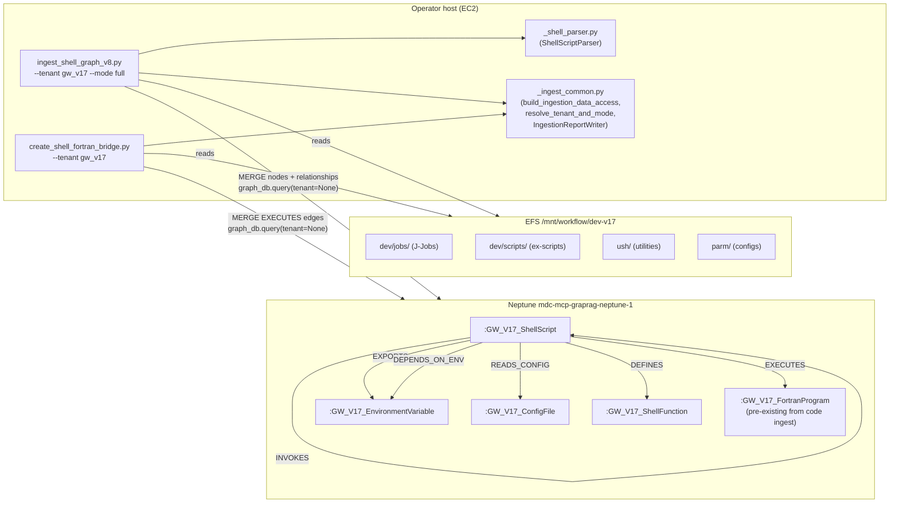
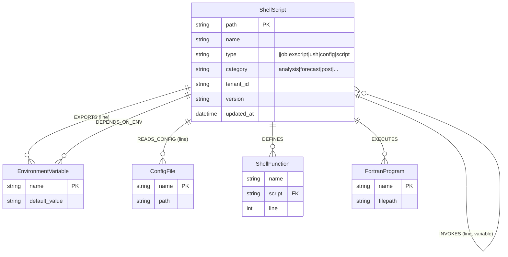
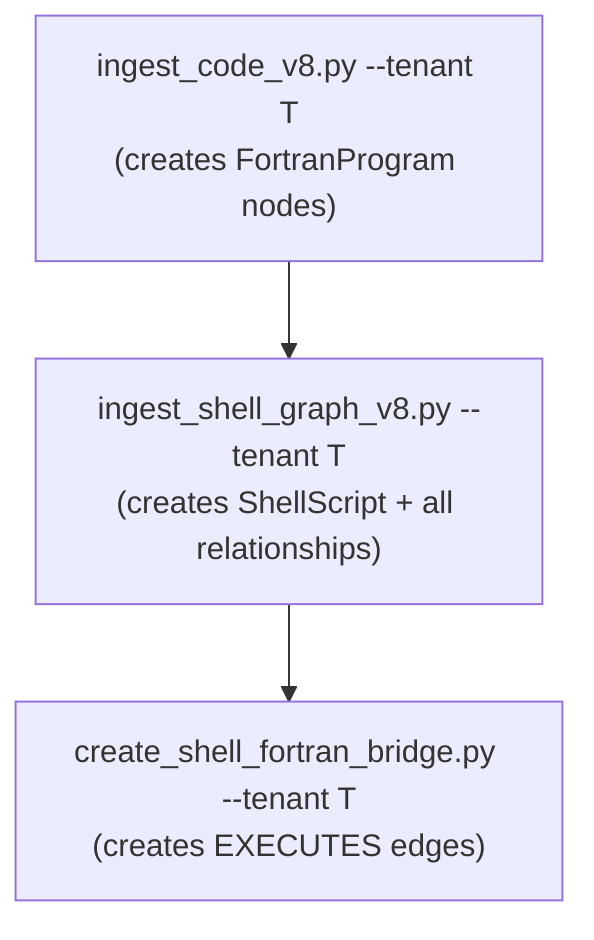

# Design Document — `graph-port-shell-ops`

## Overview

Port the legacy shell operational graph ingestion (`ingest_shell_graph_v8.py`)
and the Shell→Fortran execution bridge (`create_shell_fortran_bridge.py`) from
the Node.js codebase to the Python tenant-aware pipeline. After this feature
lands, Neptune contains the full shell call-tree semantics (SOURCES, INVOKES,
EXPORTS, DEPENDS_ON_ENV, READS_CONFIG, DEFINES) plus the cross-language
EXECUTES edges — all scoped per tenant via label-prefix isolation.

**Why this matters now.** The v17 tenant re-ingest (running overnight) populates
`GW_V17_File`, `GW_V17_JJob`, and `GW_V17_FortranProgram` nodes from the code
+ jjobs scripts, but `trace_full_execution_chain` cannot traverse Shell→Shell
call chains (no SOURCES/INVOKES) or Shell→Fortran boundaries (no EXECUTES from
the maintained pipeline). This feature fills that gap.

**Architecture principle.** Graph-only — no Bedrock embeddings, no OpenSearch
writes. Neptune `MERGE` provides idempotency. The ingestion scripts follow the
same `--tenant`, `--mode`, `build_ingestion_data_access()`, and
`IngestionReportWriter` patterns as the v8 entry scripts.

## Architecture

### Component diagram



### Data model



All node labels are prefixed with the tenant's `label_prefix` at write time
(e.g. `:GW_V17_ShellScript`). This is handled by f-string interpolation in the
cypher templates — NOT by the `_rewrite_cypher` mechanism (we pass
`tenant=None` to bypass it).

### Execution ordering



The bridge requires BOTH `ShellScript` nodes (from step B) and
`FortranProgram` nodes (from step A). The bridge has a pre-flight guard that
verifies at least one `FortranProgram` node exists for the tenant; if not, it
exits with a warning.

## Components and Interfaces

### 1. `_shell_parser.py` — ShellScriptParser (R1, R2)

A stateless parser class extracted as a testable module (same pattern as
`_ingest_dedupe.py`). Ported verbatim from the legacy's regex patterns, which
are battle-tested against the real GFS scripts.

```python
# mcp_server_python/scripts/_shell_parser.py

from __future__ import annotations
import re
from dataclasses import dataclass, field
from pathlib import Path
from typing import Optional


@dataclass
class ShellParseResult:
    """Complete parse output for one shell script."""
    path: str
    name: str
    type: str        # jjob | exscript | ush | config | script
    category: str    # analysis | forecast | post | archive | ...
    sources: list[dict]       # [{path, line, resolved}]
    invokes: list[dict]       # [{script, variable, line, package}]
    exports: list[dict]       # [{name, value, line}]
    env_deps: list[str]       # unique var names (filtered)
    functions: list[dict]     # [{name, line}]
    configs: list[dict]       # [{name, line}]


class ShellScriptParser:
    """Regex-based extraction of shell-graph relationships.

    Port of mcp_server_node/scripts/ingest_shell_graph_v8.py::ShellScriptParser.
    The regex patterns are preserved verbatim (they're tuned for GFS scripts).
    """

    # ── Regex patterns (verbatim from legacy) ──────────────────────────
    _SOURCE = re.compile(
        r'(?:source|\.) +["\']?'
        r'([^\s;|&"\']+/[^\s;|&"\']+|[^\s;|&"\']+\.(?:sh|bash|ksh|env|conf))'
        r'["\']?',
        re.MULTILINE,
    )
    _INVOKE_VAR = re.compile(
        r'\$\{?(\w+)\}?/([^;\s\n"\']+\.sh)', re.MULTILINE
    )
    _INVOKE_DIRECT = re.compile(
        r'(?:^|\s)(?:\./|sh\s+|bash\s+)([^;\s\n"\']+\.sh)', re.MULTILINE
    )
    _EXPORT = re.compile(r'^export\s+(\w+)=(.*)$', re.MULTILINE)
    _ENV_USE = re.compile(r'\$\{?(\w+)\}?')
    _FUNCTION = re.compile(
        r'^(?:function\s+)?(\w+)\s*\(\s*\)\s*\{?', re.MULTILINE
    )
    _CONFIG = re.compile(r'config\.(\w+)', re.MULTILINE)

    # ── Filters ────────────────────────────────────────────────────────
    _BUILTIN_VARS = frozenset([
        'HOME', 'PATH', 'PWD', 'USER', 'SHELL', 'TERM',
        '1', '2', '3', '4', '5', '6', '7', '8', '9', '0',
        'i', 'j', 'n', 'x', 'y', 'z', 'file', 'line', 'err',
    ])
    _BUILTIN_FUNCS = frozenset([
        'if', 'while', 'for', 'case', 'then', 'else', 'fi', 'do', 'done',
    ])

    # ── Variable→path resolution table ─────────────────────────────────
    _PATH_RESOLUTIONS: dict[str, str] = {
        '${USHgfs}': 'ush',
        '${HOMEgfs}': '',
        '${PARMgfs}': 'parm',
        '${SCRIPTSgfs}': 'dev/scripts',
        '${EXPDIR}': 'expdir',
    }

    # ── External package detection ─────────────────────────────────────
    _EXTERNAL_PACKAGES: dict[str, str] = {
        'HOMEobsproc': 'obsproc',
        'HOMEgfs_wafs': 'gfs_wafs',
        'HOMEpost': 'upp',
        'HOMEgempak': 'gempak',
    }

    def parse(self, file_path: str, content: str) -> ShellParseResult:
        """Parse a shell script, return structured extraction."""
        ...  # implementation per the legacy logic

    def classify_type(self, file_path: str) -> str:
        """Classify script type from path."""
        if 'dev/jobs' in file_path or Path(file_path).name.startswith('J'):
            return 'jjob'
        elif 'dev/scripts' in file_path or Path(file_path).name.startswith('ex'):
            return 'exscript'
        elif 'ush' in file_path:
            return 'ush'
        elif 'parm' in file_path or 'config' in file_path:
            return 'config'
        return 'script'

    def classify_category(self, file_path: str, content: str) -> str:
        """Classify operational category from filename patterns."""
        ...  # per legacy _determine_category

    def _resolve_path(self, source_path: str) -> Optional[str]:
        """Resolve variable-containing paths to relative paths."""
        for var, base in self._PATH_RESOLUTIONS.items():
            if var in source_path:
                return source_path.replace(var, base)
        return None
```

### 2. `ingest_shell_graph_v8.py` — Shell graph ingestion entry script (R1, R3, R5, R6, R8, R9, R10)

```python
# mcp_server_python/scripts/ingest_shell_graph_v8.py

async def main() -> int:
    parser = build_ingestion_parser("Shell operational graph ingestion (v8)")
    args = parser.parse_args()

    # Tenant + mode resolution (same as other v8 scripts)
    catalog = load_catalog(catalog_path)
    tenant, mode = resolve_tenant_and_mode(args, catalog)
    worktree_root = resolve_worktree_root(tenant)
    prefix = tenant.label_prefix  # e.g. "GW_V17_" or "" for gw

    if args.dry_run:
        ...  # parse + summarize, no writes
        return 0

    # Build data access (graph-only — no OpenSearch needed, but
    # build_ingestion_data_access() connects both; we only use graph_db)
    uda, _ = await build_ingestion_data_access()
    graph_db = uda.graph_db

    # Discover shell scripts (custom walker — not files_for_full_branch)
    scripts = discover_shell_scripts(worktree_root, mode)

    # Parse + write
    shell_parser = ShellScriptParser()
    report = IngestionReportWriter(tenant.tenant_id, tenant.branch, mode)

    for path in scripts:
        try:
            content = path.read_text(errors='replace')
        except OSError:
            continue
        result = shell_parser.parse(str(path), content)
        report.increment("total_files_processed")

        # Write nodes + relationships (all MERGE, idempotent)
        await _write_script_node(graph_db, prefix, result)
        await _write_sources(graph_db, prefix, result)
        await _write_invokes(graph_db, prefix, result)
        await _write_exports(graph_db, prefix, result)
        await _write_depends_on_env(graph_db, prefix, result)
        await _write_reads_config(graph_db, prefix, result)
        await _write_defines(graph_db, prefix, result)

        report.increment(f"nodes:{prefix}ShellScript")
        # ... per-relationship-type counters

    report_path = report.finalize()
    await uda.close()
    return 0
```

### 3. Shell script discovery — `discover_shell_scripts()` (R1)

Unlike `files_for_full_branch` (which yields ALL files), the shell graph needs
only shell scripts. Discovery logic:

```python
def discover_shell_scripts(
    worktree_root: Path, mode: str
) -> list[Path]:
    """Discover shell scripts for graph ingestion.

    Includes:
      - *.sh, *.bash, *.ksh in the entire tree
      - Extensionless files in dev/jobs/ (J-Job convention)
      - Extensionless files starting with 'ex' in dev/scripts/

    Excludes:
      - .git/ subtrees
      - Binary files (detected by null-byte scan of first 512 bytes)
    """
    if mode == "diff":
        # Use git diff to find changed shell scripts only
        ...
    else:
        # Full tree walk with shell-file filter
        candidates = []
        for p in worktree_root.rglob("*"):
            if not p.is_file() or ".git" in p.parts:
                continue
            if p.suffix in (".sh", ".bash", ".ksh"):
                candidates.append(p)
            elif _is_jjob_or_exscript(p):
                candidates.append(p)
        return candidates


def _is_jjob_or_exscript(p: Path) -> bool:
    """Extensionless J-Jobs and ex-scripts."""
    if p.suffix:
        return False
    rel = str(p)
    if 'dev/jobs' in rel or (p.name.startswith('J') and p.name.isupper()):
        return True
    if 'dev/scripts' in rel and p.name.startswith('ex'):
        return True
    return False
```

### 4. Neptune write helpers — cypher templates (R3)

All cypher uses f-string-interpolated back-tick-quoted labels with
`tenant=None` to bypass `_rewrite_cypher`. This is the proven pattern from
`delete_tenant_indices.py` and the v8 ingest scripts.

```python
async def _write_script_node(graph_db, prefix: str, r: ShellParseResult):
    cypher = (
        f"MERGE (s:`{prefix}ShellScript` {{path: $path}}) "
        f"SET s.name = $name, s.type = $type, s.category = $category, "
        f"s.tenant_id = $tenant_id, s.version = $version, "
        f"s.updated_at = $updated_at"
    )
    await graph_db.query(cypher, params={
        "path": r.path, "name": r.name, "type": r.type,
        "category": r.category, "tenant_id": ...,
        "version": "8.0.0", "updated_at": datetime.now(UTC).isoformat(),
    }, tenant=None)


async def _write_sources(graph_db, prefix: str, r: ShellParseResult):
    for src in r.sources:
        target_path = src.get("resolved") or src["path"]
        cypher = (
            f"MATCH (s:`{prefix}ShellScript` {{path: $sp}}) "
            f"MERGE (t:`{prefix}ShellScript` {{path: $tp}}) "
            f"ON CREATE SET t.name = $tn, t.type = 'sourced' "
            f"MERGE (s)-[r:SOURCES]->(t) SET r.line = $line"
        )
        await graph_db.query(cypher, params={
            "sp": r.path, "tp": target_path,
            "tn": Path(src["path"]).name, "line": src["line"],
        }, tenant=None)


async def _write_exports(graph_db, prefix: str, r: ShellParseResult):
    for exp in r.exports:
        cypher = (
            f"MATCH (s:`{prefix}ShellScript` {{path: $sp}}) "
            f"MERGE (e:`{prefix}EnvironmentVariable` {{name: $vn}}) "
            f"ON CREATE SET e.default_value = $dv "
            f"MERGE (s)-[r:EXPORTS]->(e) SET r.line = $line"
        )
        await graph_db.query(cypher, params={
            "sp": r.path, "vn": exp["name"],
            "dv": exp.get("value", ""), "line": exp["line"],
        }, tenant=None)


async def _write_depends_on_env(graph_db, prefix: str, r: ShellParseResult):
    for var in r.env_deps:
        cypher = (
            f"MATCH (s:`{prefix}ShellScript` {{path: $sp}}) "
            f"MERGE (e:`{prefix}EnvironmentVariable` {{name: $vn}}) "
            f"MERGE (s)-[:DEPENDS_ON_ENV]->(e)"
        )
        await graph_db.query(cypher, params={
            "sp": r.path, "vn": var,
        }, tenant=None)


# _write_invokes, _write_reads_config, _write_defines follow the same pattern.
```

### 5. `create_shell_fortran_bridge.py` — EXECUTES edges (R4, R7)

```python
# mcp_server_python/scripts/create_shell_fortran_bridge.py

# Known executable→FortranProgram mappings for names that differ
KNOWN_EXEC_MAPPINGS: dict[str, str | None] = {
    "enkf": "enkf_main",
    "gsi": "gsi_main",
    "ufs_model": "ufs_model",
    "global_chgres": "global_chgres",
    # None → known exec with no matching Fortran node (skip silently)
    "wgrib2": None,
    "cnvgrib": None,
}

# Exec-reference extraction patterns
EXEC_PATTERNS = [
    re.compile(r'\$\{?EXECgfs\}?/(\S+?)(?:\.x)?(?:\s|$|;)'),
    re.compile(r'\$\{?HOMEgfs\}?/exec/(\S+?)(?:\.x)?(?:\s|$|;)'),
    re.compile(r'export\s+pgm\s*=\s*["\']?(\w+)'),
    re.compile(r'\bpgm\s*=\s*["\']?(\w+)'),
]


def match_exec_to_program(
    exec_name: str, programs: dict[str, str]
) -> str | None:
    """Multi-strategy matching: known-mappings → exact → _main suffix →
    prefix → exec-starts-with-program → progressive suffix stripping.

    Parameters
    ----------
    exec_name : str
        Extracted executable name (lowercased).
    programs : dict[str, str]
        Mapping of lowercase-program-name → canonical-program-name from
        Neptune FortranProgram nodes.

    Returns
    -------
    str | None
        The canonical FortranProgram node name, or None if no match.
    """
    lower = exec_name.lower()

    # Strategy 0: known mappings
    if lower in KNOWN_EXEC_MAPPINGS:
        mapped = KNOWN_EXEC_MAPPINGS[lower]
        if mapped is None:
            return None
        if mapped.lower() in programs:
            return programs[mapped.lower()]

    # Strategy 1: exact
    if lower in programs:
        return programs[lower]

    # Strategy 2: _main suffix
    if f"{lower}_main" in programs:
        return programs[f"{lower}_main"]

    # Strategy 3: prefix match (program starts with exec_name)
    for pname in programs:
        if pname.startswith(lower) and (
            pname == lower or pname[len(lower):].startswith('_')
        ):
            return programs[pname]

    # Strategy 4: exec starts with program
    for pname in programs:
        if lower.startswith(pname) and (
            len(lower) == len(pname) or lower[len(pname)] == '_'
        ):
            return programs[pname]

    # Strategy 5: progressive suffix stripping
    parts = lower.split('_')
    for i in range(len(parts) - 1, 0, -1):
        partial = '_'.join(parts[:i])
        if partial in programs:
            return programs[partial]
        if f"{partial}_main" in programs:
            return programs[f"{partial}_main"]

    return None


async def main() -> int:
    parser = build_ingestion_parser("Shell→Fortran EXECUTES bridge")
    args = parser.parse_args()

    catalog = load_catalog(catalog_path)
    tenant, _ = resolve_tenant_and_mode(args, catalog)
    worktree_root = resolve_worktree_root(tenant)
    prefix = tenant.label_prefix

    uda, _ = await build_ingestion_data_access()
    graph_db = uda.graph_db

    # R7.1: verify FortranProgram nodes exist
    check = await graph_db.query(
        f"MATCH (p:`{prefix}FortranProgram`) RETURN count(p) AS c",
        tenant=None,
    )
    if not check or check[0].get("c", 0) == 0:
        print(f"[WARN] No {prefix}FortranProgram nodes found. "
              "Run ingest_code_v8.py first.", file=sys.stderr)
        await uda.close()
        return 1

    # Fetch existing programs for matching
    rows = await graph_db.query(
        f"MATCH (p:`{prefix}FortranProgram`) RETURN p.name AS name",
        tenant=None,
    )
    programs = {r["name"].lower(): r["name"] for r in rows if r.get("name")}

    # Scan shell scripts for exec references + match
    shell_files = discover_shell_scripts(worktree_root, "full")
    report = IngestionReportWriter(tenant.tenant_id, tenant.branch, "bridge")
    matched = 0; unmatched_set = set()

    for path in shell_files:
        try:
            content = path.read_text(errors='replace')
        except OSError:
            continue
        refs = extract_exec_references(content)
        shell_name = path.name
        for ref in refs:
            prog = match_exec_to_program(ref, programs)
            if prog:
                if not args.dry_run:
                    cypher = (
                        f"MATCH (s:`{prefix}ShellScript` {{name: $sn}}) "
                        f"MATCH (p:`{prefix}FortranProgram` {{name: $pn}}) "
                        f"MERGE (s)-[:EXECUTES]->(p)"
                    )
                    await graph_db.query(cypher, params={
                        "sn": shell_name, "pn": prog,
                    }, tenant=None)
                matched += 1
            else:
                unmatched_set.add(ref)

    report.increment("executes_created", matched)
    report.increment("unmatched_refs", len(unmatched_set))
    report_path = report.finalize()
    await uda.close()
    return 0
```

### 6. Shell script file discovery filter (R1)

The discovery must be shell-script-specific (not all files). The criteria:

| Path pattern | Included | Type assigned |
|---|---|---|
| `**/*.sh`, `**/*.bash`, `**/*.ksh` | yes | by-path classification |
| `dev/jobs/J*` (extensionless, uppercase) | yes | `jjob` |
| `dev/scripts/ex*` (extensionless) | yes | `exscript` |
| `.git/**` | excluded | — |
| Binary files (null byte in first 512 bytes) | excluded | — |
| Everything else | excluded | — |

For `--mode diff`, the discovery uses `git diff --name-only develop..HEAD` and
filters through the same criteria (only shell-patterned changed files).

## Data Models

### Node types (all tenant-label-prefixed)

| Label | Primary Key | Properties | Created by |
|---|---|---|---|
| `{prefix}ShellScript` | `path` | name, type, category, tenant_id, version, updated_at | ingest_shell_graph_v8 |
| `{prefix}EnvironmentVariable` | `name` | default_value | ingest_shell_graph_v8 (MERGE on first encounter) |
| `{prefix}ConfigFile` | `name` | path | ingest_shell_graph_v8 |
| `{prefix}ShellFunction` | `(name, script)` | line | ingest_shell_graph_v8 |
| `{prefix}FortranProgram` | `name` | filepath | Pre-existing (from ingest_code_v8) |

### Relationship types

| Type | Source → Target | Properties | Created by |
|---|---|---|---|
| `SOURCES` | ShellScript → ShellScript | line | ingest_shell_graph_v8 |
| `INVOKES` | ShellScript → ShellScript | line, variable | ingest_shell_graph_v8 |
| `EXPORTS` | ShellScript → EnvironmentVariable | line | ingest_shell_graph_v8 |
| `DEPENDS_ON_ENV` | ShellScript → EnvironmentVariable | — | ingest_shell_graph_v8 |
| `READS_CONFIG` | ShellScript → ConfigFile | line | ingest_shell_graph_v8 |
| `DEFINES` | ShellScript → ShellFunction | — | ingest_shell_graph_v8 |
| `EXECUTES` | ShellScript → FortranProgram | — | create_shell_fortran_bridge |

## Module Map

| Module | Status | Purpose |
|---|---|---|
| `mcp_server_python/scripts/_shell_parser.py` | **new** | `ShellScriptParser` + `ShellParseResult` dataclass |
| `mcp_server_python/scripts/ingest_shell_graph_v8.py` | **new** | Shell graph entry script (nodes + 6 relationship types) |
| `mcp_server_python/scripts/create_shell_fortran_bridge.py` | **new** | EXECUTES edges (Shell→Fortran cross-language bridge) |
| `mcp_server_python/scripts/_ingest_common.py` | modified | Add `COLLECTION_SHELL_GRAPH = "shell_graph"` token (unused for dedupe but consistent) |
| `mcp_server_python/scripts/_ingest_walkers.py` | unchanged | Not used — shell graph has its own discovery |

## Correctness Properties

Property 1: Shell graph completeness

For any tenant T whose worktree contains N shell scripts (by the discovery
criteria), after `ingest_shell_graph_v8.py --tenant T --mode full` runs:
Neptune contains exactly N `{T.label_prefix}ShellScript` nodes.

**Validates: Requirements 1.1, 3.1**

Property 2: SOURCES edge correctness

For any shell script S containing `. path/to/other.sh` or
`source path/to/other.sh`, Neptune contains a SOURCES edge from S's node to
the target ShellScript node.

**Validates: Requirements 2.1, 3.6**

Property 3: Env-var tenant isolation

For any two tenants A and B: `{A.label_prefix}EnvironmentVariable` nodes are
disjoint from `{B.label_prefix}EnvironmentVariable` nodes (no cross-tenant
leakage even when the same variable name exists in both branches).

**Validates: Requirements 3.2, 5.1**

Property 4: EXECUTES bridge correctness

For any shell script S referencing executable X, and a FortranProgram node P
where `match_exec_to_program(X, programs)` returns P.name, Neptune contains an
EXECUTES edge from S to P.

**Validates: Requirements 4.1, 4.2, 4.3**

Property 5: Idempotence

Running the ingestion N times produces the same graph state as running once
(MERGE semantics guarantee no duplicates).

**Validates: Requirements 3.5, 6.4**

Property 6: Fortran-node prerequisite guard

The bridge script exits with a warning (exit 1, no EXECUTES edges created)
when zero `{T.label_prefix}FortranProgram` nodes exist for the tenant.

**Validates: Requirements 7.1, 7.2**

## Error Handling

- **File read errors** (encoding, permission, I/O): log `[WARN]`, skip the
  file, continue processing. Report the error count in the final summary.
- **Neptune query errors** (per-file): log `[WARN]` with the cypher and
  params, skip that file's writes, continue. The error count is accumulated
  and surfaced in the report.
- **Neptune connection failure** (at startup): exit 1 with a descriptive
  message naming the env vars to check (same pattern as the v8 ingesters).
- **Binary files** in the discovery: detected by null-byte scan of the first
  512 bytes, skipped silently (not counted as errors).
- **Fortran bridge — no program nodes**: exit 1 with `[WARN] No
  {prefix}FortranProgram nodes found. Run ingest_code_v8.py first.`

## Testing Strategy

- **Unit tests for `ShellScriptParser`**: feed synthetic shell content, assert
  correct extraction of sources/invokes/exports/env-deps/functions/configs.
  Edge cases: nested quotes, multi-line exports, `${}` vs `$` vars, comments.
- **Unit tests for `match_exec_to_program`**: exercise all 6 matching strategies
  (known-mapping, exact, _main, prefix, exec-starts-with, progressive strip).
- **Property tests**: P1 (graph completeness — generated worktree → node count),
  P3 (env-var isolation — two tenants → disjoint sets), P5 (idempotence — double
  run → identical graph snapshot).
- **Integration (live verification)**: run against gw_v17, then
  `trace_full_execution_chain("JGLOBAL_FORECAST")` and confirm it traverses
  Shell→Shell (SOURCES/INVOKES) and Shell→Fortran (EXECUTES) edges.

## Out of Scope

- Rocoto XML workflow structure (Spec 2: `graph-port-workflow-structure`)
- Config file SETS_ENV edges (Spec 2)
- Python AST graph / community detection (Spec 3)
- Changes to the runtime query tools (they already follow these edge types)
- OpenSearch embeddings for shell scripts (graph-only by design decision R6)
