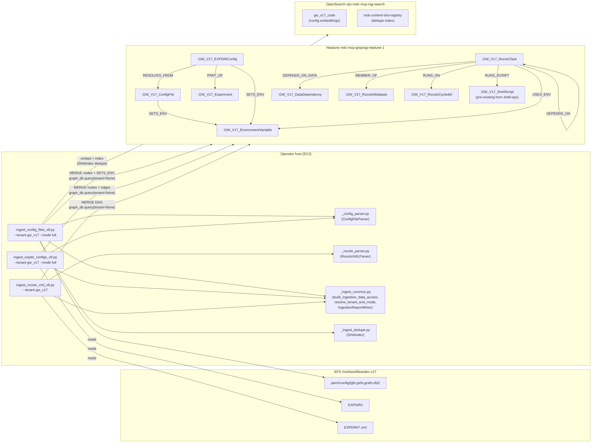
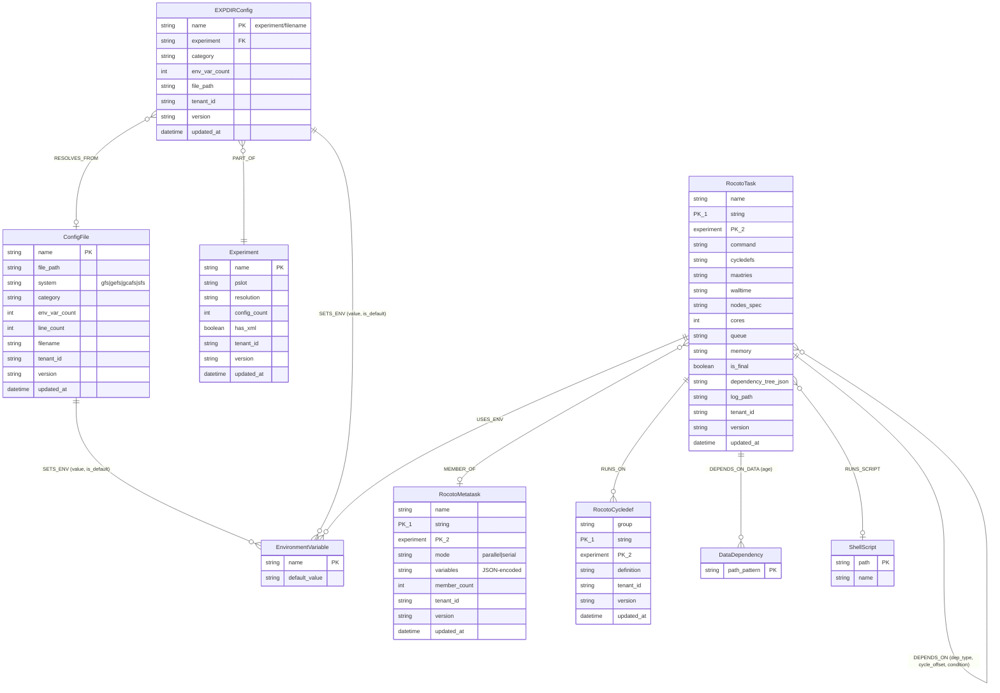
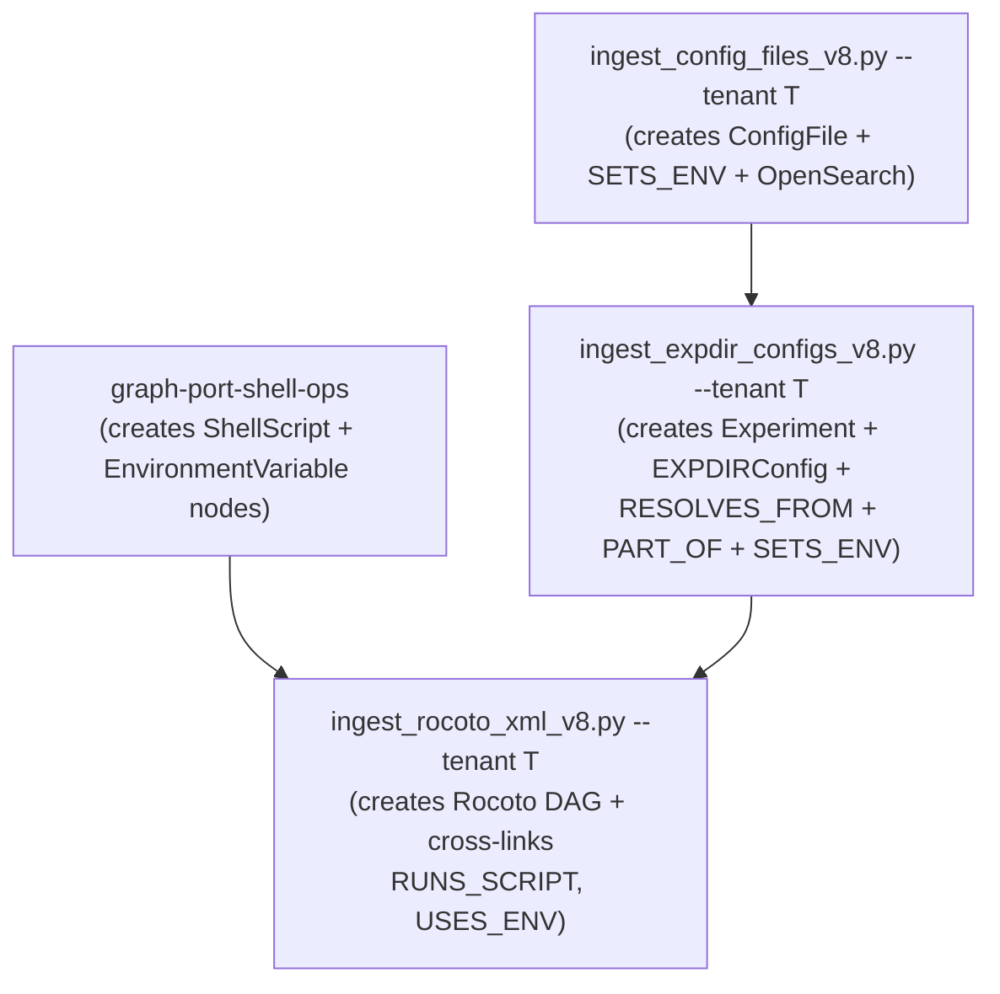

# Design Document — `graph-port-workflow-structure`

## Overview

Port the three legacy workflow-structure graph-building scripts
(`ingest_config_files.py`, `ingest_expdir_configs.py`, `ingest_rocoto_xml.py`)
from the Node.js codebase to the Python tenant-aware pipeline. After this
feature lands, Neptune contains the full workflow-structure semantics — config
file environment-variable lineage (SETS_ENV), experiment-directory resolution
chains (RESOLVES_FROM, PART_OF), and the Rocoto job-dependency DAG (DEPENDS_ON,
MEMBER_OF, RUNS_ON, DEPENDS_ON_DATA, RUNS_SCRIPT, USES_ENV) — all scoped per
tenant via label-prefix isolation.

**Why this matters now.** With `graph-port-shell-ops` (Spec 1) providing
Shell→Shell and Shell→Fortran traversal, the graph still cannot answer workflow
ordering queries ("what runs before JGFS_ATMOS_ANALYSIS?"), config lineage
queries ("where does $COMROOT get its value?"), or Rocoto metatask hierarchy
traversals. This spec fills that gap. Once landed, `trace_full_execution_chain`
can traverse Rocoto→Shell→Fortran end-to-end.

**Architecture principle.** Three separate entry scripts, each with a focused
responsibility. The config file ingester is unique: it writes to BOTH Neptune
AND OpenSearch (embeddings). The EXPDIR and Rocoto ingesters are graph-only.
All three use the same tenant-aware infrastructure (`_ingest_common.py`,
`IngestionReportWriter`, `build_ingestion_data_access()`).

## Architecture

### Component diagram



### Data model



All node labels are prefixed with the tenant's `label_prefix` at write time
(e.g. `:GW_V17_ConfigFile`). This is handled by f-string interpolation in
cypher templates — NOT by `_rewrite_cypher` (we pass `tenant=None` to bypass
it). Same proven pattern as `graph-port-shell-ops`.

### Execution ordering



The config ingester runs independently (no dependencies on other workflow-
structure nodes). The EXPDIR ingester depends on config having run first
(RESOLVES_FROM references ConfigFile nodes). The Rocoto ingester depends on
`graph-port-shell-ops` having run first (RUNS_SCRIPT references ShellScript
nodes). Cross-links use `MATCH` which returns empty if the target doesn't
exist — graceful degradation, not failure.

## Components and Interfaces

### 1. `_config_parser.py` — ConfigFileParser (R1)

A stateless parser class extracted as a testable module. Ported verbatim from
the legacy's regex patterns which are battle-tested against real GFS config
files.

```python
# mcp_server_python/scripts/_config_parser.py

from __future__ import annotations
import re
from pathlib import Path


CATEGORY_MAP = {
    'base': 'common', 'fcst': 'forecast', 'anal': 'analysis',
    'analcalc': 'analysis', 'analdiag': 'analysis',
    'resources': 'resources', 'arch': 'archive', 'arch_tars': 'archive',
    'cleanup': 'housekeeping', 'stage_ic': 'initialization',
    'prep': 'preprocessing', 'sfcanl': 'surface_analysis',
    'tracker': 'verification', 'genesis': 'verification',
    'fit2obs': 'verification', 'verfozn': 'verification',
    'verfrad': 'verification', 'metp': 'verification',
    'ocn': 'ocean', 'ice': 'ice', 'wave': 'wave',
    'marineanl': 'marine_analysis', 'marinebmat': 'marine_analysis',
    'aeroanl': 'aerosol_analysis', 'aeroanlvar': 'aerosol_analysis',
    'snowanl': 'snow_analysis', 'esnowanl': 'snow_analysis',
    'ecen': 'ensemble', 'eobs': 'ensemble', 'eupd': 'ensemble',
    'esfc': 'ensemble', 'epos': 'ensemble', 'earc': 'ensemble',
    'atmanl': 'atmospheric_analysis', 'atmensanl': 'ensemble_analysis',
}


class ConfigFileParser:
    """Parse shell config files to extract environment variables and sources.

    Regex patterns are ported verbatim from
    mcp_server_node/scripts/ingest_config_files.py::ConfigFileParser.
    """

    # Matches: export VAR="${VAR:-default}"
    ENV_PATTERN_QUOTED = re.compile(
        r'^(?:export\s+)?([A-Z_][A-Z0-9_]*)=["\']?\$\{([^}]*):-([^}]*)\}["\']?'
    )
    # Simple export: export VAR="literal"
    ENV_SIMPLE = re.compile(
        r'^(?:export\s+)([A-Z_][A-Z0-9_]*)=["\']([^"\']*)["\']'
    )
    # General: export VAR=value, export VAR=${VAR:-default}, VAR=value
    ENV_PATTERN = re.compile(
        r'^(?:export\s+)?([A-Z_][A-Z0-9_]*)=(?:\$\{[^}]*:-)?([^}"\n]*)'
    )
    # Bare export (no value)
    BARE_EXPORT = re.compile(r'^export\s+([A-Z_][A-Z0-9_]*)\s*$')
    # Source patterns
    SOURCE_PATTERN = re.compile(
        r'(?:source|\.\s+)["\s]*([^\s;|&"\'#]+)'
    )

    @staticmethod
    def parse_config_file(file_path: str) -> dict:
        """Extract environment variables and metadata from a config file.

        Returns
        -------
        dict
            {env_vars: [{name, default_value, is_default}], sources: [...],
             raw_content: str, line_count: int}
        """
        env_vars = []
        sources = []
        seen_vars: set[str] = set()

        try:
            content = Path(file_path).read_text(errors='replace')
        except Exception as e:
            return {'env_vars': [], 'sources': [], 'raw_content': '',
                    'line_count': 0, 'error': str(e)}

        for line in content.splitlines():
            stripped = line.strip()
            if not stripped or stripped.startswith('#'):
                continue

            # Priority order: quoted-with-default → simple → general → bare
            m = ConfigFileParser.ENV_PATTERN_QUOTED.match(stripped)
            if m:
                var_name = m.group(1)
                default_val = m.group(3).strip('"\'')
                if var_name not in seen_vars:
                    env_vars.append({'name': var_name,
                                     'default_value': default_val,
                                     'is_default': True})
                    seen_vars.add(var_name)
                continue

            m = ConfigFileParser.ENV_SIMPLE.match(stripped)
            if m:
                var_name, value = m.group(1), m.group(2)
                if var_name not in seen_vars:
                    env_vars.append({'name': var_name,
                                     'default_value': value,
                                     'is_default': False})
                    seen_vars.add(var_name)
                continue

            m = ConfigFileParser.ENV_PATTERN.match(stripped)
            if m:
                var_name = m.group(1)
                value = m.group(2).strip('"\'')
                if var_name not in seen_vars:
                    env_vars.append({'name': var_name,
                                     'default_value': value,
                                     'is_default': ':-' in stripped})
                    seen_vars.add(var_name)
                continue

            m = ConfigFileParser.BARE_EXPORT.match(stripped)
            if m:
                var_name = m.group(1)
                if var_name not in seen_vars:
                    env_vars.append({'name': var_name,
                                     'default_value': '',
                                     'is_default': False})
                    seen_vars.add(var_name)
                continue

            m = ConfigFileParser.SOURCE_PATTERN.search(stripped)
            if m:
                sources.append(m.group(1))

        return {
            'env_vars': env_vars,
            'sources': sources,
            'raw_content': content,
            'line_count': len(content.splitlines()),
        }

    @staticmethod
    def categorize_config(filename: str) -> str:
        """Map config filename to category using CATEGORY_MAP."""
        name = filename.replace('config.', '')
        if name.startswith('resources'):
            return 'resources'
        for key, category in CATEGORY_MAP.items():
            if name.startswith(key):
                return category
        return 'other'

    @staticmethod
    def config_short_name(filename: str) -> str:
        """Extract short name: 'config.fcst' → 'fcst'."""
        if filename.startswith('config.'):
            return filename[7:]
        return filename
```

### 2. `_rocoto_parser.py` — RocotoXMLParser (R6)

A stateless parser class handling the three Rocoto XML complexities: DOCTYPE
entity resolution, recursive metatask expansion, and compound dependency trees.

```python
# mcp_server_python/scripts/_rocoto_parser.py

from __future__ import annotations
import json
import re
import xml.etree.ElementTree as ET
from pathlib import Path
from typing import List, Tuple


class RocotoXMLParser:
    """Parse Rocoto workflow XML files into structured dicts.

    Handles:
    - DOCTYPE entity resolution (text substitution before ET.parse)
    - Recursive metatask expansion (nested metatasks)
    - Compound dependency trees (and/or/not + leaf types)
    """

    @staticmethod
    def resolve_entities(xml_text: str) -> Tuple[str, dict]:
        """Resolve DOCTYPE entity definitions and return clean XML + entity map.

        Approach: regex-extract all <!ENTITY name "value"> declarations,
        strip the DOCTYPE block (ET cannot parse it), then string-replace
        all &name; references with resolved values.
        """
        entities = {}
        for match in re.finditer(r'<!ENTITY\s+(\w+)\s+"([^"]*)">', xml_text):
            entities[match.group(1)] = match.group(2)

        clean = re.sub(r'<!DOCTYPE[^>]*\[.*?\]>', '', xml_text, flags=re.DOTALL)
        for name, value in entities.items():
            clean = clean.replace(f'&{name};', value)

        return clean, entities

    @staticmethod
    def parse_dependency_tree(dep_element) -> dict:
        """Recursively parse a <dependency> block into a structured dict.

        Handles: <and>, <or>, <not>, <taskdep>, <metataskdep>,
                 <datadep>, <cycleexistdep>, <taskvalid>, <streq>,
                 <strneq>, <sh>, <dependency> (wrapper)
        """
        tag = dep_element.tag

        if tag in ('and', 'or'):
            return {'operator': tag,
                    'children': [RocotoXMLParser.parse_dependency_tree(c)
                                 for c in dep_element]}
        elif tag == 'not':
            return {'operator': 'not',
                    'children': [RocotoXMLParser.parse_dependency_tree(c)
                                 for c in dep_element]}
        elif tag == 'taskdep':
            return {'type': 'task', 'name': dep_element.get('task'),
                    'cycle_offset': dep_element.get('cycle_offset')}
        elif tag == 'metataskdep':
            return {'type': 'metatask', 'name': dep_element.get('metatask'),
                    'cycle_offset': dep_element.get('cycle_offset')}
        elif tag == 'datadep':
            cyclestr = dep_element.find('cyclestr')
            path = cyclestr.text if cyclestr is not None else (dep_element.text or '')
            offset = cyclestr.get('offset') if cyclestr is not None else None
            return {'type': 'data', 'path': path.strip(),
                    'offset': offset, 'age': dep_element.get('age')}
        elif tag == 'cycleexistdep':
            return {'type': 'cycleexist',
                    'cycle_offset': dep_element.get('cycle_offset')}
        elif tag == 'taskvalid':
            return {'type': 'taskvalid', 'name': dep_element.get('task')}
        elif tag in ('streq', 'strneq'):
            return {'type': tag,
                    'left': dep_element.findtext('left', ''),
                    'right': dep_element.findtext('right', '')}
        elif tag == 'sh':
            cyclestr = dep_element.find('cyclestr')
            cmd = cyclestr.text if cyclestr is not None else (dep_element.text or '')
            return {'type': 'shell', 'command': cmd.strip(),
                    'shell': dep_element.get('shell', '/bin/sh')}
        elif tag == 'dependency':
            children = list(dep_element)
            if len(children) == 1:
                return RocotoXMLParser.parse_dependency_tree(children[0])
            return {'operator': 'and',
                    'children': [RocotoXMLParser.parse_dependency_tree(c)
                                 for c in children]}
        else:
            return {'type': 'unknown', 'tag': tag, 'attrib': dep_element.attrib}

    @staticmethod
    def extract_task_deps_flat(dep_tree: dict) -> List[str]:
        """Flatten dependency tree to task/metatask names."""
        names = []
        if 'operator' in dep_tree:
            for child in dep_tree.get('children', []):
                names.extend(RocotoXMLParser.extract_task_deps_flat(child))
        elif dep_tree.get('type') in ('task', 'metatask', 'taskvalid'):
            if dep_tree.get('name'):
                names.append(dep_tree['name'])
        return names

    @staticmethod
    def extract_data_deps_flat(dep_tree: dict) -> List[dict]:
        """Flatten dependency tree to data dependency dicts."""
        deps = []
        if 'operator' in dep_tree:
            for child in dep_tree.get('children', []):
                deps.extend(RocotoXMLParser.extract_data_deps_flat(child))
        elif dep_tree.get('type') == 'data':
            deps.append({'path': dep_tree.get('path', ''),
                         'age': dep_tree.get('age'),
                         'offset': dep_tree.get('offset')})
        return deps

    @staticmethod
    def parse_task_element(task_el) -> dict:
        """Parse a single <task> element into a structured dict."""
        # ... (full implementation as in legacy, extracting name,
        #  cycledefs, maxtries, is_final, command, resources, envars,
        #  dependency_tree, dependency_names, data_dependencies, log_path)
        ...

    @staticmethod
    def parse_metatask_element(metatask_el) -> dict:
        """Parse a <metatask> element (may contain nested metatasks)."""
        # ... (recursive: name, mode, variables, tasks, nested_metatasks)
        ...

    @staticmethod
    def parse_rocoto_xml(xml_path: str) -> dict:
        """Parse a complete Rocoto workflow XML file.

        Returns: {source_file, entities, workflow, cycledefs, tasks, metatasks}
        """
        raw_xml = Path(xml_path).read_text()
        clean_xml, entities = RocotoXMLParser.resolve_entities(raw_xml)
        root = ET.fromstring(clean_xml)

        workflow = {
            'scheduler': root.get('scheduler'),
            'realtime': root.get('realtime'),
            'cyclethrottle': root.get('cyclethrottle'),
            'taskthrottle': root.get('taskthrottle'),
        }

        cycledefs = [{'group': cd.get('group'),
                      'definition': cd.text.strip() if cd.text else ''}
                     for cd in root.findall('cycledef')]

        tasks = [RocotoXMLParser.parse_task_element(c)
                 for c in root if c.tag == 'task']
        metatasks = [RocotoXMLParser.parse_metatask_element(c)
                     for c in root if c.tag == 'metatask']

        return {
            'source_file': xml_path,
            'entities': entities,
            'workflow': workflow,
            'cycledefs': cycledefs,
            'tasks': tasks,
            'metatasks': metatasks,
        }
```

### 3. `ingest_config_files_v8.py` — Config file ingestion entry script (R1, R2, R3, R9, R10, R11, R12)

The ONLY script that writes to both Neptune AND OpenSearch. Uses SHAIndex for
content-addressed deduplication and generates Bedrock Titan embeddings.

```python
# mcp_server_python/scripts/ingest_config_files_v8.py

async def main() -> int:
    parser = build_ingestion_parser("Config file ingestion (v8) — Neptune + OpenSearch")
    args = parser.parse_args()

    catalog = load_catalog(catalog_path)
    tenant, mode = resolve_tenant_and_mode(args, catalog)
    worktree_root = resolve_worktree_root(tenant)
    prefix = tenant.label_prefix  # e.g. "GW_V17_"

    if args.dry_run:
        configs = discover_config_files(worktree_root)
        # Parse all, summarize node/edge/doc counts, return 0
        ...
        return 0

    # Build data access — config script uses BOTH graph_db and raw_os_client
    uda, raw_os_client = await build_ingestion_data_access()
    graph_db = uda.graph_db

    sha_index = SHAIndex(raw_os_client)
    report = IngestionReportWriter(tenant.tenant_id, tenant.branch, mode)

    configs = discover_config_files(worktree_root)
    target_index = f"{tenant.index_prefix}code"

    for cfg in configs:
        try:
            parsed = ConfigFileParser.parse_config_file(cfg['abs_path'])
        except Exception as e:
            print(f"[WARN] parse error {cfg['rel_path']}: {e}")
            continue

        report.increment("total_files_processed")

        # ── Neptune writes ──
        await _write_config_node(graph_db, prefix, cfg, parsed, tenant)
        await _write_sets_env_edges(graph_db, prefix, cfg, parsed)
        report.increment(f"nodes:{prefix}ConfigFile")

        # ── OpenSearch writes (with SHAIndex dedupe) ──
        sha = sha_index.hash_file(Path(cfg['abs_path']))
        dedupe = await sha_index.lookup(sha, collection=COLLECTION_CODE)

        if dedupe.is_duplicate:
            report.increment("documents_deduped")
        else:
            doc_text = _build_context_header(cfg, parsed) + parsed['raw_content']
            embedding = await _embed_text(doc_text)  # Bedrock Titan
            metadata = _build_os_metadata(cfg, parsed)
            doc_id = f"config-{sha[:12]}"
            await _write_os_document(raw_os_client, target_index,
                                     doc_id, doc_text, embedding, metadata)
            await sha_index.register(sha, collection=COLLECTION_CODE,
                                     tenant=tenant, index=target_index,
                                     doc_id=doc_id)
            report.increment(f"docs:{target_index}")
            report.increment("bedrock_invocations")
            report.increment("estimated_tokens", len(doc_text) // 4)

    report_path = report.finalize()
    await uda.close()
    return 0
```

### 4. Config file discovery — `discover_config_files()` (R1)

```python
def discover_config_files(worktree_root: Path) -> list[dict]:
    """Discover all plain config files under parm/config/{gfs,gefs,gcafs,sfs}/.

    Excludes:
      - Jinja2 templates (.j2)
      - YAML files (.yaml, .yml)
      - Hidden files (starting with '.')

    Returns list of dicts: {abs_path, rel_path, filename, system}
    """
    CONFIG_DIRS = {
        'parm/config/gfs': 'gfs',
        'parm/config/gefs': 'gefs',
        'parm/config/gcafs': 'gcafs',
        'parm/config/sfs': 'sfs',
    }
    EXCLUDED_SUFFIXES = {'.j2', '.yaml', '.yml'}

    configs = []
    for rel_dir, system in CONFIG_DIRS.items():
        abs_dir = worktree_root / rel_dir
        if not abs_dir.is_dir():
            continue
        for f in sorted(abs_dir.iterdir()):
            if not f.is_file():
                continue
            if f.suffix in EXCLUDED_SUFFIXES or f.name.startswith('.'):
                continue
            configs.append({
                'abs_path': str(f),
                'rel_path': str(f.relative_to(worktree_root)),
                'filename': f.name,
                'system': system,
            })
    return configs
```

### 5. Neptune write helpers for config files (R2)

```python
async def _write_config_node(graph_db, prefix: str, cfg: dict,
                              parsed: dict, tenant):
    """MERGE a ConfigFile node with all properties."""
    short_name = ConfigFileParser.config_short_name(cfg['filename'])
    category = ConfigFileParser.categorize_config(cfg['filename'])
    # GFS gets short name; non-GFS gets system-qualified to avoid collision
    node_name = (short_name if cfg['system'] == 'gfs'
                 else f"{cfg['system']}/{short_name}")

    cypher = (
        f"MERGE (c:`{prefix}ConfigFile` {{name: $name}}) "
        f"SET c.file_path = $file_path, c.system = $system, "
        f"c.category = $category, c.env_var_count = $env_var_count, "
        f"c.line_count = $line_count, c.filename = $filename, "
        f"c.tenant_id = $tenant_id, c.version = $version, "
        f"c.updated_at = $updated_at"
    )
    await graph_db.query(cypher, params={
        "name": node_name, "file_path": cfg['rel_path'],
        "system": cfg['system'], "category": category,
        "env_var_count": len(parsed['env_vars']),
        "line_count": parsed.get('line_count', 0),
        "filename": cfg['filename'],
        "tenant_id": tenant.tenant_id, "version": "8.0.0",
        "updated_at": datetime.now(UTC).isoformat(),
    }, tenant=None)


async def _write_sets_env_edges(graph_db, prefix: str, cfg: dict,
                                 parsed: dict):
    """Create SETS_ENV edges from ConfigFile to EnvironmentVariable."""
    short_name = ConfigFileParser.config_short_name(cfg['filename'])
    node_name = (short_name if cfg['system'] == 'gfs'
                 else f"{cfg['system']}/{short_name}")

    for var in parsed['env_vars']:
        if not var['name']:
            continue
        cypher = (
            f"MATCH (c:`{prefix}ConfigFile` {{name: $config_name}}) "
            f"MERGE (e:`{prefix}EnvironmentVariable` {{name: $var_name}}) "
            f"ON CREATE SET e.default_value = $dv "
            f"MERGE (c)-[r:SETS_ENV]->(e) "
            f"SET r.value = $value, r.is_default = $is_default"
        )
        await graph_db.query(cypher, params={
            "config_name": node_name, "var_name": var['name'],
            "dv": var.get('default_value', ''),
            "value": var.get('default_value', ''),
            "is_default": var.get('is_default', False),
        }, tenant=None)
```

### 6. `ingest_expdir_configs_v8.py` — EXPDIR ingestion entry script (R4, R5, R9, R10, R11, R12, R13)

Graph-only. Creates Experiment, EXPDIRConfig nodes plus RESOLVES_FROM, PART_OF,
and SETS_ENV edges.

```python
# mcp_server_python/scripts/ingest_expdir_configs_v8.py

HASH_SUFFIX = re.compile(r'_[0-9a-f]{6,12}-[0-9a-f]{3,6}$')

async def main() -> int:
    parser = build_ingestion_parser("EXPDIR config ingestion (v8) — graph-only")
    parser.add_argument("--experiment-filter", default=None,
                        help="Only process experiments matching this substring")
    args = parser.parse_args()

    catalog = load_catalog(catalog_path)
    tenant, mode = resolve_tenant_and_mode(args, catalog)
    prefix = tenant.label_prefix

    # EXPDIR base: worktree adjacent (e.g. /efs/worktrees/gw_v17/EXPDIR/)
    expdir_base = resolve_expdir_base(tenant)

    experiments = discover_experiments(expdir_base, args.experiment_filter)

    if args.dry_run:
        # Parse and summarize without writes
        ...
        return 0

    uda, _ = await build_ingestion_data_access()
    graph_db = uda.graph_db
    report = IngestionReportWriter(tenant.tenant_id, tenant.branch, mode)

    for exp in experiments:
        try:
            await _ingest_experiment(graph_db, prefix, exp, tenant, report)
        except Exception as e:
            print(f"[WARN] experiment {exp['experiment_name']}: {e}")
            continue

    report_path = report.finalize()
    await uda.close()
    return 0


async def _ingest_experiment(graph_db, prefix: str, exp: dict,
                              tenant, report):
    """Create Experiment + EXPDIRConfig nodes + all edges for one experiment."""

    # Experiment node
    cypher = (
        f"MERGE (e:`{prefix}Experiment` {{name: $name}}) "
        f"SET e.pslot = $pslot, e.resolution = $resolution, "
        f"e.config_count = $config_count, e.has_xml = $has_xml, "
        f"e.tenant_id = $tenant_id, e.version = $version, "
        f"e.updated_at = $updated_at"
    )
    await graph_db.query(cypher, params={
        "name": exp['experiment_name'], "pslot": exp['pslot'],
        "resolution": exp['resolution'],
        "config_count": len(exp['configs']),
        "has_xml": exp['xml_path'] is not None,
        "tenant_id": tenant.tenant_id, "version": "8.0.0",
        "updated_at": datetime.now(UTC).isoformat(),
    }, tenant=None)
    report.increment(f"nodes:{prefix}Experiment")

    # Parse and ingest each config
    for config_path in exp['configs']:
        filename = Path(config_path).name
        parsed = ConfigFileParser.parse_config_file(config_path)
        config_key = f"{exp['experiment_name']}/{filename}"
        category = ConfigFileParser.categorize_config(filename)

        # EXPDIRConfig node
        cypher = (
            f"MERGE (ec:`{prefix}EXPDIRConfig` {{name: $name}}) "
            f"SET ec.experiment = $experiment, ec.category = $category, "
            f"ec.env_var_count = $env_var_count, ec.file_path = $file_path, "
            f"ec.tenant_id = $tenant_id, ec.version = $version, "
            f"ec.updated_at = $updated_at"
        )
        await graph_db.query(cypher, params={
            "name": config_key, "experiment": exp['experiment_name'],
            "category": category,
            "env_var_count": len(parsed['env_vars']),
            "file_path": config_path,
            "tenant_id": tenant.tenant_id, "version": "8.0.0",
            "updated_at": datetime.now(UTC).isoformat(),
        }, tenant=None)
        report.increment(f"nodes:{prefix}EXPDIRConfig")

        # PART_OF → Experiment
        cypher = (
            f"MATCH (ec:`{prefix}EXPDIRConfig` {{name: $config_key}}) "
            f"MATCH (e:`{prefix}Experiment` {{name: $exp_name}}) "
            f"MERGE (ec)-[:PART_OF]->(e)"
        )
        await graph_db.query(cypher, params={
            "config_key": config_key,
            "exp_name": exp['experiment_name'],
        }, tenant=None)
        report.increment("relationships_created")

        # RESOLVES_FROM → ConfigFile (template, matched by short name)
        config_short = ConfigFileParser.config_short_name(filename)
        if not filename.startswith('config.resources.'):
            cypher = (
                f"MATCH (ec:`{prefix}EXPDIRConfig` {{name: $config_key}}) "
                f"MATCH (cf:`{prefix}ConfigFile` {{name: $short_name}}) "
                f"MERGE (ec)-[:RESOLVES_FROM]->(cf)"
            )
            result = await graph_db.query(cypher, params={
                "config_key": config_key,
                "short_name": config_short,
            }, tenant=None)
            # MATCH returns empty if ConfigFile doesn't exist — graceful
            report.increment("relationships_created")

        # SETS_ENV → EnvironmentVariable (for each resolved var)
        for var in parsed['env_vars'][:50]:  # cap at 50 per config
            if not var['name']:
                continue
            cypher = (
                f"MATCH (ec:`{prefix}EXPDIRConfig` {{name: $config_key}}) "
                f"MERGE (ev:`{prefix}EnvironmentVariable` {{name: $var_name}}) "
                f"MERGE (ec)-[r:SETS_ENV]->(ev) "
                f"SET r.value = $value, r.is_default = $is_default"
            )
            await graph_db.query(cypher, params={
                "config_key": config_key,
                "var_name": var['name'],
                "value": str(var.get('default_value', ''))[:200],
                "is_default": var.get('is_default', False),
            }, tenant=None)
            report.increment("relationships_created")
```

### 7. `ingest_rocoto_xml_v8.py` — Rocoto XML ingestion entry script (R6, R7, R8, R9, R10, R11, R12, R13)

Graph-only. Creates the full Rocoto DAG plus cross-links to ShellScript and
EnvironmentVariable nodes.

```python
# mcp_server_python/scripts/ingest_rocoto_xml_v8.py

async def main() -> int:
    parser = build_ingestion_parser("Rocoto XML ingestion (v8) — graph-only")
    parser.add_argument("--experiment-filter", default=None)
    args = parser.parse_args()

    catalog = load_catalog(catalog_path)
    tenant, mode = resolve_tenant_and_mode(args, catalog)
    prefix = tenant.label_prefix
    expdir_base = resolve_expdir_base(tenant)

    experiments = discover_xml_experiments(expdir_base, args.experiment_filter)

    if args.dry_run:
        # Parse all XMLs, summarize task/metatask/dep counts
        ...
        return 0

    uda, _ = await build_ingestion_data_access()
    graph_db = uda.graph_db
    report = IngestionReportWriter(tenant.tenant_id, tenant.branch, mode)

    for exp in experiments:
        try:
            parsed = RocotoXMLParser.parse_rocoto_xml(exp['xml_path'])
            await _ingest_rocoto_workflow(graph_db, prefix, parsed,
                                          exp['experiment'], tenant, report)
        except Exception as e:
            print(f"[WARN] XML parse error {exp['experiment']}: {e}")
            report.increment("xml_parse_errors")
            continue

    report_path = report.finalize()
    await uda.close()
    return 0
```

### 8. Rocoto Neptune write helpers (R7, R8)

```python
async def _ingest_rocoto_workflow(graph_db, prefix: str, parsed: dict,
                                   experiment: str, tenant, report):
    """Full workflow ingestion: cycledefs, tasks, metatasks, then edges."""

    # Phase 1: Create nodes
    for cd in parsed['cycledefs']:
        await _write_cycledef(graph_db, prefix, cd, experiment, tenant)
        report.increment(f"nodes:{prefix}RocotoCycledef")

    all_tasks = list(parsed['tasks'])
    for mt in parsed['metatasks']:
        await _write_metatask(graph_db, prefix, mt, experiment, tenant, report)

    for task in parsed['tasks']:
        await _write_task(graph_db, prefix, task, experiment, tenant)
        report.increment(f"nodes:{prefix}RocotoTask")

    # Phase 2: Create edges (second pass — all nodes exist)
    all_tasks = _collect_all_tasks(parsed)
    for task in all_tasks:
        await _write_task_dependencies(graph_db, prefix, task, experiment, report)
        await _write_data_dependencies(graph_db, prefix, task, experiment, report)
        await _write_runs_script(graph_db, prefix, task, experiment, report)
        await _write_uses_env(graph_db, prefix, task, experiment, report)
        await _write_runs_on(graph_db, prefix, task, experiment, report)


async def _write_task(graph_db, prefix: str, task: dict,
                       experiment: str, tenant):
    """MERGE a RocotoTask node with composite key {name, experiment}."""
    resources = task.get('resources', {})
    dep_json = json.dumps(task.get('dependency_tree', {}))

    cypher = (
        f"MERGE (t:`{prefix}RocotoTask` {{name: $name, experiment: $experiment}}) "
        f"SET t.command = $command, t.cycledefs = $cycledefs, "
        f"t.maxtries = $maxtries, t.walltime = $walltime, "
        f"t.nodes_spec = $nodes_spec, t.cores = $cores, "
        f"t.queue = $queue, t.memory = $memory, "
        f"t.is_final = $is_final, t.dependency_tree_json = $dep_json, "
        f"t.log_path = $log_path, t.tenant_id = $tenant_id, "
        f"t.version = $version, t.updated_at = $updated_at"
    )
    await graph_db.query(cypher, params={
        "name": task['name'], "experiment": experiment,
        "command": task['command'], "cycledefs": task['cycledefs'],
        "maxtries": task['maxtries'],
        "walltime": resources.get('walltime'),
        "nodes_spec": resources.get('nodes_spec'),
        "cores": resources.get('cores'),
        "queue": resources.get('queue'),
        "memory": resources.get('memory'),
        "is_final": task['is_final'], "dep_json": dep_json,
        "log_path": task.get('log_path'),
        "tenant_id": tenant.tenant_id, "version": "8.0.0",
        "updated_at": datetime.now(UTC).isoformat(),
    }, tenant=None)


async def _write_metatask(graph_db, prefix: str, mt: dict,
                           experiment: str, tenant, report):
    """MERGE a RocotoMetatask node, its child tasks, and recurse."""
    member_count = 1
    for values in mt['variables'].values():
        member_count *= len(values)

    cypher = (
        f"MERGE (m:`{prefix}RocotoMetatask` {{name: $name, experiment: $experiment}}) "
        f"SET m.mode = $mode, m.variables = $variables, "
        f"m.member_count = $member_count, m.tenant_id = $tenant_id, "
        f"m.version = $version, m.updated_at = $updated_at"
    )
    await graph_db.query(cypher, params={
        "name": mt['name'], "experiment": experiment,
        "mode": mt['mode'],
        "variables": json.dumps(mt['variables']),
        "member_count": member_count,
        "tenant_id": tenant.tenant_id, "version": "8.0.0",
        "updated_at": datetime.now(UTC).isoformat(),
    }, tenant=None)
    report.increment(f"nodes:{prefix}RocotoMetatask")

    # Child tasks → MEMBER_OF
    for task in mt['tasks']:
        await _write_task(graph_db, prefix, task, experiment, tenant)
        report.increment(f"nodes:{prefix}RocotoTask")
        # MEMBER_OF edge
        cypher = (
            f"MATCH (t:`{prefix}RocotoTask` {{name: $task_name, experiment: $exp}}) "
            f"MATCH (m:`{prefix}RocotoMetatask` {{name: $mt_name, experiment: $exp}}) "
            f"MERGE (t)-[:MEMBER_OF]->(m)"
        )
        await graph_db.query(cypher, params={
            "task_name": task['name'], "mt_name": mt['name'],
            "exp": experiment,
        }, tenant=None)
        report.increment("relationships_created")

    # Recurse into nested metatasks
    for nested_mt in mt['nested_metatasks']:
        await _write_metatask(graph_db, prefix, nested_mt,
                               experiment, tenant, report)


async def _write_cycledef(graph_db, prefix: str, cd: dict,
                           experiment: str, tenant):
    """MERGE a RocotoCycledef node with composite key {group, experiment}."""
    cypher = (
        f"MERGE (c:`{prefix}RocotoCycledef` {{group: $group, experiment: $experiment}}) "
        f"SET c.definition = $definition, c.tenant_id = $tenant_id, "
        f"c.version = $version, c.updated_at = $updated_at"
    )
    await graph_db.query(cypher, params={
        "group": cd['group'], "experiment": experiment,
        "definition": cd['definition'],
        "tenant_id": tenant.tenant_id, "version": "8.0.0",
        "updated_at": datetime.now(UTC).isoformat(),
    }, tenant=None)


async def _write_task_dependencies(graph_db, prefix: str, task: dict,
                                    experiment: str, report):
    """Walk the dependency tree and create DEPENDS_ON edges."""
    dep_tree = task.get('dependency_tree', {})
    if not dep_tree:
        return
    await _walk_deps(graph_db, prefix, task['name'], dep_tree,
                     experiment, report, condition=None)


async def _walk_deps(graph_db, prefix: str, task_name: str,
                      dep_node: dict, experiment: str, report,
                      condition: str = None):
    """Recursive dependency tree walker — creates DEPENDS_ON edges."""
    if 'operator' in dep_node:
        op = dep_node['operator']
        for child in dep_node.get('children', []):
            await _walk_deps(graph_db, prefix, task_name, child,
                             experiment, report, condition=op)
    elif dep_node.get('type') in ('task', 'metatask', 'taskvalid'):
        dep_name = dep_node.get('name')
        if not dep_name:
            return
        cypher = (
            f"MATCH (t:`{prefix}RocotoTask` {{name: $task_name, experiment: $exp}}) "
            f"MERGE (d:`{prefix}RocotoTask` {{name: $dep_name, experiment: $exp}}) "
            f"MERGE (t)-[r:DEPENDS_ON]->(d) "
            f"SET r.dep_type = $dep_type, r.cycle_offset = $cycle_offset, "
            f"r.condition = $condition"
        )
        await graph_db.query(cypher, params={
            "task_name": task_name, "dep_name": dep_name,
            "exp": experiment, "dep_type": dep_node.get('type'),
            "cycle_offset": dep_node.get('cycle_offset'),
            "condition": condition,
        }, tenant=None)
        report.increment("relationships_created")


async def _write_data_dependencies(graph_db, prefix: str, task: dict,
                                    experiment: str, report):
    """Create DEPENDS_ON_DATA edges from task to DataDependency nodes."""
    for data_dep in task.get('data_dependencies', []):
        path_pattern = data_dep.get('path', '')
        if not path_pattern:
            continue
        cypher = (
            f"MATCH (t:`{prefix}RocotoTask` {{name: $task_name, experiment: $exp}}) "
            f"MERGE (d:`{prefix}DataDependency` {{path_pattern: $path_pattern}}) "
            f"MERGE (t)-[r:DEPENDS_ON_DATA]->(d) "
            f"SET r.age = $age"
        )
        await graph_db.query(cypher, params={
            "task_name": task['name'], "exp": experiment,
            "path_pattern": path_pattern,
            "age": data_dep.get('age'),
        }, tenant=None)
        report.increment("relationships_created")


async def _write_runs_script(graph_db, prefix: str, task: dict,
                              experiment: str, report):
    """Create RUNS_SCRIPT edge by matching command basename to ShellScript."""
    command = task.get('command', '')
    if not command:
        return
    basename = Path(command).name
    if not basename:
        return

    # MATCH uses ENDS WITH — returns empty if no ShellScript exists
    cypher = (
        f"MATCH (t:`{prefix}RocotoTask` {{name: $task_name, experiment: $exp}}) "
        f"MATCH (s:`{prefix}ShellScript`) WHERE s.path ENDS WITH $basename "
        f"MERGE (t)-[:RUNS_SCRIPT]->(s)"
    )
    await graph_db.query(cypher, params={
        "task_name": task['name'], "exp": experiment,
        "basename": basename,
    }, tenant=None)
    report.increment("relationships_created")


async def _write_uses_env(graph_db, prefix: str, task: dict,
                           experiment: str, report):
    """Create USES_ENV edges from task envars to EnvironmentVariable."""
    envars = task.get('envars', {})
    for var_name in envars:
        if not var_name:
            continue
        cypher = (
            f"MATCH (t:`{prefix}RocotoTask` {{name: $task_name, experiment: $exp}}) "
            f"MERGE (e:`{prefix}EnvironmentVariable` {{name: $var_name}}) "
            f"MERGE (t)-[:USES_ENV]->(e)"
        )
        await graph_db.query(cypher, params={
            "task_name": task['name'], "exp": experiment,
            "var_name": var_name,
        }, tenant=None)
        report.increment("relationships_created")


async def _write_runs_on(graph_db, prefix: str, task: dict,
                          experiment: str, report):
    """Create RUNS_ON edges from task to its cycle definitions."""
    cycledefs_str = task.get('cycledefs', '')
    if not cycledefs_str:
        return
    for group in cycledefs_str.split(','):
        group = group.strip()
        if not group:
            continue
        cypher = (
            f"MATCH (t:`{prefix}RocotoTask` {{name: $task_name, experiment: $exp}}) "
            f"MERGE (c:`{prefix}RocotoCycledef` {{group: $group, experiment: $exp}}) "
            f"MERGE (t)-[:RUNS_ON]->(c)"
        )
        await graph_db.query(cypher, params={
            "task_name": task['name'], "exp": experiment,
            "group": group,
        }, tenant=None)
        report.increment("relationships_created")
```

## Data Models

### Node types (all tenant-label-prefixed)

| Label | Primary Key | Properties | Created by |
|---|---|---|---|
| `{prefix}ConfigFile` | `name` | file_path, system, category, env_var_count, line_count, filename, tenant_id, version, updated_at | ingest_config_files_v8 |
| `{prefix}EnvironmentVariable` | `name` | default_value | ingest_config_files_v8, ingest_expdir_configs_v8 (MERGE deduplicates with shell-ops) |
| `{prefix}Experiment` | `name` | pslot, resolution, config_count, has_xml, tenant_id, version, updated_at | ingest_expdir_configs_v8 |
| `{prefix}EXPDIRConfig` | `name` (compound: `experiment/filename`) | experiment, category, env_var_count, file_path, tenant_id, version, updated_at | ingest_expdir_configs_v8 |
| `{prefix}RocotoTask` | `(name, experiment)` | command, cycledefs, maxtries, walltime, nodes_spec, cores, queue, memory, is_final, dependency_tree_json, log_path, tenant_id, version, updated_at | ingest_rocoto_xml_v8 |
| `{prefix}RocotoMetatask` | `(name, experiment)` | mode, variables (JSON), member_count, tenant_id, version, updated_at | ingest_rocoto_xml_v8 |
| `{prefix}RocotoCycledef` | `(group, experiment)` | definition, tenant_id, version, updated_at | ingest_rocoto_xml_v8 |
| `{prefix}DataDependency` | `path_pattern` | — | ingest_rocoto_xml_v8 |
| `{prefix}ShellScript` | `path` | name, type, category | Pre-existing (from graph-port-shell-ops) |

### Relationship types

| Type | Source → Target | Properties | Created by |
|---|---|---|---|
| `SETS_ENV` | ConfigFile → EnvironmentVariable | value, is_default | ingest_config_files_v8 |
| `SETS_ENV` | EXPDIRConfig → EnvironmentVariable | value, is_default | ingest_expdir_configs_v8 |
| `PART_OF` | EXPDIRConfig → Experiment | — | ingest_expdir_configs_v8 |
| `RESOLVES_FROM` | EXPDIRConfig → ConfigFile | — | ingest_expdir_configs_v8 |
| `DEPENDS_ON` | RocotoTask → RocotoTask | dep_type, cycle_offset, condition | ingest_rocoto_xml_v8 |
| `DEPENDS_ON_DATA` | RocotoTask → DataDependency | age | ingest_rocoto_xml_v8 |
| `MEMBER_OF` | RocotoTask → RocotoMetatask | — | ingest_rocoto_xml_v8 |
| `RUNS_ON` | RocotoTask → RocotoCycledef | — | ingest_rocoto_xml_v8 |
| `RUNS_SCRIPT` | RocotoTask → ShellScript | — | ingest_rocoto_xml_v8 |
| `USES_ENV` | RocotoTask → EnvironmentVariable | — | ingest_rocoto_xml_v8 |

### Neptune-specific constraints

- **No `any()` predicate**: Use per-label patterns instead (explicit MATCH per label)
- **Back-tick quoting required**: Labels with prefixes need `` `GW_V17_RocotoTask` `` syntax
- **Labels cannot be parameterized**: `$prefix` doesn't work in cypher — must be f-string interpolated
- **Composite MERGE keys**: RocotoTask uses `{name, experiment}`, RocotoMetatask uses `{name, experiment}`, RocotoCycledef uses `{group, experiment}`

## Module Map

| Module | Status | Purpose |
|---|---|---|
| `mcp_server_python/scripts/_config_parser.py` | **new** | `ConfigFileParser` — regex env-var extraction, category/name classification |
| `mcp_server_python/scripts/_rocoto_parser.py` | **new** | `RocotoXMLParser` — entity resolution, metatask recursion, dependency trees |
| `mcp_server_python/scripts/ingest_config_files_v8.py` | **new** | Config file entry script — Neptune + OpenSearch (the only dual-writer) |
| `mcp_server_python/scripts/ingest_expdir_configs_v8.py` | **new** | EXPDIR entry script — graph-only (Experiment + EXPDIRConfig + resolution chain) |
| `mcp_server_python/scripts/ingest_rocoto_xml_v8.py` | **new** | Rocoto XML entry script — graph-only (full DAG + cross-links) |
| `mcp_server_python/scripts/_ingest_common.py` | unchanged | Shared infrastructure (already has everything needed) |
| `mcp_server_python/scripts/_ingest_dedupe.py` | unchanged | SHAIndex used by config ingester |
| `mcp_server_python/scripts/_ingest_cost_model.py` | unchanged | IngestionReportWriter used by all three |

## Correctness Properties

*A property is a characteristic or behavior that should hold true across all valid executions of a system — essentially, a formal statement about what the system should do. Properties serve as the bridge between human-readable specifications and machine-verifiable correctness guarantees.*

### Property 1: Config file completeness

*For any* tenant T whose worktree contains N config files (by the discovery
criteria: under `parm/config/{gfs,gefs,gcafs,sfs}/`, excluding `.j2`, `.yaml`,
`.yml`, and hidden files), after `ingest_config_files_v8.py --tenant T --mode full`
runs: the graph writer receives exactly N `MERGE` calls for `{T.label_prefix}ConfigFile`
nodes.

**Validates: Requirements 1.1, 2.1**

### Property 2: SETS_ENV correctness

*For any* config file (ConfigFile or EXPDIRConfig) containing K extracted
environment variables, after ingestion the graph writer receives exactly K
`SETS_ENV` edge creation calls, each referencing the correct variable name
and value from the parse result.

**Validates: Requirements 2.2, 5.5**

### Property 3: EXPDIR resolution chain correctness

*For any* EXPDIRConfig whose filename resolves to a short name S (via
`config_short_name()`), the ingester produces a `RESOLVES_FROM` edge whose
target ConfigFile node has `name = S` (or the system-qualified equivalent).
Platform-specific resource configs (`config.resources.*`) are excluded from
RESOLVES_FROM linking.

**Validates: Requirements 5.4, 8.4**

### Property 4: Rocoto DAG completeness

*For any* Rocoto XML containing T tasks (including those nested in metatasks)
and D task/metatask dependencies (flattened from compound dependency trees),
after ingestion the graph writer receives exactly T `MERGE` calls for
`{prefix}RocotoTask` nodes and exactly D `DEPENDS_ON` edge creation calls.

**Validates: Requirements 6.3, 6.4, 7.1, 7.5**

### Property 5: Metatask hierarchy correctness

*For any* Rocoto XML containing metatasks with nested child tasks, after
ingestion every task that is a direct child of a metatask has exactly one
`MEMBER_OF` edge pointing to its parent metatask node. Nested metatasks
produce `RocotoMetatask` nodes at each level of the hierarchy.

**Validates: Requirements 6.4, 7.7**

### Property 6: Idempotence

*For any* of the three ingestion scripts, running the same script N times
with the same inputs produces the same graph state as running it once. This
is guaranteed by MERGE semantics: no duplicate nodes or relationships are
created on repeated runs.

**Validates: Requirements 2.3, 5.6, 7.9**

### Property 7: Tenant isolation

*For any* two tenants A and B with distinct `label_prefix` values, the set of
node labels produced by tenant A's ingestion is completely disjoint from the
set produced by tenant B's ingestion. No cypher query for `{A.label_prefix}X`
can match a node labeled `{B.label_prefix}X`.

**Validates: Requirements 2.4, 9.6**

## Error Handling

- **File read errors** (encoding, permission, I/O): log `[WARN]` with the
  file path, skip the file, continue processing. The error count is
  accumulated in the report.
- **XML parse errors** (malformed XML, unresolved entities): log `[WARN]`
  with the experiment name and exception, skip that experiment's XML, continue.
  Report lists failed experiments.
- **Neptune query errors** (per-entity): log `[WARN]` with the cypher and
  params, skip that entity's writes, continue. Accumulated in the error count.
- **Neptune connection failure** (at startup): exit 1 with a descriptive
  message naming the env vars to check (`NEPTUNE_ENDPOINT`).
- **OpenSearch connection failure** (config ingester only, at startup): exit 1
  with message about `OPENSEARCH_ENDPOINT`.
- **RESOLVES_FROM target missing** (EXPDIR ingester): MATCH returns empty, no
  edge created. Log a summary count at end. Not treated as an error.
- **RUNS_SCRIPT target missing** (Rocoto ingester): MATCH returns empty, no
  edge created. Unmatched commands logged and included in the report.
- **Dry-run mode**: `build_ingestion_data_access()` is never called. No
  connections to Neptune or OpenSearch are established. Parse + summarize only.

## Testing Strategy

### Unit tests

- **`ConfigFileParser`**: Feed synthetic shell content with various export
  patterns (`export VAR=val`, `export VAR="${VAR:-default}"`, `VAR=val`,
  bare exports, source chains). Assert correct extraction. Edge cases: nested
  quotes, multi-line values, `#` comments mid-line, duplicate var names.
- **`RocotoXMLParser.resolve_entities`**: Feed XML with DOCTYPE blocks
  containing multiple entities, verify all `&entity;` references are resolved.
- **`RocotoXMLParser.parse_dependency_tree`**: Feed nested `<and>/<or>/<not>`
  structures with various leaf types, verify correct recursive dict output.
- **`RocotoXMLParser.parse_metatask_element`**: Feed nested metatasks (depth 3),
  verify all levels are correctly extracted.
- **Discovery functions**: Mock filesystem with various file types, verify
  correct inclusion/exclusion logic.

### Property tests (Hypothesis, minimum 100 iterations each)

- **P1** (Config completeness): Generate random worktree structures → assert
  node count equals discovered file count.
- **P2** (SETS_ENV correctness): Generate random config parse results with K
  env vars → mock graph_db → assert K SETS_ENV calls.
- **P4** (Rocoto DAG completeness): Generate random Rocoto parse results with
  T tasks and D deps → mock graph_db → assert T task MERGEs and D DEPENDS_ON
  calls.
- **P5** (Metatask hierarchy): Generate random nested metatask structures →
  assert MEMBER_OF edges match parent-child relationships.
- **P6** (Idempotence): Feed same input twice through mocked writers → assert
  identical call sequences.
- **P7** (Tenant isolation): Generate two random tenant prefixes → assert
  label sets are disjoint.

### Integration (live verification)

After running the three scripts against `gw_v17`:
1. Query `MATCH (c:GW_V17_ConfigFile) RETURN count(c)` — expect ~200+ nodes
2. Query `MATCH (c:GW_V17_ConfigFile)-[:SETS_ENV]->(e) RETURN count(e)` — expect
   thousands of edges
3. Query `MATCH (t:GW_V17_RocotoTask)-[:DEPENDS_ON]->(d) RETURN count(*)` —
   expect the full DAG
4. `trace_full_execution_chain("JGLOBAL_FORECAST")` — verify Rocoto→Shell→Fortran
   traversal works end-to-end

## Out of Scope

- Python AST graph / community detection (Spec 3: `graph-port-python-community`)
- Changes to the runtime query tools (they already follow these edge types)
- Shell-ops script changes (handled by Spec 1)
- Config file Jinja2 template parsing (templates are excluded by design)
- OpenSearch embeddings for EXPDIR or Rocoto data (graph-only for those two)
- Rocoto task expansion (instantiating metatask variables into concrete tasks) —
  we store the template task, not the expanded instances
