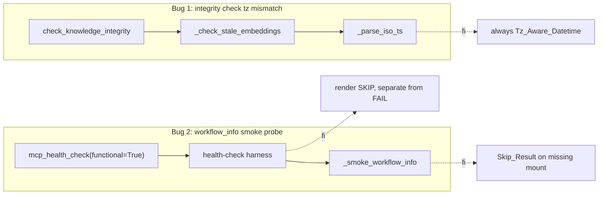

# Design Document — `health-check-bugfixes`

## Overview

Two narrowly-scoped tool-layer bug fixes that ship in one runtime image and one
deploy. Bug 1 is a tz-naive datetime in `_parse_iso_ts` that crashes
`check_knowledge_integrity`. Bug 2 is `_smoke_workflow_info` raising on a
missing EFS mount when it should skip (matching the `github_tools`
no-token path). Total production change: ~10 lines across two files plus
whatever harness wiring the existing `github_tools` SKIP path uses.

The deploy follows the same path as Gaps C/D/E/G: build → ECR push →
`update-agent-runtime`. No infra change, no schema change, no re-ingestion.

## Architecture



Two independent fix paths. They land in the same image, but their tests and
code changes do not interact.

## Components and Interfaces

### Bug 1 — `_parse_iso_ts` UTC fallback (R1, R2)

Current code (`src/tools/semantic_search.py`):

```python
def _parse_iso_ts(raw: Any) -> datetime | None:
    if not isinstance(raw, str):
        return None
    try:
        if raw.endswith("Z"):
            raw = raw[:-1] + "+00:00"
        return datetime.fromisoformat(raw)
    except ValueError:
        return None
```

Fix — three lines added:

```python
def _parse_iso_ts(raw: Any) -> datetime | None:
    if not isinstance(raw, str) or not raw:
        return None
    try:
        if raw.endswith("Z"):
            raw = raw[:-1] + "+00:00"
        dt = datetime.fromisoformat(raw)
    except ValueError:
        return None
    if dt.tzinfo is None:
        dt = dt.replace(tzinfo=timezone.utc)
    return dt
```

Why UTC by convention: every persisted timestamp the codebase emits is UTC
(see `_utc_now_iso` in `graph_rag.py` and the ingester `updated_at = datetime.now(timezone.utc).isoformat()`).
A tz-naive input is therefore safely interpreted as already-UTC. This is the
same convention `git --format=%aI` uses (it always includes the offset, but
external metadata writers sometimes omit it).

`_check_stale_embeddings` defence-in-depth (R2.2): the per-document loop wraps
the subtraction in a tiny guard so a future regression does not abort the whole
check:

```python
for meta in metadatas:
    ...
    mod_time = _parse_iso_ts(timestamp_raw)
    if mod_time is None or mod_time.tzinfo is None:
        continue   # defence: never compare a tz-naive datetime
    ...
    if (now - mod_time).days > STALE_EMBEDDING_DAYS:
        ...
```

Returned `_Check` shape and the rest of the function are unchanged (R2.3).

### Bug 2 — Skip_Result for `_smoke_workflow_info` (R3, R4)

Step 1 — locate the existing SKIP mechanism. The `github_tools` smoke probe
already returns SKIP when `GITHUB_TOKEN` is not set; this design adopts whatever
shape that path uses (`R4.1`) so we have one mechanism, not two. The
implementation task confirms its current shape (sentinel return, exception
subclass, or tuple) before writing the workflow_info change.

Step 2 — apply the same shape to `_smoke_workflow_info`:

```python
async def _smoke_workflow_info(_data, _mcp) -> SmokeResult:
    workflow_root = _resolve_workflow_root()  # existing resolver
    if not workflow_root.exists():
        return SmokeSkip(reason=f"workflow_root={workflow_root} not mounted")
    if not _smoke_workflow_info_check(workflow_root):
        return SmokeSkip(
            reason=(
                f"workflow_root={workflow_root} contains neither jobs/ "
                f"nor dev/jobs/"
            )
        )
    return SmokePass()
```

(`SmokeSkip` / `SmokePass` are placeholders for whatever the harness already
uses; the implementation may name them differently.)

Step 3 — harness rendering (R3.4, R3.5). The functional-validation table
gains a third row state:

```
| Module          | Status      | Latency | Reason                 |
| workflow_info   | [SKIP] skip | 0ms     | workflow_root=... not mounted |
```

And the summary line distinguishes:

```
**Summary**: 9/10 passed, 0 failed, 1 skipped
```

(today's broken output reads `9/10 passed, 1 failed, 0 skipped`).

The persisted `health_history.jsonl` snapshot gains a `skipped` count alongside
`passed` and `failed` so a future trend tool can plot it.

## Data Models

No persistent data change. The in-memory `SmokeResult` enum/union grows from
two states (pass | fail-by-raise) to three (pass | skip | fail-by-raise).
Whether this is implemented as an `Enum`, a `dataclass` hierarchy, or a
sentinel tuple depends on what `github_tools` currently does — the
implementation task adopts that shape.

## Correctness Properties

### Property 1: Iso_Parser tz-aware invariant

For any input value, `_parse_iso_ts(x)` returns either `None` or a datetime
whose `tzinfo` is not `None`.

**Validates: Requirements 1.1, 1.2, 1.3**

### Property 2: Stale_Check never raises on per-document tz mismatch

For any sample of vector-store documents (including a mix of tz-aware and
tz-naive timestamps in metadata), `_check_stale_embeddings` returns a `_Check`
without propagating any TypeError.

**Validates: Requirements 2.1, 2.2, 2.3**

### Property 3: Workflow_info probe never raises on environment

For any value of `MCP_WORKFLOW_ROOT` (existing populated, existing empty,
existing without `jobs/`, missing entirely, unreadable), `_smoke_workflow_info`
returns a `SmokeResult`, never propagates a `RuntimeError`.

**Validates: Requirements 3.1, 3.2, 3.3**

### Property 4: Healthy-path equivalence

When all probe preconditions are met, the functional-validation summary is
byte-equivalent to the pre-fix summary on the same runtime.

**Validates: Requirements 5.1, 5.3**

## Error Handling

| Condition | Behaviour | Requirement |
|-----------|-----------|-------------|
| `_parse_iso_ts` given non-string / empty / unparseable | return `None` | 1.3 |
| `_parse_iso_ts` given tz-naive ISO | return UTC tz-aware | 1.2 |
| `_parse_iso_ts` given tz-aware ISO | return as-is | 1.1 |
| `_check_stale_embeddings` sees a tz-naive `mod_time` despite the parser | skip that document, continue | 2.2 |
| `MCP_WORKFLOW_ROOT` does not exist | SKIP (not raise) | 3.1 |
| `MCP_WORKFLOW_ROOT` exists but no jobs/ or dev/jobs/ | SKIP (not raise) | 3.2 |
| `MCP_WORKFLOW_ROOT` exists with jobs/ or dev/jobs/ | PASS | 3.3 |

## Testing Strategy

### Unit tests (extend existing `test_semantic_search_tools.py` and `test_smoke_queries.py`)

Bug 1:
- `_parse_iso_ts("2026-06-10T22:30:00")` → tz-aware, tzinfo is UTC.
- `_parse_iso_ts("2026-06-10T22:30:00Z")` → tz-aware, tzinfo is UTC.
- `_parse_iso_ts("2026-06-10T22:30:00+05:30")` → tz-aware, offset preserved.
- `_parse_iso_ts(None)` / `("")` / `("not a date")` → `None`.
- `_check_stale_embeddings` with mocked metadata that mixes tz-naive and
  tz-aware timestamps → returns a `_Check`, no TypeError.
- A bug-condition exploration test that fails on the unfixed code (asserts
  `_check_stale_embeddings` does *not* raise on a tz-naive metadata) and
  passes on the fixed code (R6.1, R6.2 — the Bugfix Workflow contract).

Bug 2:
- Empty `tmp_path` workflow_root → `_smoke_workflow_info` returns SKIP, no
  raise.
- `tmp_path / "jobs"` directory → returns PASS.
- `tmp_path / "dev" / "jobs"` directory → returns PASS.
- Non-existent path → returns SKIP, no raise.
- Harness summary with a SKIP row → "9/10 passed, 0 failed, 1 skipped".
- A bug-condition exploration test that fails on the unfixed code (asserts the
  probe does *not* raise on a missing path) and passes on the fixed code
  (R6.3, R6.4).

No property-based tests required — both bugs have small, finite input domains
fully covered by parametrised unit tests.

## Open Questions

None. The two fixes are mechanical and the SKIP shape is determined by
adopting whatever `github_tools` already does.
