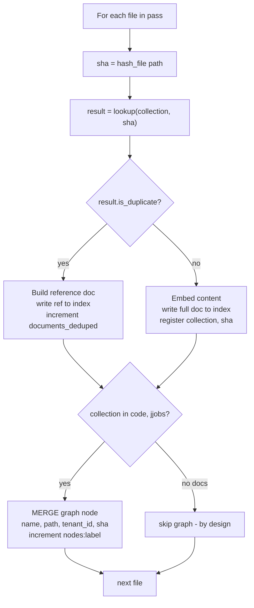

# Ingest Dedupe and Graph Fix — Bugfix Design

## Overview

An overnight full-branch ingestion of the `gw_v17` tenant exited 0 on every script
but produced structurally broken data: the code and J-Jobs collections held only
reference documents (no embedded content) and the Neptune graph was empty for the
entire tenant. Two defects in the v8 tenant ingestion pipeline combined to cause this.

- **Defect 1 — collection-blind dedupe collision.** The shared registry
  (`mdc-content-sha-registry`, managed by `SHAIndex`) is keyed by content SHA *alone*
  (`lookup` queries `{"term": {"sha": sha}}`, `register` writes `id=sha`). Because the
  documentation pass runs first and registers every file, the later code and jjobs
  passes find every SHA already present and mark 100% of files as duplicates — writing
  references instead of embedding real content. Dedupe was meant to be *cross-tenant
  within a collection*, never *across collections within one tenant*.

- **Defect 2 — graph nodes never created.** In `ingest_code_v8.py` and
  `ingest_jjobs_v8.py`, the Neptune `MERGE` is nested inside the dedupe `else`
  (non-duplicate) branch. At 100% dedupe the `else` never ran, so zero graph nodes
  were created. Graph modeling represents a file's *existence*, which is independent of
  whether its *content* is reused for embedding.

The fix is two targeted, separable changes plus a remediation prerequisite:

1. **Re-key the registry by `(collection, sha)`** so a SHA registered under one
   collection cannot mask the same SHA in a different collection (fixes Defect 1, C(X)).
2. **Decouple the graph `MERGE` from the dedupe decision** so it runs unconditionally
   for every file in the code and jjobs passes (fixes Defect 2).
3. **Wipe the bad `gw_v17` data** (3 prefixed OpenSearch indices, `GW_V17_*` Neptune
   labels, and the stale `gw_v17` registry entries) before re-ingesting.

This bug is in the implementation of the `omd-tenants-2-v17-pilot` design §2.4
(content-addressed dedupe) and §2.5 (graph writes). Those sections should be updated
post-fix to reflect the `(collection, sha)` key and the unconditional graph write; this
bugfix spec is the immediate vehicle.

## Glossary

- **Bug_Condition (C)**: A file whose content SHA was already registered in
  `mdc-content-sha-registry` by a *prior collection's* pass of the *same tenant*, which
  the current code wrongly treats as a duplicate.
- **Property (P)**: The desired behavior — a SHA seen only under a *different*
  collection is NOT a duplicate, so the file is embedded as real content; and (for
  code/jjobs) its graph node is always created.
- **Preservation**: The legitimate cross-tenant-within-collection embedding
  optimization, the `gw` baseline, the documentation no-graph behavior, and the
  reference-document shape — all must remain unchanged.
- **Collection (`c`)**: One of `documentation`, `code`, `jjobs` — the logical content
  family a pass ingests. Each maps to a per-tenant index suffix
  (`mdc-workflow-docs-titan1024`, `mdc-code-titan1024`, `mdc-jjobs-titan1024`).
- **`SHAIndex`**: The class in `mcp_server_python/scripts/_ingest_dedupe.py` that owns
  registry lookup/register against the shared unprefixed `mdc-content-sha-registry`.
- **`F` / `F'`**: The original (unfixed) pipeline / the fixed pipeline.
- **Reference document**: A no-embedding placeholder row
  (`is_reference: True`, `embedding: None`, `content: "<reference: see canonical doc>"`,
  `canonical_index`/`canonical_id`/`canonical_tenant`) written when a genuine duplicate
  is detected.

## Bug Details

### Bug Condition

The bug manifests when the code or jjobs pass walks a file whose content SHA `s` was
already registered in `mdc-content-sha-registry` by a *different collection* (typically
the documentation pass, which runs first) of the *same tenant*. Because the registry is
keyed by `sha` alone, `SHAIndex.lookup` returns `is_duplicate=True`, the pass writes a
reference document with no embedding, and — because the graph `MERGE` lives in the same
`else` branch that real embedding would take — no graph node is created.

**Formal Specification:**
```
FUNCTION isBugCondition(X)
  INPUT:  X = (tenant T, collection c, file f with content sha s)
  OUTPUT: boolean

  existing ← registry.lookupBySha(s)          // current: keyed by sha alone
  RETURN existing.exists
         AND existing.collection ≠ c           // registered by a DIFFERENT collection
         AND existing.tenant = T                // within the SAME tenant
END FUNCTION
```

Under `F`, `isBugCondition(X)` causes `f` to be written as a reference document with no
embedding AND (for `c ∈ {code, jjobs}`) skips the graph `MERGE`, because the dedupe
result and the graph write share the single `if result.is_duplicate / else` branch.

### Examples

- **Code masked by docs.** Documentation pass registers `forecast.py` (sha `9f8e…`),
  then the code pass walks the same `forecast.py`. Expected: embedded into
  `gw_v17_mdc-code-titan1024` + a `GW_V17_File` graph node. Actual (`F`): reference doc,
  `embedding: None`, no graph node. (clauses 1.1, 1.3)
- **J-Job masked by docs.** Documentation registers `JGDAS_ATMOS_ANALYSIS_WDQMS`
  (sha `a1b2…`), then the jjobs pass walks it. Expected: embedded into
  `gw_v17_mdc-jjobs-titan1024` + a `GW_V17_JJob` node. Actual (`F`): reference doc, no
  node — so the branch-isolation probe Assertion 1 fails. (clauses 1.2, 1.3, 1.6)
- **Whole-tenant collapse.** Full `gw_v17` run → code/jjobs dedupe efficiency 100% →
  report shows `nodes_created_by_label: {}` and `relationships_created: 0`;
  `gw_v17_mdc-code-titan1024` holds 26,316 docs, all references. (clauses 1.4, 1.5)
- **Edge — intra-collection same content (NOT the bug).** Two byte-identical files at
  different paths within the code pass: the second is a legitimate duplicate within the
  same collection → one embedding + one reference. This is correct and must be
  preserved.

## Expected Behavior

### Preservation Requirements

**Unchanged Behaviors:**
- **Cross-tenant-within-collection dedupe** continues to work: a file byte-identical
  between `gw` and `gw_v17` *within the same collection* is still deduped to a reference
  document, skipping re-embedding (clause 3.1).
- **Documentation creates no graph nodes** — only code and jjobs model the graph
  (clause 3.2).
- **`gw` baseline** — search, dependencies, callers/callees, traces all return the same
  results as before (clause 3.3).
- **Reference-document shape** is unchanged: `is_reference: True`, `canonical_index`,
  `canonical_id`, `canonical_tenant`, `embedding: None`,
  `content: "<reference: see canonical doc>"` (clause 3.4).
- **Reference resolution at query time** still follows
  `metadata.canonical_index` / `canonical_id` to the canonical document (clause 3.5).
- **Registry index lifecycle** — `mdc-content-sha-registry` stays a system-level,
  unprefixed index; rollback clears only a tenant's own entries, never the index
  (clause 3.6).

**Scope:**
All inputs where `NOT isBugCondition(X)` must be completely unaffected by this fix. This
includes: never-seen SHAs (still embedded), same-`(collection, sha)`-seen-before-in-any-
tenant (still deduped), documentation-collection graph behavior (still none), and all
`gw` queries.

**Note:** The actual expected *correct* behavior for buggy inputs is defined in the
Correctness Properties section (Property 1). This section focuses on what must NOT
change.

### Cross-Tenant Dedupe Semantics (decision resolved)

The registry stores the *first* ingester's `tenant_id`. A lookup hit on
`(collection, sha)` means "some tenant has already embedded this exact content in this
collection" — the canonical document may belong to a *different* tenant. The new tenant
then writes a reference doc pointing at that canonical. This is the legitimate behavior
(clause 3.1). Therefore:

- **Dedupe is keyed by `(collection, sha)`**, and lookup matches that key *regardless of
  tenant* — the canonical can belong to any tenant.
- **Same-tenant, same-collection re-runs are idempotent** because `register` is an
  upsert keyed by `id = f"{collection}:{sha}"` — re-registering overwrites the same doc.
- **Intra-collection same-content within a single tenant's single pass is legitimate
  dedupe**: two byte-identical files in one collection → one embedding + one reference.
  This is correct and preserved.

**v17 pilot nuance.** `gw` was NOT ingested through this v8 pipeline (it uses legacy
unprefixed indices), so for the v17 re-run there is nothing to dedupe against
cross-tenant → expected cross-tenant dedupe efficiency ≈ 0%. The ~13.8% the
documentation run showed was *intra-collection* dedupe (identical content at multiple
paths inside the v17 tree) — that is correct and is preserved by this fix.

## Hypothesized Root Cause

The dedupe design conflated two separable concerns: (a) *embedding dedupe* — a cost
optimization that skips re-embedding identical content across tenants within the same
collection; and (b) *existence / graph modeling* — which must always occur so every
file has its graph node and its per-collection OpenSearch presence. Two code-level
faults follow:

1. **Registry key too coarse.** `SHAIndex.lookup` queries `{"term": {"sha": sha}}` and
   `SHAIndex.register` writes `id=sha`. The collection is invisible to the registry, so
   the first collection to register a SHA masks it for all later collections of the same
   tenant. Must be keyed by `(collection, sha)`.

2. **Graph write gated on the dedupe `else` branch.** In `ingest_code_v8.py` and
   `ingest_jjobs_v8.py` the `MERGE` and its `report.increment(f"nodes:{label}")` sit
   inside `else:` (the non-duplicate path). Any dedupe hit — legitimate or not — skips
   graph modeling. Must be unconditional.

3. **Stale shared-registry entries block clean remediation.** The bad run left
   `gw_v17` rows in `mdc-content-sha-registry` keyed by bare `sha`. Re-ingestion would
   still collide against them until they are cleared. The rollback path must be able to
   clear a tenant's own registry entries without deleting the shared index.

4. **(Ruled in by examples, ruled out as separate fault) DOM/timing or selector
   issues** do not apply — this is a backend ingestion pipeline, not a UI handler. The
   two faults above fully explain every observed symptom (1.1–1.6).

## Correctness Properties

Property 1: Bug Condition — Collection-scoped dedupe + unconditional graph write

_For any_ input `X` where the bug condition holds (`isBugCondition(X)` returns true — a
SHA registered only by a *different* collection of the same tenant), the fixed pipeline
`F'` SHALL embed the file as real content (`is_reference = False`, an embedding call is
made) into the collection's index, AND _for any_ such `X` with `c ∈ {code, jjobs}` SHALL
create (MERGE) the file's graph node.

**Validates: Requirements 2.1, 2.2, 2.3, 2.5, 2.6**

Property 2: Preservation — Non-buggy inputs behave identically

_For any_ input `X` where the bug condition does NOT hold (`isBugCondition(X)` returns
false), the fixed pipeline `F'` SHALL produce the same result as the original pipeline
`F`, preserving: (a) cross-tenant-within-collection dedupe to a reference document with
the existing shape; (b) embedding of never-before-seen `(collection, sha)`; (c) the
documentation pass creating no graph nodes; and (d) all `gw` baseline query results.

**Validates: Requirements 3.1, 3.2, 3.3, 3.4, 3.5**

Property 3: Unconditional graph modeling for code/jjobs

_For any_ file ingested by `ingest_code_v8.py` or `ingest_jjobs_v8.py`, regardless of
whether the OpenSearch doc was embedded or written as a reference, `F'` SHALL MERGE the
file's graph node and increment `nodes:{label}`, so a full-tenant report's
`nodes_created_by_label` is non-empty.

**Validates: Requirements 2.3, 2.4, 2.7, 2.8**

## Fix Implementation

### Corrected per-file ingestion flow



The key structural change: **deciding the OpenSearch doc shape (embed vs reference) and
modeling the graph become two sequential, independent steps.** Graph `MERGE` moves below
the `if/else` and runs for every code/jjobs file.

### Change 1 — `SHAIndex` keyed by `(collection, sha)`

**File**: `mcp_server_python/scripts/_ingest_dedupe.py`

1. **`lookup` gains a `collection` parameter** and queries by the composite id (or a
   bool query on `collection` AND `sha`):
   ```python
   async def lookup(self, sha: str, *, collection: str) -> DedupeResult:
       if self._client is None:
           return DedupeResult(is_duplicate=False, canonical_index=None, canonical_id=None)
       import asyncio
       body = {
           "query": {"bool": {"filter": [
               {"term": {"collection": collection}},
               {"term": {"sha": sha}},
           ]}},
           "size": 1,
       }
       resp = await asyncio.to_thread(self._client.search, index=self.REGISTRY_INDEX, body=body)
       hits = resp.get("hits", {}).get("hits", [])
       if not hits:
           return DedupeResult(is_duplicate=False, canonical_index=None, canonical_id=None)
       src = hits[0]["_source"]
       return DedupeResult(True, src["index"], src["doc_id"])
   ```

2. **`register` gains a `collection` parameter**, adds `collection` to the doc body, and
   writes the composite id:
   ```python
   async def register(self, sha: str, *, collection: str, tenant, index: str, doc_id: str) -> None:
       if self._client is None:
           return
       import asyncio
       from datetime import datetime, timezone
       doc = {
           "sha": sha,
           "collection": collection,
           "tenant_id": tenant.tenant_id,
           "index": index,
           "doc_id": doc_id,
           "first_seen_at": datetime.now(timezone.utc).isoformat(),
       }
       await asyncio.to_thread(
           self._client.index, index=self.REGISTRY_INDEX,
           id=f"{collection}:{sha}", body=doc,
       )
   ```

   The composite id `f"{collection}:{sha}"` (e.g. `"code:9f8e…"`) makes register an
   upsert per `(collection, sha)` → same-tenant, same-collection re-runs are idempotent.
   Lookup matches on `(collection, sha)` regardless of tenant, so the canonical may
   belong to any tenant (cross-tenant optimization preserved).

3. **Collection identifiers** — define a single canonical token per collection
   (`"documentation"`, `"code"`, `"jjobs"`) and pass it from each entry script. (A small
   module-level constant or per-script literal; the design does not require a shared
   enum, but the token MUST be stable across runs or dedupe silently regresses.)

### Change 2 — unconditional graph write in code/jjobs passes

**Files**: `mcp_server_python/scripts/ingest_code_v8.py`,
`mcp_server_python/scripts/ingest_jjobs_v8.py`

1. Pass `collection="code"` / `collection="jjobs"` into `lookup` and `register`.
2. **Move the `MERGE` cypher and `report.increment(f"nodes:{label}")` out of the `else`
   branch** to run unconditionally after the `if result.is_duplicate / else` block:
   ```python
   result = await sha_index.lookup(sha, collection=COLLECTION)
   if result.is_duplicate:
       ref = make_reference_document(...)
       report.increment("documents_deduped")
       await asyncio.to_thread(raw_os_client.index, index=index_name, id=f"ref_{sha[:12]}", body=ref)
   else:
       truncated = content[:8000]
       embedding = await uda.vector_db._generate_embedding(truncated)
       doc_id = f"{PREFIX}_{sha[:12]}"
       await asyncio.to_thread(raw_os_client.index, index=index_name, id=doc_id, body=doc_body)
       report.increment("bedrock_invocations")
       report.increment("estimated_tokens", len(truncated) // 4)
       report.increment(f"docs:{index_name}")
       await sha_index.register(sha, collection=COLLECTION, tenant=tenant, index=index_name, doc_id=doc_id)

   # ALWAYS model the graph — independent of the embedding/dedupe decision
   cypher = (f"MERGE (n:`{label}` {{name: $name, path: $path}}) "
             f"SET n.tenant_id = $tenant_id, n.sha256 = $sha")
   await uda.graph_db.query(cypher, params={
       "name": path.stem, "path": str(path),
       "tenant_id": tenant.tenant_id, "sha": sha,
   })
   report.increment(f"nodes:{label}")
   ```
   The graph node carries `name`, `path`, `tenant_id`, `sha` — all available regardless
   of the dedupe branch. `MERGE` keeps this idempotent across re-runs.

### Change 3 — documentation pass keyed but still graph-free

**File**: `mcp_server_python/scripts/ingest_documentation_v8.py`

1. Pass `collection="documentation"` into `lookup` and `register`. No graph write is
   added — the documentation pass MUST continue to create no graph nodes (clause 3.2).

### Change 4 — rollback clears a tenant's registry entries

**File**: `mcp_server_python/scripts/delete_tenant_indices.py`

1. Add a `--clear-registry-entries` flag. When set, after deleting the tenant's
   prefixed indices and `label_prefix` graph nodes, issue a delete-by-query against
   `mdc-content-sha-registry` for docs where `tenant_id == <tenant>`:
   ```python
   if clear_registry_entries and not dry_run:
       await vector_db.delete_by_query(
           index="mdc-content-sha-registry",
           body={"query": {"term": {"tenant_id": tenant_id}}},
       )
   ```
2. The registry **index itself is never deleted** — only the tenant's own entries
   (clause 3.6). The `gw` baseline registers under `tenant_id == "gw"`; a
   `--tenant gw_v17 --clear-registry-entries` run must not touch those rows. (The R7.3
   empty-prefix guard already refuses `gw`.)
3. Surface the planned registry deletion in the dry-run plan output so an operator can
   review it before mutating.

### Stale-data cleanup → re-ingest runbook

Re-ingestion is blocked until the bad data is removed. Run, in order:

1. **Dry-run the rollback** to review the plan:
   ```bash
   python3.12 mcp_server_python/scripts/delete_tenant_indices.py \
       --tenant gw_v17 --clear-registry-entries --dry-run
   ```
2. **Execute rollback** — deletes the 3 `gw_v17_*` OpenSearch indices, the `GW_V17_*`
   Neptune labels, and the stale `gw_v17` rows in `mdc-content-sha-registry`:
   ```bash
   python3.12 mcp_server_python/scripts/delete_tenant_indices.py \
       --tenant gw_v17 --clear-registry-entries
   ```
3. **Re-ingest in collection order** (documentation → code → jjobs), now collection-
   scoped:
   ```bash
   python3.12 mcp_server_python/scripts/ingest_documentation_v8.py --tenant gw_v17
   python3.12 mcp_server_python/scripts/ingest_code_v8.py          --tenant gw_v17
   python3.12 mcp_server_python/scripts/ingest_jjobs_v8.py         --tenant gw_v17
   ```
4. **Verify**: code/jjobs reports show non-empty `nodes_created_by_label`; cross-tenant
   dedupe ≈ 0% (gw is not in this pipeline), intra-collection dedupe small and
   legitimate; `find_dependencies`/`find_callers_callees`/`trace_execution_path` return
   populated results; branch-isolation Assertion 1 (WDQMS J-Job visible under `gw_v17`)
   passes.

## Testing Strategy

### Validation Approach

Two-phase approach: first surface a counterexample that demonstrates the bug on the
UNFIXED code (the exploration test), then verify the fix works for buggy inputs (Fix
Checking) and preserves behavior for non-buggy inputs (Preservation Checking).

### Exploratory Bug Condition Checking

**Goal**: Surface a counterexample that demonstrates `C(X)` BEFORE the fix lands.
Confirm the root cause (collection-blind key + graph in `else` branch). If the
exploration test unexpectedly passes on unfixed code, the root-cause hypothesis is wrong
and must be re-derived.

**Test Plan**: With an in-memory stub registry (and stub graph), register a file's SHA
under `collection="documentation"`, then run the code-pass dedupe-and-graph logic over
the *same* SHA under `collection="code"`. Assert real-content embedding and graph-node
creation. Run against the UNFIXED `SHAIndex` (sha-only key, graph in `else`) — it MUST
fail.

**Test Cases**:
1. **Docs-then-code masking** (will fail on unfixed code): SHA registered under
   `documentation`, walked under `code` → expect `is_reference == False` + graph node;
   unfixed yields `is_reference == True` + no node.
2. **Docs-then-jjobs masking** (will fail on unfixed code): same for the jjobs pass.
3. **100% dedupe collapse** (will fail on unfixed code): a small tree registered by
   docs then re-walked by code → expect `nodes_created_by_label` non-empty; unfixed
   yields `{}`.

**Expected Counterexamples**:
- Files registered by the documentation pass come back `is_duplicate=True` under the
  code/jjobs pass; reference docs written with `embedding: None`; zero graph nodes.
- Cause confirmed: registry keyed by `sha` alone; graph `MERGE` gated on the dedupe
  `else` branch.

### Fix Checking

**Goal**: For all inputs where the bug condition holds, the fixed pipeline embeds real
content and (for code/jjobs) creates a graph node.

**Pseudocode:**
```
FOR ALL X WHERE isBugCondition(X) DO
  result := F'(X)
  ASSERT result.is_reference = FALSE
  ASSERT result.embedded_real_content = TRUE
  ASSERT (X.collection IN {code, jjobs}) IMPLIES result.graph_node_created = TRUE
END FOR
```

### Preservation Checking

**Goal**: For all inputs where the bug condition does NOT hold, the fixed pipeline
produces the same result as the original.

**Pseudocode:**
```
FOR ALL X WHERE NOT isBugCondition(X) DO
  ASSERT F(X) = F'(X)
END FOR
```

**Testing Approach**: Property-based testing is recommended for preservation because it
generates many `(tenant, collection, sha)` combinations automatically across the input
domain, catches edge cases manual tests miss, and gives strong guarantees that behavior
is unchanged for all non-buggy inputs.

**Test Plan**: Extend the P5 dedupe property test in
`tests/properties/test_v17_pilot.py` with a **collection dimension**. The stub registry
key becomes `(collection, sha)` and `lookup`/`register` take a `collection` argument.
Observe behavior on the fixed code for the preserved cases below.

**Test Cases**:
1. **Cross-tenant-within-collection dedupe preserved**: register `(code, sha)` under
   tenant A, then ingest the same `(code, sha)` under tenant B → still a reference doc
   with the existing shape (clauses 3.1, 3.4).
2. **Never-seen `(collection, sha)` embedded**: a `(collection, sha)` absent from the
   registry → embedded as real content (clause 2.1/2.2 baseline).
3. **Documentation graph-free preserved**: documentation pass over any file → no graph
   node created (clause 3.2).
4. **Different collections, same SHA, same tenant → both embedded**: the formerly-buggy
   case is now the embed path; confirms one embedding per collection (clause 2.6).
5. **Reference shape unchanged**: `is_reference: True`, `canonical_index`,
   `canonical_id`, `canonical_tenant`, `embedding: None`,
   `content: "<reference: see canonical doc>"` (clause 3.4).

### Unit Tests

- `SHAIndex.lookup`/`register` round-trip on `(collection, sha)`: a SHA registered under
  one collection is NOT found under another; is found under the same collection.
- Composite id format is exactly `f"{collection}:{sha}"`; registry doc body carries the
  `collection` field.
- Code/jjobs passes increment `nodes:{label}` on both the duplicate and non-duplicate
  branches; documentation pass never writes a graph node.
- `delete_tenant_indices` with `--clear-registry-entries` issues a delete-by-query
  scoped to `tenant_id`; without the flag the registry is untouched; the registry index
  is never deleted; `gw` empty-prefix guard still refuses.

### Property-Based Tests

- P5 extended with the collection dimension (Preservation Checking, cases 1–5 above).
- New unconditional-graph-write property (Property 3): for a generated mix of duplicate
  and non-duplicate code/jjobs files, every file yields exactly one graph node and
  `nodes_created_by_label` is non-empty whenever ≥1 file is processed.
- New bug-condition exploration property that FAILS on unfixed code (Exploratory section
  above) and passes on fixed code (Fix Checking).

### Integration Tests

- Full `gw_v17` cleanup → re-ingest sequence (documentation → code → jjobs) against a
  test backend: assert non-empty `nodes_created_by_label` for code and jjobs, cross-
  tenant dedupe ≈ 0%, and reference docs only for genuine intra/cross duplicates.
- Branch-isolation smoke probe Assertion 1 (WDQMS J-Job visible under `gw_v17`) passes
  after re-ingestion (clause 2.8).
- `find_dependencies`, `find_callers_callees`, `trace_execution_path` return populated
  results for `gw_v17` symbols (clause 2.7); `gw` baseline queries unchanged (clause 3.3).
