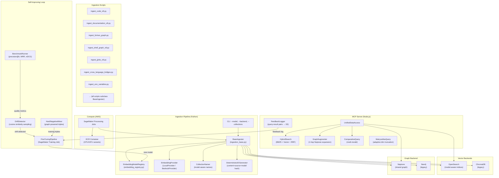
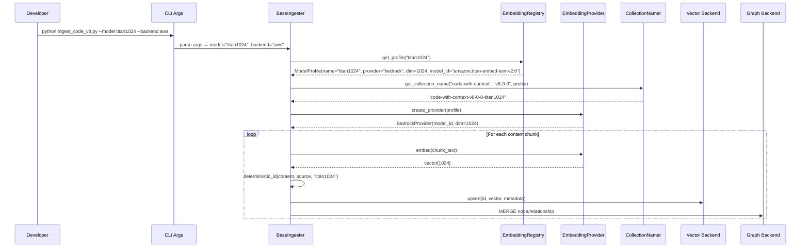

# Design Document: Ingestion Pipeline Restructure

## Overview

This design restructures the GraphRAG MCP server's ingestion pipeline from a collection of 14+ independent Python scripts with hardcoded embedding models and duplicated backend-routing boilerplate into a modular, multi-model, idempotent pipeline. The restructure enables comparative analysis across disparate vector spaces (e.g., MPNet 768-dim vs. Titan 1024-dim vs. Nova 3072-dim), centralizes backend routing in `ingestion_base.py`, introduces SageMaker-based compute offloading, and adds advanced retrieval capabilities (hybrid BM25+vector fusion, graph-augmented search, Matryoshka adaptive dimensions). A self-improving feedback loop — drift detection, domain-adaptive fine-tuning, and graph-powered hard negative mining — closes the quality gap over time.

The system preserves backward compatibility with the existing ~86K documents across 6 collections, 51 MCP tools, and the Phase 48 AWS adapter layer (OpenSearch, Neptune, ECS Fargate).

### Key Design Decisions

1. **Registry-driven model selection** over per-script configuration — a single `embedding_registry.py` module defines all model profiles, eliminating the need to touch individual scripts when adding models.
2. **Deterministic IDs via content+source+model hashing** — enables idempotent upsert/MERGE across both vector and graph backends without external state tracking.
3. **Model-aware naming convention** (`{domain}-{version}-{model-short}`) — allows multiple vector spaces for the same content domain to coexist, enabling A/B retrieval comparisons.
4. **SageMaker Processing Jobs** for compute offloading — keeps the development EC2 free while running GPU-accelerated embedding generation or fine-tuning.
5. **Hybrid search via OpenSearch search pipelines** — leverages OpenSearch's native `search_pipeline` with `normalization-processor` and RRF for BM25+vector fusion, avoiding application-level score merging.
6. **Graph-augmented retrieval as a composable layer** — 1-hop Neptune expansion is applied post-vector-search, keeping the vector search path unchanged for backward compatibility.

## Architecture

### High-Level System Diagram



### Data Flow: Ingestion Workflow



## Components and Interfaces

### 1. Embedding Model Registry (`embedding_registry.py`)

Central configuration for all embedding model profiles. Lives at `mcp_server_node/scripts/embedding_registry.py`.

```python
@dataclass(frozen=True)
class ModelProfile:
    short_name: str          # e.g., "mpnet768", "titan1024", "nova3072"
    provider: str            # "local" | "bedrock"
    model_id: str            # e.g., "all-mpnet-base-v2", "amazon.titan-embed-text-v2:0"
    dimensions: int          # 768, 1024, 256, 512, 3072
    supports_matryoshka: bool = False
    supports_multimodal: bool = False
    provider_params: dict = field(default_factory=dict)
    # provider_params examples:
    #   bedrock: {"outputEmbeddingLength": 1024}
    #   local: {"device": "cpu", "cache_folder": "$CACHE_ROOT/huggingface"}

class EmbeddingModelRegistry:
    """Singleton registry of available embedding model profiles."""
    
    _profiles: Dict[str, ModelProfile]  # keyed by short_name
    _default: str = "mpnet768"
    
    def get_profile(self, short_name: str) -> ModelProfile: ...
    def get_default(self) -> ModelProfile: ...
    def list_profiles(self) -> List[str]: ...
    def register(self, profile: ModelProfile) -> None: ...
```

**Built-in profiles:**

| Short Name | Provider | Model ID | Dimensions | Matryoshka | Multimodal |
|-----------|----------|----------|-----------|------------|------------|
| `mpnet768` | local | `all-mpnet-base-v2` | 768 | No | No |
| `titan1024` | bedrock | `amazon.titan-embed-text-v2:0` | 1024 | No | No |
| `nova256` | bedrock | `amazon.nova-multimodal-embed-v1` | 256 | Yes | Yes |
| `nova512` | bedrock | `amazon.nova-multimodal-embed-v1` | 512 | Yes | Yes |
| `nova1024` | bedrock | `amazon.nova-multimodal-embed-v1` | 1024 | Yes | Yes |
| `nova3072` | bedrock | `amazon.nova-multimodal-embed-v1` | 3072 | Yes | Yes |

Custom fine-tuned models are registered dynamically by the fine-tuning pipeline.

### 2. Embedding Provider Abstraction (`embedding_provider.py`)

```python
class EmbeddingProvider(ABC):
    """Abstract interface for embedding generation."""
    
    @abstractmethod
    def embed(self, texts: List[str]) -> List[List[float]]: ...
    
    @abstractmethod
    def embed_image(self, image_bytes: bytes) -> List[float]: ...
    
    @property
    @abstractmethod
    def dimensions(self) -> int: ...

class LocalProvider(EmbeddingProvider):
    """sentence-transformers on CPU/GPU."""
    def __init__(self, profile: ModelProfile): ...
    # Uses SentenceTransformer(profile.model_id, device=auto_detect)
    # Downloads to $CACHE_ROOT/huggingface if not cached

class BedrockProvider(EmbeddingProvider):
    """AWS Bedrock API via boto3."""
    def __init__(self, profile: ModelProfile): ...
    # Uses boto3.Session().client("bedrock-runtime", region_name=AWS_REGION)
    # Passes outputEmbeddingLength for Nova models
    # Raises EmbeddingError with model_id and input length on API failure
```

### 3. Centralized Backend Router (refactored `ingestion_base.py`)

The existing `ChromaDBClient.connect()` inline `--backend` parsing and `aws_backend.py` client factory are consolidated into `BaseIngester.get_clients()`.

```python
class BaseIngester:
    """Base class for all ingestion scripts."""
    
    def __init__(self):
        self.args = self._parse_common_args()  # --model, --backend, --collections, --dry-run
        self.registry = EmbeddingModelRegistry()
        self.profile = self.registry.get_profile(self.args.model)
        self.provider = create_provider(self.profile)
        self.namer = CollectionNamer(self.profile)
        self.vector_client, self.graph_driver = self.get_clients()
    
    def _parse_common_args(self) -> argparse.Namespace:
        """Parse --model, --backend, --collections, --dry-run centrally."""
        parser = argparse.ArgumentParser()
        parser.add_argument("--model", default="mpnet768")
        parser.add_argument("--backend", default=os.environ.get("DB_BACKEND", "legacy"))
        parser.add_argument("--collections", help="Comma-separated content domains to ingest")
        parser.add_argument("--dry-run", action="store_true")
        return parser.parse_known_args()[0]
    
    def get_clients(self) -> Tuple[VectorClient, GraphDriver]:
        """Centralized backend routing — replaces inline boilerplate."""
        if self.args.backend == "aws":
            from aws_backend import get_vector_client, get_graph_driver
            return get_vector_client(), get_graph_driver()
        else:
            return self._legacy_vector_client(), self._legacy_graph_driver()
    
    def deterministic_id(self, content: str, source: str, chunk_index: int = 0) -> str:
        """Hash of content + source + chunk_index + model short name."""
        payload = f"{content}|{source}|{chunk_index}|{self.profile.short_name}"
        return hashlib.sha256(payload.encode()).hexdigest()[:32]
    
    def upsert_document(self, collection_name: str, doc_id: str, 
                        content: str, embedding: List[float], metadata: dict): ...
    
    def merge_graph_node(self, label: str, properties: dict): ...
    
    def merge_graph_relationship(self, from_label: str, from_key: dict,
                                  to_label: str, to_key: dict,
                                  rel_type: str, properties: dict = None): ...
    
    @abstractmethod
    def extract_content(self) -> Iterator[ContentChunk]:
        """Subclasses implement content extraction logic."""
        ...
    
    def run(self):
        """Main entry point — extract, embed, store."""
        for chunk in self.extract_content():
            embedding = self.provider.embed([chunk.text])[0]
            doc_id = self.deterministic_id(chunk.text, chunk.source, chunk.index)
            col_name = self.namer.get_name(chunk.domain, chunk.version)
            self.upsert_document(col_name, doc_id, chunk.text, embedding, chunk.metadata)
```

### 4. Collection Namer (`collection_namer.py`)

```python
class CollectionNamer:
    """Generates model-aware collection/index names."""
    
    def __init__(self, profile: ModelProfile):
        self.profile = profile
    
    def get_name(self, domain: str, version: str) -> str:
        """e.g., get_name("code-with-context", "v8-0-0") → "code-with-context-v8-0-0-mpnet768" """
        return f"{domain}-{version}-{self.profile.short_name}"
    
    def is_legacy_name(self, name: str) -> bool:
        """Check if name lacks model suffix (legacy format)."""
        return not any(name.endswith(f"-{p}") for p in EmbeddingModelRegistry().list_profiles())
    
    def get_legacy_name(self, domain: str, version: str) -> str:
        """Return legacy name without model suffix for backward compat."""
        return f"{domain}-{version}"
```

### 5. Model-Aware OpenSearch Index Management

Updates to `create-opensearch-indices.js`:

```javascript
// New: accepts --model flag, reads from registry
// create-opensearch-indices.js --model titan1024
// create-opensearch-indices.js --model all

function indexBody(dimensions) {
  return {
    settings: { index: { knn: true, 'knn.algo_param.ef_search': 512 } },
    mappings: {
      properties: {
        embedding: {
          type: 'knn_vector',
          dimension: dimensions,  // dynamic per model
          method: { name: 'hnsw', engine: 'nmslib', space_type: 'cosinesimil' }
        },
        content: { type: 'text' },  // BM25 searchable
        metadata: { type: 'object', dynamic: true },
        source_file: { type: 'keyword' },
        chunk_id: { type: 'keyword' },
        collection_name: { type: 'keyword' },
        model_profile: { type: 'keyword' },  // NEW: tracks which model generated embeddings
      }
    }
  };
}
```

### 6. Model-Aware Migration (`migrate-to-aws.js` updates)

The migration script reads model metadata from ChromaDB collection metadata, includes model short name in S3 export keys, and targets model-aware OpenSearch indices. Legacy `COLLECTION_TO_INDEX` mapping is preserved for backward compatibility.

### 7. SageMaker Job Launcher (`sagemaker_launcher.py`)

```python
class SageMakerJobLauncher:
    """Submits ingestion scripts as SageMaker Processing Jobs."""
    
    def submit(self, script: str, instance_type: str = "ml.m5.large",
               model: str = "mpnet768", backend: str = "aws",
               collections: str = None, dry_run: bool = False) -> str:
        """
        Submit a SageMaker Processing Job.
        Returns job name for tracking.
        """
        ...
    
    def estimate_cost(self, instance_type: str, estimated_minutes: int) -> dict:
        """Estimate job cost without submitting (--dry-run)."""
        ...
    
    def get_job_status(self, job_name: str) -> dict:
        """Poll job status, return counts and errors."""
        ...
```

### 8. Hybrid Search (Node.js — OpenSearch search pipeline)

```javascript
// HybridSearchBuilder — constructs OpenSearch hybrid queries
class HybridSearchBuilder {
  /**
   * Build a hybrid BM25 + k-NN query with RRF fusion.
   * @param {string} queryText - User query
   * @param {Array<number>} queryVector - Embedding vector
   * @param {object} options
   * @param {string} options.searchMode - "vector" | "keyword" | "hybrid"
   * @param {number} options.bm25Weight - BM25 boost (auto-increased for code identifiers)
   * @returns {object} OpenSearch query body
   */
  build(queryText, queryVector, options = {}) { ... }
  
  /**
   * Detect code identifiers in query text (camelCase, snake_case, dot.notation, file/paths).
   * @returns {boolean}
   */
  _containsCodeIdentifiers(queryText) { ... }
}
```

### 9. Graph-Augmented Retrieval (Node.js)

```javascript
class GraphAugmenter {
  /**
   * Expand vector search results with 1-hop graph neighbors.
   * @param {Array} vectorResults - Results from vector search
   * @param {GraphDatabaseAdapter} graphDB - Neptune/Neo4j adapter
   * @param {object} options
   * @param {number} options.hopDepth - 1 or 2 (default: 1)
   * @returns {Promise<Array>} Results with graph_context field
   */
  async augment(vectorResults, graphDB, options = {}) { ... }
}
```

### 10. Drift Detection (`drift_detector.py`)

```python
class DriftDetector:
    """Samples documents, re-embeds, computes cosine similarity to detect drift."""
    
    def __init__(self, registry: EmbeddingModelRegistry, sample_size: int = 100,
                 threshold: float = 0.95):
        ...
    
    def detect(self, collection_name: str) -> DriftReport:
        """Sample N docs, re-embed, compare. Returns DriftReport."""
        ...
    
    def check_stale_documents(self, collection_name: str) -> List[StaleDoc]:
        """Find docs whose source files have been modified/deleted."""
        ...
```

### 11. Fine-Tuning Pipeline (`fine_tuning_pipeline.py`)

```python
class FineTuningPipeline:
    """Domain-adaptive fine-tuning using Sentence Transformers v3+ Trainer."""
    
    def generate_training_pairs(self, collection_name: str) -> TrainingDataset:
        """Auto-generate positive pairs (same-section) and hard negatives."""
        ...
    
    def train(self, base_model: str, training_data: TrainingDataset,
              output_s3_path: str, instance_type: str = "ml.g5.xlarge") -> str:
        """Submit SageMaker Training Job. Returns model artifact S3 path."""
        ...
    
    def register_model(self, model_s3_path: str, short_name: str) -> ModelProfile:
        """Register fine-tuned model in EmbeddingModelRegistry."""
        ...
```

### 12. Hard Negative Miner (`hard_negative_miner.py`)

```python
class HardNegativeMiner:
    """Uses Neptune graph structure to generate training triples."""
    
    def mine(self, graph_driver, collection_name: str) -> List[Triple]:
        """
        Find entity pairs that are 1-hop apart in graph but belong to
        different functional domains. Returns (anchor, positive, hard_negative) triples.
        """
        ...
```

### 13. Retrieval Feedback Logger (Node.js)

```javascript
class FeedbackLogger {
  /**
   * Log anonymized query-result pairs to S3.
   * Enabled via FEEDBACK_LOGGING=true env var.
   * No PII or raw user prompts — only query text + doc IDs + scores.
   */
  async log(queryText, results, toolName) { ... }
}
```

### 14. Benchmarking Framework (`benchmark_runner.py`)

```python
class BenchmarkRunner:
    """Evaluates retrieval quality across models/dimensions/search modes."""
    
    def run(self, ground_truth_file: str, vector_spaces: List[str],
            search_modes: List[str] = ["vector", "hybrid"]) -> BenchmarkReport:
        """
        Run test queries, compute precision@k, recall@k, MRR, nDCG.
        Returns comparison report (JSON + markdown).
        """
        ...
```

## Data Models

### ModelProfile (Python dataclass)

```python
@dataclass(frozen=True)
class ModelProfile:
    short_name: str          # "mpnet768", "titan1024", "nova3072", "custom-ft-v1"
    provider: str            # "local" | "bedrock"
    model_id: str            # HuggingFace model name or Bedrock model ID
    dimensions: int          # Vector dimension count
    supports_matryoshka: bool = False
    supports_multimodal: bool = False
    provider_params: dict = field(default_factory=dict)
```

### ContentChunk (Python dataclass)

```python
@dataclass
class ContentChunk:
    text: str                # Chunk content
    source: str              # Source file path or URL
    domain: str              # "code-with-context", "workflow-docs", etc.
    version: str             # "v8-0-0"
    index: int               # Chunk index within source
    metadata: dict           # Arbitrary metadata (hierarchy, headers, etc.)
    image_bytes: Optional[bytes] = None  # For multimodal embeddings
```

### DriftReport (Python dataclass)

```python
@dataclass
class DriftReport:
    collection_name: str
    sample_size: int
    mean_similarity: float
    min_similarity: float
    drifted: bool            # True if mean_similarity < threshold
    stale_documents: List[StaleDoc]
    timestamp: str
```

### BenchmarkReport (Python dataclass)

```python
@dataclass
class BenchmarkReport:
    queries: int
    results: Dict[str, ModelMetrics]  # keyed by "{model}-{search_mode}"
    timestamp: str

@dataclass
class ModelMetrics:
    precision_at_k: Dict[int, float]  # {5: 0.82, 10: 0.75}
    recall_at_k: Dict[int, float]
    mrr: float
    ndcg: float
```

### OpenSearch Index Mapping (per model-aware index)

```json
{
  "settings": {
    "index": { "knn": true, "knn.algo_param.ef_search": 512 }
  },
  "mappings": {
    "properties": {
      "embedding": {
        "type": "knn_vector",
        "dimension": "<MODEL_DIM>",
        "method": { "name": "hnsw", "engine": "nmslib", "space_type": "cosinesimil" }
      },
      "content": { "type": "text" },
      "metadata": { "type": "object", "dynamic": true },
      "source_file": { "type": "keyword" },
      "chunk_id": { "type": "keyword" },
      "collection_name": { "type": "keyword" },
      "model_profile": { "type": "keyword" }
    }
  }
}
```

### Feedback Log Entry (JSON Lines in S3)

```json
{
  "timestamp": "2026-04-15T14:30:00Z",
  "tool_name": "search_documentation",
  "query_text": "how to configure rocoto workflow",
  "result_ids": ["abc123", "def456", "ghi789"],
  "result_scores": [0.92, 0.87, 0.81],
  "collection": "global-workflow-docs-v8-0-0-mpnet768",
  "model_profile": "mpnet768"
}
```

### File/Directory Structure for New Code

```
mcp_server_node/scripts/
├── embedding_registry.py          # Req 1: Model profiles
├── embedding_provider.py          # Req 2: Local/Bedrock abstraction
├── collection_namer.py            # Req 3: Model-aware naming
├── ingestion_base.py              # Req 6, 7, 8, 13: Refactored BaseIngester
├── aws_backend.py                 # Existing — updated for model-aware indices
├── sagemaker_launcher.py          # Req 20-23: SageMaker job submission
├── drift_detector.py              # Req 29: Embedding drift detection
├── fine_tuning_pipeline.py        # Req 30: Domain-adaptive fine-tuning
├── hard_negative_miner.py         # Req 32: Graph-powered training triples
├── benchmark_runner.py            # Req 27: Retrieval quality benchmarking
├── Dockerfile.sagemaker           # Req 23: ECR container image
├── create-opensearch-indices.js   # Req 15: Updated for model-aware indices
├── migrate-to-aws.js              # Req 14: Updated for model-aware migration
├── verify-migration.js            # Req 17: Updated for multi-model verification
├── ingest_code_v8.py              # Refactored to subclass BaseIngester
├── ingest_documentation_v8.py     # Refactored to subclass BaseIngester
├── ingest_fortran_graph.py        # Refactored to subclass BaseIngester
├── ingest_shell_graph_v8.py       # Refactored to subclass BaseIngester
├── ingest_jjobs_v8.py             # Refactored to subclass BaseIngester
├── ingest_cross_language_bridges.py  # Refactored to subclass BaseIngester
├── ingest_env_variables.py        # Refactored to subclass BaseIngester
└── ...

mcp_server_node/src/data/
├── adapters/
│   ├── OpenSearchAdapter.js       # Updated: model-aware index routing, hybrid search
│   ├── NeptuneAdapter.js          # Existing — unchanged
│   ├── VectorDatabaseAdapter.js   # Extended: comparativeQuery(), hybridQuery()
│   └── backend-selector.js        # Existing — unchanged
├── search/
│   ├── HybridSearchBuilder.js     # Req 26: BM25 + Vector + RRF
│   ├── GraphAugmenter.js          # Req 28: 1-hop Neptune expansion
│   └── MatryoshkaQuery.js         # Req 25: Adaptive dimension truncation
├── feedback/
│   └── FeedbackLogger.js          # Req 31: Query-result pair logging
└── UnifiedDataAccess.js           # Updated: hybrid/graph-augmented/comparative modes

archive/
└── mcp_server_python/             # Req 9: Archived dead code
```

