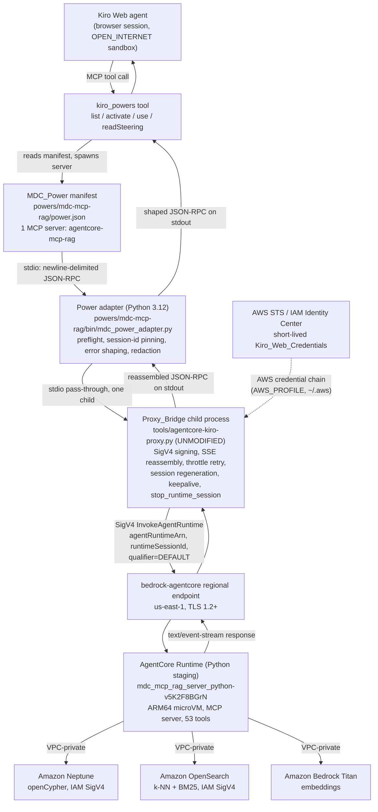

# Design — Kiro Web MCP Power (Plan A)

## 1. Overview

This design packages the MDC MCP RAG Server as a single installable Kiro Power — the
**MDC_Power** — so that a browser-originated Kiro Web session can call the server's tools
without any local configuration and without any new authentication infrastructure. The
MDC_Power's manifest declares exactly one MCP server over the MCP stdio transport. That
server is a child process chain rooted at the existing, complete, and **unmodified**
Proxy_Bridge `tools/agentcore-kiro-proxy.py`, which reads MCP JSON-RPC from standard input,
forwards each message as a boto3 `bedrock-agentcore:InvokeAgentRuntime` call signed with AWS
Signature Version 4, reassembles the `text/event-stream` response body, and writes the MCP
JSON-RPC response to standard output. No MCP Streamable HTTP endpoint, no Amazon Cognito user
pool, no OAuth scope, and no token broker participate in this path.

Authorization is enforced by AWS IAM at the `InvokeAgentRuntime` API boundary and nowhere
else. The IAM policy attached to the Kiro_Web_Principal permits exactly one action on exactly
one resource — the single AgentCore_Runtime_Arn resolved below — with no wildcard in the
account, region, or runtime segment. Because IAM evaluates the API call and cannot read the
MCP JSON-RPC payload, IAM cannot observe which MCP tool a payload names. The direct
consequence, stated here rather than implied, is that **per-tool least privilege is not
achievable under Plan A**: a session that can invoke the runtime at all can invoke all 53
tools, including all 8 that mutate state. That is an explicitly accepted prototype residual
risk with four named compensating controls and a named migration trigger — the earlier of the
first Kiro Web consumer outside the CAC single-sign-on and project IAM boundary, or promotion
of the MDC_Power beyond `prototype` status. The migration option is an evaluation of the
Cognito JWT posture with per-scope enforcement that `.kiro/specs/mcp-external-access-revised/`
describes; that spec is **read-only for this design**, is cited only, and is committed to no
work by anything written here.

The MDC_Power's declared status is `prototype`. The technology stack is locked by this design:
Python 3.12 for the Power's own adapter process, `boto3` >= 1.34.0 as the sole third-party
runtime dependency, AWS IAM Identity Center (`aws sso login` device authorization) for
credential delivery, and TypeScript AWS CDK v2 under `infrastructure/cdk/` for the IAM policy
artifact. No other runtime, SDK, or IaC tool is introduced.

## 2. Architecture



Two properties of this diagram are load-bearing. First, the only network egress from the
sandbox is HTTPS to the `bedrock-agentcore` regional endpoint (and, at login time, to IAM
Identity Center and STS); Neptune, OpenSearch, and Bedrock are reached only from inside the
AgentCore Runtime's VPC-private posture and are never addressable from the sandbox. Second,
the adapter is a supervisor and filter, not a second implementation of the call path — it
contains zero SigV4 signing, zero SSE parsing, and zero retry logic, all of which remain
solely in the Proxy_Bridge.

## 3. Key design decisions

### DD-1: Reuse the Proxy_Bridge byte-for-byte; add a thin adapter rather than editing it

Requirement 2 AC 3 and AC 4 require `tools/agentcore-kiro-proxy.py` to remain byte-identical
to the version delivered by the spec `agentcore-kiro-proxy` and require exactly one copy of
that logic to exist in the repository. Reading that file confirms it already implements
everything hard about the call path: SigV4 via boto3, `parse_sse` frame reassembly, a
`MAX_RETRIES = 3` / `BASE_DELAY = 0.5` exponential backoff over
`ThrottlingException`/`ServiceUnavailableException`/`InternalServerException`/`RequestTimeoutException`,
session-expiry detection with one regenerated `runtimeSessionId` and a single retry, a local
fast-path answer to `initialize`, a background warmup thread, a 45-second keepalive ping, and
a `stop_runtime_session` call in a `finally` block. None of that is redesigned here.

However, the Proxy_Bridge does **not** implement several behaviours this spec's requirements
demand: a `boto3` preflight that reports a resolved version (R2 AC 5–7), an
activation-time validation of the runtime ARN shape (R2 AC 14), the stage/category error
taxonomy `proxy-launch` / `power-activation` / `endpoint-invocation` / `credential-resolution`
/ `response-parsing` (R2 AC 7, 13, 15; R3 AC 9–11), credential-lifetime warnings at a
900-second threshold (R3 AC 4–5), credential redaction across all output (R3 AC 6), and
suppression of raw botocore exception text (R3 AC 11 — the Proxy_Bridge today emits
`{"code": -32603, "data": {"exception": ..., "detail": str(exc)}}`, which is precisely the raw
representation AC 11 forbids).

Three placements for that behaviour were considered. Amending the Proxy_Bridge is forbidden by
R2 AC 3. Pushing it into steering prose leaves R3 AC 11 unsatisfied, because steering cannot
rewrite a JSON-RPC error the MCP client has already received. **Chosen: a Power-owned adapter
process** at `powers/mdc-mcp-rag/bin/mdc_power_adapter.py` that Kiro launches and that in turn
launches exactly one Proxy_Bridge child. The adapter is a line-oriented pass-through in both
directions; it rewrites only error objects and emits only preflight results, and it duplicates
no Proxy_Bridge logic. This keeps R2 AC 1 satisfied (exactly one Proxy_Bridge child process
per session, fed on its stdin) and R1 AC 8 satisfied (the declared argument vector still names
`tools/agentcore-kiro-proxy.py`). The cost is one extra process and one extra hop of stdio
latency, which is negligible against a 300-second botocore read timeout.

### DD-2: Python 3.12 for the adapter, and provision `boto3` into that interpreter

The sandbox has `python3.9` and `python3.12` on `PATH` and **no `boto3` installed** (verified
live: `python3 -c "import boto3"` raises `ModuleNotFoundError` under the default `python3`,
which is 3.9.25). The user template `SETUP_AWS/provisioning/user-templates/mcp.json` already
pins `python3.12`, so this design pins `python3.12` too rather than inventing a second
interpreter convention. The adapter and the Proxy_Bridge run under the same interpreter, so a
single `boto3` preflight covers both. Traces to R2 AC 5–7.

### DD-3: One `runtimeSessionId` per Kiro Web session, owned by the Proxy_Bridge

R2 AC 9 requires one byte-identical `runtimeSessionId` of at least 33 characters for the life
of the session, with exactly one regeneration and one retry on rejection. The Proxy_Bridge
already satisfies this: `generate_session_id()` returns `f"kiro-proxy-{uuid.uuid4().hex}"`,
which is 43 characters, it is generated once in `main()`, and `AgentCoreClient.invoke()`
regenerates it once and replays the message when a `ClientError` mentions a session. The
adapter therefore **must not** generate, inject, or override a session identifier. It records
the Proxy_Bridge's session identifier for diagnostics only, by parsing the proxy's stderr
startup line. Traces to R2 AC 9.

### DD-4: `Kiro_Web_Session_Id` is adapter-generated and carried as request metadata

The Proxy_Bridge's session identifier is regenerated on expiry, so it cannot anchor
attribution across a whole Kiro Web session. The adapter generates one `Kiro_Web_Session_Id`
of the form `kiroweb-<uuid4hex>` at startup, holds it for the process lifetime, logs it once to
stderr, and attaches it as Request_Metadata on forwarded `tools/call` messages. Together with
the CloudTrail-recorded IAM principal identifier and the Runtime_Session_Id this gives the
three-part attribution the glossary specifies. Whether the AgentCore Runtime's audit logger
actually persists caller-supplied metadata is **not verifiable from this repository without
AWS credentials** and is carried forward as an explicit verification item, not asserted.

### DD-5: The `autoApprove` list is a convenience filter, never a control

R4 AC 5 forbids implementing any mechanism described as restricting which tools a session may
execute, and AC 6 requires any reduced list to be documented as bypassable. The MDC_Power
therefore exposes the **full 53-tool Allowed_Tool_Set** and uses `autoApprove` only to decide
which calls proceed without a user confirmation prompt. The manifest, the steering bundle, and
the runbook all describe it in those terms and never as an authorization boundary. Traces to
R4 AC 3–6 and R1 AC 3.

### DD-6: The IAM artifact lives in CDK, but binding it to a principal is an admin action

The policy document itself is synthesizable and testable in TypeScript CDK under
`infrastructure/cdk/`, matching every other AWS artifact in this repository. Attaching it to
an IAM Identity Center permission set is not, because Identity Center permission sets are not
under this repository's CDK management (`mdc-security-stack.ts` already imports its two IAM
roles by name with `iam.Role.fromRoleName`, precisely because an administrator pre-creates
them). This design therefore emits a customer-managed policy from CDK and documents the
attachment as a one-time administrator step. See section 7. Traces to R4 AC 1–2.

## 4. Open question resolutions

### OQ-4 — AgentCore_Runtime_Arn: the Python staging runtime

**Resolved.** The AgentCore_Runtime_Arn for this spec is:

```
arn:aws:bedrock-agentcore:us-east-1:903050880929:runtime/mdc_mcp_rag_server_python-v5K2F8BGrN
```

Region `us-east-1`, account `903050880929`, runtime id
`mdc_mcp_rag_server_python-v5K2F8BGrN`.

The two identifiers appearing in repository artifacts name **two different runtimes**, not one
runtime described inconsistently. `mdc_mcp_rag_server-TMXDllG2Wi` is the Node production
runtime that `.kiro/specs/mcp-external-access-revised/` targets, and it is also the value in
the Proxy_Bridge's own usage docstring. `mdc_mcp_rag_server_python-v5K2F8BGrN` is the Python
staging runtime documented as the connection path in
`.kiro/steering/09-agentcore-mcp-for-global-workflow.md` and already wired into
`SETUP_AWS/provisioning/user-templates/mcp.json`. The parity suites under
`mcp_server_python/tests/parity/` exercise both side by side, which is the direct evidence that
both exist concurrently. No documentation correction is warranted on this point.

Staging is chosen for four reasons. The MDC_Power is declared `prototype`, and a prototype
consumer that grants an unrestricted tool surface should not point at the production runtime.
The tool surface this design enumerates — 53 tools across 10 modules — is read from
`mcp_server_python/src/tools/*.py`, so the Python runtime is the only runtime whose tool
registry matches the manifest and steering bundle this spec ships; pointing at the Node
runtime would make R1 AC 3 (returned tool set equals the Allowed_Tool_Set exactly) fail on
day one. Steering file 09 already names this ARN as *the* connection path, so choosing it
keeps the Power consistent with the guidance the Power itself ships. And Requirement 10 AC 10
explicitly permits this value to differ from the runtime Path_B_Baseline targets provided the
difference is stated, which it is here.

What would change the target: promotion of the MDC_Power beyond `prototype` status; retirement
of the Python staging runtime (tracked by `.kiro/specs/retire-static-node-container` and
`.kiro/specs/agentcore-mcp-deployment`); or a decision that Kiro Web consumers need the
production tenant data set. Any of these requires re-pointing exactly two values — the
manifest's `MDC_AGENTCORE_RUNTIME_ARN` configuration input and the IAM policy's single
`Resource` — and they must be changed together, because R4 AC 1 scopes the grant to the
invoked resource. The runbook records that coupling.

**Not verifiable here:** that this ARN currently resolves to a live, `READY` runtime. Nothing
in the working tree proves runtime state, and no AWS credentials are available in this
workspace. Confirming it with `aws bedrock-agentcore-control get-agent-runtime` is an
implementation-phase verification item.

### OQ-5 — Authoritative tool registry: 53 tools across 10 modules

**Resolved by reading the source.** Counting `@mcp.tool(` decorators across
`mcp_server_python/src/tools/*.py` yields **53 tools in 10 modules**, of which **24 accept the
optional `tenant_id` parameter**. Six files in that directory (`_attribution.py`, `_common.py`,
`__init__.py`, `smoke_queries.py`, `_tenant_helper.py`, `_traversal_bounds.py`) register no
tools and are not modules of the registry.

| Module | Count | Tools (`tenant_id`? y/n) |
|---|---|---|
| `code_analysis.py` | 6 | `analyze_code_structure` y, `find_dependencies` y, `trace_execution_path` y, `find_callers_callees` y, `trace_full_execution_chain` y, `find_env_dependencies` y |
| `ee2_compliance.py` | 5 | `search_ee2_standards` y, `analyze_ee2_compliance` n, `generate_compliance_report` n, `scan_repository_compliance` n, `extract_code_for_analysis` n |
| `error_analysis.py` | 1 | `extract_ci_error_signal` n |
| `github_tools.py` | 4 | `analyze_workflow_dependencies` n, `search_issues` n, `get_pull_requests` n, `analyze_repository_structure` n |
| `graph_rag.py` | 9 | `get_code_context` y, `search_architecture` y, `find_similar_code` y, `get_change_impact` y, `trace_data_flow` y, `mark_as_modified` n, `get_session_context` n, `checkpoint_state` n, `restore_checkpoint` n |
| `operational.py` | 4 | `get_operational_guidance` y, `explain_workflow_component` y, `list_job_scripts` y, `get_job_details` y |
| `sdd_workflow.py` | 9 | `list_sdd_workflows` n, `get_sdd_workflow` n, `start_sdd_session` n, `get_sdd_execution_history` n, `validate_sdd_compliance` n, `get_sdd_framework_status` n, `record_sdd_step` n, `get_sdd_session` n, `complete_sdd_session` n |
| `semantic_search.py` | 8 | `search_documentation` y, `find_related_files` y, `explain_with_context` y, `get_knowledge_base_status` y, `list_ingested_urls` n, `get_ingested_urls_array` n, `list_all_sources` n, `check_knowledge_integrity` y |
| `utility.py` | 4 | `get_server_info` n, `mcp_health_check` n, `get_health_trend` n, `get_quality_metrics` n |
| `workflow_info.py` | 3 | `get_workflow_structure` y, `get_system_configs` y, `describe_component` y |
| **Total** | **53** | **24 tenant-scoped, 29 server-global** |

One registration detail matters for implementation: `error_analysis.py` uses the bare
`@mcp.tool()` form and takes its tool name from the function name, whereas every other module
passes an explicit `name="..."`. Any verification script that enumerates the registry must
handle both forms or it will under-count by one and land on 52 — which is very likely how the
steering file's 52 arose.

**Three published counts are wrong, and each correction has a distinct owner.**

| Source | Claim | Status | Correction owner |
|---|---|---|---|
| `README.md` lines 11 and 78 | 34 tools | Wrong for the Python server. Plausibly a stale Node-server count (`v3.6.2`). | Repository maintainers, out of scope for this spec; raise as a documentation issue. |
| `.kiro/specs/mcp-external-access-revised/design.md` | 51 tools | Wrong. **This spec makes no change here** — that directory is read-only pending independent AWS review. Recorded as an observation only. | Path_B_Baseline owners, on their own schedule. |
| `.kiro/steering/10-agentcore-mcp-tool-guide.md` | 52 tools / 9 modules (its "24 of 52 tenant-scoped" figure — 24 — is correct) | Wrong on the total and the module count; correct on the tenant count. | This spec, indirectly: the Steering_Bundle copy the MDC_Power ships states 53/10. Correcting the repository steering file itself is a separate one-line change and is proposed, not assumed, by this design. |
| `.kiro/steering/09-agentcore-mcp-for-global-workflow.md` | 52 tools / 9 modules (twice) | Same defect, same owner. | Same as above. |

**Mutation_Tool_Set — 8 tools, in two tiers.** Derived by reading the tool bodies rather than
by reasoning from names, which turned up two tools whose names conceal a write:

*Tier M1 — mutates a persistent shared datastore (1 tool).* `mark_as_modified` issues an
openCypher write against Neptune: `MATCH (n) WHERE n.absolutePath CONTAINS $path ... SET
n._dirty = true, n._dirtyAt = $now` (`graph_rag.py` around line 1268). A repository-wide grep
for `SET `/`CREATE `/`MERGE `/`DELETE ` across `mcp_server_python/src/tools/*.py` returns this
one line, so this is the **only** tool in the registry that writes to a shared datastore. The
write is best-effort and its failure is swallowed, but it is a write.

*Tier M2 — mutates server-side session state on the runtime's filesystem (7 tools).*
`SessionManager` (`mcp_server_python/src/sdd/session_manager.py`) persists to
`active_session.json`, `history.jsonl`, and a `checkpoints/` directory. The tools that call its
writing methods are `checkpoint_state`, `restore_checkpoint`, `start_sdd_session`,
`record_sdd_step`, `complete_sdd_session`, plus two that were **not** in the candidate list
supplied for this investigation:

- `get_code_context` — despite the read-only name, `graph_rag.py` around line 571 calls
  `session.examine_symbol(...)` as a best-effort side effect, which calls `_write_active` and
  `_append_history`.
- `get_sdd_session` — when invoked with `resume=true`, `_tool_get_session` calls
  `session.resume_session()`, which also writes. With `resume=false` it is read-only, so this
  tool's classification is **argument-dependent**.

`mark_as_modified` also writes session state, so it belongs to both tiers.

The tiering drives one concrete manifest decision. `autoApprove` omits the six *deliberately*
mutating tools (`mark_as_modified`, `checkpoint_state`, `restore_checkpoint`,
`start_sdd_session`, `record_sdd_step`, `complete_sdd_session`), leaving 47 entries. It
**includes** `get_code_context` and `get_sdd_session`, because prompting on the single most
useful read tool in the registry would make the Power unusable and because their writes are
incidental session bookkeeping on an ephemeral microVM filesystem rather than changes to
shared data. The steering bundle and the runbook state that incidental side effect explicitly
rather than letting the tool names imply purity. This is a prompting decision only; per DD-5
it restricts nothing, and all 53 tools remain callable.

### OQ-1 — Credential delivery: `aws sso login` device authorization, STS env vars as fallback

**Resolved: IAM Identity Center device authorization flow, primary.** The Kiro Web user runs

```
aws sso login --profile mdc-kiro-web
```

The AWS CLI prints a verification URL and a user code, the user completes them in their own
already-CAC-authenticated browser, and the resulting short-lived credentials become resolvable
by the Proxy_Bridge's default boto3 credential chain through `AWS_PROFILE=mdc-kiro-web`.

Four reasons make this the primary. It matches the project's existing government CAC
single-sign-on and IAM Identity Center posture, so no new identity system is introduced.
It puts no secret material in the chat transcript or the session environment, which is what
R3 AC 6 and AC 7 are trying to achieve. IAM Identity Center **does** support the OAuth 2.0
device authorization grant even though Amazon Cognito user pools do not — the constraint that
blocked the retired Cognito draft — so the flow is available to Plan A specifically. And the
`aws` CLI is already present in the sandbox at **2.33.15** (verified live), so no installation
step is required for the login itself.

*Refresh command* recorded for R3 AC 4, AC 9, AC 10, and AC 11 is exactly
`aws sso login --profile mdc-kiro-web`. Every credential error the adapter emits names that
literal string.

**Fallback: short-lived STS credentials in session environment variables.** If Identity Center
is unavailable to a given user, the user exports `AWS_ACCESS_KEY_ID`,
`AWS_SECRET_ACCESS_KEY`, and `AWS_SESSION_TOKEN` from an existing `AssumeRole` result. The
adapter's preflight treats both mechanisms identically, because both terminate in the same
boto3 chain and both must yield a session token plus an expiration; the difference is only in
the refresh instruction the adapter prints, so the adapter selects the message by whether
`AWS_PROFILE` is set. Candidate (c) — an `AssumeRole` chain from a Kiro-Web-provided workload
identity — remains unevaluable because no such identity is documented, and is not designed for.

**Two open risks are flagged rather than papered over.**

1. *No `~/.aws` in the sandbox.* Verified live: `/root/.aws` does not exist, so there is
   neither an SSO token cache nor a config file. Two consequences follow. The profile stanza
   (`sso_start_url`, `sso_region`, `sso_account_id`, `sso_role_name`, `region`) must be written
   into `~/.aws/config` at activation; that stanza contains no credential material, so writing
   it does not conflict with R3 AC 7. And a login is almost certainly required **once per Kiro
   Web session** unless `~/.aws/sso/cache` survives across sessions, which is unverified.
   **Explicit verification item:** start a Kiro Web session, run `aws sso login`, end the
   session, start a new one, and check whether `~/.aws/sso/cache` still holds a valid token. If
   it does not persist, the runbook must present a per-session login as normal rather than as a
   defect, and the activation output must lead with the login instruction.
2. *`aws sso login` writes credential material to disk, which R3 AC 7 literally forbids.* The
   CLI caches an SSO OIDC access token under `~/.aws/sso/cache/` and cached role credentials
   under `~/.aws/cli/cache/`. R3 AC 7 as written requires zero bytes of credential material on
   the sandbox filesystem, so the recommended mechanism and that criterion cannot both hold
   unamended. This design's position: **narrow R3 AC 7** to the repository working tree,
   persisted Power configuration, the Power_Manifest, the Steering_Bundle, and the chat
   transcript, and carve out the AWS-CLI-managed cache under `$HOME/.aws` on the conditions
   that the Power creates those paths with mode `0600` (files) / `0700` (directories), that
   `$HOME/.aws` is outside the repository working tree so no credential can reach git, and
   that session teardown deletes `~/.aws/sso/cache` and `~/.aws/cli/cache` within the 5-second
   window R3 AC 8 already requires. The alternative — take the env-var fallback as primary to
   preserve AC 7 verbatim — trades a `0600` file outside the work tree for a secret in the
   process environment of every child process, which is strictly worse. Flagged for the design
   review as a **requirements amendment this design depends on**; if the review rejects the
   amendment, the fallback becomes primary and this section must be rewritten.

### OQ-6 — `.kiro/settings/mcp.json` stays frozen

**Resolved: no change, and the staleness is referred elsewhere.** R7 AC 3 requires the file to
remain byte-identical, and it will. For the record, the file is stale relative to steering file
09: it declares a single stdio entry `eib-mcp-rag-full` pointing at
`/mcp_rag_eib/eib-mcp-rag-server/mcp_server_python/scripts/run_mcp_stdio.sh`, whereas steering
09 documents `agentcore-mcp-rag` as the connection path and
`SETUP_AWS/provisioning/user-templates/mcp.json` provisions that entry under a third root,
`/mdc-mcp-rag/eib-mcp-rag-server/`. Three different absolute roots appear across the three
artifacts. Reconciling them affects local developer workstations, which are outside this
spec's scope, and doing it here would silently change developer wiring as a side effect of a
Kiro Web feature. **Referred to a separate spec**; this design records the discrepancy and the
three conflicting roots so that spec has a starting point. Kiro Web does not read
`.kiro/settings/mcp.json` at all, so nothing in the MDC_Power depends on the outcome.

## 5. Power manifest and steering bundle

### 5.1 Layout

```
powers/mdc-mcp-rag/
├── power.json                        # Power_Manifest
├── RUNBOOK.md                        # Power_Runbook (residual risk, controls, migration trigger)
├── bin/
│   └── mdc_power_adapter.py          # adapter (DD-1); launches the Proxy_Bridge
└── steering/
    ├── 01-consumer-guide.md          # derived from .kiro/steering/09-...md
    └── 02-tool-guide.md              # derived from .kiro/steering/10-...md
```

### 5.2 Manifest

The invocation shape deliberately mirrors the `agentcore-mcp-rag` entry in
`SETUP_AWS/provisioning/user-templates/mcp.json` — same interpreter pin (`python3.12`), same
`AWS_REGION` env pattern, same `disabled: false`, same `autoApprove` idea — and differs only
where Kiro Web forces it to. Three differences, each with a cause:

1. **Paths resolve inside the sandbox working tree**, not the provisioned EC2 root
   `/mdc-mcp-rag/eib-mcp-rag-server/`. The manifest uses `${POWER_ROOT}` and `${REPO_ROOT}`
   placeholders that the Power resolves at activation from the Power's own install directory
   and the repository checkout containing it. Hardcoding either absolute path would break in a
   sandbox whose checkout root is assigned per session.
2. **The adapter is the entry point**, with the Proxy_Bridge passed to it as `--proxy` (DD-1).
   The argument vector still names `tools/agentcore-kiro-proxy.py`, satisfying R1 AC 8.
3. **The runtime ARN and region are configuration inputs, not literals.** R1 AC 10 requires
   configurable values to come from Power configuration or session environment and forbids
   literal values in the Steering_Bundle. The template file can afford a literal ARN because it
   is generated per user by a provisioning step; the Power ships to many sessions and cannot.

```json
{
  "name": "mdc-mcp-rag",
  "version": "0.1.0",
  "status": "prototype",
  "description": "Query the MDC MCP RAG GraphRAG knowledge base for NOAA Global Workflow code structure, documentation, and EE2 compliance.",
  "keywords": [
    "global-workflow", "graphrag", "mdc-mcp", "tenant", "ee2",
    "neptune", "opensearch", "agentcore", "sdd"
  ],
  "steering": [
    "steering/01-consumer-guide.md",
    "steering/02-tool-guide.md"
  ],
  "configuration": {
    "MDC_AGENTCORE_RUNTIME_ARN": {
      "required": true,
      "description": "AgentCore Runtime ARN (arn:aws:bedrock-agentcore:<region>:<account-id>:runtime/<runtime-id>)"
    },
    "AWS_REGION": { "required": true, "default": "us-east-1" },
    "MDC_AWS_PROFILE": { "required": false, "default": "mdc-kiro-web" }
  },
  "mcpServers": {
    "agentcore-mcp-rag": {
      "command": "python3.12",
      "args": [
        "${POWER_ROOT}/bin/mdc_power_adapter.py",
        "--proxy", "${REPO_ROOT}/tools/agentcore-kiro-proxy.py",
        "--runtime-arn", "${MDC_AGENTCORE_RUNTIME_ARN}",
        "--region", "${AWS_REGION}"
      ],
      "env": {
        "AWS_REGION": "${AWS_REGION}",
        "AWS_PROFILE": "${MDC_AWS_PROFILE}"
      },
      "disabled": false,
      "autoApprove": [ "<the 47 tools of section 4 OQ-5 minus the six deliberate mutators>" ]
    }
  }
}
```

Field budgets are chosen against R1 AC 1: the name is 12 characters (limit 1–64), the
description is 156 characters and one sentence (limit 1–200, exactly one sentence), the keyword
list has 9 entries (minimum 5) and includes all five mandated terms from R1 AC 4 matched
case-insensitively, the steering list has 2 entries (minimum 2), and there is exactly one MCP
server declaration with exactly one command string and exactly one argument vector. The
manifest contains no AWS access key identifier, secret access key, or session token, which R1
AC 9 requires be confirmed by a text scan reporting zero matches.

The Proxy_Bridge's own flag is `--runtime-id`, and despite the name it is passed straight
through to boto3 as `agentRuntimeArn`, so it accepts a full ARN — that is exactly what the
provisioning template already does. The adapter exposes the honest name `--runtime-arn` on its
own surface and forwards the value as `--runtime-id` to the child. The adapter also forwards
`--region`, and does not set `--verbose` unless `LOG_LEVEL=DEBUG` is present, matching the
Proxy_Bridge's existing env fallback.

### 5.3 Steering bundle

`steering/01-consumer-guide.md` derives from `.kiro/steering/09-agentcore-mcp-for-global-workflow.md`
and `steering/02-tool-guide.md` from `.kiro/steering/10-agentcore-mcp-tool-guide.md`. Both are
copies with a bounded set of edits, not rewrites, so that the Kiro Web agent and the local
developer agent read materially the same guidance:

- The YAML front matter `inclusion: always` / `inclusion: auto` is dropped; Powers steering is
  delivered through `readSteering`, not through workspace inclusion.
- Every "52 tools / 9 modules" occurrence becomes "53 tools / 10 modules"; the "24 of 52
  tenant-scoped" line becomes "24 of 53". The tool table in `02-tool-guide.md` is regenerated
  from the section 4 OQ-5 enumeration so the shipped guide and the manifest cannot drift.
- The literal runtime ARN in file 09's "How to Connect" section is **removed** and replaced by
  a reference to the `MDC_AGENTCORE_RUNTIME_ARN` configuration value, as R1 AC 10 requires zero
  literal values for configurable items in the Steering_Bundle.
- The connection section is rewritten for the Power path: `kiro_powers activate` instead of
  `.kiro/settings/mcp.json`, and the `aws sso login --profile mdc-kiro-web` prerequisite.
- A new short section states the `prototype` status, that the granted surface includes every
  member of the Mutation_Tool_Set, that `autoApprove` is a bypassable convenience filter and
  not a security control, that `get_code_context` and `get_sdd_session(resume=true)` write
  session state incidentally, and the `RUNBOOK.md` section name that records the accepted
  residual risk. This is what R4 AC 11 requires the `activate` response to surface.
- File 09's existing production-safety warning about Global Workflow being an operational
  forecasting system is retained verbatim.

Both files must exist and be non-empty (R1 AC 5) and must pass the same zero-credential text
scan as the manifest (R1 AC 9). `readSteering` returns them byte-identically (R1 AC 6), which
means the Power ships the files as shipped bytes and performs no template substitution at read
time.

## 6. Credential lifecycle

**Acquisition.** At `activate`, the adapter writes the `[profile mdc-kiro-web]` stanza to
`~/.aws/config` if absent (creating `~/.aws` mode `0700`, the file mode `0600`), then resolves
credentials through boto3's default chain via `botocore.session.Session().get_credentials()`
followed by `get_frozen_credentials()`. It does not call STS itself and it does not implement
the device flow; the AWS CLI owns the login and boto3 owns the chain. If resolution yields
nothing, or yields credentials with no session token or no expiration, the adapter fails
activation with stage `credential-resolution`, category `credentials-absent`, and the literal
refresh command (R3 AC 9). Long-term IAM user keys are excluded structurally by the
session-token-and-expiration requirement rather than by a name check (R3 AC 2).

**Lifetime bounds.** The adapter computes remaining lifetime as `expiration - now` in UTC and
requires it to be at least 900 and at most 43200 seconds at delivery (R3 AC 3). A value above
43200 indicates a misconfigured permission set maximum session duration and fails activation
with stage `credential-resolution`; a value below 900 is treated as already inside the refresh
window rather than as a hard failure, because the honest user response in both cases is to
re-run the login.

**The 900-second pre-expiry threshold.** Before forwarding each `tools/call`, the adapter
re-reads the frozen credentials and recomputes remaining lifetime. Below 900 seconds it takes
two actions, in this order. First, if the mechanism supports unattended refresh — which the
Identity Center profile path does, because boto3's `SSOProvider` refreshes from the cached SSO
token without user interaction — it forces a refresh by re-freezing the credential object and
proceeds with the replacement credentials (R3 AC 5). Second, whether or not the refresh
succeeded, it emits exactly one credential-expiry warning per threshold crossing to stderr and
into the MCP response's non-fatal notice channel, naming the remaining lifetime in seconds and
the literal refresh command, **and then sends the request anyway** (R3 AC 4 — the warning does
not block). The one-per-crossing rule avoids a warning on every call for the last 15 minutes of
a session; the counter resets when remaining lifetime rises back above the threshold, which is
how a successful refresh is observed.

**Expiry detection and re-authentication messaging.** The Proxy_Bridge surfaces credential
failures in two shapes: `NoCredentialsError` becomes a `-32603` with the message `"AWS
credentials not available"`, and a `ClientError` becomes a `-32603` whose
`data.exception` carries the AWS error code and whose `data.detail` carries `str(exc)`. The
adapter inspects `data.exception` and classifies `ExpiredTokenException`,
`InvalidClientTokenId`, and `UnrecognizedClientException` as `credential-expiry` (R3 AC 10),
then **replaces the error object** with one naming stage `credential-resolution`, category
`credential-expiry`, the expiration timestamp of the held credentials, and the refresh command.
The `data.detail` field carrying the raw botocore text is dropped, not rewritten, which is what
R3 AC 11 requires — the delivered message contains the refresh command, no Python traceback,
and no botocore exception representation. The classification reads only the structured
`data.exception` code and never string-matches the raw text, so dropping the raw text costs
nothing.

**One resend.** On a `credential-expiry` classification the adapter attempts one refresh; if
that yields credentials with a later expiration, it resends the same MCP method and params
exactly once with the same JSON-RPC `id` (R3 AC 12). A second expiry failure returns the shaped
error and no further resend. Because the Proxy_Bridge holds the boto3 client for the life of
the process and that client resolves credentials through the refreshable chain, a resend
through the same child picks up refreshed credentials without a restart. **Not verifiable from
this repository:** whether `botocore`'s SSO provider refreshes silently in all expiry cases or
requires a fresh `aws sso login` once the underlying SSO token itself expires (the SSO token
has its own, longer lifetime). The design assumes the latter is possible and therefore always
names the refresh command even when a resend is attempted.

**Redaction.** The adapter is the last writer of every byte the session sees, so redaction is
enforced there. It holds the secret access key and session token in memory and, before writing
any line to stdout or stderr, replaces any occurrence of a substring of 9 or more characters
drawn from either value with `***REDACTED***`. R3 AC 6 sets the bar at "no contiguous substring
longer than 8 characters", so the scan window is 9. Because both values are known strings, this
is a fixed-needle scan over a sliding window rather than a pattern heuristic, and it costs one
pass over each output line.

**Teardown.** On EOF on stdin or SIGTERM/SIGINT, the adapter closes the child's stdin, waits
for the Proxy_Bridge to exit — the Proxy_Bridge's `finally` block calls `stop_session()`,
whose failure it already logs without propagating, which is exactly the non-fatal treatment
R4 AC 13 requires — then zeroes the credential values in its own memory, unsets
`AWS_ACCESS_KEY_ID` / `AWS_SECRET_ACCESS_KEY` / `AWS_SESSION_TOKEN` from its environment
mapping, and deletes `~/.aws/sso/cache` and `~/.aws/cli/cache` (subject to the OQ-1 amendment
above). If the child has not exited within 5 seconds it is sent SIGTERM and then SIGKILL, so
that the process count reaches zero within the window R2 AC 11 sets. Python cannot guarantee
that a `str` object's bytes are overwritten in place, so "zeroes" means dropping every
reference and rebinding to a sentinel; that limitation is stated rather than glossed, and it is
the reason teardown also removes the on-disk caches.

## 7. IAM policy

### 7.1 The document

Exactly one `Allow` statement, exactly one action, exactly one resource, and no wildcard in the
account, region, or runtime-id segment (R4 AC 1 and AC 2):

```json
{
  "Version": "2012-10-17",
  "Statement": [
    {
      "Sid": "KiroWebInvokeMdcMcpRagStaging",
      "Effect": "Allow",
      "Action": "bedrock-agentcore:InvokeAgentRuntime",
      "Resource": "arn:aws:bedrock-agentcore:us-east-1:903050880929:runtime/mdc_mcp_rag_server_python-v5K2F8BGrN"
    }
  ]
}
```

Nothing else is granted — no `bedrock-agentcore:*`, no `ListAgentRuntimes`, no `logs:*`, no
Neptune or OpenSearch access. The AgentCore Runtime reaches Neptune, OpenSearch, and Bedrock
under its own `mdc-mcp-rag-ecs-task-role`, so the Kiro Web principal needs none of it, and R3
AC 13 requires the credentials to confer no permission beyond this one.

Two consequences to record. `stop_runtime_session`, which the Proxy_Bridge calls during
teardown, is a **different action** from `InvokeAgentRuntime` and is therefore denied by this
policy. That is intentional and harmless: the Proxy_Bridge already catches the exception and
logs a warning without propagating, the AgentCore session then persists only until the
900-second idle timeout, and R4 AC 13 requires exactly this non-fatal treatment plus one log
entry saying so. The adapter adds that log entry when it observes the proxy's
`stop_runtime_session failed` stderr line. Separately, the account and region in the resource
string are fixed by OQ-4; if OQ-4's target is ever re-pointed, this document and the manifest
configuration value must change in the same commit.

### 7.2 CDK location and shape

New file `infrastructure/cdk/lib/mdc-kiro-web-access-stack.ts`, exporting
`MdcKiroWebAccessStack`, registered in `infrastructure/cdk/bin/cdk.ts` alongside the existing
VPC, security, and data stacks. It takes the runtime ARN as a required stack prop rather than
hardcoding it, so the single literal lives in `bin/cdk.ts` and the resource string is
constructed nowhere else. It creates exactly one construct — an
`iam.ManagedPolicy` named `mdc-mcp-rag-kiro-web-invoke` containing one
`iam.PolicyStatement` with `effect: ALLOW`, one action, and one resource — and it exports the
policy ARN as a `CfnOutput` so the administrator attachment step has something to copy.

The policy is placed in its own stack rather than in `mdc-security-stack.ts` for two reasons:
`MdcSecurityStack` requires a `vpc` prop and this policy has no VPC dependency, and keeping the
Kiro Web grant in a separately deployable stack means re-pointing the runtime ARN does not
require a deployment that touches the WAF Web ACL, the Secrets Manager secrets, or the SSM
parameters that stack owns.

**`.kiro/steering/05-cdk-data-safety.md` compliance.** Rule 1 requires
`removalPolicy: RemovalPolicy.RETAIN` on every stateful resource. This stack contains **zero
stateful resources** — an `AWS::IAM::ManagedPolicy` stores no data — so Rule 1 is satisfied
vacuously, and this design states that explicitly rather than silently omitting the property,
because a silent omission is indistinguishable from the oversight that caused the April 2026
Neptune incident. Rule 2's pattern is honoured in the stack's own test file
`infrastructure/cdk/test/mdc-kiro-web-access-stack.test.ts`, which asserts both the absence of
stateful resource types in the synthesized template and, positively, the exact policy shape
that R4 AC 2 demands: exactly one `AWS::IAM::ManagedPolicy`, its document containing exactly
one statement, that statement's `Action` resolving to the single string
`bedrock-agentcore:InvokeAgentRuntime`, its `Resource` resolving to the single expected ARN,
and zero `*` characters in the account, region, and runtime-id segments of that ARN.

### 7.3 Attaching the policy — an administrator step, not a CDK step

Per DD-6, CDK produces the policy but does not bind it. The Kiro_Web_Principal is an IAM
Identity Center permission set, and permission sets in this account are not under this
repository's CDK management — `mdc-security-stack.ts` already establishes that convention by
importing `mdc-mcp-rag-ecs-execution-role` and `mdc-mcp-rag-ecs-task-role` by name because an
administrator pre-creates them. The runbook therefore documents a one-time administrator
action: attach the customer-managed policy `mdc-mcp-rag-kiro-web-invoke` to the Kiro Web
permission set, assign that permission set to the project's Identity Center group for account
`903050880929`, and confirm the permission set's maximum session duration is at most 12 hours
so that R3 AC 3's 43200-second ceiling is enforced at the identity provider rather than only
checked by the adapter.

**Undeterminable from this workspace, stated rather than assumed.** Four facts this design
cannot verify without AWS credentials, all carried forward as implementation-phase
verification items: whether an IAM Identity Center instance is enabled in account
`903050880929` and what its start URL and SSO region are; whether a Kiro Web permission set
already exists or must be created; whether the target runtime ARN currently resolves to a live
`READY` runtime; and whether CloudTrail already records `bedrock-agentcore`
`InvokeAgentRuntime` as a management event in `us-east-1`, which R4 AC 10 requires. The
CloudTrail item is the one most likely to surprise: AgentCore data-plane invocations may be
classified as data events requiring an explicit event selector rather than being captured by a
default management-event trail, so R4 AC 10 must be verified by producing a call and finding
the event, not by assuming a default trail suffices.

## 8. Adapter internals and the failure taxonomy

### 8.1 Process model

The adapter is a single Python 3.12 process with three threads and one child. The **main
thread** reads newline-delimited JSON-RPC from its own stdin (Kiro Web's side), validates and
annotates each message, writes it to the child's stdin, and blocks on a per-request deadline.
The **reader thread** reads the child's stdout line by line and dispatches each parsed object
onto a correlation table keyed by JSON-RPC `id`. The **stderr thread** reads the child's stderr
line by line and does three things with it: redacts it (section 6), forwards it to the
adapter's own stderr so Kiro Web's server-log surface still shows proxy diagnostics, and scans
it for four known patterns that the adapter needs as state.

Those four stderr patterns are the adapter's only channel for facts the Proxy_Bridge does not
put on stdout, and they are quoted here because the implementation must match them exactly
against the frozen file:

| Proxy_Bridge stderr text | Adapter action |
|---|---|
| `AgentCore Kiro Proxy v... session=kiro-proxy-<hex>` (startup, `main()`) | Record the `Runtime_Session_Id`. This is how the adapter learns a value it cannot set — see below. |
| `Session expired (<old>), new session: <new>` (`AgentCoreClient.invoke`) | Replace the held `Runtime_Session_Id` with `<new>`; count one session regeneration. |
| `Retryable error <code> (attempt n/4), retrying in <d>s` | Record that the child is inside its own backoff, so the adapter's deadline accounting knows the delay is the child's and not a hang. |
| `stop_runtime_session failed: ...` (teardown) | Emit the single non-fatal log entry R4 AC 13 requires, at WARN. |

**The adapter cannot pin the `Runtime_Session_Id`; it can only observe it.** The Proxy_Bridge
generates the value internally in `main()` via `generate_session_id()` and exposes neither a
CLI flag nor an environment variable for it. DD-1 forbids editing the file, so DD-3's statement
that the Proxy_Bridge owns the session identifier is not a preference but a consequence. The
adapter therefore parses the value out of the startup line, holds it for diagnostics and for
the `_meta` annotation of section 9, and updates it when the child announces a regeneration.
If the startup line does not appear within 10 seconds of launch, the adapter fails activation
with stage `proxy-launch`, category `process-exit` if the child has already exited, otherwise
`script-missing` if the `--proxy` path does not exist, otherwise `process-exit` with the note
that the child produced no recognizable banner.

**One request in flight at a time.** The Proxy_Bridge's message loop is strictly serial: it
reads one message, calls `invoke_agent_runtime` synchronously, writes the response, and only
then reads the next message. Pipelining requests into it would not increase concurrency, it
would only hide queueing latency inside an opaque buffer, so the adapter enforces the same
serialization explicitly and observably. A second `tools/call` arriving while one is in flight
waits in the adapter's queue, and the adapter accounts that wait against the 120-second
cumulative budget of R9 AC 12 rather than against the 60-second per-attempt budget of R9 AC 7,
because the request has not yet been transmitted.

### 8.2 The seven stages and the first-match rule

Every error the adapter returns to the Kiro Web session names exactly one stage from the closed
set `power-activation`, `credential-resolution`, `proxy-launch`, `endpoint-invocation`,
`authorization`, `tool-execution`, `response-parsing` (R9 AC 9), and exactly one category from
the separate closed set in section 8.3, in a field named `category` beside the field named
`stage`. A category is never written into the stage field (R9 AC 10). The shaped error object
the adapter returns is:

```json
{
  "jsonrpc": "2.0",
  "id": 41,
  "error": {
    "code": -32603,
    "message": "MDC Power: search_documentation failed at stage 'credential-resolution' (credential-expiry). Kiro Web credentials expired at 2026-05-14T18:07:03Z. Run: aws sso login --profile mdc-kiro-web",
    "data": {
      "stage": "credential-resolution",
      "category": "credential-expiry",
      "tool": "search_documentation",
      "attempts": 1,
      "elapsedSeconds": 3,
      "recoverable": true,
      "requiresReactivate": false,
      "refreshCommand": "aws sso login --profile mdc-kiro-web"
    }
  }
}
```

Stage assignment applies the first matching rule in this order, which is R9 AC 10's ordering
made executable. Ordering matters because several conditions match more than one rule — an
expired credential surfaces as an AWS `ClientError` and would otherwise be indistinguishable
from `authorization`, and a child that dies during a call satisfies both `proxy-launch` and
`tool-execution`.

1. **`power-activation`** — the `activate` action failed because a required configuration value
   (`MDC_AGENTCORE_RUNTIME_ARN`, `AWS_REGION`) is absent or fails the validation of section 8.6.
   No child is launched, no credential is resolved.
2. **`credential-resolution`** — the boto3 chain resolved nothing, resolved credentials without
   a session token or without an expiration, resolved a remaining lifetime above 43200 seconds,
   or an `invoke_agent_runtime` call returned an expiry-class error code, or the single resend
   of R3 AC 12 failed for the same reason.
3. **`proxy-launch`** — the child could not be spawned (interpreter or script absent), exited
   before the startup banner, or its stdout closed while the adapter held an in-flight request;
   also the `boto3` provisioning failure of R2 AC 7.
4. **`endpoint-invocation`** — no AWS API response was obtained for the request because DNS,
   TCP, or TLS failed.
5. **`authorization`** — the AWS API returned an authorization-class error code for
   `invoke_agent_runtime`.
6. **`response-parsing`** — bytes were received but could not be parsed as MCP JSON-RPC, or
   carried an `id` matching no outstanding request.
7. **`tool-execution`** — everything else: retry exhaustion, both timeout conditions, the
   120-second ceiling, and an MCP error result the MCP server itself returned.

Rule 7 is the catch-all, which is what makes the set exhaustive. Rules 1–6 are mutually
exclusive by construction because each tests a disjoint observable: configuration validity
before launch, credential object shape or an expiry error code, child process liveness, a
botocore connection-exception class, an AWS authorization error code, and a parse or
correlation outcome.

### 8.3 Categories, their stages, and their triggers

Categories exist because the stage vocabulary is deliberately coarse — seven values a user can
act on — while an operator debugging a failure needs to know *which* network layer broke. The
mapping is fixed:

| Category | Stage | Trigger the adapter observes |
|---|---|---|
| `dependency-provisioning` | `proxy-launch` | `import boto3` fails in the launching interpreter after the single `pip install 'boto3>=1.34.0'` attempt permitted by R2 AC 6, or the import succeeds but `boto3.__version__` is below 1.34.0. |
| `interpreter-missing` | `proxy-launch` | `FileNotFoundError` on `python3.12` when spawning the child, or `shutil.which("python3.12")` is `None` at preflight. |
| `script-missing` | `proxy-launch` | The `--proxy` path does not exist, is not a regular file, or is not readable. |
| `process-exit` | `proxy-launch` | The child exits with any code before the startup banner; or the child's stdout reaches EOF while a request is in flight; or no banner within 10 seconds. |
| `credentials-absent` | `credential-resolution` | `get_credentials()` returns `None`; or the frozen credentials carry no `token`; or no expiry is available; or the child emits the `-32603` message `AWS credentials not available` (its `NoCredentialsError` shape). |
| `credential-expiry` | `credential-resolution` | Child `-32603` whose `data.exception` is `ExpiredTokenException`, `ExpiredToken`, `InvalidClientTokenId`, or `UnrecognizedClientException`; or the adapter's own pre-send check finds remaining lifetime ≤ 0. |
| `dns-resolution` | `endpoint-invocation` | Child `-32603` `Internal proxy error:` whose text contains `EndpointConnectionError` or `Could not connect to the endpoint URL`, **and** the adapter's confirming `socket.getaddrinfo(host, 443)` probe raises `socket.gaierror`. |
| `tcp-connection` | `endpoint-invocation` | The same child text, but the `getaddrinfo` probe succeeds; or the text contains `ConnectTimeoutError` or `ConnectionRefusedError`. |
| `tls-handshake` | `endpoint-invocation` | Child text contains `SSLError`, `SSLCertVerificationError`, `CERTIFICATE_VERIFY_FAILED`, or `ssl.SSLError`. |
| `request-timeout` | `tool-execution` | The adapter's 60-second per-attempt deadline expires with no response for the outstanding `id`; or the child text contains `ReadTimeoutError`. |
| `stream-idle-timeout` | `tool-execution` | **Reserved and never emitted.** See the note below. |

Two of these rows deserve their reasoning stated, because both are worse than they would be if
the Proxy_Bridge were editable.

**Connection failures arrive as unstructured text, so the adapter string-matches.** The
Proxy_Bridge's message loop catches `NoCredentialsError` and `ClientError` explicitly and
everything else in a bare `except Exception`, which produces `-32603` with the message
`Internal proxy error: {exc}` and no structured error code. Every botocore connection exception
— `EndpointConnectionError`, `ConnectTimeoutError`, `ReadTimeoutError`, `SSLError` — is *not* a
`ClientError`, so all of them land in that unstructured bucket. The adapter therefore
classifies `endpoint-invocation` failures by matching the exception class name inside the
message text. This is fragile by nature: a botocore release that rewords those messages would
silently degrade every one of these categories to the `tool-execution` catch-all. The
alternative — teach the Proxy_Bridge to emit structured connection errors — is forbidden by
DD-1 and R7 AC 1. The mitigation chosen is that the string needles are declared in one module
constant with a unit test asserting each needle against a message produced by constructing the
real botocore exception, so a botocore upgrade breaks a test rather than a production
classification. DNS and TCP are not separable from the text alone, because botocore collapses
both into `EndpointConnectionError`; the confirming `getaddrinfo` probe is what separates them,
and it costs one resolver call on a path that has already failed.

**`stream-idle-timeout` is unobservable and this design says so rather than claiming it.** R2
AC 8 and R9 AC 7 describe a 30-consecutive-second gap between `text/event-stream` frames. The
Proxy_Bridge performs `body = response["response"].read()` — one blocking full-body read — and
only then hands the complete string to `parse_sse`. No per-frame timing information exists
anywhere in the process, so no component on this path can observe an inter-frame gap. The
adapter consequently **never emits `stream-idle-timeout`**; every timeout it reports carries
category `request-timeout`. The category is retained in the vocabulary as reserved so that the
error contract does not change if a future spec makes the Proxy_Bridge stream incrementally,
and so that a reader of the runbook's troubleshooting table finds an entry explaining why they
will not see it. This is carried as requirements amendment **A-3** in section 14.

### 8.4 Retry and timeout budgets

Three budgets apply, and the honest statement is that only two of them are the adapter's to
set. The `invoke_agent_runtime` retry loop lives inside the frozen child.

**Throttling and transient service errors (R9 AC 5, AC 6).** The child retries
`ThrottlingException`, `ServiceUnavailableException`, `InternalServerException`, and
`RequestTimeoutException` up to `MAX_RETRIES = 3` with `BASE_DELAY = 0.5` and delays
`0.5 · 2^attempt` — that is 0.5 s, 1.0 s, 2.0 s, four attempts total, 3.5 s of cumulative
delay. Four total attempts and 3.5 s ≤ 10 s satisfy R9 AC 5's attempt count, its
each-delay-at-least-double rule, and its cumulative ceiling. The first delay of 0.5 s violates
AC 5's "at least 1 second before the first retry" **and cannot be corrected without editing the
frozen file**. The adapter explicitly does **not** add a retry layer of its own for this class:
wrapping four child attempts in four adapter attempts would produce up to sixteen
`InvokeAgentRuntime` calls and break AC 5's total-attempt bound far more seriously than a
half-second first delay does. Recorded as requirements amendment **A-1**: narrow AC 5's first
delay floor to 0.5 s, matching the implementation this spec is required to reuse unmodified.
When the child exhausts its retries it emits `AgentCore invocation failed after 3 retries` with
`data.exception` set to the AWS code; the adapter reshapes that into stage `tool-execution` with
`attempts: 4` and the last observed AWS error code, satisfying AC 6.

**Connection failures (R9 AC 3).** These are *not* retried by the child — its retry branch is
inside `except ClientError`, and connection exceptions are not `ClientError`. So this budget is
entirely the adapter's, and it is implemented by resending the same JSON-RPC object to the same
child: at most 3 total attempts, a uniform 2-second wait before each subsequent attempt (inside
AC 3's 1–4 second band, chosen as a constant rather than a backoff because AC 3 caps the total
at 15 seconds and two 2-second waits leaves ample room for two 10-second `connect_timeout`
expiries), and a hard cumulative wall-clock cap of 15 seconds across all attempts, after which
the adapter returns `endpoint-invocation` immediately even if an attempt is still outstanding.
Resending the same `id` to the same child is safe here precisely because no AWS API response
was received, so no server-side side effect can have occurred.

**Per-attempt and per-invocation deadlines (R9 AC 7, AC 12).** The child's boto3 config sets
`read_timeout=300`, five times the 60-second per-attempt budget R9 AC 7 mandates, so the
deadline must be enforced by the adapter. On expiry the adapter faces a real problem: the child
is blocked in a synchronous `read()` and cannot be interrupted, and killing it would destroy
the `Runtime_Session_Id` that R9 AC 11 requires be retained across a `tool-execution` failure.
The resolution is a **draining channel**: on deadline expiry the adapter returns the
`request-timeout` error to the session immediately, records the abandoned `id` in a
timed-out-id set, and leaves the child alive. The reader thread continues consuming child
stdout; when the late response for an abandoned `id` eventually arrives it is discarded and one
DEBUG line is logged. A request arriving while the channel is draining waits, and if the
adapter's 120-second cumulative budget for that invocation is reached first the adapter returns
`tool-execution` / `request-timeout` naming the cumulative elapsed seconds (R9 AC 12). The
Runtime_Session_Id survives, the child is never killed for a slow call, and no response is ever
mis-correlated because abandonment is recorded rather than forgotten. The one case that does
kill the channel is the child's stdout reaching EOF, which is stage `proxy-launch` — and
`proxy-launch` is one of the two stages that require re-`activate` anyway, so the session
identifier is legitimately allowed to change there.

### 8.5 Session recoverability by stage

R9 AC 11 partitions the seven stages into those that leave the Power usable and those that do
not. The adapter carries the answer in the error payload itself (`recoverable`,
`requiresReactivate`) so the agent does not have to infer it from prose:

| Stage | Next `use` served without re-`activate`? | Runtime_Session_Id retained? | Why |
|---|---|---|---|
| `power-activation` | No | n/a — none exists yet | Configuration is read at activation only. |
| `credential-resolution` | Yes | Yes | The child holds a refreshable boto3 chain; a new login outside the session is picked up without a restart. |
| `proxy-launch` | No | No | There is no live child, so there is no channel and no session identifier. |
| `endpoint-invocation` | Yes | Yes | Network fault, child healthy. |
| `authorization` | Yes | Yes | IAM denial, child healthy; retrying is pointless but the channel is fine. |
| `tool-execution` | Yes | Yes | Draining channel per section 8.4. |
| `response-parsing` | Yes | Yes | One malformed response does not invalidate the channel. |

The error message for `power-activation` and `proxy-launch` states the re-activation requirement
in words, as R9 AC 11 requires, and names the absent configuration value or failing dependency,
as R9 AC 16 requires.

### 8.6 Validation of every external input

Four inputs cross into the adapter from outside. Each is validated at exactly one place, and
each failure has one named outcome. Validation is deliberately at the adapter rather than in
the child, because the child is frozen and because rejecting a bad runtime ARN before any
credential is resolved is both cheaper and more informative.

| Input | Source | Rules | On failure |
|---|---|---|---|
| `MDC_AGENTCORE_RUNTIME_ARN` | Power configuration, read once at `activate` | Required. String, 1–2048 chars. Must match `^arn:aws:bedrock-agentcore:[a-z0-9-]{1,30}:\d{12}:runtime/[A-Za-z0-9_-]{1,128}$`. Region segment must equal `AWS_REGION`. No `*`. | Fail activation, stage `power-activation`, naming the value's configuration key and which rule failed. No child launched. |
| `AWS_REGION` | Power configuration, default `us-east-1` | Required. String matching `^[a-z]{2}(-[a-z]+)+-\d$`. | Fail activation, stage `power-activation`. |
| `MDC_AWS_PROFILE` | Power configuration, default `mdc-kiro-web` | Optional. String 1–64 chars matching `^[A-Za-z0-9_.-]+$`. Absent means fall through to the env-var fallback of OQ-1. | Fail activation, stage `power-activation`. A malformed profile name is rejected rather than passed to the CLI, which would otherwise produce a confusing SSO error. |
| Inbound MCP JSON-RPC message | Kiro Web session, per call | Must parse as a JSON object. `jsonrpc` must equal `"2.0"`. `method` must be a string 1–128 chars. If `id` is present it must be a string or a number. `params`, when present, must be an object. Total serialized length ≤ 10 MiB. | Return `-32600` (invalid request) or `-32700` (parse error) with stage `response-parsing` — the adapter's own inbound framing fault is the same class of fault as an unparseable outbound one — and do not forward to the child. |

**`tenant_id` is deliberately not validated by the adapter.** R5 AC 4 requires the value be
forwarded character-for-character with no case folding, trimming, aliasing, or prefixing, and
the authority on which `tenant_id` values exist is `mcp_server_python/src/config/tenants.yaml`
inside the runtime, which the adapter cannot read. An adapter-side allowlist would be a second
copy of the catalog that drifts. The adapter therefore treats `params.arguments.tenant_id` as
opaque payload, and the MCP server owns both resolution and rejection — see section 11.

**Invariant ownership.** Three invariants matter enough to name the owning layer:

- *Exactly one AgentCore Runtime is ever targeted.* Owned by **IAM**, not by the adapter. The
  policy names one resource, so even an adapter bug that passed a different ARN would be denied
  at the API boundary. The adapter's ARN validation is a usability measure that turns a denial
  into a clear message; it is not the enforcement point.
- *No credential material reaches the session.* Owned by the **adapter**, because it is the last
  writer of every byte the session sees — both its own output and the child's forwarded stderr
  pass through the redactor of section 6. No other layer can enforce this, since the child
  writes credential-shaped text into its own stderr on some botocore errors.
- *Tenant isolation of query results.* Owned by the **MCP server** (`tenant_scope` +
  `run_tenant_scoped` + label/index prefixes). The adapter cannot enforce it and must not appear
  to: it neither reads nor rewrites `tenant_id`.

## 9. Audit and attribution

### 9.1 The three anchors and the transport for two of them

Plan A presents no access token, so attribution rests on the three values R8 names: the IAM
principal identifier CloudTrail records for each `InvokeAgentRuntime` call, the
`Runtime_Session_Id` the Proxy_Bridge sends on every call, and the `Kiro_Web_Session_Id` the
adapter generates once per session. CloudTrail carries the principal; the Audit_Log carries the
tool, the tenant, and the outcome; the two session identifiers join them.

The `Kiro_Web_Session_Id` is generated at activation as `kiroweb-` + `uuid4().hex` (40
characters, within R8 AC 2's 128-character bound), is identical on every call of the session
per DD-4, and is distinct across concurrent sessions with the collision probability of a
version-4 UUID.

**Transport: the MCP `_meta` field on `params`.** The Proxy_Bridge forwards the JSON-RPC object
verbatim as the `invoke_agent_runtime` payload and offers no header or side channel, so the only
way to carry Request_Metadata is inside the JSON-RPC object. The adapter therefore inserts, into
`params._meta` of every forwarded request:

```json
"_meta": {
  "mdc/kiroWebSessionId": "kiroweb-3f2a...",
  "mdc/consumerClass": "kiro-web"
}
```

`_meta` is chosen over three alternatives for reasons that matter. It is part of the MCP base
request-params shape, so it is schema-legal and passes server-side validation. It sits at
`params` level, not inside `params.arguments`, so **no tool input schema is affected** — which
is what R7 AC 6 requires when it forbids any change to tool input schemas. And it is namespaced
with an `mdc/` prefix so it cannot collide with MCP-reserved `_meta` keys such as
`progressToken`. The rejected alternatives were: a new top-level JSON-RPC member (non-conformant
and likely stripped), injecting the values as synthetic tool arguments (changes every tool's
effective input schema, violating R7 AC 6), and a separate out-of-band call (a second
`InvokeAgentRuntime` per tool call, doubling cost and CloudTrail volume for metadata).

The consumer-class literal is exactly `kiro-web`. The Developer_Principal workstation path
sends no `_meta` at all, so it is distinguishable from `kiro-web` by absence, which R8 AC 2's
"differs from the consumer-class literal used by the Developer_Principal workstation path"
requires and R8 AC 6 covers by mandating explicit JSON `null` rather than omission when the
value is missing from a received request.

R12 AC 3 says the request body is populated only from the `method` and `params` the session
supplied, verified by finding "no additional file content". Adding two `_meta` keys is an
addition to `params`, so this design states the reading it depends on: AC 3's target is
smuggled file content, and two namespaced metadata strings totalling under 100 bytes contain no
file content and no caller data. Recorded as clarification **A-4** in section 14 rather than
left as an unstated interpretation.

### 9.2 What this spec does not own

The Audit_Log is written by the MCP server **inside** the AgentCore Runtime, from an
`mcp_server_python` code path, to a CloudWatch log group owned by the runtime's task role. The
adapter cannot write it, cannot read it, and cannot verify its contents from the Kiro Web
sandbox. Every criterion in R8 that begins "THE MCP_Server SHALL" — AC 1, 2, 3, 4, 6, 10, 11,
12 — is therefore **server-side work this spec does not own**, and specifically: whether the
server reads `params._meta` at all, whether it persists the two `mdc/` keys into dedicated
Audit_Log fields, and whether it emits one JSON-Lines entry per dispatch with the field set and
the 4096-byte budget AC 3 describes. A grep of `mcp_server_python/src` for an audit-log emitter
matching AC 2's field list finds no such emitter today.

What this spec **can** deliver against R8 is narrow and worth stating plainly: the adapter
generates and attaches the two Request_Metadata values (AC 5), the `Runtime_Session_Id` is sent
on every call by the unmodified child (AC 7's join input), the design names the join procedure
(AC 8), and the attribution design uses no Cognito pre-token-generation trigger and no custom
token claim (AC 9). Delivering AC 1, 2, 3, 4, 6, 10, 11, and 12 requires a change to the MCP
server and a rebuild of the AgentCore image. That work is a **prerequisite for R8 and is not in
this spec's change set**; it should be raised as its own spec, and this spec's tasks document
must state the dependency rather than implying the criteria are met. Flagged as delivery risk
**DR-2** in section 14.

### 9.3 The CloudTrail join, and the field this design cannot name

R8 AC 8 requires this design to name the CloudTrail event field carrying the
`Runtime_Session_Id` for an `InvokeAgentRuntime` call. **This design cannot name that field**,
and asserting one would be a guess. Two facts block it: no CloudTrail event for
`bedrock-agentcore` `InvokeAgentRuntime` is available in this workspace to inspect, and AWS
service-reference material is not reachable from here. The plausible candidate is
`requestParameters.runtimeSessionId`, but whether `bedrock-agentcore` records
`requestParameters` at all for a data-plane invocation — and whether that invocation is a
management event or a data event requiring an explicit event selector — is exactly the
uncertainty already recorded at the end of section 7.3.

R8 AC 8 anticipates this and specifies the substitute, which this design adopts as the
**primary** join until the field is confirmed:

- **Join inputs:** the `AgentCore_Runtime_Arn` (present in the CloudTrail event's
  `resources`/`requestParameters` and known to this spec as one literal), the CloudTrail
  `eventTime`, and the Audit_Log entry `timestamp`, matched within a tolerance window of
  **≤ 5 seconds** — set at 5 seconds, AC 8's maximum, because the adapter and the runtime clocks
  are independent and the child's own retry backoff can add up to 3.5 seconds between the AWS
  API call CloudTrail timestamps and the dispatch the server timestamps.
- **Disambiguation within the window:** the `Kiro_Web_Session_Id` in the Audit_Log entry, which
  partitions concurrent sessions, plus the invoked tool name, which partitions concurrent calls
  of one session — and section 8.1 guarantees a session has at most one call in flight, so
  within one session the window contains at most one candidate.
- **The known noise source, stated:** the child runs a keepalive thread that sends a `ping` every
  45 seconds and a background `initialize` warmup at startup, both through the same client and
  the same `runtimeSessionId`. These produce `InvokeAgentRuntime` CloudTrail events with **no
  corresponding tool invocation**, so the join is one-way total — every Audit_Log entry resolves
  to exactly one principal, which is what AC 7 and AC 8 require — but not onto: CloudTrail will
  contain more `InvokeAgentRuntime` events than Audit_Log tool entries, roughly one extra per 45
  seconds of session lifetime. An operator who expects a 1:1 count will conclude events are
  missing from the log. The runbook's troubleshooting content states the keepalive cadence for
  exactly this reason.

Confirming the CloudTrail field is **verification item V-4** in section 14. If it exists, the
join narrows from a time window to an exact identifier match and the tolerance window becomes
unnecessary; the design's structure does not otherwise change.

## 10. The diagnostic action

R9 AC 13 fixes the field set exactly — "SHALL return exactly the following fields" — so the
implementation is a closed contract, not a starting point. The adapter exposes it as the
Powers_Interface diagnostic action rather than as an MCP tool, so that it remains callable when
the MCP channel is the thing that is broken.

| Field | Type | Source |
|---|---|---|
| `runtimeArn` | string | The validated `MDC_AGENTCORE_RUNTIME_ARN`. |
| `region` | string | The validated `AWS_REGION`. |
| `credentialsResolved` | boolean | Whether the boto3 chain currently yields frozen credentials with a session token. |
| `credentialsRemainingSeconds` | integer or `null` | `expiration - now` in whole seconds, or `null` when `credentialsResolved` is false. |
| `runtimeSessionIdHeld` | boolean | Whether the adapter has parsed a session banner from the child and the child is alive. Never the value itself. |
| `boto3Importable` | boolean | Result of `python3.12 -c "import boto3"` in the launching interpreter, plus a version check against 1.34.0. |
| `healthCallOutcome` | `"success"` or `"failure"` | One `tools/call` of `mcp_health_check` with default arguments. |
| `healthCallElapsedMs` | integer | Monotonic elapsed time of that call in whole milliseconds. |
| `failingStage` | string, present only when the outcome is `failure` | The stage assigned by section 8.2. |

`mcp_health_check` is the designated health tool for three reasons: it takes no `tenant_id`, so
the probe cannot fail for tenant reasons and confuse the diagnosis; its default arguments
(`detailed=false, deep=false, functional=false`) make it the cheapest end-to-end read in the
registry, exercising the full chain — adapter, child, SigV4, endpoint, runtime, MCP dispatch —
without touching Neptune or OpenSearch heavily; and it is already the canonical health surface
in `utility.py`, so its output is familiar in the server logs. `get_server_info` was the
alternative and was rejected because its `detailed=true` path loads the tenant catalog and can
fail for catalog reasons that have nothing to do with reachability.

The health call carries its own 60-second deadline (R9 AC 15). On expiry the diagnostic returns
`healthCallOutcome: "failure"`, `failingStage: "tool-execution"`, and **every other field**,
because a diagnostic that omits fields when something is broken is useless precisely when it is
needed. `credentialsRemainingSeconds` is reported as a duration and never as an expiry
timestamp joined to credential values, and the whole result passes through the section 6
redactor before serialization, so R9 AC 14's exclusion of the access key identifier, the secret
key, the session token, and every 9-or-more-character substring of the latter two holds by
construction rather than by review.

## 11. Tenant selection and honest degradation

### 11.1 Where these requirements actually live

R5 and R6 are, in the main, **descriptions of MCP server behavior**, and this section states
that before resolving anything, because the alternative is a design that appears to deliver
tenant honesty and delivers only a passthrough. Tenant resolution, the index-coverage field, and
`Tenant_Data_Status` are computed inside the AgentCore Runtime from
`mcp_server_python/src/tenancy/` and `mcp_server_python/src/tools/`. The MDC_Power's entire
contribution is to forward `tenant_id` untouched (R5 AC 4), to surface the resulting text
unmodified, and to ship steering that tells the agent how to read it.

The good news, established by reading the source rather than assumed: a substantial part of R5
is **already implemented and deployed**.

| Criterion | Status today | Evidence |
|---|---|---|
| R5 AC 1 (catalog tool, five fields, no `tenant_id` arg) | **Met** by `get_server_info(detailed=true)` | `utility.py` ~line 496 emits a table with `tenant_id`, `branch`, `lifecycle`, `index_prefix`, `label_prefix` for every catalog entry; the tool takes no `tenant_id`. |
| R5 AC 2 (empty prefixes presented, not omitted) | **Met** | The table renders prefixes with `!r`, so `gw`'s empty prefixes appear as `''` — presented, not omitted, no placeholder. |
| R5 AC 4 (character-identical passthrough) | **Met by this spec** | The adapter treats `tenant_id` as opaque payload (section 8.6). |
| R5 AC 5 (absent/`null` → default `gw`) | **Met**, except for the "states that the default was applied" clause | `resolve_tenant` falls through to `catalog.defaults.tenant_id`, which is `gw`. The response states `*Tenant: gw*` but does not say the default was applied. |
| R5 AC 6 (unknown id → error naming it and enumerating known ids, no execution) | **Met** | `UnknownTenantError` renders `unknown tenant_id=...; known tenants: gw, gw_sfs, gw_jedi_gfs, gw_v17, gw_gefs_v12`; `run_tenant_scoped` raises before `coro_factory()` runs. |
| R5 AC 7 (malformed id → error, never default) | **Partly met** | Whitespace-only, over-64-character, and non-string values all miss `catalog.by_id` and raise. **The empty string does not**: `resolve_tenant` chains with `or`, so `""` is falsy and silently resolves to `gw`. One server-side line. |
| R5 AC 8 (response states resolved id and branch) | **Met** | `_attribution.attribute()` prepends `*Tenant: <id>*` and `*Branch: <branch>*` to every tenant-scoped result. |
| R5 AC 9 (catalog load failure → error, no partial catalog, no default) | **Unverified** | `get_server_info` catches catalog exceptions and renders `_Error loading catalog: ..._` inline, which is an error message but is embedded in an otherwise-successful response; whether tenant-scoped tools fail closed on a load failure was not traced. |
| R5 AC 10 (steering states the rules and enumerates tenants) | **This spec** | Section 5.3; the enumeration is the five catalog entries. |

The five catalog `tenant_id` values, for the steering bundle and the runbook, are `gw`
(`develop`, production), `gw_sfs` (`dev/sfs`, experimental), `gw_jedi_gfs` (`dev/jedi-gfs`,
experimental), `gw_v17` (`dev/gfs.v17`, staging), and `gw_gefs_v12` (`release/gefs_v12`).

R6 is a different story. **Nothing in R6 exists in the server today**, and most of it duplicates
an unstarted spec. A grep of `mcp_server_python/src/tools/` finds no index-coverage field, no
`Tenant_Data_Status`, and no five-value enumeration. What does exist is the completed
`graceful-missing-index-handling` spec, whose `_missing_index_skip` helper in `_common.py`
renders `[INFO] <tool>: no results — Collection '<c>' is not provisioned for tenant '<t>'` for
four tools (`search_architecture`, `find_similar_code`, `get_operational_guidance`,
`search_documentation`). That is genuine honest degradation, and it is **prose**. R6 AC 5
explicitly demands that a caller distinguish unpopulated from populated-with-zero-matches
"without parsing prose", so the existing helper does not satisfy it.

And `.kiro/specs/tenant-status-honesty/` — all seven tasks unchecked, so unstarted — already
specifies most of R6: its Task 1 adds a `_probe_tenant_data` helper, Task 2 wires a per-tenant
`data` column into `mcp_health_check`, Task 3 fixes `get_knowledge_base_status` status labels,
Task 4 adds a `_smoke_tenant_coverage` probe. That is R6 AC 1, AC 2, and AC 7 under a different
name. This design does **not** restate that work and does not claim it.

| Criterion | Owner | Note |
|---|---|---|
| R6 AC 1, 2, 7 (tenant-status tool, five-value enum, probe-error and timeouts) | **`tenant-status-honesty`** | Substantially the same work. This spec should depend on it, not duplicate it. Its Task 2 target `mcp_health_check` is the natural home, and is also this spec's diagnostic health tool. |
| R6 AC 3, 4, 5, 6 (structured index-coverage field, four distinct values) | **Server-side, unspecified anywhere yet** | New work: a machine-readable field on tenant-scoped read responses. Neither this spec nor `tenant-status-honesty` currently specifies it. |
| R6 AC 8 (last ingestion completion timestamp per tenant) | **Server-side, no data source exists** | `UnifiedManifest` carries a global `generated_at`; `SourceEntry`'s required fields include no per-tenant ingestion completion time. AC 8 permits JSON `null` when no record exists, so a conformant first implementation reports `null` for all five tenants — honest, and useless. Recording a real per-tenant timestamp is a separate ingestion-side change. |
| R6 AC 9, 10 (steering instructions for reading coverage and the relationship-ingestion caveat) | **This spec** | Deliverable now, in section 5.3's bundle, and worth delivering even before the fields exist, because the `[INFO]` Skip_Block already needs the same interpretation discipline. |

**Delivery risk DR-1, stated plainly.** If R6 is read as this spec's obligation, this spec
cannot complete without a server change, an AgentCore image rebuild, and a deployment — none of
which are in its architecture, which is a Power plus an IAM policy. The recommendation is that
R6 AC 1–8 be re-scoped as **dependencies on server-side specs** (`tenant-status-honesty` plus
one new spec for the index-coverage field), that this spec deliver R6 AC 9 and AC 10 plus the
steering discipline, and that the tasks document name the dependency instead of absorbing it.

### 11.2 OQ-7 — can a declared `tenant_id` persist for a session?

**Resolved: no, and R5 AC 11 is therefore withdrawn** under the escape clause AC 11 itself
provides.

Three candidate holders were considered. *The MCP server* cannot hold it: `resolve_tenant` is
per-request, the `ContextVar` is set inside `tenant_scope` and torn down on exit, and there is
no server-side notion of a Kiro Web session at all — the only session concept is the AgentCore
`runtimeSessionId`, which the server does not map to a tenant. *The Proxy_Bridge* cannot hold
it: it is frozen, and it forwards payloads verbatim. *The adapter* technically could — it sees
every request and could inject `tenant_id` into `params.arguments` when absent — and this is
the option that must be rejected on its merits rather than on feasibility.

Injecting a remembered `tenant_id` would put the adapter in the business of rewriting tool
arguments. That collides with R5 AC 4's requirement that the forwarded value be
character-for-character what the caller supplied (an injected value was supplied by nobody), it
makes the adapter's behavior depend on hidden state so the same call produces different results
at different points in a session, and it would silently change the meaning of the 29
server-global tools if the injection were not perfectly scoped to the 24 tenant-scoped ones —
requiring the adapter to hold a copy of that 24-tool list, which is exactly the drifting
second copy of the catalog that section 8.6 rejects. A wrong answer attributed to the wrong
branch is the specific harm R5 exists to prevent.

So tenant declaration reduces to the per-call `tenant_id` argument, exactly as R5 AC 4, 5, 6,
and 7 specify, and R5 AC 11 is **recorded as withdrawn** as its own second clause directs. The
usability gap it was trying to close is closed by prompting instead: the steering bundle
instructs the agent to carry the user's stated branch forward in its own context and to pass
`tenant_id` explicitly on every tenant-scoped call, and reminds it that every response states
`*Tenant:*` and `*Branch:*` so a drifted tenant is visible in the output rather than silent.
Agent-side memory is the right place for conversational state; a transport adapter is not.

### 11.3 OQ-8 — should the steering bundle discourage mutation tools, and is a client-side guard worth it?

**Resolved: yes to the steering advisory, no to a new guard mechanism — the `autoApprove` list
is the guard, and it is honestly labelled.**

The steering bundle states, for each of the 8 Mutation_Tool_Set members, what it writes and
where. The M1/M2 tiering of section 4 (OQ-5) does real work here, because the advice differs
sharply between the tiers. `mark_as_modified` writes `_dirty` flags into **Neptune**, shared
state visible to every consumer of the graph including the local developer path, so the steering
tells the agent not to call it unless the user explicitly asks to mark files modified, and to
say which paths it is about to flag before doing so. The seven M2 tools write only session state
on the runtime's own ephemeral microVM filesystem, so the steering describes them as
low-consequence and simply notes that they are writes — including the two whose names conceal
it, `get_code_context` and `get_sdd_session(resume=true)`.

On a mechanism: a bypassable client-side advisory guard is **not** worth adding, because one
already exists and adding a second would dilute the first. The manifest's `autoApprove` list of
47 tools (section 5.2) means the six deliberate mutators prompt the user before running, which
is precisely an advisory client-side guard, and it is prior art already used by the local
developer path's `mcp.json`. A second layer — say, an adapter-side deny list — would be worse
in three ways: it would be a third copy of the mutation-tool enumeration to keep in sync with
the source, it would return a stage-less error that fits none of the seven stages of section
8.2, and per DD-5 it would still be bypassable by anyone holding the Kiro_Web_Credentials, so
it would create an impression of enforcement where there is none. That impression is the exact
failure mode R4 AC 6 and R12 AC 12 legislate against.

What the design does instead is label honestly, in all three places R4 AC 11, R11 AC 2, and
R11 AC 6 require: `autoApprove` is a convenience filter, not a control; all 53 tools remain
callable by a caller holding the credentials; and the residual risk is recorded in section 12
with its compensating controls.

## 12. Prototype residual risk, compensating controls, and the migration option

### 12.1 The risk record

Recorded once here, and restated in `powers/mdc-mcp-rag/RUNBOOK.md` under the section name
`Prototype Status and Accepted Risk`, with the same migration trigger in both places as R10
AC 5 requires:

> **Residual risk.** Under Plan A, authorization is enforced only at the
> `bedrock-agentcore:InvokeAgentRuntime` API boundary. IAM cannot inspect the MCP JSON-RPC
> payload, so it cannot distinguish one MCP tool from another. Any Kiro Web session that can
> invoke the runtime can invoke **all 53 tools**, including all **8** members of the
> Mutation_Tool_Set: `mark_as_modified` (which writes `_dirty` flags into the shared Neptune
> graph) and the seven session-state writers `checkpoint_state`, `restore_checkpoint`,
> `start_sdd_session`, `record_sdd_step`, `complete_sdd_session`, `get_code_context`, and
> `get_sdd_session(resume=true)`. **No control in this design prevents that reachability.**
> The `autoApprove` list of 47 tools prompts before the six deliberate mutators run; it is a
> client-side convenience filter that a caller holding the credentials can bypass, and it is
> not a security control. The MDC_Power's status is `prototype`.

The `prototype` literal appears character-for-character in exactly three places, per R10 AC 4:
the `status` field of `powers/mdc-mcp-rag/power.json`, the Powers_Interface `activate` output,
and the `Prototype Status and Accepted Risk` section of the runbook.

### 12.2 The four compensating controls and how each is verified

| Control | What it does | Verification method (R12 AC 13) |
|---|---|---|
| **Named human** | Every Kiro Web session is reachable only by a human who has completed government CAC single sign-on into account `903050880929` via IAM Identity Center; there is no machine or unattended consumer on this path. | A record showing that access to the Kiro Web session requires CAC SSO into the project AWS account. |
| **Attribution** | Every `InvokeAgentRuntime` call is recorded by CloudTrail against a named IAM principal identifier. | Retrieve the CloudTrail `InvokeAgentRuntime` event carrying the IAM principal identifier for one test invocation (R4 AC 10). Note V-4: this presumes the event is captured; see section 7.3. |
| **IAM boundary** | The Kiro_Web_Principal policy permits exactly one action on exactly one resource, with no wildcard in the account, region, or runtime segment — so the blast radius is one runtime. | The synthesized-policy assertion of R4 AC 2, implemented as the Jest test of section 13.3. |
| **Prototype scope** | The Power declares itself a prototype in three places, so no consumer can adopt it believing it carries production authorization guarantees. | Presence of the `prototype` literal in all three locations required by R10 AC 4. |

Of the four, three are verifiable in CI or by inspection and one — attribution — depends on an
AWS-side fact this workspace cannot confirm. That asymmetry is worth naming: the control set is
strong on boundary and labelling and weakest exactly where an incident investigation would need
it most.

### 12.3 The migration trigger

**Trigger:** the earlier of (a) the first Kiro Web consumer that is outside the CAC
single-sign-on and project IAM boundary — any machine consumer, any external collaborator, any
unattended automation — or (b) promotion of the MDC_Power beyond `prototype` status.

**Action on trigger:** evaluate and, if adopted, implement the per-tool authorization posture of
section 12.4 before the new consumer is enabled or the status is changed. The trigger and action
are stated identically in the design and in the runbook (R10 AC 5).

### 12.4 The migration option, recorded as an option for this spec only

The option is to replace Plan A's IAM SigV4 posture with the Amazon Cognito JWT posture with
per-scope tool enforcement that `.kiro/specs/mcp-external-access-revised/` describes: an
MCP Streamable HTTP endpoint fronted by a JWT authorizer, OAuth scopes mapped to tool groups,
and a token broker issuing scoped tokens, so that a token carrying only read scopes cannot
reach a mutation tool.

**This is a future option for this spec and nothing more.** `.kiro/specs/mcp-external-access-revised/`
is read-only for this design — AWS technical personnel are following up on its current state for
independent review — so it is cited and never modified, R10 AC 2 requires this spec's change set
to touch zero files under that path, and nothing written here obligates that spec to do,
record, publish, or change anything. Long-term overlap between this spec's posture and the
Path B posture is expected and creates no coordination obligation in either direction.

R10 AC 6 requires an enumeration of every acceptance criterion of *this* spec whose wording
changes if the option is adopted:

| Requirement | Criteria whose wording changes | Nature of the change |
|---|---|---|
| **R2** (transport) | 1, 2, 3, 4, 8, 9, 10, 12, 13, 15 | The Proxy_Bridge and the whole stdio-plus-`InvokeAgentRuntime` chain are replaced by an HTTPS Streamable HTTP client; SigV4 signing, SSE reassembly by the bridge, and `runtimeSessionId` semantics all become obsolete or move. |
| **R3** (credentials) | 1, 2, 3, 4, 5, 6, 7, 9, 10, 11, 12, 13 | "Short-lived AWS credentials with a session token" becomes "a JWT bearing scopes"; `aws sso login` ceases to be the refresh command; expiry detection reads token `exp` rather than an AWS error code. |
| **R4** (authorization) | 1, 2, 3, 4, 5, 6, 7, 8, 9 | The single IAM statement is replaced by scope-to-tool mapping; AC 3's and AC 5's admissions that all tools including mutators are reachable and that per-tool authorization is unenforced are **deleted**, which is the entire point of migrating; the Allowed_Tool_Set stops being the full registry. |
| **R8** (attribution) | 2, 5, 6, 7, 8, 9 | Attribution anchors move from the CloudTrail principal plus two session identifiers to token claims; AC 9's prohibition on custom claims and pre-token-generation triggers is the criterion that most directly contradicts the option and would have to be revisited for this spec. |
| **R9** (failing stages) | 1, 2, 4, 9, 10, 13, 16 | `proxy-launch` disappears; `credential-resolution` becomes token acquisition; a new stage for token exchange or scope denial is needed; `authorization` failures become 403s from the authorizer rather than `AccessDeniedException`. |
| **R11** (documentation) | 3, 4, 8, 9, 10, 12 | Prerequisites, first query, troubleshooting, and credential-lifetime text all change; the Developer_Principal passage changes because the two paths would no longer share a bridge. |
| **R12** (egress) | 1, 2, 3, 5, 6 | The egress allowlist loses `bedrock-agentcore` and `sts` and gains the Cognito token endpoint and the MCP HTTPS endpoint. |

Also, per R10 AC 7 and AC 8: this spec provisions no Cognito user pool, resource server, or app
client, no JWT authorizer, no token broker, no GitHub OIDC federated role, no AgentCore Gateway,
and no Cedar policy — verifiable by synthesizing `MdcKiroWebAccessStack`, which contains exactly
one `AWS::IAM::ManagedPolicy` and nothing else — and this spec's tasks document must contain no
Gateway or Cedar task.

## 13. Testing strategy

### 13.1 What is testable where

The honest split is that the adapter's logic is almost entirely unit-testable with a faked
child, the IAM artifact is fully testable by CDK synthesis with no AWS account, and everything
that crosses the AWS API boundary is untestable without credentials and a live runtime. The
design was shaped to keep that boundary in one place — the adapter's child-process interface —
precisely so the boundary can be faked.

The fake is a small script that speaks the Proxy_Bridge's *observable contract*: it prints the
startup banner with a synthetic `session=kiro-proxy-<hex>`, reads newline-delimited JSON from
stdin, and writes canned responses — including the exact `-32603` error shapes the real bridge
produces (`AWS credentials not available`, `AgentCore invocation failed after 3 retries` with
`data.exception`, `Internal proxy error: <botocore-exception-text>`, `Empty SSE response`) and
the exact stderr lines of section 8.1's table. Every classification rule in section 8.3 is then
exercised without AWS. Because the fake's canned strings are the coupling to the frozen file,
each needle is *also* asserted against a message built from the real botocore exception class,
so a botocore upgrade fails a test rather than silently degrading classification.

Python tests live under `mcp_server_python/tests/` alongside the existing suite — `unit/`,
`integration/`, and `properties/`, which already holds twelve Hypothesis modules including
`test_tenancy.py`, so the convention and the `hypothesis==6.152.2` dev dependency in
`pyproject.toml` are established. CDK tests live in `infrastructure/cdk/test/` under Jest, next
to the existing `cdk.test.ts`.

### 13.2 Correctness properties P1–P11

Each property is one Hypothesis test at ≥ 100 iterations, per the requirements' own framing.

| Property | Test level and location | Sandbox-testable? | Notes |
|---|---|---|---|
| **P1** SSE reassembly round-trip | Unit, `tests/unit/test_power_adapter_framing.py`, plus a property test over arbitrary frame partitions | **Yes, fully** | `parse_sse` is a pure function in the frozen file; import and test it without invoking it through AWS. Payloads to 10 MiB are generated locally. The property must not assert on inter-frame timing, which section 8.3 shows is unobservable. |
| **P2** SigV4 correctness, single target | Split: unit + integration | **No — needs credentials** | Signing is done by botocore inside the child. Testable in the sandbox only as far as asserting the child is invoked with the configured ARN and never another; acceptance of the signature is an AWS-side fact. Unit half: the argument vector contains exactly the one ARN. Live half: a real call returns non-error. |
| **P3** `Runtime_Session_Id` reuse | Unit with the fake child | **Yes** | The fake emits the banner, then a session-expired stderr line; assert the adapter's held value updates exactly once and that a byte-identical value is reported by the diagnostic across a call sequence. The "every call carries it" half is the child's behavior, asserted by reading the frozen source, not by observation. |
| **P4** Proxy_Bridge unmodified | CI check, not a property test | **Yes** | `git diff --numstat <baseline> -- tools/agentcore-kiro-proxy.py` must report zero, and a repository-wide content search must return exactly one matching path. Cheap, deterministic, and the single most important guard in the suite. |
| **P5** Credential redaction across every outcome | Unit property, `tests/properties/test_power_redaction_props.py` | **Yes, fully** | Generate arbitrary secret keys and session tokens, inject them into every error shape, diagnostic output, and forwarded stderr line, and assert no 9-or-more-character substring survives. The highest-value property in the set, because one generator covers all nine outcome classes. |
| **P6** Expiry classification and messaging | Unit with the fake child | **Yes** | Drive each expiry error code through the fake; assert stage `credential-resolution`, the literal refresh command present, no traceback, no botocore representation, at most one resend. |
| **P7** IAM policy resource scoping | CDK assertion, Jest | **Yes, fully** | Section 13.3. |
| **P8** Tenant passthrough fidelity | Split | **Partly** | The adapter half — forwarded bytes for `tenant_id` are identical to those supplied — is a unit property over arbitrary strings including empty, whitespace, unicode, and 64+ characters. The resolution half is server-side and needs a live runtime; note that the empty-string gap of section 11.1 will make that half **fail** against the current server, which is the correct outcome for a test documenting a real defect. |
| **P9** Empty-versus-unpopulated distinguishability | Integration, server-side | **No** | Cannot pass today: no structured index-coverage field exists (section 11.1). Write it and mark it expected-to-fail with a reference to the server-side dependency, rather than omitting it, so the gap stays visible. |
| **P10** Audit entry well-formedness and joinability | Integration, server-side, needs CloudWatch and CloudTrail | **No** | Not deliverable by this spec (section 9.2). The adapter-side half — `_meta` carries both values on every forwarded request, stable within a session and distinct across sessions — is unit-testable and should be written now. |
| **P11** Error stage labelling exhaustiveness | Unit property, `tests/properties/test_power_stage_props.py` | **Yes, fully** | Generate every child error shape and every adapter-internal failure; assert exactly one stage from the seven, that no category value ever appears in the stage field, and that `requiresReactivate` is true only for `power-activation` and `proxy-launch`. |

Five of eleven properties are fully sandbox-testable, two are partly testable, and four need AWS
credentials or a live runtime. That ratio is a fair summary of where this design's risk sits.

### 13.3 CDK assertion tests

`infrastructure/cdk/test/mdc-kiro-web-access-stack.test.ts`, using
`aws-cdk-lib/assertions.Template`, asserts against the synthesized template of
`MdcKiroWebAccessStack`:

1. `resourceCountIs("AWS::IAM::ManagedPolicy", 1)` and a resource count of **0** for each of
   `AWS::Neptune::DBCluster`, `AWS::OpenSearchService::Domain`, `AWS::S3::Bucket`,
   `AWS::EFS::FileSystem`, `AWS::SecretsManager::Secret`, `AWS::KMS::Key`, and
   `AWS::Logs::LogGroup` — which is how section 7.2's claim that the stack holds zero stateful
   resources becomes a test rather than a sentence, and how R12 AC 7's `DeletionPolicy: Retain`
   obligation is discharged vacuously and visibly.
2. The policy document has exactly one statement; its `Effect` is `Allow`; its `Action`
   resolves to the single string `bedrock-agentcore:InvokeAgentRuntime`; its `Resource`
   resolves to the single expected ARN (R4 AC 2, P7).
3. The `Resource` string, split on `:`, has no `*` in the account, region, or `runtime/<id>`
   segments — asserted segment by segment rather than by a substring scan, so a wildcard in an
   unexpected position cannot slip past.
4. No `AWS::Cognito::*`, `AWS::BedrockAgentCore::Gateway`, or `AWS::VerifiedPermissions::*`
   resource appears (R10 AC 7).

### 13.4 Integration and live verification

Three checks require AWS and are therefore implementation-phase tasks with recorded outputs
rather than CI gates: one `mcp_health_check` call through the Power returning non-error within
60 seconds; one `search_documentation` call with an explicit `tenant_id` returning a response
whose `*Tenant:*` header matches the value supplied (R11 AC 5 and the first-query contract); and
retrieval of the CloudTrail event for one of those calls, which is simultaneously R4 AC 10, the
attribution compensating control, and verification item V-4.

## 14. Open risks, requirements amendments, and verification items

### 14.1 Requirements amendments this design depends on

Each of these is a place where a criterion as written cannot hold against the implementation
this spec is required to reuse unmodified. They are proposed, not assumed, and the design review
owns the decision. If any is rejected, the section named must be rewritten.

| ID | Criterion | Conflict | Proposed amendment | If rejected |
|---|---|---|---|---|
| **A-1** | R9 AC 5 | The frozen Proxy_Bridge's `BASE_DELAY = 0.5` makes the first retry delay 0.5 s, not the "at least 1 second" AC 5 requires. Adding an adapter retry layer would allow up to 16 API calls, breaking AC 5's attempt bound far worse. | Lower the first-delay floor to 0.5 s. Attempt count (4), the doubling rule, and the 10-second cumulative ceiling are all already met. | Either edit the frozen file (violating R7 AC 1) or accept a compounded retry budget. Section 8.4 must be rewritten. |
| **A-2** | R3 AC 7 | `aws sso login` caches an SSO OIDC token under `~/.aws/sso/cache/` and role credentials under `~/.aws/cli/cache/`; AC 7 as written permits zero bytes of credential material on the sandbox filesystem. (Raised in section 4, OQ-1; repeated here so the amendment list is complete.) | Narrow AC 7 to the repository working tree, persisted Power configuration, the manifest, the steering bundle, and the chat transcript; carve out `$HOME/.aws` on the conditions of mode `0600`/`0700`, location outside the work tree, and deletion at teardown within R3 AC 8's 5-second window. | The env-var fallback becomes primary, putting secrets in the environment of every child process — strictly worse. Sections 4 (OQ-1) and 6 must be rewritten. |
| **A-3** | R2 AC 15, R9 AC 7 | The 30-second stream-idle timeout is **unobservable**: the Proxy_Bridge does one blocking `response["response"].read()` of the full body, so no inter-frame timing exists in the process. | Record `stream-idle-timeout` as a reserved category that is never emitted while the Proxy_Bridge reads the body in one call, and document it as such in the runbook. | The Proxy_Bridge must be modified to stream incrementally, which R7 AC 1 forbids. |
| **A-4** | R12 AC 3 | The adapter adds two namespaced `_meta` keys to `params` to carry the Request_Metadata that R8 AC 5 requires; AC 3 says the body is populated only from caller-supplied `method` and `params`. | Clarify that AC 3's prohibition targets smuggled file content — which its own verification wording, "no additional file content", indicates — and admits bounded namespaced metadata. | R8 AC 5 becomes unimplementable on this transport, since the Proxy_Bridge offers no side channel. |
| **A-5** | R5 AC 11 | Neither the Power nor the MCP session can hold a declared `tenant_id` without the adapter rewriting tool arguments, which R5 AC 4 forbids. | Record AC 11 as **withdrawn**, which AC 11's own second clause provides for. Tenant declaration is the per-call argument (section 11.2). | An adapter-side injection layer would have to be designed, contradicting R5 AC 4. |
| **A-6** | R6 AC 1–8; R8 AC 1, 2, 3, 4, 6, 10, 11, 12 | These are MCP-server behaviors inside the AgentCore image. This spec's change set is a Power directory plus one CDK stack; it cannot deliver them. | Re-scope as dependencies: R6 AC 1, 2, 7 onto `.kiro/specs/tenant-status-honesty/`; R6 AC 3–6 and R8's server-side criteria onto new server-side specs. This spec keeps R6 AC 9, 10 and R8 AC 5, 7, 8, 9. | This spec cannot complete. See DR-1 and DR-2. |

### 14.2 Delivery risks

- **DR-1 — R6 is mostly not this spec's to deliver.** Detailed in section 11.1. Without the
  re-scope of A-6, completion requires a server change, an image rebuild, and a deployment that
  this design does not contain. `tenant-status-honesty` is unstarted (all seven tasks unchecked),
  so the dependency is real work, not a formality.
- **DR-2 — R8's Audit_Log has no implementation to attach to.** Detailed in section 9.2. No
  audit emitter matching R8 AC 2's field list exists in `mcp_server_python/src` today. The
  adapter can attach metadata; nothing currently consumes it. Until it does, R8 AC 1–4, 6, and
  10–12 are unmet regardless of anything in this spec's change set.
- **DR-3 — Classification of connection failures is coupled to botocore message text.** Section
  8.3. Mitigated by pinning the needles in one constant with tests built from real exception
  instances, but a botocore upgrade will degrade `dns-resolution`, `tcp-connection`, and
  `tls-handshake` to the `tool-execution` catch-all if those tests are not run.
- **DR-4 — R6 AC 8's ingestion timestamp has no data source.** `UnifiedManifest` carries a
  global `generated_at`; `SourceEntry`'s required field set contains no per-tenant ingestion
  completion time. A conformant implementation would report `null` for all five tenants, which
  satisfies AC 8 literally and answers no user's question about currency.
- **DR-5 — The Kiro Web sandbox's egress posture is unverified against R12 AC 1.** The design
  can enumerate the allowlist (below) but cannot confirm that the sandbox's network policy
  actually confines the Power to it, nor capture outbound connections to prove it.

### 14.3 The R12 AC 2 egress allowlist

Enumerated by hostname with the R12 AC 1 category that admits each, for the OQ-1 credential
mechanism selected in section 4:

| Hostname | Admitting category |
|---|---|
| `bedrock-agentcore.us-east-1.amazonaws.com` | The `bedrock-agentcore` regional service endpoint for the region of the runtime ARN. |
| `sts.us-east-1.amazonaws.com` | The `sts` regional service endpoint for that region. |
| `oidc.us-east-1.amazonaws.com` | Required by the credential-delivery mechanism: the IAM Identity Center OIDC device-authorization and token endpoints used by `aws sso login`. |
| `portal.sso.us-east-1.amazonaws.com` | Required by the credential-delivery mechanism: the Identity Center portal endpoint from which the CLI fetches role credentials. |
| The account's Identity Center start-URL host (typically `<directory-id>.awsapps.com`) | Required by the credential-delivery mechanism: the verification URL the user opens. **The concrete host cannot be stated here** — it depends on the account's Identity Center directory identifier, which is verification item V-1. |
| `pypi.org` and `files.pythonhosted.org` | Only WHERE `boto3` is provisioned at session time under R2 AC 6; absent from the allowlist when `boto3` is already importable. |

### 14.4 Consolidated verification items

Everything below is undeterminable from this workspace and must be confirmed during
implementation. Each is stated as a fact to establish, not a fact assumed.

| ID | Item | Why it cannot be settled here | Blocks |
|---|---|---|---|
| **V-1** | Is an IAM Identity Center instance enabled in account `903050880929`, and what are its start URL and SSO region? | No AWS access. | OQ-1's primary mechanism, the profile stanza of section 6, the allowlist row above, R11 AC 3. |
| **V-2** | Does a Kiro Web permission set exist, and is its maximum session duration ≤ 12 hours? | No AWS access. | R3 AC 3's 43200-second ceiling being enforced at the identity provider rather than only checked by the adapter; section 7.3. |
| **V-3** | Does the target runtime ARN resolve to a live `READY` runtime, and is it the same runtime Path B targets? | No AWS access. | R10 AC 10's statement of whether the two specs target the same runtime; section 4, OQ-4. |
| **V-4** | Which CloudTrail field, if any, carries `runtimeSessionId` for `InvokeAgentRuntime`, and is that call captured as a management event or does it need an explicit data-event selector? | No CloudTrail event available to inspect and no service reference reachable. | R8 AC 8's naming obligation (substitute join adopted meanwhile, section 9.3), R4 AC 10, and the attribution compensating control. |
| **V-5** | Does `~/.aws/sso/cache` survive across Kiro Web sessions? | Requires two live sessions. `/root/.aws` does not exist in this sandbox, verified live. | Whether the runbook presents a per-session login as normal or as a defect; section 4, OQ-1. |
| **V-6** | Does `botocore`'s SSO provider refresh silently in every expiry case, or does an expired underlying SSO token require a fresh `aws sso login`? | Not determinable from this repository. | R3 AC 5's unattended refresh. The design assumes the pessimistic case and always names the refresh command; section 6. |
| **V-7** | Does the Kiro Web sandbox's egress policy confine the Power to the section 14.3 allowlist, and can outbound connections be captured to prove it? | No visibility into the sandbox network policy. | R12 AC 1, DR-5. |
| **V-8** | Do tenant-scoped tools fail closed when the tenant catalog cannot be loaded, or do they degrade to an inline error inside an otherwise-successful response? | Traced only as far as `get_server_info`, which does the latter. | R5 AC 9; section 11.1. |
| **V-9** | Is `python3.12` present in the Kiro Web sandbox, and is `boto3 >= 1.34.0` importable by it? | Sandbox images vary; the `aws` CLI was verified present at 2.33.15, but the interpreter and the SDK were not. | R2 AC 5–7, DD-2, and the `dependency-provisioning` and `interpreter-missing` categories of section 8.3. |
| **V-10** | The baseline commit identifier fixing the content of `tools/agentcore-kiro-proxy.py` and `.kiro/settings/mcp.json`, and the baseline tool-registry enumeration. | R7 AC 8 requires it be recorded **before the first implementation task begins**; it is a commit on the implementation branch and does not exist yet. | R7 AC 1, 3, 6, and P4. Must be filled into this document as the first implementation task. |
