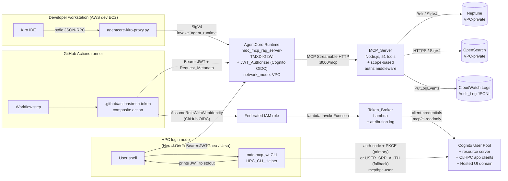
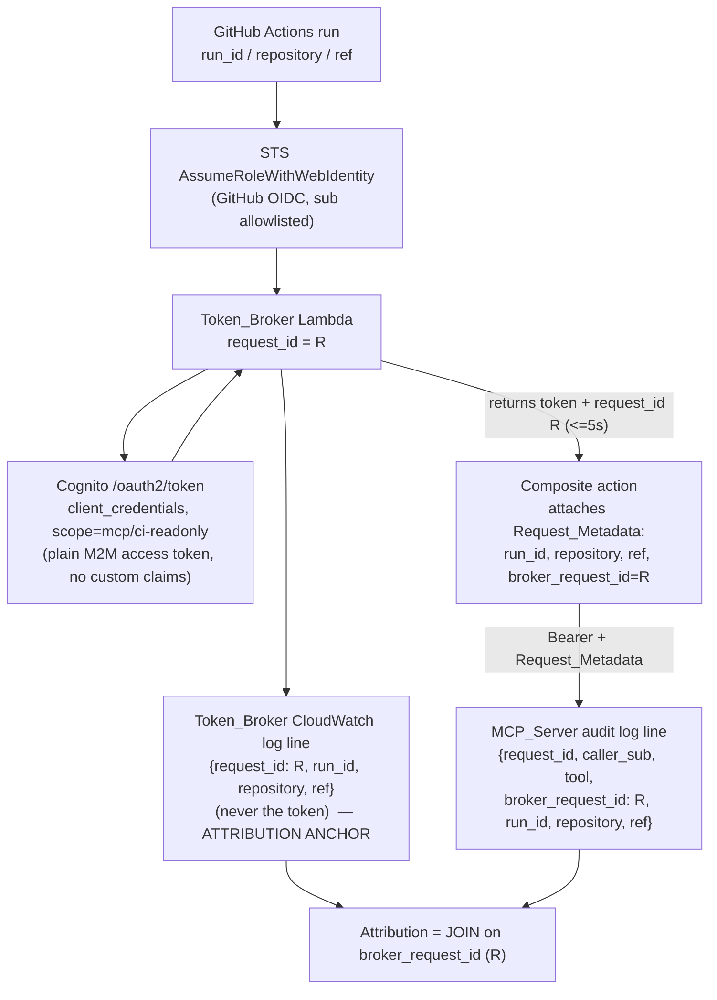
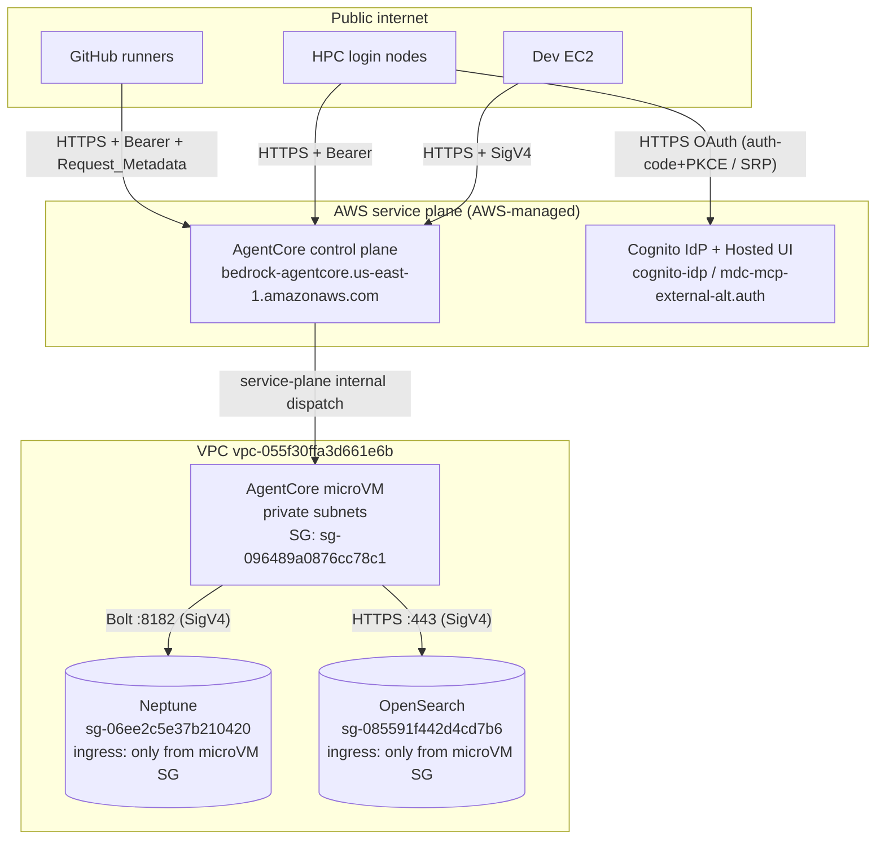

# Design Document: MCP External Access — Alternative (Path B, Cognito JWT on AgentCore Runtime)

## 1. Overview

Expose the MDC MCP RAG Server — currently reachable only via IAM SigV4
`invoke_agent_runtime` from the EC2 developer workstation — to two new external
consumer classes (GitHub Actions CI pipelines and HPC user sessions on Hera /
Orion / Hercules / Gaea / Ursa) by attaching a Cognito-backed JWT authorizer to
the existing AgentCore Runtime `mdc_mcp_rag_server-TMXDllG2Wi`. Consumers connect
over the MCP Streamable HTTP endpoint using a short-lived JWT Bearer token; the
existing developer SigV4 proxy path (`tools/agentcore-kiro-proxy.py`) is preserved
unchanged. Path C (AgentCore Gateway with Cedar tool-level policies) is explicitly
deferred — see §14.

### 1.1 Why this is a scoped alternative

This design is a **scoped alternative** to the original design at
[`.kiro/specs/mcp-external-access/design.md`](../mcp-external-access/design.md). An
AWS representative reviewed the original and identified two defective technical
decisions. This document **restates everything sound in the original so that it
stands alone**, and **replaces exactly two decisions**:

- **AD-1 (HPC authentication).** The original made the OAuth 2.0 Device
  Authorization Grant (RFC 8628) "against Cognito's device flow" the primary HPC
  flow, on the false premise that Amazon Cognito user pools natively implement
  RFC 8628 and expose `/oauth2/device_authorization`. They do not. This design
  makes **Authorization Code + PKCE (RFC 7636) through the Cognito Hosted UI** the
  primary HPC flow, with **`USER_SRP_AUTH` (SRP)** as a flag-selectable headless
  fallback. It explicitly forbids any dependency on a Cognito
  `/oauth2/device_authorization` endpoint (R4.4, R12.2).

- **AD-3 (CI attribution).** The original enriched the CI client-credentials (M2M)
  access token with GitHub run metadata using a Cognito Pre-Token-Generation
  trigger plus a DynamoDB nonce stash. That mechanism silently fails for M2M (see
  §2 AD-3 for the exact failure mode). This design **removes the trigger and the
  DynamoDB stash entirely** and makes the **Token_Broker structured log plus MCP
  Request_Metadata** the attribution anchor, recovered by a log-join on the
  Token_Broker request id (R3.12, R9.10, R13.1–R13.4).

The CDK stack is renamed to **`MdcExternalAccessAlternativeStack`** so the two
designs can coexist in the same repository without collision.

Everything else — the JWT authorizer wiring via `AwsCustomResource`, the network
gating verification, the MCP_Server scope middleware and single-source-of-truth
tool tables, the audit JSON-Lines schema, the CDK data-safety posture, and the
Path C deferral — is carried over from the original and restated here.

### 1.2 Principal paths

The three principal paths converge on the same Runtime:



### 1.3 Three invariants

1. **Developer path is byte-identical.** `tools/agentcore-kiro-proxy.py` and the
   `.kiro/settings/mcp.json` `agentcore-mcp-rag` entry are unchanged. AgentCore
   continues to accept SigV4 alongside JWT on the same Runtime (R2.9, R7.3, R7.4).
2. **Uniform MCP payload.** The MCP_Server receives an identically-shaped MCP
   payload for both auth paths (R2.10). Only the presence of JWT claims in request
   context differs; the scope middleware handles that difference. Absence of the
   AgentCore custom-authorizer-claims header is the signal for the
   `developer-sigv4` principal (R7.2 — see §2 AD-6, §8.2).
3. **Data stores stay VPC-private.** Only the public AgentCore MCP endpoint is
   reachable from GitHub and HPC networks; Neptune and OpenSearch remain reachable
   only from inside `vpc-055f30ffa3d661e6b` (R8.2, R8.3).

Every design decision traces to the requirements document (Appendix A). All
resources are defined in CDK under `infrastructure/cdk/` with `removalPolicy:
RETAIN` on stateful constructs per
[`.kiro/steering/05-cdk-data-safety.md`](../../steering/05-cdk-data-safety.md) (R9).

---

## 2. Architecture Decisions

### AD-1. HPC authentication flow — Cognito-native grants ONLY (R4.2, R4.3, R4.4, R12.1, R12.2, R12.3, R12.4) — **REPLACED DECISION**

**The defect being corrected.** The original design chose the OAuth 2.0 Device
Authorization Grant ([RFC 8628](https://datatracker.ietf.org/doc/html/rfc8628))
as the primary HPC flow, described as running "against Cognito's device flow" on
the premise that "Cognito supports device flow natively on user pools with the
hosted UI enabled." **That premise is false.** Amazon Cognito user pools do **not**
implement RFC 8628 and expose **no** `/oauth2/device_authorization` endpoint. The
native Cognito OAuth endpoints on the Hosted UI domain are limited to
`/oauth2/authorize`, `/oauth2/token`, `/oauth2/userInfo`, `/oauth2/revoke`, and
`/login` — there is no device-authorization endpoint. A client POSTing to
`/oauth2/device_authorization` on a Cognito user-pool domain receives an HTTP 4xx,
never a `device_code`. The original design even flagged this doubt as its open
question OQ-1 yet still committed the device grant as the primary flow.

**This design's decision: use only Cognito-natively-supported grants.**

| Option | Cognito-native? | Headless-capable? | Decision |
|---|---|---|---|
| (a) **Authorization Code + PKCE via Hosted UI (RFC 7636)** | **Yes** — `/oauth2/authorize` + `/oauth2/token` | Yes, via loopback redirect over SSH tunnel (RFC 8252) **or** manual code paste | **PRIMARY** |
| (b) **`USER_SRP_AUTH` (SRP) via `InitiateAuth`** | **Yes** — Cognito SDK auth flow | Yes — no browser, no plaintext password on the wire | **FALLBACK** (flag-selectable) |
| (c) Device Authorization Grant (RFC 8628) against Cognito | **No** — endpoint does not exist | — | **FORBIDDEN** (R4.4, R12.2) |
| (d) Self-hosted RFC 8628 (API GW + Lambda + DynamoDB in front of Cognito) | N/A (custom) | Yes | **Non-primary alternative, documented (R12.3)** |
| (e) NOAA SSO federation into Cognito Hosted UI | Yes (SAML/OIDC IdP) | Yes | **Forward reference only (R12.4)** |

#### 2.1 Primary flow — Authorization Code + PKCE (RFC 7636)

PKCE removes the need for a client secret on a public client and protects the
authorization code in transit on multi-tenant HPC login nodes. The HPC_CLI_Helper
implements the standard PKCE dance against the Cognito Hosted UI domain
(`mdc-mcp-external-alt.auth.us-east-1.amazoncognito.com`):

1. **Generate PKCE material.**
   - `code_verifier` = 43–128 chars of unreserved `[A-Za-z0-9-._~]`, from a CSPRNG
     (`secrets.token_urlsafe(64)`).
   - `code_challenge` = `BASE64URL(SHA256(code_verifier))`, `code_challenge_method=S256`.
2. **Build the `/oauth2/authorize` URL** and either open it (loopback mode) or print
   it for the user to open on their own workstation (manual mode):
   ```
   https://mdc-mcp-external-alt.auth.us-east-1.amazoncognito.com/oauth2/authorize
     ?response_type=code
     &client_id=<HpcAppClientId>
     &redirect_uri=http://127.0.0.1:8765/callback         # loopback mode
     &scope=mcp/hpc-user
     &state=<csprng-state>
     &code_challenge=<code_challenge>
     &code_challenge_method=S256
   ```
3. **Receive the authorization code** by one of two headless-friendly transports:
   - **Loopback redirect (RFC 8252).** The helper binds a one-shot HTTP listener on
     `127.0.0.1:<ephemeral>`; the user tunnels that port over SSH
     (`ssh -L 8765:127.0.0.1:8765 login-node`) and completes auth in the browser on
     their own workstation; Cognito redirects to the loopback URL and the helper
     captures `code` + `state` from the query string.
   - **Manual code paste.** The helper prints the `/oauth2/authorize` URL; the user
     opens it in a workstation browser; Cognito redirects to the loopback URL, which
     fails to load, and the user copies the `code` value from the browser address bar
     and pastes it at the helper's stdin prompt. No inbound connectivity to the login
     node is required.
4. **Exchange the code** at `/oauth2/token`:
   ```
   POST https://mdc-mcp-external-alt.auth.us-east-1.amazoncognito.com/oauth2/token
   Content-Type: application/x-www-form-urlencoded

   grant_type=authorization_code
   &client_id=<HpcAppClientId>
   &code=<authorization_code>
   &redirect_uri=http://127.0.0.1:8765/callback
   &code_verifier=<code_verifier>
   ```
   Cognito verifies `SHA256(code_verifier) == code_challenge` and returns
   `access_token` (scope `mcp/hpc-user`), `id_token`, `refresh_token`, `expires_in`.
   The helper prints only the `access_token` to stdout (R4.5).

The `state` parameter is validated on return to defend against CSRF; a mismatch
aborts with a non-zero exit and empty stdout (R4.12, P9).

#### 2.2 Fallback flow — SRP (`USER_SRP_AUTH`)

For sites that cannot open a browser at all (even on a workstation), a
flag-selectable fallback (`--flow=srp`) uses Cognito's Secure Remote Password
protocol via `boto3` `initiate_auth(AuthFlow='USER_SRP_AUTH', ...)` and the
`RespondToAuthChallenge` exchange. SRP never transmits the plaintext password over
the network (R4.3). This path requires a Cognito-native username/password and is
documented as a fallback, not the default.

#### 2.3 Explicitly forbidden

Per R4.4 and R12.2, the HPC_CLI_Helper **SHALL NOT** POST to
`/oauth2/device_authorization` on the Cognito user-pool domain and **SHALL NOT**
assume such an endpoint exists. No requirement, task, or component in this spec
depends on RFC 8628 against Cognito. Property **P9** enforces that every successful
token was obtained by PKCE or SRP, never a device-code exchange against Cognito.

#### 2.4 Non-primary alternative — self-hosted RFC 8628 (R12.3)

If a true device flow is ever needed (e.g., for appliances with no browser and no
SSH tunnel), the AWS reference architecture stands up a **self-hosted** device grant
**in front of** Cognito: an API Gateway + Lambda implementation of
`/device_authorization` and the device-code token-polling loop, backed by a DynamoDB
table that maps `device_code` → `user_code` → eventual Cognito tokens (the Lambda
completes an authorization-code exchange with Cognito on the user's behalf once the
`user_code` is approved through the Hosted UI). Trade-off relative to the
Cognito-native primary:

- **Added services:** API Gateway + 1–2 Lambdas + a DynamoDB table + their IAM,
  logging, and CDK surface — none of which the PKCE primary needs.
- **Added cost:** per-request API Gateway + Lambda + DynamoDB charges and additional
  operational ownership, versus zero incremental services for PKCE.
- **Added attack surface:** a custom OAuth endpoint the team must secure and patch.

This alternative is documented here (present regardless of whether NOAA SSO
federation in §2.5 is planned, per R12.3) and is **not** adopted for this spec.

#### 2.5 Forward reference — NOAA SSO federation (R12.4)

Federating the Cognito user pool to a NOAA SSO SAML or OIDC identity provider
through the Cognito Hosted UI would let HPC users authenticate with existing NOAA
credentials. Because the primary flow already routes through the Hosted UI, enabling
federation would **require no HPC_CLI_Helper change** — the Hosted UI simply
redirects through the NOAA IdP before returning the authorization code. This is
recorded as a forward reference and is **out of scope** for this spec's
implementation tasks.

### AD-2. VPC-mode + public inbound compatibility (R8.5, R8.6) — **GATING VERIFICATION (carried over)**

**Verification result — REQUIRED BEFORE IMPLEMENTATION.**

Cited sources:

1. AWS Bedrock AgentCore Runtime MCP reference:
   [`runtime-mcp.html`](https://docs.aws.amazon.com/bedrock-agentcore/latest/devguide/runtime-mcp.html)
   — MCP server containers are expected at `0.0.0.0:8000/mcp`; the platform adds an
   `Mcp-Session-Id` header. The invocation endpoint is service-managed.
2. AWS Bedrock AgentCore Runtime network configuration:
   [`runtime-network.html`](https://docs.aws.amazon.com/bedrock-agentcore/latest/devguide/runtime-network.html)
   — `PUBLIC` vs `VPC` network modes; the inbound invocation endpoint is operated by
   the AgentCore service (AWS-managed), distinct from the microVM's outbound ENI.
3. AWS re:Post, "Exposing Bedrock AgentCore MCP runtime for external MCP client
   access" — the public MCP invocation URL is reachable regardless of `network_mode`;
   `network_mode` governs the **outbound** plane from the microVM to VPC resources,
   not inbound delivery from the AgentCore service plane.
4. Internal observation: `mdc_mcp_rag_server-TMXDllG2Wi` has `network_mode: VPC` and
   is already successfully invoked from the dev EC2 via SigV4 against the public
   `https://bedrock-agentcore.us-east-1.amazonaws.com/runtimes/...` URL. The SigV4 and
   JWT paths land on the same public endpoint.

**Verification conclusion.** Public inbound MCP traffic **is compatible** with
`network_mode: VPC` because the inbound invocation URL is AWS-service-managed and is
not tied to the microVM ENI. `network_mode: VPC` affects only the outbound data plane
(microVM → Neptune / OpenSearch). The Runtime's existing VPC-mode configuration is
preserved (R8.4).

**Confirmatory test** (must pass and be recorded in §11 before tasks.md work starts):

```
curl -sS -o /tmp/mcp-401.json -w '%{http_code}
' \
  "https://bedrock-agentcore.us-east-1.amazonaws.com/runtimes/arn%3Aaws%3Abedrock-agentcore%3Aus-east-1%3A903050880929%3Aruntime%2Fmdc_mcp_rag_server-TMXDllG2Wi/invocations?qualifier=DEFAULT" \
  -H 'Content-Type: application/json' \
  -H 'Accept: application/json, text/event-stream' \
  -H 'Authorization: Bearer not-a-real-token' \
  -d '{"jsonrpc":"2.0","id":1,"method":"ping"}'
```

Expected: HTTP 401 (not a TCP refusal, not a 502) — proving the public endpoint is
reachable and the authorizer is the component rejecting. **Fallback per R8.6:** if the
test returns a TCP error instead of 401, the design pivots to an AgentCore Gateway
fronting the Runtime (documented in §14 as fallback-promoted-to-primary), and no
implementation task begins until §11 records a passing confirmatory test.

### AD-3. CI attribution — Token_Broker log-join, NO Pre-Token trigger, NO DynamoDB (R3.6, R3.7, R3.12, R6.6, R6.8, R9.10, R13.1–R13.5) — **REPLACED DECISION**

**The defect being corrected.** The original design enriched the CI
client-credentials (M2M) access token with GitHub `run_id` / `repository` / `ref`
using a Cognito **Pre-Token-Generation trigger** plus a **DynamoDB nonce stash**. That
mechanism silently fails for the M2M flow for three compounding reasons:

1. **Client-credentials issues only an access token — there is no ID token.** The
   `grant_type=client_credentials` response contains `access_token` only.
2. **A V1/"basic" Pre-Token-Generation trigger customizes only the ID token.** With no
   ID token in the M2M response, a basic trigger's `claimsOverrideDetails` has nothing
   to attach to — enrichment fires (if at all) into the void.
3. **The nonce channel is not reliably delivered for M2M.** Cognito's
   `ClientMetadata` / `clientMetadata` plumbing that carries a nonce to the trigger is
   defined for user-auth flows (`InitiateAuth` / `RespondToAuthChallenge`), not for the
   raw `/oauth2/token` client-credentials POST. A custom request header is likewise not
   surfaced to the trigger event. So the DynamoDB stash key never reaches the trigger.

The net effect: the audit trail depends on claims that are never actually injected, and
the failure is **silent** — tokens are issued, calls succeed, and attribution is simply
absent. That is exactly the fragility R13.1 and R13.2 forbid.

**This design's decision: make the Token_Broker log plus MCP Request_Metadata the
attribution anchor, joined on the Token_Broker request id.**

There is **no** Pre-Token-Generation trigger and **no** DynamoDB stash table (R9.10).
The CI attribution pipeline is a pure log-join:



**Why this is robust.** The Cognito token stays a plain, unmodified M2M access token —
no reliance on any trigger firing, so there is no silent-failure surface. Attribution
lives in two places that are each independently written by code we control (the
Token_Broker Lambda and the MCP_Server audit logger) and are joined deterministically on
the Token_Broker request id, which the broker returns to the caller and the caller
forwards as Request_Metadata.

**Token_Broker responsibilities (see §4):**
1. Validate the assumed-role `sub` against the CDK repo/ref allowlist (R3.1, R3.10); on
   mismatch return 403 and do not call Cognito.
2. Read the CI app-client secret from Secrets Manager.
3. Call Cognito `/oauth2/token` (`grant_type=client_credentials`, `scope=mcp/ci-readonly`).
4. Return the access token to the caller within 5 s end-to-end (R3.3), **including the
   Token_Broker request id** in the response.
5. Emit **one structured CloudWatch log line keyed by the Token_Broker request id**
   recording the caller's GitHub `run_id`, `repository`, `ref` — and **never** the issued
   token (R3.6, R13.3). This log line is the attribution anchor.

**Composite action responsibilities (see §5):** attach `run_id`, `repository`, `ref`,
and the Token_Broker request id as MCP **Request_Metadata** on every MCP call (R3.7,
R13.4). The MCP_Server audit logger records these four values beside the
AgentCore-validated `sub` (R6.6). Attribution for any audited CI invocation is recovered
by joining its audit line to the Token_Broker line on the shared request id (R3.12).

**Non-primary "fix-in-place" native-JWT alternative (R13.5).** If native-JWT CI
attribution is ever required instead of the log-join, the correct fix is **not** the
original's broken configuration but the following three coordinated changes:
- Switch to the **V2 access-token-customization** Pre-Token-Generation trigger (V2 can
  customize the **access** token, unlike V1/basic which only customizes the ID token).
- **Enable access-token customization** on the CI_App_Client (advanced security /
  token-customization must be turned on).
- **Resolve the M2M claim-passing channel** — establish a reliable way to convey the
  GitHub context to the trigger for the client-credentials flow (e.g., a broker-minted
  short-lived per-request association the trigger can read), since `clientMetadata` and
  custom headers are not reliably delivered for M2M.

Trade-off: this re-introduces an M2M-fragile trigger plus supporting state and its
cross-service debugging burden, versus the **log-join primary's** simplicity (no trigger,
no DynamoDB, no silent-failure surface). This spec adopts the log-join and documents the
fix-in-place path as explicitly non-primary.

### AD-4. Stack placement and naming (R9.1) — **renamed**

**Decision.** New stack `MdcExternalAccessAlternativeStack`, file
`infrastructure/cdk/lib/mdc-external-access-alternative-stack.ts`, added to
`bin/cdk.ts` with `addDependency(serverStack)`. The rename (from the original's
`MdcExternalAccessStack`) lets both designs coexist in the repository without logical-ID
or stack-name collisions.

**Why a dedicated stack (not extending `MdcSecurityStack`).** `MdcSecurityStack` already
exposes `ecsSecurityGroup`, `ecsTaskRole`, `ecsExecutionRole`, `webAcl` consumed by other
stacks; adding Cognito + Lambda would bloat its single-responsibility scope. A dedicated
stack keeps `cdk diff MdcExternalAccessAlternativeStack` trivially auditable and makes the
data-safety test file a single-purpose artifact.

**Runtime authorizer coupling.** The Runtime is created outside CDK (via the
`agentcore` toolkit). The stack references the Runtime ARN as a parameter and applies the
authorizer via an `AwsCustomResource` calling `bedrock-agentcore-control:UpdateAgentRuntime`
(see §7).

### AD-5. Allowed_Tool_Set concrete enumeration (R5) — **carried over**

Decision logic applied to the 51-tool list (per
`.github/instructions/eib-mcp-tools.instructions.md`):

- **Mutation_Tool_Set** (R5.4) — tools that mutate persistent state:
  `mark_as_modified`, `checkpoint_state`, `restore_checkpoint`, `start_sdd_session`,
  `record_sdd_step`, `complete_sdd_session`. (The glossary also lists
  `mcp_create_profile`, a gateway-only tool not in the 51-tool Runtime list; noted for
  clarity.) *Excluded from both JWT scopes.*
- **GitHub Integration tools** — `search_issues`, `get_pull_requests`,
  `analyze_workflow_dependencies`, `analyze_repository_structure`: read-only at the MCP
  boundary but call GitHub with the server's `GITHUB_TOKEN`. CI runs inside GitHub
  Actions and already holds `${{ github.token }}`, so exposing the server token to CI
  callers would conflate identities. **Excluded from `mcp/ci-readonly`**; included in
  `mcp/hpc-user` (R5.5).
- **SDD read-only subset** — `list_sdd_workflows`, `get_sdd_workflow`, `get_sdd_session`,
  `get_sdd_execution_history`, `validate_sdd_compliance`, `get_sdd_framework_status` are
  read-only and safe for both scopes.

Concrete enumeration lives in §10.

### AD-6. MCP_Server JWT claim propagation + developer-sigv4 principal (R5.1, R7.2) — **SUPERSEDED 2026-08-06: MECHANISM INVALID**

> **The propagation mechanism below is unverified and almost certainly wrong.** AWS
> documents claim propagation to a Runtime as an **opt-in request-header allowlist**
> (`RequestHeaderConfiguration`) after which the container decodes `Authorization` itself;
> the `X-Amzn-Bedrock-AgentCore-Runtime-Custom-Authorizer-Claims` header relied on below is
> not documented as an automatic passthrough. Under the adopted Path C the JWT is validated
> at the **Gateway**, so no authorizer-claims header exists at the Runtime at all.
>
> **Replacement:** a Gateway REQUEST interceptor Lambda injects
> `X-Amzn-Bedrock-AgentCore-Runtime-Custom-Principal`, `-Scope`, and `-BrokerRequestId`
> (`X-Amzn-Bedrock-AgentCore-Runtime-Custom-*` is the only permitted `X-Amzn-` prefix).
> Interceptor-supplied headers take precedence over client-supplied ones, which is what
> makes principal and scope unspoofable. **The AD-6 *intent* survives intact** — including
> "absence of the trusted header ⇒ `developer-sigv4` principal"; only the header names and
> their producer change. See `decision-log.md` F-8.

**AgentCore claim passthrough.** Per the AgentCore Runtime MCP authorization docs, when
the JWT authorizer validates a token, AgentCore forwards the request to the container
with the original `Authorization: Bearer <jwt>` header preserved and an
`X-Amzn-Bedrock-AgentCore-Runtime-Custom-Authorizer-Claims` header carrying the decoded
JWT claims as base64url-encoded JSON.

**Middleware choice.** The middleware reads claims from
`X-Amzn-Bedrock-AgentCore-Runtime-Custom-Authorizer-Claims` (the authoritative,
AgentCore-validated source). **The SigV4 developer path carries no such header**, so the
middleware treats the **absence** of that header as the `developer-sigv4` principal
(R7.2) and applies the all-51-tools Allowed_Tool_Set — a separate auth path that bypasses
the JWT requirement entirely. The middleware never re-validates the JWT signature;
AgentCore is the trust boundary per R2, and re-validation would duplicate work and risk
key-rotation skew.

---

## 3. Cognito Design

Single user pool, one resource server, two app clients, one Hosted UI domain. **No
Pre-Token-Generation trigger** (AD-3, R9.10).

### 3.1 User pool (R1.1, R1.2)

```typescript
// infrastructure/cdk/lib/mdc-external-access-alternative-stack.ts (excerpt)
const userPool = new cognito.UserPool(this, 'McpUserPool', {
  userPoolName: 'mdc-mcp-external-access-alt',
  selfSignUpEnabled: false,                          // admin-only provisioning for HPC users
  signInAliases: { email: true, username: true },
  accountRecovery: cognito.AccountRecovery.EMAIL_ONLY,
  passwordPolicy: {
    minLength: 14, requireLowercase: true, requireUppercase: true,
    requireDigits: true, requireSymbols: true,
    tempPasswordValidity: cdk.Duration.days(1),
  },
  mfa: cognito.Mfa.OPTIONAL,
  mfaSecondFactor: { sms: false, otp: true },
  advancedSecurityMode: cognito.AdvancedSecurityMode.ENFORCED,
  // NOTE: intentionally NO lambdaTriggers.preTokenGeneration — see AD-3 / R9.10.
  removalPolicy: cdk.RemovalPolicy.RETAIN,           // R1.2, R9.2
});
```

`removalPolicy: RETAIN` guarantees a `cdk destroy` does not delete the pool or its users
(R1.2).

### 3.2 Hosted UI domain (R1.6)

The Hosted UI domain serves the Authorization_Code_PKCE_Flow pages (AD-1 §2.1):

```typescript
const userPoolDomain = new cognito.UserPoolDomain(this, 'McpUserPoolDomain', {
  userPool,
  cognitoDomain: { domainPrefix: 'mdc-mcp-external-alt' },
  // → mdc-mcp-external-alt.auth.us-east-1.amazoncognito.com
});
```

### 3.3 Resource server and scopes (R1.3)

```typescript
const ciReadonly = new cognito.ResourceServerScope({
  scopeName: 'ci-readonly',
  scopeDescription: 'CI read-only access to MCP server analysis tools',
});
const hpcUser = new cognito.ResourceServerScope({
  scopeName: 'hpc-user',
  scopeDescription: 'HPC user access including GraphRAG and GitHub integration',
});

const resourceServer = userPool.addResourceServer('McpResourceServer', {
  identifier: 'mcp',
  userPoolResourceServerName: 'MCP Server Scopes',
  scopes: [ciReadonly, hpcUser],                     // R1.3: exactly these two custom scopes
});
```

Fully-qualified scope strings are therefore `mcp/ci-readonly` and `mcp/hpc-user`.

### 3.4 CI app client — client-credentials only (R1.4)

```typescript
const ciAppClient = userPool.addClient('CiAppClient', {
  userPoolClientName: 'mdc-mcp-ci',
  generateSecret: true,                              // R1.4: generated client secret
  oAuth: {
    flows: { clientCredentials: true, authorizationCodeGrant: false, implicitCodeGrant: false },
    scopes: [cognito.OAuthScope.resourceServer(resourceServer, ciReadonly)],  // only mcp/ci-readonly
  },
  authFlows: { adminUserPassword: false, userPassword: false, userSrp: false, custom: false },
  accessTokenValidity: cdk.Duration.minutes(60),     // R1.8, R3.8 (300–3600 s)
  idTokenValidity: cdk.Duration.minutes(60),
  refreshTokenValidity: cdk.Duration.hours(1),
  preventUserExistenceErrors: true,
  // NOTE: no access-token-customization trigger enabled — plain M2M token (AD-3).
});
```

The secret is stored in Secrets Manager for the Token_Broker to read at runtime:

```typescript
const ciSecret = new secretsmanager.Secret(this, 'CiAppClientSecret', {
  secretName: 'mdc-mcp-external-access-alt/ci-app-client',
  secretObjectValue: {
    client_id: cdk.SecretValue.unsafePlainText(ciAppClient.userPoolClientId),
    client_secret: ciAppClient.userPoolClientSecret,
  },
  removalPolicy: cdk.RemovalPolicy.RETAIN,           // R9.3 — stateful
});
```

### 3.5 HPC app client — Authorization Code + PKCE (primary) + SRP (fallback) (R1.5)

```typescript
const hpcAppClient = userPool.addClient('HpcAppClient', {
  userPoolClientName: 'mdc-mcp-hpc',
  generateSecret: false,                             // public client — PKCE, no secret (RFC 7636)
  oAuth: {
    flows: {
      clientCredentials: false,                       // R1.5: disabled
      authorizationCodeGrant: true,                   // R1.5: primary flow (PKCE enforced by public client)
      implicitCodeGrant: false,
    },
    scopes: [cognito.OAuthScope.resourceServer(resourceServer, hpcUser)],  // only mcp/hpc-user
    callbackUrls: [
      'http://127.0.0.1:8765/callback',               // RFC 8252 loopback (primary transport)
      'http://localhost:8765/callback',               // loopback alias
      // Manual-code-paste uses the same loopback redirect; the user copies the code
      // from the browser URL when the loopback page does not load. No extra callback needed.
    ],
  },
  authFlows: {
    userSrp: true,                                    // R1.5: USER_SRP_AUTH fallback enabled
    userPassword: false,                              // R1.5: ROPC / USER_PASSWORD_AUTH disabled
    adminUserPassword: false,
    custom: false,
  },
  enableTokenRevocation: true,
  accessTokenValidity: cdk.Duration.minutes(60),     // R1.8, R4.11 (300–3600 s)
  idTokenValidity: cdk.Duration.minutes(60),
  refreshTokenValidity: cdk.Duration.days(1),
  preventUserExistenceErrors: true,
});
```

Because the client is public (`generateSecret: false`) and only the
authorization-code grant is enabled, Cognito requires PKCE for the authorization-code
exchange — satisfying the RFC 7636 primary flow. `userSrp: true` enables the headless
SRP fallback. The client-credentials grant and ROPC are both disabled (R1.5).

### 3.6 Token structure (R1.8, R1.9)

Every issued access token carries:

| Claim | Value | Requirement |
|---|---|---|
| `iss` | `https://cognito-idp.us-east-1.amazonaws.com/<userPoolId>` | R1.9, R2.3 |
| `client_id` | CI or HPC app client id | R1.9, R2.3 |
| `aud` | app client id (where present) | R2.3 |
| `sub` | CI: the client id; HPC: the Cognito user UUID | R1.9, R4.10 |
| `scope` | exactly `mcp/ci-readonly` (CI) or `mcp/hpc-user` (HPC) | R1.9, P7 |
| `token_use` | `access` | standard |
| `iat` | issuance epoch | R1.9 |
| `exp` | `iat + configured lifetime` (300–3600 s) | R1.8, R1.9, R3.8, R4.11 |
| `jti` | UUID | standard |

**No GitHub attribution claims are injected into CI tokens** — that is the whole point of
AD-3. CI attribution is carried out-of-band via Request_Metadata and recovered by
log-join (R3.12, R6.8, R13.1).

### 3.7 Discovery document (R1.7)

Cognito automatically publishes
`https://cognito-idp.us-east-1.amazonaws.com/<userPoolId>/.well-known/openid-configuration`
and the matching JWKS at `jwks_uri`. The document includes `issuer`, `jwks_uri`,
`token_endpoint`, `authorization_endpoint`, and `scopes_supported` (which contains both
`mcp/ci-readonly` and `mcp/hpc-user` from the resource server). No CDK action is needed
beyond creating the pool and resource server; the discovery URL is stamped into the
AgentCore authorizer config (§7).

### 3.8 Scope and client rejection (R1.10, R1.11)

Cognito's token endpoint natively returns:
- `invalid_scope` when a requested scope is not in the client's allowed scopes and issues
  no token (R1.10).
- `invalid_client` when the `client_id` is unknown or the `client_secret` mismatches, and
  issues no token (R1.11).

No custom logic is required; CDK integration tests exercise both rejection paths (§13,
P2).

---

## 4. Token_Broker Lambda Design

The Token_Broker is deliberately **simple**: assume-role → allowlist check → read secret
→ mint plain M2M token → return token + request id → emit one attribution log line. There
is **no DynamoDB stash** and **no Pre-Token-Generation trigger** (AD-3, R9.10).

### 4.1 Handler (Python 3.12 runtime)

```python
# infrastructure/cdk/lambda/token_broker/index.py
import json, os, time, re, boto3, urllib.parse, urllib.request
from typing import Any

ALLOWED_SUB_PATTERNS = [re.compile(p) for p in json.loads(os.environ['ALLOWED_SUB_PATTERNS_JSON'])]
COGNITO_TOKEN_ENDPOINT = os.environ['COGNITO_TOKEN_ENDPOINT']
CI_CLIENT_SECRET_ARN   = os.environ['CI_CLIENT_SECRET_ARN']

_secrets = boto3.client('secretsmanager')

def handler(event: dict, context: Any) -> dict:
    request_id = context.aws_request_id          # THE attribution join key (R3.6, R13.3)
    t0 = time.monotonic()

    gh = event.get('github_claims', {})
    github_sub = gh.get('sub', '')
    run_id     = gh.get('run_id', '')
    repository = gh.get('repository', '')
    ref        = gh.get('ref', '')

    # 1. Enforce repo/ref allowlist BEFORE any Cognito call (R3.10).
    if not any(p.match(github_sub) for p in ALLOWED_SUB_PATTERNS):
        _attrib_log(request_id, run_id, repository, ref, event_type='forbidden_repository')
        return _respond(403, {'error': 'forbidden_repository', 'request_id': request_id})

    # 2. Read CI client secret.
    secret = json.loads(_secrets.get_secret_value(SecretId=CI_CLIENT_SECRET_ARN)['SecretString'])

    # 3. Mint a PLAIN client-credentials access token (no custom claims — AD-3).
    body = urllib.parse.urlencode({
        'grant_type':    'client_credentials',
        'scope':         'mcp/ci-readonly',
        'client_id':     secret['client_id'],
        'client_secret': secret['client_secret'],
    }).encode('utf-8')
    req = urllib.request.Request(
        COGNITO_TOKEN_ENDPOINT, data=body, method='POST',
        headers={'Content-Type': 'application/x-www-form-urlencoded'},
    )
    try:
        with urllib.request.urlopen(req, timeout=3) as resp:
            token_body = json.loads(resp.read())
    except Exception as exc:                       # R3.11
        _attrib_log(request_id, run_id, repository, ref, event_type='upstream_failure')
        return _respond(502, {'error': 'upstream_token_issuance_failed',
                              'detail': str(exc), 'request_id': request_id})

    # 4. Emit the ATTRIBUTION ANCHOR log line — keyed by request_id, NEVER the token (R3.6, R13.3).
    _attrib_log(request_id, run_id, repository, ref, event_type='token_issued')

    elapsed_ms = int((time.monotonic() - t0) * 1000)  # R3.3 SLO: <= 5000 ms
    if elapsed_ms > 5000:
        print(json.dumps({'warn': 'slo_breach', 'request_id': request_id, 'elapsed_ms': elapsed_ms}))

    # 5. Return token AND request_id so the caller can forward it as Request_Metadata (R3.7).
    return _respond(200, {
        'access_token': token_body['access_token'],
        'expires_in':   token_body['expires_in'],
        'token_type':   token_body['token_type'],
        'request_id':   request_id,
    })

def _attrib_log(request_id, run_id, repository, ref, event_type):
    # Single structured JSON line; no token material (R3.6, R13.3).
    print(json.dumps({
        'event': event_type, 'request_id': request_id,
        'github_run_id': run_id, 'github_repository': repository, 'github_ref': ref,
    }))

def _respond(status: int, body: dict) -> dict:
    return {'statusCode': status, 'body': json.dumps(body)}
```

### 4.2 Federated IAM role and invoke permission (R3.1, R3.2)

```typescript
const ciOidcRole = new iam.Role(this, 'CiOidcRole', {
  roleName: 'mdc-mcp-alt-gh-oidc-ci',
  assumedBy: new iam.WebIdentityPrincipal(
    'arn:aws:iam::903050880929:oidc-provider/token.actions.githubusercontent.com',
    {
      StringEquals: { 'token.actions.githubusercontent.com:aud': 'sts.amazonaws.com' },
      // R3.1: restrict sub to a CDK-configured repo/ref allowlist.
      StringLike:   { 'token.actions.githubusercontent.com:sub': props.allowedGithubSubPatterns },
    },
  ),
});
tokenBroker.grantInvoke(ciOidcRole);               // R3.2: only this role may invoke the broker
```

The role trust policy restricts the OIDC `sub` so STS rejects any
`AssumeRoleWithWebIdentity` whose `sub` does not match at least one allowlist entry
(R3.1). The Lambda resource policy permits invocation only by this role (R3.2).

### 4.3 Secrets Manager integration (R9.3)

- Secret `mdc-mcp-external-access-alt/ci-app-client` = `{ client_id, client_secret }`,
  `removalPolicy: RETAIN`.
- Only the Token_Broker execution role has `secretsmanager:GetSecretValue` on this ARN.
  The MCP_Server task role has no access.

### 4.4 Attribution log format (R3.6, R13.3)

One JSON line per invocation to the broker's CloudWatch log group
(`/mdc-mcp-rag-alt/token-broker`, `removalPolicy: RETAIN`, 90-day retention):

```json
{"event":"token_issued","request_id":"a1b2-...","github_run_id":"18234567890","github_repository":"NOAA-EMC/global-workflow","github_ref":"refs/heads/main"}
{"event":"forbidden_repository","request_id":"c3d4-...","github_run_id":"1","github_repository":"attacker/fork","github_ref":"refs/heads/main"}
```

The issued token is **never** written to this log (R3.6). The `request_id` is the join key
the MCP_Server audit log uses to recover attribution (R3.12, P10).

### 4.5 Error handling

| Scenario | Response | Requirement |
|---|---|---|
| Assumed-role `sub` not in allowlist | HTTP 403, no Cognito call | R3.10 |
| Cognito unreachable / rejects | HTTP 502, no token returned | R3.11 |
| Broker exceeds 5 s | still returns token; emits `slo_breach` warning | R3.3 SLO |
| Secrets Manager unreachable | HTTP 500 | defensive |

### 4.6 Reserved concurrency

Reserved concurrency of 10 — CI is bursty but low-volume; prevents a runaway workflow from
exhausting the account Lambda pool.

---

## 5. GitHub Actions Composite Action Design

### 5.1 File layout

```
.github/
├── actions/
│   └── mcp-token/
│       ├── action.yml
│       └── README.md          # usage, inputs, outputs
└── workflows/
    └── ee2-analysis.yml       # example consumer workflow (optional reference)
```

### 5.2 `action.yml`

```yaml
name: "Get MDC MCP RAG Bearer Token (alt)"
description: "Exchanges GitHub OIDC for a short-lived Cognito JWT and forwards run attribution as MCP Request_Metadata"
inputs:
  aws-region:
    description: "AWS region of the Cognito user pool and Token_Broker Lambda"
    required: false
    default: "us-east-1"
  aws-role-arn:
    description: "ARN of the federated IAM role to assume via GitHub OIDC"
    required: true
  token-broker-function:
    description: "Name or ARN of the Token_Broker Lambda function"
    required: false
    default: "mdc-mcp-alt-token-broker"
outputs:
  bearer-token:
    description: "The Cognito access token (masked step output)"
    value: ${{ steps.invoke.outputs.bearer }}
  broker-request-id:
    description: "Token_Broker request id — attribution join key, forwarded as Request_Metadata"
    value: ${{ steps.invoke.outputs.broker_request_id }}
  mcp-metadata-json:
    description: "JSON object of Request_Metadata to attach to MCP calls (run_id, repository, ref, broker_request_id)"
    value: ${{ steps.invoke.outputs.mcp_metadata_json }}
  mcp-url:
    description: "The MCP endpoint URL to call with the Bearer token"
    value: ${{ steps.invoke.outputs.mcp_url }}
runs:
  using: "composite"
  steps:
    - name: Configure AWS credentials via GitHub OIDC
      uses: aws-actions/configure-aws-credentials@v4
      with:
        role-to-assume: ${{ inputs.aws-role-arn }}
        aws-region: ${{ inputs.aws-region }}
        audience: sts.amazonaws.com

    - name: Invoke Token_Broker and build Request_Metadata
      id: invoke
      shell: bash
      env:
        FUNCTION: ${{ inputs.token-broker-function }}
      run: |
        set -euo pipefail
        payload=$(jq -n \
          --arg run_id "${GITHUB_RUN_ID}" \
          --arg repo   "${GITHUB_REPOSITORY}" \
          --arg ref    "${GITHUB_REF}" \
          '{github_claims: {sub: ("repo:"+$repo+":ref:"+$ref), run_id:$run_id, repository:$repo, ref:$ref}}')
        aws lambda invoke \
          --function-name "$FUNCTION" \
          --payload "$payload" \
          --cli-binary-format raw-in-base64-out \
          /tmp/broker-response.json >/dev/null
        body=$(jq -r .body /tmp/broker-response.json)
        token=$(echo "$body" | jq -r .access_token)
        rid=$(echo "$body"   | jq -r .request_id)
        if [ -z "$token" ] || [ "$token" = "null" ]; then
          echo "::error::Token_Broker did not return a token: $body" >&2
          exit 1
        fi
        # Request_Metadata forwarded on every MCP call (R3.7, R13.4).
        meta=$(jq -n \
          --arg run_id "${GITHUB_RUN_ID}" \
          --arg repo   "${GITHUB_REPOSITORY}" \
          --arg ref    "${GITHUB_REF}" \
          --arg rid    "$rid" \
          '{run_id:$run_id, repository:$repo, ref:$ref, broker_request_id:$rid}')
        echo "::add-mask::$token"
        echo "bearer=$token"                 >> "$GITHUB_OUTPUT"
        echo "broker_request_id=$rid"        >> "$GITHUB_OUTPUT"
        echo "mcp_metadata_json=$(echo "$meta" | jq -c .)" >> "$GITHUB_OUTPUT"
        runtime_arn_enc="arn%3Aaws%3Abedrock-agentcore%3Aus-east-1%3A903050880929%3Aruntime%2Fmdc_mcp_rag_server-TMXDllG2Wi"
        echo "mcp_url=https://bedrock-agentcore.${{ inputs.aws-region }}.amazonaws.com/runtimes/${runtime_arn_enc}/invocations?qualifier=DEFAULT" >> "$GITHUB_OUTPUT"
```

### 5.3 How Request_Metadata reaches the MCP_Server

The MCP protocol carries a `_meta` object on request params. The composite action's
consumers place the `mcp-metadata-json` values into the MCP `tools/call` request `_meta`
field (the MCP_Server entrypoint reads it — see §8.4). Example consumer step:

```yaml
      - name: Analyze last failed logs
        env:
          MCP_URL:   ${{ steps.mcp.outputs.mcp-url }}
          MCP_TOKEN: ${{ steps.mcp.outputs.bearer-token }}
          MCP_META:  ${{ steps.mcp.outputs.mcp-metadata-json }}
        run: |
          curl -sS "$MCP_URL" \
            -H "Authorization: Bearer $MCP_TOKEN" \
            -H "Content-Type: application/json" \
            -H "Accept: application/json, text/event-stream" \
            -d "$(jq -n --argjson meta "$MCP_META" \
                  '{jsonrpc:"2.0",id:1,method:"tools/call",
                    params:{name:"search_documentation",
                            arguments:{query:"fv3 forecast failure"},
                            _meta:{github_attribution:$meta}}}')"
```

### 5.4 R3 coverage

- File location `.github/actions/mcp-token/` within `.github/` (R3.9).
- Named outputs documented in `action.yml` metadata, including the `broker-request-id`
  and `mcp-metadata-json` that carry attribution (R3.9).
- `::add-mask::` prevents token leakage in step logs (P8).
- No long-lived AWS key or Cognito secret is ever read on the runner — only the ephemeral
  GitHub OIDC token drives the STS assume-role (R3.4, P8).

---

## 6. HPC_CLI_Helper Design (`mdc-mcp-jwt`)

The HPC_CLI_Helper obtains a short-lived `mcp/hpc-user` token via the
Authorization_Code_PKCE_Flow (primary) or SRP (fallback), and prints only the raw token
to stdout. It **never** contacts `/oauth2/device_authorization` (R4.4, R12.2, P9).

### 6.1 Distribution (R4.15)

Package `mdc-mcp-jwt`, published as a wheel to `s3://mdc-mcp-rag-releases/mdc_mcp_jwt/`
and listed in the HPC Runbook:

```bash
python3 -m venv ~/mdc-mcp-jwt-venv
source ~/mdc-mcp-jwt-venv/bin/activate
pip install https://mdc-mcp-rag-releases.s3.us-east-1.amazonaws.com/mdc_mcp_jwt/mdc_mcp_jwt-1.0.0-py3-none-any.whl
```

Runs on Hera, Orion, Hercules, Gaea, Ursa with Python 3.9+ (available via
`module load python` or system package) plus one pinned PyPI dependency set installable to
a user-local venv (R4.15).

### 6.2 Module layout

```
tools/mdc_mcp_jwt/
├── pyproject.toml
├── README.md
├── src/mdc_mcp_jwt/
│   ├── __init__.py
│   ├── __main__.py              # python -m mdc_mcp_jwt entrypoint
│   ├── cli.py                   # argparse, orchestration, stdout/stderr discipline
│   ├── pkce_flow.py             # RFC 7636 auth-code + PKCE via Hosted UI (PRIMARY)
│   ├── loopback.py              # one-shot 127.0.0.1 listener (RFC 8252) + manual-paste path
│   ├── srp_flow.py              # USER_SRP_AUTH via boto3 (FALLBACK, --flow=srp)
│   ├── cache.py                 # atomic 0600 cache write with ownership/mode pre-check
│   └── errors.py                # typed exceptions for stderr formatting
└── tests/
    ├── test_cli.py
    ├── test_pkce_flow.py
    ├── test_cache.py            # property-based: permissions + atomicity
    └── test_stdout_discipline.py
```

### 6.3 `pyproject.toml` (relevant excerpt) (R4.15)

```toml
[project]
name = "mdc-mcp-jwt"
version = "1.0.0"
requires-python = ">=3.9"                 # R4.15
dependencies = [
  "requests>=2.31,<3",                    # PKCE HTTP calls to Hosted UI /oauth2/*
  "boto3>=1.34,<2",                       # SRP fallback (USER_SRP_AUTH) + warrant-style SRP
  "pyjwt>=2.8,<3",                         # decode-only, to read exp/iat for cache TTL display
]

[project.scripts]
mdc-mcp-jwt = "mdc_mcp_jwt.cli:main"
```

Three pinned dependencies, all wheels available for py3.9+. (`boto3` is present on most
HPC images already; if a site forbids it, the PKCE primary flow uses only `requests` and
the SRP fallback can be skipped.)

### 6.4 CLI arguments

```
usage: mdc-mcp-jwt [-h]
                   [--flow {pkce,srp}]                # default: pkce
                   [--auth-transport {loopback,manual}]  # default: loopback
                   [--user-pool-id POOL]
                   [--client-id CLIENT]
                   [--hosted-ui-domain DOMAIN]
                   [--region REGION]
                   [--scope SCOPE]                    # default: mcp/hpc-user
                   [--cache | --no-cache]             # default: --no-cache (R4.7)
                   [--cache-file PATH]
                   [--username USERNAME]              # srp flow only
                   [--timeout SECONDS]                # default: 30 (R4.13)
                   [--verbose]

Obtains a short-lived Cognito JWT for the MDC MCP RAG Server.
Writes the raw token to stdout; all diagnostics to stderr.

Examples:
  export MCP_TOKEN=$(mdc-mcp-jwt)                                   # PKCE, loopback
  export MCP_TOKEN=$(mdc-mcp-jwt --auth-transport manual)          # PKCE, paste code
  export MCP_TOKEN=$(mdc-mcp-jwt --flow srp --username alice@noaa.gov)
  mdc-mcp-jwt --cache --cache-file ~/.mdc-mcp-jwt/token
```

Config defaults for `--user-pool-id`, `--client-id`, `--hosted-ui-domain`, `--region` are
read from `~/.mdc-mcp-jwt/config.ini` if present, else required as CLI args (a missing
required input triggers R4.12 behavior).

### 6.5 PKCE flow (primary) — control-flow sketch

```python
# src/mdc_mcp_jwt/pkce_flow.py
import base64, hashlib, secrets, urllib.parse, requests

def _pkce_pair():
    verifier = secrets.token_urlsafe(64)[:128]                       # 43..128 unreserved chars
    challenge = base64.urlsafe_b64encode(
        hashlib.sha256(verifier.encode()).digest()).rstrip(b'=').decode()
    return verifier, challenge

def obtain_token_pkce(domain, client_id, region, scope, transport, deadline):
    verifier, challenge = _pkce_pair()
    state = secrets.token_urlsafe(24)
    redirect_uri = 'http://127.0.0.1:8765/callback'
    authorize_url = f"https://{domain}/oauth2/authorize?" + urllib.parse.urlencode({
        'response_type': 'code', 'client_id': client_id, 'redirect_uri': redirect_uri,
        'scope': scope, 'state': state,
        'code_challenge': challenge, 'code_challenge_method': 'S256',
    })

    # Obtain the authorization code (all prompts to stderr — R4.6).
    if transport == 'loopback':
        code, returned_state = wait_for_loopback_redirect(redirect_uri, authorize_url, deadline)
    else:  # manual
        code, returned_state = prompt_manual_paste(authorize_url)   # prints URL to stderr, reads stdin

    if returned_state is not None and returned_state != state:
        raise AuthStateMismatch()                                    # CSRF guard -> non-zero exit, empty stdout

    # Exchange code + verifier at /oauth2/token (NEVER /oauth2/device_authorization).
    r = requests.post(f"https://{domain}/oauth2/token",
        data={'grant_type': 'authorization_code', 'client_id': client_id,
              'code': code, 'redirect_uri': redirect_uri, 'code_verifier': verifier},
        timeout=5)
    if r.status_code != 200:
        raise CognitoError('token_exchange_failed', r)
    return Token.from_cognito_response(r.json())                     # scope == mcp/hpc-user
```

`wait_for_loopback_redirect` binds a one-shot `http.server` on `127.0.0.1:8765`, opens (or
prints) `authorize_url`, and captures `code`/`state` from the redirect query string over
the user's SSH tunnel. `prompt_manual_paste` prints the URL to stderr and reads the pasted
code from stdin — no inbound connectivity to the login node required. Both honor the
30-second `deadline` (R4.13).

### 6.6 SRP fallback (`--flow=srp`)

Uses `boto3.client('cognito-idp').initiate_auth(AuthFlow='USER_SRP_AUTH', ...)` plus the
`RespondToAuthChallenge` SRP exchange. The plaintext password never traverses the network
(R4.3). Requires `--username`; documented as a fallback for sites that cannot use a
browser at all.

### 6.7 stdout / stderr discipline (R4.5, R4.6, R4.12)

```python
# src/mdc_mcp_jwt/cli.py (relevant portion)
def main() -> int:
    args = parse_args()
    configure_logging(args.verbose)                  # logger -> stderr ONLY
    try:
        validate_inputs(args)                        # raises TokenInputError (R4.12)
        token = obtain_token(args)                   # pkce (default) or srp
        if args.cache:
            write_cache_atomic(args.cache_file, token.access_token)   # R4.8
        sys.stdout.write(token.access_token + "
")  # R4.5: single line, no label/quotes
        sys.stdout.flush()
        return 0
    except TokenInputError as e:                     # R4.12
        print(f"error: missing/invalid input: {e}", file=sys.stderr); return 2
    except (NetworkError, CognitoError) as e:        # R4.13
        print(f"error: cognito endpoint unreachable: {e.category}: {e.endpoint}", file=sys.stderr); return 3
    except CacheFilesystemError as e:                # R4.14
        print(f"error: cache write failed: {e.path}: {e.category}", file=sys.stderr); return 4
    except AuthStateMismatch:
        print("error: state mismatch (possible CSRF); aborting", file=sys.stderr); return 5
    except Exception as e:
        print(f"error: unexpected: {e}", file=sys.stderr); return 99
```

On **every** non-zero-exit path, stdout is empty — no token material is emitted (R4.6,
R4.12, R4.13, R4.14, P9). Property test (§13) generates arbitrary failure configurations
and asserts stdout stays empty on all non-success paths.

### 6.8 Cache file handling (R4.8, R4.9, R4.14)

```python
# src/mdc_mcp_jwt/cache.py
import os, tempfile, stat
from pathlib import Path

def write_cache_atomic(path: str, token: str) -> None:
    target = Path(path).expanduser()
    parent = target.parent
    parent.mkdir(mode=0o700, parents=True, exist_ok=True)

    # Pre-existence verification (R4.9): regular file, owned by caller, mode 0600.
    if target.exists():
        st = target.stat()
        if not stat.S_ISREG(st.st_mode):        raise CacheFilesystemError(target, "not_a_regular_file")
        if st.st_uid != os.getuid():            raise CacheFilesystemError(target, "not_owned_by_user")
        if (st.st_mode & 0o777) != 0o600:       raise CacheFilesystemError(target, "wrong_permissions")

    # Atomic write: temp file in same dir -> chmod 0600 -> fsync -> rename (R4.8, R4.14).
    fd, tmp = tempfile.mkstemp(dir=parent, prefix=".mdc-mcp-jwt-", text=True)
    try:
        os.fchmod(fd, 0o600)                    # 0600 before any content is written (R4.8)
        with os.fdopen(fd, "w") as f:
            f.write(token); f.flush(); os.fsync(f.fileno())
        os.replace(tmp, target)                 # atomic rename within same dir
    except Exception:
        try: os.unlink(tmp)                     # R4.14: never leave a partial cache file
        except OSError: pass
        raise
```

By default no token is written to disk (R4.7). `--cache` enables the guarded write above.

### 6.9 Retry / timeout (R4.13)

`NetworkRetryPolicy`: at most **3** HTTP attempts per endpoint with exponential backoff
(0.5 s, 1.0 s, 2.0 s), and a total wall-clock budget of **30 s** enforced by a
`time.monotonic()` deadline checked before every attempt and passed into the PKCE flow's
`deadline`. On exhaustion: non-zero exit, empty stdout, one stderr line naming the failure
category and the endpoint contacted.

---

## 7. AgentCore Runtime Authorizer Configuration

### 7.1 Target state

The current Runtime config has `authorizer_configuration: null` and
`oauth_configuration: null`. The target state configures a Cognito custom JWT authorizer:

```yaml
authorizer_configuration:
  customJWTAuthorizer:
    discoveryUrl: https://cognito-idp.us-east-1.amazonaws.com/us-east-1_XXXXXXXXX/.well-known/openid-configuration
    allowedAudience:
      - <ciAppClient.userPoolClientId>
      - <hpcAppClient.userPoolClientId>
    allowedClients:
      - <ciAppClient.userPoolClientId>
      - <hpcAppClient.userPoolClientId>
```

The authorizer references the Cognito discovery URL, a non-empty allowed-audience/clients
list, and (via scope enforcement) the allowed scopes (R2.1, R2.3). If AgentCore's config
does not natively express a per-scope allowlist, scope enforcement falls through to the
MCP_Server middleware (§8), which is the single source of truth for tool scoping (R5.11);
this is defense-in-depth, not a regression. Signature validation against the JWKS by
`kid`, `iss`/`aud`/`scope` checks, and `exp`/`nbf` with ≤60 s skew are performed by the
AgentCore authorizer (R2.2, R2.3, R2.4). Failures return HTTP 401 with no claim/tool
metadata in the body (R2.5, R2.6); an unreachable JWKS or missing `kid` returns 401/503
(R2.7).

### 7.2 Applied via AWS SDK custom resource (R2.8)

Native CDK L2 support for AgentCore Runtime authorizers is not yet GA. The stack applies
the configuration via a CloudFormation custom resource that calls
`bedrock-agentcore-control:UpdateAgentRuntime` on create/update:

```typescript
import * as cr from 'aws-cdk-lib/custom-resources';

const runtimeArn = 'arn:aws:bedrock-agentcore:us-east-1:903050880929:runtime/mdc_mcp_rag_server-TMXDllG2Wi';
const discoveryUrl = `https://cognito-idp.${this.region}.amazonaws.com/${userPool.userPoolId}/.well-known/openid-configuration`;

const authorizerUpdate = new cr.AwsCustomResource(this, 'AgentCoreAuthorizerUpdate', {
  onUpdate: {
    service: 'bedrock-agentcore-control',
    action: 'updateAgentRuntime',
    parameters: {
      agentRuntimeArn: runtimeArn,
      authorizerConfiguration: {
        customJWTAuthorizer: {
          discoveryUrl,
          allowedAudience: [ciAppClient.userPoolClientId, hpcAppClient.userPoolClientId],
          allowedClients:  [ciAppClient.userPoolClientId, hpcAppClient.userPoolClientId],
        },
      },
    },
    physicalResourceId: cr.PhysicalResourceId.of('AgentCoreAuthorizerUpdate'),
  },
  policy: cr.AwsCustomResourcePolicy.fromStatements([
    new iam.PolicyStatement({
      actions: ['bedrock-agentcore-control:UpdateAgentRuntime', 'bedrock-agentcore-control:GetAgentRuntime'],
      resources: [runtimeArn],
    }),
  ]),
});
authorizerUpdate.node.addDependency(userPoolDomain, ciAppClient, hpcAppClient);
```

### 7.3 Drift detection (R2.8, R9.9)

Every `cdk deploy` re-applies `updateAgentRuntime`, overwriting any out-of-band change to
match the CDK-defined state (R2.8). A companion nightly "drift detector" CodeBuild job
confirms and alerts:

```bash
aws bedrock-agentcore-control get-agent-runtime --agent-runtime-arn "$RUNTIME_ARN" \
  | jq -r .authorizerConfiguration \
  | diff - infrastructure/cdk/snapshots/authorizer-config.json \
  || { echo "::error::Authorizer drift detected — next cdk deploy will restore"; exit 1; }
```

### 7.4 SigV4 coexistence (R2.9, R7.2) — **SUPERSEDED 2026-08-06: THIS SECTION IS FACTUALLY WRONG. DO NOT IMPLEMENT.**

> **STOP.** AWS documentation states: "An AgentCore Runtime can support either IAM SigV4
> or JWT Bearer Token based inbound auth, but not both simultaneously."
> ([runtime-oauth](https://docs.aws.amazon.com/bedrock-agentcore/latest/devguide/runtime-oauth.html))
> The coexistence behavior asserted below **does not exist**. R2.9 is unsatisfiable as
> written, AD-6's absence-of-header principal detection is invalid, and Property 6 cannot
> be met this way. The project has adopted **Path C (Gateway-fronted)** instead: the
> Runtime stays on SigV4 and an AgentCore Gateway holds the Cognito JWT authorizer.
> See `decision-log.md` in this directory for the full analysis and open decision points.

~~The AgentCore Runtime accepts a valid SigV4 signature **or** a valid Bearer JWT on the same
endpoint when a JWT authorizer is configured; it rejects only requests that have neither.
The Developer_Principal SigV4 path therefore continues to work with no CDK change and no
JWT (R2.9, R7.2). The regression suite (§13, P6) locks this behavior across all 51 tools.~~

---

## 8. MCP_Server Authorization Middleware

### 8.1 Integration point

`mcp_server_node/src/mcp-agentcore-entrypoint.js` already handles `/mcp`. A new middleware
runs inside that handler before `transport.handleRequest(req, res)`:

```javascript
import { authMiddleware } from './auth/authMiddleware.js';

const authContext = authMiddleware(req);
if (authContext.type === 'reject') {
  res.writeHead(authContext.status, { 'Content-Type': 'application/json' });
  res.end(JSON.stringify({ error: authContext.message }));   // no claim/tool leakage (R2.6)
  return;
}
req.mcpPrincipal = authContext;                                // read by the tool dispatcher
```

A second hook checks the Allowed_Tool_Set before invoking any tool:

```javascript
// mcp_server_node/src/auth/toolScopeGuard.js (new)
import { ALLOWED_TOOL_SETS } from './allowedToolSets.js';

export function toolScopeGuard(principal, toolName) {
  const allowed = ALLOWED_TOOL_SETS[principal.scope] ?? null;
  if (allowed === 'ALL') return { ok: true };                            // developer-sigv4 (R5.6)
  if (allowed === null)  return { ok: false, status: 403, code: -32001, message: `unknown scope: ${principal.scope}` };
  if (!allowed.has(toolName))
    return { ok: false, status: 403, code: -32001, message: `tool ${toolName} not permitted for scope ${principal.scope}` };
  return { ok: true };
}
```

Every path that dispatches a tool MUST call `toolScopeGuard` first; failure returns an MCP
JSON-RPC error with `code: -32001` and the associated HTTP status.

### 8.2 `authMiddleware` — SigV4 (developer) vs JWT (R5.1, R5.9, R5.10, R7.2)

```javascript
// mcp_server_node/src/auth/authMiddleware.js (new, complete sketch)
export function authMiddleware(req) {
  // Path A — Developer_Principal (SigV4): AgentCore does NOT set the custom-authorizer-
  // claims header for SigV4 requests. Absence of that header IS the developer-sigv4
  // signal (R7.2). This path bypasses the JWT requirement entirely.
  const claimsHeader = req.headers['x-amzn-bedrock-agentcore-runtime-custom-authorizer-claims'];
  if (!claimsHeader) {
    return { type: 'developer-sigv4', scope: 'developer-sigv4' };
  }

  // Path B — JWT: claims already validated by AgentCore (trust boundary; no re-verify).
  let claims;
  try {
    claims = JSON.parse(Buffer.from(claimsHeader, 'base64url').toString('utf8'));
  } catch {
    return { type: 'reject', status: 401, message: 'malformed claims header' };
  }
  const scope = (claims.scope || '').trim();
  if (!scope) return { type: 'reject', status: 401, message: 'missing scope claim' };   // R5.9

  const mapped = scope.split(/\s+/).find((s) => s === 'mcp/ci-readonly' || s === 'mcp/hpc-user');
  if (!mapped) return { type: 'reject', status: 403, message: `scope not recognized` };  // R5.10

  return { type: 'jwt', scope: mapped, sub: claims.sub };
}
```

Note: CI GitHub attribution is **not** read from JWT claims here (there are none — AD-3);
it arrives as MCP Request_Metadata and is read by the audit logger (§9, §8.4).

### 8.3 Allowed_Tool_Set source file (R5.11) — single source of truth

```javascript
// mcp_server_node/src/auth/allowedToolSets.js (new)
// R5.11: SOLE authority for scope-to-tool authorization. No other module, config file,
// env var, or runtime mechanism may add/remove/override entries. Enforcement: CI lint rule
// `no-tool-set-mutation.js` forbids `ALLOWED_TOOL_SETS.*.add/delete` outside this file;
// CODEOWNERS forces platform-maintainer review.

const CI_READONLY = new Set([
  // Workflow Info (3)
  'get_workflow_structure', 'get_system_configs', 'describe_component',
  // Code Analysis (6)
  'analyze_code_structure', 'find_dependencies', 'trace_execution_path',
  'find_callers_callees', 'trace_full_execution_chain', 'find_env_dependencies',
  // Semantic Search (7)
  'search_documentation', 'find_related_files', 'explain_with_context',
  'get_knowledge_base_status', 'list_ingested_urls', 'get_ingested_urls_array',
  'check_knowledge_integrity',
  // EE2 Compliance (5)
  'search_ee2_standards', 'analyze_ee2_compliance', 'generate_compliance_report',
  'scan_repository_compliance', 'extract_code_for_analysis',
  // Operational (4)
  'get_operational_guidance', 'explain_workflow_component', 'list_job_scripts', 'get_job_details',
  // GraphRAG — read-only subset (5)
  'get_code_context', 'search_architecture', 'find_similar_code',
  'get_change_impact', 'trace_data_flow',
  // SDD Workflows — read-only subset (6)
  'list_sdd_workflows', 'get_sdd_workflow', 'get_sdd_session',
  'get_sdd_execution_history', 'validate_sdd_compliance', 'get_sdd_framework_status',
  // Utility (4)
  'get_server_info', 'mcp_health_check', 'get_health_trend', 'get_quality_metrics',
]);                                                    // = 40 tools

const HPC_USER_ADDITIONS = new Set([
  // GraphRAG session-state tools (HPC users need session continuity)
  'mark_as_modified', 'get_session_context', 'checkpoint_state', 'restore_checkpoint',
  // GitHub Integration (4) — excluded from CI, available to HPC
  'search_issues', 'get_pull_requests', 'analyze_workflow_dependencies', 'analyze_repository_structure',
]);                                                    // = 8 additions

const HPC_USER = new Set([...CI_READONLY, ...HPC_USER_ADDITIONS]);   // = 48 tools

export const ALLOWED_TOOL_SETS = {
  'mcp/ci-readonly': CI_READONLY,
  'mcp/hpc-user':    HPC_USER,
  'developer-sigv4': 'ALL',                            // sentinel — all 51 tools (R5.6)
};

export const MUTATION_TOOL_SET = new Set([
  'mark_as_modified', 'checkpoint_state', 'restore_checkpoint',
  'start_sdd_session', 'record_sdd_step', 'complete_sdd_session',
]);                                                    // 6 tools

export const _testing = { CI_READONLY, HPC_USER, HPC_USER_ADDITIONS };
```

### 8.4 Reading Request_Metadata for audit (R6.6, R6.8, R13.4)

The dispatcher extracts GitHub attribution from the MCP request `_meta` (never from JWT
claims), passing it to the audit logger:

```javascript
// inside the tools/call handler, after toolScopeGuard passes
const meta = req.body?.params?._meta?.github_attribution ?? {};
const attribution = {
  github_run_id:      meta.run_id            ?? null,   // R6.7: explicit null, never omitted
  github_repository:  meta.repository        ?? null,
  github_ref:         meta.ref               ?? null,
  broker_request_id:  meta.broker_request_id ?? null,
};
emitAuditEntry(buildAuditEntry(req.mcpPrincipal, toolName, outcome, requestId, attribution));
```

### 8.5 R5 criterion coverage map

| R5 criterion | Implementation |
|---|---|
| 5.1 read validated claims from context | `authMiddleware` runs before dispatch |
| 5.2 Allowed_Tool_Set per scope, explicit enumeration | `allowedToolSets.js` — three explicit sets |
| 5.3 CI read-only from listed modules | `CI_READONLY` — no Mutation_Tool_Set member |
| 5.4 CI excludes Mutation_Tool_Set | test `ci-readonly-excludes-mutation.test.js` |
| 5.5 HPC = CI + GraphRAG + GitHub | `HPC_USER = CI_READONLY ∪ HPC_USER_ADDITIONS` |
| 5.6 Developer = all 51 | `'developer-sigv4': 'ALL'` sentinel |
| 5.7 missing required scope → 403 | `toolScopeGuard` returns 403 (`-32001`) |
| 5.8 scope present, tool absent → 403 | same path, tool-specific message |
| 5.9 no JWT / absent-null-empty scope → 401 | `authMiddleware` returns 401 |
| 5.10 unrecognized scope → 403 | `authMiddleware` returns 403 |
| 5.11 single source file | `allowedToolSets.js` + lint + CODEOWNERS |

---

## 9. Audit Logging Design

### 9.1 JSON Lines schema (R6.2, R6.3, R6.4, R6.6, R6.7)

```json
{
  "ts":                "2026-05-12T14:23:45.127Z",
  "request_id":        "01HXYZABCDEF...",
  "caller_sub":        "5e2a...-cognito-uuid  |  developer-sigv4",
  "scope":             "mcp/ci-readonly",
  "tool":              "analyze_code_structure",
  "outcome":           "success",
  "github_run_id":     "18234567890",
  "github_repository": "NOAA-EMC/global-workflow",
  "github_ref":        "refs/heads/main",
  "broker_request_id": "a1b2-broker-request-id"
}
```

Field rules:

| Field | Type | When present |
|---|---|---|
| `ts` | ISO-8601 UTC, ms precision | always (R6.3) |
| `request_id` | MCP request id | always (R6.3) |
| `caller_sub` | string | always — JWT `sub` for CI/HPC, literal `developer-sigv4` for SigV4 (R6.2) |
| `scope` | `mcp/ci-readonly` \| `mcp/hpc-user` for JWT callers; omitted/`developer-sigv4` for SigV4 | R6.3 |
| `tool` | tool name | always (R6.3) |
| `outcome` | `success` \| `authorization_denied` \| `execution_error` | always (R6.3) |
| `github_run_id` | string or `null` | CI callers — value or explicit `null` (R6.6, R6.7) |
| `github_repository` | string or `null` | CI callers (R6.6, R6.7) |
| `github_ref` | string or `null` | CI callers (R6.6, R6.7) |
| `broker_request_id` | string or `null` | CI callers — **the join key to the Token_Broker log** (R3.12, R6.6, R6.7) |

Never present (R6.5): raw JWT, tool arguments, tool output.

CI attribution is derived **solely** from Request_Metadata attached to the MCP call, never
from a native token claim (R6.8, R13.1) — the four GitHub fields are joined to the
Token_Broker attribution log on `broker_request_id` (R3.12, P10).

### 9.2 CloudWatch Logs layout

- Log group `/mdc-mcp-rag-alt/audit`, `removalPolicy: RETAIN`, 365-day retention (R9.3).
- Stream per hour per microVM: `mdc_mcp_rag_server-TMXDllG2Wi/{YYYY-MM-DD-HH}/{instance-id}`.
- The Runtime task role receives `logs:CreateLogStream` + `logs:PutLogEvents` on this group
  via a policy attachment in this stack (not a modification of the task role definition).

### 9.3 Non-blocking writer with 2 s timeout (R6.1, R6.9)

```javascript
// mcp_server_node/src/auth/auditLogger.js (sketch)
import { CloudWatchLogsClient, PutLogEventsCommand } from '@aws-sdk/client-cloudwatch-logs';
const client = new CloudWatchLogsClient({ region: process.env.AWS_REGION });
const queue = []; let inflight = null;

export function emitAuditEntry(entry) {                 // called EXACTLY once per invocation (R6.1)
  queue.push({ timestamp: Date.now(), message: JSON.stringify(entry) });
  if (!inflight) inflight = flush();
}

async function flush() {
  while (queue.length) {
    const batch = queue.splice(0, 100);
    try {
      await Promise.race([
        client.send(new PutLogEventsCommand({ logGroupName, logStreamName, logEvents: batch })),
        new Promise((_, rej) => setTimeout(() => rej(new Error('audit_write_timeout')), 2000)),  // R6.9
      ]);
    } catch (err) {                                     // R6.9: separate error entry, never block caller
      console.error(JSON.stringify({
        ts: new Date().toISOString(), level: 'error', event: 'audit_write_failed',
        request_id: /* from batch context */ undefined, reason: err.message,
      }));
    }
  }
  inflight = null;
}
```

The dispatch hook calls `emitAuditEntry` exactly once per tool invocation (R6.1), then
returns the response; the 2-second `Promise.race` timeout guarantees a failed/slow audit
write never blocks the caller and instead emits a separate error entry carrying the MCP
request id (R6.9). Property **P5** verifies exactly-one well-formed no-leak entry per
dispatch.

---

## 10. Allowed Tool Sets — Concrete Enumeration

The 51 MCP_Server tools by module. `CI` = `mcp/ci-readonly`; `HPC` = `mcp/hpc-user`;
`DEV` (developer-sigv4) = all 51.

### 10.1 `mcp/ci-readonly` (40 tools)

| Module | Tool | Read-only? | In CI |
|---|---|---|---|
| Workflow Info | `get_workflow_structure` | yes | ✓ |
| Workflow Info | `get_system_configs` | yes | ✓ |
| Workflow Info | `describe_component` | yes | ✓ |
| Code Analysis | `analyze_code_structure` | yes | ✓ |
| Code Analysis | `find_dependencies` | yes | ✓ |
| Code Analysis | `trace_execution_path` | yes | ✓ |
| Code Analysis | `find_callers_callees` | yes | ✓ |
| Code Analysis | `trace_full_execution_chain` | yes | ✓ |
| Code Analysis | `find_env_dependencies` | yes | ✓ |
| Semantic Search | `search_documentation` | yes | ✓ |
| Semantic Search | `find_related_files` | yes | ✓ |
| Semantic Search | `explain_with_context` | yes | ✓ |
| Semantic Search | `get_knowledge_base_status` | yes | ✓ |
| Semantic Search | `list_ingested_urls` | yes | ✓ |
| Semantic Search | `get_ingested_urls_array` | yes | ✓ |
| Semantic Search | `check_knowledge_integrity` | yes | ✓ |
| EE2 Compliance | `search_ee2_standards` | yes | ✓ |
| EE2 Compliance | `analyze_ee2_compliance` | yes | ✓ |
| EE2 Compliance | `generate_compliance_report` | yes | ✓ |
| EE2 Compliance | `scan_repository_compliance` | yes | ✓ |
| EE2 Compliance | `extract_code_for_analysis` | yes | ✓ |
| Operational | `get_operational_guidance` | yes | ✓ |
| Operational | `explain_workflow_component` | yes | ✓ |
| Operational | `list_job_scripts` | yes | ✓ |
| Operational | `get_job_details` | yes | ✓ |
| GraphRAG | `get_code_context` | yes | ✓ |
| GraphRAG | `search_architecture` | yes | ✓ |
| GraphRAG | `find_similar_code` | yes | ✓ |
| GraphRAG | `get_change_impact` | yes | ✓ |
| GraphRAG | `trace_data_flow` | yes | ✓ |
| GraphRAG | `mark_as_modified` | **no** (mutates session state) | ✗ |
| GraphRAG | `get_session_context` | yes | ✗ *see note* |
| GraphRAG | `checkpoint_state` | **no** (mutates session state) | ✗ |
| GraphRAG | `restore_checkpoint` | **no** (mutates session state) | ✗ |
| GitHub Integration | `search_issues` | yes | ✗ *see note* |
| GitHub Integration | `get_pull_requests` | yes | ✗ *see note* |
| GitHub Integration | `analyze_workflow_dependencies` | yes | ✗ *see note* |
| GitHub Integration | `analyze_repository_structure` | yes | ✗ *see note* |
| SDD Workflows | `list_sdd_workflows` | yes | ✓ |
| SDD Workflows | `get_sdd_workflow` | yes | ✓ |
| SDD Workflows | `start_sdd_session` | **no** (mutates SDD state) | ✗ |
| SDD Workflows | `record_sdd_step` | **no** (mutates SDD state) | ✗ |
| SDD Workflows | `get_sdd_session` | yes | ✓ |
| SDD Workflows | `complete_sdd_session` | **no** (mutates SDD state) | ✗ |
| SDD Workflows | `get_sdd_execution_history` | yes | ✓ |
| SDD Workflows | `validate_sdd_compliance` | yes | ✓ |
| SDD Workflows | `get_sdd_framework_status` | yes | ✓ |
| Utility | `get_server_info` | yes | ✓ |
| Utility | `mcp_health_check` | yes | ✓ |
| Utility | `get_health_trend` | yes | ✓ |
| Utility | `get_quality_metrics` | yes | ✓ |

**Notes on CI exclusions:**

- **Session-state tools** (`mark_as_modified`, `get_session_context`, `checkpoint_state`,
  `restore_checkpoint`, `start_sdd_session`, `record_sdd_step`, `complete_sdd_session`)
  mutate per-session state; CI runs once and exits with no session continuity need. R5.3
  excludes the mutators; `get_session_context` is read-only but incoherent for a CI caller
  and is excluded for consistency (promotable later via a reviewed `allowedToolSets.js`
  change).
- **GitHub Integration tools** call GitHub with the server's `GITHUB_TOKEN`. CI already
  holds `${{ github.token }}`; exposing the server token to CI would conflate identities
  and expand blast radius. Excluded from CI, included in HPC (R5.5).

**Total `mcp/ci-readonly`: 40 of 51.**

### 10.2 `mcp/hpc-user` (48 tools)

All 40 CI tools **plus**:

| Module | Tool | Why in HPC |
|---|---|---|
| GraphRAG | `mark_as_modified` | HPC users iterate on code, need session tracking |
| GraphRAG | `get_session_context` | session continuity across HPC shell sessions |
| GraphRAG | `checkpoint_state` | checkpointing long exploratory work |
| GraphRAG | `restore_checkpoint` | rollback during refactoring |
| GitHub Integration | `search_issues` | issue context from a login node |
| GitHub Integration | `get_pull_requests` | PR lookup from HPC shell |
| GitHub Integration | `analyze_workflow_dependencies` | cross-repo analysis |
| GitHub Integration | `analyze_repository_structure` | repo structure summarization |

**Excluded from `mcp/hpc-user`**: `start_sdd_session`, `record_sdd_step`,
`complete_sdd_session` — SDD session lifecycle is authored by developers inside CDK/Kiro,
not by HPC users exploring code (R5.4-compliant).

**Total `mcp/hpc-user`: 48 of 51.**

### 10.3 Developer SigV4 (all 51)

`'developer-sigv4': 'ALL'` — `toolScopeGuard` returns `{ ok: true }` without consulting a
set (R5.6).

### 10.4 Mutation_Tool_Set (R5.4 cross-reference)

```
mark_as_modified, checkpoint_state, restore_checkpoint,
start_sdd_session, record_sdd_step, complete_sdd_session
```

Six tools. **None appear in `CI_READONLY`.** Verified by
`ci-readonly-excludes-mutation.test.js` asserting `CI_READONLY ∩ MUTATION_TOOL_SET = ∅`
(P3).

---

## 11. Network Architecture

### 11.1 Endpoint surface



### 11.2 Verification result — R8.5

**Status: confirmed compatible (public inbound is compatible with `network_mode: VPC`).**

- Primary reference:
  [`runtime-mcp.html`](https://docs.aws.amazon.com/bedrock-agentcore/latest/devguide/runtime-mcp.html)
  — the public MCP invocation URL format and authorization options; the URL is not gated
  by Runtime `network_mode`.
- Secondary reference:
  [`runtime-network.html`](https://docs.aws.amazon.com/bedrock-agentcore/latest/devguide/runtime-network.html)
  — `network_mode: VPC` governs the outbound plane from the microVM to VPC resources.
- Empirical: `mdc_mcp_rag_server-TMXDllG2Wi` (VPC-mode) already accepts inbound via SigV4
  from dev EC2 on the same public URL JWT callers will use; only the auth mode differs.

The §2 AD-2 confirmatory `curl` (expecting HTTP 401 from a bogus Bearer) is the
implementation gate; its captured timestamp/result is recorded here at the start of the
tasks phase. Per R8.5, implementation tasks **do not start until this result is recorded**.

### 11.3 R8.6 fallback — if verification fails

If the confirmatory test unexpectedly returns a TCP error instead of HTTP 401, the design
pivots to an **AgentCore Gateway** fronting the Runtime:
- Gateway target → Runtime (VPC-mode preserved);
- Gateway attaches the Cognito JWT authorizer;
- Gateway URL is public by definition;
- Trade-off: modest per-invocation cost increase; operationally aligned with Path C (which
  already assumes a Gateway).

Implementation does not begin until either the Runtime verification passes or the design
commits to the Gateway fallback (R8.6).

### 11.3a Dual-Auth Compatibility Gate (C8) — ADDED 2026-07-22

**Context:** Task 0 returned HTTP 403 (not 401, not TCP error) with body:
`"Authorization method mismatch. The agent is configured for a different
authorization method than what was used in your request. Check the agent's
authorization configuration and ensure your request uses the matching method
(OAuth or SigV4)"`.

This passes R8.5 (endpoint reachable) and does NOT trigger R8.6 (no TCP error).
However, the "(OAuth or SigV4)" phrasing indicates AgentCore Runtime may enforce
**single-mode** inbound auth — meaning attaching `customJWTAuthorizer` would
**replace** SigV4 as the inbound auth mode, violating R7 (developer SigV4 path
must remain operational).

**Decision gate (MUST be resolved before any `cdk deploy`):**

| Outcome | Action |
|---------|--------|
| AWS confirms **dual-auth** (SigV4 + JWT coexist on same Runtime) | Deploy Path B as-built (Tasks 1-5 complete) |
| AWS confirms **single-mode** (JWT replaces SigV4) | Execute the §11.3 Path C Gateway pivot: front the Runtime with an AgentCore Gateway that accepts JWT; Runtime stays SigV4-only; developer path unaffected |
| Inconclusive | Test on a throwaway runtime (create test, attach JWT, verify SigV4 still works, delete) |

**Resolution methods (priority order):**
1. Ask AWS technical specialist at the cadence meeting (Option A — zero risk)
2. Test on a disposable runtime (Option B — 1 hour, definitive answer)
3. Assume single-mode and begin Path C Gateway work (Option C — conservative)

All Cognito, Token_Broker, OIDC, and CDK work from Tasks 1-5 carries forward
regardless of outcome — only the "last mile" routing (direct-to-Runtime vs
via-Gateway) changes.

**Status**: UNRESOLVED — scheduled for first AWS technical review cadence.

### 11.4 Data-plane isolation (R8.2, R8.3, R8.7)

Unchanged from current state:
- Neptune (`mdc-mcp-graprag-neptune-1`) ingress SG `sg-06ee2c5e37b210420` accepts only from
  the microVM SG `sg-096489a...` and the dev EC2 SG; the public internet has no route
  (R8.2).
- OpenSearch (`mdc-mcp-rag-search`) ingress SG `sg-085591f442d4cd7b6` follows the same
  pattern (R8.3).
- R8.7 verification test from a host outside the VPC (recorded in the verification artifact):
  ```
  timeout 30 nc -vz mdc-mcp-graprag-neptune-1.cluster-ccdaimu4c86s.us-east-1.neptune.amazonaws.com 8182   # expect timeout
  timeout 30 nc -vz vpc-mdc-mcp-rag-search-5o72hixfx3rryikwb7l5px5sgq.us-east-1.es.amazonaws.com 443       # expect timeout
  ```

### 11.5 TLS (R8.1)

`bedrock-agentcore.us-east-1.amazonaws.com` is served by AWS with a publicly-trusted
certificate; TLS 1.2/1.3 and SAN-matched certs are AWS-managed. Nothing for this spec to
configure.

---

## 12. CDK Stack Layout

### 12.1 New stack: `MdcExternalAccessAlternativeStack`

Files:
- `infrastructure/cdk/lib/mdc-external-access-alternative-stack.ts` — stack definition
- `infrastructure/cdk/lambda/token_broker/index.py` — Token_Broker handler (§4)
- `infrastructure/cdk/test/mdc-external-access-alternative-stack.test.ts` — unit tests
  including DeletionPolicy assertions

**No `infrastructure/cdk/lambda/cognito_claims/` directory and no DynamoDB table** — the
Pre-Token-Generation trigger and claims stash are removed (AD-3, R9.10).

### 12.2 Stack composition in `bin/cdk.ts`

```typescript
import { MdcExternalAccessAlternativeStack } from '../lib/mdc-external-access-alternative-stack';

const externalAccessStack = new MdcExternalAccessAlternativeStack(app, 'MdcExternalAccessAlternativeStack', {
  env,
  runtimeArn: 'arn:aws:bedrock-agentcore:us-east-1:903050880929:runtime/mdc_mcp_rag_server-TMXDllG2Wi',
  mcpServerTaskRole: securityStack.ecsTaskRole,
  allowedGithubSubPatterns: [
    'repo:NOAA-EMC/global-workflow:ref:refs/heads/*',
    'repo:NOAA-EMC/mdc-mcp-rag:ref:refs/heads/*',
  ],
});
externalAccessStack.addDependency(serverStack);
```

### 12.3 Stack exports

| Export | Value | Consumer |
|---|---|---|
| `CiTokenBrokerFunctionName` | `mdc-mcp-alt-token-broker` | `.github/actions/mcp-token/action.yml` default |
| `CiOidcRoleArn` | `arn:aws:iam::903050880929:role/mdc-mcp-alt-gh-oidc-ci` | consumer workflow input |
| `HpcUserPoolId` | `us-east-1_XXXXXXXXX` | HPC Runbook, HPC_CLI_Helper config |
| `HpcAppClientId` | `<client-id>` | HPC Runbook, HPC_CLI_Helper config |
| `HpcUserPoolDomain` | `mdc-mcp-external-alt.auth.us-east-1.amazoncognito.com` | HPC Runbook, PKCE flow |
| `McpEndpointUrl` | full encoded AgentCore MCP URL | both runbooks (Phase-C-portable, §14) |

### 12.4 DeletionPolicy test (R9.4)

```typescript
// infrastructure/cdk/test/mdc-external-access-alternative-stack.test.ts
import { Template, Match } from 'aws-cdk-lib/assertions';
import * as cdk from 'aws-cdk-lib';
import { MdcExternalAccessAlternativeStack } from '../lib/mdc-external-access-alternative-stack';

test('Stateful resources have DeletionPolicy: Retain', () => {
  const app = new cdk.App();
  const stack = new MdcExternalAccessAlternativeStack(app, 'TestStack', {
    env: { account: '123456789012', region: 'us-east-1' },
    runtimeArn: 'arn:aws:bedrock-agentcore:us-east-1:123456789012:runtime/test-runtime',
    mcpServerTaskRole: undefined as any,
    allowedGithubSubPatterns: ['repo:test/test:ref:refs/heads/main'],
  });
  const template = Template.fromStack(stack);
  for (const type of ['AWS::Cognito::UserPool', 'AWS::SecretsManager::Secret', 'AWS::Logs::LogGroup']) {
    for (const [, resource] of Object.entries(template.findResources(type))) {
      expect(resource.DeletionPolicy).toBe('Retain');            // R9.4
    }
  }
});

test('R9.10: no DynamoDB stash table and no Pre-Token-Generation trigger', () => {
  const template = Template.fromStack(stack);
  template.resourceCountIs('AWS::DynamoDB::Table', 0);           // R9.10 — no claims stash
  // The user pool must not declare a PreTokenGeneration Lambda config.
  const pools = template.findResources('AWS::Cognito::UserPool');
  for (const [, p] of Object.entries(pools)) {
    const triggers = p.Properties?.LambdaConfig ?? {};
    expect(triggers.PreTokenGeneration).toBeUndefined();
    expect(triggers.PreTokenGenerationConfig).toBeUndefined();   // R9.10 — no M2M trigger
  }
});

test('R9.5: no existing stateful resource is present in this stack', () => {
  const resources = Template.fromStack(stack).toJSON().Resources as Record<string, any>;
  const forbidden = ['AWS::Neptune::', 'AWS::OpenSearchService::', 'AWS::S3::Bucket', 'AWS::EFS::'];
  for (const [, r] of Object.entries(resources)) {
    for (const prefix of forbidden) expect(r.Type.startsWith(prefix)).toBe(false);   // R9.5
  }
});

test('CI client secret only readable by Token_Broker', () => {
  Template.fromStack(stack).hasResourceProperties('AWS::IAM::Policy', Match.objectLike({
    PolicyDocument: { Statement: Match.arrayWith([ Match.objectLike({
      Action: 'secretsmanager:GetSecretValue',
      Resource: Match.stringLikeRegexp('.*ci-app-client.*'),
    })]) },
  }));
});
```

The R9.4 assertion covers the Cognito user pool, the CI client secret, and any CloudWatch
log groups introduced here; the Neptune cluster, OpenSearch domain, S3 buckets, EFS file
system, and existing AgentCore data surfaces are asserted **absent** from this stack (R9.5)
so their `DeletionPolicy: Retain` in their owning stacks is untouched.

### 12.5 `cdk diff` guardrails (R9.6, R9.7) — per steering 05

The deployment pipeline runs, before every `cdk deploy`:

```bash
cdk diff MdcExternalAccessAlternativeStack > diff.txt
if grep -E '^\[-\] AWS::(Neptune|OpenSearchService|S3|EFS)' diff.txt; then
  echo "::error::destructive diff blocked — requires authorized-reviewer override"
  exit 1                                                          # R9.6 abort before deploy
fi
```

Per [`.kiro/steering/05-cdk-data-safety.md`](../../steering/05-cdk-data-safety.md), `cdk
diff` is reviewed before every `cdk deploy` by an authorized reviewer; the review record
captures reviewer identity, timestamp, and diff content hash and must be ≤24 h old at
deploy time (R9.7). Any destructive diff to a protected resource requires explicit override
by a reviewer listed in steering 05 (R9.6).

### 12.6 CDK-only mutation and drift (R9.8, R9.9)

All Cognito, IAM, and AgentCore configuration for this feature is created, modified, and
deleted exclusively through this stack (R9.8). The nightly drift-detector (CodeBuild)
compares `describe-user-pool`, `get-role`, and `get-agent-runtime` against CDK synth; on
drift it opens a `cdk-drift` issue and the next `cdk deploy` reapplies the intended state
(R9.9). No out-of-band console changes are sanctioned.

---

## 13. Correctness Properties

*A property is a characteristic or behavior that should hold true across all valid
executions of a system — essentially, a formal statement about what the system should do.
Properties serve as the bridge between human-readable specifications and machine-verifiable
correctness guarantees.*

Property-based testing IS appropriate here because the MCP_Server auth middleware, the
HPC_CLI_Helper, the Token_Broker, and the audit logger are pure-logic surfaces with large
input spaces (arbitrary JWT claim shapes, arbitrary scope strings, arbitrary filesystem
states, arbitrary tool names, arbitrary GitHub attribution values). Cognito and AgentCore
service behaviors (token issuance, JWKS validation, `invalid_scope`/`invalid_client`,
network reachability) are exercised by integration/smoke tests, not properties, because
they test AWS services rather than our code and do not vary meaningfully with input; many
R1/R2/R8/R9 criteria are accordingly integration, smoke, or CDK-template assertions. The
prework consolidated redundant criteria into the ten universally-quantified properties
below, matching P1–P10 in `requirements.md`. Each property is implemented by a **single**
property-based test running **≥100 iterations**, tagged
`Feature: mcp-external-access-alternative, Property {n}: {text}`.

### Property 1: Valid token admission

*For any* Cognito-issued JWT whose signature validates against the configured JWKS, whose
`iss` equals the configured issuer, whose `aud`/`client_id` is in the authorizer's
allowed-audience list, whose `exp` is in the future, and whose `scope` maps to an
Allowed_Tool_Set containing the requested tool, the MCP_Endpoint SHALL return a successful
MCP JSON-RPC response.

**Validates: Requirements 1.8, 2.2, 2.3, 2.4, 5.1, 5.2**

### Property 2: Invalid token rejection without claim leakage

*For any* JWT that either (a) has a missing/malformed signature, (b) presents an
`iss`/`aud`/`scope` failing the authorizer check, (c) is expired beyond the 60-second skew
window, or (d) is not a JWT at all (opaque bearer, no header), the MCP_Endpoint SHALL
return HTTP 401 AND the response body SHALL NOT contain any substring equal to any claim
value in the presented token or any tool name from the MCP_Server tool registry.

**Validates: Requirements 2.5, 2.6, 2.7**

### Property 3: CI mutation rejection

*For any* tool invocation whose presented JWT `scope` equals `mcp/ci-readonly` and whose
requested tool is in the Mutation_Tool_Set, the MCP_Server SHALL return an MCP error with
HTTP 403 AND no side-effect on backend state (Neptune, OpenSearch, SDD session-state files,
filesystem) SHALL occur; equivalently, `CI_READONLY ∩ MUTATION_TOOL_SET = ∅`.

**Validates: Requirements 5.3, 5.4, 5.7, 5.8**

### Property 4: Authorization rejection for unknown scope and missing auth

*For any* tool invocation that arrives (a) with no `Authorization` header and no SigV4
signature, or (b) with a JWT whose `scope` claim is absent, null, empty, or contains no
value matching `mcp/ci-readonly` or `mcp/hpc-user`, the MCP_Endpoint SHALL return HTTP 401
(case a) or HTTP 403 (case b) AND SHALL NOT execute the requested tool.

**Validates: Requirements 5.9, 5.10**

### Property 5: Audit entry well-formedness and no-leak

*For any* tool invocation that reaches the MCP_Server dispatcher (any outcome: `success`,
`authorization_denied`, or `execution_error`), exactly one JSON Lines entry SHALL be
emitted to the audit stream such that the entry (i) parses as a single-line UTF-8 JSON
object terminated by `
`; (ii) contains non-empty `ts`, `request_id`, `caller_sub`,
`tool`, `outcome`; (iii) has `caller_sub` equal to the presented JWT `sub` OR the literal
`developer-sigv4` for SigV4; (iv) for CI callers contains `github_run_id`,
`github_repository`, `github_ref`, `broker_request_id` set to their Request_Metadata values
or explicit JSON `null` (never omitted); and (v) contains no substring equal to the raw
JWT, any tool argument, or any tool output.

**Validates: Requirements 6.1, 6.2, 6.3, 6.4, 6.5, 6.6, 6.7**

### Property 6: Developer path preservation across all 51 tools

*For any* tool in the MCP_Server's 51-tool registry, a SigV4 invocation via the unmodified
`tools/agentcore-kiro-proxy.py` and unmodified `.kiro/settings/mcp.json` entry SHALL return
a non-error MCP response structurally identical to the pre-deployment response for the same
invocation.

**Validates: Requirements 2.9, 2.10, 7.2, 7.5**

### Property 7: JWT issuance invariants (scope isolation + lifetime bounds)

*For any* JWT issued by the Cognito user pool to either app client: (i) `scope` equals
exactly `mcp/ci-readonly` (CI) or `mcp/hpc-user` (HPC) — never both, never empty; and
(ii) `300 ≤ (exp - iat) ≤ 3600` seconds.

**Validates: Requirements 1.8, 3.7, 3.8, 4.11**

### Property 8: No long-lived secrets in CI path

*For any* execution of the published composite action `.github/actions/mcp-token` in a
GitHub Actions run, no AWS access key id, AWS secret access key, or Cognito client secret
SHALL be read from the repository working tree, the GitHub Actions `secrets` context, or
any pre-existing runner environment variable — where "read" is defined as absence from the
run's job log (subject to `::add-mask::`) and absence as a source string from the
`.github/actions/mcp-token/*` files.

**Validates: Requirements 3.4, 3.5, 3.9**

### Property 9: HPC token issuance via Cognito-native flow (revised area — AD-1)

*For any* successful HPC_CLI_Helper invocation, the issued token SHALL have been obtained
through either the Authorization_Code_PKCE_Flow or the SRP_Password_Flow — **never** an
RFC 8628 device-code exchange against Cognito and **never** a request to
`/oauth2/device_authorization` — the token's `scope` SHALL equal exactly `mcp/hpc-user`,
and on every non-zero-exit code path stdout SHALL be empty (no token material emitted).

**Validates: Requirements 4.2, 4.3, 4.4, 4.5, 4.6, 4.13, 12.1, 12.2**

### Property 10: CI attribution completeness via log-join / request-metadata (revised area — AD-3)

*For any* successful CI tool invocation, the GitHub `run_id`, `repository`, `ref`, and
Token_Broker request id recorded in the MCP_Server Audit_Log SHALL match the values the
GitHub_Composite_Action supplied as Request_Metadata; each of those four Audit_Log fields
SHALL be present (a string value or explicit JSON `null`, never omitted); the
`broker_request_id` SHALL be joinable to the Token_Broker log entry that recorded the same
GitHub values; and attribution SHALL hold with **no dependence on any
Pre-Token-Generation trigger or native token claim**.

**Validates: Requirements 3.6, 3.7, 3.12, 6.6, 6.7, 6.8, 13.1, 13.2, 13.3, 13.4**

---

## 14. Error Handling

Consolidated error contract across the components:

| Surface | Condition | Response | Requirement |
|---|---|---|---|
| JWT_Authorizer | no/invalid/opaque bearer | HTTP 401, no claim/tool leakage | R2.5, R2.6 |
| JWT_Authorizer | sig/iss/aud/scope/exp check fails | HTTP 401, no leakage | R2.6 |
| JWT_Authorizer | JWKS unreachable or `kid` missing | HTTP 401 or 503 | R2.7 |
| MCP_Server | scope present but tool not in set | HTTP 403 (`-32001`), tool named | R5.8 |
| MCP_Server | no JWT / absent-null-empty scope | HTTP 401 | R5.9 |
| MCP_Server | unmapped scope | HTTP 403 | R5.10 |
| MCP_Server | CI scope + mutation tool | HTTP 403, no side effect | R5.3, R5.4 |
| Audit logger | CloudWatch write >2 s or fails | complete caller response; emit separate error entry w/ MCP request id | R6.9 |
| Token_Broker | assumed-role `sub` not in allowlist | HTTP 403, no Cognito call | R3.10 |
| Token_Broker | Cognito unreachable/rejects | HTTP 502, no token | R3.11 |
| HPC_CLI_Helper | missing/invalid auth input | exit ≠0, empty stdout, stderr names each missing input | R4.12 |
| HPC_CLI_Helper | network/DNS/TLS/HTTP failure | exit ≠0, empty stdout, ≤3 attempts, ≤30 s total | R4.13 |
| HPC_CLI_Helper | cache filesystem error | exit ≠0, empty stdout, no partial file | R4.14 |
| HPC_CLI_Helper | cache ownership/mode pre-check fails | exit ≠0, stderr names path + violation | R4.9 |
| HPC_CLI_Helper | PKCE `state` mismatch | exit ≠0, empty stdout | R4.12, P9 |

Cross-cutting rule: no component ever emits token material to stdout on a failure path
(HPC_CLI_Helper), to a log (Token_Broker, audit logger), or to a response body
(authorizer, middleware) (R3.6, R4.6, R6.5, R13.3).

## 15. Testing Strategy

**Dual approach.** Unit/integration tests cover specific examples, edge cases, AWS-service
behaviors, and CDK synth; property tests cover the ten universal properties.

**Property-based tests (§13).** One property-based test per property P1–P10, each ≥100
iterations, using the standard PBT library for the target language (Hypothesis for the
Python HPC_CLI_Helper / Token_Broker logic; `fast-check` for the Node.js middleware and
audit logger). Each test is tagged
`Feature: mcp-external-access-alternative, Property {n}: {text}`. Properties are not
reimplemented from scratch; the PBT library drives input generation and shrinking.

**Unit / example tests.**
- HPC_CLI_Helper: per error-category exit codes (R4.12–R4.14), cache pre-check outcomes
  (R4.9), atomic-write and no-partial-file (R4.8, R4.14), PKCE `state`/`code_verifier`
  construction, manual-paste transport.
- Middleware: `authMiddleware` header-presence branch (developer-sigv4 vs JWT, R7.2),
  `toolScopeGuard` 401/403 messages (R5.7–R5.10), lint-rule enforcement of the single
  source of truth (R5.11).
- Audit logger: 2 s timeout non-blocking behavior with a mocked slow CloudWatch client
  (R6.9).

**Integration / smoke tests (AWS-service behavior).**
- Cognito `invalid_scope` / `invalid_client` rejection (R1.10, R1.11).
- Token issuance shape and lifetime sampling for P7 (R1.8, R1.9).
- AgentCore authorizer end-to-end admission/rejection for P1/P2 (R2.x).
- Network reachability/isolation `nc`/`curl` observations for R8.5/R8.7, recorded in the
  verification artifact.
- Developer SigV4 regression across all 51 tools for P6 (R7.5) with byte-identical proxy
  and `mcp.json` (R7.3, R7.4 hash checks).

**CDK template assertions (§12.4).** DeletionPolicy: Retain on stateful resources (R9.4);
`AWS::DynamoDB::Table` count == 0 and no PreTokenGeneration config (R9.10); no
Neptune/OpenSearch/S3/EFS resource types present (R9.5); CI-secret read scoped to
Token_Broker only.

---

## Path C — Deferred

*(This section is titled exactly "Path C — Deferred" to satisfy Requirement 11.1. The title
is retained verbatim for that reason only — **Path C is no longer deferred.**)*

> **STATUS CHANGE 2026-08-06 — PATH C IS NOW THE BASELINE.** Because a Runtime cannot serve
> both SigV4 and JWT (see §7.4 banner), deferral is no longer an available option. The
> "Rationale" subsection below — cost, feature maturity, schedule discipline, reversibility
> — is **moot as a deferral argument**; only the cost point survives, as sizing work (DP-6).
>
> **One scope claim below is also wrong.** "Cedar tool-level policies … evaluated per tool
> invocation, replacing the single `allowedToolSets.js` enumeration" is **not available in
> the Runtime-target shape**: Runtime targets use the `http` interceptor payload with a
> **base64-encoded opaque body**, so the Gateway never parses JSON-RPC and cannot see tool
> names natively. Tool gating therefore **stays in the MCP_Server**, meaning §8 and §10
> survive far more intact than this section implies. An interceptor Lambda can optionally
> decode the body and short-circuit with a 403 as defense-in-depth. Full per-tool Cedar
> policy would require the **MCP-target** architecture instead (DP-8).
>
> The four **C-IMPACT** decisions below did their job and should be read as still-binding
> guidance — stateless audit emission, explicit default-deny enumeration, and consumers
> reading `McpEndpointUrl` are exactly what make this migration cheap. See `decision-log.md`.

### Scope

Path C introduces an **AgentCore Gateway** fronting the existing AgentCore Runtime,
providing:

- **Gateway-fronted authorizer** — Cognito (or another OIDC IdP) JWT validation at the
  Gateway rather than the Runtime; the Gateway URL becomes the stable public MCP endpoint,
  so Runtime redeploys no longer force URL changes in CI workflows or HPC configs.
- **Cedar tool-level policies** — authorization expressed as Cedar policy documents
  evaluated per tool invocation, replacing the single `allowedToolSets.js` enumeration and
  enabling richer, code-free rules.
- **Interceptor-based audit enrichment** — Gateway interceptors observe every
  request/response and enrich the audit log with Gateway-side metadata, centralizing audit
  emission away from the MCP_Server.
- **Cross-account resource policies** — the Gateway resource policy can grant access to
  principals in other AWS accounts (e.g., a NOAA partner agency's Cognito pool federating
  in), which the Runtime authorizer cannot directly express.

### Rationale

Path C is deferred because: (1) **cost** — the Gateway is an additional per-invocation
priced service not yet justified by Phase B's two consumer classes and modest volume;
(2) **feature maturity** — Cedar tool-level policy support on the Gateway is newer than the
Runtime JWT authorizer, and adopting it now would expand the AWS-dependency surface;
(3) **schedule discipline** — the Phase B critical path is CI onboarding for EE2 analysis,
and Gateway + Cedar is a multi-week design that would risk a cascade slip; and
(4) **reversibility** — the Phase B `allowedToolSets.js` enumeration is a clean one-file
promotion to Cedar later. Detailed Path C acceptance criteria, CDK constructs, and tasks
are captured in a **separate follow-on spec** created when Path C work begins (R11.3).

### Migration Outline — conceptual steps from Runtime-attached to Gateway-fronted

1. **Stand up an AgentCore Gateway** in a new CDK stack (`MdcMcpGatewayStack`) targeting the
   existing Runtime as a single target; reuse the Phase B Cognito user pool — no user/client
   reprovisioning.
2. **Move the authorizer** from Runtime to Gateway: `UpdateAgentRuntime` with
   `authorizerConfiguration: null`, paired with `UpdateGateway` attaching the identical
   Cognito authorizer.
3. **Update the MCP URL** consumed by the composite action and HPC CLI from the Runtime
   invocation URL to the Gateway URL — a one-line change to the CDK `McpEndpointUrl` output
   (§12.3) that consumers re-pull.
4. **Promote Allowed_Tool_Set to Cedar**: translate `allowedToolSets.js` into
   `ci-readonly.cedar`, `hpc-user.cedar`, `developer-sigv4.cedar`; retain `allowedToolSets.js`
   as defense-in-depth during transition; remove once Cedar coverage is verified at parity.
5. **Move audit emission** from `auditLogger.js` to a Gateway interceptor; keep Runtime-side
   logging during a transitional window to detect gaps; decommission at parity.
6. **Deprecate the direct Runtime URL** for external consumers (SigV4 developer path stays on
   the Runtime, which AgentCore supports natively irrespective of the Gateway).

### Phase B design decisions with Phase C blocking impact (R11.2)

#### Decision C-IMPACT-1: Audit emission location
- **Phase B approach**: `auditLogger.js` inside the MCP_Server emits directly to CloudWatch
  from the Runtime microVM.
- **Blocking impact on Phase C**: if emission encoded business logic or required MCP_Server
  internal state, migrating it to a Gateway interceptor (which sees only request/response
  framing) would be hard.
- **Recommended Phase B approach preserving Phase C**: keep `auditLogger.js` **purely
  stateless** — one entry per invocation derived only from `(principal, tool, outcome,
  request_id, ts, request_metadata)`, all available from the request/response pair. Phase C
  swaps in an interceptor reading the same fields.

#### Decision C-IMPACT-2: Scope enumeration mechanism
- **Phase B approach**: `allowedToolSets.js` hard-codes scopes as explicit `Set` literals.
- **Blocking impact on Phase C**: implicit defaults or runtime-conditional entries would lose
  parity when translated to Cedar (explicit-deny-by-default).
- **Recommended Phase B approach preserving Phase C**: use **explicit enumeration** with a
  default-deny (unknown scope → 403, R5.10); every entry maps 1:1 to a Cedar `permit`.
  Document the Cedar shape in the file header for the future maintainer.

#### Decision C-IMPACT-3: MCP endpoint URL distribution
- **Phase B approach**: authorizer configured on the Runtime; consumers reference the CDK
  `McpEndpointUrl` output rather than a hard-coded URL.
- **Blocking impact on Phase C**: if consumers baked the Runtime invocation URL into CI/HPC
  configs, moving to a Gateway URL would break them.
- **Recommended Phase B approach preserving Phase C**: consumers **always** read the exported
  `McpEndpointUrl`; Phase C updates that single output from Runtime-URL to Gateway-URL and
  consumers re-pull.

#### Decision C-IMPACT-4 (bonus): CI attribution mechanism
- **Phase B approach**: attribution via Token_Broker log + MCP Request_Metadata join
  (AD-3), independent of any token-claim injection.
- **Blocking impact on Phase C**: a Gateway interceptor is the natural place to record
  attribution; if Phase B had coupled attribution to a Runtime-only Pre-Token trigger, the
  interceptor migration would require re-plumbing Cognito.
- **Recommended Phase B approach preserving Phase C**: the log-join keys on
  `broker_request_id` carried in Request_Metadata — a Gateway interceptor can record the
  same field with no Cognito change, so attribution migrates cleanly.

---

## 16. Open Questions / Follow-ups

| ID | Question | Status / plan |
|---|---|---|
| ~~OQ-1~~ | *(original)* Does Cognito support RFC 8628 device flow / `/oauth2/device_authorization`? | **RESOLVED by AD-1.** Cognito user pools do **not** implement RFC 8628. This design uses Authorization Code + PKCE (primary) and SRP (fallback) and forbids any dependency on `/oauth2/device_authorization` (R4.4, R12.2). No open question remains. |
| ~~OQ-3~~ | *(original)* Does a Pre-Token-Generation trigger fire for the M2M client-credentials flow and can it read `ClientMetadata`? | **RESOLVED by AD-3.** It does not reliably fire/enrich for M2M (client-credentials issues only an access token; V1/basic trigger customizes only the ID token; `clientMetadata`/custom headers not delivered for M2M). The trigger and DynamoDB stash are removed; attribution uses the Token_Broker log-join (R3.12, R9.10, R13.1–R13.4). No open question remains. |
| ~~OQ-2~~ | *(original)* Does the AgentCore authorizer expose a scope filter, or must scope enforcement live only in MCP_Server middleware? | **RESOLVED 2026-08-06 — the field exists.** AWS documents `allowedScopes` as a list of strings validated against the token's `scope` claim, alongside `discoveryUrl`, `allowedAudience`, `allowedClients`, and required custom claims. R2.1 and R2.3 are satisfiable as written. The config shape is identical for Runtime or Gateway, so this carries to Path C unchanged. MCP_Server middleware remains as defense-in-depth, not as the sole enforcement point. |

> **2026-08-06 — open questions have moved.** The live decision points for this feature are
> now tracked as **DP-1 … DP-8 in `decision-log.md`** in this directory, not in this table.
> Currently open: **DP-2** (does the gateway-restricting resource policy sever the developer
> path), **DP-4** (gateway role trust hardening), **DP-5** (spec disposition), **DP-6**
> (gateway + interceptor cost), **DP-7** (AWS-side: do buffered interceptors fire — server
> side is resolved via `FASTMCP_JSON_RESPONSE`), **DP-8** (Runtime target vs MCP target).
> Resolved: DP-1 (interceptor header injection), DP-3 (no tool renaming).
| OQ-2 | AgentCore authorizer `allowedScopes` field — docs show `allowedAudience`/`allowedClients` but not a native scope filter. | Resolve during the authorizer CDK task; if scopes are not natively filtered, the MCP_Server middleware (§8, the single source of truth per R5.11) remains the enforcement point (defense-in-depth). |
| OQ-4 | NOAA SSO federation into the Cognito Hosted UI (R12.4). | Forward reference only; requires no HPC_CLI_Helper change (§2.5). Out of scope for this spec. |
| OQ-5 | HPC_CLI_Helper release hosting: S3 vs PyPI. | Default to S3 for v1 (NOAA supply-chain preference); add PyPI later. |
| OQ-6 | Per-principal rate limiting. | Not in Phase B; native throttling arrives with the Path C Gateway. |

## Appendix A. Requirement-to-Section Traceability

| Requirement | Primary section | Secondary sections |
|---|---|---|
| R1 Cognito User Pool & App Clients | §3 | §12 CDK tests, §13 P2/P7 |
| R2 JWT Authorizer | §7 | §8 (defense-in-depth), §13 P1/P2 |
| R3 GitHub Actions Consumer Flow | §4 Token_Broker, §5 Composite Action | §2 AD-3, §9 audit, §13 P8/P10 |
| R4 HPC Consumer Flow | §6 HPC_CLI_Helper | §2 AD-1, §13 P9, §14 error table |
| R5 Server-Side Tool Scoping | §8 middleware, §10 enumeration | §13 P3/P4 |
| R6 Audit Logging | §9 | §8.4, §13 P5/P10 |
| R7 Developer Backward Compatibility | §7.4, §2 AD-6 (R7.2) | §13 P6 |
| R8 Network Reachability & VPC Isolation | §11 | §2 AD-2 gating verification |
| R9 IaC & Data Safety | §12 | §3 (RETAIN), §7.3 drift; R9.10 → §12.4 |
| R10 Documentation | produced in tasks phase (runbooks) | §12.3 exports; CI/HPC SigV4-vs-JWT disambiguation |
| R11 Forward Reference to Path C | "Path C — Deferred" section | §12.3 (`McpEndpointUrl` portability) |
| R12 HPC Auth — Cognito-Native Only | §2 AD-1 (§2.1–§2.5) | §6, §13 P9 |
| R13 CI Attribution — No M2M Trigger | §2 AD-3 | §4, §5, §9, §12.4, §13 P10 |
| Properties P1–P10 | §13 | §15 Testing Strategy |