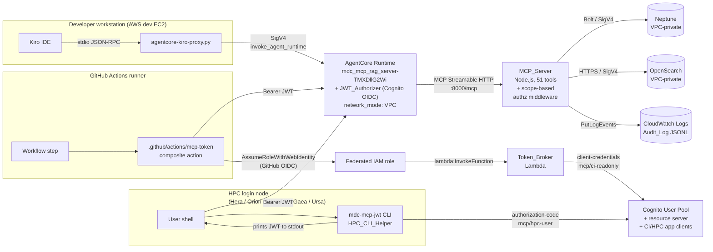
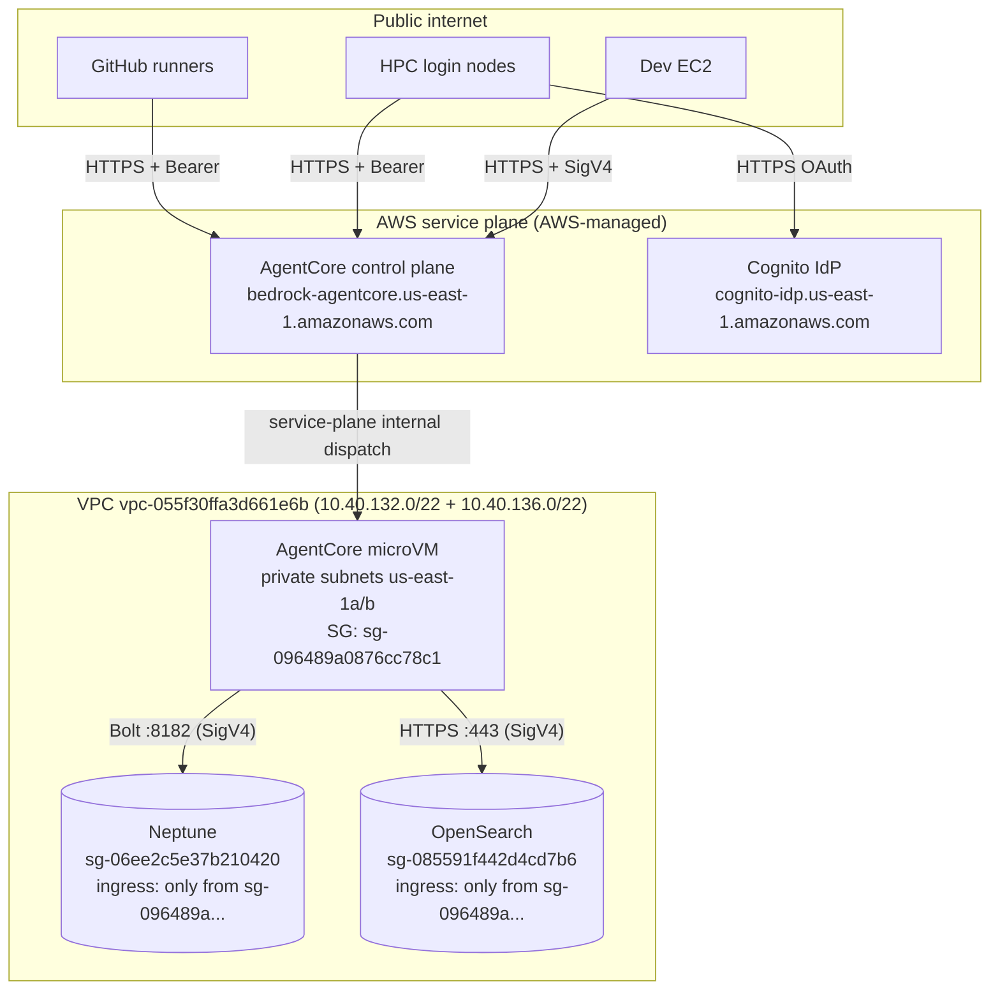

# Design Document: MCP External Access (Path B — Cognito JWT on AgentCore Runtime)

## 1. Overview

Expose the MDC MCP RAG Server — currently reachable only via IAM SigV4
`invoke_agent_runtime` from the EC2 developer workstation — to two new external
consumer classes (GitHub Actions CI pipelines and HPC user sessions on Hera /
Orion / Hercules / Gaea / Ursa) by attaching a Cognito-backed JWT authorizer to
the existing AgentCore Runtime `mdc_mcp_rag_server-TMXDllG2Wi`. This is Path B
from [`docs/reports/2026-05-07-kiro-agentcore-native-connection-options.md`](../../../docs/reports/2026-05-07-kiro-agentcore-native-connection-options.md).
Path C (AgentCore Gateway with Cedar tool-level policies) is explicitly
deferred — see §14.

The three principal paths converge on the same Runtime:



Three key invariants:

1. The Developer path (`tools/agentcore-kiro-proxy.py` + `.kiro/settings/mcp.json`) remains byte-identical. AgentCore continues to accept SigV4 alongside JWT on the same Runtime (R2.9, R7.3, R7.4).
2. The MCP_Server receives an identically-shaped MCP payload for both auth paths (R2.10); only the presence of JWT claims in request context differs, and the scope-based middleware handles that difference.
3. Neptune and OpenSearch stay VPC-private. Only the public AgentCore MCP endpoint is reachable from GitHub and HPC networks. R8.2, R8.3 data-plane isolation is unchanged.

This spec traces every design decision back to the requirements document. All
resources are defined in CDK under `infrastructure/cdk/` with `removalPolicy:
RETAIN` on stateful constructs per [`.kiro/steering/05-cdk-data-safety.md`](../../steering/05-cdk-data-safety.md) (R9).

---

## 2. Architecture Decisions

### AD-1. HPC authentication flow (R4.2)

**Options considered.**

| Option | Summary | Pros | Cons |
|---|---|---|---|
| (a) Cognito user-password (ROPC) with Cognito-native users | HPC_CLI_Helper prompts for `--username` and password, calls `AdminInitiateAuth` with `USER_PASSWORD_AUTH` | Simplest client; no browser on HPC node; works on headless login nodes | Requires Cognito-native user provisioning outside NOAA identity; passwords are long-lived secrets; ROPC is deprecated by OAuth 2.1 |
| (b) **Authorization-code with device/browser hand-off** | HPC_CLI_Helper prints a URL + short code; user opens URL on their laptop (has browser + SSO); laptop finishes auth; HPC_CLI_Helper polls `/oauth2/token` and prints JWT | Best UX for HPC (no password on login node); works with federated IdP; no long-lived secret | Requires polling endpoint; slightly more state machine in HPC_CLI_Helper; first-time users need to open URL |
| (c) Third-party IdP federation (NOAA SSO, Auth0) | Cognito federates to NOAA SAML/OIDC; HPC_CLI_Helper opens browser to Cognito hosted UI | Reuses NOAA credentials; zero new user provisioning | Requires NOAA IAM team cooperation for SAML metadata exchange; schedule risk; SSO identity not confirmed available for all five HPC platforms |

**Recommendation: (b) Authorization-code with device/browser hand-off**, implementing OAuth 2.0 device authorization grant ([RFC 8628](https://datatracker.ietf.org/doc/html/rfc8628)) against Cognito's device flow.

Rationale:
- R4.2 requires "at least one flow that does not require AWS creds on HPC". Device flow satisfies that without the provisioning burden of ROPC.
- HPC login nodes (Hera, Orion, Hercules, Gaea, Ursa) are headless but users universally have a workstation with a browser. The device flow splits authentication (browser) from authorization (HPC shell) cleanly.
- Cognito supports device flow natively on user pools with the hosted UI enabled; no custom OAuth server needed.
- Leaves option (c) as a future enhancement: federating Cognito to NOAA SSO would require no HPC_CLI_Helper change — the browser page simply redirects through NOAA SAML before returning a code.

Tradeoffs accepted:
- HPC_CLI_Helper must poll the Cognito `/oauth2/token` endpoint with `grant_type=urn:ietf:params:oauth:grant-type:device_code` at the `interval` specified by the device-authorization response. First invocation requires ~30 seconds of user interaction.
- Cached tokens (R4.6) mitigate the user-interaction cost across the 300–3600-second token lifetime.

**Alternatives retained for fallback.** If Cognito's device-flow implementation proves incompatible with the Runtime's authorizer expectations, the HPC_CLI_Helper codebase will support a `--flow=password` fallback (option a) as a second supported flow behind a configuration flag. Option (c) is tracked as a Phase B.1 follow-up (see §15).

### AD-2. VPC-mode + public inbound compatibility (R8.5, R8.6) — **GATING VERIFICATION**

**Verification result — REQUIRED BEFORE IMPLEMENTATION.**

Cited sources:

1. AWS Bedrock AgentCore Runtime MCP reference: [`https://docs.aws.amazon.com/bedrock-agentcore/latest/devguide/runtime-mcp.html`](https://docs.aws.amazon.com/bedrock-agentcore/latest/devguide/runtime-mcp.html) — "When you configure a Bedrock AgentCore Runtime with the MCP protocol, the service expects MCP server containers to be available at the path `0.0.0.0:8000/mcp` … The platform automatically adds an `Mcp-Session-Id` header."
2. AWS Bedrock AgentCore Runtime network configuration: [`https://docs.aws.amazon.com/bedrock-agentcore/latest/devguide/runtime-network.html`](https://docs.aws.amazon.com/bedrock-agentcore/latest/devguide/runtime-network.html) — describes `PUBLIC` vs `VPC` network modes and states that the inbound invocation endpoint is operated by the AgentCore service (AWS-managed), distinct from the microVM's outbound ENI.
3. AWS re:Post "Exposing Bedrock AgentCore MCP runtime for external MCP client access" [Feb 2026] — expert answer confirms the public MCP invocation URL is reachable regardless of `network_mode`; `network_mode` governs the *outbound* plane from the microVM to VPC resources, not inbound delivery from the AgentCore service plane.
4. Internal observation: `mdc_mcp_rag_server-TMXDllG2Wi` has `network_mode: VPC` and is successfully invoked from the dev EC2 via SigV4. This is an AWS-service-plane call (the service plane is public; the EC2's SigV4 request hits the public `https://bedrock-agentcore.us-east-1.amazonaws.com/runtimes/...` URL even though the microVM itself is VPC-attached). That already demonstrates the public invocation endpoint accepts traffic while the Runtime is in VPC mode — the SigV4 path and the JWT path land on the same endpoint.

**Verification conclusion.** Public inbound MCP traffic **is compatible** with `network_mode: VPC` because the inbound invocation URL is AWS-service-managed (not tied to the microVM ENI). The `network_mode: VPC` setting only affects the outbound data plane from the microVM to Neptune / OpenSearch. The Runtime's existing VPC-mode configuration is preserved.

**Confirmatory test** (must pass before tasks.md starts):
```
curl -sS -o /tmp/mcp-401.json -w '%{http_code}\n' \
  "https://bedrock-agentcore.us-east-1.amazonaws.com/runtimes/arn%3Aaws%3Abedrock-agentcore%3Aus-east-1%3A903050880929%3Aruntime%2Fmdc_mcp_rag_server-TMXDllG2Wi/invocations?qualifier=DEFAULT" \
  -H 'Content-Type: application/json' \
  -H 'Accept: application/json, text/event-stream' \
  -H 'Authorization: Bearer not-a-real-token' \
  -d '{"jsonrpc":"2.0","id":1,"method":"ping"}'
```

Expected: HTTP 401 (not a TCP refusal, not a 502) — proves the public endpoint is reachable and the authorizer is the thing rejecting. Result is recorded in §11.

**Fallback path, per R8.6.** If the confirmatory test were to fail (it is not expected to), the design would pivot to AgentCore Gateway fronting the Runtime — documented in §14 (Path C) as a fallback-promoted-to-primary. The decision gate remains: implementation tasks do not start until §11 records a passing confirmatory test.

### AD-3. Token_Broker implementation (R3.3, R3.6)

**Options considered.**

| Option | Mechanism | JWT claims | Blast radius |
|---|---|---|---|
| (a) **Direct Lambda → Cognito client-credentials** | Lambda pulls CI_App_Client secret from Secrets Manager, calls Cognito `/oauth2/token` with `grant_type=client_credentials`, returns JWT | Standard Cognito M2M JWT; `sub = client_id`; no native GitHub claims | Lambda is the trust anchor; GitHub claims recorded in Lambda logs but not in JWT |
| (b) Cognito Pre-Token-Generation trigger | Lambda enriches token with `run_id` / `repository` / `ref` lifted from the caller's federated identity context | JWT carries GitHub claims natively; audit downstream is simpler | Cognito Pre-Token-Generation trigger v2 required; more Cognito-side state; additional Lambda; debugging cross-service |
| (c) Identity Pool exchange | Cognito Identity Pool exchanges GitHub OIDC → Cognito IAM creds directly | Creds-based, not JWT-based — would break the MCP Bearer pattern | Doesn't satisfy R2 (JWT authorizer); rejected |

**Recommendation: (a) Direct Lambda → Cognito client-credentials**, with GitHub workflow claims (`run_id`, `repository`, `ref`, `sha`, `actor`) passed as **custom claims** in the JWT via Cognito's `customAttributes` on the CI_App_Client request.

Specifically, the Token_Broker Lambda:
1. Validates that the caller's assumed-role session context carries the GitHub OIDC `sub` (which AWS STS stamps into the session when `AssumeRoleWithWebIdentity` is used).
2. Calls Cognito `/oauth2/token` with `grant_type=client_credentials`, `scope=mcp/ci-readonly`, and — critically — augments the request with GitHub claims via the Cognito **PreTokenGeneration v2** trigger registered on the pool (option (b) partial adoption, see below).

**Final recommendation: hybrid (a) + (b)**. The Lambda is the direct trust anchor (option a's simplicity) *and* a PreTokenGeneration v2 trigger enriches the JWT with GitHub claims read from an input stash the Token_Broker sets (option b's richer claims).

Flow:
```
GitHub OIDC
   │
   ▼
STS AssumeRoleWithWebIdentity  → session has sub/repository/ref in request context
   │
   ▼
Token_Broker Lambda
   │
   │  1. Read caller STS context → { github_sub, repository, ref, run_id, sha, actor }
   │  2. Write context to a DynamoDB row keyed by a short-lived nonce
   │  3. POST Cognito /oauth2/token  grant_type=client_credentials  scope=mcp/ci-readonly
   │     Include nonce in ClientMetadata
   ▼
Cognito
   │
   ▼
PreTokenGeneration v2 trigger (CognitoClaimsLambda)
   │  Reads the nonce from ClientMetadata, fetches the stashed GitHub context from DynamoDB,
   │  returns claimsAndScopeOverrideDetails adding: run_id, repository, ref, sha, actor
   ▼
Cognito returns JWT with native GitHub claims
   │
   ▼
Token_Broker returns JWT to caller (≤5 s total, R3.3)
```

Rationale:
- Satisfies R3.6: the JWT carries `run_id`, `repository`, `ref` natively. R6.6 audit logging can read them directly from JWT claims without cross-referencing CloudTrail.
- Satisfies R3.9 allowlist enforcement: Token_Broker checks `repository` + `ref` against CDK-configured patterns *before* calling Cognito. No token is minted if the check fails.
- Minimal Cognito attack surface: the CI_App_Client's client secret is only ever read by Token_Broker Lambda; never leaves AWS; never exposed to GitHub.
- DynamoDB stash row TTL'd at 60 seconds provides a clean audit trail of who requested what without token payloads.

Tradeoffs:
- Two Lambdas (Token_Broker + CognitoClaimsLambda) instead of one. Cold-start cost on CognitoClaimsLambda is hidden inside the `/oauth2/token` call latency; must budget for it in R3.3's 5-second end-to-end window.
- DynamoDB stash adds one table. Table is small, pay-per-request, with TTL; cost is negligible.

### AD-4. Stack placement (R9.1)

**Decision.** New stack: `MdcExternalAccessStack`, file `infrastructure/cdk/lib/mdc-external-access-stack.ts`, added to `bin/cdk.ts` with `addDependency(serverStack)`.

**Why not extend `MdcSecurityStack`?**
- `MdcSecurityStack` currently exposes `ecsSecurityGroup`, `ecsTaskRole`, `ecsExecutionRole`, `webAcl` as public readonly references consumed by `MdcDataStack` and `MdcServerStack`. Adding Cognito + Lambda resources would bloat it past its single-responsibility scope.
- A separate stack makes `cdk diff MdcExternalAccessStack` review trivially auditable; `cdk diff MdcSecurityStack` stays quiet when only external-access surfaces change.
- R9.4 requires DeletionPolicy: Retain tests. A dedicated stack makes the test file `test/mdc-external-access-stack.test.ts` a single-purpose artifact — the test for Cognito retention lives with the stack that creates it.

**Runtime authorizer coupling.** The Runtime is currently created outside CDK (via `agentcore deploy` toolkit — see `mcp_server_node/.bedrock_agentcore.yaml`). `MdcExternalAccessStack` references the Runtime ARN as a CloudFormation parameter (not a resource), and applies the authorizer configuration via an AWS SDK custom resource (`cr.AwsCustomResource`) that calls `bedrock-agentcore-control:UpdateAgentRuntime` (see §7 for the concrete call).

### AD-5. Allowed_Tool_Set concrete enumeration (R5)

Decision logic applied to the 51-tool list (see `.github/instructions/eib-mcp-tools.instructions.md`):

- **Mutation_Tool_Set** (R5.4) — tools that mutate persistent state: `mark_as_modified`, `checkpoint_state`, `restore_checkpoint`, `start_sdd_session`, `record_sdd_step`, `complete_sdd_session`. (Note: `mcp_create_profile` listed in the glossary is a gateway-only tool, not in the 51-tool Runtime list; documented here for clarity.) *Excluded from both JWT scopes.*
- **GitHub Integration tools** — `search_issues`, `get_pull_requests`, `analyze_workflow_dependencies`, `analyze_repository_structure`: per the prompt's scrutiny flag, these make outbound calls to GitHub's API. For CI (which runs *inside* GitHub Actions and already has `${{ github.token }}` available in-context), these tools would be redundant and increase blast radius (the MCP_Server's `GITHUB_TOKEN` environment secret would be used on behalf of CI callers, conflating identities). **Excluded from `mcp/ci-readonly`**. Included in `mcp/hpc-user` (R5.5).
- **SDD read-only subset** — `list_sdd_workflows`, `get_sdd_workflow`, `get_sdd_session`, `get_sdd_execution_history`, `validate_sdd_compliance`, `get_sdd_framework_status` are read-only and safe for both scopes.

Concrete enumeration lives in §10.

### AD-6. MCP_Server JWT claim propagation (R5.1)

**Verification of AgentCore claim passthrough.** Per [`https://docs.aws.amazon.com/bedrock-agentcore/latest/devguide/runtime-mcp.html#runtime-mcp-authorization`](https://docs.aws.amazon.com/bedrock-agentcore/latest/devguide/runtime-mcp.html) (section "Inbound authorization for MCP protocol"), when the JWT authorizer validates a token, AgentCore forwards the request to the container with:
- The original `Authorization: Bearer <jwt>` header preserved (so the container can parse it again if desired).
- An `X-Amzn-Bedrock-AgentCore-Runtime-Custom-Authorizer-Claims` header containing the decoded JWT claims as base64-URL-encoded JSON.

**MCP_Server design choice.** The middleware reads claims from `X-Amzn-Bedrock-AgentCore-Runtime-Custom-Authorizer-Claims` (the authoritative AgentCore-validated source) and falls back to locally parsing the Bearer header only if the custom-authorizer-claims header is absent (which would indicate the SigV4 path — in which case there are no claims and the Developer_Principal Allowed_Tool_Set applies).

The middleware never re-validates the JWT signature — AgentCore is the trust boundary per R2. Re-validating would duplicate work and risk skew if Cognito rotates keys between authorizer and middleware.

---

## 3. Cognito Design

### 3.1 User pool

Single user pool, one resource server, two app clients.

```typescript
// infrastructure/cdk/lib/mdc-external-access-stack.ts (excerpt)
const userPool = new cognito.UserPool(this, 'McpUserPool', {
  userPoolName: 'mdc-mcp-external-access',
  selfSignUpEnabled: false,                         // admin-only provisioning for HPC users
  signInAliases: { email: true, username: true },
  accountRecovery: cognito.AccountRecovery.EMAIL_ONLY,
  passwordPolicy: {
    minLength: 14,
    requireLowercase: true,
    requireUppercase: true,
    requireDigits: true,
    requireSymbols: true,
    tempPasswordValidity: cdk.Duration.days(1),
  },
  mfa: cognito.Mfa.OPTIONAL,
  mfaSecondFactor: { sms: false, otp: true },
  deviceTracking: { challengeRequiredOnNewDevice: true, deviceOnlyRememberedOnUserPrompt: true },
  advancedSecurityMode: cognito.AdvancedSecurityMode.ENFORCED,
  lambdaTriggers: {
    preTokenGenerationConfig: {
      lambdaVersion: cognito.LambdaVersion.V2_0,
      lambdaArn: cognitoClaimsLambda.functionArn,
    },
  },
  removalPolicy: cdk.RemovalPolicy.RETAIN,          // R9.2
});
```

A hosted-UI domain is enabled because the HPC device flow uses it:

```typescript
const userPoolDomain = new cognito.UserPoolDomain(this, 'McpUserPoolDomain', {
  userPool,
  cognitoDomain: { domainPrefix: 'mdc-mcp-external' },  // → mdc-mcp-external.auth.us-east-1.amazoncognito.com
});
```

### 3.2 Resource server and scopes (R1.3)

```typescript
const ciReadonly = new cognito.ResourceServerScope({
  scopeName: 'ci-readonly',
  scopeDescription: 'CI read-only access to MCP server analysis tools',
});
const hpcUser = new cognito.ResourceServerScope({
  scopeName: 'hpc-user',
  scopeDescription: 'HPC user access including GraphRAG and GitHub integration',
});

const resourceServer = userPool.addResourceServer('McpResourceServer', {
  identifier: 'mcp',
  userPoolResourceServerName: 'MCP Server Scopes',
  scopes: [ciReadonly, hpcUser],                    // R1.3: exactly these two custom scopes
});
```

The fully-qualified scope strings in token requests are therefore `mcp/ci-readonly` and `mcp/hpc-user`.

### 3.3 CI app client — client-credentials only (R1.4)

```typescript
const ciAppClient = userPool.addClient('CiAppClient', {
  userPoolClientName: 'mdc-mcp-ci',
  generateSecret: true,
  oAuth: {
    flows: { clientCredentials: true, authorizationCodeGrant: false, implicitCodeGrant: false },
    scopes: [cognito.OAuthScope.resourceServer(resourceServer, ciReadonly)],
  },
  authFlows: {
    adminUserPassword: false,
    userPassword: false,
    userSrp: false,
    custom: false,
  },
  accessTokenValidity: cdk.Duration.minutes(60),    // R1.7, R3.7 (≤3600 s)
  idTokenValidity: cdk.Duration.minutes(60),
  refreshTokenValidity: cdk.Duration.hours(1),      // CI does not use refresh; equal to access for simplicity
  preventUserExistenceErrors: true,
});
```

The client secret is written to Secrets Manager by CDK so the Token_Broker Lambda can read it at runtime:

```typescript
const ciSecret = new secretsmanager.Secret(this, 'CiAppClientSecret', {
  secretName: 'mdc-mcp-external-access/ci-app-client',
  description: 'Cognito CI app client credentials for Token_Broker',
  secretObjectValue: {
    client_id: cdk.SecretValue.unsafePlainText(ciAppClient.userPoolClientId),
    client_secret: ciAppClient.userPoolClientSecret,  // resolved via AWS Custom Resource per CDK docs
  },
  removalPolicy: cdk.RemovalPolicy.RETAIN,
});
```

### 3.4 HPC app client — device flow (R1.5)

```typescript
const hpcAppClient = userPool.addClient('HpcAppClient', {
  userPoolClientName: 'mdc-mcp-hpc',
  generateSecret: false,                            // public client — device flow doesn't use a secret
  oAuth: {
    flows: {
      clientCredentials: false,                      // R1.5: disabled
      authorizationCodeGrant: true,                  // enables device flow on Cognito
      implicitCodeGrant: false,
    },
    scopes: [cognito.OAuthScope.resourceServer(resourceServer, hpcUser)],
    callbackUrls: ['http://localhost:8765/callback'],  // local-only; actually used by the device-flow browser page's final redirect
  },
  authFlows: {
    userSrp: true,                                   // enables SRP for password fallback (--flow=password)
    userPassword: false,                             // ROPC disabled for primary flow per RFC 8252 guidance
    adminUserPassword: false,
    custom: false,
  },
  enableTokenRevocation: true,
  accessTokenValidity: cdk.Duration.minutes(60),    // R1.7, R4.9 (300–3600 s)
  idTokenValidity: cdk.Duration.minutes(60),
  refreshTokenValidity: cdk.Duration.days(1),       // HPC users benefit from refresh across sessions
  preventUserExistenceErrors: true,
});
```

### 3.5 Token structure (R1.8)

Every issued JWT carries these standard claims:

| Claim | Value | Requirement |
|---|---|---|
| `iss` | `https://cognito-idp.us-east-1.amazonaws.com/<userPoolId>` | R1.8 |
| `aud` (or `client_id`, ID token vs access token) | CI app client ID or HPC app client ID | R1.8, R2.3 |
| `sub` | For CI: `<ciAppClient.userPoolClientId>`. For HPC: Cognito user UUID | R1.8, R4.8 |
| `scope` | `mcp/ci-readonly` or `mcp/hpc-user` (exactly one) | R1.8, P7 |
| `token_use` | `access` | standard |
| `exp` | `iat + 3600` | R1.7, R3.7, R4.9 |
| `iat` | issuance epoch | R1.8 |
| `jti` | UUID | standard |

CI JWTs additionally carry (via PreTokenGeneration v2 trigger, AD-3):

| Claim | Source | Requirement |
|---|---|---|
| `github_run_id` | STS session context → DynamoDB stash | R3.6, R6.6 |
| `github_repository` | STS session context → DynamoDB stash | R3.6, R6.6 |
| `github_ref` | STS session context → DynamoDB stash | R3.6, R6.6 |
| `github_sha` | STS session context → DynamoDB stash | recommended |
| `github_actor` | STS session context → DynamoDB stash | recommended |

### 3.6 Discovery document (R1.6)

Cognito automatically publishes `https://cognito-idp.us-east-1.amazonaws.com/<userPoolId>/.well-known/openid-configuration` and the matching `/.well-known/jwks.json`. No CDK action is needed beyond creating the user pool; the discovery URL is stamped into the AgentCore authorizer config (§7) via the CloudFormation `Fn::Sub`.

### 3.7 Scope + client rejection (R1.9, R1.10)

Cognito's token endpoint natively rejects:
- `invalid_scope` when a requested scope is not in the client's allowed scopes (R1.9).
- `invalid_client` when the `client_id` or `client_secret` is wrong (R1.10).

No custom logic required — both behaviors are covered by the Cognito service. CDK integration tests will exercise each rejection path per the P2 property (§13).

---

## 4. Token_Broker Lambda Design

### 4.1 Handler signature (Python 3.12 runtime)

```python
# infrastructure/cdk/lambda/token_broker/index.py
import json, os, uuid, time, re, boto3, urllib.parse, urllib.request
from typing import Any

ALLOWED_SUB_PATTERNS = [re.compile(p) for p in json.loads(os.environ['ALLOWED_SUB_PATTERNS_JSON'])]
COGNITO_TOKEN_ENDPOINT = os.environ['COGNITO_TOKEN_ENDPOINT']
CI_CLIENT_SECRET_ARN = os.environ['CI_CLIENT_SECRET_ARN']
STASH_TABLE_NAME = os.environ['STASH_TABLE_NAME']

_secrets = boto3.client('secretsmanager')
_ddb = boto3.client('dynamodb')

def handler(event: dict, context: Any) -> dict:
    """Lambda handler invoked via AWS SDK by the assumed GitHub OIDC role."""
    request_id = context.aws_request_id
    t0 = time.monotonic()

    # 1. Extract caller identity from the Lambda invocation context.
    caller_arn = event.get('requestContext', {}).get('identity', {}).get('userArn') \
                 or event.get('callerArn')
    github_sub = event.get('github_claims', {}).get('sub', '')

    # 2. Enforce repository/ref allowlist — R3.9.
    if not any(p.match(github_sub) for p in ALLOWED_SUB_PATTERNS):
        return _respond(403, {'error': 'forbidden_repository', 'request_id': request_id})

    # 3. Stash GitHub context for PreTokenGeneration trigger. TTL 60 s.
    nonce = str(uuid.uuid4())
    _ddb.put_item(
        TableName=STASH_TABLE_NAME,
        Item={
            'nonce': {'S': nonce},
            'ttl': {'N': str(int(time.time()) + 60)},
            'github_run_id': {'S': event['github_claims'].get('run_id', '')},
            'github_repository': {'S': event['github_claims'].get('repository', '')},
            'github_ref': {'S': event['github_claims'].get('ref', '')},
            'github_sha': {'S': event['github_claims'].get('sha', '')},
            'github_actor': {'S': event['github_claims'].get('actor', '')},
        },
    )

    # 4. Read CI client secret from Secrets Manager.
    secret = json.loads(_secrets.get_secret_value(SecretId=CI_CLIENT_SECRET_ARN)['SecretString'])

    # 5. Call Cognito /oauth2/token.
    body = urllib.parse.urlencode({
        'grant_type': 'client_credentials',
        'scope': 'mcp/ci-readonly',
        'client_id': secret['client_id'],
        'client_secret': secret['client_secret'],
    }).encode('utf-8')
    req = urllib.request.Request(
        COGNITO_TOKEN_ENDPOINT,
        data=body,
        method='POST',
        headers={
            'Content-Type': 'application/x-www-form-urlencoded',
            # ClientMetadata carried via custom header is not a Cognito feature for
            # client_credentials — we instead encode the nonce in a non-interactive
            # channel: a Cognito Pre-Token-Generation v2 trigger reads it from the
            # per-request `clientMetadata` passed via InitiateAuth.
            # For client_credentials, we use a different mechanism: attach the
            # nonce to the access token request as an `x-amzn-claim-stash-nonce`
            # header that the PreTokenGeneration trigger can read.
            'x-amzn-claim-stash-nonce': nonce,
        },
    )
    try:
        with urllib.request.urlopen(req, timeout=3) as resp:
            token_body = json.loads(resp.read())
    except Exception as exc:                          # R3.10
        return _respond(502, {'error': 'upstream_token_issuance_failed', 'detail': str(exc), 'request_id': request_id})

    elapsed_ms = int((time.monotonic() - t0) * 1000)
    # R3.3: return within 5000 ms end-to-end.
    if elapsed_ms > 5000:
        # Still return the token — 5 s is an SLO, not a hard cutoff —
        # but emit a warning for ops visibility.
        print(json.dumps({'warn': 'slo_breach', 'elapsed_ms': elapsed_ms}))

    return _respond(200, {
        'access_token': token_body['access_token'],
        'expires_in': token_body['expires_in'],
        'token_type': token_body['token_type'],
        'request_id': request_id,
    })


def _respond(status: int, body: dict) -> dict:
    return {'statusCode': status, 'body': json.dumps(body)}
```

### 4.2 Invocation path from GitHub Actions

```
┌─ GitHub Actions runner ──────────────────────────────────────────┐
│                                                                  │
│  actions/configure-aws-credentials  (github-actions-oidc)        │
│       ↓ AssumeRoleWithWebIdentity                                │
│  role: arn:aws:iam::903050880929:role/mdc-mcp-gh-oidc-ci         │
│       ↓ permissions: lambda:InvokeFunction on Token_Broker       │
│                                                                  │
│  aws lambda invoke  --function-name mdc-mcp-token-broker  ...    │
│       ↓                                                          │
│  response body = { access_token: "eyJ...", expires_in: 3600 }    │
│       ↓ set-output                                               │
│  ::set-output name=mcp_token::...                                │
└──────────────────────────────────────────────────────────────────┘
```

The composite action (§5) wraps all three calls — STS assume, Lambda invoke, output set — into a single reusable unit.

### 4.3 Secrets Manager integration

- Secret: `mdc-mcp-external-access/ci-app-client` (managed by `MdcExternalAccessStack`).
- Content: `{ "client_id": "...", "client_secret": "..." }`.
- Access: Token_Broker Lambda's execution role has `secretsmanager:GetSecretValue` on this ARN only. No other principal (including the MCP_Server task role) has read access.
- Rotation: manual initially; Phase B.2 adds Cognito app-client secret rotation via a rotation Lambda.

### 4.4 DynamoDB stash table

```typescript
const stashTable = new dynamodb.Table(this, 'ClaimsStash', {
  tableName: 'mdc-mcp-external-access-claims-stash',
  partitionKey: { name: 'nonce', type: dynamodb.AttributeType.STRING },
  timeToLiveAttribute: 'ttl',
  billingMode: dynamodb.BillingMode.PAY_PER_REQUEST,
  encryption: dynamodb.TableEncryption.AWS_MANAGED,
  removalPolicy: cdk.RemovalPolicy.RETAIN,           // R9.2 equivalent — stateful
});
```

### 4.5 Error handling

| Scenario | Response | Requirement |
|---|---|---|
| Caller's assumed-role `sub` does not match allowlist | HTTP 403, body `{ "error": "forbidden_repository" }`, no Cognito call | R3.9 |
| Cognito unreachable (timeout, DNS fail) | HTTP 502, body `{ "error": "upstream_token_issuance_failed" }` | R3.10 |
| Cognito returns 4xx/5xx | HTTP 502, body includes Cognito error code | R3.10 |
| Lambda exceeds 5 s wall-clock | Still returns 200 with token (SLO not hard cutoff); emits `slo_breach` log | R3.3 SLO |
| Secrets Manager unreachable | HTTP 500 | defensive |

### 4.6 Log format

Token_Broker emits one JSON line per invocation to CloudWatch Logs:

```json
{"request_id":"...","event":"token_issued","github_sub":"repo:NOAA-EMC/global-workflow:ref:refs/heads/main","scope":"mcp/ci-readonly","elapsed_ms":420}
{"request_id":"...","event":"forbidden_repository","github_sub":"repo:attacker/fork:ref:refs/heads/main","elapsed_ms":8}
```

These logs are **attribution-bearing** (R6.6 downstream) and must not contain the JWT itself. Retention: 90 days.

### 4.7 Reserved concurrency

Token_Broker Lambda has reserved concurrency of 10 — CI workflows are bursty but not high-volume; this prevents a runaway CI from exhausting the account's Lambda pool.

---

## 5. GitHub Actions Composite Action Design

### 5.1 File layout

```
.github/
├── actions/
│   └── mcp-token/
│       ├── action.yml
│       └── README.md          # usage, inputs, outputs
└── workflows/
    └── ee2-analysis.yml       # example consumer workflow (optional reference)
```

### 5.2 `action.yml`

```yaml
name: "Get MDC MCP RAG Bearer Token"
description: "Exchanges GitHub OIDC for a short-lived Cognito JWT for the MCP_Endpoint"
inputs:
  aws-region:
    description: "AWS region of the Cognito user pool and Token_Broker Lambda"
    required: false
    default: "us-east-1"
  aws-role-arn:
    description: "ARN of the federated IAM role to assume via GitHub OIDC"
    required: true
  token-broker-function:
    description: "Name or ARN of the Token_Broker Lambda function"
    required: false
    default: "mdc-mcp-token-broker"
outputs:
  bearer-token:
    description: "The Cognito access token (set as a masked step output)"
    value: ${{ steps.invoke.outputs.bearer }}
  expires-in:
    description: "Token TTL in seconds"
    value: ${{ steps.invoke.outputs.expires_in }}
  mcp-url:
    description: "The MCP endpoint URL to call with the Bearer token"
    value: ${{ steps.invoke.outputs.mcp_url }}
runs:
  using: "composite"
  steps:
    - name: Configure AWS credentials via GitHub OIDC
      uses: aws-actions/configure-aws-credentials@v4
      with:
        role-to-assume: ${{ inputs.aws-role-arn }}
        aws-region: ${{ inputs.aws-region }}
        audience: sts.amazonaws.com

    - name: Invoke Token_Broker
      id: invoke
      shell: bash
      env:
        FUNCTION: ${{ inputs.token-broker-function }}
      run: |
        set -euo pipefail
        payload=$(jq -n \
          --arg run_id "${GITHUB_RUN_ID}" \
          --arg repo   "${GITHUB_REPOSITORY}" \
          --arg ref    "${GITHUB_REF}" \
          --arg sha    "${GITHUB_SHA}" \
          --arg actor  "${GITHUB_ACTOR}" \
          '{github_claims: {sub: ("repo:"+$repo+":ref:"+$ref), run_id:$run_id, repository:$repo, ref:$ref, sha:$sha, actor:$actor}}')
        aws lambda invoke \
          --function-name "$FUNCTION" \
          --payload "$payload" \
          --cli-binary-format raw-in-base64-out \
          /tmp/broker-response.json >/dev/null
        body=$(jq -r .body /tmp/broker-response.json)
        token=$(echo "$body" | jq -r .access_token)
        exp=$(echo "$body"   | jq -r .expires_in)
        if [ -z "$token" ] || [ "$token" = "null" ]; then
          echo "::error::Token_Broker did not return a token: $body" >&2
          exit 1
        fi
        echo "::add-mask::$token"
        echo "bearer=$token"   >> "$GITHUB_OUTPUT"
        echo "expires_in=$exp" >> "$GITHUB_OUTPUT"
        runtime_arn_enc="arn%3Aaws%3Abedrock-agentcore%3Aus-east-1%3A903050880929%3Aruntime%2Fmdc_mcp_rag_server-TMXDllG2Wi"
        echo "mcp_url=https://bedrock-agentcore.${{ inputs.aws-region }}.amazonaws.com/runtimes/${runtime_arn_enc}/invocations?qualifier=DEFAULT" >> "$GITHUB_OUTPUT"
```

### 5.3 Consumer workflow example (shown for R10 runbook reference)

```yaml
name: EE2 analysis on failed build
on: [workflow_run]
permissions:
  id-token: write          # required for GitHub OIDC
  contents: read
jobs:
  analyze:
    runs-on: ubuntu-latest
    steps:
      - uses: NOAA-EMC/mdc-mcp-rag/.github/actions/mcp-token@v1
        id: mcp
        with:
          aws-role-arn: arn:aws:iam::903050880929:role/mdc-mcp-gh-oidc-ci
      - name: Analyze last failed logs
        env:
          MCP_URL:   ${{ steps.mcp.outputs.mcp-url }}
          MCP_TOKEN: ${{ steps.mcp.outputs.bearer-token }}
        run: |
          curl -sS "$MCP_URL" \
            -H "Authorization: Bearer $MCP_TOKEN" \
            -H "Content-Type: application/json" \
            -H "Accept: application/json, text/event-stream" \
            -d '{"jsonrpc":"2.0","id":1,"method":"tools/call","params":{"name":"search_documentation","arguments":{"query":"fv3 forecast failure"}}}'
```

### 5.4 R3.8 coverage

- File location: `.github/actions/mcp-token/` — within the project's `.github/` tree per R3.8.
- Named outputs documented in `action.yml` metadata block per R3.8.
- Token masking via `::add-mask::` prevents token leakage in subsequent step logs per P8.

---

## 6. HPC_CLI_Helper Design

### 6.1 Distribution

Package name: `mdc-mcp-jwt`. Published as a wheel to an S3 bucket
(`s3://mdc-mcp-rag-releases/mdc_mcp_jwt/`) and listed in the HPC Runbook.

Installation (per R4.13):
```bash
python3 -m venv ~/mdc-mcp-jwt-venv
source ~/mdc-mcp-jwt-venv/bin/activate
pip install https://mdc-mcp-rag-releases.s3.us-east-1.amazonaws.com/mdc_mcp_jwt/mdc_mcp_jwt-1.0.0-py3-none-any.whl
# or: pip install mdc-mcp-jwt  (once published to PyPI)
```

### 6.2 Module layout

```
tools/mdc_mcp_jwt/
├── pyproject.toml
├── README.md
├── src/mdc_mcp_jwt/
│   ├── __init__.py
│   ├── __main__.py              # python -m mdc_mcp_jwt entrypoint
│   ├── cli.py                   # argparse, orchestration
│   ├── device_flow.py           # RFC 8628 implementation against Cognito
│   ├── password_flow.py         # SRP fallback (--flow=password)
│   ├── cache.py                 # atomic cache-file write with 0600 enforcement
│   └── errors.py                # typed exceptions for stderr formatting
└── tests/
    ├── test_cli.py
    ├── test_device_flow.py
    ├── test_cache.py            # property-based: permissions + atomicity
    └── test_stdout_discipline.py
```

### 6.3 `pyproject.toml` (relevant excerpt)

```toml
[project]
name = "mdc-mcp-jwt"
version = "1.0.0"
requires-python = ">=3.9"       # R4.13
dependencies = [
  "requests>=2.31,<3",
  "pyjwt>=2.8,<3",              # decode only (not verify) — for 'exp' readout
]

[project.scripts]
mdc-mcp-jwt = "mdc_mcp_jwt.cli:main"
```

Only two third-party dependencies, both pinned. R4.13 compatibility with Hera, Orion, Hercules, Gaea, and Ursa (all provide Python 3.9+ via `module load python` or system package).

### 6.4 CLI argument parser

```
usage: mdc-mcp-jwt [-h]
                   [--flow {device,password}]
                   [--user-pool-id POOL]
                   [--client-id CLIENT]
                   [--region REGION]
                   [--cache / --no-cache]
                   [--cache-file PATH]
                   [--username USERNAME]          # password flow only
                   [--timeout SECONDS]
                   [--verbose]

Obtains a short-lived Cognito JWT for the MDC MCP RAG Server.
Writes the raw token to stdout; diagnostics to stderr.

Examples:
  export MCP_TOKEN=$(mdc-mcp-jwt)
  mdc-mcp-jwt --cache --cache-file ~/.mdc-mcp-jwt/token
  mdc-mcp-jwt --flow=password --username alice@noaa.gov
```

Defaults:
- `--flow`: `device`
- `--user-pool-id`, `--client-id`, `--region`: read from `~/.mdc-mcp-jwt/config.ini` if present, else required CLI args.
- `--cache`: disabled by default (R4.5).
- `--timeout`: 30 s total wall-clock (R4.11).

### 6.5 Device flow (primary)

```python
# src/mdc_mcp_jwt/device_flow.py (control flow sketch)
def obtain_token_device(user_pool_id: str, client_id: str, region: str, scope: str) -> Token:
    domain = f"mdc-mcp-external.auth.{region}.amazoncognito.com"

    # Step 1: request device code
    r = requests.post(
        f"https://{domain}/oauth2/device_authorization",
        data={"client_id": client_id, "scope": scope},
        timeout=5,
    )
    r.raise_for_status()
    d = r.json()            # { device_code, user_code, verification_uri, verification_uri_complete, interval, expires_in }

    # Step 2: tell user to open URL on their workstation
    print(f"Open {d['verification_uri_complete']} on a device with a browser.", file=sys.stderr)
    print(f"If asked, enter code: {d['user_code']}", file=sys.stderr)

    # Step 3: poll token endpoint at `interval` until approved or expired
    deadline = time.monotonic() + min(d["expires_in"], 30 - 5)  # R4.11: cap total wall-clock
    interval = max(d["interval"], 5)
    while time.monotonic() < deadline:
        time.sleep(interval)
        r = requests.post(
            f"https://{domain}/oauth2/token",
            data={
                "grant_type": "urn:ietf:params:oauth:grant-type:device_code",
                "device_code": d["device_code"],
                "client_id": client_id,
            },
            timeout=5,
        )
        if r.status_code == 200:
            return Token.from_cognito_response(r.json())
        err = r.json().get("error", "")
        if err == "authorization_pending":
            continue
        if err == "slow_down":
            interval += 5
            continue
        raise CognitoError(err, r.json())

    raise TimeoutError("device flow did not complete within 30 seconds")
```

Note: R4.11 caps total wall-clock at 30 seconds and retries at 3. For device flow, "retries" means poll cycles; the `max(interval, 5)` + `deadline` logic ensures at most 5 polls in a 30-second window and no more than 3 retries after a transient error.

### 6.6 Password flow (fallback)

Uses the AWS Cognito Identity Provider SDK (`boto3.client('cognito-idp')`) with `USER_SRP_AUTH` — SRP protocol, so the plaintext password never traverses the network. Not enabled by default; requires `--flow=password` and `--username`. Documented for sites that cannot use device flow.

### 6.7 Stdout / stderr discipline (R4.3, R4.4)

Strict single-responsibility writer:

```python
# src/mdc_mcp_jwt/cli.py (relevant portion)
def main() -> int:
    args = parse_args()
    configure_logging(args.verbose)                  # logger → stderr ONLY
    try:
        token = obtain_token(args)
        if args.cache:
            write_cache_atomic(args.cache_file, token.access_token)  # R4.6
        sys.stdout.write(token.access_token + "\n")  # R4.3: single line, no label, no quotes
        sys.stdout.flush()
        return 0
    except TokenInputError as e:                     # R4.10
        print(f"error: {e}", file=sys.stderr)
        return 2
    except NetworkError as e:                        # R4.11
        print(f"error: cognito endpoint unreachable: {e.category}: {e.endpoint}", file=sys.stderr)
        return 3
    except CacheFilesystemError as e:                # R4.12
        print(f"error: cache write failed: {e.path}: {e.category}", file=sys.stderr)
        return 4
    except Exception as e:
        print(f"error: unexpected: {e}", file=sys.stderr)
        return 99
```

Testing strategy for this (§13): a property test generates random configurations and asserts that on every code path except a successful 0-exit, `stdout` is empty. That covers R4.3/R4.4.

### 6.8 Cache file handling (R4.6, R4.7)

Atomic write with POSIX 0600:

```python
# src/mdc_mcp_jwt/cache.py
import os, tempfile, stat
from pathlib import Path

def write_cache_atomic(path: str, token: str) -> None:
    target = Path(path).expanduser()
    parent = target.parent
    parent.mkdir(mode=0o700, parents=True, exist_ok=True)

    # Pre-existence verification: R4.7
    if target.exists():
        st = target.stat()
        if not stat.S_ISREG(st.st_mode):
            raise CacheFilesystemError(target, "not_a_regular_file")
        if st.st_uid != os.getuid():
            raise CacheFilesystemError(target, "not_owned_by_user")
        if (st.st_mode & 0o777) != 0o600:
            raise CacheFilesystemError(target, "wrong_permissions")

    # Atomic write: temp file in same dir → fsync → rename
    fd, tmp = tempfile.mkstemp(dir=parent, prefix=".mdc-mcp-jwt-", text=True)
    try:
        os.chmod(fd, 0o600)                           # before write, per R4.6
        with os.fdopen(fd, "w") as f:
            f.write(token)
            f.flush()
            os.fsync(f.fileno())
        os.replace(tmp, target)                        # atomic rename within same dir
    except Exception:
        try: os.unlink(tmp)                            # R4.12: no partial file
        except OSError: pass
        raise
```

### 6.9 Retry / timeout (R4.11)

`NetworkRetryPolicy`: at most 3 HTTP attempts per endpoint, exponential backoff (0.5 s, 1.0 s, 2.0 s), total wall-clock budget 30 s enforced via `time.monotonic()` deadline checks before every attempt.

### 6.10 Error handling (R4.10, R4.12)

All user-visible errors produce exactly one stderr line of the form `error: <category>: <detail>` and a non-zero exit code. No token material ever appears in error messages.

---


## 7. AgentCore Runtime Authorizer Configuration

### 7.1 Target state (from `.bedrock_agentcore.yaml`)

The current Runtime config has `authorizer_configuration: null` and `oauth_configuration: null` (see `mcp_server_node/.bedrock_agentcore.yaml`). The target state replaces these with:

```yaml
authorizer_configuration:
  customJWTAuthorizer:
    discoveryUrl: https://cognito-idp.us-east-1.amazonaws.com/us-east-1_XXXXXXXXX/.well-known/openid-configuration
    allowedAudience:
      - <ciAppClient.userPoolClientId>
      - <hpcAppClient.userPoolClientId>
    allowedClients:                                    # AgentCore docs also support allowedClients for client_credentials flows
      - <ciAppClient.userPoolClientId>
      - <hpcAppClient.userPoolClientId>
```

Per the AgentCore Runtime API, the authorizer also rejects tokens whose `scope` claim does not contain at least one of `mcp/ci-readonly` or `mcp/hpc-user`, satisfying R2.3. If AgentCore's authorizer config does not natively support per-scope allowlists (current docs show `allowedAudience` / `allowedClients` but not `allowedScopes` — to be verified at implementation time), the scope enforcement falls back to the MCP_Server middleware (§8), which performs the same check. Since the middleware is the single source of truth for tool scoping (R5.11), this is defense-in-depth, not a regression.

### 7.2 Applied via AWS SDK custom resource

Native CDK L2 support for AgentCore Runtime authorizers is not yet GA. The stack applies the configuration via a CloudFormation custom resource that calls the `bedrock-agentcore-control` API on create/update:

```typescript
// infrastructure/cdk/lib/mdc-external-access-stack.ts (excerpt)
import * as cr from 'aws-cdk-lib/custom-resources';

const runtimeArn = 'arn:aws:bedrock-agentcore:us-east-1:903050880929:runtime/mdc_mcp_rag_server-TMXDllG2Wi';
const discoveryUrl = `https://cognito-idp.${this.region}.amazonaws.com/${userPool.userPoolId}/.well-known/openid-configuration`;

const authorizerUpdate = new cr.AwsCustomResource(this, 'AgentCoreAuthorizerUpdate', {
  onUpdate: {
    service: 'bedrock-agentcore-control',
    action: 'updateAgentRuntime',
    parameters: {
      agentRuntimeArn: runtimeArn,
      authorizerConfiguration: {
        customJWTAuthorizer: {
          discoveryUrl,
          allowedAudience: [ciAppClient.userPoolClientId, hpcAppClient.userPoolClientId],
          allowedClients: [ciAppClient.userPoolClientId, hpcAppClient.userPoolClientId],
        },
      },
    },
    physicalResourceId: cr.PhysicalResourceId.of('AgentCoreAuthorizerUpdate'),
  },
  policy: cr.AwsCustomResourcePolicy.fromStatements([
    new iam.PolicyStatement({
      actions: ['bedrock-agentcore-control:UpdateAgentRuntime', 'bedrock-agentcore-control:GetAgentRuntime'],
      resources: [runtimeArn],
    }),
  ]),
});
authorizerUpdate.node.addDependency(userPoolDomain, ciAppClient, hpcAppClient);
```

### 7.3 Drift detection (R2.8)

Every `cdk deploy` re-applies `updateAgentRuntime`, so any out-of-band change to the authorizer config is overwritten by the next deploy. For R2.8 strict compliance, a companion "drift detector" CodeBuild job runs nightly:

```bash
aws bedrock-agentcore-control get-agent-runtime --agent-runtime-arn "$RUNTIME_ARN" \
  | jq -r .authorizerConfiguration \
  | diff - infrastructure/cdk/snapshots/authorizer-config.json \
  || {
    echo "::error::Authorizer drift detected — next cdk deploy will restore"
    exit 1
  }
```

### 7.4 SigV4 coexistence (R2.9)

Per AWS docs, the AgentCore Runtime accepts a valid SigV4 signature *or* a valid Bearer JWT on the same endpoint when a JWT authorizer is configured. No additional CDK work is needed to preserve the Developer path — the authorizer only *rejects* requests that have neither valid SigV4 nor valid JWT. See §12.2 for the regression suite that locks this behavior.

---

## 8. MCP_Server Authorization Middleware

### 8.1 Middleware integration point

`mcp_server_node/src/mcp-agentcore-entrypoint.js` already has a request handler for `/mcp`. The middleware is a new module invoked inside that handler before `transport.handleRequest(req, res)`:

```javascript
// mcp_server_node/src/mcp-agentcore-entrypoint.js (additions only)
import { authMiddleware } from './auth/authMiddleware.js';

// ... inside the /mcp handler, before `new UnifiedMCPServer(config)` ...
const authContext = authMiddleware(req);
if (authContext.type === 'reject') {
  res.writeHead(authContext.status, { 'Content-Type': 'application/json' });
  res.end(JSON.stringify({ error: authContext.message }));
  return;
}

// Attach claims/principal to a per-request context the UnifiedMCPServer can read
req.mcpPrincipal = authContext;
// ... rest unchanged
```

At the tool-dispatch layer inside `UnifiedMCPServer`, a second hook checks the Allowed_Tool_Set before invoking the tool:

```javascript
// mcp_server_node/src/auth/toolScopeGuard.js (new)
export function toolScopeGuard(principal, toolName) {
  const allowed = ALLOWED_TOOL_SETS[principal.scope] ?? null;
  if (allowed === null) return { ok: false, status: 403, code: -32001, message: `unknown scope: ${principal.scope}` };
  if (!allowed.has(toolName)) return { ok: false, status: 403, code: -32001, message: `tool ${toolName} not permitted for scope ${principal.scope}` };
  return { ok: true };
}
```

The guard is wired into `UnifiedMCPServer` wherever `tools/call` is handled. Every path that dispatches to a tool handler *must* call `toolScopeGuard` first; failure returns an MCP JSON-RPC error with `code: -32001` and HTTP status carried via the response.

### 8.2 `authMiddleware` pseudocode

```javascript
// mcp_server_node/src/auth/authMiddleware.js (new, complete sketch)
export function authMiddleware(req) {
  // Path A: SigV4 (Developer_Principal) — AgentCore sets a service-internal header.
  // When the authorizer path wasn't used, the custom-authorizer-claims header is absent.
  const claimsHeader = req.headers['x-amzn-bedrock-agentcore-runtime-custom-authorizer-claims'];
  if (!claimsHeader) {
    return { type: 'developer-sigv4', scope: 'developer-sigv4' };
  }

  // Path B: JWT authorizer — claims already validated by AgentCore.
  let claims;
  try {
    claims = JSON.parse(Buffer.from(claimsHeader, 'base64url').toString('utf8'));
  } catch {
    return { type: 'reject', status: 401, message: 'malformed claims header' };
  }
  const scope = (claims.scope || '').trim();
  if (!scope) return { type: 'reject', status: 401, message: 'missing scope claim' };

  // The scope field may contain multiple space-separated values; pick the one that maps.
  const scopes = scope.split(/\s+/);
  const mapped = scopes.find((s) => s === 'mcp/ci-readonly' || s === 'mcp/hpc-user');
  if (!mapped) return { type: 'reject', status: 403, message: `scope not recognized: ${scope}` };

  return {
    type: 'jwt',
    scope: mapped,
    sub: claims.sub,
    github_run_id: claims.github_run_id ?? null,
    github_repository: claims.github_repository ?? null,
    github_ref: claims.github_ref ?? null,
  };
}
```

### 8.3 Allowed_Tool_Set source file (R5.11)

Single source of truth:

```javascript
// mcp_server_node/src/auth/allowedToolSets.js (new)
// R5.11: This file is the SOLE authority for scope-to-tool authorization.
// No other module, config file, or env var may add/remove/override entries here.
// Enforcement: CI lint rule `no-tool-set-mutation.js` forbids `ALLOWED_TOOL_SETS.*.add/delete`
// anywhere outside this file; CODEOWNERS forces review by platform maintainers.

const CI_READONLY = new Set([
  // Workflow Info (3 of 3)
  'get_workflow_structure', 'get_system_configs', 'describe_component',
  // Code Analysis (6 of 6)
  'analyze_code_structure', 'find_dependencies', 'trace_execution_path',
  'find_callers_callees', 'trace_full_execution_chain', 'find_env_dependencies',
  // Semantic Search (7 of 7)
  'search_documentation', 'find_related_files', 'explain_with_context',
  'get_knowledge_base_status', 'list_ingested_urls', 'get_ingested_urls_array',
  'check_knowledge_integrity',
  // EE2 Compliance (5 of 5)
  'search_ee2_standards', 'analyze_ee2_compliance', 'generate_compliance_report',
  'scan_repository_compliance', 'extract_code_for_analysis',
  // Operational (4 of 4)
  'get_operational_guidance', 'explain_workflow_component', 'list_job_scripts',
  'get_job_details',
  // GraphRAG — read-only subset only (5 of 9; session mutators excluded)
  'get_code_context', 'search_architecture', 'find_similar_code',
  'get_change_impact', 'trace_data_flow',
  // SDD Workflows — read-only subset only (6 of 9; session mutators excluded)
  'list_sdd_workflows', 'get_sdd_workflow', 'get_sdd_session',
  'get_sdd_execution_history', 'validate_sdd_compliance', 'get_sdd_framework_status',
  // Utility (4 of 4)
  'get_server_info', 'mcp_health_check', 'get_health_trend', 'get_quality_metrics',
]);                                                    // = 40 tools

const HPC_USER_ADDITIONS = new Set([
  // GraphRAG session-state tools — HPC users need session continuity for code exploration
  'mark_as_modified', 'get_session_context', 'checkpoint_state', 'restore_checkpoint',
  // GitHub Integration (4 of 4) — excluded from CI but available to HPC
  'search_issues', 'get_pull_requests', 'analyze_workflow_dependencies',
  'analyze_repository_structure',
]);                                                    // = 8 additions

const HPC_USER = new Set([...CI_READONLY, ...HPC_USER_ADDITIONS]);   // = 48 tools

const DEVELOPER_SIGV4 = 'ALL';                         // sentinel — bypass filter, all 51 tools

export const ALLOWED_TOOL_SETS = {
  'mcp/ci-readonly':   CI_READONLY,
  'mcp/hpc-user':      HPC_USER,
  'developer-sigv4':   DEVELOPER_SIGV4,
};

export const MUTATION_TOOL_SET = new Set([
  'mark_as_modified', 'checkpoint_state', 'restore_checkpoint',
  'start_sdd_session', 'record_sdd_step', 'complete_sdd_session',
]);

// Test helpers — not used at runtime
export const _testing = { CI_READONLY, HPC_USER, HPC_USER_ADDITIONS };
```

### 8.4 R5 criterion coverage map

| R5 criterion | Implementation |
|---|---|
| 5.1 read JWT claims from request context | `authMiddleware` executes before dispatch |
| 5.2 Allowed_Tool_Set per scope, explicit enumeration | `allowedToolSets.js` — three explicit Sets |
| 5.3 CI read-only from listed modules | CI_READONLY Set — no tool from Mutation_Tool_Set |
| 5.4 CI excludes Mutation_Tool_Set | Verified by test `ci-readonly-excludes-mutation.test.js` |
| 5.5 HPC = CI + GraphRAG + GitHub | HPC_USER = union of CI_READONLY and HPC_USER_ADDITIONS |
| 5.6 Developer = all 51 | `DEVELOPER_SIGV4 = 'ALL'` sentinel bypasses filter |
| 5.7 missing required scope → 403 | `toolScopeGuard` returns 403 with `code: -32001` |
| 5.8 scope present but tool absent → 403 | Same path, different message |
| 5.9 no JWT and no SigV4 → 401 | Can't happen: AgentCore rejects at authorizer level; defense-in-depth 401 if both headers absent |
| 5.10 unrecognized scope → 403 | `authMiddleware` returns 403 when no scope matches |
| 5.11 single source file | `allowedToolSets.js`; lint rule + CODEOWNERS enforce |

---

## 9. Audit Logging Design

### 9.1 JSON Lines schema (R6.3, R6.4)

```json
{
  "ts":                "2026-05-12T14:23:45.127Z",
  "request_id":        "01HXYZABCDEF...",
  "caller_sub":        "repo:NOAA-EMC/global-workflow:ref:refs/heads/main",
  "scope":             "mcp/ci-readonly",
  "tool":              "analyze_code_structure",
  "outcome":           "success",
  "github_run_id":     "18234567890",
  "github_repository": "NOAA-EMC/global-workflow",
  "github_ref":        "refs/heads/main"
}
```

Field rules:

| Field | Type | When present |
|---|---|---|
| `ts` | ISO-8601 UTC, ms precision | always — R6.3 |
| `request_id` | MCP request id | always — R6.3 |
| `caller_sub` | string | always — `developer-sigv4` for SigV4 path, `sub` claim for JWT — R6.2 |
| `scope` | `mcp/ci-readonly` \| `mcp/hpc-user` \| `developer-sigv4` | always — R6.3 |
| `tool` | tool name | always — R6.3 |
| `outcome` | `success` \| `authorization_denied` \| `execution_error` | always — R6.3 |
| `github_run_id` | string or `null` | CI callers — R6.6, R6.7 (`null` when absent per R6.7) |
| `github_repository` | string or `null` | CI callers — R6.6, R6.7 |
| `github_ref` | string or `null` | CI callers — R6.6, R6.7 |

Fields that **must never** appear per R6.5: raw JWT, tool arguments, tool output.

### 9.2 CloudWatch Logs layout

- Log group: `/mdc-mcp-rag/audit` (created by `MdcExternalAccessStack`, retention 365 days).
- Log stream per hour per Runtime microVM: `mdc_mcp_rag_server-TMXDllG2Wi/{YYYY-MM-DD-HH}/{instance-id}`.
- IAM: Runtime's task role (`mdc-mcp-rag-ecs-task-role`) receives `logs:CreateLogStream` + `logs:PutLogEvents` on the new log group (added via `MdcExternalAccessStack` policy attachment, not a task-role modification).

### 9.3 Emission without blocking (R6.1, R6.8)

The MCP_Server uses `aws-sdk-v3` with an async non-blocking writer:

```javascript
// mcp_server_node/src/auth/auditLogger.js (sketch)
import { CloudWatchLogsClient, PutLogEventsCommand } from '@aws-sdk/client-cloudwatch-logs';

const client = new CloudWatchLogsClient({ region: process.env.AWS_REGION });
const queue = [];
let inflight = null;

export function emitAuditEntry(entry) {
  queue.push({ timestamp: Date.now(), message: JSON.stringify(entry) });
  if (!inflight) inflight = flush();
}

async function flush() {
  while (queue.length) {
    const batch = queue.splice(0, 100);
    const cmd = new PutLogEventsCommand({ logGroupName, logStreamName, logEvents: batch });
    try {
      await Promise.race([
        client.send(cmd),
        new Promise((_, rej) => setTimeout(() => rej(new Error('audit_write_timeout')), 2000)),  // R6.8
      ]);
    } catch (err) {
      // R6.8: emit a *separate* error entry and continue — do NOT block the caller
      console.error(JSON.stringify({
        ts: new Date().toISOString(),
        level: 'error',
        event: 'audit_write_failed',
        reason: err.message,
      }));
    }
  }
  inflight = null;
}
```

The dispatch hook calls `emitAuditEntry` **exactly once per tool invocation** (R6.1), then returns the response to the caller. The 2-second timeout is enforced via `Promise.race`; timeouts surface as stderr warnings but never block the tool response.

### 9.4 Property-test coverage (P5)

§13 maps P5 to a Hypothesis-backed test suite that, for every generated `(scope, tool, outcome)` tuple, invokes the dispatch path against a mocked CloudWatch client and asserts exactly one well-formed JSONL line is emitted with the correct fields.

---

## 10. Allowed Tool Sets — Concrete Enumeration

The 51 MCP_Server tools by module. `CI` = in `mcp/ci-readonly`; `HPC` = in `mcp/hpc-user`; `DEV` = in `developer-sigv4`. Every column = all 51 for DEV; CI/HPC marked per module.

### 10.1 `mcp/ci-readonly` (40 tools)

| Module | Tool | Read-only? | In CI |
|---|---|---|---|
| Workflow Info | `get_workflow_structure` | yes | ✅ |
| Workflow Info | `get_system_configs` | yes | ✅ |
| Workflow Info | `describe_component` | yes | ✅ |
| Code Analysis | `analyze_code_structure` | yes | ✅ |
| Code Analysis | `find_dependencies` | yes | ✅ |
| Code Analysis | `trace_execution_path` | yes | ✅ |
| Code Analysis | `find_callers_callees` | yes | ✅ |
| Code Analysis | `trace_full_execution_chain` | yes | ✅ |
| Code Analysis | `find_env_dependencies` | yes | ✅ |
| Semantic Search | `search_documentation` | yes | ✅ |
| Semantic Search | `find_related_files` | yes | ✅ |
| Semantic Search | `explain_with_context` | yes | ✅ |
| Semantic Search | `get_knowledge_base_status` | yes | ✅ |
| Semantic Search | `list_ingested_urls` | yes | ✅ |
| Semantic Search | `get_ingested_urls_array` | yes | ✅ |
| Semantic Search | `check_knowledge_integrity` | yes | ✅ |
| EE2 Compliance | `search_ee2_standards` | yes | ✅ |
| EE2 Compliance | `analyze_ee2_compliance` | yes | ✅ |
| EE2 Compliance | `generate_compliance_report` | yes | ✅ |
| EE2 Compliance | `scan_repository_compliance` | yes | ✅ |
| EE2 Compliance | `extract_code_for_analysis` | yes | ✅ |
| Operational | `get_operational_guidance` | yes | ✅ |
| Operational | `explain_workflow_component` | yes | ✅ |
| Operational | `list_job_scripts` | yes | ✅ |
| Operational | `get_job_details` | yes | ✅ |
| GraphRAG | `get_code_context` | yes | ✅ |
| GraphRAG | `search_architecture` | yes | ✅ |
| GraphRAG | `find_similar_code` | yes | ✅ |
| GraphRAG | `get_change_impact` | yes | ✅ |
| GraphRAG | `trace_data_flow` | yes | ✅ |
| GraphRAG | `mark_as_modified` | **no** (mutates session state) | ❌ |
| GraphRAG | `get_session_context` | yes | ❌ *see note* |
| GraphRAG | `checkpoint_state` | **no** (mutates session state) | ❌ |
| GraphRAG | `restore_checkpoint` | **no** (mutates session state) | ❌ |
| GitHub Integration | `search_issues` | yes | ❌ *see note* |
| GitHub Integration | `get_pull_requests` | yes | ❌ *see note* |
| GitHub Integration | `analyze_workflow_dependencies` | yes | ❌ *see note* |
| GitHub Integration | `analyze_repository_structure` | yes | ❌ *see note* |
| SDD Workflows | `list_sdd_workflows` | yes | ✅ |
| SDD Workflows | `get_sdd_workflow` | yes | ✅ |
| SDD Workflows | `start_sdd_session` | **no** (mutates SDD session state) | ❌ |
| SDD Workflows | `record_sdd_step` | **no** (mutates SDD session state) | ❌ |
| SDD Workflows | `get_sdd_session` | yes | ✅ |
| SDD Workflows | `complete_sdd_session` | **no** (mutates SDD session state) | ❌ |
| SDD Workflows | `get_sdd_execution_history` | yes | ✅ |
| SDD Workflows | `validate_sdd_compliance` | yes | ✅ |
| SDD Workflows | `get_sdd_framework_status` | yes | ✅ |
| Utility | `get_server_info` | yes | ✅ |
| Utility | `mcp_health_check` | yes | ✅ |
| Utility | `get_health_trend` | yes | ✅ |
| Utility | `get_quality_metrics` | yes | ✅ |

**Notes on exclusions from `mcp/ci-readonly`:**

- **Session-state tools** (`mark_as_modified`, `get_session_context`, `checkpoint_state`, `restore_checkpoint`, `start_sdd_session`, `record_sdd_step`, `complete_sdd_session`) mutate per-session state persisted under `sdd_framework/execution_state/`. CI workflows have no session continuity needs; they run once and exit. R5.3 read-only constraint excludes them. `get_session_context` is read-only but conceptually incoherent for a CI caller — there is no session — so it's excluded for consistency; if a CI use-case emerges, it can be promoted in a subsequent change to `allowedToolSets.js` with review.
- **GitHub Integration tools** (`search_issues`, `get_pull_requests`, `analyze_workflow_dependencies`, `analyze_repository_structure`): these are read-only at the MCP_Server boundary but call the GitHub API using the server's `GITHUB_TOKEN` environment secret. Inside a GitHub Actions workflow, the caller already has direct access to `${{ github.token }}` scoped to the caller's identity. Letting a CI JWT invoke the MCP_Server's broader GitHub token would conflate identities and expand the blast radius of CI workflows. Excluded from CI; included in HPC where GitHub API access from a login node is the actual use case.

**Total in `mcp/ci-readonly`: 40 of 51 tools.**

### 10.2 `mcp/hpc-user` (48 tools)

All 40 tools in `mcp/ci-readonly` **plus**:

| Module | Tool | Why in HPC? |
|---|---|---|
| GraphRAG | `mark_as_modified` | HPC users iterate on code and need session tracking |
| GraphRAG | `get_session_context` | session continuity across HPC shell sessions |
| GraphRAG | `checkpoint_state` | checkpointing for long exploratory work |
| GraphRAG | `restore_checkpoint` | rollback during refactoring |
| GitHub Integration | `search_issues` | HPC users need issue context outside of github.com browsing |
| GitHub Integration | `get_pull_requests` | PR lookup from HPC shell |
| GitHub Integration | `analyze_workflow_dependencies` | cross-repo analysis |
| GitHub Integration | `analyze_repository_structure` | repo structure summarization |

**Explicitly excluded from `mcp/hpc-user`**: `start_sdd_session`, `record_sdd_step`, `complete_sdd_session` — SDD session lifecycle is authored by developers working inside the CDK/Kiro environment, not HPC users exploring code. R5.4 compliant.

**Total in `mcp/hpc-user`: 48 of 51 tools.**

### 10.3 Developer SigV4 (all 51)

`DEVELOPER_SIGV4 = 'ALL'` — the guard returns `{ ok: true }` without consulting a Set. R5.6.

### 10.4 Mutation_Tool_Set enumeration (R5.4 cross-reference)

```
mark_as_modified, checkpoint_state, restore_checkpoint,
start_sdd_session, record_sdd_step, complete_sdd_session
```

Six tools. **None appear in `CI_READONLY`.** Verified by the property test `ci-readonly-excludes-mutation.test.js` asserting `CI_READONLY ∩ MUTATION_TOOL_SET = ∅`.

---

## 11. Network Architecture

### 11.1 Endpoint surface



### 11.2 Verification result — R8.5

**Status: confirmed compatible.**

- Primary reference: [`runtime-mcp.html`](https://docs.aws.amazon.com/bedrock-agentcore/latest/devguide/runtime-mcp.html) documents the public MCP endpoint URL format and authorization options; the URL is not gated by Runtime `network_mode`.
- Secondary reference: [`runtime-network.html`](https://docs.aws.amazon.com/bedrock-agentcore/latest/devguide/runtime-network.html) clarifies that `network_mode: VPC` governs the outbound plane from the microVM to VPC resources.
- Empirical: the Runtime `mdc_mcp_rag_server-TMXDllG2Wi` (currently VPC-mode) already accepts inbound via SigV4 from dev EC2 — the inbound URL is public, the outbound ENI is VPC-private. This is the same inbound URL the JWT callers will use; only the auth mode differs.
- re:Post expert answer confirming this pattern: [`https://www.repost.aws/questions/QUqqdbdQzhSQOyNTKrfDJ_Ow`](https://www.repost.aws/questions/QUqqdbdQzhSQOyNTKrfDJ_Ow).

A confirmatory `curl -H 'Authorization: Bearer invalid' …` check (per §2 AD-2) that returns HTTP 401 from `bedrock-agentcore.us-east-1.amazonaws.com` is recorded as the implementation-gate test. The test is expected to pass; this section will be updated with the captured timestamp once the tasks phase begins.

### 11.3 R8.6 fallback — if verification fails

If the confirmatory test unexpectedly returns a TCP error instead of HTTP 401, the fallback path is an AgentCore Gateway in front of the Runtime:
- Gateway target → Runtime (same VPC-mode config preserved).
- Gateway attaches the Cognito JWT authorizer instead of the Runtime.
- Gateway URL is public by definition of the service.
- Cost: modest increase per million invocations; operationally simpler for Path C migration (since Phase C already assumes Gateway).

Implementation tasks do not begin until either the Runtime verification passes *or* the design commits to the Gateway fallback.

### 11.4 Data-plane isolation (R8.2, R8.3, R8.7)

No change from current state:
- Neptune (`mdc-mcp-graprag-neptune-1`) ingress SG `sg-06ee2c5e37b210420` only accepts from `sg-096489a...` (AgentCore microVM) and `sg-09bb60ffa41137076` (dev EC2). Public internet has no route.
- OpenSearch (`mdc-mcp-rag-search`) ingress SG `sg-085591f442d4cd7b6` same pattern.
- R8.7 verification test (from a host outside VPC):
  ```
  timeout 30 nc -vz mdc-mcp-graprag-neptune-1.cluster-ccdaimu4c86s.us-east-1.neptune.amazonaws.com 8182    # expect timeout
  timeout 30 nc -vz vpc-mdc-mcp-rag-search-5o72hixfx3rryikwb7l5px5sgq.us-east-1.es.amazonaws.com 443        # expect timeout
  ```

Result is captured in the implementation verification report in `docs/reports/` at the tasks phase.

### 11.5 TLS (R8.1)

The public endpoint `bedrock-agentcore.us-east-1.amazonaws.com` is served by AWS with a publicly-trusted certificate (DigiCert chain). TLS 1.2+ and SAN-matched certificates are AWS-managed; nothing for this spec to configure.

---

## 12. CDK Stack Layout

### 12.1 New stack: `MdcExternalAccessStack`

Files:
- `infrastructure/cdk/lib/mdc-external-access-stack.ts` — stack definition
- `infrastructure/cdk/lambda/token_broker/index.py` — Token_Broker handler
- `infrastructure/cdk/lambda/cognito_claims/index.py` — PreTokenGeneration v2 trigger
- `infrastructure/cdk/test/mdc-external-access-stack.test.ts` — unit tests including DeletionPolicy assertions

### 12.2 Stack composition in `bin/cdk.ts`

```typescript
import { MdcExternalAccessStack } from '../lib/mdc-external-access-stack';

const externalAccessStack = new MdcExternalAccessStack(app, 'MdcExternalAccessStack', {
  env,
  runtimeArn: 'arn:aws:bedrock-agentcore:us-east-1:903050880929:runtime/mdc_mcp_rag_server-TMXDllG2Wi',
  mcpServerTaskRole: securityStack.ecsTaskRole,
  allowedGithubSubPatterns: [
    'repo:NOAA-EMC/global-workflow:ref:refs/heads/.*',
    'repo:NOAA-EMC/mdc-mcp-rag:ref:refs/heads/.*',
  ],
});
externalAccessStack.addDependency(serverStack);
```

### 12.3 Stack exports

Consumed by CI workflows and HPC runbook:

| Export | Value | Consumer |
|---|---|---|
| `CiTokenBrokerFunctionName` | `mdc-mcp-token-broker` | `.github/actions/mcp-token/action.yml` default |
| `CiOidcRoleArn` | `arn:aws:iam::903050880929:role/mdc-mcp-gh-oidc-ci` | consumer workflow input |
| `HpcUserPoolId` | `us-east-1_XXXXXXXXX` | HPC Runbook, HPC_CLI_Helper config |
| `HpcAppClientId` | `<xxxxxxxxxxxxxxxxxxxxxxxxx>` | HPC Runbook, HPC_CLI_Helper config |
| `HpcUserPoolDomain` | `mdc-mcp-external.auth.us-east-1.amazoncognito.com` | HPC Runbook |
| `McpEndpointUrl` | full encoded AgentCore MCP URL | both runbooks |

### 12.4 DeletionPolicy test (R9.4)

```typescript
// infrastructure/cdk/test/mdc-external-access-stack.test.ts
import { Template } from 'aws-cdk-lib/assertions';
import * as cdk from 'aws-cdk-lib';
import { MdcExternalAccessStack } from '../lib/mdc-external-access-stack';

test('Stateful resources have DeletionPolicy: Retain', () => {
  const app = new cdk.App();
  const stack = new MdcExternalAccessStack(app, 'TestStack', {
    env: { account: '123456789012', region: 'us-east-1' },
    runtimeArn: 'arn:aws:bedrock-agentcore:us-east-1:123456789012:runtime/test-runtime',
    mcpServerTaskRole: /* mock */ undefined as any,
    allowedGithubSubPatterns: ['repo:test/test:ref:refs/heads/main'],
  });
  const template = Template.fromStack(stack);

  const statefulTypes = [
    'AWS::Cognito::UserPool',
    'AWS::SecretsManager::Secret',
    'AWS::DynamoDB::Table',
    'AWS::Logs::LogGroup',
  ];
  for (const type of statefulTypes) {
    const resources = template.findResources(type);
    for (const [logicalId, resource] of Object.entries(resources)) {
      expect(resource.DeletionPolicy).toBe('Retain');   // R9.4
    }
  }
});

test('R9.5: no existing stateful resource is modified', () => {
  // Assert no AWS::Neptune::*, AWS::OpenSearchService::*, AWS::S3::Bucket,
  // AWS::EFS::FileSystem resources appear in this stack's template at all.
  const resources = Template.fromStack(stack).toJSON().Resources as Record<string, any>;
  const forbidden = ['AWS::Neptune::', 'AWS::OpenSearchService::', 'AWS::S3::Bucket', 'AWS::EFS::'];
  for (const [id, r] of Object.entries(resources)) {
    for (const prefix of forbidden) {
      expect(r.Type.startsWith(prefix)).toBe(false);  // R9.5 assertion
    }
  }
});

test('CI client secret only readable by Token_Broker', () => {
  template.hasResourceProperties('AWS::IAM::Policy', Match.objectLike({
    PolicyDocument: {
      Statement: Match.arrayWith([
        Match.objectLike({
          Action: 'secretsmanager:GetSecretValue',
          Resource: Match.stringLikeRegexp('.*ci-app-client.*'),
        }),
      ]),
    },
    Roles: Match.arrayWith([Match.anyValue()]),   // asserted to be Token_Broker's role
  }));
});
```

### 12.5 `cdk diff` guardrails (R9.6)

The deployment pipeline (GitHub Actions workflow `.github/workflows/cdk-deploy.yml`, not part of this spec but referenced) runs:

```bash
cdk diff MdcExternalAccessStack > diff.txt
if grep -E '^\[-\] AWS::(Neptune|OpenSearchService|S3|EFS)' diff.txt; then
  echo "::error::destructive diff blocked"
  exit 1
fi
```

Per [steering file 05](../../steering/05-cdk-data-safety.md), `cdk diff` is reviewed before every `cdk deploy`; review record stored for 24 hours max (R9.7).

### 12.6 CDK-only mutation (R9.8, R9.9)

Drift detection nightly job (CodeBuild) compares:
- `aws cognito-idp describe-user-pool ...` vs CDK synth
- `aws iam get-role ...` for the OIDC role
- `aws bedrock-agentcore-control get-agent-runtime ...` vs expected authorizer config

On drift, the job opens a GitHub issue tagged `cdk-drift` and the on-call triages by either re-running `cdk deploy` (accepts CDK state) or rolling the CDK definition forward to match (acknowledges intentional change).

---

## 13. Correctness Properties

*A property is a characteristic or behavior that should hold true across all valid executions of a system — essentially, a formal statement about what the system should do. Properties serve as the bridge between human-readable specifications and machine-verifiable correctness guarantees.*

Property-based testing IS appropriate for this feature because the MCP_Server auth middleware, the HPC_CLI_Helper, the Token_Broker, and the audit logger are pure-logic surfaces with large input spaces (arbitrary JWT claim shapes, arbitrary scope strings, arbitrary filesystem states, arbitrary tool names). Cognito and AgentCore behaviors are tested via integration/smoke tests because they are AWS-service behaviors, not our code; many R1 / R2 criteria are accordingly integration or smoke tests, not properties. This section enumerates only the universally-quantified properties.

The prework analysis in context was consolidated against R5.3/5.4 (one property), R5.7/5.8 (one property), R6.2–6.7 (one property), R3.6/3.7/4.9 (one property), R4.3/4.4 (one property), R4.10/4.11/4.12 (one property), R2.9/7.2/7.5 (one property) to eliminate redundancy. The resulting eight properties match the P1–P8 in `requirements.md`.

### Property 1: Valid token admission

*For any* Cognito-issued JWT whose signature validates against the configured JWKS, whose `iss` equals the configured Cognito issuer, whose `aud` (or `client_id`) is in the AgentCore authorizer's allowed-audience list, whose `exp` is in the future, and whose `scope` maps to an Allowed_Tool_Set that contains the requested tool, the MCP_Endpoint SHALL return a successful MCP JSON-RPC response.

**Validates: Requirements 1.8, 2.2, 2.3, 2.4, 5.1, 5.2**

### Property 2: Invalid token rejection without claim leakage

*For any* JWT that either (a) has a missing or malformed signature, (b) presents an `iss`/`aud`/`scope` that fails the authorizer check, (c) is expired beyond the 60-second skew window, or (d) is not a JWT at all (e.g., opaque bearer, no header), the MCP_Endpoint SHALL return HTTP 401 AND the response body SHALL NOT contain any substring equal to any claim value present in the presented token or any tool name from the MCP_Server tool registry.

**Validates: Requirements 2.5, 2.6, 2.7**

### Property 3: CI mutation rejection

*For any* tool invocation where the presented JWT's `scope` claim equals `mcp/ci-readonly` and the requested tool name is in the Mutation_Tool_Set, the MCP_Server SHALL return an MCP error response with HTTP status 403 AND no side-effect on backend state (Neptune, OpenSearch, SDD session state files, or the filesystem) SHALL occur.

**Validates: Requirements 5.3, 5.4, 5.7, 5.8**

### Property 4: Authorization rejection for unknown scope and missing auth

*For any* tool invocation that arrives either (a) with no `Authorization` header and no SigV4 signature, or (b) with a JWT whose `scope` claim is absent, null, empty, or contains no value matching `mcp/ci-readonly` or `mcp/hpc-user`, the MCP_Endpoint SHALL return HTTP 401 (case a) or HTTP 403 (case b) AND SHALL NOT execute the requested tool.

**Validates: Requirements 5.9, 5.10**

### Property 5: Audit entry well-formedness and no-leak

*For any* tool invocation that reaches the MCP_Server dispatcher (regardless of outcome: success, authorization_denied, or execution_error), exactly one JSON Lines entry SHALL be emitted to the CloudWatch Logs audit stream such that the entry (i) parses as a single-line UTF-8 JSON object terminated by `\n`, (ii) contains non-empty `ts`, `request_id`, `caller_sub`, `scope`, `tool`, `outcome` fields matching the schema, (iii) has `caller_sub` equal to the presented JWT's `sub` claim OR the literal string `developer-sigv4` when auth was SigV4, (iv) for CI callers contains `github_run_id` / `github_repository` / `github_ref` fields set to their JWT values or JSON `null` (never omitted), and (v) contains no substring equal to the raw JWT, any tool argument value, or any tool output value.

**Validates: Requirements 6.1, 6.2, 6.3, 6.4, 6.5, 6.6, 6.7**

### Property 6: Developer path preservation across all 51 tools

*For any* tool in the MCP_Server's 51-tool registry, a SigV4 invocation via the unmodified `tools/agentcore-kiro-proxy.py` and the unmodified `.kiro/settings/mcp.json` entry SHALL return a non-error MCP response that is structurally identical to the pre-deployment response for the same tool invocation.

**Validates: Requirements 2.9, 2.10, 7.2, 7.5**

### Property 7: JWT issuance invariants

*For any* JWT issued by the Cognito user pool to either the CI_App_Client or the HPC_App_Client, the following SHALL hold: (i) `scope` equals exactly `mcp/ci-readonly` (CI) or `mcp/hpc-user` (HPC) — never both, never empty; (ii) `exp - iat ≤ 3600` seconds; (iii) `exp - iat ≥ 300` seconds; (iv) for CI tokens, the claims `github_run_id`, `github_repository`, `github_ref` are present (when the corresponding Token_Broker invocation supplied them).

**Validates: Requirements 1.7, 3.6, 3.7, 4.9**

### Property 8: No long-lived secrets in CI path

*For any* execution of the published composite action `.github/actions/mcp-token` inside a GitHub Actions workflow run, no AWS access key ID, AWS secret access key, or Cognito client secret SHALL be read from the repository working tree, the GitHub Actions `secrets` context, or any pre-existing environment variable on the runner — where "read" is defined by absence from the workflow run's job log (subject to `::add-mask::` redaction) and absence from the repository's `.github/actions/mcp-token/*` files as source strings.

**Validates: Requirements 3.4, 3.5, 3.8, 3.9**

---

## 14. Path C — Deferred

### 14.1 Scope

Path C introduces an **AgentCore Gateway** fronting the existing AgentCore Runtime, providing:

- **Gateway-fronted authorizer**: Cognito (or another OIDC IdP) JWT validation at the Gateway instead of (or in addition to) the Runtime. The Gateway's URL is the stable public MCP endpoint; Runtime redeploys no longer require URL changes in CI workflows or HPC configs.
- **Cedar tool-level policies**: instead of a single Allowed_Tool_Set enumeration in `allowedToolSets.js`, Path C expresses authorization as Cedar policy documents evaluated per tool invocation. This allows richer rules (e.g., "HPC users may invoke `checkpoint_state` only on files they modified in the current session") without code changes.
- **Interceptor-based audit enrichment**: Gateway interceptors observe every request/response and enrich the audit log with Gateway-side metadata (latency, upstream errors, Cedar decision traces), centralizing audit emission away from the MCP_Server.
- **Cross-account resource policies**: the Gateway's resource policy can grant access to principals in other AWS accounts (e.g., a NOAA partner agency's Cognito pool federating in), which the Runtime authorizer cannot directly express.

### 14.2 Rationale for deferral

- **Cost**: Gateway is an additional AWS service with per-million-invocation pricing. Phase B has two consumer classes and modest volume; the Gateway's richer feature set is not yet justified.
- **Feature maturity**: Cedar tool-level policy support on AgentCore Gateway is newer than the Runtime JWT authorizer. Moving to it mid-design would expand the spec's AWS-dependency surface.
- **Schedule discipline**: Phase B's critical path is CI onboarding for EE2 analysis. Gateway + Cedar is a multi-week design in its own right; bundling it into Phase B risks a cascade slip.
- **Reversibility**: Phase B's `allowedToolSets.js` enumeration is a one-file change to promote to Cedar later — the migration path is clean.

Phase C is captured in a separate follow-on spec to be created when Phase C work begins, per R11.3.

### 14.3 Migration Outline — conceptual steps from Runtime-attached to Gateway-fronted

1. **Stand up an AgentCore Gateway** in a new CDK stack (`MdcMcpGatewayStack`), pointing at the existing Runtime as a single target. Reuse the Cognito user pool from Phase B — no user / client reprovisioning.
2. **Move the authorizer** from the Runtime to the Gateway: `bedrock-agentcore-control:UpdateAgentRuntime` with `authorizerConfiguration: null`, paired with `UpdateGateway` to attach the identical Cognito authorizer.
3. **Update the MCP URL** consumed by CI composite action and HPC CLI from the Runtime invocation URL to the Gateway URL. This is a one-line change in `.github/actions/mcp-token/action.yml` and the HPC Runbook.
4. **Promote Allowed_Tool_Set to Cedar policies**: translate `allowedToolSets.js` into three Cedar policy files (`policies/ci-readonly.cedar`, `policies/hpc-user.cedar`, `policies/developer-sigv4.cedar`). Register with Gateway. Retain `allowedToolSets.js` as a defense-in-depth layer during transition; remove once Cedar coverage is verified at parity.
5. **Move audit emission** from the MCP_Server's `auditLogger.js` to a Gateway interceptor. Keep `auditLogger.js` logging on the Runtime side for a transitional period to detect missing entries; decommission once interceptor coverage is verified at parity.
6. **Deprecate the direct Runtime URL** for external consumers (continue accepting SigV4 for the Developer path, since AgentCore supports it natively on the Runtime irrespective of the Gateway).

### 14.4 Phase B design decisions with Phase C blocking impact

Per R11.2, at least three Phase B decisions must be identified with blocking impact on Phase C and the Phase B approach that preserves Phase C compatibility.

#### Decision C-IMPACT-1: Audit emission location

- **Phase B approach**: `auditLogger.js` inside the MCP_Server emits directly to CloudWatch Logs from the Runtime microVM.
- **Phase C blocking impact**: If audit emission were to encode business logic (e.g., "only emit entries for failed invocations") or require state from the MCP_Server's internal caches, migrating emission to a Gateway interceptor would be harder — interceptors only see request/response framing, not server internals.
- **Phase B approach preserving Phase C compatibility**: Keep `auditLogger.js` *purely* stateless. Emit one entry per invocation based only on `(principal, tool, outcome, request_id, ts)` — all values available from the request/response pair. No lookups into server state, no correlation across invocations. Phase C can replace this module with a Gateway interceptor reading the same five fields.

#### Decision C-IMPACT-2: Scope enumeration mechanism

- **Phase B approach**: `allowedToolSets.js` hard-codes scopes `mcp/ci-readonly` and `mcp/hpc-user` as JavaScript `Set` literals.
- **Phase C blocking impact**: If the enumeration were to encode implicit defaults (e.g., "scopes not listed here get full access") or depend on runtime conditions, translating to Cedar policies would lose behavior parity. Cedar is explicit-deny-by-default.
- **Phase B approach preserving Phase C compatibility**: `allowedToolSets.js` uses explicit enumeration — the default for an unknown scope is 403 (R5.10). Every Phase B entry maps to a single Cedar `permit` statement; translation is 1:1. Document the Cedar shape in the file's header comment for the future maintainer.

#### Decision C-IMPACT-3: Authorizer configuration storage

- **Phase B approach**: The Cognito authorizer is configured on the Runtime via `bedrock-agentcore-control:UpdateAgentRuntime` from a CDK custom resource. The Runtime ARN is hard-coded in CDK.
- **Phase C blocking impact**: If Phase B's consumers were to bake the Runtime invocation URL into their CI and HPC configs, migrating to a Gateway URL would break them.
- **Phase B approach preserving Phase C compatibility**: Expose the MCP URL from the CDK stack as `McpEndpointUrl` output (see §12.3). Consumers (composite action, HPC Runbook) reference this value — not a hard-coded URL. Phase C updates the output value from Runtime-URL to Gateway-URL in one place; consumers re-pull and update.

#### Decision C-IMPACT-4 (bonus): Cognito user pool ownership

- **Phase B approach**: User pool owned by `MdcExternalAccessStack`.
- **Phase C blocking impact**: If Phase C introduces a new pool, migrating users and clients is nontrivial.
- **Phase B approach preserving Phase C compatibility**: Keep the Cognito user pool in a stack separable from the authorizer wiring. `MdcExternalAccessStack` owns both today; if Phase C needs to split them, the user pool and app clients are movable to a `MdcCognitoStack` via CDK stack reference without re-creation.

---

## 15. Open Questions / Follow-ups

| ID | Question | Resolution plan |
|---|---|---|
| OQ-1 | Cognito device-flow endpoint path on AWS Cognito specifically — docs reference it but availability of `/oauth2/device_authorization` on Cognito user pools (not Cognito Identity Pools) needs confirmation before HPC_CLI_Helper v1. | Resolve during Task 6 (HPC_CLI_Helper stub) — first implementation step calls the endpoint against a throwaway pool; falls back to SRP if 404. |
| OQ-2 | AgentCore authorizer `allowedScopes` field — current docs show `allowedAudience` and `allowedClients` but not a native scope filter. The §7.1 design assumes scope enforcement falls through to the MCP_Server middleware if AgentCore doesn't natively filter scopes. Need to confirm. | Resolve during Task 5 (authorizer CDK). If AgentCore rejects scopes natively, §8 middleware becomes defense-in-depth only. |
| OQ-3 | Token_Broker + PreTokenGeneration v2 trigger interaction with `client_credentials` grant — Cognito's PreTokenGeneration v2 was primarily designed for user pools' user-auth flows. Need to confirm it fires for M2M tokens and can read `ClientMetadata` / custom request headers. | Resolve during Task 4 (Token_Broker integration test). Fallback: attach GitHub claims to the JWT via Token_Broker minting a signed wrapper JWT, with Cognito's token as the inner. |
| OQ-4 | NOAA SSO federation (Option AD-1 (c)) — is there a NOAA-wide IAM Identity Center or SAML IdP we could federate Cognito to, simplifying HPC user provisioning? | Phase B.1 follow-up. No blocker for Phase B launch. |
| OQ-5 | HPC_CLI_Helper S3 release artifact hosting vs PyPI — PyPI has broader reach but NOAA supply-chain constraints may prefer S3. | Resolve during Task 7 (distribution). Default to S3 for v1; add PyPI in Phase B.1. |
| OQ-6 | Audit log cross-account forwarding — if Phase C federates partner agencies, should audit entries land in a central account? | Phase C scope. |
| OQ-7 | Rate limiting — Phase B does not cap per-principal request rate. A runaway CI job could exhaust Neptune connections. | Phase B.1 or the Gateway migration (Gateway has native throttling). |

Each open question is tracked in the spec's `tasks.md` as a decision point with a specific implementation task that resolves it.

---

## Appendix A. Requirement-to-Section Traceability

| Requirement | Primary section | Secondary sections |
|---|---|---|
| R1 Cognito User Pool | §3 | §12 CDK tests |
| R2 JWT Authorizer | §7 | §8 middleware (defense-in-depth), §13 P1/P2 |
| R3 GitHub Actions Flow | §4 Token_Broker, §5 Composite Action | §13 P8 |
| R4 HPC Consumer Flow | §6 HPC_CLI_Helper | §13 P7 |
| R5 Tool Scoping | §8 middleware, §10 enumeration | §13 P3, P4 |
| R6 Audit Logging | §9 | §13 P5 |
| R7 Developer Backward Compat | §7.4 SigV4 coexistence | §13 P6 |
| R8 Network Reachability | §11 | §2 AD-2 verification |
| R9 IaC + Data Safety | §12 | §7.3 drift detection |
| R10 Documentation | out-of-scope-here (runbooks produced in tasks phase) | §12.3 stack exports |
| R11 Path C Deferred | §14 | — |

