# Design Document

## Overview

This design replaces the non-functional Bolt driver approach in `aws_backend.py` with an HTTP-based Neptune adapter that uses SigV4 request signing. The current `get_graph_driver()` returns a `neo4j.GraphDatabase.driver()` with `Auth("none", "", "")`, which fails because Neptune has IAM auth enabled and no Python SigV4 Bolt package exists.

The solution introduces three classes — `NeptuneHTTPAdapter`, `NeptuneSession`, and `NeptuneResult` — that together implement the neo4j Driver interface surface used by the four ingestion scripts. Each Cypher query is sent as an HTTP POST to `https://<host>:8182/opencypher` with SigV4 signing via `botocore.auth.SigV4Auth`. The response JSON (`{"results": [...]}`) is parsed into record objects that support column-name access and iteration.

This is a targeted adapter — it only implements the subset of the neo4j Driver API that the ingestion scripts actually use: `driver.session()` as context manager, `session.run(query, **params)`, `result.single()`, `result["column"]`, and iteration over results.

## Architecture

```mermaid
graph TD
    A[Ingestion Scripts] -->|driver.session&#40;&#41;.run&#40;query&#41;| B[NeptuneHTTPAdapter]
    B -->|session&#40;&#41;| C[NeptuneSession]
    C -->|run&#40;query, **params&#41;| D[_execute_query]
    D -->|Build POST body| E[URL-encode query + JSON params]
    D -->|Sign request| F[SigV4Auth + botocore]
    D -->|HTTP POST| G[urllib3 → Neptune :8182/opencypher]
    G -->|JSON response| H[NeptuneResult]
    H -->|iteration / single&#40;&#41; / record&#91;col&#93;| A

    F -->|credentials| I[boto3 Session credential chain]
    D -->|retry on 429/500/503| D
```



The adapter sits entirely within `aws_backend.py`. No other files change. The `get_graph_driver()` function's `BACKEND == "aws"` branch switches from creating a `neo4j.GraphDatabase.driver()` to creating a `NeptuneHTTPAdapter()`.

### Key Design Decisions

1. **urllib3 over requests**: The system has `urllib3` available (it's a boto3/botocore dependency). Using it directly avoids adding `requests` as a dependency. urllib3 provides connection pooling and retry primitives.

2. **botocore.auth.SigV4Auth for signing**: This is the canonical way to sign AWS requests in Python. It uses `botocore.awsrequest.AWSRequest` to build a signable request, then `SigV4Auth` adds the Authorization header. Credentials come from `boto3.Session().get_credentials()`, which supports instance profiles, environment variables, and config files.

3. **Minimal interface**: Only the methods actually called by the four ingestion scripts are implemented. No transaction support, no `execute_read`/`execute_write`, no connection pooling beyond urllib3's built-in pool.

4. **Fresh credentials per request**: Instead of caching credentials, each request calls `get_credentials().get_frozen_credentials()`. This handles credential rotation for long-running ingestion jobs (hours) without explicit refresh logic.

## Components and Interfaces

### NeptuneHTTPAdapter

Drop-in replacement for `neo4j.Driver` in the `get_graph_driver()` return path.

```python
class NeptuneHTTPAdapter:
    """neo4j.Driver-compatible adapter for Neptune HTTP openCypher API."""

    def __init__(self, endpoint: str, region: str = "us-east-1"):
        """
        Parameters
        ----------
        endpoint : str
            Neptune HTTPS endpoint (e.g., https://host:8182)
        region : str
            AWS region for SigV4 signing
        """

    def session(self) -> NeptuneSession:
        """Return a NeptuneSession (context-manager compatible)."""

    def close(self) -> None:
        """Release urllib3 connection pool."""

    def verify_connectivity(self) -> None:
        """Execute RETURN 1 against Neptune. Raises on failure."""
```

### NeptuneSession

Implements the session interface used by ingestion scripts.

```python
class NeptuneSession:
    """neo4j Session-compatible object for Neptune HTTP queries."""

    def run(self, query: str, **params) -> NeptuneResult:
        """
        Execute an openCypher query against Neptune.

        Parameters
        ----------
        query : str
            Cypher query string
        **params
            Query parameters (serialized as JSON in the POST body)

        Returns
        -------
        NeptuneResult
            Iterable result object with .single() support
        """

    def close(self) -> None:
        """No-op (HTTP is stateless)."""

    def __enter__(self) -> NeptuneSession:
        return self

    def __exit__(self, *args) -> None:
        self.close()
```

### NeptuneResult

Wraps Neptune's JSON response to match the neo4j Result interface.

```python
class NeptuneResult:
    """neo4j Result-compatible wrapper for Neptune HTTP JSON responses."""

    def __init__(self, records: list[dict]):
        """
        Parameters
        ----------
        records : list[dict]
            The "results" array from Neptune's JSON response.
            Each dict maps column names to values.
        """

    def single(self) -> dict | None:
        """Return the first record, or None if empty."""

    def __iter__(self):
        """Iterate over records (each record supports record["column"])."""

    def __next__(self):
        """Return next record."""
```

### Internal: _execute_query

The core HTTP execution method on NeptuneSession, responsible for:

1. Building the POST body: `query=<cypher>&parameters=<json>` (URL-encoded)
2. Creating a `botocore.awsrequest.AWSRequest` with the endpoint URL, method, headers, and body
3. Signing with `botocore.auth.SigV4Auth(credentials, "neptune-db", region)`
4. Sending via `urllib3.PoolManager.request("POST", url, ...)`
5. Parsing the JSON response
6. Retrying on HTTP 429, 500, 503 with exponential backoff (up to 3 retries)
7. Raising exceptions on non-retryable errors

### Modified: get_graph_driver()

The existing function changes only in the `BACKEND == "aws"` branch:

```python
def get_graph_driver():
    if BACKEND == "aws":
        endpoint = os.environ.get("NEPTUNE_ENDPOINT", "")
        if not endpoint:
            print("[ERROR] NEPTUNE_ENDPOINT required for DB_BACKEND=aws", file=sys.stderr)
            sys.exit(1)
        return NeptuneHTTPAdapter(endpoint, AWS_REGION)
    else:
        # ... existing neo4j driver code unchanged ...
```

## Data Models

### HTTP Request Format

```
POST /opencypher HTTP/1.1
Host: <neptune-host>:8182
Content-Type: application/x-www-form-urlencoded
Authorization: AWS4-HMAC-SHA256 Credential=.../neptune-db/aws4_request, ...
X-Amz-Date: 20260101T000000Z

query=MERGE+%28n%3ALabel+%7Bkey%3A+%24value%7D%29+RETURN+n&parameters=%7B%22value%22%3A+%22test%22%7D
```

- `query`: URL-encoded Cypher string
- `parameters`: URL-encoded JSON object of query parameters (omitted when no params)

### HTTP Response Format (Neptune openCypher)

Neptune returns JSON with a `results` array. Each element is a dict mapping return column names to values:

```json
{
  "results": [
    {"count(a)": 121},
    {"count(a)": 42}
  ]
}
```

For MERGE/CREATE operations that don't RETURN anything, the response is:

```json
{
  "results": []
}
```

### Endpoint Normalization

The `NEPTUNE_ENDPOINT` environment variable may contain various formats. The adapter normalizes them:

| Input | Normalized |
|-------|-----------|
| `wss://host:8182/opencypher` | `https://host:8182/opencypher` |
| `bolt+s://host:8182` | `https://host:8182/opencypher` |
| `https://host:8182` | `https://host:8182/opencypher` |
| `host.region.neptune.amazonaws.com` | `https://host.region.neptune.amazonaws.com:8182/opencypher` |

### Retry Configuration

| Parameter | Value |
|-----------|-------|
| Max retries | 3 |
| Initial backoff | 1 second |
| Backoff multiplier | 2x (1s, 2s, 4s) |
| Retryable status codes | 429, 500, 503 |
| Per-request timeout | 30 seconds |


## Correctness Properties

*A property is a characteristic or behavior that should hold true across all valid executions of a system — essentially, a formal statement about what the system should do. Properties serve as the bridge between human-readable specifications and machine-verifiable correctness guarantees.*

### Property 1: Parameter serialization preserves all values

*For any* valid parameter dictionary containing strings, integers, floats, booleans, None, lists, and nested dicts, when `session.run(query, **params)` is called, the HTTP POST body SHALL contain a `parameters` field whose JSON-decoded value is equal to the original parameter dictionary.

**Validates: Requirements 3.1, 3.4, 3.5**

### Property 2: Response parsing preserves all records and column access

*For any* Neptune JSON response containing N result records (where N ≥ 0), the `NeptuneResult` object SHALL yield exactly N records via iteration where each record supports column-name access returning the correct value, AND `single()` SHALL return the first record when N > 0 or `None` when N = 0.

**Validates: Requirements 4.1, 4.2, 4.3, 4.5**

### Property 3: Endpoint normalization produces valid HTTPS URL

*For any* Neptune endpoint string with a `wss://`, `bolt+s://`, `https://`, or bare hostname format, the normalization function SHALL produce a URL that starts with `https://`, contains the original hostname, and ends with `/opencypher`.

**Validates: Requirements 7.2, 7.3, 7.4**

## Error Handling

### HTTP Error Responses

| Scenario | Behavior |
|----------|----------|
| HTTP 4xx (non-429) | Raise `NeptuneQueryError` immediately with status code and Neptune error message |
| HTTP 429 (throttled) | Retry up to 3 times with exponential backoff, then raise |
| HTTP 500, 503 | Retry up to 3 times with exponential backoff, then raise |
| Network timeout | Raise `NeptuneConnectionError` with endpoint and timeout duration |
| JSON parse failure | Raise `NeptuneQueryError` with raw response body |
| Missing NEPTUNE_ENDPOINT | Print `[ERROR]` to stderr and `sys.exit(1)` (in `get_graph_driver()`) |

### Exception Classes

```python
class NeptuneQueryError(Exception):
    """Raised when a Neptune openCypher query fails."""
    def __init__(self, status_code: int, message: str):
        self.status_code = status_code
        super().__init__(f"Neptune query failed: {status_code} {message}")

class NeptuneConnectionError(Exception):
    """Raised when Neptune is unreachable."""
    pass
```

### Retry Logic

```python
def _execute_with_retry(self, query, params):
    max_retries = 3
    backoff = 1  # seconds
    for attempt in range(max_retries + 1):
        try:
            return self._execute_query(query, params)
        except NeptuneQueryError as e:
            if e.status_code in (429, 500, 503) and attempt < max_retries:
                print(f"[WARN] Neptune request retry {attempt+1}/{max_retries}: "
                      f"HTTP {e.status_code}", file=sys.stderr)
                time.sleep(backoff)
                backoff *= 2
                continue
            raise
```

### Credential Handling

Credentials are obtained fresh for each request via `boto3.Session().get_credentials().get_frozen_credentials()`. This ensures that:
- Instance profile credentials are refreshed automatically when they rotate
- Long-running ingestion jobs (hours) don't fail due to expired credentials
- No explicit refresh logic is needed

## Testing Strategy

### Unit Tests (with mocked HTTP)

Unit tests use `unittest.mock` to patch `urllib3.PoolManager.request` and verify adapter behavior without network access.

| Test | What it verifies |
|------|-----------------|
| `test_get_graph_driver_returns_adapter` | Factory returns NeptuneHTTPAdapter when BACKEND=aws |
| `test_get_graph_driver_exits_without_endpoint` | sys.exit(1) when NEPTUNE_ENDPOINT missing |
| `test_session_context_manager` | `with adapter.session() as s:` works |
| `test_run_sends_post_to_opencypher` | HTTP POST to /opencypher URL |
| `test_run_includes_sigv4_auth_header` | Authorization header present |
| `test_run_with_params_includes_parameters_field` | POST body has `parameters=` |
| `test_run_without_params_omits_parameters_field` | POST body has only `query=` |
| `test_result_iteration` | Iterate over multi-row response |
| `test_result_single_returns_first` | single() returns first record |
| `test_result_single_empty` | single() returns None for empty results |
| `test_result_column_access` | record["col"] returns correct value |
| `test_retry_on_503` | Retries 3 times on 503, then succeeds |
| `test_retry_exhausted_raises` | Raises after max retries |
| `test_error_response_raises` | 400 raises NeptuneQueryError |
| `test_timeout_raises` | Network timeout raises NeptuneConnectionError |
| `test_verify_connectivity_sends_return_1` | verify_connectivity() sends RETURN 1 |
| `test_verify_connectivity_prints_ok` | Prints [OK] on success |
| `test_endpoint_normalization_wss` | wss:// → https:// |
| `test_endpoint_normalization_bolt` | bolt+s:// → https:// |
| `test_endpoint_normalization_bare` | bare hostname → https://host:8182/opencypher |
| `test_content_type_header` | Content-Type: application/x-www-form-urlencoded |
| `test_request_timeout_30s` | timeout=30 passed to urllib3 |
| `test_credentials_refreshed_per_request` | get_credentials() called each time |

### Property-Based Tests (with Hypothesis)

Property tests use the `hypothesis` library to generate random inputs and verify the three correctness properties. Each test runs a minimum of 100 iterations.

| Test | Property | Iterations |
|------|----------|-----------|
| `test_param_serialization_preserves_values` | Property 1 | 100+ |
| `test_response_parsing_preserves_records` | Property 2 | 100+ |
| `test_endpoint_normalization_valid_url` | Property 3 | 100+ |

**Hypothesis generators:**
- **Parameter dicts**: `st.dictionaries(st.text(min_size=1), st.one_of(st.none(), st.text(), st.integers(), st.floats(allow_nan=False), st.booleans(), st.lists(st.integers()), st.dictionaries(st.text(), st.text())))`
- **Neptune responses**: `st.lists(st.dictionaries(st.text(min_size=1, alphabet=st.characters(whitelist_categories=('L',))), st.one_of(st.text(), st.integers(), st.floats(allow_nan=False), st.none())))`
- **Endpoint strings**: Generated with random hostnames and one of the four prefix formats

**Test tag format**: `# Feature: neptune-python-sigv4-ingestion, Property N: <property_text>`

### Integration Tests (manual, against live Neptune)

These are run manually during Track B re-ingestion, not in CI:

1. Run each ingestion script with `DB_BACKEND=aws` against the Neptune endpoint
2. Verify node/relationship counts via Neptune HTTP count queries
3. Verify `verify_connectivity()` succeeds against live endpoint
