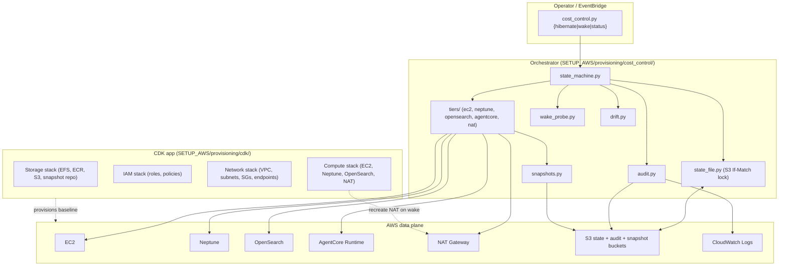
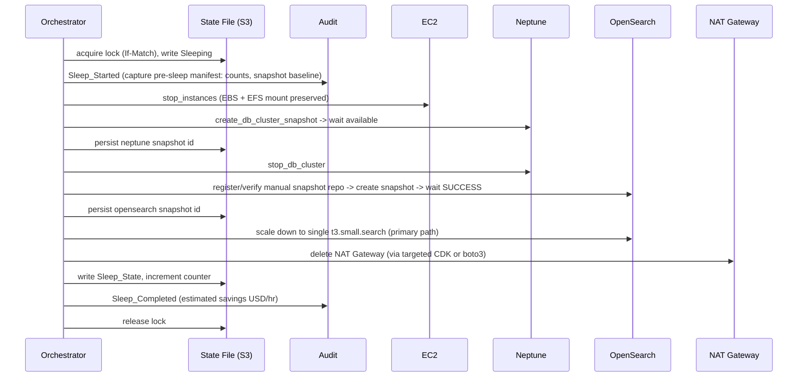

# Design Document — `nih-sandbox-cost-control`

## Overview

The `Cost_Control_System` is two cooperating subsystems, not one:

1. **A declarative CDK app** (`SETUP_AWS/provisioning/cdk/`) that defines the
   platform as four layered stacks (Storage, IAM, Network, Compute). It
   provisions the baseline and, on wake, recreates the Compute-tier resources
   that have no native stop (NAT Gateway).

2. **An imperative Python orchestrator** (`SETUP_AWS/provisioning/cost_control/`)
   that sequences the stop / start / snapshot / scale / delete / restore AWS
   API calls across services in dependency order. This is the heart of the
   feature. CDK alone cannot "sleep" a running system — most of these services
   have no declarative pause; sleeping is an imperative sequence of runtime
   API calls protected by a state machine, a state file, snapshots, and an
   audit trail.

The split is forced by the services themselves. Research against the
`aws-infrastructure-as-code` power confirmed Neptune exposes only L1/alpha CDK
constructs — there is no CDK property that stops a cluster. Stopping Neptune is
a `boto3` call (`neptune.stop_db_cluster`), and the same is true for EC2
stop/start and OpenSearch scale-down. The CDK defines *what exists*; the
orchestrator decides *what runs right now*.

The motivating constraint is funding preservation: the orchestrator drives the
platform's billable per-hour spend down by at least 80% during `Sleep_State`,
while guaranteeing that no ingested graph, vector, file-system, or container
data is lost across a hibernate → wake cycle.

## Architecture

### Component view



### State machine

```mermaid
stateDiagram-v2
  [*] --> Active_Mode: cdk deploy (initial provision)

  Active_Mode --> Sleeping: hibernate (after Confirmation_Gate)
  Sleeping --> Sleep_State: all tiers stopped + snapshots available
  Sleeping --> Active_Mode_Degraded: failure after destructive step began

  Sleep_State --> Waking: wake (after Confirmation_Gate)
  Waking --> Wake_State: all tiers up + Wake_Validation_Probe pass
  Waking --> Sleep_State_Degraded: probe fail / wake timeout

  Wake_State --> Active_Mode: (alias; Wake_State == Active_Mode operationally)

  Active_Mode_Degraded --> Sleeping: hibernate --resume
  Sleep_State_Degraded --> Waking: wake --resume

  Sleep_State --> Sleep_State: hibernate (idempotent no-op)
  Wake_State --> Wake_State: wake (idempotent no-op)
  Active_Mode --> Active_Mode: wake (idempotent no-op)
```



Each transition maps to an orchestrator subcommand:

| From | Command | To (success) | To (failure) |
|------|---------|--------------|--------------|
| `Active_Mode` | `hibernate` | `Sleep_State` | `Active_Mode_Degraded` |
| `Sleep_State` | `wake` | `Wake_State` | `Sleep_State_Degraded` |
| `Sleep_State` | `hibernate` | `Sleep_State` (no-op) | — |
| `Wake_State`/`Active_Mode` | `wake` | unchanged (no-op) | — |
| `Sleeping`/`Waking` | either | refused (exit non-zero) | — |
| `Active_Mode_Degraded` | `hibernate --resume` | `Sleep_State` | stays degraded |
| `Sleep_State_Degraded` | `wake --resume` | `Wake_State` | stays degraded |

### Hibernate sequence (dependency order)



Wake reverses the order: recreate NAT → start Neptune → scale OpenSearch back
up (or restore from snapshot in deep-sleep mode) → start EC2 → re-point
AgentCore DEFAULT endpoint if needed → run `Wake_Validation_Probe`.

## Per-Service Sleep/Wake Strategy

This table is the central design decision. For each Compute-tier resource the
chosen mechanism, the wake counterpart, and the rationale:

| Resource | Sleep | Wake | Rationale |
|----------|-------|------|-----------|
| **EC2 instance** | `stop_instances` | `start_instances` | Native stop/start halts the compute hour while preserving the EBS root volume and the EFS mount config. No data movement, ~2 min wake. A pre-stop EBS snapshot is taken per R4 only if the latest is older than the configured max age. |
| **Neptune cluster** | `create_db_cluster_snapshot` → wait `available` → `stop_db_cluster` | `start_db_cluster` → wait `available` | Native stop/start preserves the full graph (gw 4.5M rels + gw_v17 1.28M rels) with zero data movement. **7-day auto-restart caveat**: Neptune force-starts a stopped cluster after 7 days. Mitigation: a `neptune-resleep` guard Lambda (EventBridge daily rule) that re-stops the cluster if `State_File.current_state == Sleep_State` and the cluster is found `available`. The pre-stop snapshot is the recovery backstop. ~10-15 min wake. |
| **OpenSearch domain** | **Primary (scale-down)**: `update_domain_config` to a single `t3.small.search` data node, 1 AZ, no dedicated masters. **Deep-sleep (delete)**: manual snapshot to S3 → `delete_domain`. | **Primary**: `update_domain_config` back to the production node config. **Deep-sleep**: recreate domain via CDK → restore from snapshot. | Scale-down is the default because it satisfies the ≤60 min wake SLA (no ~30-45 min restore of ~310K docs) and carries no restore-failure risk. Residual cost is ~$25/mo vs ~$0, still well within the ≥80% floor because the active domain is the dominant line item. Deep-sleep delete+restore is documented for hibernation windows measured in weeks, using the `opensearch-launchpad` power's restore flow. A manual snapshot is taken in BOTH modes per R4 (safety net even when only scaling down). |
| **AgentCore Runtime** | Leave the runtime **definition** in place (it is free when idle; sessions auto-terminate at the 15-min idle timeout). Optionally `stop_runtime_session` on any pinned session. | No-op, or re-point the DEFAULT endpoint via `update_agent_runtime` if the container image/runtime was torn down out of band. | The runtime definition incurs no hourly charge — only per-session microVM time, which auto-stops. Deleting it would force a full recreate on wake for zero savings. The orchestrator records the runtime ARN + image digest in the manifest so drift detection notices if it changed while asleep. Uses the `aws-agentcore` power's `get_agent_runtime` / `update_agent_runtime` tools. |
| **NAT Gateway** | `delete` (via targeted CDK destroy of the NAT logical resource, or boto3 `delete_nat_gateway` + release EIP) | recreate via `cdk deploy MdcMcpRag-Compute-{env}` (NAT is declared in the Compute stack) | NAT has no stop and costs ~$32/mo + per-GB processing. Deleting is safe during sleep because every private-subnet resource is also stopped and needs no egress. Recreating via CDK keeps it declarative. A NAT instance (stoppable EC2) is noted as an alternative in Open Questions but rejected for the primary path (operational overhead, AMI patching). |

## Components and Interfaces

### CDK app (`SETUP_AWS/provisioning/cdk/`)

Four stacks per environment. Cross-stack references flow Storage/IAM/Network →
Compute (Compute imports, never redeclares).

**`MdcMcpRag-Storage-{env}`** (never destroyed by the orchestrator)
- EFS file system + access point (`/mnt/workflow`).
- ECR repository `mdc-mcp-rag` with `RETAIN` removal policy.
- S3 buckets: `state` (versioned), `audit` (versioned), `snapshots`
  (OpenSearch manual-snapshot repository target), all with lifecycle policies.
- Exports: EFS id, EFS access point id, ECR repo ARN, bucket ARNs.

**`MdcMcpRag-IAM-{env}`** (never destroyed)
- Orchestrator execution role (least-privilege — generated via
  `iam-policy-autopilot-power` from the orchestrator source once written).
- OpenSearch snapshot role (the role OpenSearch assumes to write to the S3
  snapshot bucket — required to register the manual snapshot repository).
- AgentCore task role (existing `mdc-mcp-rag-ecs-task-role`, imported).
- `neptune-resleep` Lambda role.
- Exports: role ARNs.

**`MdcMcpRag-Network-{env}`** (never destroyed; VPC is free)
- VPC, public + private subnets, route tables, security groups, VPC endpoints
  (S3 gateway endpoint, etc.). NAT Gateway is deliberately NOT here.
- Exports: VPC id, subnet ids, SG ids.

**`MdcMcpRag-Compute-{env}`** (the destruction boundary)
- EC2 instance, Neptune cluster + instance, OpenSearch domain, NAT Gateway,
  AgentCore Runtime definition (or reference).
- Imports everything from the other three stacks.
- This is the only stack the orchestrator's destructive paths touch.

### Orchestrator (`SETUP_AWS/provisioning/cost_control/`)

```
cost_control/
  __init__.py
  cli.py                # argparse entrypoint: {hibernate|wake|status} [--env] [--yes] [--dry-run] [--resume] [--force-drift]
  state_machine.py      # legal transitions, state guards, resume logic
  state_file.py         # S3 If-Match optimistic lock read/write
  audit.py              # structured JSON -> CloudWatch + per-op S3 object
  snapshots.py          # create/wait/verify per tier; ID naming
  drift.py              # manifest capture + classify (preserving vs destructive)
  wake_probe.py         # all-tenant mcp_health_check + get_knowledge_base_status assertions
  costs.py              # per-resource USD/hr table + savings math
  tiers/
    __init__.py         # Tier protocol: plan(), hibernate(), wake(), is_asleep()
    ec2_tier.py
    neptune_tier.py
    opensearch_tier.py
    agentcore_tier.py
    nat_tier.py
  config.py             # env -> resource ids/ARNs; reuses _ingest_common session pattern
```

- **`Tier` protocol**: each tier implements `plan(mode) -> list[PlannedAction]`,
  `hibernate()`, `wake()`, `is_asleep() -> bool`, `capture_manifest() -> dict`.
  The state machine iterates tiers in a fixed dependency order on hibernate and
  the reverse on wake.
- **AWS session**: reuses the existing `_ingest_common.build_*` session helper
  pattern so credentials/region resolution matches the ingestion scripts.
- **`--dry-run`**: every tier's `plan()` is printed (ASCII table) with zero
  mutations. The default for any first invocation in a new env.

### Interfaces to existing systems

- **Wake validation** calls the live `agentcore-mcp-rag` MCP tools
  `mcp_health_check(functional=False)` and `get_knowledge_base_status(tenant_id=...)`
  for each tenant in `tenants.yaml`, or their direct boto3/HTTP equivalents via
  the AgentCore proxy. Reuses the tenant catalog loader.
- **AgentCore lifecycle** uses the `aws-agentcore` power tools rather than raw
  boto3 where possible (`get_agent_runtime`, `update_agent_runtime`).

## Data Models

### State file (`s3://<state-bucket>/cost-control/<env>/state.json`)

```json
{
  "schema_version": "1.0.0",
  "environment_name": "prod",
  "current_state": "Sleep_State",
  "previous_state": "Sleeping",
  "last_transition_at": "2026-06-15T20:14:33Z",
  "last_caller_arn": "arn:aws:sts::903050880929:assumed-role/operator/terry",
  "operation_counter": 42,
  "latest_snapshots": {
    "neptune": "cc-prod-op_8f3a-20260615T201201-neptune",
    "opensearch": "cc-prod-op_8f3a-20260615T201233-os",
    "ec2_root_ebs": "snap-0abc123..."
  },
  "manifest": {
    "neptune_counts": {"gw": {"nodes": 148976, "rels": 4555408},
                        "gw_v17": {"nodes": 80996, "rels": 1278331}},
    "opensearch_indices": {"mdc-code-context-titan1024": 90135, "...": 0},
    "ecr_image_digests": {"python-tenants-v11": "sha256:15802a0e..."},
    "agentcore_runtime_arn": "arn:aws:bedrock-agentcore:...:runtime/mdc_mcp_rag_server_python-v5K2F8BGrN",
    "captured_at": "2026-06-15T20:12:00Z"
  }
}
```

**Optimistic locking** uses S3 conditional writes: the orchestrator reads the
object and its ETag, and writes back with `IfMatch=<etag>`. A concurrent writer
whose ETag is stale gets a `PreconditionFailed` (HTTP 412), which the
orchestrator maps to `Concurrent_Operation_Refused`. This avoids standing up a
DynamoDB lock table — S3 native conditional PUT is sufficient and keeps the
storage footprint inside the already-required state bucket. A short-lived
in-object `lock` field (`{holder, acquired_at, operation_id}`) plus the ETag
guard covers both the lost-update and the in-flight-refusal cases (R8.3, R8.4,
R7.3, R7.4).

### Audit record (one JSON object per line)

```json
{
  "timestamp": "2026-06-15T20:14:33Z",
  "event_type": "Sleep_Completed",
  "operation_id": "8f3a1c2e-...",
  "caller_arn": "arn:aws:sts::...:assumed-role/operator/terry",
  "environment_name": "prod",
  "state_before": "Sleeping",
  "state_after": "Sleep_State",
  "tier": null,
  "aws_resource_arns": ["arn:aws:ec2:...:instance/i-0...", "..."],
  "snapshot_ids": ["cc-prod-...-neptune", "cc-prod-...-os"],
  "elapsed_seconds": 1320,
  "estimated_savings_usd_per_hour": 1.87,
  "error": null
}
```

Persisted to CloudWatch log group `mdc-mcp-rag-cost-control-{env}` (365-day
retention) and, on operation completion/failure, a single consolidated S3
object `s3://<audit-bucket>/cost-control/<env>/<operation_id>.jsonl`.

### Snapshot ID convention

`cc-{env}-{operation_id_short}-{utc_compact}-{tier}` — e.g.
`cc-prod-op8f3a-20260615T201201-neptune`. Encodes environment, originating
operation, timestamp, and tier so audit and drift can correlate without a
lookup.

## Correctness Properties

### Property 1: Data-preservation round-trip

For any successful `hibernate` immediately followed by a successful `wake`, the
post-wake Neptune per-tenant node and relationship counts and the per-index
OpenSearch document counts are equal to the counts captured in the
`Sleep_Started` manifest.

**Validates: Requirements 3.1, 3.2, 12.2, 12.3**

### Property 2: Storage-tier immutability during transitions

No `hibernate` or `wake` execution issues a create, delete, replace, or modify
call against any resource owned by `MdcMcpRag-Storage-{env}`, the EFS file
system / access point, any path under `/mnt/workflow/`, or any ECR image tag.
The post-hibernate ECR tag set equals the `Sleep_Started` baseline.

**Validates: Requirements 3.3, 3.4, 3.5, 11.6**

### Property 3: Idempotency in terminal states

Invoking `hibernate` while `current_state == Sleep_State`, or `wake` while
`current_state ∈ {Wake_State, Active_Mode}`, mutates no AWS resource, creates no
snapshot, and exits 0 with a `*_NoOp` audit record.

**Validates: Requirements 7.1, 7.2**

### Property 4: Crash safety / no ambiguous state

If the orchestrator process is killed at any point during `Sleeping` or
`Waking`, the persisted `current_state` is one of the seven defined states and
a subsequent `--resume` invocation can deterministically continue or roll
forward. No partial transition leaves the state file in an undefined value, and
no destructive API call is issued before its tier's snapshot reaches a terminal
success status.

**Validates: Requirements 1.5, 2.5, 4.5, 8.3**

### Property 5: Cost-savings floor

While `current_state == Sleep_State`, the sum of per-hour costs of all
Compute-tier resources (per the `costs.py` table) is at most 20% of the
corresponding active-mode per-hour sum, excluding storage GB-month and one-time
request charges.

**Validates: Requirements 5.1, 5.3**

### Property 6: Confirmation precedes destruction

No destructive AWS API call (stop, delete, scale-down, snapshot) is issued
before either the interactive `Confirmation_Gate` phrase matches or the
`--yes` non-interactive token is present and recorded in the audit trail.

**Validates: Requirements 15.1, 15.2, 15.3, 15.4**

### Property 7: Concurrency refusal

If two `hibernate`/`wake` invocations race, at most one proceeds past the state
file lock; the other receives an S3 `PreconditionFailed`, emits
`Concurrent_Operation_Refused`, mutates nothing, and exits non-zero.

**Validates: Requirements 7.3, 7.4, 8.4**

## Error Handling

| Condition | Behaviour | Requirement |
|-----------|-----------|-------------|
| State file lock contended (ETag mismatch / lock held) | `Concurrent_Operation_Refused`, no mutation, non-zero exit | 7.3, 7.4, 8.4 |
| Snapshot does not reach terminal success within tier timeout | abort before destructive call, `Snapshot_Timeout`, leave tier untouched, non-zero exit | 4.5 |
| Snapshot returns failure status | abort, `Snapshot_Failure`, non-zero exit | 4 (refined) |
| Failure after destructive step begins (hibernate) | write `Active_Mode_Degraded`, `Sleep_Failed` with failed step + AWS error, release lock, non-zero exit | 1.5 |
| Wake validation probe fails after resources up | write `Sleep_State_Degraded`, `Wake_Failed` enumerating failed assertions, non-zero exit | 2.5, 12.4 |
| Wake exceeds max wall-clock budget | `Wake_Timeout`, leave `Sleep_State_Degraded`, do not cancel in-flight ops, non-zero exit | 6.3 |
| Data-destructive drift detected at wake | `Drift_Detected`, leave `Sleep_State`, no compute created, non-zero exit (operator uses `--force-drift` to override) | 10.3, 10.4 |
| Neptune 7-day auto-restart while asleep | `neptune-resleep` guard Lambda re-stops; logs `Resleep_Triggered` | Neptune caveat |
| Degraded state recovery | `--resume` re-enters the transition from the last completed tier (idempotent per-tier `is_asleep()` checks skip already-done work) | 1.5, 2.5 |

## Testing Strategy

### Unit tests (`SETUP_AWS/provisioning/cost_control/tests/`)
- **botocore Stubber / moto** for each tier: assert the exact API call sequence
  on hibernate and wake, and that destructive calls are not issued before
  snapshot success.
- **State machine**: every legal transition + every illegal transition refused;
  resume logic from each degraded state.
- **State file**: optimistic-lock conflict simulation (stale ETag → refusal);
  schema validation; missing/corrupt object handling.
- **Drift classification**: table-driven cases for preserving vs destructive
  drift.
- **Cost math**: savings ≥ 80% assertion against the `costs.py` table; the
  zero-resource edge case yields `0.00`.
- **Wake probe**: mocked MCP responses for all 5 tenants; assert pass and each
  fail mode.
- **Bug-condition-style guard**: a test that the orchestrator refuses to touch
  any Storage-stack ARN (Property 2) — fails if a future tier adds a storage
  mutation.

### CDK tests
- CDK assertion tests (`Template.fromStack`) verifying the four-stack
  decomposition, that the Compute stack owns NAT + EC2 + Neptune + OpenSearch,
  and that Storage/Network own no per-hour resource.
- `validate_cloudformation_template` (cfn-lint) and
  `check_cloudformation_template_compliance` (cfn-guard) via the
  `aws-infrastructure-as-code` power on every synthesized template.

### End-to-end
- `--dry-run` plan snapshot test (golden-file the printed plan).
- **Operator-gated acceptance test**: a real `hibernate` → wait → `wake` cycle
  on the reference environment, asserting Property 1 (count round-trip) live and
  measuring the wake wall-clock against the 60-min SLA. STOP-AND-CONFIRM gated.

## Open Questions

1. **OpenSearch primary mode** — scale-down vs delete-and-restore is presented
   with scale-down recommended. Final call depends on the real measured idle
   cost of a single-node domain vs the operator's tolerance for a ~40-min wake.
   Defer the deep-sleep delete path to a second implementation wave.
2. **NAT alternative** — managed NAT delete/recreate (recommended) vs a
   stoppable NAT instance. The NAT instance saves the recreate latency (~2 min)
   but adds AMI patching. Decide during implementation if wake latency proves a
   problem.
3. **State-file lock vs DynamoDB** — S3 If-Match conditional write is the
   recommended mechanism. If a future multi-region or higher-concurrency need
   appears, a DynamoDB lock table is the fallback. Not needed for the
   single-operator NIH Sandbox use today.
4. **Schedule-mode packaging** — Lambda container image (reuses the orchestrator
   verbatim) vs a Lambda layer (lighter, but must vendor boto3 extras). Lean
   container image for code-path parity with the CLI.
5. **AgentCore image storage during deep sleep** — the ECR image is retained
   (Storage stack), so wake re-points the runtime with no rebuild. Confirm the
   runtime definition itself survives a multi-week idle without AWS-side GC.
