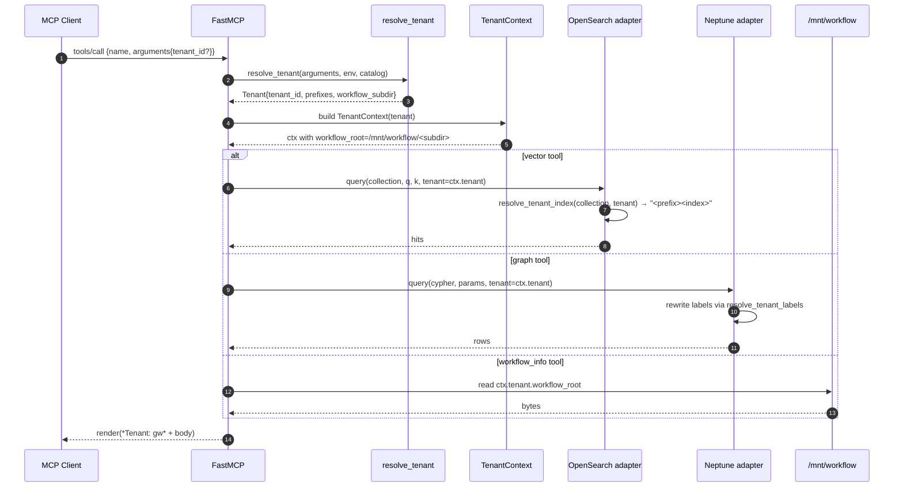

# Design Document — `omd-tenants-1-foundation`

## Overview

This feature introduces multi-tenant data isolation to the AgentCore
Python MCP/RAG server (`mdc_mcp_rag_server_python-v5K2F8BGrN`). It
replaces three implicit globals — the OpenSearch index name, the
Neptune label, and the `MCP_WORKFLOW_ROOT` filesystem path — with a
per-tenant resolved value sourced from a new declarative tenant
catalog. The catalog ships with one tenant (`gw`, empty prefixes,
`workflow_subdir: develop`) so the existing 51-tool surface keeps
behaving byte-for-byte identically for unmodified clients
(Requirements 6.1, 6.4, 7.1).

A second, mostly orthogonal piece of work also lands here: the
AgentCore runtime gains a read-only EFS mount at `/mnt/workflow`,
backed by the already-deployed `Workflow_EFS`
(`fs-032d52e4677000758`) via a new EFS access point pinned at root
path `/supported_repos/global-workflow` with POSIX `1000:1000`. This
mount is what makes `ctx.tenant.workflow_root` resolvable inside the
microVM and is the regression fix for the `_smoke_workflow_info`
failure described in Requirement 13.

After this feature lands:

- 51 tools accept an optional `tenant_id` field; absence resolves to
  `gw` (Requirements 2.1 – 2.5, 6.3).
- All adapter calls pass through new `resolve_tenant_index` /
  `resolve_tenant_labels` helpers; passthrough is the empty-prefix
  default for `gw` (Requirements 3.1 – 3.5, 4.1 – 4.5).
- Every tool response carries a `*Tenant: <id>*` header (Requirement
  5.1); `mcp_health_check` reports the catalog and per-tenant
  workflow-root reachability (Requirements 5.3, 8.1, 8.5, 8.6).
- `mcp_health_check(functional=True)` reports `workflow_info` healthy
  against `/mnt/workflow/develop/jobs` (Requirement 13).

Out of scope: any tenant other than `gw` (54b), `extends:` resolution
semantics (54c), `which_pillar` recommendation (54d/54e), and
lifecycle/staleness enforcement (54g). The catalog parses these
fields but does not act on them.

## Architecture

### Component diagram (EFS + tenant data planes)

```mermaid
flowchart LR
  subgraph Client["MCP Client (Kiro / Q CLI)"]
    K[kiro / Q]
  end

  subgraph AC["AgentCore microVM (mdc_mcp_rag_server_python-v5K2F8BGrN)"]
    direction TB
    FM[FastMCP server\nstateless_http=true]
    R[Tenant resolver\nctx.tenant]
    OA[OpenSearch adapter\n+resolve_tenant_index]
    NA[Neptune adapter\n+resolve_tenant_labels]
    WT[Workflow info / smoke\nctx.tenant.workflow_root]
    FM --> R
    R --> OA
    R --> NA
    R --> WT
  end

  subgraph Mount["EFS mount /mnt/workflow (read-only)"]
    direction TB
    DEV["/mnt/workflow/develop\n(gw worktree, branch=develop)"]
    OTHER["/mnt/workflow/<other_subdirs>\n(future tenants — out of scope)"]
  end

  subgraph EFS["Workflow_EFS fs-032d52e4677000758"]
    direction TB
    AP[EFS Access Point\nroot: /supported_repos/global-workflow\nPOSIX 1000:1000\nClientMount only]
    BARE["<EFS>/.git (bare clone)\n(outside access-point root)"]
    SR["/supported_repos/global-workflow/develop\n+ /dev-sfs (worktrees)"]
    AP --> SR
    BARE -. "object store backs" .-> SR
  end

  subgraph AWS["AWS data plane"]
    OS[(OpenSearch\nmdc-mcp-rag-search\nindex prefix per tenant)]
    NEP[(Neptune\nmdc-mcp-graprag-neptune-1\nlabel prefix per tenant)]
  end

  K -->|tools/call\n(optional tenant_id)| FM
  WT -->|read /mnt/workflow/<subdir>| Mount
  Mount -. "NFSv4.1 + TLS\n(port 2049)" .- AP
  OA -->|HTTPS + SigV4| OS
  NA -->|HTTPS + SigV4| NEP
```

### Request flow (sequence)



Implements R2.6, R3.1, R4.1, R5.1, R6.5.

### Module map

| Module | New / changed | Purpose |
|---|---|---|
| `src/config/tenants.py` | **new** | Catalog dataclasses, loader, validators, CLI |
| `src/config/tenants.yaml` | **new** | The canonical catalog (`gw` only) |
| `src/tenancy/__init__.py` | **new** | Public re-exports |
| `src/tenancy/resolver.py` | **new** | `resolve_tenant`, `TenantContext`, decorator |
| `src/tenancy/exceptions.py` | **new** | Tenant error hierarchy |
| `src/data/opensearch_adapter.py` | changed | Add `resolve_tenant_index`; thread `tenant=` through query/write |
| `src/data/neptune_adapter.py` | changed | Add `resolve_tenant_labels`; rewrite cypher labels |
| `src/data/unified_data_access.py` | changed | Pass `tenant` through facade calls |
| `src/tools/workflow_info.py` | changed | Drop `_resolve_workflow_root`; read `ctx.tenant.workflow_root` |
| `src/tools/smoke_queries.py` | changed | `_smoke_workflow_info(tenant=…)`; per-tenant probe |
| `src/tools/utility.py` | changed | `mcp_health_check` tenants section; `get_server_info` count |
| `src/tools/_attribution.py` | **new** | Wrapper helper that prepends `*Tenant: <id>*` header |
| `infrastructure/cdk/lib/mdc-data-stack.ts` | changed | Add `efs.AccessPoint` to `MdcEfs` |
| `mcp_server_python/scripts/populate_workflow_efs.sh` | **new** | Operator-host script to seed EFS bare repo + worktrees |

## Components and Interfaces

### 1. Tenant catalog (`src/config/tenants.py` + `tenants.yaml`)

Implements R1.1 – R1.11, R7.1, R7.5, R9.1 – R9.3, R10.1 – R10.4.

#### YAML schema (`src/config/tenants.yaml`)

```yaml
schema_version: 1
defaults:
  tenant_id: gw
  staleness_threshold_days: 30
tenants:
  - tenant_id: gw
    repo_ref: NOAA-EMC/global-workflow
    branch: develop
    index_prefix: ""        # empty: passthrough for backward compatibility (R7.1)
    label_prefix: ""        # empty: passthrough for backward compatibility (R7.1)
    workflow_subdir: develop  # /mnt/workflow/develop (R1.5, R7.5)
    lifecycle: production
    description: |
      Canonical NOAA-EMC global-workflow develop branch. Default tenant
      for all unspecified requests; preserves pre-feature byte-equal
      behaviour (R6.4).
    extends: []
    # staleness_threshold_days: 30  (inherits from defaults)
```

The file is loaded once at server startup and cached. The catalog
file path is configurable via `MCP_TENANT_CATALOG_PATH`; the default
is the file shipped in the image at
`/app/src/config/tenants.yaml`.

#### Dataclasses

```python
# src/config/tenants.py
from __future__ import annotations
from dataclasses import dataclass, field
from pathlib import Path
from typing import Literal

LIFECYCLE_VALUES = ("experimental", "staging", "production", "merged", "stale")
SUPPORTED_SCHEMA_VERSIONS = (1,)

@dataclass(frozen=True)
class Tenant:
    tenant_id: str
    repo_ref: str
    branch: str
    index_prefix: str
    label_prefix: str
    workflow_subdir: str
    lifecycle: Literal["experimental", "staging", "production", "merged", "stale"]
    description: str
    extends: tuple[str, ...] = ()
    staleness_threshold_days: int | None = None

    @property
    def workflow_root(self) -> Path:
        """Per-tenant absolute path on the AgentCore EFS mount.

        Implements R2.7. The result is always
        ``/mnt/workflow/<workflow_subdir>``; ``workflow_subdir`` is
        validated to be a single-segment safe name by
        :func:`_validate_workflow_subdir` (R1.11).
        """
        return Path("/mnt/workflow") / self.workflow_subdir


@dataclass(frozen=True)
class CatalogDefaults:
    tenant_id: str = "gw"
    staleness_threshold_days: int = 30


@dataclass(frozen=True)
class TenantCatalog:
    schema_version: int
    defaults: CatalogDefaults
    tenants: tuple[Tenant, ...]

    def by_id(self, tenant_id: str) -> Tenant | None:
        return next((t for t in self.tenants if t.tenant_id == tenant_id), None)

    @property
    def tenant_ids(self) -> tuple[str, ...]:
        return tuple(t.tenant_id for t in self.tenants)
```

#### Validation pipeline

```python
# src/config/tenants.py (continued)
import re
from src.tenancy.exceptions import (
    DuplicateTenantError,
    UnknownTenantReferenceError,
    InvalidPrefixError,
    DuplicateWorkflowSubdirError,
    InvalidWorkflowSubdirError,
    UnsupportedSchemaVersionError,
)

_PREFIX_RE = re.compile(r"^([a-z][a-z0-9_]*_)?$")            # empty OR ends in `_` (R1.9)
_LABEL_PREFIX_RE = re.compile(r"^([A-Z][A-Z0-9_]*_)?$")     # Neptune labels are case-sensitive
_SUBDIR_RE = re.compile(r"^[A-Za-z0-9][A-Za-z0-9._-]*$")    # R1.11

def _validate_prefix(value: str, *, kind: str, tenant_id: str) -> None:
    pattern = _PREFIX_RE if kind == "index" else _LABEL_PREFIX_RE
    if not pattern.match(value):
        raise InvalidPrefixError(
            f"tenant {tenant_id!r}: invalid {kind}_prefix={value!r}; "
            f"must match {pattern.pattern}"
        )

def _validate_workflow_subdir(value: str, *, tenant_id: str) -> None:
    if "/" in value or "\\" in value or value.startswith(".") or not _SUBDIR_RE.match(value):
        raise InvalidWorkflowSubdirError(
            f"tenant {tenant_id!r}: workflow_subdir={value!r} contains "
            f"a path separator, leading dot, or disallowed character"
        )

def _validate_catalog(catalog: TenantCatalog) -> None:
    if catalog.schema_version not in SUPPORTED_SCHEMA_VERSIONS:
        raise UnsupportedSchemaVersionError(
            f"catalog schema_version={catalog.schema_version} > "
            f"max supported {max(SUPPORTED_SCHEMA_VERSIONS)}"
        )
    seen_ids: set[str] = set()
    seen_subdirs: dict[str, str] = {}
    for t in catalog.tenants:
        if t.tenant_id in seen_ids:
            raise DuplicateTenantError(f"duplicate tenant_id: {t.tenant_id!r}")
        seen_ids.add(t.tenant_id)
        _validate_prefix(t.index_prefix, kind="index", tenant_id=t.tenant_id)
        _validate_prefix(t.label_prefix, kind="label", tenant_id=t.tenant_id)
        _validate_workflow_subdir(t.workflow_subdir, tenant_id=t.tenant_id)
        if t.workflow_subdir in seen_subdirs:
            other = seen_subdirs[t.workflow_subdir]
            raise DuplicateWorkflowSubdirError(
                f"workflow_subdir={t.workflow_subdir!r} declared by both "
                f"{other!r} and {t.tenant_id!r}"
            )
        seen_subdirs[t.workflow_subdir] = t.tenant_id
    for t in catalog.tenants:
        for ref in t.extends:
            if ref not in seen_ids:
                raise UnknownTenantReferenceError(
                    f"tenant {t.tenant_id!r} extends unknown tenant {ref!r}"
                )
```

#### Loader

```python
# src/config/tenants.py (continued)
import logging, yaml
log = logging.getLogger(__name__)

# Schema-version 1 known top-level fields. Anything else logs [WARN] (R9.1).
_KNOWN_TENANT_FIELDS = frozenset({
    "tenant_id", "repo_ref", "branch", "index_prefix", "label_prefix",
    "workflow_subdir", "lifecycle", "description", "extends",
    "staleness_threshold_days",
})

def load_catalog(path: str | Path) -> TenantCatalog:
    raw = yaml.safe_load(Path(path).read_text(encoding="utf-8"))
    schema_version = int(raw.get("schema_version", 1))
    defaults_raw = raw.get("defaults") or {}
    defaults = CatalogDefaults(
        tenant_id=defaults_raw.get("tenant_id", "gw"),
        staleness_threshold_days=int(
            defaults_raw.get("staleness_threshold_days", 30)
        ),
    )
    tenants: list[Tenant] = []
    for entry in raw.get("tenants", []):
        for k in entry:
            if k not in _KNOWN_TENANT_FIELDS:
                log.warning(
                    "[WARN] tenant %r: unknown field %r ignored "
                    "(forward-compat per R9.1)",
                    entry.get("tenant_id"), k,
                )
        tenants.append(Tenant(
            tenant_id=entry["tenant_id"],
            repo_ref=entry["repo_ref"],
            branch=entry["branch"],
            index_prefix=entry.get("index_prefix", ""),
            label_prefix=entry.get("label_prefix", ""),
            workflow_subdir=entry["workflow_subdir"],
            lifecycle=entry.get("lifecycle", "experimental"),
            description=entry.get("description", ""),
            extends=tuple(entry.get("extends") or ()),
            staleness_threshold_days=entry.get("staleness_threshold_days"),
        ))
    catalog = TenantCatalog(
        schema_version=schema_version,
        defaults=defaults,
        tenants=tuple(tenants),
    )
    _validate_catalog(catalog)
    return catalog
```

#### CLI entry point

Implements R10.1 – R10.4.

```python
# python3.12 -m src.config.tenants validate <path>
# Exit codes: 0 = valid (warnings allowed), 1 = structural error,
# 2 = unreachable file.
def _cli_validate(path: str) -> int:
    try:
        catalog = load_catalog(path)
    except FileNotFoundError:
        print(f"[ERROR] catalog not found: {path}", file=sys.stderr)
        return 2
    except OSError as exc:
        print(f"[ERROR] catalog unreachable: {exc}", file=sys.stderr)
        return 2
    except (DuplicateTenantError, UnknownTenantReferenceError,
            InvalidPrefixError, DuplicateWorkflowSubdirError,
            InvalidWorkflowSubdirError, UnsupportedSchemaVersionError) as exc:
        print(f"[ERROR] {type(exc).__name__}: {exc}", file=sys.stderr)
        return 1
    print(f"# Tenant catalog ({len(catalog.tenants)} tenant(s))")
    for t in catalog.tenants:
        chain = " -> ".join((*t.extends, t.tenant_id))
        print(f"- {t.tenant_id}: index_prefix={t.index_prefix!r} "
              f"label_prefix={t.label_prefix!r} "
              f"workflow_subdir={t.workflow_subdir!r} "
              f"lifecycle={t.lifecycle} chain={chain}")
    return 0
```

### 2. Tenant resolution (`src/tenancy/resolver.py`)

Implements R2.1 – R2.8, R5.5, R6.3.

#### Resolution precedence

```python
# src/tenancy/resolver.py
import os
from dataclasses import dataclass
from pathlib import Path
from src.config.tenants import Tenant, TenantCatalog
from src.tenancy.exceptions import UnknownTenantError

@dataclass(frozen=True)
class TenantContext:
    """Request-scoped tenant view (R2.6, R2.7)."""
    tenant_id: str
    tenant: Tenant

    @property
    def workflow_root(self) -> Path:
        return self.tenant.workflow_root

DEFAULT_HARDCODED_TENANT = "gw"  # R2.4

def resolve_tenant(
    *,
    request_tenant_id: str | None,
    catalog: TenantCatalog,
    env: dict[str, str] | None = None,
) -> TenantContext:
    """Apply the precedence chain from R2.1 – R2.4.

    Precedence:
      1. ``request_tenant_id`` (the optional ``tenant_id`` field on
         the tool request) — R2.1
      2. ``MCP_DEFAULT_TENANT`` env — R2.2
      3. ``catalog.defaults.tenant_id`` — R2.3
      4. ``"gw"`` hardcoded — R2.4
    """
    env = env if env is not None else os.environ
    chosen = (
        request_tenant_id
        or env.get("MCP_DEFAULT_TENANT")
        or catalog.defaults.tenant_id
        or DEFAULT_HARDCODED_TENANT
    )
    tenant = catalog.by_id(chosen)
    if tenant is None:
        raise UnknownTenantError(
            tenant_id=chosen, known=catalog.tenant_ids
        )
    return TenantContext(tenant_id=tenant.tenant_id, tenant=tenant)
```

#### Decorator that injects `ctx` into FastMCP tools

`FastMCP.tool` already supports a `Context` parameter for elicitation
and progress; we add a thin wrapper that:

1. Pops an optional `tenant_id` field from the kwargs.
2. Calls `resolve_tenant`.
3. Attaches the resulting `TenantContext` to the per-call state.
4. Wraps the rendered string with the `*Tenant: <id>*` header.

```python
# src/tenancy/resolver.py (continued)
from contextvars import ContextVar
from typing import Callable, Awaitable

_ctx_var: ContextVar[TenantContext | None] = ContextVar("tenant_ctx", default=None)

def get_current_tenant() -> TenantContext:
    """Read the active TenantContext. Raises if no scope is active."""
    ctx = _ctx_var.get()
    if ctx is None:
        raise RuntimeError("tenant_with no active TenantContext (programmer error)")
    return ctx

def get_current_tenant_or_none() -> TenantContext | None:
    """Read the active TenantContext, or None if no scope is active.

    Use this in adapter call sites that need to operate during the
    transition between Groups D/E (which thread tenant= through the
    adapter call surface) and Group G's Task 9.6 (which wires the
    `tenant_aware` decorator into FastMCP tool registration). Until
    the decorator is wired, no scope is active at call time, and
    using `get_current_tenant()` would raise `RuntimeError` for every
    real tool invocation. Adapters treat `tenant=None` as passthrough,
    so this helper lets the runtime stay operational throughout the
    rollout.

    Once Task 9.6 lands and every tool registration is wrapped, this
    helper still works (the ContextVar will be set) but `get_current_tenant()`
    is the stronger contract and should be preferred for new code.
    """
    return _ctx_var.get()

def tenant_aware(catalog: TenantCatalog) -> Callable:
    """Decorator factory to wrap a FastMCP tool callable.

    Usage:

        wrap = tenant_aware(catalog)

        @mcp.tool(name="describe_component", ...)
        @wrap
        async def describe_component(component: str, *, tenant_id: str | None = None,
                                     show_content: bool = False, ...): ...
    """
    def decorator(fn):
        async def inner(*args, tenant_id: str | None = None, **kwargs):
            ctx = resolve_tenant(request_tenant_id=tenant_id, catalog=catalog)
            token = _ctx_var.set(ctx)
            try:
                body = await fn(*args, **kwargs)
            finally:
                _ctx_var.reset(token)
            from src.tools._attribution import attribute
            return attribute(body, ctx.tenant)
        inner.__wrapped__ = fn
        inner.__name__ = fn.__name__
        return inner
    return decorator
```

The decorator-based approach keeps the FastMCP-generated input
schema correct: every tool's signature gains a single optional
`tenant_id: str | None = None` keyword parameter (R6.3). FastMCP
introspects the Python signature into JSON schema, so absence of
`tenant_id` in client requests is silently allowed.

#### Exception hierarchy

Implements R1.7 – R1.11, R2.5, R9.3.

```python
# src/tenancy/exceptions.py
class TenantError(Exception):
    """Base for tenant-related errors."""

class DuplicateTenantError(TenantError): ...
class UnknownTenantReferenceError(TenantError): ...
class InvalidPrefixError(TenantError): ...
class DuplicateWorkflowSubdirError(TenantError): ...
class InvalidWorkflowSubdirError(TenantError): ...
class UnsupportedSchemaVersionError(TenantError): ...

class UnknownTenantError(TenantError):
    """Raised when a request specifies a tenant_id not in the catalog (R2.5)."""
    def __init__(self, *, tenant_id: str, known: tuple[str, ...]):
        super().__init__(
            f"Unknown tenant_id={tenant_id!r}; known tenants: {list(known)}"
        )
        self.tenant_id = tenant_id
        self.known = known
```

### 3. Tenant attribution wrapper (`src/tools/_attribution.py`)

Implements R5.1, R5.2.

```python
# src/tools/_attribution.py
from datetime import datetime, timezone
from src.config.tenants import Tenant

def attribute(body: str, tenant: Tenant, *, now: datetime | None = None) -> str:
    """Prepend `*Tenant: <id>*` (and optional `[STALE]`) to a tool's output.

    Implements R5.1 (header) and R5.2 (stale marker — header-only here;
    full lifecycle/staleness enforcement is workstream 54g).
    """
    stale = " [STALE]" if tenant.lifecycle == "stale" else ""
    header = f"*Tenant: {tenant.tenant_id}*{stale}\n\n"
    if isinstance(body, str):
        return header + body
    return body  # tools that return non-string types are unchanged
```

The 54g feature will replace this body with a check on
`staleness_threshold_days` and the worktree's last-fetch timestamp;
this design only emits the marker when `lifecycle == "stale"` so the
plumbing is in place.

### 4. OpenSearch adapter changes

Implements R3.1 – R3.5.

#### New helper

```python
# src/data/opensearch_adapter.py
class OpenSearchAdapter:
    @staticmethod
    def resolve_tenant_index(collection: str, tenant: "Tenant") -> str:
        """Apply tenant.index_prefix to a logical collection name.

        R3.1, R3.2, R3.3:
          - prefix is prepended (`gw_sfs_` + `mdc-workflow-docs-titan1024`)
          - empty prefix → passthrough (gw migration mode)
        """
        if not tenant.index_prefix:
            return collection
        return f"{tenant.index_prefix}{collection}"
```

#### Threading the tenant through query/write

Every adapter method gains a `tenant: Tenant | None = None` keyword.
When `None`, behaviour is identical to today (used by the manifest
backfill scripts that run outside an MCP request).

```python
# src/data/opensearch_adapter.py (modified signatures, abbreviated)
async def query(
    self,
    collection: str,
    query_text: str,
    *,
    k: int = 10,
    tenant: "Tenant | None" = None,
    **kw,
) -> list[dict]:
    index = (
        self.resolve_tenant_index(collection, tenant)
        if tenant is not None
        else collection
    )
    # …existing path uses `index` in place of the prior `collection`
```

#### Touch list (call sites)

R3.5 lists the per-tool requirement; here is the concrete touch
list. Every site is a one-line change: add `tenant=ctx.tenant` to
the existing `data.vector_db.query(...)` call (the helper at the
adapter layer does the rest).

| Module | Tool(s) | Adapter call sites |
|---|---|---|
| `semantic_search` | `search_documentation`, `find_related_files`, `explain_with_context`, `get_knowledge_base_status`, `list_ingested_urls`, `get_ingested_urls_array`, `list_all_sources` | 7 query sites |
| `ee2_compliance` | `search_ee2_standards`, `analyze_ee2_compliance`, `generate_compliance_report`, `scan_repository_compliance`, `extract_code_for_analysis` | 5 query sites |
| `operational` | `get_operational_guidance`, `explain_workflow_component`, `list_job_scripts`, `get_job_details` | 4 query sites |
| `graph_rag` | `find_similar_code` (vector path) | 1 query site |
| **Total** | | **17 query call sites** |

`check_knowledge_integrity` does not touch the vector store; the
`Workflow Filesystem` health probe added in R8.6 does not either.

### 5. Neptune adapter changes

Implements R4.1 – R4.5.

#### New helper

```python
# src/data/neptune_adapter.py
import re

class NeptuneAdapter:
    # Token: `:LabelName` or `:LabelName_With_Underscore` outside string literals.
    # We use a conservative regex that matches `:Identifier` — Cypher labels
    # are always [A-Za-z_][A-Za-z0-9_]*. Cypher single/double-quoted strings
    # are excluded by stripping them with a state-machine pass before rewrite.
    _LABEL_TOKEN = re.compile(r":([A-Za-z_][A-Za-z0-9_]*)")

    @staticmethod
    def resolve_tenant_labels(labels: list[str], tenant: "Tenant") -> list[str]:
        """R4.4: prepend tenant.label_prefix to each label; passthrough on empty."""
        if not tenant.label_prefix:
            return list(labels)
        return [f"{tenant.label_prefix}{label}" for label in labels]

    def _rewrite_cypher(self, cypher: str, tenant: "Tenant") -> str:
        """R4.1, R4.3: rewrite `:Label` tokens to `:<prefix>Label`.

        Empty prefix → passthrough (R4.3).
        """
        if not tenant.label_prefix:
            return cypher
        cleaned = _strip_quoted(cypher)
        # Iterate over ranges in the *original* cypher that lie outside
        # quoted strings. ``_label_token_offsets`` returns those ranges.
        offsets = _label_token_offsets(cleaned)
        out = []
        cursor = 0
        for start, end, label in offsets:
            out.append(cypher[cursor:start])
            out.append(f":{tenant.label_prefix}{label}")
            cursor = end
        out.append(cypher[cursor:])
        return "".join(out)
```

The cypher rewrite is lexical because Neptune's openCypher dialect
does not have a `parameter`-able label form (you cannot write
`MATCH (n:$Label)`). Two correctness considerations:

1. **String literals.** A naive `re.sub` would corrupt
   `"...:Label..."` inside a quoted string. We pre-pass
   `_strip_quoted` (a small state machine over `"`, `'`, and `\`) to
   produce a redacted copy of the cypher with quoted regions
   replaced by spaces, then drive the rewrite from offsets in the
   redacted copy applied to the original. Property P2 below verifies
   this does not corrupt quoted text.

2. **Type / function names.** Cypher does not use the `:` token in
   types or function names; labels and relationship types are the
   only `:Identifier` tokens. We rewrite both — by design — because
   relationship types deserve the same per-tenant scoping in
   non-`gw` tenants (R4.1). For the `gw` tenant the prefix is empty
   and rewrite is a no-op, so this is a forward-looking concern.

#### Threading the tenant through query/write

```python
async def query(
    self,
    cypher: str,
    parameters: dict | None = None,
    *,
    tenant: "Tenant | None" = None,
) -> list[dict]:
    rewritten = (
        self._rewrite_cypher(cypher, tenant)
        if tenant is not None and tenant.label_prefix
        else cypher
    )
    return await self._post_opencypher(rewritten, parameters)
```

Writes that supply explicit labels (`MERGE (n:File ...)`) follow the
same rewrite. The `find_similar_code` graph path also rewrites
relationship type filters.

#### Touch list (call sites)

R4.5 lists the per-tool requirement; here is the concrete touch
list:

| Module | Tool(s) | Adapter call sites |
|---|---|---|
| `code_analysis` | `analyze_code_structure`, `find_dependencies`, `trace_execution_path`, `find_callers_callees`, `trace_full_execution_chain`, `find_env_dependencies` | 6 query sites |
| `graph_rag` | `get_code_context`, `search_architecture`, `find_similar_code` (graph path), `get_change_impact`, `trace_data_flow` | 5 query sites |
| **Total** | | **11 query call sites** |

### 6. workflow_info & smoke probe changes

Implements R2.7, R2.8, R6.5, R8.5, R13.1 – R13.5.

#### `workflow_info.py`

Replace the module-scoped `_resolve_workflow_root` with a per-call
`get_current_tenant()` lookup:

```python
# src/tools/workflow_info.py (modified)
from src.tenancy.resolver import get_current_tenant

async def get_workflow_structure(
    component: Literal[...] | None = None,
    structure_data: dict[str, Any] | None = None,
) -> str:
    root = get_current_tenant().workflow_root  # /mnt/workflow/<subdir>
    return _tool_get_workflow_structure(root, component=component,
                                        structure_data=structure_data)
```

`_resolve_workflow_root`, `MCP_WORKFLOW_ROOT`, and `HOMEgfs` are
removed from the module. The unit tests that previously set
`MCP_WORKFLOW_ROOT` switch to setting up a `TenantContext` via the
new `tenant_context_for_test(tenant_id="gw", workflow_root=...)`
helper.

#### `_smoke_workflow_info`

```python
# src/tools/smoke_queries.py (modified)
async def _smoke_workflow_info(_data, _mcp, *, tenant: "Tenant | None" = None) -> bool:
    """R13.1 – R13.5.

    When ``tenant`` is None we resolve the Default_Tenant and probe
    its ``workflow_root``. Either ``<root>/jobs`` or ``<root>/dev/jobs``
    counts as healthy (R13.2).
    """
    if tenant is None:
        from src.tenancy.runtime import get_default_tenant
        tenant = get_default_tenant()
    root = tenant.workflow_root
    candidates = [root / "jobs", root / "dev" / "jobs"]
    if any(p.is_dir() for p in candidates):
        return True
    raise RuntimeError(
        f"workflow_info: workflow_root={root} contains neither jobs/ "
        f"nor dev/jobs/ (tenant={tenant.tenant_id})"
    )
```

`mcp_health_check(functional=True, tenant=<id>)` (R13.3) drives a
per-tenant probe; absence resolves to the Default_Tenant.

#### Structured error format

When the resolved `Workflow_Root` is missing, the smoke probe
returns:

```
[FAIL] workflow_info (tenant=gw, latency=2ms)
  workflow_root=/mnt/workflow/develop contains neither jobs/ nor dev/jobs/
  hint: re-run scripts/populate_workflow_efs.sh from the operator host
```

### 7. Tenant attribution rendering

Implements R5.1 – R5.4, R8.1, R8.5, R8.6.

The `*Tenant: <id>*` header is injected by the `tenant_aware`
decorator at the FastMCP response layer (Section 2). This keeps the
header on every tool that uses the decorator without per-tool
edits. Tools that do not need tenancy (the four `utility` tools)
skip the decorator and emit plain output.

`mcp_health_check(detailed=True)` adds two new sections:

```text
## Tenants (1)

| tenant_id | branch  | lifecycle | index_prefix | label_prefix | workflow_subdir | workflow_root reachable |
|-----------|---------|-----------|--------------|--------------|-----------------|-------------------------|
| gw        | develop | production| ""           | ""           | develop         | yes (/mnt/workflow/develop) |

Default tenant: gw  (resolved from catalog.defaults.tenant_id)

## Workflow Filesystem

- mount: /mnt/workflow (mounted)
- subdirectories: develop
```

`get_server_info` adds `tenants: <count>` and the resolved default
tenant ID (R5.4). Each new field is purely additive and doesn't
change byte-equality for unmodified clients calling without
`detailed=True`.

### 8. EFS infrastructure work (CDK + AWS CLI)

Implements R11.1 – R11.9, R12.1 – R12.7.

#### CDK changes to `infrastructure/cdk/lib/mdc-data-stack.ts`

Add an `efs.AccessPoint` to the existing `MdcEfs` filesystem:

```typescript
// infrastructure/cdk/lib/mdc-data-stack.ts (excerpt)
const fileSystem = new efs.FileSystem(this, 'MdcEfs', {
  vpc,
  fileSystemName: 'mdc-mcp-rag-efs',
  encrypted: true,
  lifecyclePolicy: efs.LifecyclePolicy.AFTER_30_DAYS,
  removalPolicy: cdk.RemovalPolicy.RETAIN,
});
fileSystem.connections.allowFrom(ecsSecurityGroup, ec2.Port.tcp(2049), 'ECS to EFS');

// NEW: per-tenant access point pinned at the worktree root with POSIX 1000:1000.
const workflowAccessPoint = new efs.AccessPoint(this, 'WorkflowAccessPoint', {
  fileSystem,
  path: '/supported_repos/global-workflow',  // R11.1, R12.4
  posixUser: { uid: '1000', gid: '1000' },   // matches container `app` user
  // Owner/group/perm only used if the path has to be CREATED. The
  // populate_workflow_efs.sh helper creates it ahead of time so the
  // AccessPoint just references the existing directory.
  createAcl: {
    ownerUid: '1000',
    ownerGid: '1000',
    permissions: '0755',
  },
});

new cdk.CfnOutput(this, 'WorkflowAccessPointId', {
  value: workflowAccessPoint.accessPointId,
  description: 'EFS access point for AgentCore /mnt/workflow mount',
});
new cdk.CfnOutput(this, 'WorkflowAccessPointArn', {
  value: workflowAccessPoint.accessPointArn,
  description: 'EFS access point ARN — used in the IAM policy condition',
});
```

#### IAM policy on `mdc-mcp-rag-ecs-task-role`

Implements R11.4, R11.5. The condition `ArnEquals` pins the policy
to this specific access point (no other access point on the file
system grants ClientMount):

```json
{
  "Version": "2012-10-17",
  "Statement": [
    {
      "Sid": "ClientMountWorkflowEFS",
      "Effect": "Allow",
      "Action": "elasticfilesystem:ClientMount",
      "Resource": "arn:aws:elasticfilesystem:us-east-1:903050880929:file-system/fs-032d52e4677000758",
      "Condition": {
        "ArnEquals": {
          "elasticfilesystem:AccessPointArn": "arn:aws:elasticfilesystem:us-east-1:903050880929:access-point/<AP_ID>"
        }
      }
    }
  ]
}
```

For the immediate fix the policy is attached via CLI; CDK
follow-up adds it to the task role construct in the same stack:

```bash
# Immediate (Phase A, manual):
aws iam put-role-policy \
  --role-name mdc-mcp-rag-ecs-task-role \
  --policy-name efs-clientmount-workflow-ap \
  --policy-document file://infrastructure/iam/efs-clientmount-workflow-ap.json
```

`elasticfilesystem:ClientWrite` is **not** granted (R11.5) — the
mount is read-only.

#### AgentCore runtime update

Implements R11.2, R11.3:

```bash
# After the access point exists and the policy is attached:
AP_ARN="arn:aws:elasticfilesystem:us-east-1:903050880929:access-point/<AP_ID>"

aws bedrock-agentcore-control update-agent-runtime \
  --region us-east-1 \
  --agent-runtime-id mdc_mcp_rag_server_python-v5K2F8BGrN \
  --agent-runtime-artifact '{"containerConfiguration":{"containerUri":"903050880929.dkr.ecr.us-east-1.amazonaws.com/mdc-mcp-rag:python-tenants-foundation-v1"}}' \
  --role-arn arn:aws:iam::903050880929:role/mdc-mcp-rag-ecs-task-role \
  --network-configuration '{"networkMode":"VPC","networkModeConfig":{"subnets":["subnet-0e13af6b3a9a6416f","subnet-04447750c61bd7e06","subnet-024fd9b597b3075a5"],"securityGroups":["sg-096489a0876cc78c1"]}}' \
  --protocol-configuration '{"serverProtocol":"MCP"}' \
  --lifecycle-configuration '{"idleRuntimeSessionTimeout":900,"maxLifetime":28800}' \
  --filesystem-configurations "[{
    \"fileSystemId\":\"fs-032d52e4677000758\",
    \"accessPointId\":\"<AP_ID>\",
    \"mountPath\":\"/mnt/workflow\",
    \"readOnly\":true
  }]"
```

Note: AgentCore requires `mountPath` to be under `/mnt/` with
exactly one subdirectory (`/mnt/workflow`).

#### AZ overlap validation

Implements R11.7, R11.8. The deployment script runs a pre-flight
check before invoking `update-agent-runtime`:

```bash
# scripts/validate_efs_az_overlap.sh
RUNTIME_SUBNETS=(subnet-0e13af6b3a9a6416f subnet-04447750c61bd7e06 subnet-024fd9b597b3075a5)
EXPECTED_MTS=(fsmt-0dde562311128b447 fsmt-0ecbb5f8abd5b4b5f fsmt-09e82de3fa561101b)

# 1) For each runtime subnet, look up its AZ.
# 2) Look up each EFS mount target's AZ.
# 3) Assert the multisets match — otherwise exit 1 with
#    `EFSMountTargetAZMismatchError: subnet <id> has AZ <az> but no
#    EFS mount target in <az>` (R11.8).
```

Because `Workflow_EFS` already has a mount target in each AgentCore
subnet (verified in the brief), this check passes today; the
script is a guard against future subnet additions.

#### Security group sanity check

Implements R11.9. The brief confirms that
`sg-04bd2b41beecd1201` already allows TCP 2049 from
`sg-096489a0876cc78c1`, and AgentCore SG egress on TCP 2049 to the
EFS SG is configured. The deployment script asserts these via
`aws ec2 describe-security-group-rules` rather than mutating SGs;
no change is needed to existing SG configuration.

### 9. EFS population helper (`scripts/populate_workflow_efs.sh`)

Implements R12.1 – R12.7. Runs once per branch update from an
operator EC2 host that has both EFS mount privileges and the host's
existing `supported_repos/global-workflow/` checkout.

```bash
#!/usr/bin/env bash
# mcp_server_python/scripts/populate_workflow_efs.sh
#
# Operator-host script. Mounts the Workflow_EFS file system root (NOT the
# access point) at /mnt/efs-staging, initializes the bare clone if needed,
# and adds/updates one git worktree per tenant.
#
# Run from an EC2 instance in the same VPC as the EFS file system, with
# the security-group rules already satisfied per R11.9.

set -euo pipefail

EFS_FS_ID="${EFS_FS_ID:-fs-032d52e4677000758}"
EFS_REGION="${EFS_REGION:-us-east-1}"
STAGING_MNT="${STAGING_MNT:-/mnt/efs-staging}"
HOST_DEVELOP_SEED="${HOST_DEVELOP_SEED:-$HOME/supported_repos/global-workflow}"
TENANTS_YAML="${TENANTS_YAML:-mcp_server_python/src/config/tenants.yaml}"
GW_REMOTE="${GW_REMOTE:-https://github.com/NOAA-EMC/global-workflow.git}"

mount_efs() {
  sudo mkdir -p "$STAGING_MNT"
  if ! mountpoint -q "$STAGING_MNT"; then
    sudo mount -t efs -o tls "$EFS_FS_ID":/ "$STAGING_MNT"
  fi
}

init_bare_repo() {
  # Workflow_Bare_Repo lives at <EFS>/.git, which is OUTSIDE the
  # access-point root /supported_repos/global-workflow (R12.1, R12.4).
  if [[ ! -d "$STAGING_MNT/.git" ]]; then
    echo "[INIT] cloning bare $GW_REMOTE → $STAGING_MNT/.git"
    sudo git clone --bare "$GW_REMOTE" "$STAGING_MNT/.git"
  else
    echo "[OK] bare clone present"
    sudo git -C "$STAGING_MNT/.git" fetch --all --prune
  fi
}

ensure_access_point_root() {
  sudo mkdir -p "$STAGING_MNT/supported_repos/global-workflow"
  sudo chown 1000:1000 "$STAGING_MNT/supported_repos/global-workflow"
  sudo chmod 0755 "$STAGING_MNT/supported_repos/global-workflow"
}

seed_from_host_if_needed() {
  local target="$1"
  local seed="$2"
  if [[ -d "$target/.git" || -f "$target/HEAD" ]]; then
    return  # worktree already exists
  fi
  if [[ -d "$seed" ]]; then
    echo "[SEED] $seed → $target (initial cp -a, will be replaced by worktree)"
    sudo cp -a "$seed/." "$target/"
    sudo chown -R 1000:1000 "$target"
  fi
}

add_or_update_worktree() {
  local subdir="$1"
  local branch="$2"
  local target="$STAGING_MNT/supported_repos/global-workflow/$subdir"
  if ! sudo git -C "$STAGING_MNT/.git" worktree list --porcelain | grep -q "^worktree $target$"; then
    echo "[WORKTREE add] $target ← $branch"
    sudo git -C "$STAGING_MNT/.git" worktree add "$target" "$branch"
  else
    echo "[WORKTREE update] $target"
    sudo git -C "$target" pull --ff-only
  fi
  sudo chown -R 1000:1000 "$target"   # R12.3
}

main() {
  mount_efs
  init_bare_repo
  ensure_access_point_root

  # Parse tenants.yaml — for THIS feature only the gw tenant is processed;
  # future tenants are picked up automatically as the catalog grows.
  python3.12 - <<'PY' >/tmp/tenants.tsv
from pathlib import Path
import yaml
data = yaml.safe_load(Path("$TENANTS_YAML").read_text())
for t in data["tenants"]:
    print(f"{t['tenant_id']}\t{t['workflow_subdir']}\t{t['branch']}")
PY

  while IFS=$'\t' read -r tid subdir branch; do
    target="$STAGING_MNT/supported_repos/global-workflow/$subdir"
    sudo mkdir -p "$target"
    if [[ "$tid" == "gw" ]]; then
      seed_from_host_if_needed "$target" "$HOST_DEVELOP_SEED"
    fi
    add_or_update_worktree "$subdir" "$branch"
  done </tmp/tenants.tsv

  sudo umount "$STAGING_MNT"
  echo "[DONE] EFS populated. Bare repo at <EFS>/.git, worktrees under access-point root."
}

main "$@"
```

Note R12.6: the `gw` worktree is seeded from the host's existing
`$HOME/supported_repos/global-workflow` checkout for the first run
(saves a re-clone), then converted to a real worktree by `git
worktree add`. Subsequent runs just `pull --ff-only`.

## Data Models

The Workflow_EFS layout is the new shared persistence model:

```
fs-032d52e4677000758  (Workflow_EFS, encrypted, retention)
├── .git/                                        # Workflow_Bare_Repo (R12.1, R12.4)
│   └── (bare clone of NOAA-EMC/global-workflow) #   outside access-point root
└── supported_repos/global-workflow/             # EFS access-point root (R11.1)
    ├── develop/                                 # gw worktree, branch=develop (R1.5, R12.2)
    │   ├── jobs/
    │   ├── scripts/
    │   ├── parm/
    │   └── ...
    └── (future) dev-sfs/                        # 54b — out of scope here
```

Inside the AgentCore microVM, the access-point root is mounted at
`/mnt/workflow`, so the runtime sees:

```
/mnt/workflow/develop/jobs/      # ctx.tenant.workflow_root for gw
/mnt/workflow/develop/scripts/
/mnt/workflow/develop/...
```

The bare `.git` lives **above** the access-point root and is
therefore invisible from inside the microVM (R12.4); this is also
how `git worktree` separates the object store from the working tree.

OpenSearch / Neptune scoping:

| Tenant | `index_prefix` | `label_prefix` | Effective indices | Effective labels |
|---|---|---|---|---|
| `gw` | `""` | `""` | `mdc-workflow-docs-titan1024`, `mdc-ee2-standards-titan1024`, … (existing) | `File`, `FortranSubroutine`, `JJob`, … (existing) |
| (future) `gw_sfs` | `gw_sfs_` | `GW_SFS_` | `gw_sfs_mdc-workflow-docs-titan1024` | `GW_SFS_File`, … |

The `gw` row is the migration mode in R7.1: the existing 199 K docs
and 149 K nodes stay in their current indices/labels; resolution is
literally a `"" + name` concatenation that reduces to the existing
name.

## Correctness Properties

*A property is a characteristic or behavior that should hold true
across all valid executions of a system — essentially, a formal
statement about what the system should do. Properties serve as the
bridge between human-readable specifications and machine-verifiable
correctness guarantees.*

The seven headline properties P1 – P7 cover the universal
behavioural guarantees the runtime makes after this feature lands.
Each is implementable as a single Hypothesis-style property test in
`mcp_server_python/tests/properties/test_tenancy.py`, configured for
≥ 100 iterations and tagged with **Feature:
omd-tenants-1-foundation, Property N: <text>**.

Secondary properties (catalog rejection, forward-compat warning
emission, attribution header well-formedness, dual-path probe, AZ
overlap, worktree presence) are listed at the end of this section
for completeness; they are not promoted to the P-series because
each tests a single failure mode of a single function and could
equally be expressed as parametrized example tests.

### Property 1: Tenant isolation in OpenSearch

*For all* pairs of tenants `A` and `B` in the catalog with
non-empty distinct `index_prefix` values, and for any logical
collection name `c`, the resolved index for `A` is not equal to
the resolved index for `B`. Equivalently, the set of indices
visible to `A` across the catalog of all collections is disjoint
from the set visible to `B`.

**Validates: Requirements 3.1, 3.2**

### Property 2: Tenant isolation in Neptune

*For any* tenant `T` with non-empty `label_prefix` and any cypher
query `Q`, the rewritten cypher emitted by
`NeptuneAdapter._rewrite_cypher(Q, T)` contains every original
label token only with `T.label_prefix` prepended, and the rewrite
never modifies bytes inside Cypher string literals.

**Validates: Requirements 4.1, 4.2**

### Property 3: Empty-prefix passthrough

*For any* tenant `T` with `T.index_prefix == ""` and any
collection name `c`,
`OpenSearchAdapter.resolve_tenant_index(c, T) == c`. Symmetrically
for any tenant with `T.label_prefix == ""` and any cypher `Q`,
`NeptuneAdapter._rewrite_cypher(Q, T) == Q`.

**Validates: Requirements 3.3, 4.3**

### Property 4: Resolution determinism

*For any* tuple `(request_tenant_id, env, catalog)` where
`catalog` is a valid catalog and `request_tenant_id` is either
`None` or one of `catalog.tenant_ids`, repeated invocations of
`resolve_tenant(request_tenant_id=..., catalog=..., env=...)`
return the same `TenantContext`. Furthermore the precedence chain
holds: when `request_tenant_id` is set, the resolved tenant is
that one; otherwise the env value `MCP_DEFAULT_TENANT` wins;
otherwise `catalog.defaults.tenant_id`; otherwise `"gw"`.

**Validates: Requirements 2.1, 2.2, 2.3, 2.4, 6.1, 6.5**

### Property 5: Catalog round-trip

*For any* valid `TenantCatalog` C built from any combination of
valid tenant entries, `load_catalog(serialize_catalog(C)) == C`
when serialized through the YAML round-trip. (Equality compares
the dataclass tuples; whitespace and key ordering in the YAML
serialization are not normative.)

**Validates: Requirements 1.1, 1.2, 9.2**

### Property 6: Workflow_root containment

*For every* tenant `T` in the catalog,
`T.workflow_root == Path("/mnt/workflow") / T.workflow_subdir` and
`T.workflow_root.is_relative_to(Path("/mnt/workflow"))`. The
`workflow_subdir` is a single-segment safe name (no path
separator, no leading dot, no `..`, only characters in
`[A-Za-z0-9._-]`). Equivalently, no
`T.workflow_root.resolve()` ever escapes `/mnt/workflow`.

**Validates: Requirements 1.11, 2.7**

### Property 7: Backward-compat byte-equality

*For any* tool `t` in the pre-feature 51-tool surface and any
valid set of arguments `args`, the rendered output of `t(args)`
when invoked with no `tenant_id` against this feature's runtime
equals the rendered output of `t(args)` against the pre-feature
runtime — modulo the prepended `*Tenant: gw*` header line that the
parity runner is taught to strip before comparison. This holds
because the `gw` tenant has empty `index_prefix` and
`label_prefix` (Requirement 7.1) and `gw.workflow_root ==
/mnt/workflow/develop` (Requirement 7.5), so resolve-and-rewrite
operations are identity on the OpenSearch and Neptune paths and
the filesystem path is identical to the pre-feature
`MCP_WORKFLOW_ROOT` value used during the parity baseline run.

**Validates: Requirements 6.3, 6.4, 8.3**

### Secondary properties (test plan, not P-series)

The following are written as additional property-based tests in
`tests/properties/test_tenancy.py` but kept off the P-series
because each tests a single failure mode of a single function:

- **Catalog rejection** — *for any* invalid catalog (one of:
  duplicate tenant_id, unknown extends ref, invalid prefix
  pattern, duplicate workflow_subdir, invalid workflow_subdir,
  schema_version > 1), `load_catalog` raises the matching
  exception class. **Validates: Requirements 1.7 – 1.11, 9.3.**
- **Catalog forward-compat warning** — *for any* base valid
  catalog and any set of unknown top-level tenant fields, the
  loader succeeds and emits exactly one `[WARN]` per unknown field
  per tenant. **Validates: Requirement 9.1.**
- **Attribution header well-formedness** — *for any* tenant `T`
  and any string body `b`, the rendered output of `attribute(b,
  T)` starts with `*Tenant: <T.tenant_id>*` and contains
  `[STALE]` iff `T.lifecycle == "stale"`. **Validates:
  Requirements 5.1, 5.2.**
- **Workflow_info dual-path probe** — *for any* tmp directory
  containing none / `jobs/` only / `dev/jobs/` only / both,
  `_smoke_workflow_info` returns `True` iff at least one is
  present. **Validates: Requirement 13.2.**
- **AZ overlap validator** — *for any* mapping of subnets to AZs
  and mount targets to AZs, the validator raises
  `EFSMountTargetAZMismatchError` iff some runtime subnet's AZ has
  no corresponding mount-target AZ in the set. **Validates:
  Requirement 11.8.**
- **Per-tenant worktree presence** — *for any* synthetic catalog
  (1 – 4 tenants), running `populate_workflow_efs.sh` against a
  sandbox EFS mount produces exactly one worktree per tenant at
  `<EFS>/supported_repos/global-workflow/<workflow_subdir>` on the
  tenant's branch. **Validates: Requirement 12.2.**

## Error Handling

| Error class | Raised by | Surface |
|---|---|---|
| `DuplicateTenantError` | catalog loader (R1.7) | server refuses to start; structured stderr |
| `UnknownTenantReferenceError` | catalog loader (R1.8) | same |
| `InvalidPrefixError` | catalog loader (R1.9) | same |
| `DuplicateWorkflowSubdirError` | catalog loader (R1.10) | same |
| `InvalidWorkflowSubdirError` | catalog loader (R1.11) | same |
| `UnsupportedSchemaVersionError` | catalog loader (R9.3) | same |
| `UnknownTenantError` | resolver (R2.5) | MCP tool returns `[ERROR] Unknown tenant_id=...` markdown body |
| `EFSMountTargetAZMismatchError` | deployment script (R11.8) | exit 1 with naming the missing AZ |

The runtime never panics on tenant-resolution failure once the
catalog has loaded successfully: a bad `tenant_id` field is a
per-call user error, not a server error.

## Testing Strategy

### Unit tests

| Module | Test focus |
|---|---|
| `src/config/tenants.py` | catalog parse + each error class; CLI exit codes 0/1/2; `[WARN]` for unknown fields |
| `src/tenancy/resolver.py` | precedence chain (request > env > catalog default > hardcoded); `UnknownTenantError`; ContextVar isolation |
| `src/tenancy/exceptions.py` | error message formatting |
| `src/data/opensearch_adapter.py` | `resolve_tenant_index` — empty prefix passthrough, non-empty prepend |
| `src/data/neptune_adapter.py` | `resolve_tenant_labels` — empty prefix passthrough; `_rewrite_cypher` quoted-string preservation |
| `src/tools/_attribution.py` | header injection; `[STALE]` marker |
| `src/tools/workflow_info.py` | reads `ctx.tenant.workflow_root` (no env fallback) |
| `src/tools/smoke_queries.py` | `_smoke_workflow_info(tenant=…)` per-tenant probe; structured error |

### Property-based tests

Property tests live in `mcp_server_python/tests/properties/test_tenancy.py`
and use `hypothesis>=6.x`. Each test is tagged with the design's
property number per the workflow guide, and runs ≥ 100 iterations.
Tag format: **Feature: omd-tenants-1-foundation, Property N: …**.
Properties P1 – P7 are listed below in the Correctness Properties
section.

### Integration tests

`mcp_server_python/tests/integration/test_tenant_efs_mount.py` —
gated on `MCP_TEST_AGAINST_LIVE_EFS=1`. From an EC2 instance in the
runtime's VPC:

1. Runs `aws bedrock-agentcore` invoke against the tools/list endpoint
   to confirm the runtime starts after the `--filesystem-configurations`
   update (verifies R11.2, R11.3, R11.4).
2. Calls `mcp_health_check(detailed=true)` and asserts the
   `Workflow Filesystem` section reports `mounted` and lists `develop`
   (verifies R8.6).
3. Calls `describe_component(component="JGFS_FORECAST")` with no
   `tenant_id` and asserts the rendered path is
   `${HOMEgfs}/jobs/JGFS_FORECAST` or
   `${HOMEgfs}/dev/jobs/JGFS_FORECAST` (verifies R6.5, R13.1).
4. Calls `mcp_health_check(functional=True)` and asserts
   `workflow_info` is `pass` (verifies R13.5).

### Parity tests

`tests/parity/parity_runner.py` is extended so a request without
`tenant_id` against the Python runtime is byte-compared to the
pre-feature Node.js baseline for a fixed query corpus. Property P7
(byte-equality) is the formal version of this assertion, run
locally; the parity runner exercises it against the live Python
runtime in CI.

### Test count target

≥ 1 property test per requirement that has a testable property
(P1 – P7 cover R3, R4, R6, R7, R2.7), plus targeted unit tests for
each error class. The full breakdown is in
`mcp_server_python/tests/properties/test_tenancy.py` and
`mcp_server_python/tests/unit/test_tenants_catalog.py`.

### Why PBT applies

This feature has a clear pure-function core (catalog parser,
resolver, prefix application, label rewrite) with universal
properties (idempotence on empty prefix, isolation across tenants,
serialization round-trip). The IaC parts (CDK access point, IAM
policy) are exercised by snapshot/integration tests instead — the
Correctness Properties section below covers only the runtime logic.

## Migration / rollout plan

Implements R7.2, R7.3.

**Phase A — infrastructure-only (no runtime change)**

1. Land the CDK changes in `mdc-data-stack.ts` (access point).
2. Run `aws iam put-role-policy` to add the inline ClientMount policy.
3. Run `scripts/populate_workflow_efs.sh` from an operator EC2 host
   to seed the bare clone and the `develop` worktree.
4. Run `scripts/validate_efs_az_overlap.sh` and confirm pass.
5. AgentCore runtime is **not** updated yet — the Python image still
   reads the workflow tree from `/app/supported_repos/global-workflow`.

Rollback: detach inline policy via `aws iam delete-role-policy`;
the access point and EFS data persist with no effect on the
running runtime.

**Phase B — image + runtime update**

1. Build `python-tenants-foundation-v1` and push to ECR.
2. Run `aws bedrock-agentcore-control update-agent-runtime` with the
   new image and `--filesystem-configurations`.
3. Verify `mcp_health_check(detailed=true)` reports the new
   `Tenants` and `Workflow Filesystem` sections healthy.
4. Verify `mcp_health_check(functional=true)` reports `workflow_info`
   pass (R13.5).

Rollback: `update-agent-runtime` to the previous image
(`python-all-tools-v3`) and drop `--filesystem-configurations`.
Data on EFS is untouched. Reverting the image alone is enough
because the Python image without the tenancy module simply doesn't
register the wrapper and tools behave as before.

**Phase C — parity validation**

1. Re-run `tests/parity/parity_runner.py` against the Python runtime
   with no `tenant_id` field on requests.
2. Diff against the Node.js baseline; expect zero deltas modulo the
   `*Tenant: gw*` header line, which the parity runner is taught to
   strip before comparison (Property P7).
3. Once parity is clean, the feature is considered done.

## Out of scope (explicit list)

- Adding the `gw_sfs` tenant or any other non-`gw` tenant — that is
  workstream 54b (`omd-tenants-2-sfs-pilot`).
- Implementing `extends:` resolution semantics (54c).
- Lifecycle/staleness enforcement past the `[STALE]` header marker
  (54g).
- Cross-tenant routing or `which_pillar` recommendation (54d/54e).
- Migrating the inline IAM policy from CLI (`put-role-policy`) to
  CDK code — tracked as a follow-up after Phase B is verified.

