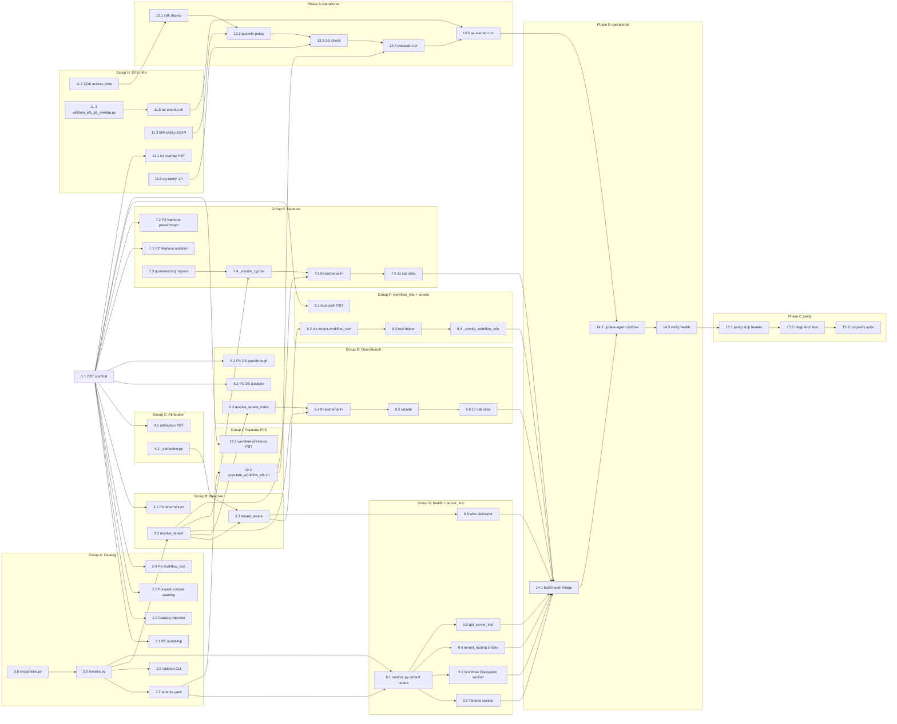

# Implementation Plan: omd-tenants-1-foundation

## Overview

Land the multi-tenant foundation in the AgentCore Python MCP/RAG server.
After this plan executes, the runtime ships with a tenant catalog
(`gw` only, empty prefixes), a request-scoped `TenantContext`, prefix
resolution on the OpenSearch and Neptune adapters, attribution on every
tool response, and a read-only EFS mount at `/mnt/workflow` whose
`develop` worktree restores `_smoke_workflow_info` to healthy.

The plan follows **TDD ordering**: every correctness property
(P1 – P7 plus secondary properties from the design's "Correctness
Properties" section) is written as a failing Hypothesis test in
`mcp_server_python/tests/properties/test_tenancy.py` **before** the
matching implementation lands. Property tests reference the design's
property number and the requirements they validate.

Tasks are grouped by design component (Groups A – K) and ordered by
explicit dependencies. The DAG and parallelism waves are at the bottom
of this file.

References:
- Requirements: `.kiro/specs/omd-tenants-1-foundation/requirements.md`
- Design: `.kiro/specs/omd-tenants-1-foundation/design.md` (sections 1 – 9)
- Property definitions: design.md "Correctness Properties" section

All implementation paths are relative to `mcp_server_python/` unless
otherwise specified.

## Phase 0 — Short-term workflow_info fix (operational only)

This narrowly-scoped subset restores `mcp_health_check(functional=True)`
to fully-green by mounting EFS at `/mnt/workflow` with a populated
`develop` worktree and pointing `MCP_WORKFLOW_ROOT` at it. **No image
rebuild and no tenancy code lands here** — the existing
`python-all-tools-v3` image already reads `MCP_WORKFLOW_ROOT` from the
environment, so once the mount is live and the env var points to
`/mnt/workflow/develop`, the smoke probe finds `<root>/jobs/` and
reports healthy.

Phase 0 reuses CDK and IAM artefacts that the full tenancy rollout
also needs (Tasks 11.2, 11.3, 12.2 in simplified form), so the work
done here is not throwaway — Phase A of the full rollout starts from
this state.

Out of scope for Phase 0: tenant catalog, prefix scoping, attribution
header, parity validation. Those land via Tasks 2 – 16 below.

### Status (2026-05-27, updated post REV 2 direct test)

- 0.1 (CDK access point), 0.2 (IAM `efs-clientmount-workflow-ap`
  v1: ClientMount only), and 0.3 (EFS populate of `develop`
  worktree) are **done** and verified live. Access point ID:
  `fsap-03e641f056b341f29`.
- AWS CLI / botocore upgrade — **done**. Local CLI is now
  `aws-cli/2.34.54`; the `bedrock-agentcore-control` model exposes
  the EFS shape `{efsAccessPoint: {accessPointArn, mountPath}}` (see
  CHANGELOG `[8.22.3]` "Phase 0 status 2026-05-27" for the corrected
  shape). The `tasks.md §0.4` template snippet below uses an outdated
  flat shape with `fileSystemId`/`accessPointId`/`readOnly` — the
  actual API uses a tagged union with `accessPointArn` and no
  `readOnly` field.
- Runtime is now at **v18** (was v16 at start of 2026-05-27). v17
  was an accidental side-effect of a bare `update-agent-runtime`
  call that wiped env vars and dropped subnets; v18 restored the
  v16 baseline. MCP is healthy at v18 with the same 52 tools / 9
  modules and the original `workflow_info` failure unchanged.
- **REV 2 IAM (FS-only Resource) was applied by admin and tested
  directly against the real runtime ID** — same `Missing required
  filesystem permissions` error returned. Cache hypothesis ruled out;
  AgentCore's validator evaluates Describe* against the access-point
  ARN even though the IAM Service Authorization Reference suggests
  the file-system Resource alone should be sufficient. Confirmed not
  a propagation issue.
- 0.4 is **blocked** on **REV 3** of the IAM policy. The
  `DescribeWorkflowEFSForDeployValidation` statement now needs
  `Resource` as a two-element array (file-system ARN AND access-point
  ARN) — still least-privilege.
- Updated artefacts ready for admin:
  - `infrastructure/iam/efs-clientmount-workflow-ap.json` — now uses
    a Resource array on the Describe* statement.
  - `docs/efs-clientmount-workflow-ap-role-request.txt` — REV 3 with
    the array Resource and root-cause analysis section.
- 0.5 is therefore also pending.
- **Forward path remains Option 1** (apply REV 3 IAM policy,
  then re-run §0.4 with the correct tagged-union JSON shape and
  `MCP_WORKFLOW_ROOT=/mnt/workflow/develop`). Options 2 and 3
  remain rejected.
- See `CHANGELOG.md [8.22.3]` "Phase 0 status 2026-05-27 (later) —
  REV 2 confirmed insufficient via direct test" for the
  investigation log.

- [ ] 0. Phase 0 tasks
  - [x] 0.1 Add `WorkflowAccessPoint` to CDK and deploy
    - Author the `efs.AccessPoint` snippet in
      `infrastructure/cdk/lib/mdc-data-stack.ts` per design §8 "CDK
      changes":
      - `path: '/supported_repos/global-workflow'`
      - `posixUser: { uid: '1000', gid: '1000' }`
      - `createAcl: { ownerUid: '1000', ownerGid: '1000', permissions: '0755' }`
      - CfnOutputs `WorkflowAccessPointId`, `WorkflowAccessPointArn`
    - From `infrastructure/cdk/`: `cdk diff && cdk deploy MdcDataStack`
    - Capture the access point ID and ARN from the CFN outputs
    - File: `infrastructure/cdk/lib/mdc-data-stack.ts` (modified)
    - **Implements: Requirements 11.1, 12.4 (live)**
    - _Reversible via `cdk destroy` of just the access-point construct._

  - [x] 0.2 Author IAM policy and attach to the task role
    - Write `infrastructure/iam/efs-clientmount-workflow-ap.json` per
      design §8 "IAM policy" — single statement granting
      `elasticfilesystem:ClientMount` on file-system ARN
      `arn:aws:elasticfilesystem:us-east-1:903050880929:file-system/fs-032d52e4677000758`,
      gated by `ArnEquals` on `elasticfilesystem:AccessPointArn` (use
      the AP ARN from 0.1). **No `ClientWrite`** (R11.5).
    - Apply:
      ```bash
      aws iam put-role-policy \
        --role-name mdc-mcp-rag-ecs-task-role \
        --policy-name efs-clientmount-workflow-ap \
        --policy-document file://infrastructure/iam/efs-clientmount-workflow-ap.json
      ```
    - Verify: `aws iam get-role-policy --role-name mdc-mcp-rag-ecs-task-role --policy-name efs-clientmount-workflow-ap`
    - **Implements: Requirements 11.4, 11.5 (live)**

  - [x] 0.3 Populate the EFS with a `develop` worktree (simplified)
    - Phase 0 simplified script — no `tenants.yaml` dependency:
      ```bash
      #!/usr/bin/env bash
      set -euo pipefail
      EFS_FS_ID="${EFS_FS_ID:-fs-032d52e4677000758}"
      STAGING_MNT="${STAGING_MNT:-/mnt/efs-staging}"
      HOST_DEVELOP_SEED="${HOST_DEVELOP_SEED:-$HOME/supported_repos/global-workflow}"
      GW_REMOTE="${GW_REMOTE:-https://github.com/NOAA-EMC/global-workflow.git}"

      sudo mkdir -p "$STAGING_MNT"
      mountpoint -q "$STAGING_MNT" || sudo mount -t efs -o tls "$EFS_FS_ID":/ "$STAGING_MNT"

      [[ -d "$STAGING_MNT/.git" ]] || sudo git clone --bare "$GW_REMOTE" "$STAGING_MNT/.git"
      sudo mkdir -p "$STAGING_MNT/supported_repos/global-workflow"
      sudo chown 1000:1000 "$STAGING_MNT/supported_repos/global-workflow"

      target="$STAGING_MNT/supported_repos/global-workflow/develop"
      if [[ ! -e "$target/.git" && ! -f "$target/HEAD" ]]; then
        if [[ -d "$HOST_DEVELOP_SEED" ]]; then
          sudo cp -a "$HOST_DEVELOP_SEED/." "$target/"
        fi
        sudo git -C "$STAGING_MNT/.git" worktree add "$target" develop
      else
        sudo git -C "$target" pull --ff-only
      fi
      sudo chown -R 1000:1000 "$target"
      sudo umount "$STAGING_MNT"
      ```
    - File: `mcp_server_python/scripts/populate_workflow_efs_phase0.sh`
      (new — supersedes itself when 12.2 lands the full version)
    - **Runtime expectation: 10 – 30 minutes (clone + seed of ~1.5 GB);
      subsequent runs are seconds.**
    - Verify: `ls /mnt/efs-staging/supported_repos/global-workflow/develop/jobs`
    - **Implements: Requirements 12.1, 12.2 (gw worktree only), 12.6 (live)**

  - [ ] 0.4 Update AgentCore runtime with EFS mount + env var (no image rebuild)
    > **BLOCKED (2026-05-27, post REV 2 direct test)**: AWS CLI /
    > botocore are now on 2.34.54 and the `bedrock-agentcore-control`
    > model exposes `efsAccessPoint` (shape: `{accessPointArn,
    > mountPath}`). REV 2 of the IAM policy (ClientMount +
    > DescribeAccessPoints/DescribeMountTargets with FS-only Resource)
    > was applied by admin and tested directly against the real
    > runtime ID — same `Missing required filesystem permissions`
    > error returned. Cache hypothesis ruled out. **REV 3 required**:
    > the Describe* statement's `Resource` must be a two-element
    > array (file-system ARN + access-point ARN). Tracked in
    > CHANGELOG `[8.22.3]` "Phase 0 status 2026-05-27 (later) —
    > REV 2 confirmed insufficient via direct test".
    >
    > **JSON shape correction (CRITICAL — apply when re-running)**:
    > the snippet below uses a stale flat shape. The correct shape is
    > a tagged-union with **no** `fileSystemId`, **no**
    > `accessPointId`, and **no** `readOnly`:
    >
    > ```bash
    > --filesystem-configurations '[{
    >   "efsAccessPoint":{
    >     "accessPointArn":"arn:aws:elasticfilesystem:us-east-1:903050880929:access-point/fsap-03e641f056b341f29",
    >     "mountPath":"/mnt/workflow"
    >   }
    > }]'
    > ```
    >
    > Read-only-ness is at the IAM layer (no `ClientWrite`), not in
    > the API shape.
    >
    > **Spec deviations to apply when unblocked** (recorded
    > 2026-05-26 + 2026-05-27 in CHANGELOG `[8.22.3]`):
    > - `containerUri`: stays `python-titan-v5`
    > - `subnets`: keep all three —
    >   `subnet-0e13af6b3a9a6416f`, `subnet-04447750c61bd7e06`,
    >   `subnet-024fd9b597b3075a5`
    > - `accessPointArn` (not `accessPointId`):
    >   `arn:aws:elasticfilesystem:us-east-1:903050880929:access-point/fsap-03e641f056b341f29`
    > - drop `readOnly` and `fileSystemId` and `accessPointId` keys
    >   entirely
    > - the runtime is now at v18 (after a v17 hiccup recovered to
    >   v18 baseline); next successful update will be v19+
    - Set `MCP_WORKFLOW_ROOT=/mnt/workflow/develop` via runtime
      environment variables, and add `--filesystem-configurations` —
      keep the existing `python-all-tools-v3` image:
      ```bash
      AP_ID="<from 0.1 output>"
      aws bedrock-agentcore-control update-agent-runtime \
        --region us-east-1 \
        --agent-runtime-id mdc_mcp_rag_server_python-v5K2F8BGrN \
        --agent-runtime-artifact '{"containerConfiguration":{"containerUri":"903050880929.dkr.ecr.us-east-1.amazonaws.com/mdc-mcp-rag:python-all-tools-v3"}}' \
        --role-arn arn:aws:iam::903050880929:role/mdc-mcp-rag-ecs-task-role \
        --network-configuration '{"networkMode":"VPC","networkModeConfig":{"subnets":["subnet-0e13af6b3a9a6416f","subnet-04447750c61bd7e06","subnet-024fd9b597b3075a5"],"securityGroups":["sg-096489a0876cc78c1"]}}' \
        --protocol-configuration '{"serverProtocol":"MCP"}' \
        --lifecycle-configuration '{"idleRuntimeSessionTimeout":900,"maxLifetime":28800}' \
        --environment-variables '{"DB_BACKEND":"aws","NEPTUNE_ENDPOINT":"https://mdc-mcp-graprag-neptune-1.cluster-ccdaimu4c86s.us-east-1.neptune.amazonaws.com:8182","OPENSEARCH_ENDPOINT":"https://vpc-mdc-mcp-rag-search-5o72hixfx3rryikwb7l5px5sgq.us-east-1.es.amazonaws.com","AWS_REGION":"us-east-1","MCP_STATELESS_HTTP":"true","MCP_WORKFLOW_ROOT":"/mnt/workflow/develop"}' \
        --filesystem-configurations "[{
          \"fileSystemId\":\"fs-032d52e4677000758\",
          \"accessPointId\":\"$AP_ID\",
          \"mountPath\":\"/mnt/workflow\",
          \"readOnly\":true
        }]"
      ```
    - **Implements: Requirements 11.2, 11.3 (live, image unchanged)**
    - _Rollback: re-run with the previous env var set and no
      `--filesystem-configurations`._

  - [ ] 0.5 Verify `workflow_info` smoke green
    > **BLOCKED (2026-05-27)**: depends on 0.4. When 0.4 unblocks, the
    > spot-check tool name is `JGLOBAL_FORECAST`, not `JGFS_FORECAST`
    > (the latter does not exist in current NOAA-EMC `develop`; same
    > observation already recorded in `[8.24.0]`). Use
    > `mcp_health_check(functional=True)`,
    > `describe_component(component="JGLOBAL_FORECAST")`, and
    > `get_workflow_structure(component="jobs")` for the three checks.
    - Call `mcp_health_check(functional=True)` via the agentcore-mcp-rag
      MCP and confirm the `workflow_info` row reports `pass`
    - Spot-check `describe_component(component="JGFS_FORECAST")` returns
      a populated path (not the "not found" error)
    - **Implements: Requirement 13.5 (live verification)**

Phase 0 closes when 0.5 reports green. The full rollout (Tasks 2 – 16
below) layers tenancy code, prefix scoping, attribution, and parity on
top of the Phase 0 EFS mount without re-doing the operational work.

## Tasks

- [ ] 1. Property test scaffold (TDD harness)
  - [ ] 1.1 Create `mcp_server_python/tests/properties/test_tenancy.py` skeleton
    - Add module docstring referencing `Feature: omd-tenants-1-foundation`
    - Add Hypothesis settings profile registering ≥ 100 iterations
      (`settings(max_examples=100)`) named `tenancy_default`
    - Define reusable Hypothesis strategies:
      - `valid_tenant_id_strategy()` — snake_case identifiers
      - `valid_index_prefix_strategy()` — matches `^[a-z][a-z0-9_]*_$` or empty
      - `valid_label_prefix_strategy()` — matches `^[A-Z][A-Z0-9_]*_$` or empty
      - `valid_workflow_subdir_strategy()` — matches `^[A-Za-z0-9][A-Za-z0-9._-]*$`
      - `valid_tenant_strategy()` — composes the above into a draft
        `Tenant` dict (raw dict, since dataclasses do not exist yet)
      - `valid_catalog_strategy(min_size=1, max_size=4)` — composes
        a list of `valid_tenant_strategy()` with unique `tenant_id`
        and unique `workflow_subdir`
    - Files: `mcp_server_python/tests/properties/test_tenancy.py` (new),
      `mcp_server_python/tests/properties/__init__.py` (new if missing)
    - _Validates: harness for all P1 – P7 tests below_
    - _Expected to import-fail until task 2.x lands; that is intentional._

- [ ] 2. Group A — Tenant catalog (`src/config/tenants.py` + `tenants.yaml`)
  - [ ] 2.1 Write property test P5 — Catalog round-trip
    - **Property 5: Catalog round-trip** (design "Correctness Properties" §P5)
    - For any valid `TenantCatalog` C built from `valid_catalog_strategy()`,
      `load_catalog(_serialize_catalog_to_tmp(C)) == C`
    - Hypothesis tag: `# Feature: omd-tenants-1-foundation, Property 5: Catalog round-trip`
    - File: `mcp_server_python/tests/properties/test_tenancy.py`
    - Helper `_serialize_catalog_to_tmp(c)` writes the catalog as YAML
      to a tmp_path fixture and returns the path
    - **Validates: Requirements 1.1, 1.2, 9.2**
    - _Expected to FAIL: `src.config.tenants` does not exist yet._

  - [ ] 2.2 Write property test "Catalog rejection" (secondary)
    - For each invalid-catalog generator (one per error class), assert
      `load_catalog` raises the matching exception:
      - `DuplicateTenantError` — two tenants share `tenant_id`
      - `UnknownTenantReferenceError` — `extends: [foo]` with no `foo`
      - `InvalidPrefixError` — index/label prefix not matching regex
      - `DuplicateWorkflowSubdirError` — two tenants share `workflow_subdir`
      - `InvalidWorkflowSubdirError` — subdir contains `/`, `\`, leading dot, or `..`
      - `UnsupportedSchemaVersionError` — `schema_version: 2`
    - Hypothesis tag: `# Feature: omd-tenants-1-foundation, Property: Catalog rejection`
    - File: `mcp_server_python/tests/properties/test_tenancy.py`
    - **Validates: Requirements 1.7, 1.8, 1.9, 1.10, 1.11, 9.3**
    - _Expected to FAIL until task 2.5 lands._

  - [ ] 2.3 Write property test "Catalog forward-compat warning" (secondary)
    - Given a valid catalog and an arbitrary unknown top-level field
      sprinkled into a tenant entry, `load_catalog` succeeds and the
      caplog records exactly one `[WARN]` line per unknown field per tenant
    - Use `caplog.set_level(logging.WARNING, logger="src.config.tenants")`
    - **Validates: Requirement 9.1**
    - _Expected to FAIL until task 2.5 lands._

  - [ ] 2.4 Write property test P6 — Workflow_root containment
    - **Property 6: Workflow_root containment** (design §P6)
    - For every tenant `T` drawn from `valid_tenant_strategy()`:
      - `T.workflow_root == Path("/mnt/workflow") / T.workflow_subdir`
      - `T.workflow_root.resolve()` is relative to `Path("/mnt/workflow").resolve()`
      - `".." not in T.workflow_subdir` (already enforced by strategy)
    - Hypothesis tag: `# Feature: omd-tenants-1-foundation, Property 6: Workflow_root containment`
    - **Validates: Requirements 1.11, 2.7**
    - _Expected to FAIL until task 2.5 lands._

  - [ ] 2.5 Implement `src/config/tenants.py` — dataclasses, loader, validator
    - `Tenant` frozen dataclass with `workflow_root` property (design §1)
    - `CatalogDefaults` frozen dataclass
    - `TenantCatalog` frozen dataclass with `by_id()` and `tenant_ids`
    - Constants `LIFECYCLE_VALUES`, `SUPPORTED_SCHEMA_VERSIONS`,
      `_PREFIX_RE`, `_LABEL_PREFIX_RE`, `_SUBDIR_RE`, `_KNOWN_TENANT_FIELDS`
    - `_validate_prefix`, `_validate_workflow_subdir`, `_validate_catalog`
    - `load_catalog(path)` — YAML → `TenantCatalog`, emits `[WARN]` on
      unknown fields per R9.1, calls `_validate_catalog`
    - File: `mcp_server_python/src/config/tenants.py` (new)
    - **Implements: Requirements 1.1 – 1.4, 1.6 – 1.11, 9.1, 9.2, 9.3, R2.7 (via `Tenant.workflow_root`)**
    - **Validated by: P5, P6, "Catalog rejection", "Catalog forward-compat warning"**

  - [ ] 2.6 Implement exception module `src/tenancy/exceptions.py`
    - Exception hierarchy from design §2 "Exception hierarchy":
      `TenantError`, `DuplicateTenantError`, `UnknownTenantReferenceError`,
      `InvalidPrefixError`, `DuplicateWorkflowSubdirError`,
      `InvalidWorkflowSubdirError`, `UnsupportedSchemaVersionError`,
      `UnknownTenantError`
    - Files: `mcp_server_python/src/tenancy/__init__.py` (new),
      `mcp_server_python/src/tenancy/exceptions.py` (new)
    - **Implements: Requirements 1.7 – 1.11, 2.5, 9.3**

  - [ ] 2.7 Author canonical catalog `src/config/tenants.yaml`
    - Single `gw` tenant per design §1 YAML schema:
      ```yaml
      schema_version: 1
      defaults: { tenant_id: gw, staleness_threshold_days: 30 }
      tenants:
        - tenant_id: gw
          repo_ref: NOAA-EMC/global-workflow
          branch: develop
          index_prefix: ""
          label_prefix: ""
          workflow_subdir: develop
          lifecycle: production
          description: |
            Canonical NOAA-EMC global-workflow develop branch.
          extends: []
      ```
    - File: `mcp_server_python/src/config/tenants.yaml` (new)
    - **Implements: Requirements 1.1, 1.5, 7.1, 7.5**

  - [ ]* 2.8 Unit tests for `tenants.py` (catalog loader edge cases)
    - File-not-found → `FileNotFoundError`
    - Malformed YAML → `yaml.YAMLError`
    - Missing required field on a tenant entry → `KeyError`
    - Each validator error class gets a hand-written example test
    - File: `mcp_server_python/tests/unit/test_tenants_catalog.py` (new)
    - **Validates: Requirements 1.6 – 1.11, 9.3**

  - [ ] 2.9 CLI entry point `python3.12 -m src.config.tenants validate <path>`
    - `_cli_validate(path)` per design §1 "CLI entry point"
    - Exit codes: 0 valid (warnings allowed per R10.3), 1 structural,
      2 unreachable
    - `if __name__ == "__main__":` dispatcher reads `sys.argv[1] == "validate"`
    - File: `mcp_server_python/src/config/tenants.py` (modified)
    - **Implements: Requirements 10.1, 10.2, 10.3, 10.4**

  - [ ]* 2.10 Unit tests for the validate CLI
    - Valid catalog → exit 0
    - Each structural error class → exit 1
    - Missing file → exit 2
    - Catalog with one unknown field → exit 0 + `[WARN]` on stderr
    - File: `mcp_server_python/tests/unit/test_tenants_cli.py` (new)
    - **Validates: Requirements 10.1 – 10.4**

- [ ] 3. Group B — Tenant resolver (`src/tenancy/resolver.py`)
  - [ ] 3.1 Write property test P4 — Resolution determinism
    - **Property 4: Resolution determinism** (design §P4)
    - For any tuple `(request_tenant_id, env, catalog)` where
      `request_tenant_id` is `None` or a member of `catalog.tenant_ids`:
      - Repeated `resolve_tenant(...)` calls return the same `TenantContext`
      - Precedence chain: request > `MCP_DEFAULT_TENANT` > `catalog.defaults.tenant_id` > `"gw"`
    - Hypothesis tag: `# Feature: omd-tenants-1-foundation, Property 4: Resolution determinism`
    - File: `mcp_server_python/tests/properties/test_tenancy.py`
    - **Validates: Requirements 2.1, 2.2, 2.3, 2.4, 6.1, 6.5**
    - _Expected to FAIL: `src.tenancy.resolver.resolve_tenant` does not exist yet._

  - [ ] 3.2 Implement `src/tenancy/resolver.py` — `TenantContext`, `resolve_tenant`
    - `TenantContext` frozen dataclass with `workflow_root` property (design §2)
    - `DEFAULT_HARDCODED_TENANT = "gw"`
    - `resolve_tenant(*, request_tenant_id, catalog, env=None) -> TenantContext`
      implementing the precedence chain
    - Raises `UnknownTenantError` (from 2.6) when the chosen ID is unknown
    - File: `mcp_server_python/src/tenancy/resolver.py` (new)
    - **Implements: Requirements 2.1 – 2.6**
    - **Validated by: P4**

  - [ ] 3.3 Implement `tenant_aware` decorator + ContextVar plumbing
    - `_ctx_var: ContextVar[TenantContext | None]`
    - `get_current_tenant() -> TenantContext`
    - `tenant_aware(catalog) -> decorator` per design §2 "Decorator that
      injects ctx into FastMCP tools" — pops `tenant_id` kwarg, sets
      ContextVar token, awaits inner, resets token, wraps body via
      `src.tools._attribution.attribute`
    - Preserve `inner.__wrapped__` and `inner.__name__` so FastMCP
      introspects the original signature (R6.3)
    - File: `mcp_server_python/src/tenancy/resolver.py` (modified)
    - **Implements: Requirements 2.6, 5.5, 6.3**
    - _Depends on 4.1 for the `attribute()` import — until 4.1 lands,
      stub the import behind `from src.tools._attribution import attribute`
      at call time inside `inner` so module import does not fail._

  - [ ]* 3.4 Unit tests for resolver edge cases
    - Unknown `request_tenant_id` → `UnknownTenantError(known=...)`
    - Empty catalog → `resolve_tenant` falls through to hardcoded `"gw"`
      and raises `UnknownTenantError` if `gw` is also absent
    - ContextVar isolation — two concurrent `tenant_aware`-wrapped calls
      see independent contexts (use `asyncio.gather` with two stub tools)
    - File: `mcp_server_python/tests/unit/test_tenant_resolver.py` (new)
    - **Validates: Requirements 2.5, 2.6**

- [ ] 4. Group C — Attribution wrapper (`src/tools/_attribution.py`)
  - [ ] 4.1 Write property test "Attribution header well-formedness" (secondary)
    - For any tenant `T` and any string body `b`:
      - `attribute(b, T).startswith(f"*Tenant: {T.tenant_id}*")`
      - `"[STALE]" in attribute(b, T)` iff `T.lifecycle == "stale"`
      - For non-string `b` (e.g. dict, int), `attribute` returns `b` unchanged
    - Hypothesis tag: `# Feature: omd-tenants-1-foundation, Property: Attribution header well-formedness`
    - File: `mcp_server_python/tests/properties/test_tenancy.py`
    - **Validates: Requirements 5.1, 5.2**
    - _Expected to FAIL: `src.tools._attribution` does not exist yet._

  - [ ] 4.2 Implement `src/tools/_attribution.py`
    - `attribute(body, tenant, *, now=None) -> str | T` per design §3
    - Header line `*Tenant: <id>*` (with trailing `[STALE]` iff `tenant.lifecycle == "stale"`)
    - Pass-through for non-string bodies
    - File: `mcp_server_python/src/tools/_attribution.py` (new)
    - **Implements: Requirements 5.1, 5.2**
    - **Validated by: "Attribution header well-formedness"**

- [ ] 5. Checkpoint — catalog + resolver + attribution land
  - Run `pytest mcp_server_python/tests/unit/ mcp_server_python/tests/properties/test_tenancy.py -k "P4 or P5 or P6 or attribution or catalog"`
    and confirm P4, P5, P6, "Attribution header", "Catalog rejection",
    "Catalog forward-compat warning" all pass
  - Run `python3.12 -m src.config.tenants validate mcp_server_python/src/config/tenants.yaml`
    and confirm exit 0
  - Ensure all tests pass, ask the user if questions arise.

- [ ] 6. Group D — OpenSearch adapter changes (`src/data/opensearch_adapter.py`)
  - [ ] 6.1 Write property test P1 — Tenant isolation in OpenSearch
    - **Property 1: Tenant isolation in OpenSearch** (design §P1)
    - For any pair of tenants `A`, `B` with non-empty distinct
      `index_prefix` and any collection name `c`,
      `resolve_tenant_index(c, A) != resolve_tenant_index(c, B)`
    - Also: across the catalog's logical collections, the set of
      indices visible to `A` is disjoint from the set visible to `B`
    - Hypothesis tag: `# Feature: omd-tenants-1-foundation, Property 1: Tenant isolation in OpenSearch`
    - File: `mcp_server_python/tests/properties/test_tenancy.py`
    - **Validates: Requirements 3.1, 3.2**
    - _Expected to FAIL: `OpenSearchAdapter.resolve_tenant_index` does not exist yet._

  - [ ] 6.2 Write property test P3 (OpenSearch half) — Empty-prefix passthrough
    - **Property 3: Empty-prefix passthrough** (design §P3, OpenSearch half)
    - For any tenant `T` with `T.index_prefix == ""` and any collection
      name `c`, `OpenSearchAdapter.resolve_tenant_index(c, T) == c`
    - Hypothesis tag: `# Feature: omd-tenants-1-foundation, Property 3: Empty-prefix passthrough (OpenSearch)`
    - File: `mcp_server_python/tests/properties/test_tenancy.py`
    - **Validates: Requirement 3.3**
    - _Expected to FAIL: helper does not exist yet._

  - [ ] 6.3 Implement `OpenSearchAdapter.resolve_tenant_index` static method
    - Per design §4 "New helper" — `f"{tenant.index_prefix}{collection}"`
      with empty-prefix passthrough
    - File: `mcp_server_python/src/data/opensearch_adapter.py` (modified)
    - **Implements: Requirements 3.1, 3.2, 3.3, 3.4**
    - **Validated by: P1, P3 (OpenSearch half)**

  - [ ] 6.4 Thread `tenant=` keyword through OpenSearch adapter call surface
    - Add `tenant: Tenant | None = None` to: `query`, `bulk_query`,
      and any write/index methods on `OpenSearchAdapter`
    - When `tenant is not None`, replace each `collection` use with
      `self.resolve_tenant_index(collection, tenant)` before the
      request leaves the adapter
    - Preserve existing behaviour when `tenant is None`
      (manifest-backfill scripts continue to pass through)
    - File: `mcp_server_python/src/data/opensearch_adapter.py` (modified)
    - **Implements: Requirement 3.1, 3.2 (write path)**

  - [ ] 6.5 Update `UnifiedDataAccess` facade to thread `tenant=`
    - Each vector-path method on `UnifiedDataAccess` gains a
      `tenant: Tenant | None = None` keyword and forwards it to the
      adapter
    - Mirror the same change for the manifest registry / gap detector
      so `resolve_tenant_index` is the single source of truth (R3.4)
    - File: `mcp_server_python/src/data/unified_data_access.py` (modified)
    - **Implements: Requirements 3.4, 7.4**

  - [ ] 6.6 Wire `ctx.tenant` into the 17 OpenSearch tool call sites
    - For each call site listed in design §4 "Touch list" (17 total):
      - 7 in `src/tools/semantic_search.py`
      - 5 in `src/tools/ee2_compliance.py`
      - 4 in `src/tools/operational.py`
      - 1 in `src/tools/graph_rag.py` (`find_similar_code` vector path)
    - Each change is a one-liner: `tenant=get_current_tenant().tenant`
      added to the existing `data.vector_db.query(...)` (or facade) call
    - Files: `src/tools/semantic_search.py`, `src/tools/ee2_compliance.py`,
      `src/tools/operational.py`, `src/tools/graph_rag.py` (all modified)
    - **Implements: Requirement 3.5**

  - [ ]* 6.7 Unit tests for `resolve_tenant_index`
    - Empty prefix → identity
    - Non-empty prefix → concatenation
    - Mixed-case collection names preserved
    - File: `mcp_server_python/tests/unit/test_opensearch_tenant.py` (new)
    - **Validates: Requirements 3.1 – 3.4**

- [ ] 7. Group E — Neptune adapter changes (`src/data/neptune_adapter.py`)
  - [ ] 7.1 Write property test P2 — Tenant isolation in Neptune
    - **Property 2: Tenant isolation in Neptune** (design §P2)
    - For any tenant `T` with non-empty `label_prefix` and any cypher
      query `Q`:
      - The rewritten cypher contains every original `:Label` token
        only with `T.label_prefix` prepended
      - The rewrite never modifies bytes inside Cypher string literals
        (single- or double-quoted, with `\\"` and `\\'` escape handling)
    - Use a Hypothesis strategy that generates cypher fragments
      containing arbitrary `:Label` tokens both inside and outside
      string literals
    - Hypothesis tag: `# Feature: omd-tenants-1-foundation, Property 2: Tenant isolation in Neptune`
    - File: `mcp_server_python/tests/properties/test_tenancy.py`
    - **Validates: Requirements 4.1, 4.2**
    - _Expected to FAIL: `NeptuneAdapter._rewrite_cypher` does not exist yet._

  - [ ] 7.2 Write property test P3 (Neptune half) — Empty-prefix passthrough
    - For any tenant `T` with `T.label_prefix == ""` and any cypher `Q`,
      `NeptuneAdapter._rewrite_cypher(Q, T) == Q`
    - For any tenant `T` with empty `label_prefix` and any list `labels`,
      `resolve_tenant_labels(labels, T) == list(labels)`
    - Hypothesis tag: `# Feature: omd-tenants-1-foundation, Property 3: Empty-prefix passthrough (Neptune)`
    - File: `mcp_server_python/tests/properties/test_tenancy.py`
    - **Validates: Requirement 4.3**

  - [ ] 7.3 Implement `_strip_quoted` and `_label_token_offsets` helpers
    - Private module-level helpers per design §5
    - `_strip_quoted(cypher)` — state machine over `"`, `'`, `\\`;
      returns a copy with quoted regions replaced by spaces (preserves
      length so offsets remain valid)
    - `_label_token_offsets(cleaned)` — yields `(start, end, label)`
      tuples for every `:Label` token in the cleaned (non-quoted) cypher
    - File: `mcp_server_python/src/data/neptune_adapter.py` (modified)
    - **Implements: Requirement 4.1 (correctness sub-clause from design §5)**

  - [ ] 7.4 Implement `NeptuneAdapter.resolve_tenant_labels` and `_rewrite_cypher`
    - Per design §5 "New helper" — both methods
    - `resolve_tenant_labels(labels, tenant)` — list comprehension with
      empty-prefix passthrough
    - `_rewrite_cypher(cypher, tenant)` — uses 7.3 helpers; empty-prefix
      passthrough returns input verbatim
    - File: `mcp_server_python/src/data/neptune_adapter.py` (modified)
    - **Implements: Requirements 4.1, 4.2, 4.3, 4.4**
    - **Validated by: P2, P3 (Neptune half)**

  - [ ] 7.5 Thread `tenant=` keyword through Neptune adapter call surface
    - `query`, `write`, and any node/edge mutation methods on
      `NeptuneAdapter` accept `tenant: Tenant | None = None`
    - When `tenant is not None and tenant.label_prefix`, call
      `_rewrite_cypher` before posting to Neptune
    - When writing, also rewrite explicit label arguments via
      `resolve_tenant_labels`
    - File: `mcp_server_python/src/data/neptune_adapter.py` (modified)
    - **Implements: Requirements 4.1, 4.2**

  - [ ] 7.6 Wire `ctx.tenant` into the 11 Neptune tool call sites
    - Per design §5 "Touch list":
      - 6 in `src/tools/code_analysis.py`
      - 5 in `src/tools/graph_rag.py` (graph paths)
    - One-liner change at each call site: pass
      `tenant=get_current_tenant().tenant` to the existing
      `data.graph_db.query(...)` (or facade) call
    - Files: `src/tools/code_analysis.py`, `src/tools/graph_rag.py` (modified)
    - **Implements: Requirement 4.5**

  - [ ]* 7.7 Unit tests for cypher rewrite — quoted-string preservation
    - `MATCH (n:File {path: ":File"}) RETURN n` — only the structural
      `:File` is rewritten, the literal `":File"` is preserved
    - Cypher with no `:` tokens is identity
    - Multiple `:Label` tokens on one line all rewritten
    - File: `mcp_server_python/tests/unit/test_neptune_tenant.py` (new)
    - **Validates: Requirements 4.1, 4.2**

- [ ] 8. Group F — workflow_info + smoke probe (`src/tools/workflow_info.py`, `src/tools/smoke_queries.py`)
  - [ ] 8.1 Write property test "Workflow_info dual-path probe" (secondary)
    - For any `tmp_path` populated with one of: nothing, `jobs/` only,
      `dev/jobs/` only, both — `_smoke_workflow_info` returns `True` iff
      at least one is present
    - Build a stub tenant via a `tenant_context_for_test(workflow_root=tmp_path)` helper
    - Hypothesis tag: `# Feature: omd-tenants-1-foundation, Property: Workflow_info dual-path probe`
    - File: `mcp_server_python/tests/properties/test_tenancy.py`
    - **Validates: Requirement 13.2**
    - _Expected to FAIL: probe still reads `MCP_WORKFLOW_ROOT`._

  - [ ] 8.2 Replace `_resolve_workflow_root` with `get_current_tenant()`
    - Remove `_resolve_workflow_root`, `MCP_WORKFLOW_ROOT`, `HOMEgfs`
      module-scoped fallbacks
    - Each tool function in `workflow_info.py` calls
      `get_current_tenant().workflow_root` at the top of its body
    - File: `mcp_server_python/src/tools/workflow_info.py` (modified)
    - **Implements: Requirements 2.7, 2.8, 6.5**

  - [ ] 8.3 Add `tenant_context_for_test` test helper
    - Helper that yields into a `TenantContext` set on the ContextVar
      (so unit tests previously setting `MCP_WORKFLOW_ROOT` keep working)
    - File: `mcp_server_python/tests/conftest.py` (modified or new fixture)
    - **Supports: Requirement 2.7 unit-test rewrite**

  - [ ] 8.4 Update `_smoke_workflow_info` to accept a `tenant=` kwarg
    - Per design §6 "_smoke_workflow_info":
      - Optional `tenant: Tenant | None = None`
      - On `None`, resolve the Default_Tenant via
        `src.tenancy.runtime.get_default_tenant()` (introduced in 9.x)
      - Probe `<root>/jobs` AND `<root>/dev/jobs`; either one healthy
      - Structured `RuntimeError` naming the resolved path on failure
    - File: `mcp_server_python/src/tools/smoke_queries.py` (modified)
    - **Implements: Requirements 13.1, 13.2, 13.3, 13.4**
    - **Validated by: "Workflow_info dual-path probe"**

  - [ ]* 8.5 Unit tests for `_smoke_workflow_info` failure shape
    - Missing root → `RuntimeError("workflow_root=... contains neither jobs/ nor dev/jobs/")`
    - Verify the structured error message includes both `tenant_id`
      and the resolved path
    - File: `mcp_server_python/tests/unit/test_smoke_workflow_info.py` (new or modified)
    - **Validates: Requirement 13.4**

- [ ] 9. Group G — Health check + server_info updates (`src/tools/utility.py`)
  - [ ] 9.1 Build `src/tenancy/runtime.py` for module-scoped catalog access
    - `_CATALOG` lazy singleton loaded from `MCP_TENANT_CATALOG_PATH`
      (default: package-relative `src/config/tenants.yaml`)
    - `get_catalog() -> TenantCatalog`
    - `get_default_tenant() -> Tenant` — applies the precedence chain
      (env → `defaults.tenant_id` → `"gw"`) and returns the resolved
      `Tenant` from the catalog
    - File: `mcp_server_python/src/tenancy/runtime.py` (new)
    - **Implements: Requirements 2.2, 2.3, 2.4 (default-only path used by health check)**

  - [ ] 9.2 Add Tenants section to `mcp_health_check(detailed=True)`
    - Per design §7: "## Tenants (1)" block with the table columns
      `tenant_id | branch | lifecycle | index_prefix | label_prefix | workflow_subdir | workflow_root reachable`
    - Reachability column: `Path(t.workflow_root).is_dir()` rendered as
      `yes (<path>)` or `no (<path>)`
    - Footer: "Default tenant: <id>  (resolved from <source>)"
    - File: `mcp_server_python/src/tools/utility.py` (modified)
    - **Implements: Requirements 5.3, 8.1, 8.5**

  - [ ] 9.3 Add Workflow Filesystem section to `mcp_health_check(detailed=True)`
    - Per design §7: report `mount: /mnt/workflow (mounted | NOT mounted)`
      (i.e. `Path("/mnt/workflow").is_dir()`)
    - List immediate subdirectories beneath `/mnt/workflow`
      (skip if not mounted)
    - File: `mcp_server_python/src/tools/utility.py` (modified)
    - **Implements: Requirement 8.6**

  - [ ] 9.4 Add `tenant_routing` functional smoke
    - Per design §7 + R8.3: a probe that issues two equivalent queries
      (one with `tenant_id=gw`, one without) and asserts identical
      rendered output (modulo the `*Tenant: gw*` header — both have it)
    - File: `mcp_server_python/src/tools/smoke_queries.py` (modified)
    - **Implements: Requirement 8.3**

  - [ ] 9.5 Update `get_server_info` to include tenant counts
    - Per design §7: add `tenants: <count>` and resolved default
      `tenant_id` to the rendered output
    - File: `mcp_server_python/src/tools/utility.py` (modified)
    - **Implements: Requirement 5.4**

  - [ ] 9.6 Wire `tenant_aware` decorator into FastMCP tool registration
    - In `src/mcp_server.py` (or wherever the 51 tools are registered),
      apply `tenant_aware(catalog)` to each tool registration except
      the four utility tools that emit catalog-level info
    - Confirm FastMCP's input-schema introspection picks up the optional
      `tenant_id: str | None = None` parameter on each tool (R6.3)
    - File: `mcp_server_python/src/mcp_server.py` (modified)
    - **Implements: Requirements 6.1, 6.2, 6.3**

  - [ ]* 9.7 Add `--tenant <id>` flag to `smoke_test_tools.py`
    - Default behaviour: iterate over all configured tenants
    - With `--tenant <id>`: scope smoke runs to that tenant
    - File: `mcp_server_python/scripts/smoke_test_tools.py` (modified)
    - **Implements: Requirement 8.4**

  - [ ]* 9.8 Property test P7 — Backward-compat byte-equality (offline form)
    - **Property 7: Backward-compat byte-equality** (design §P7)
    - For a fixed corpus of `(tool_name, args)` pairs, the output of
      `tool(args)` with no `tenant_id` against the new code path equals
      the recorded pre-feature baseline output, modulo the
      `*Tenant: gw*` header line
    - Implementation: replay against fixture-recorded adapter mocks
      (no live AWS); the live parity-runner version lands in Group K
    - File: `mcp_server_python/tests/properties/test_tenancy.py`
    - **Validates: Requirements 6.3, 6.4, 8.3**
    - Marked optional because the live parity test in Group K is the
      authoritative version of this property.

- [ ] 10. Checkpoint — runtime tenancy plumbing complete
  - Run `pytest mcp_server_python/tests/properties/test_tenancy.py mcp_server_python/tests/unit/`
    and confirm all property tests P1 – P6 plus secondary properties pass
  - Run `python3.12 -m src.mcp_server` locally with `MCP_STATELESS_HTTP=true`
    and a stub catalog; confirm `mcp_health_check(detailed=True)` renders
    the new Tenants and Workflow Filesystem sections (filesystem will
    show `not mounted` until Group H lands — that is expected).
  - Ensure all tests pass, ask the user if questions arise.

- [ ] 11. Group H — EFS infrastructure (CDK + IAM + AZ validator)
  - [ ] 11.1 Write property test "AZ overlap validator" (secondary)
    - For any mapping of subnets to AZs and mount targets to AZs:
      validator raises `EFSMountTargetAZMismatchError` iff some
      runtime subnet's AZ has no corresponding mount-target AZ
    - The validator helper is a small Python function that the bash
      script will shell out to (so the property test runs in pytest,
      not in bash)
    - Hypothesis tag: `# Feature: omd-tenants-1-foundation, Property: AZ overlap validator`
    - File: `mcp_server_python/tests/properties/test_tenancy.py`
    - **Validates: Requirement 11.8**
    - _Expected to FAIL until task 11.4 lands._

  - [ ] 11.2 Add `WorkflowAccessPoint` to `MdcEfs` CDK construct
    - Per design §8 "CDK changes" — `efs.AccessPoint` with:
      - `path: '/supported_repos/global-workflow'`
      - `posixUser: { uid: '1000', gid: '1000' }`
      - `createAcl: { ownerUid: '1000', ownerGid: '1000', permissions: '0755' }`
    - Add CfnOutputs for `WorkflowAccessPointId` and `WorkflowAccessPointArn`
    - File: `infrastructure/cdk/lib/mdc-data-stack.ts` (modified)
    - **Implements: Requirements 11.1, 12.4 (access-point root excludes bare repo)**

  - [ ] 11.3 Author IAM policy `efs-clientmount-workflow-ap.json`
    - Per design §8 "IAM policy" — single statement granting
      `elasticfilesystem:ClientMount` on the file-system ARN, gated by
      `ArnEquals` condition on `elasticfilesystem:AccessPointArn`
    - **No `ClientWrite`** (R11.5)
    - File: `infrastructure/iam/efs-clientmount-workflow-ap.json` (new)
    - **Implements: Requirements 11.4, 11.5**

  - [ ] 11.4 Implement `validate_efs_az_overlap.py` helper
    - Pure-Python function `validate_az_overlap(subnet_azs, mount_target_azs)`
      that raises `EFSMountTargetAZMismatchError` (or a typed error)
      naming the missing AZ
    - File: `mcp_server_python/scripts/validate_efs_az_overlap.py` (new)
    - **Implements: Requirement 11.8 (validator core)**
    - **Validated by: "AZ overlap validator"**

  - [ ] 11.5 Implement bash wrapper `scripts/validate_efs_az_overlap.sh`
    - Per design §8 "AZ overlap validation":
      - Calls `aws ec2 describe-subnets` and
        `aws efs describe-mount-targets` to gather the inputs
      - Pipes the data into `validate_efs_az_overlap.py` for the actual check
      - Exits 1 with the structured error from R11.8
    - File: `mcp_server_python/scripts/validate_efs_az_overlap.sh` (new)
    - **Implements: Requirements 11.7, 11.8**

  - [ ] 11.6 Implement bash sanity check `scripts/check_efs_security_groups.sh`
    - Asserts `sg-04bd2b41beecd1201` allows TCP 2049 from
      `sg-096489a0876cc78c1`, and AgentCore SG allows egress on TCP
      2049 to the EFS SG (no mutation, just `describe-security-group-rules`)
    - File: `mcp_server_python/scripts/check_efs_security_groups.sh` (new)
    - **Implements: Requirement 11.9 (verification)**

- [ ] 12. Group I — EFS population helper (`scripts/populate_workflow_efs.sh`)
  - [ ] 12.1 Write property test "Per-tenant worktree presence" (secondary)
    - For a synthetic catalog with 1 – 4 tenants, simulate
      `populate_workflow_efs.sh` against a tmp-path "EFS" and assert:
      - One worktree per tenant at `<EFS>/supported_repos/global-workflow/<workflow_subdir>`
      - Bare repo at `<EFS>/.git` lives outside the access-point root (R12.4)
      - Each worktree files are owned by `1000:1000` (skip on macOS where
        chown without root is a no-op; check via `os.stat` only when
        running as root)
    - Hypothesis tag: `# Feature: omd-tenants-1-foundation, Property: Per-tenant worktree presence`
    - File: `mcp_server_python/tests/properties/test_tenancy.py`
    - **Validates: Requirements 12.1, 12.2, 12.4**
    - _Test marked `@pytest.mark.skipif(not _git_available(), reason="git not on PATH")`._

  - [ ] 12.2 Implement `scripts/populate_workflow_efs.sh`
    - Per design §9 verbatim:
      - `mount_efs` — mounts file-system root (NOT the access point)
      - `init_bare_repo` — `git clone --bare ...` at `<EFS>/.git`
      - `ensure_access_point_root` — creates `/supported_repos/global-workflow`
        with `1000:1000 0755`
      - `seed_from_host_if_needed` — `cp -a` from
        `$HOME/supported_repos/global-workflow` for the `gw` tenant
      - `add_or_update_worktree` — `git worktree add <subdir> <branch>`
        followed by `chown -R 1000:1000`
      - Reads `tenants.yaml` via inline `python3.12 -c` block
    - File: `mcp_server_python/scripts/populate_workflow_efs.sh` (new)
    - Mode: `chmod 0755`
    - **Implements: Requirements 12.1, 12.2, 12.3, 12.4, 12.5, 12.6, 12.7**
    - **Note:** This is an operator-host script. Runtime expectation:
      first run takes 10 – 30 minutes (clone + seed of `develop` worktree
      ≈ 1.5 GB); subsequent runs (`pull --ff-only`) are seconds.
      Idle CPU; bottleneck is EFS network throughput.

  - [ ]* 12.3 README for the populate script
    - Document required env vars, IAM identity, and the safe-by-default
      behaviour (read-only mount unaffected during repopulation)
    - File: `mcp_server_python/scripts/README_populate_workflow_efs.md` (new)
    - **Documents: Requirement 12.5**

- [ ] 13. Phase A operational tasks (CDK + IAM + populate, runtime untouched)
  - [ ] 13.1 Run `cdk diff` and `cdk deploy` for the access-point change
    - From `infrastructure/cdk/`
    - Verify CFN outputs `WorkflowAccessPointId` and
      `WorkflowAccessPointArn` are emitted
    - **Operational: implements Phase A step 1 from design "Migration / rollout plan"**
    - **Implements: Requirement 11.1 (live)**
    - _Note: live AWS change. Reversible via `cdk destroy` of the
      access-point construct only._

  - [ ] 13.2 Apply IAM inline policy via CLI (interim Phase A path)
    - Substitute `<AP_ID>` from the CDK output into
      `infrastructure/iam/efs-clientmount-workflow-ap.json`
    - Run:
      ```bash
      aws iam put-role-policy \
        --role-name mdc-mcp-rag-ecs-task-role \
        --policy-name efs-clientmount-workflow-ap \
        --policy-document file://infrastructure/iam/efs-clientmount-workflow-ap.json
      ```
    - Verify with `aws iam get-role-policy --role-name mdc-mcp-rag-ecs-task-role --policy-name efs-clientmount-workflow-ap`
    - **Implements: Requirements 11.4, 11.5 (live)**
    - _Reversible via `aws iam delete-role-policy` — see design "Rollback"._

  - [ ] 13.3 Run `scripts/check_efs_security_groups.sh`
    - Pre-flight verification of R11.9 — exits 0 if SGs already permit
      NFSv4.1 traffic in both directions
    - **Implements: Requirement 11.9 (verification)**

  - [ ] 13.4 Run `scripts/populate_workflow_efs.sh` from operator EC2 host
    - Sets up bare repo + `develop` worktree at
      `/supported_repos/global-workflow/develop` on the EFS file system
    - **Runtime expectation: 10 – 30 minutes on first run (clone of
      ~1.5 GB global-workflow); a few seconds on subsequent runs.**
    - Verify with `ls /mnt/efs-staging/supported_repos/global-workflow/develop/jobs`
      from the operator host
    - **Implements: Requirements 12.1, 12.2, 12.6 (live)**

  - [ ] 13.5 Run `scripts/validate_efs_az_overlap.sh`
    - Pre-flight gate before the `update-agent-runtime` call in 14.x
    - Must exit 0
    - **Implements: Requirements 11.7, 11.8 (verification)**

- [ ] 14. Group J + Phase B — Build image + AgentCore runtime update
  - [ ] 14.1 Build and push `python-tenants-foundation-v1` image
    - From `mcp_server_python/`:
      ```bash
      docker build --platform linux/arm64 \
        -t 903050880929.dkr.ecr.us-east-1.amazonaws.com/mdc-mcp-rag:python-tenants-foundation-v1 \
        -f Dockerfile .
      aws ecr get-login-password --region us-east-1 \
        | docker login --username AWS --password-stdin 903050880929.dkr.ecr.us-east-1.amazonaws.com
      docker push 903050880929.dkr.ecr.us-east-1.amazonaws.com/mdc-mcp-rag:python-tenants-foundation-v1
      ```
    - Record local image SHA and ECR manifest digest in CHANGELOG
    - **Implements: Phase B step 1 from design "Migration / rollout plan"**
    - _Rollback target preserved: `python-all-tools-v3`._

  - [ ] 14.2 `update-agent-runtime` with `--filesystem-configurations`
    - Per design §8 "AgentCore runtime update" — exact command:
      ```bash
      aws bedrock-agentcore-control update-agent-runtime \
        --region us-east-1 \
        --agent-runtime-id mdc_mcp_rag_server_python-v5K2F8BGrN \
        --agent-runtime-artifact '{"containerConfiguration":{"containerUri":"903050880929.dkr.ecr.us-east-1.amazonaws.com/mdc-mcp-rag:python-tenants-foundation-v1"}}' \
        --role-arn arn:aws:iam::903050880929:role/mdc-mcp-rag-ecs-task-role \
        --network-configuration '{"networkMode":"VPC","networkModeConfig":{"subnets":["subnet-0e13af6b3a9a6416f","subnet-04447750c61bd7e06","subnet-024fd9b597b3075a5"],"securityGroups":["sg-096489a0876cc78c1"]}}' \
        --protocol-configuration '{"serverProtocol":"MCP"}' \
        --lifecycle-configuration '{"idleRuntimeSessionTimeout":900,"maxLifetime":28800}' \
        --filesystem-configurations "[{
          \"fileSystemId\":\"fs-032d52e4677000758\",
          \"accessPointId\":\"<AP_ID>\",
          \"mountPath\":\"/mnt/workflow\",
          \"readOnly\":true
        }]"
      ```
    - **Pre-flight**: 13.5 (`validate_efs_az_overlap.sh`) MUST have passed
    - **Implements: Requirements 11.2, 11.3 (live)**
    - _Rollback: re-run the same command with the previous image and
      drop `--filesystem-configurations`._

  - [ ] 14.3 Verify post-deploy via `mcp_health_check`
    - Call `mcp_health_check(detailed=true)` and assert:
      - `Workflow Filesystem` section: `mount: /mnt/workflow (mounted)`
      - Sub-directories include `develop`
      - `Tenants` section lists `gw` with `workflow_root reachable: yes`
    - Call `mcp_health_check(functional=true)` and assert
      `workflow_info` is `pass` (R13.5)
    - **Implements: Requirements 8.6, 13.5 (live verification)**

- [ ] 15. Group K + Phase C — Parity validation
  - [ ] 15.1 Extend `tests/parity/parity_runner.py` to strip `*Tenant: gw*` header
    - Pre-comparison normalizer that removes the leading
      `*Tenant: <id>*\n\n` prefix from Python-runtime outputs before
      diffing against the Node.js baseline
    - Per design "Testing Strategy → Parity tests"
    - File: `mcp_server_python/tests/parity/parity_runner.py` (modified)
    - **Implements: Requirement 6.4 (parity comparator)**
    - **Validates: Property P7 (live form)**

  - [ ] 15.2 Add `tests/integration/test_tenant_efs_mount.py`
    - Gated on `MCP_TEST_AGAINST_LIVE_EFS=1`. Per design "Testing
      Strategy → Integration tests":
      1. `tools/list` against the new runtime — passes (R11.2, R11.3, R11.4)
      2. `mcp_health_check(detailed=true)` shows `Workflow Filesystem: mounted`
         and lists `develop` (R8.6)
      3. `describe_component(component="JGFS_FORECAST")` with no
         `tenant_id` returns the rendered path under `${HOMEgfs}/(dev/)?jobs/JGFS_FORECAST` (R6.5, R13.1)
      4. `mcp_health_check(functional=true)` reports `workflow_info` pass (R13.5)
    - File: `mcp_server_python/tests/integration/test_tenant_efs_mount.py` (new)
    - **Implements: Requirements 6.5, 8.6, 11.2, 11.3, 11.4, 13.1, 13.5 (live coverage)**

  - [ ] 15.3 Run extended parity suite
    - `pytest mcp_server_python/tests/parity/ -m live --runtime python`
    - Diff against the Node.js baseline; expect zero deltas after the
      `*Tenant: gw*` header strip
    - **Implements: Requirement 7.2 (rollout reversibility), Phase C verification**
    - **Validates: P7 against live runtimes**

  - [ ]* 15.4 Update CHANGELOG with `[8.23.0] omd-tenants-1-foundation`
    - Document the new image tag, ECR manifest digest, AccessPointId,
      catalog file path, and the byte-equality guarantee for the `gw`
      tenant
    - File: `CHANGELOG.md` (modified)

- [ ] 16. Final checkpoint — feature complete
  - Confirm: P1, P2, P3, P4, P5, P6, P7 (live form) all pass; all
    secondary property tests pass; live parity reports zero deltas;
    `mcp_health_check(functional=true)` reports all probes healthy
    including `workflow_info`.
  - Ensure all tests pass, ask the user if questions arise.

## Notes

- Tasks marked with `*` are optional and can be skipped for a faster
  Phase A/B landing. The non-optional tasks form the minimal viable
  rollout.
- Property tests are written **before** their implementation
  (TDD/property-first). Each property task is annotated as
  "_Expected to FAIL_" until the matching implementation lands; the
  matching implementation's "Validated by:" annotation closes the loop.
- All adapter changes (Groups D, E) are forward-compatible: tools that
  do not pass `tenant=` continue to work unchanged, which is what the
  manifest-backfill scripts rely on.
- The EFS work (Groups H, I) is on the critical path for Phase B
  because the runtime image cannot mount `/mnt/workflow` without the
  access point and IAM policy in place.
- The `gw` tenant has empty prefixes by design (R7.1), so Property P3
  (empty-prefix passthrough) is what gives us byte-equality with the
  pre-feature baseline (Property P7).
- Operational tasks 13.x and 14.x are AWS API calls; they are tagged
  with the design's exact commands so the executor can run them
  verbatim. Each is reversible per the design's "Rollback" sections.

## Mermaid task DAG



## Task Dependency Graph

```json
{
  "waves": [
    { "id": 0, "tasks": ["1.1", "2.6", "2.7", "11.3", "11.4"] },
    { "id": 1, "tasks": ["2.1", "2.2", "2.3", "2.4", "4.1", "8.1", "11.1", "11.5", "11.6", "12.1"] },
    { "id": 2, "tasks": ["2.5", "4.2", "11.2"] },
    { "id": 3, "tasks": ["2.8", "2.9", "2.10", "3.1", "9.1"] },
    { "id": 4, "tasks": ["3.2"] },
    { "id": 5, "tasks": ["3.3", "3.4"] },
    { "id": 6, "tasks": ["6.1", "6.2", "6.3", "7.1", "7.2", "7.3", "8.2", "9.4", "9.5", "12.2"] },
    { "id": 7, "tasks": ["6.4", "7.4", "8.3", "9.2", "9.3"] },
    { "id": 8, "tasks": ["6.5", "7.5", "8.4", "9.6", "13.1", "13.2", "13.3"] },
    { "id": 9, "tasks": ["6.6", "6.7", "7.6", "7.7", "8.5", "9.7", "9.8", "12.3", "13.4"] },
    { "id": 10, "tasks": ["13.5"] },
    { "id": 11, "tasks": ["14.1"] },
    { "id": 12, "tasks": ["14.2"] },
    { "id": 13, "tasks": ["14.3"] },
    { "id": 14, "tasks": ["15.1"] },
    { "id": 15, "tasks": ["15.2"] },
    { "id": 16, "tasks": ["15.3", "15.4"] }
  ]
}
```
