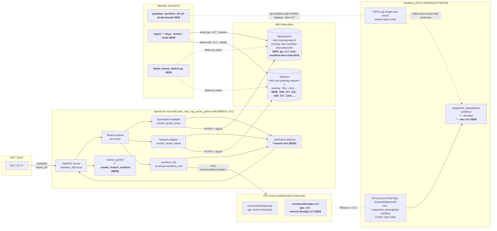
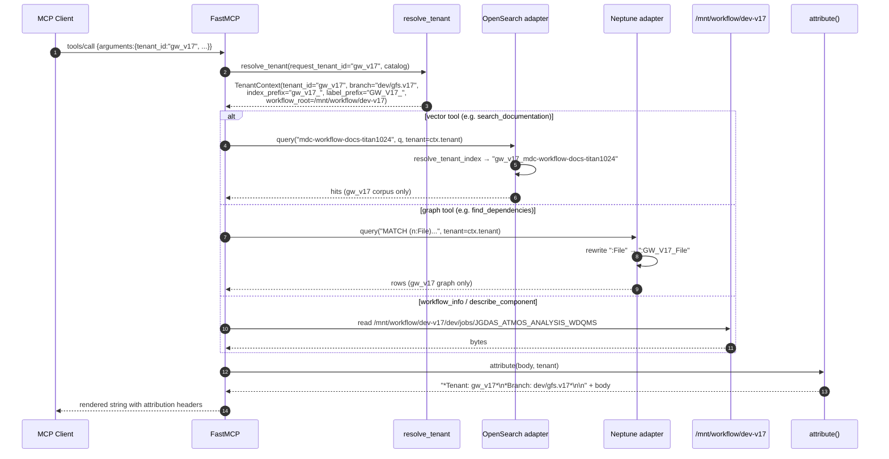

# Design Document — `omd-tenants-2-v17-pilot`

## Overview

This feature is the first end-to-end exercise of the multi-tenant
foundation (`omd-tenants-1-foundation`) against a real second tenant.
It onboards `gw_v17` — the `dev/gfs.v17` branch of
`NOAA-EMC/global-workflow.git`, the next operational GFS — as the
first **staging-lifecycle** pillar tenant on the AgentCore Python
runtime (`mdc_mcp_rag_server_python-v5K2F8BGrN`, currently v21,
image `python-tenants-v1`). After this feature lands:

- An agent asking about `JGDAS_ATMOS_ANALYSIS_WDQMS` against
  `tenant_id="gw_v17"` gets the v17 answer; the same query against
  `tenant_id="gw"` returns "not found" because that J-Job exists
  only on the v17 branch (Requirement 4).
- The smoke suite gains `_smoke_branch_isolation`, asserting the
  above on every health check (Requirement 4).
- A second worktree at `/mnt/workflow/dev-v17` sits beside the
  existing `/mnt/workflow/develop` on the shared `Workflow_EFS`,
  populated by an upgraded multi-tenant version of
  `populate_workflow_efs.sh` (Requirement 2).
- The ingestion entry scripts gain `--tenant <id>` and
  `--mode {diff,full}` flags; `gw_v17` is ingested in
  `--mode full` (Requirement 3).
- The cost report from the v17 ingestion run is captured under
  `mcp_server_python/scripts/ingestion_reports/` and referenced from
  the new pillar onboarding runbook (Requirements 5, 8).
- A rollback script `delete_tenant_indices.py` removes a tenant's
  data without touching the empty-prefix `gw` baseline
  (Requirement 7).

**Why this matters now.** The foundation spec validated that
`gw` (empty prefixes, passthrough) keeps working — Property P7 from
that design holds. This spec validates the second half of the
contract: that a *non-empty-prefix* tenant works in isolation, that
its data is reachable, and that it can be removed cleanly. Every
subsequent pillar (SFS, JEDI-GFS, GEFS v12) follows the runbook this
feature produces.

**Build-on points (not redesigned here).** The catalog loader, the
resolver, the attribution decorator, and both adapters' prefix
helpers landed in foundation §4 (OpenSearch) and §5 (Neptune) and
are unchanged. The `gw_v17` row is already present in
`mcp_server_python/src/config/tenants.yaml` and validates cleanly.
The CDK access point and the runtime's `--filesystem-configurations`
mount are unchanged. This spec only **extends** four touch points
(populate script, ingestion entry, attribution rendering, smoke
suite) and adds two new artefacts (rollback script, runbook).

**Out of scope.** Bringing `gw_sfs`, `gw_jedi_gfs`, or
`gw_gefs_v12` online (separate specs); cross-tenant queries
(`which_pillar`, workstream 54d/54e); lifecycle auto-deprecation
(54g); the auth broker; `extends:` inheritance semantics (54c).
The catalog rows for those tenants exist already and parse cleanly
but their EFS worktrees and ingestions are not created here.

## Architecture

### Component diagram

The new pieces (heavy outline) sit alongside the foundation runtime
without replacing any of it. The bare repo at `<EFS>/.git` is a
single shared object store for every worktree under the access
point — adding `dev-v17` adds a working tree, not a clone.



### Request flow when `tenant_id=gw_v17`



Implements Requirements 1.4, 4.1, 6.1, 6.2.

### Module map

| Module | Change | Purpose |
|---|---|---|
| `mcp_server_python/scripts/populate_workflow_efs.sh` | **new** (full multi-tenant version) | Read `tenants.yaml`; create one worktree per tenant under access-point root |
| `mcp_server_python/scripts/ingest_documentation_v8.py` | changed | Add `--tenant`, `--mode {diff,full}`; pass `tenant=` through adapters |
| `mcp_server_python/scripts/ingest_code_v8.py` | changed | Same flags; tenant-scoped graph node writes |
| `mcp_server_python/scripts/ingest_jjobs_v8.py` | changed | Same flags; J-Job header docs and graph nodes |
| `mcp_server_python/scripts/_ingest_dedupe.py` | **new** | SHA-256 content addressing helpers shared by all entry scripts |
| `mcp_server_python/scripts/delete_tenant_indices.py` | **new** | Tenant rollback script (OpenSearch + Neptune) |
| `mcp_server_python/scripts/ingestion_reports/` | **new directory** | JSON reports from each ingestion run |
| `mcp_server_python/src/tools/_attribution.py` | changed | Prepend `*Branch: <branch>*` line when `tenant.branch` is non-empty |
| `mcp_server_python/src/tools/smoke_queries.py` | changed | Add `_smoke_branch_isolation` probe |
| `docs/runbooks/onboard-pillar-tenant.md` | **new** | Pillar onboarding runbook with v17 worked example |

## Components and Interfaces

### 1. EFS worktree provisioning — multi-tenant `populate_workflow_efs.sh` (R2)

The Phase 0 script (`populate_workflow_efs_phase0.sh`) only handled
`gw`. This feature replaces it with a tenant-aware version that reads
`mcp_server_python/src/config/tenants.yaml` and creates one git
worktree per tenant under the access-point root. For this pilot only
`gw_v17` is provisioned in addition to `gw`; the loop will pick up
future tenants automatically as they are added to the catalog.

**Critical Phase 0 lesson incorporated.** Bare-repo worktrees do
**not** populate `refs/remotes/origin/*`, so a `git pull` raises
`There is no tracking information for the current branch`. The fix
discovered in Phase 0 — and codified here — is to update worktrees
via `git fetch origin <branch> && git merge --ff-only FETCH_HEAD`.

**Idempotency contract** (R2.4):
- Re-running the script with no catalog change is a no-op (each
  worktree is `fetch + merge --ff-only`, which fast-forwards or
  exits cleanly when already up-to-date).
- Adding a new tenant row to `tenants.yaml` and re-running provisions
  only the new worktree.
- Removing a tenant row does **not** delete the worktree
  (worktree removal is an explicit operator step — R7.4).

**POSIX ownership.** Every worktree is `chown -R 1000:1000` to match
the AgentCore container's `app` user (the EFS access point pins
posixUser to 1000:1000).

**Skeleton (annotations show requirement mapping):**

```bash
#!/usr/bin/env bash
# mcp_server_python/scripts/populate_workflow_efs.sh
# Multi-tenant full version (Task 12.2 from foundation, completed here).
# Implements: R2.1, R2.2, R2.3, R2.4 of omd-tenants-2-v17-pilot.

set -euo pipefail

EFS_FS_ID="${EFS_FS_ID:-fs-032d52e4677000758}"
STAGING_MNT="${STAGING_MNT:-/mnt/efs-staging}"
GW_REMOTE="${GW_REMOTE:-https://github.com/NOAA-EMC/global-workflow.git}"
TENANTS_YAML="${TENANTS_YAML:-mcp_server_python/src/config/tenants.yaml}"

# Tenant catalog read via Python (the CDK shell box has python3.12 + PyYAML).
read_tenants() {
  python3.12 - "$TENANTS_YAML" <<'PY'
import sys, yaml
data = yaml.safe_load(open(sys.argv[1]))
for t in data["tenants"]:
    print(f"{t['tenant_id']}\t{t['workflow_subdir']}\t{t['branch']}")
PY
}

mount_efs() {
  sudo mkdir -p "$STAGING_MNT"
  mountpoint -q "$STAGING_MNT" || sudo mount -t efs -o tls "$EFS_FS_ID":/ "$STAGING_MNT"
}

init_bare_repo() {
  if [[ ! -d "$STAGING_MNT/.git" ]]; then
    sudo git clone --bare "$GW_REMOTE" "$STAGING_MNT/.git"
  fi
}

ensure_ap_root() {
  sudo mkdir -p "$STAGING_MNT/supported_repos/global-workflow"
  sudo chown 1000:1000 "$STAGING_MNT/supported_repos/global-workflow"
}

add_or_update_worktree() {
  local subdir="$1" branch="$2"
  local target="$STAGING_MNT/supported_repos/global-workflow/$subdir"
  local GIT_OPTS=(-c safe.directory='*')

  if sudo git "${GIT_OPTS[@]}" -C "$STAGING_MNT/.git" worktree list --porcelain \
       | grep -q "^worktree $target$"; then
    # Phase 0 lesson: bare-repo worktrees lack refs/remotes/origin/*,
    # so use FETCH_HEAD rather than `pull` (R2.3).
    sudo git "${GIT_OPTS[@]}" -C "$target" fetch origin "$branch"
    sudo git "${GIT_OPTS[@]}" -C "$target" merge --ff-only FETCH_HEAD
  else
    sudo git "${GIT_OPTS[@]}" -C "$STAGING_MNT/.git" \
      worktree add "$target" "$branch"
  fi
  sudo chown -R 1000:1000 "$target"   # R2.1, container UID
}

main() {
  mount_efs; init_bare_repo; ensure_ap_root
  while IFS=$'\t' read -r tid subdir branch; do
    add_or_update_worktree "$subdir" "$branch"
  done < <(read_tenants)

  # Verification — R2.2 lives by this assertion for v17.
  if [[ -f "$STAGING_MNT/supported_repos/global-workflow/dev-v17/dev/jobs/JGDAS_ATMOS_ANALYSIS_WDQMS" ]]; then
    echo "[OK] R2.2 satisfied: dev-v17 worktree contains WDQMS J-Job"
  fi
  sudo umount "$STAGING_MNT"
}
main "$@"
```

**Why a single bare repo + worktrees** (not separate clones): a
clone of NOAA-EMC/global-workflow is ~1.3 GB. Worktrees share the
object store, so adding `dev-v17` costs only the working-tree files
(few hundred MB), not another full pack. This is the same pattern
the Phase 0 script established for `gw` and is what
`R2 of foundation §9` was designed to support.

### 2. Tenant-aware ingestion — `--tenant` and `--mode` flags (R3)

The three v8 ingestion entry scripts are the only Python files in
the existing pipeline that need flag changes; the adapter layer
(`opensearch_adapter.query/write_documents`,
`neptune_adapter.query/write_node`) already accepts a `tenant=`
keyword from foundation Groups D and E.

#### 2.1 New CLI surface

```python
# mcp_server_python/scripts/ingest_documentation_v8.py (excerpt)
parser.add_argument(
    "--tenant",
    required=False,
    default=None,
    help="Tenant ID from src/config/tenants.yaml. None → resolve to "
         "catalog default (gw); writes go to that tenant's prefixed "
         "indices and labels.",
)
parser.add_argument(
    "--mode",
    choices=("diff", "full"),
    default=None,
    help="Ingestion strategy. diff = only files changed vs. develop "
         "(suitable for experimental tenants with small divergence). "
         "full = entire branch tree (suitable for staging/production "
         "tenants with major divergence). Default is derived from "
         "tenant.lifecycle: experimental→diff, staging/production→full.",
)
```

The same two flags are added (verbatim) to `ingest_code_v8.py` and
`ingest_jjobs_v8.py` so the operator runs the trio uniformly.

#### 2.2 Resolution from catalog

Each ingestion script resolves the tenant once at the top of `main`:

```python
from src.config.tenants import load_catalog

catalog = load_catalog(os.environ.get(
    "MCP_TENANT_CATALOG_PATH", "mcp_server_python/src/config/tenants.yaml"))
tenant = catalog.by_id(args.tenant) if args.tenant else catalog.by_id(catalog.defaults.tenant_id)
if tenant is None:
    raise SystemExit(f"unknown tenant_id={args.tenant!r}; known: {catalog.tenant_ids}")

mode = args.mode or _derive_mode_from_lifecycle(tenant.lifecycle)
worktree_root = tenant.workflow_root.parent.parent / tenant.workflow_subdir \
    if not tenant.workflow_root.exists() else tenant.workflow_root
# In the AgentCore runtime workflow_root resolves to /mnt/workflow/<subdir>;
# from the operator host the same path is /mnt/efs-staging/supported_repos/
# global-workflow/<subdir>. The script accepts MCP_WORKTREE_ROOT_OVERRIDE
# to remap.
```

**Lifecycle → mode mapping (R3.2):**

| `tenant.lifecycle` | Default `--mode` | Rationale |
|---|---|---|
| `experimental` | `diff` | small divergence (e.g. SFS pilot was 112 files) |
| `staging` | `full` | major divergence (v17 spans jobs/scripts/parm/ush/sorc) |
| `production` | `full` | first-class corpus, no baseline elision |
| `merged` | (none — refuse) | tenant is being decommissioned |
| `stale` | (none — refuse) | data must be considered untrusted |

#### 2.3 File enumeration

```python
# mcp_server_python/scripts/_ingest_walkers.py (new module shared by entries)

def files_for_full_branch(worktree_root: Path) -> Iterator[Path]:
    """All files under the worktree, excluding .git/ and operator artefacts."""
    for p in worktree_root.rglob("*"):
        if p.is_file() and ".git" not in p.parts:
            yield p

def files_for_diff(worktree_root: Path, baseline_branch: str = "develop") -> Iterator[Path]:
    """git diff --name-only develop..HEAD, mapped onto worktree paths."""
    out = subprocess.check_output(
        ["git", "-C", str(worktree_root), "diff", "--name-only",
         f"{baseline_branch}..HEAD"], text=True)
    for rel in filter(None, (line.strip() for line in out.splitlines())):
        p = worktree_root / rel
        if p.is_file():
            yield p
```

#### 2.4 Content-addressed dedupe (R3.4)

The dedupe path is the only place where this feature touches the
adapters' write surface. `_ingest_dedupe.py` exposes a single
`SHAIndex` class:

```python
# mcp_server_python/scripts/_ingest_dedupe.py
import hashlib, json
from dataclasses import dataclass
from src.config.tenants import Tenant

@dataclass
class DedupeResult:
    is_duplicate: bool          # True ⇒ a doc with this hash exists somewhere
    canonical_index: str | None # the OpenSearch index the original lives in
    canonical_id: str | None    # the document _id of the original

class SHAIndex:
    """Cross-tenant SHA → (index, _id) lookup.

    Implementation: a single OpenSearch index `mdc-content-sha-registry`
    (unprefixed; lifecycle: shared) keyed by SHA-256. Each entry is
    {"sha": <hex>, "tenant_id": <first ingester>, "index": <full name>,
     "doc_id": <_id>, "first_seen_at": <iso>}.

    Dedupe across tenants is therefore an O(1) lookup per file.
    """
    REGISTRY_INDEX = "mdc-content-sha-registry"

    def hash_file(self, path: Path) -> str:
        h = hashlib.sha256()
        with open(path, "rb") as f:
            for chunk in iter(lambda: f.read(64 * 1024), b""):
                h.update(chunk)
        return h.hexdigest()

    async def lookup(self, sha: str) -> DedupeResult: ...
    async def register(self, sha: str, *, tenant: Tenant,
                       index: str, doc_id: str) -> None: ...
```

When a duplicate is detected, the ingester writes a **reference
document** rather than a full content document:

```json
{
  "_index": "gw_v17_mdc-workflow-docs-titan1024",
  "_id": "<deterministic-id>",
  "metadata": {
    "tenant_id": "gw_v17",
    "source": "/mnt/workflow/dev-v17/parm/config.yaml",
    "content_sha256": "9f8e...",
    "is_reference": true,
    "canonical_tenant": "gw",
    "canonical_index": "mdc-workflow-docs-titan1024",
    "canonical_id": "abc123..."
  },
  "content": "<reference: see canonical doc>",
  "embedding": null
}
```

A reference document occupies one OpenSearch row, has no embedding
vector (saving the Bedrock call cost), and is resolvable at query
time: when search returns a reference hit, the result renderer
chases `metadata.canonical_index` / `canonical_id` to fetch the
real content. The agent sees a single result; the user does not
distinguish references from full docs (R3.4 satisfied without
duplicating storage).

**Tenant scoping of reference fetches.** Reference resolution
crosses tenant boundaries by design (that is the whole point of
deduplication). The renderer flags the rendered output with a
`<sub>shared with: gw</sub>` annotation so the operator can audit
how much of `gw_v17`'s answers come from the shared corpus.

#### 2.5 Touch list

| Script | Adds `--tenant`/`--mode` | Adds dedupe call site | Affected adapter writes |
|---|---|---|---|
| `ingest_documentation_v8.py` | yes | yes (every doc) | `vector_db.write_documents(..., tenant=tenant)` |
| `ingest_code_v8.py` | yes | yes (every file) | `vector_db.write_documents(..., tenant=tenant)` and `graph_db.write_node(label="File", ..., tenant=tenant)` |
| `ingest_jjobs_v8.py` | yes | yes (per j-job) | `graph_db.write_node(label="JJob", ..., tenant=tenant)` and `vector_db.write_documents(..., tenant=tenant)` |

### 3. Branch-isolation smoke probe — `_smoke_branch_isolation` (R4)

Mirrors the shape of the existing `_smoke_workflow_info` probe in
`src/tools/smoke_queries.py`. It is registered behind a guard so it
runs only when both `gw` and `gw_v17` are present in the catalog.

```python
# mcp_server_python/src/tools/smoke_queries.py (new function)

async def _smoke_branch_isolation(data: Any, mcp: Any) -> bool:
    """R4.1 — assert v17 J-Job is visible only to gw_v17, develop content
    only to gw, and bidirectional isolation holds for cross-tenant search.

    Skipped (raises SkipProbe) if either gw or gw_v17 is absent from the
    catalog (R4.2 — graceful skip).
    """
    from src.config.tenants import load_catalog
    catalog = load_catalog(os.environ.get(
        "MCP_TENANT_CATALOG_PATH", "/app/src/config/tenants.yaml"))
    tids = catalog.tenant_ids
    if "gw" not in tids or "gw_v17" not in tids:
        raise SkipProbe("requires both gw and gw_v17 in catalog")

    gw, v17 = catalog.by_id("gw"), catalog.by_id("gw_v17")

    # Assertion 1: v17-only J-Job exists under gw_v17
    deps_v17 = await find_dependencies(
        target="dev/jobs/JGDAS_ATMOS_ANALYSIS_WDQMS", tenant=v17)
    if not deps_v17:
        raise RuntimeError("R4.1#1: WDQMS not found under gw_v17 — "
                           "ingestion may be incomplete")

    # Assertion 2: same query returns nothing under gw
    deps_gw = await find_dependencies(
        target="dev/jobs/JGDAS_ATMOS_ANALYSIS_WDQMS", tenant=gw)
    if deps_gw:
        raise RuntimeError("R4.1#2: WDQMS unexpectedly returned under gw — "
                           "tenant isolation violated")

    # Assertion 3: develop-only content visible to gw
    mpas_gw = await search_documentation("MPAS Voronoi", tenant=gw)
    if not mpas_gw:
        raise RuntimeError("R4.1#3: MPAS Voronoi not found under gw — "
                           "smoke probe assumption failure")

    # Assertion 4: cross-tenant search does not leak develop content
    mpas_v17 = await search_documentation("MPAS Voronoi", tenant=v17)
    leaked = [h for h in mpas_v17
              if "/develop/" in (h.get("metadata", {}).get("source") or "")]
    if leaked:
        raise RuntimeError(
            f"R4.1#4: gw_v17 search returned develop-sourced content "
            f"({len(leaked)} hit(s)) — tenant isolation violated")

    return True
```

The probe is registered in the `SMOKE_QUERIES` dict and is run by
`mcp_health_check(functional=True)`. Output rendering follows the
existing per-probe block:

```text
[PASS] branch_isolation (latency=212ms)
  R4.1#1: WDQMS visible under gw_v17 (1 result)
  R4.1#2: WDQMS not visible under gw   (0 results)
  R4.1#3: MPAS Voronoi visible under gw (5 results)
  R4.1#4: MPAS Voronoi under gw_v17 has 0 develop-sourced leaks
```

### 4. Cost & storage telemetry (R5)

Every ingestion run produces a JSON report at
`mcp_server_python/scripts/ingestion_reports/<tenant>_<ISO8601>.json`.
The shape is:

```json
{
  "schema_version": 1,
  "tenant_id": "gw_v17",
  "branch": "dev/gfs.v17",
  "mode": "full",
  "started_at": "2026-06-12T18:42:01Z",
  "elapsed_seconds": 1843,
  "total_files_processed": 537,
  "documents_created": {
    "gw_v17_mdc-workflow-docs-titan1024": 1240,
    "gw_v17_mdc-jjobs-titan1024": 91,
    "gw_v17_mdc-code-titan1024": 412
  },
  "documents_deduped": 184,
  "embedding_calls": {
    "bedrock_invocations": 1559,
    "estimated_tokens": 1820000,
    "model": "amazon.titan-embed-text-v2:0"
  },
  "graph": {
    "nodes_created_by_label": {"GW_V17_File": 537, "GW_V17_JJob": 91, "GW_V17_FortranSubroutine": 1820},
    "relationships_created": 4912
  },
  "dedupe_efficiency_pct": 34.3,
  "warnings": [],
  "comparison_to_phase_54_baseline": {
    "expected_dedupe_efficiency_pct_range": [20.0, 50.0],
    "expected_documents_created_total_range": [1500, 2200],
    "expected_estimated_tokens_range": [1500000, 2500000],
    "drift_flags": []
  }
}
```

**Drift flags.** When any observed metric falls outside the
`comparison_to_phase_54_baseline` ranges, `drift_flags` is populated
and the operator is told (in stderr and the runbook) to revisit the
Phase 54 cost model. The static expected ranges are baked into the
report generator (`mcp_server_python/scripts/_ingest_cost_model.py`)
and updated when subsequent pillars complete (so the v17 report's
ranges become the prior for the next pillar).

**Chunk-ceiling warning (R5.2).** The pipeline emits
`[WARN] documents_created_per_file=<x.xx>` when
`sum(documents_created.values()) / total_files_processed > 3.0`. The
warning is captured in `warnings` and surfaced at end-of-run.

### 5. Tenant attribution — branch line extension (R6)

The foundation `_attribution.attribute()` already prepends
`*Tenant: <id>*`. This feature extends it to also prepend
`*Branch: <branch>*` whenever the tenant's `branch` field is
non-empty.

**Design choice.** The branch line is unconditionally added for all
tenants whose catalog `branch` is non-empty (every current tenant —
the catalog requires `branch` per foundation R1.1). For `gw` the
line reads `*Branch: develop*`; this is *informative* rather than
disambiguating but is consistent: the agent can always tell which
branch produced an answer from the rendered output alone.

**Updated implementation:**

```python
# src/tools/_attribution.py (modified)

def attribute(body, tenant: "Tenant", *, now=None):
    if not isinstance(body, str):
        return body
    stale = " [STALE]" if tenant.lifecycle == "stale" else ""
    lines = [f"*Tenant: {tenant.tenant_id}*{stale}"]
    if tenant.branch:                         # R6.2 — branch line
        lines.append(f"*Branch: {tenant.branch}*")
    header = "\n".join(lines) + "\n\n"
    return header + body
```

**Rendering examples:**

```text
*Tenant: gw*
*Branch: develop*

# JGLOBAL_FORECAST
...
```

```text
*Tenant: gw_v17*
*Branch: dev/gfs.v17*

# JGDAS_ATMOS_ANALYSIS_WDQMS
...
```

The attribution header well-formedness property from foundation
(secondary list) extends here: *for any* tenant `T` with non-empty
`T.branch`, `attribute(body, T)` second line is exactly
`*Branch: <T.branch>*`.

### 6. Rollback path — `delete_tenant_indices.py` (R7)

A standalone CLI that deletes a tenant's OpenSearch indices and
Neptune nodes. It exists to make the `gw_v17` pilot reversible: if
the run reveals quality, cost, or correctness problems, the operator
removes the tenant's data and the existing `gw` baseline keeps
serving requests unchanged.

```python
# mcp_server_python/scripts/delete_tenant_indices.py

import argparse, sys
from src.config.tenants import load_catalog
from src.data.unified_data_access import build_unified_data_access

def main() -> int:
    p = argparse.ArgumentParser(description=__doc__)
    p.add_argument("--tenant", required=True,
                   help="Tenant ID whose data will be deleted.")
    p.add_argument("--dry-run", action="store_true",
                   help="Print what would be deleted, then exit 0.")
    p.add_argument("--catalog", default="src/config/tenants.yaml")
    args = p.parse_args()

    catalog = load_catalog(args.catalog)
    tenant = catalog.by_id(args.tenant)
    if tenant is None:
        print(f"[ERROR] unknown tenant: {args.tenant}", file=sys.stderr)
        return 1

    # R7.3 — refuse empty-prefix tenants (protects gw baseline)
    if not tenant.index_prefix or not tenant.label_prefix:
        print(f"[ERROR] refusing to delete tenant {args.tenant!r} with "
              f"empty index_prefix or label_prefix — this would destroy "
              f"the unprefixed baseline shared with the gw tenant",
              file=sys.stderr)
        return 2

    uda = build_unified_data_access()
    indices = await _list_indices_with_prefix(uda.vector_db, tenant.index_prefix)
    label_prefix = tenant.label_prefix

    print(f"# Plan for tenant={tenant.tenant_id} (dry_run={args.dry_run})")
    print(f"OpenSearch indices to delete ({len(indices)}):")
    for idx in indices:
        print(f"  - {idx}")
    print(f"Neptune nodes to delete: any whose label starts with "
          f"{label_prefix!r}")

    if args.dry_run:
        return 0

    # OpenSearch
    for idx in indices:
        await uda.vector_db.delete_index(idx)

    # Neptune — single-statement bulk delete (R7.2)
    cypher = (
        "MATCH (n) "
        "WHERE any(label IN labels(n) WHERE label STARTS WITH $prefix) "
        "DETACH DELETE n"
    )
    await uda.graph_db.execute_cypher(cypher, {"prefix": label_prefix})
    print(f"[OK] tenant {tenant.tenant_id!r} cleaned up.")
    return 0
```

**Worktree removal (R7.4)** is **not** automated by this script.
Removing a worktree on the shared EFS is a manual step:

```bash
git -C /mnt/efs-staging worktree remove \
    /mnt/efs-staging/supported_repos/global-workflow/dev-v17
```

The reason for keeping it manual: the EFS mount is on the operator
host, not the runtime; the script in the runtime image cannot
mutate it. The runbook (§8) documents the two-step process.

**Catalog removal** (R7.1) is also a manual edit — remove the row
from `tenants.yaml`, redeploy the runtime image. The catalog
loader's `DuplicateWorkflowSubdirError` and friends prevent
accidental misconfigurations.

### 7. Onboarding runbook — `docs/runbooks/onboard-pillar-tenant.md` (R8)

The runbook is the durable artefact this feature leaves behind for
subsequent tenants. It is structured as a checklist mirroring this
design's section order:

1. **Pre-flight checks** (R8.1)
   - CDK access point exists (`fsap-03e641f056b341f29` for the
     existing setup)
   - IAM `efs-clientmount-workflow-ap` policy is attached to
     `mdc-mcp-rag-ecs-task-role`
   - EFS is mounted at `/mnt/workflow` on the runtime
   - Operator EC2 host is in the same VPC as the EFS

2. **Catalog entry validation**
   - Run `python3.12 -m src.config.tenants validate \
     mcp_server_python/src/config/tenants.yaml`
   - Verify the new tenant entry passes all loader rules

3. **Decision matrix: diff-slice vs full-branch ingestion** (R8.2)

   | Tenant divergence | `lifecycle` | Recommended `--mode` |
   |---|---|---|
   | < 200 changed files | `experimental` | `diff` |
   | 200 – 1500 changed files OR major version | `staging` | `full` |
   | New release branch | `production` | `full` |
   | Active feature branch in flux | `experimental` | `diff` |

4. **EFS worktree creation** — run `populate_workflow_efs.sh` from
   the operator host

5. **Ingestion command**

   ```bash
   python3.12 mcp_server_python/scripts/ingest_documentation_v8.py \
       --tenant gw_v17 --mode full --tiers tier1_global_workflow
   python3.12 mcp_server_python/scripts/ingest_code_v8.py \
       --tenant gw_v17 --mode full
   python3.12 mcp_server_python/scripts/ingest_jjobs_v8.py \
       --tenant gw_v17 --mode full
   ```

6. **Cost validation** — read the JSON reports under
   `scripts/ingestion_reports/`; flag any `drift_flags`

7. **Smoke probe addition** — confirm `_smoke_branch_isolation`
   PASSes via `mcp_health_check(functional=True)`

8. **Rollback procedure**

   ```bash
   python3.12 mcp_server_python/scripts/delete_tenant_indices.py \
       --tenant gw_v17 --dry-run    # review
   python3.12 mcp_server_python/scripts/delete_tenant_indices.py \
       --tenant gw_v17               # execute
   git -C /mnt/efs-staging worktree remove \
       /mnt/efs-staging/supported_repos/global-workflow/dev-v17
   # remove tenant row from tenants.yaml; redeploy
   ```

9. **v17 worked example** (R8.4) — cited end-to-end with the
   numbers captured by this pilot's run (filled in during execution
   of the spec's tasks)

10. **Phase 54 wiki cross-reference** (R8.3) — runbook is linked
    from the Phase 54 Initiative wiki page

## Data Models

### EFS layout (after this feature)

```
fs-032d52e4677000758  (Workflow_EFS, encrypted)
├── .git/                                          # bare repo (shared object store)
│   └── (objects, refs, HEAD)
└── supported_repos/global-workflow/               # access-point root, POSIX 1000:1000
    ├── develop/                                   # gw worktree (branch=develop, foundation)
    │   └── jobs/, scripts/, parm/, ush/, sorc/, ...
    └── dev-v17/                                   # gw_v17 worktree (branch=dev/gfs.v17, NEW)
        └── dev/jobs/JGDAS_ATMOS_ANALYSIS_WDQMS    # the v17-only J-Job (R2.2)
```

Inside the AgentCore microVM (mounted via the access point):

```
/mnt/workflow/develop/   ← TenantContext("gw").workflow_root
/mnt/workflow/dev-v17/   ← TenantContext("gw_v17").workflow_root
```

### OpenSearch indices

| Tenant | Effective indices |
|---|---|
| `gw` | `mdc-workflow-docs-titan1024`, `mdc-jjobs-titan1024`, `mdc-code-titan1024`, `mdc-ee2-standards-titan1024`, `mdc-content-sha-registry` (cross-tenant, unprefixed) |
| `gw_v17` | `gw_v17_mdc-workflow-docs-titan1024`, `gw_v17_mdc-jjobs-titan1024`, `gw_v17_mdc-code-titan1024` |

The SHA registry is **shared across tenants** (it has to be — that's
the whole point of cross-tenant dedupe). It lives at the unprefixed
name `mdc-content-sha-registry` and is treated as a system index;
`delete_tenant_indices.py` does not touch it.

### Neptune labels

| Tenant | Effective node labels |
|---|---|
| `gw` | `:File`, `:JJob`, `:FortranSubroutine`, `:PythonModule`, ... |
| `gw_v17` | `:GW_V17_File`, `:GW_V17_JJob`, `:GW_V17_FortranSubroutine`, ... |

Relationships are unprefixed (we do not rewrite type names yet —
that path was discussed in foundation §5 and remains forward-looking
since the only tenant before this feature had an empty prefix). For
`gw_v17` the relationships use the same type names as `gw` because
both tenants use the same edge semantics; isolation is enforced at
the node-label level alone.

### Document-reference shape

A reference document occupies one OpenSearch row and contains no
embedding vector:

```json
{
  "metadata": {
    "tenant_id": "gw_v17",
    "is_reference": true,
    "content_sha256": "...",
    "canonical_tenant": "gw",
    "canonical_index": "mdc-workflow-docs-titan1024",
    "canonical_id": "..."
  },
  "content": "<reference>",
  "embedding": null
}
```

When `search_documentation` returns a reference hit, the renderer
follows `canonical_index` / `canonical_id` to fetch the real
document and merges `metadata.tenant_id == "gw_v17"` with the
canonical content. The user sees a single result with both
`*Tenant: gw_v17*` attribution and a footer:
`<sub>shared with: gw (canonical)</sub>`.


## Correctness Properties

*A property is a characteristic or behavior that should hold true
across all valid executions of a system — essentially, a formal
statement about what the system should do. Properties serve as the
bridge between human-readable specifications and machine-verifiable
correctness guarantees.*

This feature is **testable as PBT** because the new logic — populate
script's worktree set, dedupe machinery, attribution rendering, and
rollback deletion — is composed of pure functions over structured
inputs (catalog, file content, branch metadata, prefix strings).
The infrastructure pieces (CDK, IAM) are unchanged from foundation
and are exercised by integration tests. The six properties below
are the consolidated set produced by the prework reflection (six
candidate properties were merged from twelve initial testable
criteria; redundant pairs were combined into single comprehensive
properties).

Each property is implementable as a Hypothesis test in
`mcp_server_python/tests/properties/test_v17_pilot.py`, configured
for ≥ 100 iterations and tagged
`# Feature: omd-tenants-2-v17-pilot, Property N: <text>`.

### Property 1: Tenant-scoped read isolation

*For any* query Q dispatched under tenant T whose `index_prefix`
and `label_prefix` are both non-empty, every OpenSearch hit
returned by `search_documentation(Q, tenant=T)` has an `_index`
whose name starts with `T.index_prefix`, and every Neptune row
returned by graph tools (`find_dependencies`, `get_code_context`,
`trace_data_flow`, etc.) under tenant T has at least one node
label that starts with `T.label_prefix`. Cross-tenant leakage —
i.e. a hit whose `_index` lacks `T.index_prefix`, or a node whose
labels all lack `T.label_prefix` — does not occur, with the
single exception of dedupe reference-document expansion (which
explicitly resolves `metadata.canonical_index` and is therefore
intentional cross-tenant content sharing).

**Validates: Requirements 3.1, 4.1, 7.2**

### Property 2: Empty-prefix passthrough preservation

*For any* tool call dispatched under the `gw` tenant (whose
`index_prefix == ""` and `label_prefix == ""`) before and after
this feature lands, the rendered output (modulo the prepended
attribution headers) is byte-equal. In particular, the v17
ingestion run does **not** alter any unprefixed OpenSearch index
(`mdc-workflow-docs-titan1024`, `mdc-jjobs-titan1024`,
`mdc-code-titan1024`, `mdc-ee2-standards-titan1024`) and does
**not** add or modify any unprefixed Neptune node label. The set
of documents in unprefixed indices and the set of unprefixed
nodes is unchanged across the v17 ingestion. (This extends the
foundation byte-equality guarantee into a post-pilot snapshot.)

**Validates: Requirements 3.4, 7.1**

### Property 3: Worktree containment and populate idempotence

*For any* catalog C and *for any* run-count n ≥ 1 of
`populate_workflow_efs.sh` against C, the resulting state of
`/supported_repos/global-workflow/` on the EFS contains exactly
one worktree per tenant in C, each at path `<root>/<workflow_subdir>`,
each on `tenant.branch`. Specifically: the v17 worktree at
`/mnt/workflow/dev-v17` contains the file
`dev/jobs/JGDAS_ATMOS_ANALYSIS_WDQMS`, and the develop worktree
at `/mnt/workflow/develop` does **not** contain that file. The
state after `n+1` runs equals the state after `n` runs (idempotence).

**Validates: Requirements 2.1, 2.2, 2.4**

### Property 4: Attribution headers (tenant + branch)

*For any* tenant `T` in the catalog and *for any* non-empty
string body `b`, the output of `attribute(b, T)`:
- starts with the line `*Tenant: <T.tenant_id>*` (with optional
  trailing ` [STALE]` when `T.lifecycle == "stale"`),
- when `T.branch` is non-empty, the second line is exactly
  `*Branch: <T.branch>*`,
- the third element of the rendered output is a blank line,
  followed by `b` unchanged.

In particular, every `gw_v17` response contains both
`*Tenant: gw_v17*` and `*Branch: dev/gfs.v17*`; every `gw`
response contains both `*Tenant: gw*` and `*Branch: develop*`.

**Validates: Requirements 6.1, 6.2, 6.3**

### Property 5: Dedupe correctness and counts

*For any* file F whose SHA-256 hash matches a document already
ingested under tenant A, ingesting F under tenant B:
- creates a reference document under B (`metadata.is_reference ==
  True`, `metadata.canonical_tenant == "A"`, `embedding == None`),
- does **not** create a full-content document or a Bedrock
  embedding call,
- both tenants A and B can retrieve F's content via search
  (search returning a reference hit transparently resolves to the
  canonical content).

The aggregate `dedupe_efficiency_pct` reported by the ingestion
JSON equals
`round(documents_deduped / total_files_processed * 100, 1)` for
any input file set, and `embedding_calls.bedrock_invocations`
equals `documents_created_total - documents_deduped`.

**Validates: Requirements 3.4, 5.1, 5.4**

### Property 6: Rollback isolation across config and data layers

*For any* tenant T with non-empty `T.index_prefix` and
`T.label_prefix`:
- (config layer) Removing T's row from `tenants.yaml` and reloading
  the catalog leaves the remaining tenants' `Tenant` dataclasses
  unchanged byte-for-byte; the catalog's `defaults.tenant_id`
  resolves identically; passthrough behaviour for `gw` is
  unchanged.
- (data layer) Running `delete_tenant_indices.py --tenant T`
  removes every OpenSearch index whose name starts with
  `T.index_prefix` and every Neptune node whose label set contains
  any label starting with `T.label_prefix`; no unprefixed index
  or unprefixed node label is removed; no other tenant's
  prefixed data is removed.

**Validates: Requirements 7.1, 7.2, 7.3**

### Secondary properties (test plan, not P-series)

The following are written as additional property-based or unit
tests but are not promoted to the P-series because each tests a
single failure mode of a single function:

- **Lifecycle → mode mapping** — *for any* lifecycle value, the
  derived `--mode` matches the table in §2.2 (experimental→diff,
  staging/production→full, merged/stale→refuse). **Validates: R3.2.**
- **Mode-flag enumeration** — `--mode diff` against a synthetic
  branch with N changed files writes exactly N + (transitively
  referenced) docs; `--mode full` writes one doc per tree-walk
  file. **Validates: R3.2, R3.3.**
- **Probe skip semantics** — *for any* catalog without both `gw`
  and `gw_v17`, `_smoke_branch_isolation` raises `SkipProbe` (not
  `RuntimeError`) and reports `[SKIP]`. **Validates: R4.2.**
- **Cleanup empty-prefix refusal** — `delete_tenant_indices.py
  --tenant gw` exits 2 with the protective error message.
  **Validates: R7.3.**
- **Cost-report drift detection** — *for any* metric that falls
  outside its `comparison_to_phase_54_baseline` range, the
  generator populates `drift_flags` with the named metric.
  **Validates: R5.2, R5.3.**
- **Worktree fetch+merge against bare repo** — given a bare-repo
  worktree where `refs/remotes/origin/*` is unpopulated, fetch +
  `merge --ff-only FETCH_HEAD` advances HEAD; plain `git pull`
  fails (regression test for the Phase 0 lesson).
  **Validates: R2.3.**

## Error Handling

| Error class / condition | Raised by | Surface |
|---|---|---|
| `SkipProbe` (new) | `_smoke_branch_isolation` when catalog lacks `gw_v17` (R4.2) | `mcp_health_check` reports `[SKIP] branch_isolation: requires both gw and gw_v17 in catalog` |
| `RuntimeError("R4.1#N: ...")` | `_smoke_branch_isolation` when an isolation assertion fails | `[FAIL] branch_isolation` with the specific assertion number and reason |
| Empty-prefix protection (exit 2) | `delete_tenant_indices.py` (R7.3) | stderr message; non-zero exit; no AWS calls made |
| Unknown tenant (exit 1) | `delete_tenant_indices.py` and ingestion entry scripts | stderr + non-zero exit |
| Lifecycle merged/stale refusal | ingestion entry scripts | stderr message advising operator to choose a different lifecycle or remove the tenant |
| Bare-repo fetch failure | `populate_workflow_efs.sh` step 4 | the script exits non-zero with the underlying git error; previous worktrees are unchanged |
| Drift warning | cost report generator | `[WARN]` to stderr + populated `drift_flags` in JSON; ingestion does **not** fail |
| Bedrock embedding 4xx/5xx | adapter layer (existing) | per-document failure logged, ingestion continues; failure count surfaced in `warnings` of the JSON report |

The runtime never fails to start because of v17-specific issues: a
missing v17 worktree causes only the `branch_isolation` probe to
fail or skip; a missing v17 ingestion run causes only `gw_v17`
queries to return empty; both are reversible by re-running the
operator scripts.

## Testing Strategy

PBT applies to this feature: the new logic (catalog-driven worktree
provisioning, dedupe, attribution rendering, rollback) is composed
of pure functions over structured inputs. The IaC pieces are
unchanged from foundation and are exercised by integration tests.

### Unit tests

| Module | Test focus |
|---|---|
| `mcp_server_python/scripts/_ingest_dedupe.py` | `SHAIndex.hash_file` correctness; `lookup` returns canonical index/id; `register` writes to the cross-tenant registry index |
| `mcp_server_python/scripts/_ingest_walkers.py` | `files_for_full_branch` excludes `.git`; `files_for_diff` matches `git diff --name-only` output |
| `mcp_server_python/scripts/_ingest_cost_model.py` | drift-flag detection per metric; chunk-ceiling warning at 3× boundary |
| `mcp_server_python/scripts/delete_tenant_indices.py` | empty-prefix refusal; unknown tenant; dry-run prints plan and makes no AWS calls |
| `mcp_server_python/src/tools/_attribution.py` | branch-line emission when `tenant.branch != ""`; no branch line when empty (forward-compat) |
| `mcp_server_python/src/tools/smoke_queries.py` | `_smoke_branch_isolation` with mocked adapters; skip-when-catalog-missing path; per-assertion FAIL messages |

### Property-based tests

`mcp_server_python/tests/properties/test_v17_pilot.py` — Hypothesis
strategies generate synthetic catalogs (1–4 tenants, varied
prefixes), synthetic file sets, and synthetic ingestion histories.
Each property below maps 1:1 to a P-series property and runs ≥ 100
iterations:

| Test | Property | Strategy |
|---|---|---|
| `test_p1_tenant_scoped_read_isolation` | P1 | Generate two tenants with disjoint non-empty prefixes; populate sandbox OpenSearch + Neptune; assert `search`/`find_dependencies` under T returns only T-prefixed results |
| `test_p2_empty_prefix_passthrough_preservation` | P2 | Snapshot unprefixed-index doc IDs before and after a synthetic v17 ingestion; assert set equality |
| `test_p3_worktree_containment_and_idempotence` | P3 | Generate catalogs of size 1–4; run `populate_workflow_efs.sh` against a sandbox bare repo N times; assert the worktree set matches the catalog after each run |
| `test_p4_attribution_headers` | P4 | Generate tenants with varied branches, varied lifecycles, varied bodies; assert header lines match the contract |
| `test_p5_dedupe_correctness_and_counts` | P5 | Generate file content (random bytes), ingest under tenant A, then under tenant B; assert reference document shape, no embedding call for B, and aggregate counts in the JSON report |
| `test_p6_rollback_isolation` | P6 | Populate sandbox indices/labels for two tenants; run `delete_tenant_indices.py --tenant <T>`; assert only T's data is gone |

### Integration tests

`mcp_server_python/tests/integration/test_v17_pilot_live.py` —
gated on `MCP_TEST_AGAINST_LIVE_AWS=1` and run from an EC2 host in
the runtime's VPC:

1. **Worktree presence** — assert
   `/mnt/efs-staging/supported_repos/global-workflow/dev-v17/dev/jobs/JGDAS_ATMOS_ANALYSIS_WDQMS`
   is readable after `populate_workflow_efs.sh`. (Verifies R2.1, R2.2.)
2. **Small ingestion subset** — run `ingest_documentation_v8.py
   --tenant gw_v17 --mode full --files-limit 10` against a 10-file
   subset of the v17 worktree; assert `gw_v17_mdc-workflow-docs-titan1024`
   gains exactly that many (or fewer, with dedupe) documents and no
   other index gains documents. (Verifies R3.1, R3.5.)
3. **Branch-isolation smoke** — call `mcp_health_check(functional=True)`
   and assert `branch_isolation` reports `[PASS]`. (Verifies R4.)
4. **Attribution roundtrip** — call `find_dependencies(target="dev/jobs/JGDAS_ATMOS_ANALYSIS_WDQMS",
   tenant_id="gw_v17")` and assert the rendered output's first two
   lines are `*Tenant: gw_v17*` and `*Branch: dev/gfs.v17*`.
   (Verifies R6.)
5. **Rollback dry-run** — run `delete_tenant_indices.py --tenant gw_v17
   --dry-run`; assert the printed plan lists the gw_v17_* indices
   and exits 0 without making mutating AWS calls. (Verifies R7.2.)

### Live smoke (post-deployment)

After the runtime is updated to the new image, the live verification
checklist in the runbook includes:

- `mcp_health_check(detailed=True)` shows both `gw` and `gw_v17`
- `mcp_health_check(functional=True)` shows `branch_isolation: [PASS]`
- `find_dependencies("dev/jobs/JGDAS_ATMOS_ANALYSIS_WDQMS", tenant_id="gw_v17")` returns ≥ 1 result
- `find_dependencies("dev/jobs/JGDAS_ATMOS_ANALYSIS_WDQMS", tenant_id="gw")` returns 0 results
- The attribution headers appear on every response

### Property test configuration

```python
# mcp_server_python/tests/properties/test_v17_pilot.py (header)
import pytest
from hypothesis import given, settings, strategies as st

# Tag every property test with the design's property number per the
# omd-tenants-1-foundation property test convention.
# Feature: omd-tenants-2-v17-pilot, Property N: <text>

settings.register_profile("v17", max_examples=100, deadline=None)
settings.load_profile("v17")
```

Hypothesis is the chosen library (already in foundation's stack),
≥ 100 iterations per property as required by the workflow, and each
test references the design property by number in its docstring +
inline comment.

## Migration / Rollout Plan

### Phase A — Preparation (operator host, no runtime change)

1. Replace `populate_workflow_efs_phase0.sh` with the multi-tenant
   `populate_workflow_efs.sh` (§1).
2. From the operator EC2 host, run the new script. It picks up
   `gw_v17` from the existing catalog and creates
   `/mnt/efs-staging/supported_repos/global-workflow/dev-v17`.
3. Verify the worktree is readable by container UID 1000:1000 and
   that `dev/jobs/JGDAS_ATMOS_ANALYSIS_WDQMS` exists.
4. The runtime is unchanged at this point; no client-visible behaviour
   changes.

Rollback: `git -C /mnt/efs-staging worktree remove
/mnt/efs-staging/supported_repos/global-workflow/dev-v17`. The
existing `develop` worktree is unaffected.

### Phase B — Ingestion

1. Implement `--tenant` and `--mode` flags in
   `ingest_documentation_v8.py`, `ingest_code_v8.py`,
   `ingest_jjobs_v8.py`.
2. Implement dedupe via `SHAIndex` and the cross-tenant
   `mdc-content-sha-registry` index.
3. Run full-branch ingestion:
   ```bash
   python3.12 mcp_server_python/scripts/ingest_documentation_v8.py \
       --tenant gw_v17 --mode full --tiers tier1_global_workflow
   python3.12 mcp_server_python/scripts/ingest_code_v8.py \
       --tenant gw_v17 --mode full
   python3.12 mcp_server_python/scripts/ingest_jjobs_v8.py \
       --tenant gw_v17 --mode full
   ```
4. Inspect the JSON reports under `scripts/ingestion_reports/` and
   confirm `drift_flags` is empty.
5. Verify per-index document counts via
   `_cat/indices?v&index=gw_v17_*`.

Rollback: `delete_tenant_indices.py --tenant gw_v17`. The unprefixed
indices and labels are untouched (P2).

### Phase C — Verification

1. Run `_smoke_branch_isolation` via
   `mcp_health_check(functional=True)`; assert PASS.
2. Verify attribution headers appear on `gw_v17` responses.
3. Run `delete_tenant_indices.py --tenant gw_v17 --dry-run` to
   confirm the cleanup script produces a sensible plan.
4. Capture a parity baseline for `gw_v17` under
   `tests/parity/golden/gw_v17/` analogous to the foundation `gw`
   baseline, so future ingestion runs can be compared.

### Phase D — Documentation

1. Write `docs/runbooks/onboard-pillar-tenant.md` with the v17
   worked example using the actual numbers from Phase B.
2. Add a link to the runbook from the Phase 54 wiki Initiative.
3. Note in CHANGELOG that the second tenant has gone live.

## Out of Scope (explicit list)

- Bringing additional tenants online (`gw_sfs`, `gw_jedi_gfs`,
  `gw_gefs_v12`) — separate specs follow the runbook produced here.
- Cross-tenant queries (`which_pillar` recommendation) — workstream
  54d / 54e.
- Lifecycle auto-deprecation (e.g. automatically marking v17 as
  `merged` once it lands on `develop`) — workstream 54g.
- Auth broker (per-tenant ACL on which clients may set
  `tenant_id="gw_v17"`) — separate spec.
- The `extends:` inheritance semantics — workstream 54c.
- Migrating the inline IAM policy from CLI (`put-role-policy`) to
  CDK code — tracked as a follow-up after the foundation rollout.
- Relationship-type prefixing in Neptune (only node labels are
  prefixed; the design discussion in foundation §5 remains
  forward-looking).
