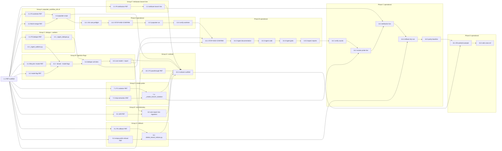

# Implementation Plan: omd-tenants-2-v17-pilot

## Overview

Onboard `gw_v17` — the `dev/gfs.v17` branch of
`NOAA-EMC/global-workflow.git` — as the first staging-lifecycle
pillar tenant on the AgentCore Python MCP/RAG runtime. After this
plan executes:

- A second worktree at `/mnt/workflow/dev-v17` sits beside the
  existing `/mnt/workflow/develop` on the shared EFS file system,
  populated by a multi-tenant version of `populate_workflow_efs.sh`.
- The three v8 ingestion entry scripts (`ingest_documentation_v8.py`,
  `ingest_code_v8.py`, `ingest_jjobs_v8.py`) accept `--tenant` and
  `--mode {diff,full}` flags; v17 is ingested in `--mode full`.
- Cross-tenant content-addressed dedupe (SHA-256 + a shared
  `mdc-content-sha-registry` index) is in place so files identical
  between `gw` and `gw_v17` are stored once and referenced from the
  prefixed indices without re-embedding.
- The functional smoke suite gains `_smoke_branch_isolation`, which
  asserts `JGDAS_ATMOS_ANALYSIS_WDQMS` is visible only under `gw_v17`
  and that `MPAS Voronoi` searches under `gw_v17` do not leak
  develop-sourced documents.
- Every response is attributed with both `*Tenant: <id>*` and
  `*Branch: <branch>*` (extending foundation R5).
- A rollback CLI `delete_tenant_indices.py` removes a tenant's
  prefixed OpenSearch indices and Neptune nodes without touching the
  empty-prefix `gw` baseline.
- A reusable runbook at `docs/runbooks/onboard-pillar-tenant.md`
  captures the pillar onboarding process with the v17 pilot as a
  worked example, ready for SFS / JEDI-GFS / GEFS v12 to follow.

The plan follows **TDD ordering**: every correctness property
(P1 – P6) and each named secondary property from design's
"Correctness Properties" section is written as a failing Hypothesis
test in `mcp_server_python/tests/properties/test_v17_pilot.py`
**before** the matching implementation lands. Each test is tagged
`# Feature: omd-tenants-2-v17-pilot, Property N: <text>` and runs
under the registered `v17` Hypothesis profile (≥ 100 iterations).

Tasks are grouped by design component (Groups A – H) and ordered by
explicit dependencies. Group F (attribution branch line) and
Group A (populate script) are independent and may land first;
Groups B and C are paired (B uses C's dedupe helpers); Groups D, E,
G layer on top; Group H (runbook) closes the code phase. Phases A –
D are operational and run after the code lands. The DAG and
parallelism waves are at the bottom of this file.

References:
- Requirements: `.kiro/specs/omd-tenants-2-v17-pilot/requirements.md`
- Design: `.kiro/specs/omd-tenants-2-v17-pilot/design.md` (sections 1 – 7)
- Property definitions: design.md "Correctness Properties" section
- Foundation runbook artefacts: `.kiro/specs/omd-tenants-1-foundation/`

All implementation paths are relative to the workspace root
`/mdc-mcp-rag/eib-mcp-rag-server/`.

## Tasks

- [ ] 1. Property test scaffold (TDD harness)
  - [ ] 1.1 Create `mcp_server_python/tests/properties/test_v17_pilot.py` skeleton
    - Add module docstring referencing
      `Feature: omd-tenants-2-v17-pilot`
    - Register the `v17` Hypothesis profile
      (`settings.register_profile("v17", max_examples=100, deadline=None)`)
      and load it at module top
    - Define reusable Hypothesis strategies (composable with the
      foundation's `valid_tenant_strategy` / `valid_catalog_strategy`):
      - `nonempty_prefix_tenant_strategy()` — like
        `valid_tenant_strategy` but `index_prefix` and `label_prefix`
        are guaranteed non-empty (skips passthrough cases that belong
        to foundation P3)
      - `disjoint_two_tenant_catalog_strategy()` — two tenants with
        disjoint non-empty prefixes (one of them may have empty
        prefixes, simulating `gw` vs `gw_v17`)
      - `synthetic_branch_tree_strategy(min_files=1, max_files=20)` —
        a dict mapping `relpath: bytes` for use as a fake worktree
        content
      - `lifecycle_strategy()` — sampled from
        `experimental | staging | production | merged | stale`
    - File: `mcp_server_python/tests/properties/test_v17_pilot.py` (new)
    - **Validates: harness for all P1 – P6 + secondary tests below**
    - _Expected to import-fail until the new modules in Groups A – G
      land; that is intentional._

- [ ] 2. Group F — Attribution branch-line extension (`src/tools/_attribution.py`)
  - [ ] 2.1 Write property test P4 — Attribution headers (tenant + branch)
    - **Property 4: Attribution headers** (design "Correctness Properties" §P4)
    - Hypothesis tag:
      `# Feature: omd-tenants-2-v17-pilot, Property 4: Attribution headers (tenant + branch)`
    - For any tenant `T` and any non-empty body `b`:
      - `attribute(b, T)` first line is `*Tenant: <T.tenant_id>*`
        (with optional trailing ` [STALE]` when
        `T.lifecycle == "stale"`)
      - When `T.branch` is non-empty, second line is exactly
        `*Branch: <T.branch>*`, third element is a blank line,
        fourth onward equals `b`
      - When `T.branch` is empty, second line is the blank line and
        no `*Branch:*` line is emitted (forward-compat with future
        non-branched tenants)
    - File: `mcp_server_python/tests/properties/test_v17_pilot.py`
    - **Validates: Requirements 6.1, 6.2, 6.3**
    - _Expected to FAIL: `_attribution.attribute` does not yet emit
      the branch line._

  - [ ] 2.2 Extend `attribute()` to prepend `*Branch: <branch>*`
    - Per design §5: when `tenant.branch` is non-empty, append a
      `*Branch: <branch>*` line between the `*Tenant: <id>*` line and
      the blank separator
    - Preserve existing `[STALE]` suffix on the tenant line; preserve
      the non-string passthrough behaviour from foundation
    - File: `mcp_server_python/src/tools/_attribution.py` (modified)
    - **Implements: Requirements 6.1, 6.2**
    - **Validated by: P4 (this group)**

  - [ ]* 2.3 Unit tests for branch-line edge cases
    - Empty-string branch → no branch line emitted (forward-compat)
    - Branch containing slashes / forward-slash-style tags
      (`dev/gfs.v17`, `release/2026q3`) preserved verbatim
    - `[STALE]` lifecycle interacts correctly with the branch line
      (`*Tenant: ... [STALE]*\n*Branch: ...*\n\n<body>`)
    - File: `mcp_server_python/tests/unit/test_attribution_branch.py` (new)
    - **Validates: Requirements 6.1, 6.2, 6.3**

- [ ] 3. Group A — Multi-tenant `populate_workflow_efs.sh` (design §1)
  - [ ] 3.1 Write property test P3 — Worktree containment and populate idempotence
    - **Property 3: Worktree containment and idempotence** (design §P3)
    - Hypothesis tag:
      `# Feature: omd-tenants-2-v17-pilot, Property 3: Worktree containment and populate idempotence`
    - Generate synthetic catalogs of size 1 – 4 with distinct
      `workflow_subdir` values
    - Drive the populate logic against a tmp-path "EFS" with a real
      git bare repo (created on the fly with `git init --bare` plus
      a few committed branches matching `tenant.branch` values)
    - Assert:
      - One worktree per tenant at
        `<EFS>/supported_repos/global-workflow/<workflow_subdir>`
      - Each worktree HEAD equals the catalog's `tenant.branch`
      - Running the populate logic n + 1 times leaves the same
        directory listing as n times (idempotence)
      - Removing one tenant from the catalog does NOT remove its
        worktree (per design §1 idempotency contract — explicit
        manual step)
    - Skip with `@pytest.mark.skipif(not _git_available(), ...)`
    - File: `mcp_server_python/tests/properties/test_v17_pilot.py`
    - **Validates: Requirements 2.1, 2.2, 2.4**
    - _Expected to FAIL until 3.3 lands._

  - [ ] 3.2 Write secondary property "Worktree fetch+merge against bare repo"
    - For a synthetic bare-repo worktree where
      `refs/remotes/origin/*` is unpopulated:
      - `git pull` fails with "no tracking information"
      - `git fetch origin <branch> && git merge --ff-only FETCH_HEAD`
        succeeds and advances HEAD to the new tip
    - Hypothesis tag:
      `# Feature: omd-tenants-2-v17-pilot, Property: Worktree fetch+merge against bare repo`
    - File: `mcp_server_python/tests/properties/test_v17_pilot.py`
    - **Validates: Requirement 2.3**
    - _Expected to FAIL until 3.3 lands (regression test for the
      Phase 0 lesson)._

  - [ ] 3.3 Implement multi-tenant `populate_workflow_efs.sh`
    - Per design §1 verbatim. Replaces (does not supersede yet)
      `populate_workflow_efs_phase0.sh`. Functions:
      - `read_tenants` — inline `python3.12` block reads
        `mcp_server_python/src/config/tenants.yaml` and emits one
        `<tenant_id>\t<workflow_subdir>\t<branch>` line per row
      - `mount_efs` — mounts file-system root via `mount -t efs -o tls`
      - `init_bare_repo` — `git clone --bare $GW_REMOTE
        $STAGING_MNT/.git` if missing
      - `ensure_ap_root` — creates
        `$STAGING_MNT/supported_repos/global-workflow` with
        `1000:1000`
      - `add_or_update_worktree(subdir, branch)`:
        - If worktree present: `git fetch origin <branch>` then
          `git merge --ff-only FETCH_HEAD` from inside the worktree
          (per design §1's bare-repo lesson; **never** `git pull`)
        - If worktree absent: `git worktree add <target> <branch>`
        - `chown -R 1000:1000 <target>` afterwards
      - `main` — mounts, inits bare repo, ensures AP root, loops over
        catalog rows, then asserts
        `<root>/dev-v17/dev/jobs/JGDAS_ATMOS_ANALYSIS_WDQMS` exists
        and emits `[OK] R2.2 satisfied`
    - Use `git -c safe.directory='*'` everywhere because the bare
      repo is owned by root on the EFS while the script runs as the
      operator user
    - File: `mcp_server_python/scripts/populate_workflow_efs.sh` (new
      — supersedes the Phase 0 script when it lands)
    - Mode: `chmod 0755`
    - **Implements: Requirements 2.1, 2.2, 2.3, 2.4**
    - **Validated by: P3, "Worktree fetch+merge against bare repo"**
    - **Note:** Operator-host script. Runtime expectation: first run
      adds `dev-v17` worktree (~few hundred MB working tree against
      the existing shared bare repo) in 1 – 5 minutes; subsequent
      runs are seconds (`fetch + merge --ff-only`). Bottleneck is
      EFS network throughput.

  - [ ]* 3.4 Update README for the populate script
    - Document the `tenants.yaml`-driven loop, the bare-repo +
      worktree pattern, the FETCH_HEAD-vs-`pull` lesson, and the
      idempotency contract
    - Cross-reference foundation Phase 0 closeout (`omd-tenants-1-foundation/tasks.md` §0)
    - File: `mcp_server_python/scripts/README_populate_workflow_efs.md` (modified)
    - **Documents: Requirements 2.3, 2.4**

- [ ] 4. Group C — Content-addressed dedupe (`scripts/_ingest_dedupe.py`, design §2.4)
  - [ ] 4.1 Write property test P5 — Dedupe correctness and counts
    - **Property 5: Dedupe correctness and counts** (design §P5)
    - Hypothesis tag:
      `# Feature: omd-tenants-2-v17-pilot, Property 5: Dedupe correctness and counts`
    - Strategy generates `synthetic_branch_tree_strategy()` content
      and a two-tenant catalog (A with empty prefix, B with non-empty
      prefix simulating `gw` and `gw_v17`)
    - Ingest each file under A first, then under B (using a stub
      `SHAIndex` backed by an in-memory dict + a stub vector_db
      collecting writes)
    - Assert for each duplicate file F:
      - B's write is a reference document
        (`metadata.is_reference is True`,
        `metadata.canonical_tenant == "A"`, `embedding is None`)
      - No Bedrock embedding call recorded for F under B
      - Both A and B can retrieve F's content via search (the
        rendering layer transparently follows
        `metadata.canonical_index` / `canonical_id`)
    - Assert aggregate invariants:
      - `dedupe_efficiency_pct ==
        round(documents_deduped / total_files_processed * 100, 1)`
      - `embedding_calls.bedrock_invocations ==
        documents_created_total - documents_deduped`
    - File: `mcp_server_python/tests/properties/test_v17_pilot.py`
    - **Validates: Requirements 3.4, 5.1, 5.4**
    - _Expected to FAIL: `_ingest_dedupe` does not exist yet._

  - [ ] 4.2 Implement `mcp_server_python/scripts/_ingest_dedupe.py`
    - Per design §2.4 verbatim:
      - `DedupeResult` dataclass:
        `(is_duplicate: bool, canonical_index: str | None, canonical_id: str | None)`
      - `class SHAIndex` with:
        - `REGISTRY_INDEX = "mdc-content-sha-registry"` (cross-tenant,
          unprefixed system index)
        - `hash_file(path) -> str` — streamed SHA-256 with 64 KiB
          chunks
        - `async lookup(sha) -> DedupeResult` — single OS query on
          the registry
        - `async register(sha, *, tenant, index, doc_id) -> None` —
          writes
          `{sha, tenant_id, index, doc_id, first_seen_at}` row
      - Reference-document shape factory
        `make_reference_document(*, tenant, source_path, sha,
        canonical) -> dict` matching the JSON in design §2.4:
        `metadata.is_reference == True`,
        `metadata.canonical_tenant`, `metadata.canonical_index`,
        `metadata.canonical_id`, `content == "<reference: see canonical doc>"`,
        `embedding is None`
    - File: `mcp_server_python/scripts/_ingest_dedupe.py` (new)
    - **Implements: Requirements 3.4, 5.1, 5.4**
    - **Validated by: P5**

  - [ ] 4.3 Implement `mcp_server_python/scripts/_ingest_walkers.py`
    - Per design §2.3:
      - `files_for_full_branch(worktree_root) -> Iterator[Path]` —
        `rglob("*")`, skip `.git/` and operator artefacts
      - `files_for_diff(worktree_root, baseline_branch="develop") ->
        Iterator[Path]` — shells out to
        `git diff --name-only <baseline>..HEAD`, maps to worktree
        paths, filters to existing files
    - File: `mcp_server_python/scripts/_ingest_walkers.py` (new)
    - **Implements: Requirements 3.2, 3.3**

  - [ ]* 4.4 Unit tests for `_ingest_dedupe` and `_ingest_walkers`
    - `SHAIndex.hash_file` correctness on small + binary files
    - `SHAIndex.lookup` returns sentinel `DedupeResult(False,
      None, None)` for unknown sha
    - `SHAIndex.register` is idempotent (re-registering same sha is
      a no-op or upsert)
    - `make_reference_document` shape matches design §2.4 exactly
    - `files_for_full_branch` excludes `.git/` and never yields
      directories
    - `files_for_diff` returns empty when worktree HEAD equals
      baseline
    - File: `mcp_server_python/tests/unit/test_ingest_dedupe.py` (new)
    - **Validates: Requirements 3.2, 3.3, 3.4**

- [ ] 5. Checkpoint — attribution + populate + dedupe land
  - Run
    `pytest mcp_server_python/tests/unit mcp_server_python/tests/properties/test_v17_pilot.py -k "P3 or P4 or P5 or fetch_merge or attribution_branch or ingest_dedupe"`
    and confirm P3, P4, P5, "Worktree fetch+merge against bare
    repo", attribution branch-line tests, and dedupe unit tests all
    pass
  - Confirm `mcp_server_python/scripts/populate_workflow_efs.sh -h`
    is executable and the inline `python3.12` block parses the
    catalog without error (run from a host with PyYAML available)
  - Ensure all tests pass, ask the user if questions arise.

- [ ] 6. Group B — Tenant-aware ingestion flags (design §2.1 – §2.3)
  - [ ] 6.1 Write secondary property "Lifecycle → mode mapping"
    - For each lifecycle value:
      - `experimental` → derived `--mode` is `diff`
      - `staging` and `production` → `full`
      - `merged` and `stale` → derive_mode raises (refuse)
    - Hypothesis tag:
      `# Feature: omd-tenants-2-v17-pilot, Property: Lifecycle to mode mapping`
    - File: `mcp_server_python/tests/properties/test_v17_pilot.py`
    - **Validates: Requirement 3.2**
    - _Expected to FAIL: `_derive_mode_from_lifecycle` does not exist yet._

  - [ ] 6.2 Write secondary property "Mode-flag enumeration"
    - Build a synthetic worktree with N changed files vs a baseline
      branch in a tmp-path bare repo
    - `--mode diff`: `files_for_diff(...)` returns exactly those N
      paths
    - `--mode full`: `files_for_full_branch(...)` returns one path
      per tree-walk file (excluding `.git`), and that count ≥ N
    - Hypothesis tag:
      `# Feature: omd-tenants-2-v17-pilot, Property: Mode-flag enumeration`
    - File: `mcp_server_python/tests/properties/test_v17_pilot.py`
    - **Validates: Requirements 3.2, 3.3**
    - _Expected to FAIL until walkers (4.3) land — note 4.3 is in
      Group C (lands earlier per group sequencing); this PBT closes
      the loop here for the flag wiring._

  - [ ] 6.3 Add `--tenant` and `--mode` flags + catalog resolution
        to ingestion entry scripts
    - Per design §2.1 + §2.2 across three files:
      - `mcp_server_python/scripts/ingest_documentation_v8.py`
      - `mcp_server_python/scripts/ingest_code_v8.py`
      - `mcp_server_python/scripts/ingest_jjobs_v8.py`
    - Each script gains:
      - `--tenant` (default `None` → resolves to catalog default)
      - `--mode {diff,full}` (default `None` → derived from
        `tenant.lifecycle` per the §2.2 mapping table)
      - Catalog load at top of `main` via `load_catalog()` (already
        from foundation Group A)
      - `MCP_WORKTREE_ROOT_OVERRIDE` env var for operator-host vs
        runtime path remapping (per design §2.2 comment)
      - `_derive_mode_from_lifecycle(lifecycle)` helper raising on
        `merged|stale`
    - Files modified:
      `mcp_server_python/scripts/ingest_documentation_v8.py`,
      `mcp_server_python/scripts/ingest_code_v8.py`,
      `mcp_server_python/scripts/ingest_jjobs_v8.py`
    - **Implements: Requirements 3.1, 3.2**
    - **Validated by: "Lifecycle to mode mapping",
      "Mode-flag enumeration"**

  - [ ] 6.4 Wire dedupe call sites into ingestion entry scripts
    - Per design §2.5 touch list. For each ingester:
      - Before producing a write, call `SHAIndex.lookup(sha)`
      - On hit: write a reference document via
        `make_reference_document(...)` and skip the embedding call;
        increment `documents_deduped`
      - On miss: produce the full content document, write it, then
        `SHAIndex.register(sha, tenant=tenant, index=..., doc_id=...)`
      - Pass `tenant=tenant` keyword on every
        `vector_db.write_documents(...)` and
        `graph_db.write_node(label=..., ...)` call (the adapter
        layer accepts this from foundation Groups D/E)
    - Files modified: same three entry scripts as 6.3
    - **Implements: Requirements 3.1, 3.4, 3.5, 3.6**

  - [ ] 6.5 Implement `_ingest_cost_model.py` and JSON report
        generator
    - Per design §4:
      - `_ingest_cost_model.py` exposes
        `default_baseline_ranges() -> dict` (the
        `comparison_to_phase_54_baseline` static ranges) and
        `evaluate_drift(observed, ranges) -> list[str]`
      - JSON report writer that emits the schema-version-1 shape from
        design §4 (required keys: `tenant_id`, `branch`, `mode`,
        `started_at`, `elapsed_seconds`, `total_files_processed`,
        `documents_created` (per-index), `documents_deduped`,
        `embedding_calls`, `graph`, `dedupe_efficiency_pct`,
        `warnings`, `comparison_to_phase_54_baseline`)
      - Chunk-ceiling `[WARN]` emission when
        `sum(documents_created.values()) / total_files_processed >
        3.0` (R5.2)
      - Reports written to
        `mcp_server_python/scripts/ingestion_reports/<tenant>_<ISO8601>.json`
    - Files:
      `mcp_server_python/scripts/_ingest_cost_model.py` (new),
      `mcp_server_python/scripts/ingestion_reports/.gitkeep` (new)
    - **Implements: Requirements 3.7, 5.1, 5.2, 5.3, 5.4**

  - [ ]* 6.6 Unit tests for `_ingest_cost_model`
    - Drift-flag detection per metric: each named metric outside its
      range adds the matching string to `drift_flags`
    - Chunk-ceiling warning triggers exactly at the
      `documents_per_file > 3.0` boundary
    - JSON report round-trips through `json.dumps`/`json.loads`
      without losing the `comparison_to_phase_54_baseline` block
    - File: `mcp_server_python/tests/unit/test_ingest_cost_model.py` (new)
    - **Validates: Requirements 3.7, 5.2, 5.3**

  - [ ]* 6.7 Unit tests for ingestion CLI surfaces
    - `--tenant <unknown>` → exits with the catalog's known-IDs hint
    - `--mode diff --tenant gw_v17` (overriding lifecycle default)
      → walker called with diff strategy
    - `--mode full --tenant gw` (default `gw` lifecycle is
      production) → walker called with full strategy
    - `merged` / `stale` lifecycle without explicit `--mode` →
      script refuses with stderr message
    - File: `mcp_server_python/tests/unit/test_ingest_cli_v17.py` (new)
    - **Validates: Requirements 3.1, 3.2**

- [ ] 7. Group D — Branch-isolation smoke probe (design §3)
  - [ ] 7.1 Write property test P1 — Tenant-scoped read isolation
    - **Property 1: Tenant-scoped read isolation** (design §P1)
    - Hypothesis tag:
      `# Feature: omd-tenants-2-v17-pilot, Property 1: Tenant-scoped read isolation`
    - For any two-tenant catalog drawn from
      `disjoint_two_tenant_catalog_strategy()`:
      - Populate stub OpenSearch with prefix-disjoint indices
      - Populate stub Neptune with prefix-disjoint node labels
      - Assert every hit from `search_documentation(Q, tenant=T)`
        has an `_index` starting with `T.index_prefix`
      - Assert every node from `find_dependencies(target,
        tenant=T)` has at least one label starting with
        `T.label_prefix`
      - Exception: dedupe reference-document expansion is allowed
        (`metadata.is_reference is True` → cross-tenant lookup of
        canonical content is intentional)
    - File: `mcp_server_python/tests/properties/test_v17_pilot.py`
    - **Validates: Requirements 3.1, 4.1, 7.2**
    - _Expected to FAIL until 7.3 lands (the probe gives the
      existence proof)._

  - [ ] 7.2 Write secondary property "Probe skip semantics"
    - For any catalog C lacking either `gw` or `gw_v17`,
      `_smoke_branch_isolation` raises `SkipProbe` (not
      `RuntimeError`); rendered output reports `[SKIP]`
    - For C containing both, the probe runs and either reports
      `[PASS]` (when stub adapters are configured to honour
      isolation) or `[FAIL]` with the assertion number (when stubs
      simulate a leak)
    - Hypothesis tag:
      `# Feature: omd-tenants-2-v17-pilot, Property: Probe skip semantics`
    - File: `mcp_server_python/tests/properties/test_v17_pilot.py`
    - **Validates: Requirement 4.2**
    - _Expected to FAIL until 7.3 lands._

  - [ ] 7.3 Implement `_smoke_branch_isolation` in `smoke_queries.py`
    - Per design §3 verbatim. The probe:
      - Loads catalog via `load_catalog(MCP_TENANT_CATALOG_PATH)`
      - Skips with `SkipProbe("requires both gw and gw_v17 in
        catalog")` when either is absent
      - Asserts (numbered failure messages):
        1. `find_dependencies("dev/jobs/JGDAS_ATMOS_ANALYSIS_WDQMS",
           tenant=v17)` returns ≥ 1 result
        2. `find_dependencies("dev/jobs/JGDAS_ATMOS_ANALYSIS_WDQMS",
           tenant=gw)` returns 0 results
        3. `search_documentation("MPAS Voronoi", tenant=gw)`
           returns ≥ 1 hit
        4. `search_documentation("MPAS Voronoi", tenant=v17)` has
           no hit whose `metadata.source` contains `/develop/`
      - Returns `True` only when all four hold
    - Register the probe in the `SMOKE_QUERIES` dict so
      `mcp_health_check(functional=True)` invokes it
    - File: `mcp_server_python/src/tools/smoke_queries.py` (modified)
    - **Implements: Requirements 4.1, 4.2, 4.3, 4.4**
    - **Validated by: P1, "Probe skip semantics"**

  - [ ]* 7.4 Unit tests for per-assertion `[FAIL]` messages
    - Mock the four underlying tool calls; flip each one to the
      failure shape in turn; assert the probe raises with the exact
      `R4.1#1` / `R4.1#2` / `R4.1#3` / `R4.1#4` prefix
    - File: `mcp_server_python/tests/unit/test_smoke_branch_isolation.py` (new)
    - **Validates: Requirement 4.1**

- [ ] 8. Group E — Cost & storage telemetry (design §4)
  - [ ] 8.1 Write secondary property "Cost-report drift detection"
    - For each named metric in
      `comparison_to_phase_54_baseline.expected_*_range`, generate
      observed values inside / below / above the range and assert
      `drift_flags` is empty / populated with the named metric
    - Hypothesis tag:
      `# Feature: omd-tenants-2-v17-pilot, Property: Cost-report drift detection`
    - File: `mcp_server_python/tests/properties/test_v17_pilot.py`
    - **Validates: Requirements 5.2, 5.3**
    - _Note: the cost-model module landed in 6.5; this PBT is the
      formal coverage that closes Group E._

  - [ ] 8.2 Wire cost-report emission into ingestion entry scripts
    - Each of the three entry scripts opens a report writer at start,
      accumulates per-tier counters during the run, finalizes the
      report at end of `main`, and emits the path on stdout
    - Counters wired: `total_files_processed`, per-index
      `documents_created`, `documents_deduped`,
      `embedding_calls.{bedrock_invocations, estimated_tokens, model}`,
      `graph.{nodes_created_by_label, relationships_created}`,
      `warnings`
    - `dedupe_efficiency_pct` computed at finalize via
      `round(documents_deduped / total_files_processed * 100, 1)`
    - Files modified: the three ingest_*_v8.py scripts
    - **Implements: Requirements 3.7, 5.1, 5.2, 5.3, 5.4**

  - [ ]* 8.3 Unit test for end-to-end report shape
    - Drive a synthetic 5-file ingestion through the entry script
      with a mocked `vector_db` / `graph_db` / `SHAIndex`
    - Assert the produced JSON has every key from the design §4
      schema, validates against
      `comparison_to_phase_54_baseline.expected_*_range`, and
      surfaces a `[WARN]` line when chunk count exceeds 3 ×
      `total_files_processed`
    - File: `mcp_server_python/tests/unit/test_ingestion_report_shape.py` (new)
    - **Validates: Requirements 3.7, 5.1, 5.2, 5.4**

- [ ] 9. Group G — Rollback script (design §6)
  - [ ] 9.1 Write property test P6 — Rollback isolation across config and data layers
    - **Property 6: Rollback isolation** (design §P6)
    - Hypothesis tag:
      `# Feature: omd-tenants-2-v17-pilot, Property 6: Rollback isolation across config and data layers`
    - For any tenant `T` with non-empty prefixes generated from
      `nonempty_prefix_tenant_strategy()`:
      - Config layer: removing `T` from a tmp `tenants.yaml` and
        reloading the catalog leaves the remaining tenants'
        `Tenant` dataclasses byte-equal to a pre-removal snapshot;
        `defaults.tenant_id` resolves to the same id
      - Data layer: running `delete_tenant_indices.py --tenant T`
        against a stub vector_db / graph_db pre-loaded with two
        tenants' worth of indices and labels deletes:
        - exactly the indices whose names start with `T.index_prefix`
        - exactly the nodes whose label set contains a label starting
          with `T.label_prefix`
        - no unprefixed index, no unprefixed label, and no other
          tenant's prefixed data
    - File: `mcp_server_python/tests/properties/test_v17_pilot.py`
    - **Validates: Requirements 7.1, 7.2, 7.3**
    - _Expected to FAIL: `delete_tenant_indices.py` does not exist yet._

  - [ ] 9.2 Write secondary property "Empty-prefix refusal"
    - For any tenant `T` with `index_prefix == ""` or
      `label_prefix == ""`:
      `delete_tenant_indices.py --tenant <T.tenant_id>` exits 2,
      writes the protective stderr message naming the empty prefix,
      and makes zero AWS calls
    - Hypothesis tag:
      `# Feature: omd-tenants-2-v17-pilot, Property: Empty-prefix refusal`
    - File: `mcp_server_python/tests/properties/test_v17_pilot.py`
    - **Validates: Requirement 7.3**
    - _Expected to FAIL until 9.3 lands._

  - [ ] 9.3 Implement `mcp_server_python/scripts/delete_tenant_indices.py`
    - Per design §6 verbatim. Behaviour:
      - `--tenant <id>` (required), `--dry-run`,
        `--catalog <path>` (default `src/config/tenants.yaml`)
      - Loads catalog; resolves tenant; refuses on unknown id
        (exit 1)
      - Refuses tenants with empty `index_prefix` or
        `label_prefix` (exit 2, protective stderr message)
      - Lists OpenSearch indices matching `tenant.index_prefix*` and
        prints the deletion plan
      - On non-dry-run: deletes each index via
        `vector_db.delete_index(idx)` then runs the cypher
        `MATCH (n) WHERE any(label IN labels(n) WHERE label STARTS
        WITH $prefix) DETACH DELETE n` against Neptune
      - The shared `mdc-content-sha-registry` is **not** touched
        (design §"Data Models" — system index)
    - File:
      `mcp_server_python/scripts/delete_tenant_indices.py` (new)
    - Mode: `chmod 0755`
    - **Implements: Requirements 7.1, 7.2, 7.3**
    - **Validated by: P6, "Empty-prefix refusal"**

  - [ ]* 9.4 Unit tests for `delete_tenant_indices.py`
    - Unknown tenant → exit 1, no AWS calls
    - Empty `index_prefix` → exit 2, no AWS calls (regression for
      gw-baseline protection)
    - `--dry-run` prints the plan and exits 0 with zero mutating
      calls (assert via mock counters)
    - Successful run deletes only the prefixed indices and only
      labels starting with the prefix
    - File:
      `mcp_server_python/tests/unit/test_delete_tenant_indices.py` (new)
    - **Validates: Requirements 7.1, 7.2, 7.3**

- [ ] 10. Group H — Onboarding runbook scaffold (design §7)
  - [ ] 10.1 Write property test P2 — Empty-prefix passthrough preservation
    - **Property 2: Empty-prefix passthrough preservation** (design §P2)
    - Hypothesis tag:
      `# Feature: omd-tenants-2-v17-pilot, Property 2: Empty-prefix passthrough preservation`
    - Pre-snapshot the document IDs in unprefixed indices
      (`mdc-workflow-docs-titan1024`, `mdc-jjobs-titan1024`,
      `mdc-code-titan1024`, `mdc-ee2-standards-titan1024`) and the
      set of unprefixed Neptune node labels
    - Drive a synthetic v17 ingestion through the stub adapters
      (uses the same machinery as P5)
    - Post-snapshot the same sets and assert byte-equal sets (no
      added IDs, no removed IDs, no added unprefixed labels)
    - File:
      `mcp_server_python/tests/properties/test_v17_pilot.py`
    - **Validates: Requirements 3.4, 7.1**
    - _Expected to PASS once Groups B and C land — this property is
      the tightest invariant the v17 pilot promises._

  - [ ] 10.2 Author runbook scaffold
        `docs/runbooks/onboard-pillar-tenant.md`
    - Per design §7. Sections (TODO blocks for §"v17 worked
      example" filled in during Phase D):
      1. Pre-flight checks (CDK access point exists, IAM policy
         attached, EFS mounted, operator host in same VPC)
      2. Catalog entry validation
         (`python3.12 -m src.config.tenants validate ...`)
      3. Decision matrix for `diff` vs `full` ingestion mode
         (including the lifecycle → mode mapping table from design
         §2.2)
      4. EFS worktree creation (run `populate_workflow_efs.sh`)
      5. Ingestion command (the three v8 entry scripts with
         `--tenant gw_v17 --mode full`)
      6. Cost validation (read JSON reports, check `drift_flags`)
      7. Smoke probe verification
         (`mcp_health_check(functional=True)` →
         `branch_isolation: [PASS]`)
      8. Rollback procedure (the dry-run / execute / worktree
         remove / catalog edit sequence from design §6)
      9. Worked example placeholder for the v17 pilot (filled in
         during Phase D)
      10. Phase 54 wiki cross-reference (link added during Phase D)
    - File: `docs/runbooks/onboard-pillar-tenant.md` (new)
    - **Implements: Requirements 8.1, 8.2 (decision matrix
      embedded), 8.3 (cross-reference scaffolded)**
    - _Note: The "worked example" section (R8.4) is filled in
      during Phase D after the v17 ingestion run produces real
      numbers. The scaffold contains explicit `TODO(Phase D):` markers
      for each metric._

  - [ ]* 10.3 README cross-link
    - Add a top-level link to the new runbook from
      `mcp_server_python/scripts/README.md` (or equivalent) so
      operators discover it from the scripts directory
    - File: `mcp_server_python/scripts/README.md` (modified, if
      present)
    - **Documents: Requirement 8.3**

- [ ] 11. Checkpoint — code phase complete
  - Run `pytest mcp_server_python/tests/properties/test_v17_pilot.py
    mcp_server_python/tests/unit/`
    and confirm P1, P2, P3, P4, P5, P6 plus all secondary properties
    pass
  - Run `python3.12 -m src.config.tenants validate
    mcp_server_python/src/config/tenants.yaml`
    and confirm exit 0 (catalog already contains `gw_v17` per
    foundation Phase A; this is a sanity gate)
  - Confirm `mcp_server_python/scripts/delete_tenant_indices.py
    --tenant gw --dry-run` exits 2 with the empty-prefix protective
    message (regression check against the baseline)
  - Ensure all tests pass, ask the user if questions arise.

- [ ] 12. Phase A — Operational: populate EFS worktree for v17
        (rollout phase A)
  - [ ] 12.1 Pre-flight: confirm temporary EFS SG ingress rule is in place
    - Check that `sgr-04b3d7802002780ce` (operator host SG
      `sg-09bb60ffa41137076` → EFS SG `sg-04bd2b41beecd1201`,
      TCP 2049) still exists; if not, run
      `SETUP_AWS/operator/sync-aws-resources.sh` to re-add it
      (idempotent)
    - Verify with
      `aws ec2 describe-security-group-rules --filters
      Name=group-id,Values=sg-04bd2b41beecd1201`
    - **Implements: Requirement 11.9 (carried-forward foundation
      drift; required for Phase A)**
    - _Stop and confirm before proceeding to 12.2 if the rule is
      missing and `sync-aws-resources.sh` is not available._

  - [ ] 12.2 STOP-AND-CONFIRM gate before EFS write
    - **STOP** — the next step writes to the production EFS file
      system `fs-032d52e4677000758` from the operator EC2 host. It
      adds a `dev-v17` worktree alongside the existing `develop`
      worktree under
      `<EFS>/supported_repos/global-workflow/`. It does NOT modify
      the existing `develop` worktree contents.
    - **Reversibility**: `git -C /mnt/efs-staging worktree remove
      /mnt/efs-staging/supported_repos/global-workflow/dev-v17`
    - **Blast radius**: extra ~ few hundred MB of working-tree files
      under the access-point root; bare repo `<EFS>/.git` is
      unchanged (object store is shared).
    - Confirm with the user before proceeding.

  - [ ] 12.3 Run multi-tenant `populate_workflow_efs.sh` for `gw_v17`
    - From the operator EC2 host (NOT the AgentCore runtime — the
      runtime cannot write to EFS; it only mounts read-only via the
      access point):
      ```bash
      bash mcp_server_python/scripts/populate_workflow_efs.sh
      ```
    - The script reads `tenants.yaml`, sees both `gw` and `gw_v17`,
      no-ops the existing `develop` worktree, and adds a new
      `dev-v17` worktree
    - **Runtime expectation: 1 – 5 minutes** (working-tree checkout
      against the existing shared bare repo; full clone is not
      needed). Bottleneck is EFS network throughput.
    - **Implements: Requirements 2.1, 2.2, 2.4 (live)**
    - _Reversible via worktree-remove (see 12.2)._

  - [ ] 12.4 Verify worktree presence and the v17-only J-Job
    - From the operator host:
      ```bash
      ls /mnt/efs-staging/supported_repos/global-workflow/dev-v17/dev/jobs/JGDAS_ATMOS_ANALYSIS_WDQMS
      stat -c '%U:%G' /mnt/efs-staging/supported_repos/global-workflow/dev-v17
      ```
    - Confirm the file exists (R2.2) and the worktree root is owned
      by `1000:1000` (R2.1)
    - Unmount `/mnt/efs-staging` once verified
    - **Implements: Requirements 2.1, 2.2 (live verification)**

- [ ] 13. Phase B — Operational: run v17 full-branch ingestion
        (rollout phase B)
  - [ ] 13.1 STOP-AND-CONFIRM gate before AWS data-layer writes
    - **STOP** — the next steps write
      `gw_v17_*` indices to the production OpenSearch domain
      (`mdc-mcp-rag-search`) and create
      `:GW_V17_*`-labelled nodes in the production Neptune cluster
      (`mdc-mcp-graprag-neptune-1`). They also issue Bedrock
      embedding calls under the `mdc-mcp-rag-ecs-task-role` role.
    - **Estimated incremental cost**: full-branch ingestion of
      ~ 500+ files. Per design §"Migration / rollout plan" the run
      will produce a JSON report under
      `mcp_server_python/scripts/ingestion_reports/` with the
      actual cost; the design's `comparison_to_phase_54_baseline`
      ranges set the expected-tokens window at
      [1.5M, 2.5M].
    - **Reversibility**: `delete_tenant_indices.py --tenant gw_v17`
      removes the prefixed data without affecting `gw`.
    - **Blast radius**: zero impact on existing `gw` indices and
      labels (Property P2). The unprefixed
      `mdc-content-sha-registry` system index gets new rows but is
      additive.
    - Confirm with the user before proceeding.

  - [ ] 13.2 Run full-branch ingestion of `gw_v17` documentation
    - From the operator host (or any host with access to OpenSearch
      + Neptune + Bedrock and the configured envvars from the Python
      port progress notes):
      ```bash
      python3.12 mcp_server_python/scripts/ingest_documentation_v8.py \
          --tenant gw_v17 --mode full --tiers tier1_global_workflow
      ```
    - **Runtime expectation: 30 – 90 minutes** (depends on cache
      warmth, dedupe rate, Bedrock latency)
    - On completion the script writes a JSON report under
      `mcp_server_python/scripts/ingestion_reports/`
    - **Implements: Requirements 3.1, 3.2, 3.3, 3.5, 3.7 (live)**

  - [ ] 13.3 Run full-branch ingestion of `gw_v17` code metadata
    - ```bash
      python3.12 mcp_server_python/scripts/ingest_code_v8.py \
          --tenant gw_v17 --mode full
      ```
    - Writes `gw_v17_mdc-code-titan1024` documents and
      `:GW_V17_File`, `:GW_V17_FortranSubroutine`,
      `:GW_V17_PythonModule` Neptune nodes
    - **Runtime expectation: 30 – 60 minutes**
    - **Implements: Requirements 3.1, 3.6 (live)**

  - [ ] 13.4 Run full-branch ingestion of `gw_v17` J-Jobs
    - ```bash
      python3.12 mcp_server_python/scripts/ingest_jjobs_v8.py \
          --tenant gw_v17 --mode full
      ```
    - Writes `gw_v17_mdc-jjobs-titan1024` documents and
      `:GW_V17_JJob` Neptune nodes (~91 J-Jobs per design §4
      example shape)
    - **Runtime expectation: 5 – 15 minutes**
    - **Implements: Requirements 3.1, 3.5, 3.6 (live)**

  - [ ] 13.5 Inspect ingestion JSON reports
    - Read each of the three JSON reports under
      `mcp_server_python/scripts/ingestion_reports/`
    - Confirm `drift_flags` is empty (or, if not, decide whether to
      proceed; document the deviation in 15.2's worked example)
    - Confirm `dedupe_efficiency_pct` is in the expected
      `[20.0, 50.0]` range (R5.4)
    - Capture the totals (documents_created per index,
      documents_deduped, embedding_calls.bedrock_invocations,
      estimated_tokens) for the runbook worked example (R8.4)
    - **Implements: Requirements 3.7, 5.1, 5.2, 5.3, 5.4 (live
      verification)**

- [ ] 14. Phase C — Operational: verification + parity baseline
        (rollout phase C)
  - [ ] 14.1 Verify per-index document counts
    - ```bash
      curl -sS -k \
        -X GET "${OPENSEARCH_ENDPOINT}/_cat/indices/gw_v17_*?v"
      ```
      (use SigV4 signing wrapper per existing `ingest_documentation_v8`
      auth pattern)
    - Confirm three indices exist:
      `gw_v17_mdc-workflow-docs-titan1024`,
      `gw_v17_mdc-code-titan1024`,
      `gw_v17_mdc-jjobs-titan1024`
    - Confirm document counts match the JSON report totals from 13.5
    - **Implements: Requirement 3.5 (live verification)**

  - [ ] 14.2 Run `_smoke_branch_isolation` via `mcp_health_check`
    - From the agentcore-mcp-rag MCP client:
      ```
      mcp_health_check(functional=True)
      ```
    - Confirm `branch_isolation: [PASS]` and the four numbered
      assertions all show their expected counts
    - **Implements: Requirements 4.1, 4.2, 4.3 (live verification)**

  - [ ] 14.3 Verify attribution headers on `gw_v17` responses
    - Call `find_dependencies(target="dev/jobs/JGDAS_ATMOS_ANALYSIS_WDQMS",
      tenant_id="gw_v17")` via the MCP client
    - Confirm the rendered output's first two lines are exactly
      `*Tenant: gw_v17*` and `*Branch: dev/gfs.v17*`
    - Call the same with `tenant_id="gw"` and confirm `*Tenant: gw*`
      / `*Branch: develop*` for the develop case
    - **Implements: Requirements 6.1, 6.2 (live verification)**

  - [ ] 14.4 Dry-run the rollback script
    - ```bash
      python3.12 mcp_server_python/scripts/delete_tenant_indices.py \
          --tenant gw_v17 --dry-run
      ```
    - Confirm the printed plan lists the three `gw_v17_*` indices
      and the cypher targeting `:GW_V17_*` labels
    - Confirm exit 0 and that no AWS write was made (cross-check
      OpenSearch + Neptune counts unchanged after the call)
    - **Implements: Requirement 7.2 (live verification)**

  - [ ] 14.5 Capture parity baseline for `gw_v17`
    - Snapshot a fixed corpus of `(tool_name, args)` pairs against
      the `gw_v17` tenant under
      `mcp_server_python/tests/parity/golden/gw_v17/` analogous to
      the foundation `gw` baseline. The corpus should at minimum
      include:
      - `find_dependencies(target="dev/jobs/JGDAS_ATMOS_ANALYSIS_WDQMS")`
      - `search_documentation(query="MPAS Voronoi")`
      - `get_code_context(symbol="...")` for a v17-specific symbol
      - `describe_component(component="JGFS_FORECAST")` (shared)
    - File: `mcp_server_python/tests/parity/golden/gw_v17/` (new
      directory + golden files)
    - **Implements: design "Migration / rollout plan" Phase C step
      4 (parity-baseline capture for future regression)**

- [ ] 15. Phase D — Operational: runbook publication
        (rollout phase D)
  - [ ] 15.1 Fill in the runbook's v17 worked example with real numbers
    - Replace each `TODO(Phase D):` marker in
      `docs/runbooks/onboard-pillar-tenant.md` (created in 10.2)
      with the actual metrics from 13.5:
      - per-index `documents_created`
      - `documents_deduped`
      - `embedding_calls.bedrock_invocations` and
        `estimated_tokens`
      - `dedupe_efficiency_pct`
      - elapsed wall-clock time per ingestion script
      - any `drift_flags` and the operator decision recorded for
        each
    - File: `docs/runbooks/onboard-pillar-tenant.md` (modified)
    - **Implements: Requirement 8.4**

  - [ ] 15.2 Cross-reference the runbook from the Phase 54 wiki
    - Add a link to `docs/runbooks/onboard-pillar-tenant.md` from
      the Phase 54 Initiative wiki page
    - Capture the wiki-link URL inside the runbook (cross-link)
    - **Implements: Requirement 8.3**

  - [ ]* 15.3 CHANGELOG entry
    - Document the new image tag (if a runtime rebuild was needed
      for the dedupe + branch-line + smoke-probe changes), the
      tenant ingestion totals, and the `[branch_isolation: PASS]`
      milestone
    - File: `CHANGELOG.md` (modified)

- [ ] 16. Final checkpoint — feature complete
  - Confirm: P1, P2, P3, P4, P5, P6 all pass; all secondary property
    tests pass; `mcp_health_check(functional=True)` reports
    `branch_isolation: [PASS]`; the dry-run rollback prints a sane
    plan; the runbook's worked example is filled in.
  - This workflow is now complete. The user can begin executing the
    follow-on pillar tenants (SFS, JEDI-GFS, GEFS v12) using the
    runbook. Open `tasks.md` and click "Start task" next to any item
    to execute it through the spec-task-execution agent.

## Notes

- Tasks marked with `*` are optional and can be skipped for a faster
  Phase B / C landing. The non-optional tasks form the minimal
  viable rollout.
- Property tests are written **before** their implementation
  (TDD/property-first). Each property task is annotated as
  "_Expected to FAIL_" until the matching implementation lands; the
  matching implementation's "Validated by:" annotation closes the
  loop.
- All adapter changes from the foundation are reused unchanged: the
  `tenant=` keyword on `vector_db.write_documents`,
  `graph_db.write_node`, `vector_db.query`, `graph_db.query` was
  delivered in foundation Groups D and E.
- The `gw_v17` catalog row is **already present** in
  `mcp_server_python/src/config/tenants.yaml` from foundation Phase
  A; this spec does not add it. It is a strict assumption (R1) that
  the catalog validator passes against the existing row.
- The temporary EFS SG ingress rule
  `sgr-04b3d7802002780ce` from foundation Phase 0 must still be in
  place for Phase A (12.x). If it has been revoked, run
  `SETUP_AWS/operator/sync-aws-resources.sh` to re-add it
  idempotently before populating.
- The v17 worktree creation **must** run from the operator EC2 host;
  the AgentCore runtime mounts EFS read-only via the access point and
  cannot write to the bare repo or worktrees.
- The runbook (Group H) is intentionally scaffolded with
  `TODO(Phase D):` markers in 10.2 and finalized in 15.1 — the worked
  example cannot be authored until Phase B / C produce real numbers.
- Phase A – D operational tasks include explicit STOP-AND-CONFIRM
  gates (12.2, 13.1) before any AWS write; each gate documents
  reversibility and blast radius.

## Mermaid task DAG



## Task Dependency Graph

```json
{
  "waves": [
    { "id": 0, "tasks": ["1.1"] },
    { "id": 1, "tasks": ["2.1", "3.1", "3.2", "4.1", "6.1", "6.2", "7.1", "7.2", "8.1", "9.1", "9.2", "10.1"] },
    { "id": 2, "tasks": ["2.2", "3.3", "4.2", "4.3", "7.3", "9.3"] },
    { "id": 3, "tasks": ["2.3", "3.4", "6.3", "7.4", "9.4"] },
    { "id": 4, "tasks": ["6.4", "6.5"] },
    { "id": 5, "tasks": ["6.6", "6.7", "8.2"] },
    { "id": 6, "tasks": ["8.3", "10.2"] },
    { "id": 7, "tasks": ["10.3"] },
    { "id": 8, "tasks": ["12.1"] },
    { "id": 9, "tasks": ["12.2"] },
    { "id": 10, "tasks": ["12.3"] },
    { "id": 11, "tasks": ["12.4"] },
    { "id": 12, "tasks": ["13.1"] },
    { "id": 13, "tasks": ["13.2"] },
    { "id": 14, "tasks": ["13.3"] },
    { "id": 15, "tasks": ["13.4"] },
    { "id": 16, "tasks": ["13.5"] },
    { "id": 17, "tasks": ["14.1"] },
    { "id": 18, "tasks": ["14.2", "14.3", "14.4"] },
    { "id": 19, "tasks": ["14.5"] },
    { "id": 20, "tasks": ["15.1"] },
    { "id": 21, "tasks": ["15.2", "15.3"] }
  ]
}
```
