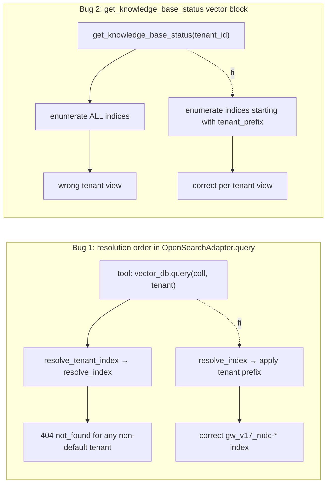

# Design Document — `opensearch-tenant-resolution-fix`

## Overview

Two related tool-layer bug fixes that ship in one runtime image and one deploy.

**Bug 1.** `OpenSearchAdapter.query` applies the tenant `index_prefix` *before*
asking the production-index map to translate the Logical_Collection. The map is
keyed by the unprefixed legacy name, so the prefixed key is not found and the
adapter targets a non-existent index. Fix: swap the order — resolve the legacy
name first, then prepend the tenant prefix.

**Bug 2.** `get_knowledge_base_status`'s vector-side block enumerates every
OpenSearch index regardless of the active tenant, so non-default tenants see
the global roll-up instead of their own. Fix: filter the listing by the active
tenant's `index_prefix` (empty prefix → the unprefixed/base set).

A third, smaller item — the v17 code index is named
`gw_v17_mdc-code-titan1024` instead of `gw_v17_mdc-code-context-titan1024` —
is captured as a documented, gated, operator-run OpenSearch alias, not a code
change. The alias is the safest fix because it is reversible and avoids any
write to the `mdc-code-context-titan1024` namespace gw uses.

Total production change: ~10 lines in `OpenSearchAdapter.query` and
`multi_collection_query`, ~30 lines in `_render_vector_status_block`. No infra
change, no schema change, no re-ingestion.

## Architecture



## Components and Interfaces

### Bug 1 — Resolution order in `OpenSearchAdapter.query`

Current code (`src/data/opensearch_adapter.py` line ~206):

```python
scoped = self.resolve_tenant_index(collection, tenant) if tenant else collection
index = resolve_index(scoped, self._profile.short_name)
```

Fix — swap the order, two lines:

```python
# Map Logical_Collection to Real_Index_Name BEFORE applying tenant prefix.
# The Production_Index_Map is keyed by the unprefixed legacy name; if we
# prefix first, the lookup misses and we target a non-existent index.
real = resolve_index(collection, self._profile.short_name)
index = self.resolve_tenant_index(real, tenant) if tenant else real
if real == collection:
    log.info(
        "[opensearch] Logical_Collection %r not in Production_Index_Map "
        "(profile=%s, tenant=%s); using passthrough -> index=%r",
        collection, self._profile.short_name,
        getattr(tenant, "tenant_id", "none"), index,
    )
```

The same swap is applied in `multi_collection_query` (which today calls `query`
per-collection — the fix flows through, but verify no inline duplication exists).

`resolve_tenant_index` and `resolve_index` themselves are unchanged. The
Production_Index_Map (`PRODUCTION_INDICES_BY_PROFILE`) is unchanged.

### Bug 2 — Tenant-scoped vector status block

Current code in `src/tools/semantic_search.py::_render_vector_status_block`
calls `vector_db.health_check(deep=True)` and renders whatever indices that
returns (the global set). It receives no tenant signal.

Fix — pass the active tenant down (helper already exists: `_tenant()`), then
filter the enumerated indices by the tenant's `index_prefix`:

```python
async def _render_vector_status_block(vector_db: Any) -> list[str]:
    tenant = _tenant()
    prefix = tenant.index_prefix if tenant else ""
    other_prefixes = _other_tenant_prefixes(tenant)  # for the gw exclusion case
    health = await vector_db.health_check(deep=True)
    indices = _filter_indices_by_tenant(
        health, prefix=prefix, other_prefixes=other_prefixes,
    )
    # ... render `indices` instead of the unfiltered set ...
```

`_filter_indices_by_tenant`:

- For non-default tenant (`prefix != ""`): keep indices whose name **starts with** `prefix`.
- For default tenant (`prefix == ""`): keep indices whose name does **not start with** any other declared tenant prefix (mirrors the gw label-side exclusion logic in `tenancy.resolver.tenant_label_predicate`).

The header line gains a small `**Tenant prefix:** gw_v17_` block (or `(none)`)
so the caller sees the scoping. Total tally + status flag are recomputed from
the filtered subset.

### V17 code-index rename — gated operator task (R5)

The v17 ingest pipeline wrote `gw_v17_mdc-code-titan1024` (no `-context-`).
After Bug 1 lands, queries for `code-with-context-v8-0-0` under `tenant_id=gw_v17`
will resolve to `gw_v17_mdc-code-context-titan1024` — which doesn't exist yet.
Fix: create an OpenSearch alias.

```bash
curl -s --aws-sigv4 "aws:amz:us-east-1:es" --user "$AWS_ID:$AWS_SECRET" \
  -X POST "https://${OS_ENDPOINT}/_aliases" \
  -H 'Content-Type: application/json' -d '{
    "actions": [
      {"add": {
        "index": "gw_v17_mdc-code-titan1024",
        "alias": "gw_v17_mdc-code-context-titan1024"
      }}
    ]
  }'
```

The alias is reversible (POST `_aliases` with `remove`), idempotent (re-running
the same `add` is a no-op when the alias exists), and avoids any write to
`mdc-code-context-titan1024` (the gw production index). The operator step is in
the spec's tasks, gated by STOP-AND-CONFIRM before execution.

## Data Models

No persistent data change. The Vector_Status_Block adds one optional rendered
line ("Tenant prefix:") and filters its own existing data structure.

## Correctness Properties

### Property 1: Resolution composition

For any Logical_Collection `c` and any embedding profile `p`,
`OpenSearchAdapter.query(c, tenant=t).index` equals
`f"{t.index_prefix}{resolve_index(c, p)}"` — Resolve_Index is always applied to
the unprefixed Logical_Collection.

**Validates: Requirements 1.1, 1.2, 1.3, 1.4**

### Property 2: Default-tenant equivalence

For every Logical_Collection in the Production_Index_Map and every embedding
profile, the Resolved_Index produced for `tenant.index_prefix == ""` is
byte-equal to the Resolved_Index produced by the pre-fix code path.

**Validates: Requirements 1.1, 3.2**

### Property 3: Vector-status tenant scoping

For any tenant `t` whose `index_prefix` is `p`,
`_render_vector_status_block(tenant=t)` lists only indices whose name starts
with `p` (or, when `p == ""`, only indices that do **not** start with any
other declared tenant prefix).

**Validates: Requirements 2.1, 2.2, 2.4**

### Property 4: Healthy-path equivalence

For any call site that passes no `tenant_id` (or `tenant_id="gw"` with empty
prefix), the adapter's Resolved_Index and the status block's rendered output
are byte-equivalent to the pre-fix output on the same inputs.

**Validates: Requirements 3.1, 3.2**

## Error Handling

| Condition | Behaviour | Requirement |
|-----------|-----------|-------------|
| Logical_Collection not in Production_Index_Map | passthrough + info log; query proceeds against `<prefix><collection>` (today's fallback) | 1.3, 4.1 |
| Tenant prefix empty AND collection in map | resolved name is the Real_Index_Name unchanged | 1.1 |
| Tenant prefix non-empty AND collection in map | resolved name is `<prefix><real_name>` | 1.2 |
| `_render_vector_status_block` called with no active tenant | scope to default tenant (treat as empty prefix; preserves today's behaviour) | 2.1 |
| Index 404 after correct resolution | the adapter's existing exception still raises; degraded handling is the companion spec `graceful-missing-index-handling`, not this one | 5.4 |

## Testing Strategy

### Unit tests (`tests/unit/test_data_layer.py` extension)

Bug 1:
- `Os_Adapter.query("code-with-context-v8-0-0", tenant=tenant_v17, profile="titan1024")`
  → `index == "gw_v17_mdc-code-context-titan1024"`. (Mocked `_run_session`.)
- `Os_Adapter.query("code-with-context-v8-0-0", tenant=tenant_gw)`
  → `index == "mdc-code-context-titan1024"`. (Default-tenant equivalence.)
- `Os_Adapter.query("nonexistent-collection-v9", tenant=tenant_v17)`
  → `index == "gw_v17_nonexistent-collection-v9"` (passthrough) AND emits the
  miss log line exactly once.
- `Os_Adapter.multi_collection_query` with mixed mapped + unmapped collections
  resolves each entry per Bug 1's rule.
- Bug-condition exploration (Bugfix Workflow): a single test that asserts the
  Resolved_Index is the broken `"gw_v17_code-with-context-v8-0-0"` on the
  unfixed code (or that the assertion equals the broken name) and the correct
  `"gw_v17_mdc-code-context-titan1024"` on the fixed code. Confirm both
  directions before commit.

### Tool tests (`tests/unit/test_semantic_search_tools.py` extension)

Bug 2:
- `MockVectorDB.health_check(deep=True)` returns a synthetic mix of
  `mdc-*` indices and `gw_v17_mdc-*` indices.
  - With `tenant_id="gw"` → only `mdc-*` indices appear in the rendered table.
  - With `tenant_id="gw_v17"` → only `gw_v17_mdc-*` indices appear.
- The header includes a `**Tenant prefix:** gw_v17_` line for non-default
  tenants and `(none)` for default.
- Total tally and `Status` flag reflect the filtered subset.
- Bug-condition exploration: asserts `kb_status(gw_v17)` returns the same
  collection list as `kb_status(gw)` on the unfixed code, and a different
  (smaller, prefix-scoped) list on the fixed code.

No property-based tests required — the fix is a localised order swap with a
finite, fully-enumerable input space. Hypothesis would not add coverage.

## Open Questions

None. Both fixes are localised, mechanical, and have a clean default-tenant
byte-equivalence contract.
