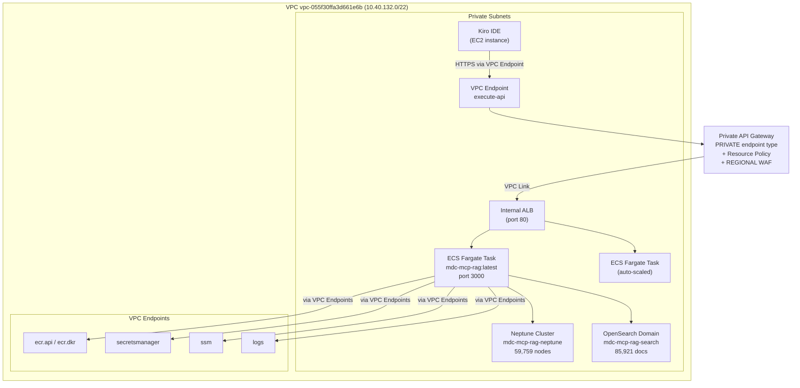
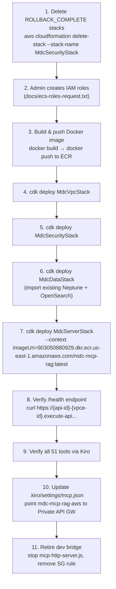

# Design Document: Private MCP Deployment

## Overview

This design describes the production deployment of the MDC MCP RAG Server (51 tools, Node.js) to AWS ECS Fargate behind a Private API Gateway. The architecture eliminates all internet-facing components — no CloudFront, no Internet Gateway, no public endpoints. All traffic flows within the VPC or through VPC endpoints.

The deployment modifies four existing CDK stacks (`MdcVpcStack`, `MdcSecurityStack`, `MdcDataStack`, `MdcServerStack`) to:
1. Remove CloudFront distribution and CLOUDFRONT-scoped WAF
2. Convert API Gateway from REGIONAL to PRIVATE endpoint type
3. Import pre-created IAM roles (admin-created due to PowerUserRestrictions)
4. Import existing Neptune cluster and OpenSearch domain via CDK (not recreate)
5. Produce an admin request document for the two ECS IAM roles

The end state: Kiro connects to `https://{api-id}-{vpce-id}.execute-api.us-east-1.amazonaws.com/prod/mcp` and reaches the same 51 tools currently served by the dev bridge on port 3000.

## Architecture

### Network Topology



### Request Flow

1. Kiro MCP client sends HTTPS POST to `https://{api-id}-{vpce-id}.execute-api.us-east-1.amazonaws.com/prod/mcp`
2. Request enters VPC through the `execute-api` VPC endpoint (interface endpoint with private DNS)
3. Private API Gateway validates the request against the resource policy (must originate from the VPC endpoint)
4. WAF (REGIONAL scope) applies rate limiting and managed rules
5. API Gateway proxies to the Internal ALB via VPC Link
6. ALB routes to a healthy ECS Fargate task
7. ECS task processes the MCP request using Neptune (graph) and OpenSearch (vectors)
8. Response returns through the same path

### What's Removed vs. Current Stack

| Component | Current (`mdc-server-stack.ts`) | After This Change |
|-----------|-------------------------------|-------------------|
| CloudFront Distribution | Yes (HTTPS_ONLY, caching disabled) | Removed |
| CLOUDFRONT WAF | Yes (`mdc-mcp-rag-cf-waf`) | Removed |
| API Gateway endpoint type | REGIONAL | PRIVATE |
| API Gateway auth | Cognito User Pools | Resource Policy (VPC endpoint) |
| Cognito User Pool | Created in MdcSecurityStack | Removed (not needed for private access) |
| WAF scope | CLOUDFRONT + REGIONAL | REGIONAL only |
| CloudFront outputs | `CloudFrontDomain`, `McpEndpoint` | Removed |
| Primary endpoint output | CloudFront domain | Private API Gateway URL |

## Components and Interfaces

### Component 1: MdcServerStack (Modified)

The server stack undergoes the largest change. Key modifications:

**Removals:**
- `cloudfront.Distribution` resource and all CloudFront imports
- `cloudfront-origins` import
- `CfnWebACL` with scope CLOUDFRONT (`MdcCfWebAcl`)
- `CognitoUserPoolsAuthorizer` and Cognito-related auth config
- `CloudFrontDomain` and `McpEndpoint` CfnOutputs
- `distribution` public property
- `cognito` import and `userPool` from props

**Changes to API Gateway:**
- Endpoint type: `REGIONAL` → `PRIVATE`
- Auth: Cognito authorizer → Resource policy restricting to VPC endpoint
- Resource policy: Allow `execute-api:Invoke` only from `vpce-*` (the execute-api VPC endpoint)
- Add `/health` endpoint (no auth, proxies to ALB `/health`)

**Changes to Props Interface:**
```typescript
interface MdcServerStackProps extends cdk.StackProps {
  vpc: ec2.IVpc;
  webAcl: wafv2.CfnWebACL;  // REGIONAL WAF from MdcSecurityStack
  // Removed: userPool (no Cognito needed for private access)
}
```

**WAF Association:**
- Associate the existing REGIONAL WAF (`mdc-mcp-rag-waf` from MdcSecurityStack) with the API Gateway stage
- Use `wafv2.CfnWebACLAssociation` to bind WAF to the API Gateway stage ARN

**New Outputs:**
```typescript
new cdk.CfnOutput(this, 'PrivateApiEndpoint', {
  value: `https://${api.restApiId}.execute-api.${this.region}.amazonaws.com/prod/mcp`,
  description: 'Private API Gateway MCP endpoint (append vpce-id for access)',
});
```

**VPC Link:**
- Create a `VpcLink` pointing to the Internal ALB
- Use `apigateway.Integration` with type `HTTP_PROXY` and connection type `VPC_LINK`

### Component 2: MdcSecurityStack (Modified)

**Removals:**
- `cognito.UserPool` and resource server (not needed for private-only access)
- `userPool` public property

**Retained:**
- ECS IAM role imports (`fromRoleName`)
- ECS security group
- Secrets Manager secrets
- SSM parameters
- REGIONAL WAF WebACL

**Changes to Exports:**
```typescript
// Remove: public readonly userPool: cognito.UserPool;
// Keep everything else
```

### Component 3: MdcDataStack (Modified for Import)

The data stack switches from creating Neptune/OpenSearch to importing existing resources.

**Neptune Import:**
```typescript
const neptuneCluster = neptune.CfnDBCluster.fromCfnDBClusterAttributes(this, 'NeptuneCluster', {
  dbClusterIdentifier: 'mdc-mcp-rag-neptune',
});
```
- `removalPolicy: RETAIN` on the imported reference
- Remove Neptune subnet group creation, instance creation, bulk loader role creation
- Remove KMS key creation (already exists with the cluster)

**OpenSearch Import:**
```typescript
const openSearchDomain = opensearch.Domain.fromDomainEndpoint(this, 'OpenSearchDomain',
  'https://vpc-mdc-mcp-rag-search-XXXXXXXXXX.us-east-1.es.amazonaws.com'
);
```
- `removalPolicy: RETAIN` on the imported reference
- Remove OpenSearch security group creation (already exists)

**Retained:**
- EFS filesystem (still created by CDK)
- S3 migration bucket (still created by CDK)
- Security group definitions for Neptune/OpenSearch ingress

### Component 4: MdcVpcStack (Unchanged)

Already imports the existing VPC by lookup. No changes needed.

### Component 5: CDK App Entry Point (`bin/cdk.ts`)

**Changes:**
- Remove `userPool` from `MdcServerStack` props
- Keep dependency chain: VpcStack → SecurityStack → DataStack → ServerStack

```typescript
const serverStack = new MdcServerStack(app, 'MdcServerStack', {
  env,
  vpc:    vpcStack.vpc,
  webAcl: securityStack.webAcl,
  // Removed: userPool
});
```

### Component 6: Admin Request Document (`docs/ecs-roles-request.txt`)

A plaintext document following the format of `docs/neptune-bulk-loader-role-request.txt`. Content:

```
ECS IAM ROLES REQUEST — Account 903050880929
============================================================

Date:       [current date]
Requestor:  Terry McGuinness (terry.mcguinness@noaa.gov)
Account:    903050880929
Region:     us-east-1
Project:    MDC MCP RAG Server — Private ECS Deployment


REQUEST
-------

Please create two IAM roles for ECS Fargate tasks. These roles allow
the MCP server container to access Neptune, OpenSearch, Secrets Manager,
and SSM Parameter Store — all within the VPC via VPC endpoints.


ROLE 1: mdc-mcp-rag-ecs-task-role
----------------------------------

Trust Policy:
    {
      "Version": "2012-10-17",
      "Statement": [{
        "Effect": "Allow",
        "Principal": { "Service": "ecs-tasks.amazonaws.com" },
        "Action": "sts:AssumeRole"
      }]
    }

Permission Policy (inline, name: mdc-mcp-rag-task-policy):
    {
      "Version": "2012-10-17",
      "Statement": [
        {
          "Sid": "SecretsManagerAccess",
          "Effect": "Allow",
          "Action": "secretsmanager:GetSecretValue",
          "Resource": "arn:aws:secretsmanager:us-east-1:903050880929:secret:mdc-mcp-rag/*"
        },
        {
          "Sid": "SSMParameterAccess",
          "Effect": "Allow",
          "Action": ["ssm:GetParameter", "ssm:GetParameters"],
          "Resource": "arn:aws:ssm:us-east-1:903050880929:parameter/mdc-mcp-rag/*"
        },
        {
          "Sid": "NeptuneAccess",
          "Effect": "Allow",
          "Action": "neptune-db:connect",
          "Resource": "arn:aws:neptune-db:us-east-1:903050880929:*/*"
        },
        {
          "Sid": "OpenSearchAccess",
          "Effect": "Allow",
          "Action": [
            "es:ESHttpGet",
            "es:ESHttpPost",
            "es:ESHttpPut",
            "es:ESHttpDelete",
            "es:ESHttpHead"
          ],
          "Resource": "arn:aws:es:us-east-1:903050880929:domain/mdc-mcp-rag-search/*"
        }
      ]
    }


ROLE 2: mdc-mcp-rag-ecs-execution-role
---------------------------------------

Trust Policy:
    {
      "Version": "2012-10-17",
      "Statement": [{
        "Effect": "Allow",
        "Principal": { "Service": "ecs-tasks.amazonaws.com" },
        "Action": "sts:AssumeRole"
      }]
    }

Managed Policy:
    arn:aws:iam::aws:policy/service-role/AmazonECSTaskExecutionRolePolicy


WHY THIS REQUIRES ADMIN
------------------------

The PowerUser group policy includes PowerUserRestrictions which denies
iam:CreateRole. When CDK attempts to deploy the MdcSecurityStack,
CloudFormation (using the CDK execution role) fails with:

    "User: arn:aws:sts::903050880929:assumed-role/
     cdk-hnb659fds-cfn-exec-role-903050880929-us-east-1/AWSCloudFormation
     is not authorized to perform: iam:CreateRole"

This is the same constraint that required admin creation of the
mdc-mcp-rag-neptune-s3-loader role (see docs/neptune-bulk-loader-role-request.txt).


WHAT ALREADY EXISTS
-------------------

  VPC: vpc-055f30ffa3d661e6b (nihacio-nwspocaisofteng-vpc)
    - 3 private subnets, no IGW, no NAT
    - 10 VPC endpoints (S3, ECR, Secrets Manager, SSM, Logs, Execute API, etc.)

  Neptune Cluster: mdc-mcp-rag-neptune
    - 59,759 nodes, 2,633,374 relationships
    - Running in private subnets

  OpenSearch Domain: mdc-mcp-rag-search
    - 85,921 documents across 10 indices
    - Running in private subnets

  ECR Repository: mdc-mcp-rag (to be created via CDK or CLI)


WHAT THIS DOES NOT DO
---------------------

  - Does NOT expose any services to the internet
  - Does NOT create any new network resources (VPC, subnets, gateways)
  - Does NOT modify existing Neptune or OpenSearch configurations
  - Does NOT change any user permissions
  - Does NOT create any public endpoints
  - The roles can ONLY be assumed by ecs-tasks.amazonaws.com


VERIFICATION
------------

After role creation, verify with:

    aws iam get-role --role-name mdc-mcp-rag-ecs-task-role
    aws iam get-role --role-name mdc-mcp-rag-ecs-execution-role

Then proceed with CDK deployment:

    cd infrastructure/cdk
    npx cdk deploy MdcSecurityStack


SECURITY SCOPE
--------------

Both roles follow least-privilege:
  - Task role: read-only Secrets Manager + SSM, Neptune connect, OpenSearch HTTP
  - Execution role: AWS managed policy for ECS task execution (ECR pull + CloudWatch Logs)
  - Neither role grants internet access, S3 write, or IAM modification


PRECEDENT
---------

This follows the same admin workflow used for the Neptune bulk loader role
(mdc-mcp-rag-neptune-s3-loader), documented in docs/neptune-bulk-loader-role-request.txt.


CONTACT
-------

Terry McGuinness — terry.mcguinness@noaa.gov
Project: NOAA NWS POCAI Software Engineering — MDC MCP RAG Server
```

### Component 7: Docker Image (`infrastructure/docker/Dockerfile`)

Adapted from `SETUP/dockerfiles/Dockerfile.mcp-server` for the AWS environment:

```dockerfile
FROM node:20-slim

RUN apt-get update && apt-get install -y python3 build-essential \
    && rm -rf /var/lib/apt/lists/*

WORKDIR /app

COPY package.json package-lock.json ./
RUN npm ci --only=production

COPY src/ ./src/
COPY utils/ ./utils/
COPY config/ ./config/

ENV NODE_ENV=production
ENV DB_BACKEND=aws
ENV AWS_REGION=us-east-1

HEALTHCHECK --interval=30s --timeout=10s --start-period=40s --retries=3 \
    CMD node -e "fetch('http://localhost:3000/health').then(r => r.ok ? process.exit(0) : process.exit(1)).catch(() => process.exit(1))"

EXPOSE 3000

CMD ["node", "src/mcp-http-server.js", "3000", "full"]
```

Key differences from the legacy Dockerfile:
- Removes Docker-specific host references (`CHROMADB_HOST`, `NEO4J_URI`, etc.)
- Sets `DB_BACKEND=aws` to use the AWS adapter pattern
- Uses `mcp-http-server.js` as entrypoint (Streamable HTTP transport, not stdio)
- Health check hits `/health` endpoint instead of a no-op node check
- Removes Docker MCP Gateway metadata labels (not needed for ECS)

### Component 8: ECR Repository

Created via CDK in `MdcServerStack` or via CLI:

```bash
aws ecr create-repository \
  --repository-name mdc-mcp-rag \
  --image-scanning-configuration scanOnPush=true \
  --region us-east-1
```

Lifecycle policy retains the 10 most recent images.

### Deployment Sequence



## Data Models

### IAM Role Structure

```
mdc-mcp-rag-ecs-task-role
├── Trust: ecs-tasks.amazonaws.com
└── Permissions:
    ├── secretsmanager:GetSecretValue → mdc-mcp-rag/*
    ├── ssm:GetParameter(s) → /mdc-mcp-rag/*
    ├── neptune-db:connect → */*
    └── es:ESHttp* → domain/mdc-mcp-rag-search/*

mdc-mcp-rag-ecs-execution-role
├── Trust: ecs-tasks.amazonaws.com
└── Managed: AmazonECSTaskExecutionRolePolicy
    ├── ecr:GetAuthorizationToken
    ├── ecr:BatchCheckLayerAvailability
    ├── ecr:GetDownloadUrlForLayer
    ├── ecr:BatchGetImage
    └── logs:CreateLogStream, logs:PutLogEvents
```

### API Gateway Resource Policy

```json
{
  "Version": "2012-10-17",
  "Statement": [
    {
      "Effect": "Deny",
      "Principal": "*",
      "Action": "execute-api:Invoke",
      "Resource": "execute-api:/*",
      "Condition": {
        "StringNotEquals": {
          "aws:sourceVpce": "${execute-api-vpce-id}"
        }
      }
    },
    {
      "Effect": "Allow",
      "Principal": "*",
      "Action": "execute-api:Invoke",
      "Resource": "execute-api:/*"
    }
  ]
}
```

The Deny-first pattern ensures that even if additional Allow statements are added, requests not from the VPC endpoint are always rejected.

### ECS Task Definition (Logical)

| Property | Value |
|----------|-------|
| Family | `mdc-mcp-rag` |
| CPU | 1024 (1 vCPU) |
| Memory | 2048 MiB |
| Network Mode | awsvpc |
| Container Port | 3000 |
| Image | `903050880929.dkr.ecr.us-east-1.amazonaws.com/mdc-mcp-rag:latest` |
| Task Role | `mdc-mcp-rag-ecs-task-role` |
| Execution Role | `mdc-mcp-rag-ecs-execution-role` |
| Environment | `DB_BACKEND=aws`, `NODE_ENV=production`, `AWS_REGION=us-east-1` |
| Health Check | `/health` → 200 |
| Auto-scaling | 1–4 tasks, scale on request count |

### Kiro MCP Client Configuration

```json
{
  "mcpServers": {
    "mdc-mcp-rag-aws": {
      "type": "http",
      "url": "https://{api-id}-{vpce-id}.execute-api.us-east-1.amazonaws.com/prod/mcp"
    }
  }
}
```


## Error Handling

### CDK Deployment Errors

| Error | Cause | Resolution |
|-------|-------|------------|
| `iam:CreateRole` denied | PowerUserRestrictions on CDK execution role | Submit `docs/ecs-roles-request.txt` to admin |
| Stack in `ROLLBACK_COMPLETE` | Previous failed deployment | `aws cloudformation delete-stack --stack-name <stack>` |
| VPC lookup fails | VPC ID changed or permissions issue | Verify VPC ID `vpc-055f30ffa3d661e6b` exists |
| Neptune import fails | Cluster identifier mismatch | Verify `mdc-mcp-rag-neptune` exists via `aws neptune describe-db-clusters` |
| OpenSearch import fails | Domain endpoint changed | Verify endpoint via `aws opensearch describe-domain --domain-name mdc-mcp-rag-search` |
| ECR image pull fails | Missing VPC endpoints or SG rules | Verify `ecr.api` and `ecr.dkr` VPC endpoints exist and SG allows 443 |

### Runtime Errors

| Error | Cause | Resolution |
|-------|-------|------------|
| ECS task fails health check | Application startup failure | Check CloudWatch Logs for `/ecs/mdc-mcp-rag` log group |
| Neptune connection timeout | Security group or endpoint issue | Verify ECS SG allows egress on 8182, Neptune SG allows ingress from ECS SG |
| OpenSearch unreachable | Security group or endpoint issue | Verify ECS SG allows egress on 443, OpenSearch SG allows ingress from ECS SG |
| Secrets Manager access denied | Task role missing permissions | Verify `mdc-mcp-rag-ecs-task-role` has `secretsmanager:GetSecretValue` |
| API Gateway 403 | Request not from VPC endpoint | Verify request originates from within the VPC through the execute-api VPC endpoint |

### MCP Server Error Responses

The MCP server returns structured error messages when backend connectivity fails:

```json
{
  "error": "Neptune connection timeout after 10000ms",
  "backend": "neptune",
  "tool": "get_code_context",
  "suggestion": "Check Neptune cluster status and security group rules"
}
```

This is handled by the existing error handling in `UnifiedMCPServer.js` and the tool modules. No changes to error handling logic are needed — the same code runs in ECS as on the dev bridge.

## Testing Strategy

### Why Property-Based Testing Does Not Apply

This feature is primarily Infrastructure as Code (CDK stacks), deployment configuration, and infrastructure wiring. PBT is not appropriate because:

1. **CDK stacks are declarative configuration**, not functions with varying inputs. The correct testing approach is CDK assertion tests that verify the synthesized CloudFormation template contains expected resources and properties.
2. **Network path verification** tests AWS infrastructure behavior (route tables, VPC endpoints, security groups), not our application code logic.
3. **Tool parity testing** compares a fixed set of 51 tools between two environments — the tool set doesn't vary with input.
4. **The admin request document** is a static text artifact.

There are no universal properties that hold "for all inputs" in this feature. Every testable criterion is either a static configuration check (SMOKE) or an infrastructure behavior verification (INTEGRATION).

### CDK Assertion Tests (Unit)

CDK assertion tests verify the synthesized CloudFormation template. These run fast, require no AWS credentials, and catch configuration drift.

| Test | What It Verifies |
|------|-----------------|
| API Gateway endpoint type is PRIVATE | Req 2.1 |
| Resource policy restricts to VPC endpoint | Req 2.2 |
| /mcp route has HTTP_PROXY integration | Req 2.3 |
| /health endpoint has AuthorizationType NONE | Req 2.5 |
| WAF associated with API Gateway stage | Req 2.6 |
| No CloudFront::Distribution resource | Req 3.1 |
| No CLOUDFRONT-scoped WAF | Req 3.2 |
| No CloudFrontDomain output | Req 3.3 |
| PrivateApiEndpoint output exists | Req 3.4 |
| ECS assignPublicIp = DISABLED | Req 4.1 |
| Task role references mdc-mcp-rag-ecs-task-role | Req 4.2 |
| Execution role references mdc-mcp-rag-ecs-execution-role | Req 4.3 |
| ALB scheme = internal | Req 4.4 |
| Health check path = /health | Req 4.5 |
| Container env vars: DB_BACKEND, NODE_ENV, AWS_REGION | Req 4.6 |
| Auto-scaling min=1, max=4 | Req 4.8 |
| Neptune removalPolicy = RETAIN | Req 9.4 |
| OpenSearch removalPolicy = RETAIN | Req 9.4 |

### Integration Tests (Post-Deployment)

These run after `cdk deploy` completes and verify the live infrastructure.

| Test | What It Verifies |
|------|-----------------|
| `/health` returns 200 with `{"status":"ok","tools":51}` | Req 4.5, 7.3 |
| All 51 tools listed via MCP `tools/list` | Req 11.1 |
| Tool names and schemas match dev bridge snapshot | Req 11.1 |
| Representative tool invocations return valid results | Req 11.2 |
| API Gateway returns 403 for requests not from VPC endpoint | Req 2.4, 10.4 |
| Route tables have no 0.0.0.0/0 → IGW routes | Req 10.1, 10.5 |
| ECS tasks connect to Neptune (8182) | Req 10.3 |
| ECS tasks connect to OpenSearch (443) | Req 10.3 |
| No public IP assigned to ECS tasks | Req 4.1 |

### Smoke Tests (One-Time Verification)

| Test | What It Verifies |
|------|-----------------|
| ECR repository `mdc-mcp-rag` exists | Req 5.1 |
| IAM roles exist and are assumable by ecs-tasks.amazonaws.com | Req 1.1 |
| VPC has no Internet Gateway | Req 10.1 |
| VPC endpoints for ECR, Secrets Manager, SSM, Logs exist | Req 4.7 |

### Test Execution Order

1. CDK assertion tests (pre-deploy, no AWS credentials needed)
2. `cdk deploy` all stacks
3. Smoke tests (verify infrastructure exists)
4. Integration tests (verify end-to-end behavior)
5. Tool parity tests (compare dev bridge vs. Private API Gateway)
