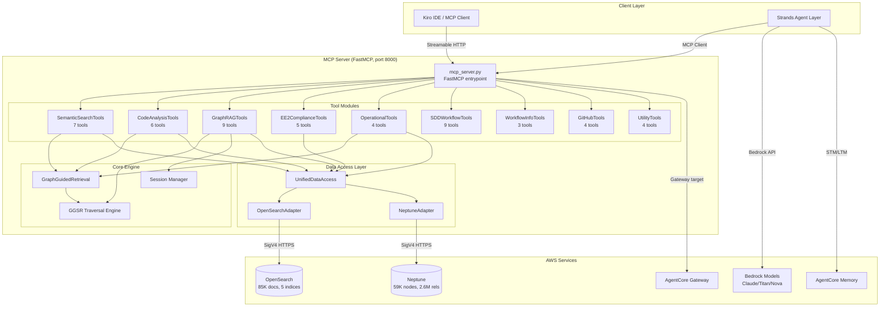

# Design Document: Python MCP Server Port

## Overview

This design describes the full port of the MDC MCP/RAG Server from Node.js/JavaScript (~9,000 lines across 9 tool modules, 51 tools) to Python using the FastMCP framework and Strands Agents SDK. The Python server reuses the existing `aws_backend.py` infrastructure (NeptuneHTTPAdapter with SigV4, OpenSearchVectorClient) and deploys to AgentCore Runtime on port 8000.

The port follows a module-by-module strategy where each tool module is ported independently, validated against the Node.js baseline via parity tests, and cut over without disrupting production traffic. The architecture transforms the platform from a passive tool server into an active agent ecosystem with multi-agent orchestration, persistent memory, Cedar policy enforcement, and OpenTelemetry observability.

### Key Design Decisions

1. **FastMCP over raw MCP SDK**: FastMCP provides decorator-based tool registration (`@mcp.tool()`) that maps cleanly to the Node.js `registerWith(server)` pattern, reducing boilerplate by ~60%.
2. **Reuse `aws_backend.py`**: The existing `NeptuneHTTPAdapter` and `OpenSearchVectorClient` classes already implement SigV4 auth, retry logic, and connection pooling. The Python adapters wrap these with the query interface expected by tool modules.
3. **Adapter abstraction layer**: A `DatabaseAdapter` protocol (Python Protocol class) defines the interface between tool modules and database backends, enabling legacy (Neo4j/ChromaDB) and AWS (Neptune/OpenSearch) backends to be swapped via `DB_BACKEND` env var.
4. **GGSR as standalone module**: The Graph-Guided Semantic Retrieval engine is ported as a self-contained module with its own weight matrix, hop decay, and token budget logic — not embedded in tool modules.
5. **Strands Agents as optional layer**: The MCP server works standalone; the Strands agent layer is an optional orchestration layer on top.

## Architecture

### High-Level Component Diagram



### Data Flow

1. **Tool Call**: Client sends `tools/call` → FastMCP routes to decorated handler → handler calls `UnifiedDataAccess` → adapter executes query → result returned as MCP content
2. **Hybrid Search**: `search_documentation` → OpenSearch BM25 + k-NN → RRF merge → Neptune graph enrichment → ranked results
3. **GGSR Retrieval**: `get_code_context` → Neptune 1-2 hop neighborhood → weight scoring → hop decay → token budget trim → semantic enrichment from OpenSearch
4. **Agent Workflow**: Strands Agent → selects tools via LLM reasoning → calls MCP tools sequentially → aggregates results → returns structured output

## Components and Interfaces

### Module Structure

```
mcp_server_python/
├── pyproject.toml                    # Dependencies, build config
├── Dockerfile                        # AgentCore Runtime container
├── .bedrock_agentcore.yaml           # AgentCore deploy config
├── src/
│   ├── __init__.py
│   ├── mcp_server.py                 # FastMCP entrypoint, tool registration
│   ├── config/
│   │   ├── __init__.py
│   │   ├── environment.py            # Env var loading, defaults
│   │   └── aws_config.py             # AWS region, endpoints
│   ├── data/
│   │   ├── __init__.py
│   │   ├── protocols.py              # VectorDB / GraphDB Protocol classes
│   │   ├── unified_data_access.py    # Facade over both adapters
│   │   ├── opensearch_adapter.py     # OpenSearch query adapter
│   │   ├── neptune_adapter.py        # Neptune query adapter
│   │   └── backend_selector.py       # DB_BACKEND routing
│   ├── graphrag/
│   │   ├── __init__.py
│   │   ├── ggsr_traversal.py         # GGSR weight matrix, hop decay, budget
│   │   └── graph_guided_retrieval.py # Hybrid graph+vector retrieval
│   ├── tools/
│   │   ├── __init__.py
│   │   ├── semantic_search.py        # 7 tools
│   │   ├── code_analysis.py          # 6 tools
│   │   ├── graph_rag.py              # 9 tools
│   │   ├── ee2_compliance.py         # 5 tools
│   │   ├── operational.py            # 4 tools
│   │   ├── sdd_workflow.py           # 9 tools
│   │   ├── workflow_info.py          # 3 tools
│   │   ├── github_tools.py           # 4 tools
│   │   └── utility.py               # 4 tools
│   ├── sdd/
│   │   ├── __init__.py
│   │   └── session_manager.py        # SDD session state
│   └── agents/
│       ├── __init__.py
│       ├── orchestrator.py           # Strands multi-agent orchestrator
│       ├── profiles.py               # Agent profiles (Analyst, Auditor, Curator)
│       └── memory.py                 # AgentCore Memory integration
├── tests/
│   ├── __init__.py
│   ├── conftest.py                   # Shared fixtures, mock adapters
│   ├── parity/
│   │   ├── __init__.py
│   │   ├── parity_runner.py          # Dual-server parity test framework
│   │   ├── test_semantic_search_parity.py
│   │   ├── test_code_analysis_parity.py
│   │   ├── test_graph_rag_parity.py
│   │   ├── test_ee2_compliance_parity.py
│   │   └── test_operational_parity.py
│   ├── properties/
│   │   ├── __init__.py
│   │   ├── test_opensearch_adapter_props.py
│   │   ├── test_neptune_adapter_props.py
│   │   ├── test_ggsr_props.py
│   │   ├── test_sdd_session_props.py
│   │   └── test_tool_schema_props.py
│   └── unit/
│       ├── __init__.py
│       ├── test_environment.py
│       ├── test_backend_selector.py
│       └── test_session_manager.py
```

### Database Adapter Interfaces

```python
from typing import Protocol, Any, runtime_checkable

@runtime_checkable
class VectorDBProtocol(Protocol):
    """Interface for vector database operations."""
    
    async def connect(self) -> None: ...
    
    async def query(
        self,
        collection: str,
        query_text: str,
        *,
        k: int = 10,
        similarity_threshold: float = 0.0,
        where: dict[str, Any] | None = None,
        include_graph: bool = True,
    ) -> list[dict[str, Any]]: ...
    
    async def multi_collection_query(
        self,
        collections: list[str],
        query_text: str,
        **kwargs,
    ) -> list[dict[str, Any]]: ...
    
    async def health_check(self, *, deep: bool = False) -> dict[str, Any]: ...
    
    async def close(self) -> None: ...


@runtime_checkable
class GraphDBProtocol(Protocol):
    """Interface for graph database operations."""
    
    async def connect(self) -> None: ...
    
    async def query(
        self,
        cypher: str,
        params: dict[str, Any] | None = None,
    ) -> list[dict[str, Any]]: ...
    
    async def health_check(self) -> dict[str, Any]: ...
    
    async def close(self) -> None: ...
```

### Tool Registration Pattern

Each tool module exposes a `register(mcp, data_access)` function that registers tools using FastMCP decorators:

```python
# src/tools/semantic_search.py
from fastmcp import FastMCP
from src.data.unified_data_access import UnifiedDataAccess

def register(mcp: FastMCP, data: UnifiedDataAccess) -> None:
    """Register all 7 SemanticSearchTools."""

    @mcp.tool()
    async def search_documentation(
        query: str,
        collection: str | None = None,
        include_graph: bool = True,
        max_results: int = 8,
        similarity_threshold: float = 0.1,
    ) -> str:
        """Hybrid semantic + graph search across workflow documentation and code."""
        results = await data.hybrid_search(query, collection=collection,
                                           max_results=max_results,
                                           similarity_threshold=similarity_threshold,
                                           include_graph=include_graph)
        return _format_results(results)

    @mcp.tool()
    async def find_related_files(file_path: str, ...) -> str:
        ...
    
    # ... remaining 5 tools
```

### Server Entrypoint

```python
# src/mcp_server.py
import asyncio
from fastmcp import FastMCP
from src.config.environment import load_config
from src.data.backend_selector import create_data_access
from src.tools import (
    semantic_search, code_analysis, graph_rag,
    ee2_compliance, operational, sdd_workflow,
    workflow_info, github_tools, utility,
)

mcp = FastMCP("mdc-mcp-rag", version="1.0.0")

async def initialize():
    config = load_config()
    data = await create_data_access(config)
    
    # Register all tool modules
    modules = [
        semantic_search, code_analysis, graph_rag,
        ee2_compliance, operational, sdd_workflow,
        workflow_info, github_tools, utility,
    ]
    enabled = config.get("enabled_modules", [m.__name__.split(".")[-1] for m in modules])
    for mod in modules:
        if mod.__name__.split(".")[-1] in enabled:
            mod.register(mcp, data)

if __name__ == "__main__":
    asyncio.run(initialize())
    mcp.run(transport="streamable-http", host="0.0.0.0", port=8000)
```

### OpenSearch Adapter (Python)

Wraps the existing `OpenSearchVectorClient` from `aws_backend.py` with the async query interface expected by tool modules:

```python
# src/data/opensearch_adapter.py
from aws_backend import OpenSearchVectorClient, _to_index
from src.data.protocols import VectorDBProtocol

class OpenSearchAdapter:
    """Async OpenSearch adapter implementing VectorDBProtocol."""
    
    def __init__(self, endpoint: str, region: str = "us-east-1"):
        self._client = OpenSearchVectorClient(endpoint, region)
        self._os = self._client._client  # underlying opensearch-py client
    
    async def query(self, collection: str, query_text: str, *,
                    k: int = 10, similarity_threshold: float = 0.0,
                    where: dict | None = None,
                    include_graph: bool = True) -> list[dict]:
        """Execute hybrid BM25 + k-NN search with RRF fusion."""
        index = _to_index(collection)
        embedding = await self._generate_embeddings(query_text)
        
        # Build hybrid query: BM25 + k-NN with RRF
        body = self._build_hybrid_query(query_text, embedding, k, where)
        response = self._os.search(index=index, body=body)
        
        return self._format_hits(response["hits"]["hits"],
                                 similarity_threshold)
```

### Neptune Adapter (Python)

Wraps the existing `NeptuneHTTPAdapter` from `aws_backend.py`:

```python
# src/data/neptune_adapter.py
from aws_backend import NeptuneHTTPAdapter

class NeptuneAdapter:
    """Async Neptune adapter implementing GraphDBProtocol."""
    
    def __init__(self, endpoint: str, region: str = "us-east-1"):
        self._adapter = NeptuneHTTPAdapter(endpoint, region)
    
    async def query(self, cypher: str,
                    params: dict | None = None) -> list[dict]:
        """Execute openCypher query and return parsed results."""
        with self._adapter.session() as session:
            result = session.run(cypher, **(params or {}))
            return [self._convert_record(r) for r in result]
    
    def _convert_record(self, record: dict) -> dict:
        """Convert Neptune JSON record to match Node.js output format."""
        # Handle Neptune's nested value types (e.g., {"~value": ...})
        ...
```

### GGSR Traversal Engine

```python
# src/graphrag/ggsr_traversal.py

# Relationship weight matrix (matches Node.js GGSRTraversalPrototypes.js)
WEIGHT_MATRIX = {
    "CALLS": 1.0,
    "IMPORTS": 0.9,
    "DEFINES": 0.85,
    "USES": 0.8,
    "EXECUTES": 0.95,
    "INVOKES": 0.9,
    "SOURCES": 0.85,
    "CONTAINS": 0.7,
    "DEPENDS_ON": 0.75,
}

# Hop decay: score *= decay^hop_distance
HOP_DECAY = 0.6

class GGSRTraversal:
    """Graph-Guided Semantic Retrieval traversal engine."""
    
    def __init__(self, graph_db: GraphDBProtocol):
        self._graph = graph_db
    
    async def budget_aware_neighborhood(
        self, entity: str, *,
        token_budget: int = 4000,
        max_results: int = 50,
        hops: int = 2,
    ) -> list[dict]:
        """Retrieve entity neighborhood within token budget."""
        raw = await self._multi_hop_query(entity, hops)
        scored = self._score_results(raw)
        return self._trim_to_budget(scored, token_budget)
    
    def _score_results(self, results: list[dict]) -> list[dict]:
        """Apply weight matrix and hop decay scoring."""
        for r in results:
            rel_weight = WEIGHT_MATRIX.get(r["relationship"], 0.5)
            hop_score = HOP_DECAY ** r["hop_distance"]
            r["score"] = rel_weight * hop_score
        return sorted(results, key=lambda r: r["score"], reverse=True)
    
    def _trim_to_budget(self, scored: list[dict],
                        budget: int) -> list[dict]:
        """Trim results to fit within token budget."""
        total = 0
        trimmed = []
        for r in scored:
            tokens = self._estimate_tokens(r)
            if total + tokens > budget:
                break
            trimmed.append(r)
            total += tokens
        return trimmed
```


## Data Models

### Tool Schema Model

Each tool is defined by a JSON Schema-compatible input schema that must match the Node.js implementation exactly:

```python
@dataclass
class ToolSchema:
    name: str                          # e.g., "search_documentation"
    description: str                   # Tool description
    input_schema: dict[str, Any]       # JSON Schema for parameters
    module: str                        # e.g., "SemanticSearchTools"
```

### Document Result Model

Standardized result format returned by all search operations:

```python
@dataclass
class DocumentResult:
    id: str                            # Document ID (OpenSearch _id)
    content: str                       # Document text content
    metadata: dict[str, Any]           # Source file, collection, etc.
    score: float                       # Relevance score (0.0–1.0)
    graph_context: dict | None = None  # Optional Neptune enrichment
```

### Graph Node Model

Standardized format for Neptune graph query results:

```python
@dataclass
class GraphNode:
    name: str                          # Node name/identifier
    labels: list[str]                  # Node labels (e.g., ["Function", "Python"])
    properties: dict[str, Any]         # Node properties
    relationships: list[GraphEdge]     # Connected edges
    
@dataclass
class GraphEdge:
    type: str                          # Relationship type (CALLS, IMPORTS, etc.)
    target: str                        # Target node name
    properties: dict[str, Any]         # Edge properties (weight, etc.)
    hop_distance: int                  # Distance from query origin
```

### GGSR Scored Result Model

```python
@dataclass
class GGSRScoredResult:
    node: GraphNode
    relationship: str                  # Relationship type to parent
    hop_distance: int                  # Hops from query entity
    weight: float                      # From WEIGHT_MATRIX
    hop_decay_score: float             # weight * HOP_DECAY^hop_distance
    estimated_tokens: int              # Token estimate for budget
```

### SDD Session State Model

```python
@dataclass
class SDDSession:
    session_id: str                    # UUID
    phase: str                         # e.g., "phase31_sdd_execution_model_refactor"
    status: str                        # "active" | "completed" | "abandoned"
    started_at: str                    # ISO 8601 timestamp
    last_activity_at: str              # ISO 8601 timestamp
    total_steps: int
    completed_steps: list[SDDStep]
    examined_symbols: list[str]
    modifications: list[FileModification]
    checkpoints: list[Checkpoint]
    notes: str | None = None

@dataclass
class SDDStep:
    step: int
    name: str
    tag: str                           # research|design|implement|configure|validate|document|ingest
    completed_at: str
    notes: str | None = None

@dataclass
class FileModification:
    file_path: str
    change_type: str                   # content|signature|delete|rename
    description: str | None = None
    timestamp: str

@dataclass
class Checkpoint:
    checkpoint_id: str
    name: str
    description: str
    created_at: str
    state_snapshot: dict               # Frozen copy of session state
```

### Configuration Model

```python
@dataclass
class ServerConfig:
    db_backend: str                    # "aws" | "legacy"
    neptune_endpoint: str
    opensearch_endpoint: str
    aws_region: str                    # default: "us-east-1"
    github_token: str | None
    enabled_modules: list[str]         # Module whitelist (all if empty)
    host: str                          # default: "0.0.0.0"
    port: int                          # default: 8000
    sdd_state_dir: str                 # default: "sdd_framework/execution_state"
```

## Correctness Properties

*A property is a characteristic or behavior that should hold true across all valid executions of a system — essentially, a formal statement about what the system should do. Properties serve as the bridge between human-readable specifications and machine-verifiable correctness guarantees.*

### Property 1: Tool Routing Correctness

*For any* registered tool name in the MCP server, when a `tools/call` request is sent with that tool name and valid arguments, the server SHALL route the call to the corresponding Python handler function and return a non-error result.

**Validates: Requirements 1.3**

### Property 2: OpenSearch Query Construction

*For any* valid combination of query text (non-empty string), k value (1 ≤ k ≤ 100), and similarity threshold (0.0 ≤ t ≤ 1.0), the OpenSearch adapter SHALL construct a query body that contains both a BM25 `match` clause and a k-NN `knn` clause with the specified parameters, and the body SHALL be valid OpenSearch JSON.

**Validates: Requirements 2.2, 2.3**

### Property 3: OpenSearch Result Schema Preservation

*For any* valid OpenSearch response containing hits with `_id`, `_source.content`, `_source.metadata`, and `_score` fields, the adapter's `_format_hits` method SHALL return a list of dictionaries each containing `id`, `content`, `metadata`, and `score` keys with the correct corresponding values.

**Validates: Requirements 2.5**

### Property 4: OpenSearch Retry on Transient Errors

*For any* sequence of transient HTTP errors (429, 500, 502, 503) of length N where 0 ≤ N ≤ 3, followed by a successful response, the OpenSearch adapter SHALL retry exactly N times with exponential backoff and return the successful result. If N > 3, the adapter SHALL raise an error after the 3rd retry.

**Validates: Requirements 2.6**

### Property 5: Neptune Parameter Serialization

*For any* valid openCypher query string and parameter dictionary containing string, integer, float, boolean, or list values, the Neptune adapter SHALL serialize the parameters as JSON in the POST body and the resulting HTTP request SHALL be accepted by Neptune's openCypher endpoint format.

**Validates: Requirements 3.2**

### Property 6: Neptune Result Parsing

*For any* valid Neptune JSON response containing a `results` array of record objects, the adapter SHALL parse each record into a Python dictionary with field names matching the Node.js `NeptuneAdapter._recordToObject` output format (flattened properties, converted value types).

**Validates: Requirements 3.3**

### Property 7: Neptune Retry on Transient Errors

*For any* sequence of transient HTTP errors (429, 500, 503) of length N where 0 ≤ N ≤ 3, followed by a successful response, the Neptune adapter SHALL retry exactly N times with exponential backoff (1s → 2s → 4s) and return the successful result. If N > 3, the adapter SHALL raise a `NeptuneQueryError`.

**Validates: Requirements 3.5**

### Property 8: Tool Schema Parity

*For any* tool registered in the Python MCP server, the tool's input schema (parameter names, parameter types, required flags, and description) SHALL be identical to the corresponding tool's input schema in the Node.js MCP server.

**Validates: Requirements 4.7, 5.7, 6.9, 7.6, 8.5, 9.6, 10.5, 11.5, 12.6**

### Property 9: GGSR Scoring Correctness

*For any* set of graph traversal results where each result has a relationship type (from the WEIGHT_MATRIX) and a hop distance (≥ 1), the GGSR scoring function SHALL compute each result's score as `WEIGHT_MATRIX[relationship] × HOP_DECAY^hop_distance`, sort results by score descending, and trim the list so total estimated tokens do not exceed the specified token budget.

**Validates: Requirements 6.6**

### Property 10: Session State Consistency

*For any* sequence of session operations (examine_symbol, mark_modified, checkpoint, restore_checkpoint) applied to an initially empty session, the session state SHALL be consistent: (a) examined_symbols contains exactly the symbols examined, (b) modifications contains exactly the files marked modified, (c) restoring a checkpoint restores the state to the checkpoint's snapshot.

**Validates: Requirements 6.7**

### Property 11: SDD Session Lifecycle Round-Trip

*For any* valid SDD session lifecycle (start with a phase name → record N steps with names and tags → complete with a summary), serializing the session state to JSONL format and deserializing it back SHALL produce an equivalent session object with the same phase, steps, tags, and completion status.

**Validates: Requirements 9.5, 9.7**

### Property 12: EE2 Compliance Detection Consistency

*For any* code snippet containing a known set of compliance patterns (missing `set -eu` shebang, unvalidated environment variables, non-standard output file naming), the Python `analyze_ee2_compliance` function SHALL detect the same compliance violation categories as the Node.js implementation.

**Validates: Requirements 7.7**

## Error Handling

### Strategy

The Python MCP server uses a layered error handling approach:

1. **Adapter Layer**: Database-specific errors are caught and wrapped in typed exceptions (`NeptuneQueryError`, `OpenSearchQueryError`) with status codes and messages. Transient errors trigger automatic retry with exponential backoff.

2. **Tool Layer**: Each tool handler catches adapter exceptions and returns structured MCP error responses with:
   - `isError: true` in the MCP response
   - Human-readable error message
   - Error category (e.g., `"database_error"`, `"validation_error"`, `"timeout"`)

3. **Server Layer**: Unhandled exceptions are caught by FastMCP's error handler, logged with full traceback, and returned as generic MCP errors.

### Error Categories

| Category | Source | Handling |
|----------|--------|----------|
| `connection_error` | Adapter can't reach database | Log, return degraded response |
| `query_error` | Invalid query or database error | Log, return error with details |
| `timeout_error` | Query exceeds timeout | Log, return partial results if available |
| `validation_error` | Invalid tool input | Return error with parameter details |
| `auth_error` | SigV4 credential failure | Log, attempt credential refresh |
| `rate_limit` | HTTP 429 from database | Retry with backoff (up to 3x) |
| `policy_denied` | Cedar policy rejection | Return structured denial with reason |

### Degraded Mode

When a database adapter fails to initialize:
- The server starts successfully
- Tools requiring the failed adapter return a clear error message: `"OpenSearch is unavailable. Tools requiring vector search are temporarily disabled."`
- Tools not requiring the failed adapter continue to work normally
- Health check reports the degraded state

### Retry Configuration

```python
RETRY_CONFIG = {
    "max_retries": 3,
    "initial_backoff_seconds": 1.0,
    "backoff_multiplier": 2.0,
    "retryable_status_codes": {429, 500, 502, 503},
}
```

## Testing Strategy

### Dual Testing Approach

The testing strategy combines three complementary approaches:

1. **Property-Based Tests** (Hypothesis library, ≥100 iterations each): Verify universal properties of pure functions and data transformations — adapter query construction, result formatting, GGSR scoring, session state management, and schema parity.

2. **Unit Tests** (pytest): Verify specific examples, edge cases, and error conditions — degraded mode startup, specific error handling paths, configuration loading.

3. **Parity Tests** (custom framework): Verify that each ported tool produces equivalent results to the Node.js implementation by running the same queries against both servers.

### Property-Based Testing Configuration

- Library: **Hypothesis** (Python)
- Minimum iterations: **100** per property test
- Each test tagged with: `Feature: python-mcp-server-port, Property {N}: {title}`
- Test files in `tests/properties/`

### Property Test Mapping

| Property | Test File | What It Tests |
|----------|-----------|---------------|
| P1: Tool Routing | `test_tool_schema_props.py` | Route correctness for all registered tools |
| P2: Query Construction | `test_opensearch_adapter_props.py` | Hybrid query body validity |
| P3: Result Schema | `test_opensearch_adapter_props.py` | Hit formatting preserves schema |
| P4: OS Retry | `test_opensearch_adapter_props.py` | Retry on transient errors |
| P5: Neptune Params | `test_neptune_adapter_props.py` | Parameter serialization |
| P6: Neptune Parsing | `test_neptune_adapter_props.py` | Response parsing matches Node.js format |
| P7: Neptune Retry | `test_neptune_adapter_props.py` | Retry on transient errors |
| P8: Schema Parity | `test_tool_schema_props.py` | All 51 tool schemas match Node.js |
| P9: GGSR Scoring | `test_ggsr_props.py` | Weight × decay scoring, sort, budget trim |
| P10: Session State | `test_sdd_session_props.py` | Operation sequence consistency |
| P11: SDD Round-Trip | `test_sdd_session_props.py` | JSONL serialize/deserialize round-trip |
| P12: EE2 Detection | `test_ee2_compliance_props.py` | Compliance pattern detection |

### Parity Testing Framework

The parity test framework runs the same queries against both servers and compares results:

```python
# tests/parity/parity_runner.py
class ParityRunner:
    """Execute queries against Node.js and Python servers, compare results."""
    
    def __init__(self, nodejs_url: str = "http://localhost:3000/mcp",
                       python_url: str = "http://localhost:8000/mcp"):
        self.nodejs = MCPClient(nodejs_url)
        self.python = MCPClient(python_url)
    
    async def assert_parity(self, tool_name: str, args: dict,
                            comparison: str = "exact") -> ParityResult:
        """Run tool on both servers and compare."""
        node_result = await self.nodejs.call_tool(tool_name, args)
        py_result = await self.python.call_tool(tool_name, args)
        
        if comparison == "exact":
            return self._compare_exact(node_result, py_result)
        elif comparison == "set_equality":
            return self._compare_sets(node_result, py_result)
        elif comparison == "tolerance":
            return self._compare_tolerance(node_result, py_result, tol=0.1)
```

### Unit Test Focus Areas

- Degraded mode startup (adapter failure → server still starts)
- Configuration loading from environment variables
- Backend selector routing (aws vs legacy)
- Error message formatting
- Cedar policy denial responses
- OpenTelemetry span creation

### CI Integration

```yaml
# Parity tests run as CI step
test:
  - pytest tests/properties/ -v --hypothesis-seed=0  # Property tests
  - pytest tests/unit/ -v                              # Unit tests
  - pytest tests/parity/ --module SemanticSearchTools   # Parity (per-module)
```
