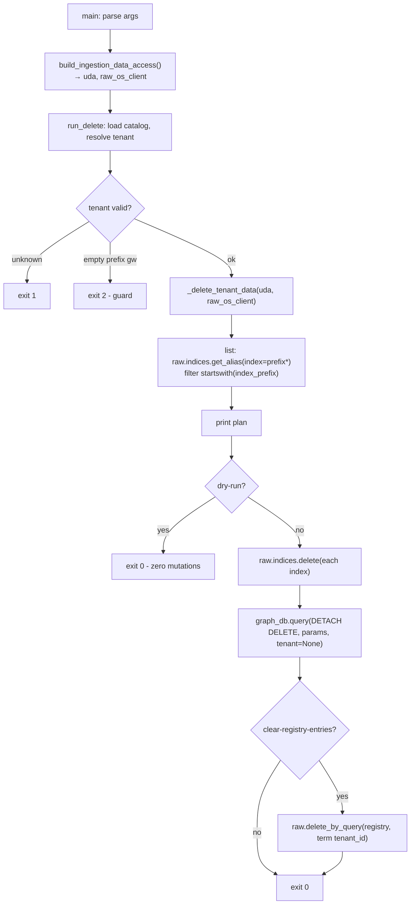

# Rollback CLI Real Adapters — Bugfix Design

## Overview

The tenant rollback CLI `mcp_server_python/scripts/delete_tenant_indices.py`
passes its unit tests but cannot run against real AWS. It fails on the first
adapter call with `AttributeError: 'NoneType' object has no attribute
'list_indices'`. Three faults combine:

- **Defect 1 — data layer never wired.** `main()` hardcodes
  `vector_db = None` / `graph_db = None` behind a `TODO(Phase C)` comment, so
  every CLI invocation reaches the deletion logic with `None` adapters.
- **Defect 2 — fictional adapter methods.** The deletion logic calls
  `vector_db.list_indices()`, `vector_db.delete_index(...)`,
  `vector_db.delete_by_query(...)`, and `graph_db.execute_cypher(...)` — none
  of which exist on the real `OpenSearchAdapter` / `NeptuneAdapter`.
- **Defect 3 — tests validate a fiction.** The unit doubles implement those
  four methods, so the suite is green while the tool is non-functional; the
  real-wiring `main()` path is untested.

The fix is surgical and confined to the script and its tests — **no public
adapter API changes**:

1. **Wire `main()`** to the real data layer via the existing
   `build_ingestion_data_access()` helper in `_ingest_common.py`.
2. **Re-implement the four operations** against the real adapter surface: the
   raw opensearch-py client (reached through `OpenSearchAdapter._raw_client()`)
   for index list/delete/delete-by-query, and `NeptuneAdapter.query(...)` for
   the `DETACH DELETE`.
3. **Rewrite the test doubles** to conform to the real adapter contract and add
   a test that exercises the real method names, so this mock-fidelity gap is
   caught going forward.

This unblocks Task 12 of `ingest-dedupe-and-graph-fix` (the gated `gw_v17`
cleanup + re-ingest). It corrects the implementation of
`omd-tenants-2-v17-pilot` design §6 (rollback path).

## Glossary

- **Bug_Condition (C)**: A command-line invocation of the rollback CLI (the
  production `main()` path, not a stub-injected test) against a valid
  non-empty-prefix tenant — which currently raises `AttributeError` before any
  deletion runs.
- **Property (P)**: The desired behavior — the CLI connects the real data
  layer and performs list / delete / delete-by-query / DETACH DELETE against
  the real adapter surface, completing without `AttributeError`.
- **Preservation**: The control-flow contract — exit codes (unknown→1,
  empty-prefix→2, success→0), the `gw` guard, dry-run zero-mutation,
  registry-index preservation, and prefix-scoped deletion — all unchanged.
- **Raw client**: The underlying `opensearch-py` `OpenSearch` object reached
  via `OpenSearchAdapter._raw_client()`. It exposes `.indices.get_alias`,
  `.indices.delete`, and `.delete_by_query` (all synchronous).
- **`build_ingestion_data_access()`**: The existing helper in
  `_ingest_common.py` that loads config, builds a connected
  `UnifiedDataAccess`, and returns `(uda, raw_os_client)`.
- **`F` / `F'`**: The original (unfixed) CLI / the fixed CLI.

## Bug Details

### Bug Condition

The bug manifests on any real command-line invocation against a tenant that
passes the empty-prefix guard. `main()` supplies `None` adapters, so
`_delete_tenant_data`'s first call (`await vector_db.list_indices()`) raises
`AttributeError`. Even if the `None` wiring were fixed, the four called methods
do not exist on the real adapters, so the failure mode persists until the
operations are re-implemented against the real surface.

**Formal Specification:**
```
FUNCTION isBugCondition(X)
  INPUT:  X = (cli invocation via main(), tenant T)
  OUTPUT: boolean

  RETURN X.entrypoint = "cli_main"      // not a stub-injected test call
         AND T.index_prefix ≠ ""         // passes the empty-prefix guard
         AND T.label_prefix ≠ ""
END FUNCTION
```

Under `F`, `isBugCondition(X)` raises `AttributeError` (either
`NoneType.list_indices`, or a missing method on the real adapter once wired)
before any plan executes.

### Examples

- **The blocking case.**
  `delete_tenant_indices.py --tenant gw_v17 --clear-registry-entries --dry-run`
  against live AWS → `AttributeError: 'NoneType' object has no attribute
  'list_indices'`. Observed 2026-05-29 while preparing the `gw_v17`
  remediation. (clauses 1.1, 1.2, 1.5)
- **Wired-but-fictional.** If `main()` built the real `UnifiedDataAccess`, the
  next failure would be `AttributeError: 'OpenSearchAdapter' object has no
  attribute 'list_indices'`. (clause 1.3)
- **False-green suite.** `pytest test_delete_tenant_indices.py` passes because
  `StubVectorDB.list_indices` / `StubGraphDB.execute_cypher` exist only on the
  stubs. (clause 1.4)
- **Preserved guard (NOT the bug).** `--tenant gw` still exits 2 before any
  adapter call — `isBugCondition` is false for empty-prefix tenants.

## Expected Behavior

### Preservation Requirements

**Unchanged Behaviors:**
- **Exit codes**: unknown tenant → 1; empty-prefix (`gw`) → 2; success → 0
  (clauses 3.1, 3.2).
- **`gw` guard**: empty `index_prefix`/`label_prefix` refused with exit 2 and
  the protective message, no AWS calls, even with `--clear-registry-entries`
  (clause 3.2).
- **Dry-run**: prints the plan, performs zero mutations, exits 0 (clause 3.3).
- **Prefix scoping**: only indices starting with the tenant's `index_prefix`
  are deleted; `mdc-content-sha-registry` and other tenants' indices untouched
  (clause 3.4).
- **Registry clearing**: `--clear-registry-entries` issues a delete-by-query
  scoped to `tenant_id == <tenant>`; the registry index itself is never
  deleted (clause 3.5).
- **Neptune deletion**: `DETACH DELETE` scoped to labels starting with the
  tenant's `label_prefix` (clause 3.6).

**Scope:** Only `main()`'s data-layer wiring and the adapter-facing operations
in `_delete_tenant_data` change. The control-flow logic in `run_delete` (tenant
resolution, exit codes, guard, dry-run gating, prefix filtering) is unchanged.

### Real Adapter Surface (mapping the four operations)

| Operation (current fictional call) | Real implementation |
|---|---|
| `vector_db.list_indices()` | `raw = vector_db._raw_client()`; `await asyncio.to_thread(raw.indices.get_alias, index=f"{index_prefix}*")` → keys are index names. (Use `get_alias` with the prefix glob so only candidate indices return; still filter by `startswith(index_prefix)` defensively.) |
| `vector_db.delete_index(name)` | `await asyncio.to_thread(raw.indices.delete, index=name)` |
| `vector_db.delete_by_query(index, body)` | `await asyncio.to_thread(raw.delete_by_query, index=SHAIndex.REGISTRY_INDEX, body={"query": {"term": {"tenant_id": tenant_id}}})` |
| `graph_db.execute_cypher(cypher, params)` | `await graph_db.query(cypher, params={"prefix": label_prefix}, tenant=None)` — **`tenant=None` is required** so `NeptuneAdapter._rewrite_cypher` does not rewrite the cypher (the `DETACH DELETE` already targets prefixed labels by string match). |

Note the `get_alias` glob can raise `NotFoundError` (404) when no index matches
the prefix — treat that as "zero indices to delete", not an error.

## Hypothesized Root Cause

A dependency-injection test seam (`run_delete(..., vector_db=, graph_db=)`) was
paired with stub doubles whose API diverged from the real adapters, while
production `main()` wiring was deferred as a `TODO(Phase C)` `None` stub. The
suite validated the script against an adapter contract the real code never
implements. Three concrete faults:

1. **`main()` `None` stub** — never built the real `UnifiedDataAccess`.
2. **Fictional method calls** — `list_indices` / `delete_index` /
   `delete_by_query` / `execute_cypher` are not on the real adapters; the real
   surface is the raw opensearch-py client + `NeptuneAdapter.query`.
3. **Mock-fidelity gap** — test doubles implemented the fictional methods, so
   the divergence was invisible to CI.

## Correctness Properties

Property 1: Fix — Real-adapter-backed rollback completes without AttributeError

_For any_ input `X` where `isBugCondition(X)` holds (a CLI invocation against a
valid non-empty-prefix tenant), the fixed CLI `F'` SHALL connect the real data
layer via `build_ingestion_data_access()`, perform index listing/deletion and
registry delete-by-query through the raw opensearch-py client and Neptune node
deletion through `NeptuneAdapter.query(..., tenant=None)`, and complete without
raising `AttributeError`.

**Validates: Requirements 2.1, 2.2, 2.3, 2.4, 2.5, 2.7**

Property 2: Preservation — Control-flow contract unchanged

_For any_ input `X` where `isBugCondition(X)` is false (unknown tenant,
empty-prefix tenant, or a dry-run), the fixed CLI `F'` SHALL produce the same
exit code and the same mutation behavior as `F`: unknown → 1 (no AWS calls),
`gw` → 2 (no AWS calls, even with `--clear-registry-entries`), dry-run → 0 with
zero mutations.

**Validates: Requirements 3.1, 3.2, 3.3**

Property 3: Mock fidelity — test doubles match the real adapter contract

The unit-test doubles SHALL expose only the operations the script actually uses
against the real surface (a fake opensearch-py client with
`indices.get_alias`, `indices.delete`, `delete_by_query`; a Neptune double with
`query(cypher, params=, tenant=)`), so a future divergence between the script's
calls and the real adapter API is caught by the suite rather than passing green.

**Validates: Requirements 2.6, 2.8, 3.4, 3.5, 3.6**

## Fix Implementation

### Corrected rollback flow



### Change 1 — wire `main()` to the real data layer

**File**: `mcp_server_python/scripts/delete_tenant_indices.py`

Replace the `None` stub in `main()`:

```python
# BEFORE
# TODO(Phase C): wire build_unified_data_access() here
vector_db = None
graph_db = None

# AFTER
from _ingest_common import build_ingestion_data_access
uda = None
raw_os_client = None
try:
    uda, raw_os_client = await build_ingestion_data_access()
except Exception as e:
    print(f"[ERROR] failed to connect data layer: {e}", file=sys.stderr)
    print("  Check DB_BACKEND / OPENSEARCH_ENDPOINT / NEPTUNE_ENDPOINT / AWS_REGION",
          file=sys.stderr)
    return 1
try:
    return await run_delete(
        tenant_id=args.tenant, catalog_path=args.catalog, dry_run=args.dry_run,
        vector_db=uda.vector_db, graph_db=uda.graph_db,
        raw_os_client=raw_os_client,
        clear_registry_entries=args.clear_registry_entries,
    )
finally:
    if uda is not None:
        await uda.close()
```

`run_delete` / `_delete_tenant_data` gain a `raw_os_client` parameter (the
opensearch-py client is what actually performs index operations; the
`OpenSearchAdapter` itself has no index-management methods). In tests this is a
fake client object (Change 4).

### Change 2 — re-implement the four operations against the real surface

**File**: `mcp_server_python/scripts/delete_tenant_indices.py`
(`_delete_tenant_data`)

```python
import asyncio
from opensearchpy.exceptions import NotFoundError  # local import / guarded

# 1. list indices via the raw opensearch-py client
try:
    alias_map = await asyncio.to_thread(
        raw_os_client.indices.get_alias, index=f"{index_prefix}*"
    )
    all_prefixed = list(alias_map.keys())
except NotFoundError:
    all_prefixed = []   # no index matches the prefix → nothing to delete
target_indices = [i for i in all_prefixed if i.startswith(index_prefix)]

# ... print plan ... (unchanged)
if dry_run:
    print("# [DRY-RUN] no mutations performed.")
    return []

# 2. delete each index
for idx in target_indices:
    await asyncio.to_thread(raw_os_client.indices.delete, index=idx)

# 3. Neptune DETACH DELETE via the real query() — tenant=None (no rewrite)
cypher = (
    "MATCH (n) WHERE any(label IN labels(n) "
    "WHERE label STARTS WITH $prefix) DETACH DELETE n"
)
await graph_db.query(cypher, params={"prefix": label_prefix}, tenant=None)

# 4. registry delete-by-query (only with the flag)
if clear_registry_entries:
    await asyncio.to_thread(
        raw_os_client.delete_by_query,
        index=SHAIndex.REGISTRY_INDEX,
        body={"query": {"term": {"tenant_id": tenant_id}}},
    )
```

The `vector_db` parameter is no longer used for index management (the raw
client is). It MAY be retained in the signature for symmetry/health checks, or
dropped; the design retains it as an optional unused arg to minimize churn in
`run_delete`'s call sites, but the implementer may drop it if cleaner.

### Change 3 — dry-run still lists for an accurate plan

`--dry-run` must still call `get_alias` (read-only) so the printed plan shows
the real target indices, then short-circuit before any `delete`. The
delete-by-query line is printed (not executed) when the flag is set
(unchanged plan text from the current implementation).

### Change 4 — test doubles match the real contract

**File**: `mcp_server_python/tests/unit/test_delete_tenant_indices.py`

Replace the fictional `StubVectorDB` (`list_indices`/`delete_index`/
`delete_by_query`) with a **fake opensearch-py client** matching the real
surface, and replace `StubGraphDB.execute_cypher` with a `query(...)` double:

```python
class FakeIndices:
    def __init__(self, names): self._names = names; self.deleted = []
    def get_alias(self, *, index):  # sync, like opensearch-py
        import fnmatch
        return {n: {} for n in self._names if fnmatch.fnmatch(n, index)}
    def delete(self, *, index): self.deleted.append(index)

class FakeRawClient:
    def __init__(self, names):
        self.indices = FakeIndices(names)
        self.dbq_calls = []
    def delete_by_query(self, *, index, body):
        self.dbq_calls.append((index, body))

class FakeGraphDB:
    def __init__(self): self.queries = []
    async def query(self, cypher, params=None, *, tenant=None):
        self.queries.append((cypher, params, tenant)); return []
```

Tests pass `raw_os_client=FakeRawClient([...])` and `graph_db=FakeGraphDB()`
into `run_delete`. Assertions update to the real shape:
- prefix-scoped delete: `fake.indices.deleted == ["gw_v17_..."]`, registry &
  other-tenant indices absent;
- Neptune: `fake_graph.queries[0]` has `params == {"prefix": "GW_V17_"}` and
  `tenant is None`;
- registry: `fake.dbq_calls == [("mdc-content-sha-registry",
  {"query": {"term": {"tenant_id": "gw_v17"}}})]`;
- dry-run: `fake.indices.deleted == []` and `fake.dbq_calls == []`;
- `gw` guard: exit 2, no calls on either fake.

Add one test asserting the doubles expose the SAME method names the script
calls (`hasattr(raw.indices, "get_alias")`, `"delete"`, `hasattr(raw,
"delete_by_query")`, and `graph.query` is a coroutine) — a guard against the
doubles drifting back into fiction.

## Testing Strategy

### Validation Approach

Bug-condition methodology: an exploration test that fails on the unfixed code
(demonstrating the `AttributeError`), then Fix Checking (the operations run
against real-contract doubles without `AttributeError`) and Preservation
Checking (exit codes / guard / dry-run unchanged).

### Exploratory Bug Condition Checking

**Goal**: Surface the defect on the UNFIXED code before fixing.

**Test Plan**: Call `run_delete` with `vector_db=None, graph_db=None` (the
production `main()` state) for a valid non-empty-prefix tenant, non-dry-run.

**Test Cases**:
1. **None-wired list** (fails on unfixed code): expect a clean connect + plan;
   unfixed raises `AttributeError: 'NoneType' ... 'list_indices'`.
2. **Real-contract call shape** (fails on unfixed code): drive the unfixed
   `_delete_tenant_data` with a real-contract fake (no `list_indices`) → it
   calls the fictional method and raises `AttributeError`.

**Expected Counterexamples**: `AttributeError` on `list_indices` (None) and on
the real-contract fake (missing fictional method). Confirms both defects.

### Fix Checking

```
FOR ALL X WHERE isBugCondition(X) DO
  result := F'(X)
  ASSERT result.completed_without_attribute_error = TRUE
  ASSERT result.used_raw_opensearch_client = TRUE   // get_alias/delete/delete_by_query
  ASSERT result.used_neptune_query_tenant_none = TRUE
END FOR
```

### Preservation Checking

```
FOR ALL X WHERE NOT isBugCondition(X) DO
  ASSERT F(X) = F'(X)   // exit codes, gw guard, dry-run zero-mutation
END FOR
```

### Unit Tests

- Real-contract doubles (Change 4): prefix-scoped delete; registry & other
  tenants untouched; Neptune `query` called with `params={"prefix": ...}` and
  `tenant=None`; `--clear-registry-entries` issues one scoped `delete_by_query`;
  dry-run zero mutations; `gw` guard exit 2 with no calls.
- `get_alias` `NotFoundError` → treated as zero target indices (no crash).
- Method-name fidelity guard (the doubles expose exactly what the script calls).

### Integration / Live Validation

- `delete_tenant_indices.py --tenant gw_v17 --clear-registry-entries --dry-run`
  against live AWS connects, lists the real `gw_v17_*` indices, prints the plan,
  performs zero mutations, exits 0 (this is the gate that was failing).
- The execute path is exercised as Task 12 of `ingest-dedupe-and-graph-fix`
  (operator-run, gated) — not in this spec's automated suite.

## Out of Scope

- No change to the public API of `OpenSearchAdapter` / `NeptuneAdapter`. The
  rollback uses the existing `_raw_client()` seam and `query()` method. (If a
  future spec wants first-class `delete_index` / `delete_by_query` methods on
  the adapter, that is a separate enhancement.)
- The actual destructive `gw_v17` cleanup + re-ingest remains Task 12 of
  `ingest-dedupe-and-graph-fix` (gated, operator-run).
