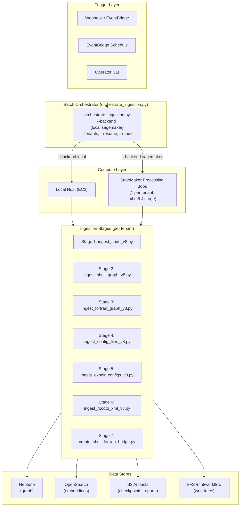
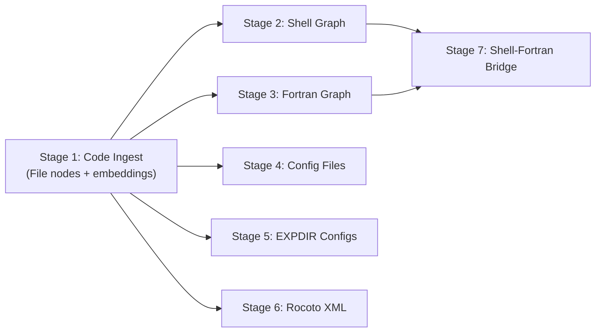
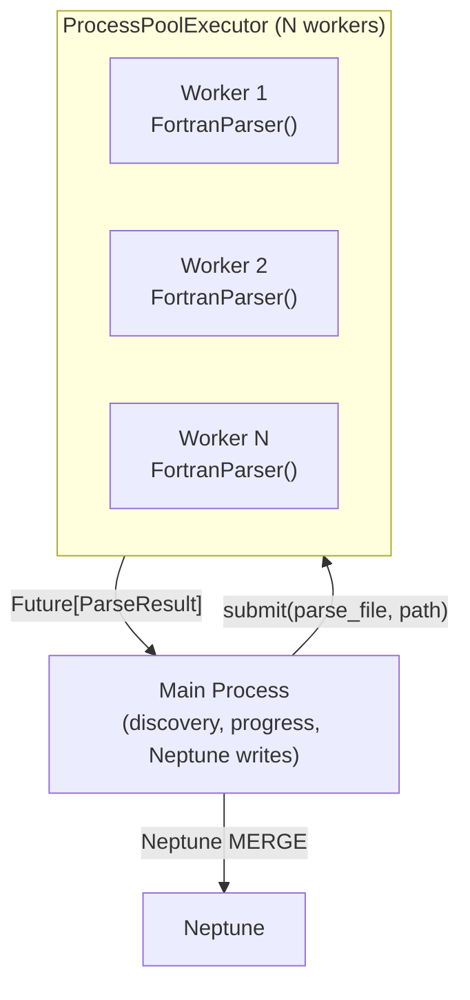

# Design Document — `scalable-ingestion-pipeline`

## Overview

This design refactors the ingestion pipeline from serial, single-host execution into a
two-layer architecture: (1) parallel file parsing within each stage, and (2) a batch
orchestrator that can run stages locally or offload them to SageMaker Processing Jobs.

**Problem statement.** The Fortran AST ingester took 37 hours for a single tenant
(`gw_v17`) on a 4-core EC2 instance, processing ~7,000 files sequentially. With 5+
tenants requiring regular refreshes, serial execution is untenable. The system has no
checkpointing, no drift detection, and no way to resume after transient failures.

**Target outcome.** Full tenant ingestion (7 stages) completes in under 2 hours on a
16-core SageMaker `ml.m5.4xlarge` instance. Multiple tenants run concurrently. The
pipeline is idempotent, resumable, and triggerable on-demand when a branch advances.

**Key design decisions:**

1. **Same Docker image** — SageMaker Processing Jobs use the existing
   `mdc-mcp-rag:python-tenants-*` ECR image (same as AgentCore runtime), ensuring
   identical dependencies and avoiding image sprawl.
2. **Same network** — SageMaker jobs run in the same VPC subnets and security group,
   mount the same EFS access point, and reach the same Neptune/OpenSearch endpoints.
3. **ProcessPoolExecutor for parallelism** — each worker gets an independent parser
   instance (no shared mutable state). This approach works on both local and SageMaker
   backends without code changes.
4. **Neptune MERGE for idempotence** — re-running any stage produces no duplicates,
   enabling safe resume without cleanup.
5. **Checkpoint JSON in S3** — tracks per-stage completion, enabling `--resume` to skip
   already-completed stages.

## Architecture

### System Context Diagram



### Stage Dependency Graph



**Execution rules:**
- Stage 1 runs first (creates File nodes referenced by later stages).
- Stages 2–6 can run in parallel (independent of each other, only depend on Stage 1).
- Stage 7 runs last (requires both ShellScript and FortranProgram nodes from Stages 2+3).

### Parallel Parsing Architecture (within each stage)



Each worker process:
- Has its own parser instance (no shared state)
- Is subject to a per-file timeout (default 120s)
- Returns a `ParseResult` or a timeout/error sentinel
- Never writes to Neptune (writes happen in the main process)

## Components and Interfaces

### 1. Batch Orchestrator (`scripts/orchestrate_ingestion.py`)

The top-level entry point that coordinates all ingestion activity.

**CLI Interface:**
```
orchestrate_ingestion.py
    --tenants {all | tenant1,tenant2,...}  # which tenants to process
    --backend {local,sagemaker}           # where to run (default: local)
    --mode {full,diff}                    # ingestion strategy
    --stages {all | stage1,stage2,...}    # which stages (default: all)
    --resume                             # skip completed stages per checkpoint
    --max-concurrent N                   # max parallel tenant jobs (default: 3)
    --workers N                          # CPU workers per stage (default: cpu_count-1)
    --timeout SECONDS                    # per-file parse timeout (default: 120)
    --instance-type TYPE                 # SageMaker instance override
    --dry-run                            # plan only, no execution
```

**Responsibilities:**
- Resolves tenant list from catalog
- For `--backend local`: runs stages sequentially on the host using `asyncio`
- For `--backend sagemaker`: submits `boto3 sagemaker.create_processing_job()` per tenant
- Manages concurrency via `asyncio.Semaphore(max_concurrent)`
- Reads/writes checkpoint JSON for resume support
- Emits CloudWatch custom metrics on completion
- Produces a summary report (JSON) with per-tenant status

### 2. Parallel Execution Wrapper (`scripts/_parallel_runner.py`)

A shared utility that wraps any file-parsing loop with multiprocessing.

**Interface:**
```python
@dataclass
class ParallelConfig:
    workers: int          # number of worker processes
    timeout: int          # per-file timeout in seconds
    progress_interval: int  # log every N files (default 50)

@dataclass
class FileResult:
    path: str
    success: bool
    result: Any | None    # ParseResult on success, None on failure
    elapsed: float
    error: str | None     # error message on failure

async def run_parallel_parse(
    files: list[Path],
    parse_fn: Callable[[Path], Any],  # must be picklable
    config: ParallelConfig,
    label: str = "parsing",
) -> tuple[list[FileResult], ParallelStats]:
    ...
```

**Implementation details:**
- Uses `concurrent.futures.ProcessPoolExecutor`
- Per-file timeout: wraps each `submit()` with `future.result(timeout=config.timeout)`
- On timeout: logs warning, records `FileResult(success=False, error="timeout")`
- Progress: prints unified progress lines at `progress_interval`
- Returns all results + aggregate stats (parsed, failed, timed_out, total_elapsed)

### 3. Checkpoint Manager (`scripts/_checkpoint.py`)

Tracks per-run progress for resume support.

**Interface:**
```python
@dataclass
class StageCheckpoint:
    name: str
    status: str          # "pending" | "running" | "completed" | "failed"
    started_at: str | None
    completed_at: str | None
    nodes_created: int
    relationships_created: int
    elapsed_seconds: float
    error: str | None

@dataclass
class RunCheckpoint:
    tenant_id: str
    run_id: str          # UUID generated at run start
    started_at: str
    backend: str
    mode: str
    stages: list[StageCheckpoint]

class CheckpointManager:
    def __init__(self, tenant_id: str, run_id: str, s3_bucket: str):
        ...

    def load(self) -> RunCheckpoint | None:
        """Load existing checkpoint from S3 (for --resume)."""

    def save(self, checkpoint: RunCheckpoint) -> None:
        """Write checkpoint to S3."""

    def is_stage_complete(self, stage_name: str) -> bool:
        """Check if a stage was already completed (for skip logic)."""

    def mark_stage_complete(self, stage_name: str, stats: dict) -> None:
        """Mark a stage as completed and save checkpoint."""

    def mark_stage_failed(self, stage_name: str, error: str) -> None:
        """Mark a stage as failed and save checkpoint."""
```

**Storage:** `s3://mdc-mcp-rag-artifacts/checkpoints/{tenant_id}/{run_id}.json`

### 4. Drift Detector (`scripts/_drift_detector.py`)

Tracks per-tenant ingestion state and determines if a refresh is needed.

**Interface:**
```python
@dataclass
class TenantIngestionState:
    tenant_id: str
    last_commit_sha: str
    last_run_at: str
    status: str          # "success" | "failed" | "partial"
    run_id: str

class DriftDetector:
    def __init__(self, s3_bucket: str):
        ...

    def get_state(self, tenant_id: str) -> TenantIngestionState | None:
        """Read last ingestion state from S3."""

    def has_drift(self, tenant_id: str, worktree_root: Path) -> bool:
        """Compare HEAD of worktree to last_commit_sha. True if different."""

    def update_state(self, tenant_id: str, commit_sha: str, run_id: str, status: str) -> None:
        """Write updated state after a run."""
```

**Storage:** `s3://mdc-mcp-rag-artifacts/ingestion-state/{tenant_id}.json`

### 5. SageMaker Job Submitter (`scripts/_sagemaker_submitter.py`)

Handles the boto3 interaction for SageMaker Processing Jobs.

**Interface:**
```python
@dataclass
class SageMakerJobConfig:
    instance_type: str        # e.g. "ml.m5.4xlarge"
    role_arn: str             # IAM role for the job
    image_uri: str            # ECR image URI
    subnets: list[str]        # VPC subnets
    security_groups: list[str]
    efs_filesystem_id: str
    efs_access_point_id: str
    max_runtime_seconds: int  # default 14400 (4 hours)
    volume_size_gb: int       # default 50

class SageMakerSubmitter:
    def __init__(self, config: SageMakerJobConfig):
        ...

    async def submit_job(
        self,
        tenant_id: str,
        mode: str,
        stages: list[str],
        workers: int,
        timeout: int,
        resume: bool,
    ) -> str:
        """Submit a SageMaker Processing Job. Returns job name."""

    async def wait_for_completion(self, job_name: str) -> dict:
        """Poll job status until terminal. Returns final status dict."""

    async def get_job_status(self, job_name: str) -> str:
        """Get current job status (InProgress, Completed, Failed, Stopped)."""
```

**SageMaker Job Definition:**
- **Container**: `903050880929.dkr.ecr.us-east-1.amazonaws.com/mdc-mcp-rag:python-tenants-*`
- **Entry point**: `python scripts/orchestrate_ingestion.py --backend local --tenants {tid} --mode {mode} ...`
- **Network**: VPC with subnets `subnet-0e13af6b3a9a6416f`, `subnet-04447750c61bd7e06`, SG `sg-096489a0876cc78c1`
- **EFS**: filesystem mount at `/mnt/workflow`, access point `fsap-03e641f056b341f29`
- **Role**: `mdc-mcp-rag-sagemaker-processing-role`

### 6. CloudWatch Metrics Emitter (`scripts/_metrics.py`)

Publishes custom CloudWatch metrics for monitoring and alerting.

**Interface:**
```python
class MetricsEmitter:
    NAMESPACE = "MDC-MCP-RAG/Ingestion"

    def emit_stage_complete(self, tenant_id: str, stage: str, duration: float, nodes: int, rels: int):
        ...

    def emit_run_complete(self, tenant_id: str, status: str, duration: float, parse_success_rate: float):
        ...

    def emit_alert(self, tenant_id: str, metric: str, value: float, threshold: float):
        ...
```

**Metric dimensions:** `TenantId`, `Stage`, `Backend`

### 7. Webhook Handler (`lambda/ingestion_trigger.py`)

An AWS Lambda function (triggered by API Gateway or EventBridge) that kicks off ingestion.

**Flow:**
1. Receive webhook payload (branch push event)
2. Resolve branch → tenant_id via tenant catalog lookup
3. Check drift (compare HEAD to last-ingested SHA)
4. If drift detected: invoke the orchestrator (via ECS RunTask or direct SageMaker job)
5. If no drift: log "no changes", exit 0

## Data Models

### Checkpoint JSON Schema

```json
{
  "schema_version": 1,
  "tenant_id": "gw_v17",
  "run_id": "a1b2c3d4-e5f6-7890-abcd-ef1234567890",
  "started_at": "2026-06-10T14:00:00Z",
  "backend": "sagemaker",
  "mode": "full",
  "instance_type": "ml.m5.4xlarge",
  "workers": 15,
  "timeout": 120,
  "stages": [
    {
      "name": "ingest_code_v8",
      "status": "completed",
      "started_at": "2026-06-10T14:00:05Z",
      "completed_at": "2026-06-10T14:12:30Z",
      "nodes_created": 30221,
      "relationships_created": 0,
      "elapsed_seconds": 745.0,
      "error": null
    },
    {
      "name": "ingest_fortran_graph_v8",
      "status": "running",
      "started_at": "2026-06-10T14:12:35Z",
      "completed_at": null,
      "nodes_created": 15000,
      "relationships_created": 500000,
      "elapsed_seconds": null,
      "error": null
    }
  ]
}
```

### Ingestion State (per-tenant drift tracking)

```json
{
  "schema_version": 1,
  "tenant_id": "gw_v17",
  "last_commit_sha": "abc123def456",
  "last_run_at": "2026-06-10T14:00:00Z",
  "last_run_id": "a1b2c3d4-e5f6-7890-abcd-ef1234567890",
  "status": "success",
  "stages_completed": ["ingest_code_v8", "ingest_shell_graph_v8", "ingest_fortran_graph_v8",
                        "ingest_config_files_v8", "ingest_expdir_configs_v8",
                        "ingest_rocoto_xml_v8", "create_shell_fortran_bridge"]
}
```

### CloudWatch Metric Dimensions

| Metric Name | Dimensions | Unit |
|---|---|---|
| `ingestion/duration_seconds` | TenantId, Stage, Backend | Seconds |
| `ingestion/nodes_created` | TenantId, Stage | Count |
| `ingestion/relationships_created` | TenantId, Stage | Count |
| `ingestion/parse_success_rate` | TenantId, Stage | Percent |
| `ingestion/status` | TenantId | None (1=success, 0=failure) |
| `ingestion/files_timed_out` | TenantId, Stage | Count |


## Correctness Properties

*A property is a characteristic or behavior that should hold true across all valid executions of a system — essentially, a formal statement about what the system should do. Properties serve as the bridge between human-readable specifications and machine-verifiable correctness guarantees.*

### Property 1: Parallelism Correctness

*For any* set of parseable files and *for any* worker count N ≥ 1, running the parallel parser with N workers SHALL produce the same set of parse results (same nodes and relationships per file) as running with 1 worker (sequential execution).

**Validates: Requirements 1.3, 1.5**

### Property 2: Timeout Safety

*For any* set of files containing at least one file whose parse time exceeds the configured timeout T, the parallel runner SHALL: (a) mark timed-out files with `success=False` and `error="timeout"`, (b) successfully complete all other files, and (c) never produce partial/corrupt parse results for timed-out files.

**Validates: Requirements 1.4**

### Property 3: Concurrency Limit

*For any* number of tenants T and *for any* max-concurrent limit M (where 1 ≤ M ≤ T), the orchestrator SHALL never have more than M tenant jobs running simultaneously at any point during execution.

**Validates: Requirements 3.3**

### Property 4: Tenant Failure Isolation

*For any* set of tenants where a subset F fails during ingestion, all tenants not in F SHALL complete their ingestion independently — their final status is unaffected by the failures in F.

**Validates: Requirements 3.4**

### Property 5: Drift Detection Correctness

*For any* tenant whose current worktree HEAD SHA equals the last-ingested commit SHA, `has_drift()` SHALL return False. *For any* tenant whose HEAD SHA differs from the last-ingested SHA, `has_drift()` SHALL return True.

**Validates: Requirements 4.4**

### Property 6: Checkpoint/Resume Correctness

*For any* run checkpoint with K stages marked "completed" (where K < total stages), invoking the orchestrator with `--resume` SHALL execute exactly the (N - K) remaining stages and produce the same final graph state as an uninterrupted run of all N stages.

**Validates: Requirements 5.1, 5.3**

### Property 7: Stage Idempotence

*For any* stage and *for any* set of input files, executing the stage twice on the same inputs SHALL produce the same graph state (node count and relationship count) as executing it once. Formally: `state(run(run(inputs))) == state(run(inputs))`.

**Validates: Requirements 5.4**

## Error Handling

### Per-File Errors (within a stage)

| Error Type | Handling | Impact |
|---|---|---|
| Parse timeout | Log warning, record in report, skip file, continue | File excluded from graph; other files unaffected |
| Parse exception (fparser2 crash, encoding) | Log warning, record in report, skip file, continue | Same as timeout |
| Neptune write error (single file) | Log error, record in report, continue with next file | File's nodes/rels missing; retryable on resume |
| Neptune connection loss | Retry 3× with exponential backoff; if persistent, mark stage failed, save checkpoint | Stage incomplete; resumable |
| OpenSearch write error | Same retry logic as Neptune | Embeddings missing for failed files |

### Orchestrator-Level Errors

| Error Type | Handling | Impact |
|---|---|---|
| SageMaker job creation failure | Log error, mark tenant as failed, continue with other tenants | One tenant skipped; others unaffected |
| SageMaker job timeout (4h) | Job terminated by SageMaker; checkpoint saved before exit | Partial completion; resumable |
| S3 checkpoint write failure | Retry 3×; if persistent, log critical and continue (in-memory state preserved for current run) | Resume capability lost for this run |
| All tenants fail | Summary report shows all failures; exit code 1; CloudWatch alert | Operator intervention required |
| Invalid tenant_id | Log error, skip tenant, continue | One tenant skipped |
| EFS mount unavailable | SageMaker job fails at startup | Job never starts; no checkpoint |

### Alert Conditions

| Condition | Action |
|---|---|
| `parse_success_rate < 80%` | Publish to SNS topic |
| Stage duration > 2× expected | Log warning in report |
| Job failure (exit code != 0) | Publish to SNS topic |
| Checkpoint indicates partial run with no resume within 24h | Scheduled monitor publishes alert |

## Testing Strategy

### Property-Based Tests (Hypothesis)

The following properties will be tested using the `hypothesis` library (already a project
dependency per `.hypothesis/` directory presence). Each property test runs a minimum of
100 iterations with generated inputs.

| Property | Generator Strategy | Key Assertions |
|---|---|---|
| P1: Parallelism Correctness | Generate random file lists (1–50 files) × random worker counts (1–8) | `set(results_N) == set(results_1)` |
| P2: Timeout Safety | Generate file lists with random "slow" files × random timeouts (1–10s for test speed) | Timed-out files marked correctly; fast files succeed |
| P3: Concurrency Limit | Generate tenant counts (1–10) × max-concurrent (1–5) | `max(concurrent_at_any_time) <= M` |
| P4: Tenant Failure Isolation | Generate tenant sets with random failure injection | Non-failing tenants all report success |
| P5: Drift Detection | Generate random SHA pairs (equal and unequal) | Correct boolean return |
| P6: Checkpoint/Resume | Generate random stage completion states | Resumed run executes only remaining stages |
| P7: Stage Idempotence | Generate random parse results, write twice via mock graph | Node/rel counts identical after both writes |

**Test tagging format:**
```python
# Feature: scalable-ingestion-pipeline, Property 1: Parallelism Correctness
@given(files=st.lists(st.from_type(Path), min_size=1, max_size=50),
       workers=st.integers(min_value=1, max_value=8))
@settings(max_examples=100)
def test_parallel_correctness(files, workers):
    ...
```

### Unit Tests (pytest)

- CLI argument parsing for orchestrator (--tenants, --backend, --mode, --workers, etc.)
- Default instance type mapping per stage
- SageMaker job definition construction (mock boto3)
- Report JSON schema validation
- Progress line formatting
- Branch-to-tenant resolution from catalog
- Alert threshold logic (rate < 80% → alert)

### Integration Tests

- SageMaker job submission with mocked boto3 (verify API call shape)
- S3 checkpoint round-trip (write → read → verify)
- CloudWatch metrics emission (mock client, verify dimensions)
- End-to-end local-backend run on a small test worktree (3–5 files)

### Backward Compatibility Tests

- Existing `ingest_fortran_graph_v8.py` passes current tests with `--workers 1` (sequential mode)
- Existing `--dry-run` behavior unchanged
- Existing `IngestionReportWriter` output schema preserved

### Performance Benchmarks (not automated in CI)

- Fortran parse throughput: target 7,000 files in <40 min on 16 cores
- Shell graph: target <10 min for 1,000 files
- Checkpoint save/load latency: target <1s
- SageMaker job startup overhead: measure cold-start time
