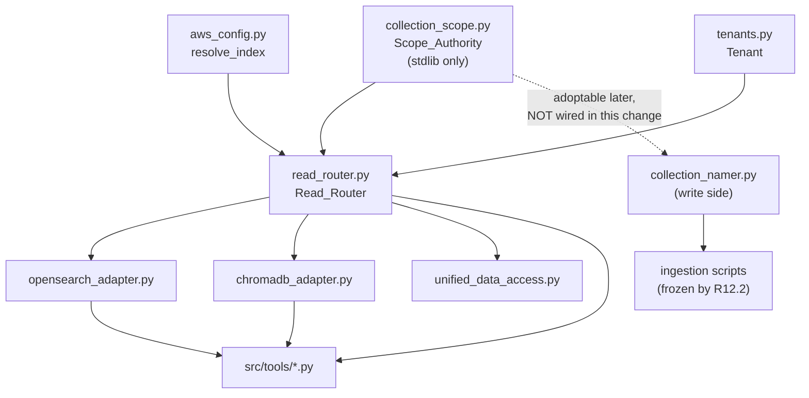
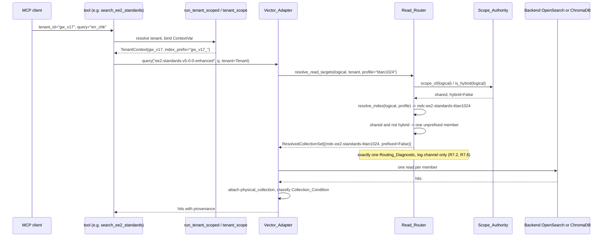
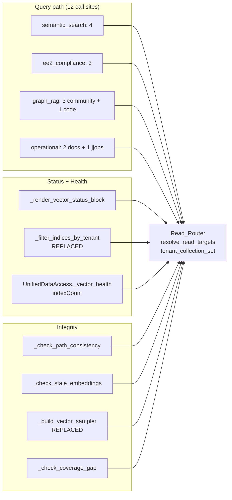

# Design Document

## Overview

The read path prepends the active tenant's `index_prefix` to every collection
it addresses. Shared corpora — external documentation crawls, EE2/NCO
standards, graph-derived community summaries — were written once into
unprefixed collections, so every non-default tenant addresses a name the write
path never created, or one that exists and holds zero documents. Three code
paths each re-derive "which physical collections belong to tenant T" and each
derives it differently; investigation found a fourth.

This design introduces two new modules and routes all four paths through them:

- **`Scope_Authority`** (`src/data/collection_scope.py`) — a frozen, in-code
  table answering "is this Logical_Collection `shared` or `tenant`, and is it a
  Hybrid_Domain". Zero I/O per resolution, stdlib-only dependencies.
- **`Read_Router`** (`src/data/read_router.py`) — a pure function mapping
  `(Logical_Collection, Tenant, Embedding_Profile)` to an ordered
  `Resolved_Collection_Set` of physical names, each carrying its scope and
  whether it is prefixed.

Both vector adapters, the Status_Reporter, the Integrity_Checker, and the
Health_Reporter consume the Read_Router. Nothing else applies an
`index_prefix` on the read path (R4.2).

### Investigation findings that shaped the design

Every claim below was confirmed by reading the code, not inferred from the
requirements document.

**1. The defect has four manifestations, not three.** The requirements name
`query()`, `_filter_indices_by_tenant()`, and `_build_vector_sampler()`. A
fourth sits in `UnifiedDataAccess._vector_health`
(`src/data/unified_data_access.py`), which computes
`indexCount = len(raw.get("indices") or raw.get("collections") or [])` with no
tenant scoping at all, then gates overall health on
`index_count >= min_indices` (default 5). `mcp_health_check` renders that count
verbatim (`utility.py`, `f"{vec.get('indexCount', 0)} indices"`). R11.1 names
the Health_Reporter as a Read_Router consumer; the code change lands in
`UnifiedDataAccess`, one layer below the tool.

**2. `load_manifest` never raises.** `src/manifest/loader.py::load_manifest`
catches `JSONDecodeError`, `OSError`, and `ValueError`, falls back to
`documentation_sources.json`, and on further failure returns an *empty*
registry so callers can boot degraded. A Scope_Authority reading the manifest
at runtime therefore cannot satisfy R5.6 — a corrupt manifest would yield an
empty scope table, every Logical_Collection would fall through R1.5's
`tenant` default, and the blind spot this spec exists to close would silently
reappear. This single fact is decisive against Option 2 as the runtime
authority. It does not weaken the manifest as a *drift-detection* target,
which is how this design uses it.

**3. The manifest declares no hybridity, and cannot.** All 67 sources carry a
`scope` field; none is missing or out of range. Sixty-seven sources map to five
`collection_target` values, and **no `collection_target` has more than one
distinct `scope`** — so R1.6's multi-scope finding class currently has zero
instances and is a forward guard rather than a live defect. Fifty-nine sources
target `global-workflow-docs-v8-0-0`; fifty-eight are `url_crawl` and exactly
one — `global-workflow-rst`, `source_type: on_disk_submodule`, reading
repo-local `docs/**` — makes that collection hybrid. It is declared plain
`shared`, identically to the fifty-eight external crawls. Hybrid_Domain
membership therefore needs a configuration surface that does not exist today;
this design adds one and says who owns it.

**4. Scope is per-source on the write side and per-collection on the read
side.** `resolve_collection_name` takes `scope` as a caller-supplied argument;
each ingester passes a literal (`scope="shared"` in
`ingest_documentation_v8.py`, `scope="tenant"` in `ingest_code_v8.py`,
`ingest_jjobs_v8.py`, `ingest_config_files_v8.py`). The write path never needs
a lookup table. The read path does, and aggregating 67 per-source values into 5
per-collection answers requires a conflict rule — which is precisely R1.6's
second finding class.

**5. `_is_missing_index_exc` is OpenSearch-only, as recorded.** It matches
`opensearchpy.NotFoundError` with
`info['error']['type'] == "index_not_found_exception"`, or the literal token in
`str(exc)`. `ChromaDBAdapter.query` wraps every failure — including a missing
collection — as `ValueError(f"ChromaDB query failed on index={index!r}: {exc}")`,
which the token match never sees. Classification is asymmetric today; R4.3 and
R4.4 require it not to be.

**6. Per-hit provenance does not exist in the current return shape.**
`_format_hits` returns `{id, content, metadata, score}` in both adapters.
`multi_collection_query` adds `row.setdefault("collection", name)` where `name`
is the **logical** collection, not the physical one, and only on the fan-out
path — a single `query()` attaches nothing. R3.5 requires a physical name on
every hit. Critically, `_format_search_hit` **renders** the `collection` key:
`source_line += f" | **Collection:** {collection_name}"`. Repurposing that key
would change gw output bytes and violate R6.2, so this design adds a separate
key and leaves `collection` alone.

**7. OpenSearch scores are clamped, so R3.7's tie-break is load-bearing.**
`OpenSearchAdapter._format_hits` clamps `_score` to `[0.0, 1.0]`. The hybrid
body is a `bool.should` of a BM25 `match` and a `knn` clause; raw BM25 scores
routinely exceed 1.0, so many hits arrive at exactly `1.0`. Merging two
physical collections by score alone would leave large tie buckets. R3.7's total
order is the primary ordering mechanism for the AWS hybrid-domain merge, not a
rare fallback. Section "Merge semantics" addresses cross-index score
incomparability directly.

**8. There is no content-carrying configuration transport today.** Tenant
configuration loads only from a file: `runtime.get_catalog()` reads
`MCP_TENANT_CATALOG_PATH` (a *path*, not content) and defaults to the bundled
`src/config/tenants.yaml`. R5.3 and R5.7 presuppose an environment variable
whose *content* is byte-identical to a mounted file. **The requirements did not
anticipate that this transport does not exist. This design adds it** and defines
the precedence; see "Cross-form-factor design".

**9. `GraphGuidedRetrieval` reads without a tenant.**
`_safe_semantic_enrich` calls `self._vector_db.query(collection, ...)` with no
`tenant=` argument, so GGSR-enriched reads resolve unprefixed regardless of the
active tenant. `graph_rag.get_code_context` does pass
`default_collection=CODE_COLLECTION` and `collection=CODE_COLLECTION`, so the
physical-name default `DEFAULT_SEMANTIC_COLLECTION = "mdc-code-context-mpnet768"`
is never the effective value on that path. The layering violation is latent, not
live. R2.5 governs it; the profile pinning is out of scope. Section
"Error handling" specifies how the Read_Router behaves when handed that physical
name.

**10. The GraphRAG MCP tools could not verify this change.** They index the
NOAA global-workflow repository under study, not this server's own tree:
`get_change_impact("resolve_tenant_index")` returned zero dependents and
`search_architecture` returned Fortran communities. Ground truth for this design
came from `grep` and `read` over `mcp_server_python/`. This is expected
behaviour for the tool surface, not a tool failure.

### Factual corrections to the requirements document

The requirements are the contract; these are incidental descriptive slips found
while confirming them in code. None changes an acceptance criterion.

| Requirements text | Code ground truth |
|---|---|
| "Ten query sites" (Blast radius) | The paragraph's own enumeration names **eleven** (3 + 3 + 3 + 2). The tree holds **twelve** distinct shared-scope-reachable call expressions, because `_tool_search_documentation` has two branches — an explicit-collection `query()` and a `multi_collection_query()` fan-out. R2.5 and R2.6 are satisfied against the twelve; the count in the prose is not load-bearing. |
| "the two `COMMUNITY_COLLECTION` helper sites feeding `get_code_context`" | `_render_community_section` (line 628) feeds `get_code_context` (line 564). `_fetch_community_context` (line 996) feeds **`get_change_impact`** (line 934), not `get_code_context`. Both are realigned identically. |
| Three code-path manifestations | Four. See finding 1. |

### Decision record

**Chosen mechanism: a static in-code Scope_Authority (Option 2's
single-point-of-truth, without its runtime loader) consumed by a set-returning
Read_Router (Option 4's shared/tenant separation, lifted out of
`multi_collection_query`), with no scope tagging on the collection-name
constants (Option 1 declined).**

Option 3 — probe physical existence and fall back to unprefixed — is excluded
by requirement, not by judgement: R5.1 forbids collection-existence probes
during resolution, and Introduction finding 1 shows a provisioned-but-empty
collection satisfies the probe and defeats the fall-back trigger. It is not
scored below.

| Criterion | Option 1: tag the constants | Option 2: adapters read the manifest | Option 4: split the fan-out | **Chosen hybrid** |
|---|---|---|---|---|
| **SPOT strength (R1.1-R1.3)** | Weak. Scope would live in `DEFAULT_SEARCH_COLLECTIONS`, `CONTEXT_TYPE_COLLECTIONS`, and five bare `str` constants (`EE2_COLLECTION`, `COMMUNITY_COLLECTION`, `WORKFLOW_DOCS_COLLECTION`, `CODE_COLLECTION` x2, `JJOBS_COLLECTION`) across four modules. Nothing forces them to agree. | Strong in principle — the manifest already declares scope for all 67 sources. | None. The fan-out list is one of twelve call sites; the other eleven pass a bare name. | Strong. One frozen table, one module, five keys. |
| **Drift resistance (R1.6, R1.9)** | None. No mechanism compares tags to the manifest. | Maximal — it *is* the manifest. | None. | Strong. `Scope_Consistency_Check` compares the table against `unified_manifest.json` at test time and fails the suite on any of four finding classes. |
| **Cross-backend symmetry (R4.1, R4.2, P3)** | Each adapter interprets the tag, so the prefix decision is duplicated — R4.2 fails unless a shared helper appears, at which point the Read_Router has been built anyway. | Same duplication risk unless the manifest read lives in a shared module. | `multi_collection_query` is implemented separately in each adapter; splitting it splits twice. | Satisfied by construction. One function; adapters call it. |
| **No network probe (R5.1, P9)** | Satisfied. | Satisfied (file read at init, not per resolution). | Satisfied. | Satisfied trivially — the table is a module-level literal. |
| **Serves all three R1.4 consumers** | No. `_filter_indices_by_tenant` and `_build_vector_sampler` have no constant list to tag. | Yes, if shared. | No. Neither reporting path fans out. | Yes. All four consumers call one resolver. |
| **R5.6 hard-error path** | N/A (no config load). | **Fails.** `load_manifest` never raises; a corrupt manifest yields an empty table, and every collection silently falls through R1.5 to `tenant`. | N/A. | Satisfied. The built-in table cannot fail to load; the optional override transport hard-fails on parse error. |
| **R6.2 byte-equivalence risk** | Elevated. Changing `EE2_COLLECTION` from `str` to a descriptor touches every consumer, including renderers. | Low. | Low. | Low. Constants keep their type and value; only the adapter's internal resolution changes. |

**Option 1 is insufficient on its own, and this design agrees with the task
framing over Phase 79's recommendation.** Tagging `DEFAULT_SEARCH_COLLECTIONS`
fixes one of twelve call sites. It does nothing for the eleven that pass a bare
constant, nothing for `_filter_indices_by_tenant`, nothing for
`_build_vector_sampler`, and nothing for `UnifiedDataAccess._vector_health`.
Phase 79 chose it for "minimum change surface", but minimum change surface at
one call site is not the same as minimum blast radius across the defect, and
R1.4 makes serving all consumers a requirement rather than a preference.

**Trade-offs accepted.**

1. *Scope lives in code, not in the manifest.* Adding a sixth Logical_Collection
   requires a one-line table edit alongside the manifest entry, and the
   `Scope_Consistency_Check` fails the suite until both are done. This is a
   deliberate exchange: the manifest's declarative appeal for a loader that
   cannot silently degrade. R1.6's four finding classes are what make the
   exchange safe.
2. *R5.6's Collection_Scope arm is vacuous for the built-in table.* A Python
   literal cannot fail to parse at runtime; it fails at import, before any tool
   is reachable. The arm is non-vacuous for the optional override transport,
   which is a real file/env read with a real hard-error path. This reading is
   stated rather than assumed.
3. *Hybrid_Domain membership is declared, not derived.* A derivation rule
   ("a `shared` collection is hybrid iff it has an enabled repo-local source")
   would track the manifest automatically but requires a runtime manifest read
   and inherits finding 2. The rule is instead encoded as the
   `Scope_Consistency_Check`'s *expectation*, so manifest drift is caught
   without a runtime dependency.
4. *One extra document-count call on zero-hit reads.* Distinguishing
   `provisioned-empty` from `provisioned-populated` (R7.4, R7.8) is not free.
   Section "Cross-backend normalization" bounds it to the zero-hit path behind a
   TTL cache and states the cost.
5. *Cross-index score incomparability is documented, not solved.* Normalizing or
   RRF-fusing scores across members would change gw output bytes on the existing
   fan-out and is therefore out of bounds here (R6.2). The tie-break gives a
   deterministic, defensible order instead. Recorded as follow-up.

## Architecture

### Component placement and dependency direction

```
src/config/aws_config.py          PRODUCTION_INDICES_BY_PROFILE, resolve_index
src/config/tenants.py             Tenant, TenantCatalog, load_catalog
                                  + load_catalog_from_transport  (new, R5.7)
src/data/collection_namer.py      resolve_collection_name  (write side, UNCHANGED)
src/data/collection_scope.py      Scope_Authority           (NEW)
src/data/read_router.py           Read_Router               (NEW)
src/data/vector_errors.py         CollectionNotProvisionedError (NEW)
src/data/opensearch_adapter.py    consumes Read_Router
src/data/chromadb_adapter.py      consumes Read_Router
src/data/unified_data_access.py   consumes Read_Router (health enumeration)
src/tools/semantic_search.py      consumes Read_Router (status, integrity)
src/tools/_common.py              widened classifier + Skip_Block (shared)
src/tools/smoke_queries.py        realigned Isolation_Probe
```

Dependency direction, which is what keeps R12.6 satisfiable:



`collection_scope.py` imports nothing from this repository. It does not import
the Read_Router, either Vector_Adapter, or any tool module. That is exactly
R12.6's condition for classifying a module as shared rather than as a write-path
modification, and R12.6 names the Scope_Authority as the expected case.

**The write path is not re-pointed at the Scope_Authority in this change.**
R12.6 permits a shared module, but R12.2 requires every file under
`mcp_server_python/scripts/` — including `_ingest_common.py`, which re-exports
`resolve_collection_name` — to be byte-identical afterwards. The Scope_Authority
is therefore *read-path-only in fact and shared-capable in design*: the dotted
edge above is a future adoption path, not part of this change. `collection_namer`
needs no table anyway, because each ingester passes `scope` as a literal
(finding 4).

### Resolution path, tool call to physical names



For the Hybrid_Domain under a non-empty prefix the router returns two members,
unprefixed first, and the adapter issues two reads and merges them (R3.1-R3.4).
Under the Default_Tenant the empty prefix collapses the pair to one member
(R6.7), so the merge is the identity and gw output cannot move.

### Three consumer paths converging on one resolver



`_filter_indices_by_tenant` and `_build_vector_sampler` are replaced rather than
adjusted. Both answer "which collections belong to tenant T" by inspecting
physical names after the fact — the first by prefix-matching a
`cat.indices`/`list_collections` enumeration, the second by not scoping at all.
Neither can express "the unprefixed shared collection belongs to `gw_v17` too",
because a name-shape test cannot distinguish a shared collection from another
tenant's. Both become thin adapters over `tenant_collection_set(...)`.

### Where the backends diverge, and where they must not

| Concern | Diverges | Must not diverge |
|---|---|---|
| Physical name resolution | — | R4.1/P3: the Read_Router is backend-blind. It never reads `DB_BACKEND` and takes no backend argument, so identical configuration yields identical sets by construction. |
| Transport and query body | Yes. OpenSearch: SigV4 + `bool.should` BM25/k-NN. ChromaDB: HTTP client + `collection.query(query_embeddings=...)`. | — |
| Score scale | Yes, and already did. OpenSearch clamps `_score` to `[0,1]`; ChromaDB maps L2-squared to cosine via `1 - d/2`. Untouched (R6.2). | — |
| Missing-collection signal | Yes at source. OpenSearch: `index_not_found_exception`. ChromaDB: a client exception whose type varies by pin (1.3.4). | R4.3/R4.6: both normalize to `CollectionNotProvisionedError` before leaving the adapter. R4.4/R4.7: one Skip_Block renderer, character-identical text. |
| Document count | Yes at source (`count` vs `collection.count()`). | R7.4/R7.8: both already expose non-raising `count_documents`; the three-way classifier calls it identically. |
| Default embedding profile | Yes. `titan1024` on AWS, `mpnet768` on COTS. | R5.4: profile changes vary physical *names* only, never scope, prefix application, or set cardinality. |

## Components and Interfaces

### Scope_Authority — `src/data/collection_scope.py` (new)

```python
"""Single authority for Collection_Scope and Hybrid_Domain membership.

shared-scope-query-routing Requirement 1. Read-path counterpart to
``src/data/collection_namer.py``: that module receives a scope per source
from the ingesters, this one answers what the scope of a logical
collection is. Imports stdlib only, so both paths may consume it without
a dependency cycle (R12.6).
"""

from typing import Final, Literal

CollectionScope = Literal["shared", "tenant"]

SCOPE_SHARED: Final[CollectionScope] = "shared"
SCOPE_TENANT: Final[CollectionScope] = "tenant"

#: Authoritative Logical_Collection -> Collection_Scope table (R1.2).
#: Keys are exactly the keys of every inner map in
#: ``PRODUCTION_INDICES_BY_PROFILE``. Cross-checked against the
#: ``(collection_target, scope)`` pairs of all 67 sources in
#: ``src/config/unified_manifest.json`` by ``check_scope_consistency``.
_BUILTIN_SCOPES: Final[dict[str, CollectionScope]] = {
  "global-workflow-docs-v8-0-0":   SCOPE_SHARED,
  "ee2-standards-v5-0-0-enhanced": SCOPE_SHARED,
  "community-summaries":           SCOPE_SHARED,
  "code-with-context-v8-0-0":      SCOPE_TENANT,
  "jjobs-v8-0-0":                  SCOPE_TENANT,
}

#: Shared collections that ALSO carry per-tenant content (R1.8).
#: ``global-workflow-docs-v8-0-0`` qualifies because its
#: ``global-workflow-rst`` source reads repo-local ``docs/**/*.rst``,
#: which varies per branch. Members must be ``shared``; enforced at
#: import.
_BUILTIN_HYBRID: Final[frozenset[str]] = frozenset(
  {"global-workflow-docs-v8-0-0"}
)


class ScopeConfigError(RuntimeError):
  """Raised when an override transport cannot be read or parsed (R5.6)."""


def scope_of(collection: str) -> CollectionScope | None:
  """Return the Collection_Scope of ``collection``, or ``None``.

  ``None`` means the identifier is not a Logical_Collection; the
  Read_Router applies R1.5's ``tenant`` fallback. Deterministic and
  free of I/O and network access (R1.1).
  """


def is_hybrid_domain(collection: str) -> bool:
  """Return True iff ``collection`` is a Hybrid_Domain (R1.8)."""


def logical_collections() -> tuple[str, ...]:
  """Return every registered Logical_Collection in table order.

  The iteration order the Status_Reporter, Integrity_Checker, and
  Health_Reporter use, so their enumerations are reproducible
  (R9.1, R10.6, R11.1).
  """


def active_scope_transport() -> str:
  """Return the transport the active table came from (R5.7).

  One of ``"builtin"``, ``"env"``, or ``"file"``.
  """


def check_scope_consistency(
  manifest_path: str | None = None,
) -> list[str]:
  """Compare this module's table against the unified manifest (R1.6).

  Returns one human-readable finding per discrepancy across four
  classes: (a) a Logical_Collection whose classification differs from
  its sources' declared ``scope``; (b) a non-Hybrid_Domain
  ``collection_target`` whose enabled sources declare more than one
  distinct ``scope``; (c) a source whose ``scope`` is absent or outside
  ``{shared, tenant}``; (d) a ``collection_target`` with no table entry.
  Reads the manifest file directly with ``json.load`` -- deliberately
  NOT through ``src.manifest.loader.load_manifest``, whose legacy
  fallback would mask exactly the corruption this check must report.
  Issues no network request (R1.7); an unreadable manifest is itself a
  finding, never an exception.
  """
```

Two design points worth naming. First, `check_scope_consistency` bypasses
`load_manifest` on purpose: that loader's silent legacy fallback (finding 2) is
the failure mode the check exists to catch, so the check reads the file itself
and reports unreadability as a finding. Second, the Hybrid_Domain invariant
"members must be `shared`" (R1.8) is asserted at import time, so a future
mistake fails the process at load rather than at query time.

### Read_Router — `src/data/read_router.py` (new)

```python
def resolve_read_targets(
  collection: str,
  tenant: "Tenant | None" = None,
  *,
  profile: str | None = None,
) -> ResolvedCollectionSet:
  """Map (Logical_Collection, Tenant, Embedding_Profile) to physical names.

  Parameters
  ----------
  collection
      Logical_Collection identifier. An unrecognised identifier takes
      R1.5's ``tenant`` fallback.
  tenant
      The active tenant, or ``None`` for the unprefixed default. Passed
      explicitly rather than read from the tenancy ContextVar -- see
      note below.
  profile
      Embedding_Profile short name. Defaults to ``MCP_EMBEDDING_PROFILE``
      and then to the backend default.

  Returns
  -------
  ResolvedCollectionSet
      Ordered, unprefixed member first for a Hybrid_Domain (R3.1).

  Notes
  -----
  Pure: no network request, no collection-existence probe, no filesystem
  access (R5.1, P9). Same inputs always yield an equal set.
  """


def tenant_collection_set(
  tenant: "Tenant | None" = None,
  *,
  profile: str | None = None,
) -> TenantCollectionSet:
  """Union of ``resolve_read_targets`` over every Logical_Collection.

  The single answer to "which physical collections belong to tenant T",
  consumed by the Status_Reporter, the Integrity_Checker, and the
  Health_Reporter so all three agree with the query path (R1.4, P8).
  Members are de-duplicated by physical name and ordered by
  ``logical_collections()`` then by within-set position, so repeated
  invocations enumerate identically.
  """
```

**The router takes `Tenant` explicitly and does not read the ContextVar.** Both
adapters already accept a `tenant=` kwarg and every tool already passes
`_tenant()`, so the explicit form is the smaller change. It also keeps the router
a pure function of its arguments, which R5.1 and P9 require and which the
Hypothesis suite depends on — a property generating over the tenants in
`tenants.yaml` cannot bind a `ContextVar` per example without making the test a
concurrency test. `tenant=None` remains the unprefixed default, preserving the
adapters' current `if tenant else` behaviour.

### Vector_Adapter interface changes

`query` keeps its signature and gains provenance and condition reporting inside
the returned rows:

```python
async def query(
  self,
  collection: str,
  query_text: str,
  *,
  k: int = 10,
  similarity_threshold: float = 0.0,
  where: dict[str, Any] | None = None,
  include_graph: bool = True,
  tenant: Any = None,
) -> list[dict[str, Any]]:
  """Resolve read targets, fan out, merge, and attach provenance.

  Every returned row gains ``physical_collection`` -- the name of the
  member that produced it, drawn from the Resolved_Collection_Set
  (R3.5). The pre-existing ``collection`` key is NOT repurposed: it
  carries the logical name and is rendered by
  ``semantic_search._format_search_hit``, so changing it would break
  R6.2 byte-equivalence.

  Raises
  ------
  CollectionNotProvisionedError
      When every member of the Resolved_Collection_Set is absent
      (R4.7, R7.9). A partially absent set does not raise (R7.1).
  """
```

`multi_collection_query` is unchanged in signature and in its cross-collection
merge. It gains nothing: because each per-logical-collection `query` now performs
the intra-set fan-out internally, the fan-out loop sees exactly what it saw
before. This layering is deliberate and is the main reason R6.2 is achievable —
see "Merge semantics".

`sample_metadata` is unchanged. Both adapters already accept a named collection
with a `limit`, which is all the scoped Integrity_Checker needs; the tool layer
iterates the members returned by `tenant_collection_set` and allocates the
budget. Widening the sampler to take a collection list was considered and
rejected as an unnecessary protocol change.

One new method is required on both adapters, and it is the only genuine widening:

```python
async def collection_condition(
  self, physical_collection: str
) -> CollectionCondition:
  """Classify one physical collection (R7.8).

  Returns ``UNPROVISIONED``, ``PROVISIONED_EMPTY``, or
  ``PROVISIONED_POPULATED``. Backed by the existing non-raising
  ``count_documents`` plus an existence signal. Never raises. Results
  are cached per process for a bounded TTL; see "Cross-backend
  normalization".
  """
```

### `VectorDBProtocol` changes — `src/data/protocols.py`

The protocol must widen, and it is already behind the implementations. Today
`VectorDBProtocol.query` declares no `tenant` parameter even though both
adapters accept one and every tool passes it — a latent drift this change
closes rather than creates.

| Member | Change | Both adapters satisfy it? |
|---|---|---|
| `query` | Add `tenant: Any = None` (documenting existing reality) and document the `physical_collection` key on results. | Yes. `tenant=` already implemented in both. |
| `multi_collection_query` | Unchanged. | Yes. |
| `sample_metadata` | Unchanged. | Yes, both accept `(collection, limit, *, n)`. |
| `count_documents` | Unchanged. | Yes. |
| `collection_condition` | **New.** | Yes, once added; both are built on `count_documents`, which both already implement non-raising. |
| `health_check` | Unchanged. Continues to return `indices` / `indices_detail`, now consumed only as a *count source* for names the router supplied, never as the name source itself. | Yes. |

`VECTOR_RESULT_KEYS` gains `physical_collection`. `tests/conftest.py::MockVectorDB`
needs the new method and the new key; it is a test double, not production code,
and is not covered by R12.2.

### Tool-layer and reporting changes

| Site | Change |
|---|---|
| 12 query call sites | Unchanged in shape. Each already passes a Logical_Collection constant and `tenant=_tenant()`, so R2.5 already holds; the resolution beneath them changes. |
| `graph_rag`, `ee2_compliance`, `operational`, `semantic_search` zero-hit renderers | Add the R7.7 annotation, gated on a non-empty `index_prefix` (R6.8). |
| `_render_vector_status_block` | Take names from `tenant_collection_set`; use `health_check` only for counts. Label each with its Collection_Scope (R9.2). Sum counts over the listed set (R9.3). |
| `_filter_indices_by_tenant` | Deleted. Its `_index_in_tenant_scope` prefix test is what excluded shared collections from the non-default view. |
| `_build_vector_sampler` | Replaced by a router-driven allocator (R10.1, R10.6). The `_scroll_sampler` fallback is retained for adapters without `sample_metadata`. |
| `_check_coverage_gap` | Ingested-document count becomes the sum over the tenant's set, shared members included (R10.4). |
| `UnifiedDataAccess._vector_health` | `indexCount` becomes the cardinality of the tenant's enumeration (R11.1); degraded only when a `shared` unprefixed member is absent (R11.6). |
| `_smoke_branch_isolation` | Vector assertions realigned; graph assertions untouched (R8.5). |
| `GraphGuidedRetrieval._safe_semantic_enrich` | Accept and forward `tenant=`. Without it, GGSR-enriched reads bypass tenancy entirely (finding 9). |

## Data Models

### `ResolvedTarget` and `ResolvedCollectionSet`

```python
@dataclass(frozen=True, slots=True)
class ResolvedTarget:
  """One physical collection a read should address."""

  physical: str          # e.g. "gw_v17_mdc-workflow-docs-titan1024"
  scope: CollectionScope # scope of the logical collection it came from
  prefixed: bool         # carries the active tenant's index_prefix


@dataclass(frozen=True, slots=True)
class ResolvedCollectionSet:
  """Ordered result of one (logical, tenant, profile) resolution.

  ``targets`` is ordered, not a Python ``set``: R3.1 requires the
  unprefixed member first for a Hybrid_Domain and R3.7's tie-break
  reads member position. "Set" in the requirements' vocabulary means
  "collection of distinct members", and distinctness by ``physical`` is
  enforced at construction.
  """

  logical: str
  scope: CollectionScope
  hybrid: bool
  tenant_id: str
  index_prefix: str
  profile: str
  targets: tuple[ResolvedTarget, ...]
  fallback_applied: bool = False   # R1.5 unknown-identifier path
  unmapped_profile: bool = False   # R2.8 no mapping for active profile

  @property
  def physical_names(self) -> tuple[str, ...]: ...
```

Cardinality by case, which is the whole of R2.2, R2.3, R3.1, and R6.7:

| Scope | Hybrid | `index_prefix` | Members | Order |
|---|---|---|---|---|
| `shared` | no | `""` | 1 | unprefixed |
| `shared` | no | `"gw_v17_"` | 1 | unprefixed |
| `shared` | yes | `""` | 1 | unprefixed (pair collapses, R6.7) |
| `shared` | yes | `"gw_v17_"` | 2 | unprefixed, then prefixed |
| `tenant` | n/a | `""` | 1 | unprefixed |
| `tenant` | n/a | `"gw_v17_"` | 1 | prefixed only (R2.2) |

### `TenantCollectionSet`

```python
@dataclass(frozen=True, slots=True)
class TenantCollectionSet:
  """Union of a tenant's Resolved_Collection_Sets (R1.4, P8)."""

  tenant_id: str
  index_prefix: str
  profile: str
  targets: tuple[ResolvedTarget, ...]          # de-duplicated, ordered
  by_logical: Mapping[str, tuple[str, ...]]    # logical -> physical names
```

Under `gw_v17` / `titan1024` this holds six members for five logical
collections — the Hybrid_Domain contributes two. Under `gw` it holds five. That
difference is the visible fix to R9.1's "the report stops implying that `gw_v17`
has only five collections".

### `CollectionCondition`

```python
class CollectionCondition(StrEnum):
  """Per-read classification of one addressed physical collection (R7.8)."""

  UNPROVISIONED = "unprovisioned"                  # absent from the backend
  PROVISIONED_EMPTY = "provisioned-empty"          # present, zero documents
  PROVISIONED_POPULATED = "provisioned-populated"  # present, >= 1 document
```

`PROVISIONED_POPULATED` is assigned when the collection holds documents *even if
the query matched none*, which is R7.8's explicit disambiguation and the reason
the classifier cannot be inferred from hit count alone.

### `RoutingDiagnostic`

```python
@dataclass(frozen=True, slots=True)
class RoutingDiagnostic:
  """One log-channel-only record of a routing decision (R7.2, R7.6)."""

  tenant_id: str
  logical: str
  profile: str
  members: tuple[tuple[str, CollectionScope, bool], ...]  # name, scope, prefixed
  transport: str                       # builtin | env | file (R5.7)
  classification: str | None = None    # unprovisioned | provisioned-empty
                                       # | routing-misconfiguration
                                       # | tenant-fallback | unmapped-profile

  def render(self) -> str:
    """One ASCII line, <= 1000 chars, no query text or credentials."""
```

Rendered shape, single line, emitted at `INFO`:

```
[routing] tenant=gw_v17 logical=global-workflow-docs-v8-0-0 profile=titan1024
transport=builtin members=mdc-workflow-docs-titan1024(shared,unprefixed),
gw_v17_mdc-workflow-docs-titan1024(shared,prefixed)
```

R7.6's constraints are enforced in `render`, not left to callers: ASCII-only via
an explicit encode check, a 1000-character cap with truncation marker, and a
field whitelist that structurally cannot carry query text or document content
because neither is a field of the record. Exactly one diagnostic per read
addresses R7.2's "exactly one"; the condition classifications of R7.3-R7.5 are
carried on that same record via `classification`, or on a follow-up record when a
per-member condition is discovered after the read.

### Configuration surface for scope and hybridity

Three layers, highest precedence first:

| Layer | Source | Failure mode |
|---|---|---|
| Env override | `MCP_COLLECTION_SCOPE_JSON` — inline JSON content | `ScopeConfigError` at first use (R5.6) |
| File override | `MCP_COLLECTION_SCOPE_PATH` — path to a JSON file | `ScopeConfigError` at first use (R5.6) |
| Built-in | `_BUILTIN_SCOPES` + `_BUILTIN_HYBRID` | Cannot fail at runtime |

Override document schema:

```json
{
  "schema_version": 1,
  "scopes": {
    "global-workflow-docs-v8-0-0": "shared",
    "ee2-standards-v5-0-0-enhanced": "shared",
    "community-summaries": "shared",
    "code-with-context-v8-0-0": "tenant",
    "jjobs-v8-0-0": "tenant"
  },
  "hybrid_domains": ["global-workflow-docs-v8-0-0"]
}
```

An override replaces both tables wholesale rather than merging, so the active
classification is always readable from one document. Validation on load: every
`scopes` value in `{shared, tenant}`; every `hybrid_domains` entry present in
`scopes` and classified `shared` (R1.8); `schema_version == 1`. Any violation
raises `ScopeConfigError`.

**Ownership.** The built-in tables are owned by the data-plane maintainers and
live beside `collection_namer.py`, the write-side authority they mirror. The
override exists so an operator can correct a misclassification without a rebuild
and redeploy of the AgentCore image — a real need on a runtime whose deploy is
gated. It is expected to be unset in normal operation, and
`active_scope_transport()` reports which layer is live so a diagnostic never
leaves the question open.

**Why hybridity is not derived from the manifest at runtime.** The derivation
rule is sound — a `shared` collection is hybrid exactly when it has an enabled
source whose `source_type` reads the repo tree (`on_disk_submodule` today) — and
it currently yields `{global-workflow-docs-v8-0-0}`, matching the declaration.
Evaluating it at runtime would require a manifest read and would inherit finding
2's silent fallback. So the rule is encoded as the `Scope_Consistency_Check`'s
expectation instead: if a second repo-local `shared` source appears, or
`global-workflow-rst` is removed, the check fails the suite and points at the
declaration.

## Merge semantics

### Two merge layers, deliberately separate

This separation is the single most important preservation device in the design.

```
multi_collection_query(logical_list, ...)          <- OUTER, UNCHANGED
  |
  +-- query(logical_1, tenant) ------------------+
  |     resolve_read_targets -> N members        |  INNER, NEW (R3)
  |     fan out, merge, tie-break, dedupe, cap   |
  |     <- at most k hits, provenance attached   |
  +-- query(logical_2, tenant) ...               |
  |
  merge by score desc, dedupe by content[:200], cap at k   <- UNCHANGED
```

The **inner** merge is new and governed by R3.2-R3.9. It operates *within* one
Resolved_Collection_Set, so it only ever does work when a Hybrid_Domain is read
under a non-empty prefix. The **outer** merge across logical collections keeps
its existing score sort, its existing `content[:200]` de-duplication
fingerprint, and its existing cap — byte-for-byte.

Under the Default_Tenant every set has exactly one member (R6.7), the inner
merge is the identity, and the outer merge sees exactly the input it saw before
the change. That is how R6.2 is satisfied for `search_documentation` and
`explain_with_context` without freezing the new behaviour out of existence.

The two de-duplication rules coexist on purpose. R3.8 requires equality of
document content, so the inner rule uses a full-content digest; the outer rule
keeps its 200-character prefix because tightening it would change which hits
survive for `gw` and break R6.2. Recorded as a known asymmetry, not an
oversight.

### The inner algorithm

Input: `ResolvedCollectionSet` with members `m_0 .. m_{n-1}` in router order
(unprefixed first), plus `query_text`, `k`, `similarity_threshold`, `where`.

1. **Fan out (R3.2).** Issue one read per member with *identical* `query_text`,
   `k`, `similarity_threshold`, and `where`. Concurrent via `asyncio.gather(...,
   return_exceptions=True)`, mirroring the existing `multi_collection_query`
   shape. Each member is asked for `k`, not `k/n`: a member may legitimately
   supply all `k` survivors, and R3.4 caps only the merged output.
2. **Classify and triage.** Convert each exception via the shared classifier. A
   `CollectionNotProvisionedError` marks that member `UNPROVISIONED` and
   contributes zero hits (R7.1, R7.3). Any other failure propagates as a query
   failure (R4.6). If *every* member is unprovisioned, raise (R4.7, R7.9).
3. **Attach provenance (R3.5).** Stamp `physical_collection = m_i.physical` on
   every hit from member `i`. Exactly one name per hit, always a member of the
   addressed set.
4. **Order (R3.3, R3.7).** Sort by the total-order key

   ```python
   (-hit["score"], member_index, str(hit["id"]))
   ```

   Score descending; ties broken by member position ascending, so shared
   content precedes branch-local content; remaining ties broken by hit
   identifier ascending lexicographically. The key is total because
   `(member_index, id)` is unique within one read — no two hits from one
   physical collection share an `_id`.
5. **De-duplicate (R3.8).** Walk the ordered list keeping a set of content
   digests; drop any hit whose digest is already present. The retained copy is
   the first in the order from step 4, and it keeps its own
   `physical_collection` — so for a document present in both members, the
   shared copy is retained and attributed to the shared collection.
6. **Cap (R3.4, P10).** Return the first `k`, or all survivors if fewer.
7. **Emit diagnostics (R7.2-R7.5).** One `RoutingDiagnostic` for the
   resolution, plus per-member condition records for any member that is
   `UNPROVISIONED` or `PROVISIONED_EMPTY`.

Determinism (R3.9) follows from steps 4-6 being a pure function of the hits: the
sort key is total, the de-duplication walk is order-dependent only on that key,
and the cap is positional. Given unchanged member content, two invocations
return the same sequence with the same attached names.

### Content equality without loading extra bodies

R3.8 asks for equality of document content, and the requirement to avoid pulling
full bodies into memory needs a precise reading. Both adapters already return
full `content` for every hit they return — OpenSearch requests `content` in
`_source`, ChromaDB returns `documents`. The bodies of *returned* hits are
therefore already resident, and the constraint is really "do not fetch bodies
for documents you are not returning".

The digest is computed only over returned hits:

```python
def _content_digest(hit: dict[str, Any]) -> str:
  """SHA-256 over the hit's normalized content (R3.8).

  Normalization: take ``content``, else ``document``, else ``text``, else
  ``""``; ``strip()``; collapse internal whitespace runs to one space;
  encode UTF-8. Whitespace collapsing makes the digest robust to the
  trailing-newline and indentation differences the two ingest paths
  introduce for the same source document.
  """
  return hashlib.sha256(_normalize(hit).encode("utf-8")).hexdigest()
```

Bounds: at most `n * k` digests per read, where `n <= 2` (only Hybrid_Domains
have more than one member) and `k <= 1000`. At the `k = 20` cap
`search_documentation` enforces, that is 40 SHA-256 computations over strings
already in memory. No additional backend round trip, no `_source` change, no
document fetched that would not have been returned anyway.

Two limits stated rather than hidden. Content-digest equality catches
byte-identical duplicates after whitespace normalization; it does not catch the
same document re-chunked with different boundaries by the two ingest paths.
Near-duplicate detection is out of scope. And because the outer merge still
fingerprints on `content[:200]`, a pair the inner rule keeps as distinct may
still be collapsed by the outer rule — the outer rule is strictly more
aggressive on the prefix and strictly less precise overall.

### Cross-index score comparability

**The scores being merged are not comparable in the strict sense, and this
design does not pretend otherwise.**

On OpenSearch the per-member score is a clamped `_score` from a `bool.should`
of a BM25 `match` and a `knn` clause. BM25 depends on index-local corpus
statistics — `docFreq`, `docCount`, average field length — so the same document
scored in `mdc-workflow-docs-titan1024` (35,980 documents) and in
`gw_v17_mdc-workflow-docs-titan1024` (28,459 documents) receives different raw
scores for the same query. The `[0,1]` clamp then compresses everything above
1.0 onto exactly 1.0, which is why live status output shows hits at "100%
similarity". Ties are common, not exceptional.

Three options were considered:

1. **Normalize per member before merging** (min-max or z-score over each
   member's returned hits). Rejected: the same normalization would have to
   apply to the outer cross-collection merge to be coherent, and that changes
   `gw` ordering for `search_documentation` — a direct R6.2 violation.
2. **True RRF fusion across members** (rank-based, statistics-free, the
   principled fix). Rejected for the same reason plus scope: RRF across the
   outer five-collection fan-out is a different and larger change with its own
   quality-benchmark implications.
3. **Keep per-member scores as-is and make the tie-break carry the ordering.**
   Chosen.

The resulting semantics are worth stating plainly so no reviewer mistakes them
for score-accurate ranking: **for a Hybrid_Domain the merged order is
score-bucketed, and within a bucket shared content precedes branch-local
content.** That is a defensible editorial choice — NWS-wide documentation
outranks branch-local documentation at equal apparent relevance — and it is
exactly what R3.1's unprefixed-first ordering plus R3.7's member-position
tie-break produce. R2.7 is satisfied under it: every hit the Default_Tenant
would return is still returned unless displaced beyond `k` by a
higher-scoring prefixed hit.

Follow-up, out of scope here: a `hybrid-domain-score-fusion` spec to evaluate
RRF across both merge layers, gated on a quality-benchmark comparison because
it necessarily moves `gw` output.

## Default-tenant preservation strategy

R6 is the hard constraint. Five mechanisms carry it.

**1. Structural collapse (R6.1, R6.7, P2).** For `index_prefix == ""` the
prefixed and unprefixed forms of a name are identical, so the Hybrid_Domain pair
de-duplicates to one member at construction. Every `gw` set has cardinality one
and its member equals `resolve_index(collection, profile)` exactly. The inner
merge is then the identity by construction, not by a special case — there is no
`if tenant is default` branch in the merge path to get wrong.

**2. Untouched outer merge.** The cross-logical-collection merge, its score
sort, its `content[:200]` fingerprint, and its cap are not modified.

**3. Additive result keys.** `physical_collection` is new; `collection`,
`id`, `content`, `metadata`, and `score` are unchanged in name and value.
Verified against every renderer that consumes a hit: `_format_search_hit`
reads `metadata.title`, `metadata.source_file`, `id`, `score`,
`metadata.source`, `content`/`document`/`text`, and `collection`; the EE2 and
GraphRAG renderers read named keys only. No renderer iterates `hit.items()`, so
an added key cannot surface in output.

**4. Annotation gating (R6.8).** The R7.7 zero-hit annotation is emitted only
when `tenant.index_prefix` is non-empty. Under `gw` an `unprovisioned` or
`provisioned-empty` member is recorded on the log channel and nowhere else, so
the rendered zero-hit body is unchanged.

**5. Diagnostic confinement (R6.6).** `RoutingDiagnostic` has one sink,
`log.info`. It is never concatenated into a response body on any path, including
the R1.5 fallback. Enforced by a unit test that asserts the diagnostic string
never appears in any rendered tool output.

### Byte-equivalence verification

R6.5 requires comparison against a capture from the immediately preceding
revision under identical inputs, tolerating only characters that also differ
between two consecutive pre-change invocations.

```
tests/baselines/
  capture.py                 # capture harness (NOT under scripts/, see below)
  recorded_backend/*.json    # frozen adapter responses, per scenario
  pre_change/*.md            # rendered tool output from the parent revision
  README.md                  # regeneration procedure and the frozen input set
```

`capture.py` lives under `tests/` rather than `mcp_server_python/scripts/`
because R12.2 freezes that directory byte-for-byte; a capture harness placed
there would itself violate the requirement it exists to help verify.

Frozen inputs per scenario: tool name, query text, `max_results`, every other
tool argument, `DB_BACKEND`, `MCP_EMBEDDING_PROFILE`, and no `tenant_id`. The
backend is not live — each scenario replays a recorded response file through a
stub adapter, so store content is frozen by construction and the comparison
isolates rendering from data drift. The same recorded responses feed the
pre-change and post-change runs, which R13.3 requires explicitly.

Volatile-character handling, per R6.5: the harness runs the pre-change revision
**twice** over the same inputs and diffs the two outputs. Any differing span is
recorded as a volatility mask (generated timestamps in the integrity report are
the known instance). The post-change comparison applies only those masks. A
mask cannot be added by hand — it has to be earned by a demonstrated
pre-change difference, so the mechanism cannot be used to paper over a real
regression.

The existing `tests/parity/parity_runner.py::_strip_tenant_header` is reused for
the attribution-header handling it already implements, so header treatment stays
consistent with the tenancy parity suite.

## Cross-backend normalization

### One missing-collection signal — `src/data/vector_errors.py` (new)

```python
class VectorReadError(RuntimeError):
  """Base for read-path errors surfaced by a Vector_Adapter."""


class CollectionNotProvisionedError(VectorReadError):
  """A physical collection addressed by a read is absent (R4.3).

  Carries the physical name and the logical collection it resolved
  from so the tool layer can render a Skip_Block without re-deriving
  either. Raised by BOTH adapters, so downstream classification is
  independent of the client library's exception taxonomy.
  """

  def __init__(self, physical: str, *, logical: str | None = None,
               tenant_id: str | None = None): ...
```

Detection at each source:

| Backend | Signal | Notes |
|---|---|---|
| OpenSearch | `opensearchpy.NotFoundError` with `info["error"]["type"] == "index_not_found_exception"`, or the literal token in `str(exc)` | Already implemented in `_is_missing_index_exc`; reused verbatim so no behaviour shifts for the paths that call it today. |
| ChromaDB | `chromadb.errors.NotFoundError` / `InvalidCollectionException` when importable, plus a case-insensitive `"does not exist"` / `"collection not found"` substring fallback | The concrete class varies across chromadb releases; the pin is `chromadb==1.3.4` (`pyproject.toml`, `cots` extra). The import is guarded and the substring fallback is the backstop, mirroring the two-form approach `_is_missing_index_exc` already uses for opensearchpy. |

The ChromaDB detection happens **before** the existing wrap. Today
`ChromaDBAdapter.query` catches everything and re-raises
`ValueError(f"ChromaDB query failed on index={index!r}: {exc}")`, which erases
the distinction. The new code classifies first, raises
`CollectionNotProvisionedError` on a match, and falls through to the existing
`ValueError` wrap otherwise — so non-absence failures keep their current shape
and message (R4.6).

`_is_missing_index_exc` is widened to `isinstance(exc,
CollectionNotProvisionedError) or <existing checks>`. Widening rather than
replacing keeps the four existing call sites
(`semantic_search._tool_search_documentation`,
`graph_rag._tool_search_architecture`, `graph_rag._tool_find_similar_code`,
`operational._tool_get_operational_guidance`) working unchanged, which matters
for R6.2.

### One Skip_Block renderer

`_missing_index_skip` in `src/tools/_common.py` is already the single renderer
and its text is already backend-independent — it interpolates only `tool`,
`collection`, and `tenant_id`. R4.4's character-for-character identity across
backends therefore holds provided both backends reach the same renderer with the
same three arguments, which is exactly what normalizing the exception achieves.
No text change; the function is left alone and a cross-backend test asserts the
identity.

R4.7 requires **exactly one** Skip_Block when every member is absent. The adapter
raises once for the whole set rather than once per member, so the tool's single
`except` clause renders one block naming the *logical* collection and the
`tenant_id` — never the two physical names, which would leak the routing detail
R7.6 confines to the log channel.

R4.8 and R7.1 are the partial case: at least one member present means results
are returned and no Skip_Block renders, even if the other member is absent.

### Three-way condition classification without a round trip per read

R7.4 and R7.8 need `provisioned-empty` distinguished from
`provisioned-populated`. A document count is the only way to tell them apart, and
counting on every read would add one call per member. Four measures bound it.

**1. Free classifications first.** `UNPROVISIONED` comes from the exception at
zero cost. `PROVISIONED_POPULATED` is implied at zero cost whenever a member
returns at least one hit — a collection that produced a hit demonstrably holds
documents.

**2. Probe only the ambiguous case.** The count is issued only for a member that
returned zero hits and did not raise. That is the sole state where
`provisioned-empty` and `provisioned-populated` are indistinguishable from the
read alone.

**3. TTL cache.** Results are cached per process, keyed by physical name, with a
default 300-second TTL (`MCP_COLLECTION_CONDITION_TTL_S`). `UNPROVISIONED` is
never cached, because a collection can be provisioned at any time and a stale
absence is the more damaging error. Worst case is one count per zero-hit
physical collection per TTL window per process.

**4. Kill switch.** `MCP_COLLECTION_CONDITION_PROBE=0` disables the probe; the
classifier then reports `PROVISIONED_POPULATED` for any member that did not
raise, the R7.7 annotation degrades to naming only unprovisioned members, and a
diagnostic records that the probe was disabled. Default is enabled.

**Cost, stated rather than buried.** R6.8 requires the Collection_Condition to be
recorded on the log channel *even for the Default_Tenant*, where the annotation
is suppressed. So the probe fires for `gw` too, on zero-hit reads. The response
bytes are unchanged — R6.2 and R6.3 are about rendered output, and a log line is
not rendered output — but the backend call volume on the `gw` zero-hit path rises
by at most one `count` per collection per TTL window. `count` is an O(1) metadata
read on both backends (`_count` on OpenSearch, `collection.count()` on ChromaDB),
zero-hit reads are the minority case, and the cache collapses repeats. The
alternative readings — probe eagerly on every read, or skip the log record for
`gw` — were rejected as respectively wasteful and non-compliant.

## Cross-form-factor design

### Configuration_Transport precedence (R5.7)

Neither of the two configuration domains has a content-carrying environment
transport today (finding 8): `runtime.get_catalog()` reads
`MCP_TENANT_CATALOG_PATH`, which names a *path*. R5.3 and R5.7 presuppose an
environment variable whose *content* is byte-identical to a mounted file. **The
requirements did not anticipate this gap. This design adds the transport.**

| Domain | Precedence 1 (env content) | Precedence 2 (file) | Precedence 3 |
|---|---|---|---|
| Tenant catalog | `MCP_TENANT_CATALOG_YAML` (inline YAML) | `MCP_TENANT_CATALOG_PATH` -> file | bundled `src/config/tenants.yaml` |
| Collection scope | `MCP_COLLECTION_SCOPE_JSON` (inline JSON) | `MCP_COLLECTION_SCOPE_PATH` -> file | built-in tables |

Inline content wins over a file path, in both domains, under both form factors —
one rule, no per-environment branching, satisfying R5.7's requirement that the
same precedence apply under `agentcore` and `container`. The resolved transport
is named in the `RoutingDiagnostic` (`transport=env|file|builtin`) and returned by
`active_scope_transport()`.

Implementation is additive. A new `load_catalog_from_transport()` in
`src/config/tenants.py` implements the chain; the existing `load_catalog(path)`
keeps its signature and behaviour untouched, so the ingestion scripts that import
it are unaffected and R12.2 holds. `runtime.get_catalog()` switches to the new
function. Content transports are read once and memoized, so the no-network and
no-per-resolution-I/O guarantees stand.

R5.3's content-equality property is then structural: both transports produce a
`TenantCatalog` through the same parser, so byte-identical content yields an
equal catalog, which yields an equal `index_prefix`, which yields an equal
`Resolved_Collection_Set`.

### No network request during resolution (R5.1, P9)

`resolve_read_targets` touches: a frozen dict lookup, a frozenset membership
test, a dict lookup in `PRODUCTION_INDICES_BY_PROFILE`, a string concatenation,
and an `os.environ` read for the profile default. No socket, no file handle, no
collection-existence probe.

The boundary between resolution and reading is worth being explicit about,
because the Collection_Condition probe does issue a backend call. **R5.1
constrains *resolution*; the probe happens strictly after resolution, during the
read, and only on the ambiguous zero-hit path.** Resolution never consults
provisioning state and never varies with it — which is also what R5.5 requires:
a tenant with nothing provisioned still gets the unprefixed member for every
`shared` collection and the prefixed member for every `tenant` collection, each
absent member reported as unprovisioned rather than dropped from the set.

P9's test asserts this structurally rather than by inspection: the router is
exercised with adapters replaced by doubles that raise on any I/O attempt.

### Profile invariance (R5.4)

Scope is a property of the logical collection, and `_BUILTIN_SCOPES` is keyed by
logical collection alone. Changing `MCP_EMBEDDING_PROFILE` cannot reach it. So
across `titan1024`, `mpnet768`, and `nova1024`, scope is identical, the set of
prefixed logical collections is identical, cardinality is identical, and only the
physical names vary.

`nova1024` is the interesting case and is already handled by existing code:
`get_production_indices("nova1024")` returns `{}`, so `resolve_index` passes the
logical name through unchanged. R2.8 then applies the same scope decision to the
passthrough identifier, leaving cardinality unchanged and emitting a diagnostic
with `classification="unmapped-profile"`. A `nova1024` `gw_v17` read of
`ee2-standards-v5-0-0-enhanced` resolves to the single unprefixed member
`ee2-standards-v5-0-0-enhanced` — very probably absent, and therefore correctly
reported as `unprovisioned` rather than silently misrouted.

### The COTS / mpnet768 case, concretely

On Parallel Works with `DB_BACKEND=cots` and `MCP_EMBEDDING_PROFILE=mpnet768`,
`gw_v17` has no `gw_v17_*mpnet768` collections. A `gw_v17` read resolves:

| Logical collection | Members | Expected condition |
|---|---|---|
| `ee2-standards-v5-0-0-enhanced` | `mdc-ee2-standards-mpnet768` | populated |
| `community-summaries` | `mdc-community-summaries-mpnet768` | populated |
| `global-workflow-docs-v8-0-0` | `mdc-workflow-docs-mpnet768`, `gw_v17_mdc-workflow-docs-mpnet768` | populated; unprovisioned |
| `code-with-context-v8-0-0` | `gw_v17_mdc-code-context-mpnet768` | unprovisioned |
| `jjobs-v8-0-0` | `gw_v17_mdc-jjobs-mpnet768` | unprovisioned |

The user-visible outcome, which is the point of the whole change: shared
standards, community summaries, and external documentation all become reachable
under `gw_v17` on COTS; the hybrid domain returns the shared half and reports the
absent branch-local half as unprovisioned rather than as a failure (R4.3, R7.1);
and the two pure-tenant collections render one Skip_Block each (R4.7). Before
this change all five returned zero hits with no indication why. This is also the
scenario R13.6's live COTS invocation is written against.

## Migration and rollout

### Order of change

| Step | Content | Independently shippable | Observable effect |
|---|---|---|---|
| 1 | `collection_scope.py` + `Scope_Consistency_Check` + its tests | Yes | None at runtime. Adds a failing-on-drift guard. |
| 2 | `read_router.py` + unit and property tests (R13.1, R13.2, P1-P4, P9) | Yes | None. Nothing calls it yet. |
| 3 | `vector_errors.py`, ChromaDB classification, widened `_is_missing_index_exc` | Yes | COTS missing-collection reads render a Skip_Block instead of `[ERROR]`. A fix in its own right. |
| 4 | Adapters route through the Read_Router; `physical_collection` on hits; `collection_condition`; protocol widening | No — pairs with step 5 | **The fix.** Shared content becomes reachable for non-default tenants. |
| 5 | R7.7 annotation, gated per R6.8 | No — pairs with step 4 | Zero-hit responses explain themselves for non-default tenants. |
| 6 | `_render_vector_status_block`, `_filter_indices_by_tenant` removal, `UnifiedDataAccess._vector_health` (R9, R11) | Yes | Status and health list shared collections with scope labels. |
| 7 | Integrity_Checker sampling and coverage-gap counting (R10) | Yes | Integrity findings describe one tenant. |
| 8 | Isolation_Probe realignment (R8) | Yes, but **must not lag step 4** | `branch_isolation` goes from asserting shared visibility is a violation to asserting it is required. |
| 9 | Baseline captures + regression tests (R13.3) | Recorded before step 4 | Verification only. |
| 10 | Verification_Record under `docs/reports/` (R13.4-R13.9) | Last | Evidence. |

Two sequencing constraints. Step 9's pre-change captures must be recorded from
the parent revision *before* step 4 lands, or R6.5 has no baseline. Step 8 must
land in the same deployable unit as step 4: assertion 4 of the current probe
treats develop-sourced content under `gw_v17` as a violation, so shipping step 4
alone turns a passing probe into a failing one for the correct reason, which is
worse than either end state.

Steps 1-3, 6, and 7 are independently shippable and independently valuable.
Steps 4, 5, and 8 form one atomic unit.

### Rollback

Code rollback is `git revert` of the step 4/5/8 commit, which restores the
prefix-everything behaviour. No data migration is involved in either direction —
this change creates, deletes, and writes nothing (R12.5), so rollback cannot
leave orphaned state.

A configuration-level mitigation exists without a code change: setting
`MCP_COLLECTION_SCOPE_JSON` to a document classifying all five collections as
`tenant` with an empty `hybrid_domains` reproduces the pre-change routing
exactly. Useful if a problem surfaces on a runtime whose redeploy is gated.

### Runtime deploy is a gated operator step

Per workspace convention the AgentCore runtime update is an operator action, not
part of this change, and is not performed by the implementing agent. Two points
for whoever runs it. The `update-agent-runtime` payload must be carried in full
on every call — the recorded losses are
`--metadata-configuration '{"requireMMDSV2":true}'` and
`requireServiceS3Endpoint:true` inside the network configuration, alongside the
six environment variables, two subnets, one security group, and the EFS access
point. And a new ECR tag must be used rather than overwriting the current one, so
the preceding image stays available as a rollback target. The existing runbook
governs the procedure; nothing here supersedes it.

COTS deployment is a container-service restart against the same image content and
carries no gate.

## Correctness Properties

A property is a characteristic or behavior that should hold true across all
valid executions of a system — essentially, a formal statement about what the
system should do. Properties serve as the bridge between human-readable
specifications and machine-verifiable correctness guarantees.

The requirements document already names P1 through P10. This section restates
each as it will be implemented, with the concrete function under test. The
prework analysis consolidated roughly seventy property-classified criteria onto
these ten; the consolidation notes are recorded under "Testing Strategy".

Shared generators, defined once in `tests/properties/conftest.py`:

- `logical_collections()` — the five keys of `PRODUCTION_INDICES_BY_PROFILE`.
- `tenants()` — every tenant in `src/config/tenants.yaml`
  (`gw`, `gw_sfs`, `gw_jedi_gfs`, `gw_v17`, `gw_gefs_v12`).
- `prefixed_tenants()` — the subset with a non-empty `index_prefix`.
- `profiles()` — `titan1024`, `mpnet768` (and `nova1024` where R5.4 applies).
- `adapters()` — a parameterised fixture yielding a `ChromaDBAdapter` and an
  `OpenSearchAdapter`, each over a stubbed client.

### Property 1: Prefix applies exactly when scope is tenant

*For any* Logical_Collection `c` that is not a Hybrid_Domain, *any* Tenant `T`,
and *any* Embedding_Profile `p`, every member of
`resolve_read_targets(c, T, profile=p)` carries `T.index_prefix` if and only if
`scope_of(c) == "tenant"`. *For any* Hybrid_Domain `c` and *any* Tenant `T` whose
`index_prefix` is non-empty, the result has exactly two members, the first
carrying no prefix and the second carrying `T.index_prefix`, in that order.

**Function under test:** `src.data.read_router.resolve_read_targets`

**Validates: Requirements 1.1, 1.2, 1.8, 2.2, 2.3, 3.1**

### Property 2: Default-tenant identity

*For any* Logical_Collection `c` and *any* Embedding_Profile `p`,
`resolve_read_targets(c, T_default, profile=p).physical_names ==
(resolve_index(c, p),)` where `T_default.index_prefix == ""`. This holds for the
Hybrid_Domain too: the empty prefix collapses the pair to one member, so
cardinality is one for all five collections.

**Function under test:** `src.data.read_router.resolve_read_targets`
against `src.config.aws_config.resolve_index`

**Validates: Requirements 6.1, 6.7**

### Property 3: Backend invariance

*For any* `(c, T, p)` triple, the set of physical names returned by
`resolve_read_targets` under `DB_BACKEND=aws` equals the set returned under
`DB_BACKEND=cots`, compared as case-sensitive exact strings without regard to
ordering. Established structurally by the router taking no backend argument and
reading no backend environment variable, and asserted by patching the router and
observing that both adapters change the names they address identically.

**Function under test:** `src.data.read_router.resolve_read_targets`;
the substitutability half against `ChromaDBAdapter.query` and
`OpenSearchAdapter.query`

**Validates: Requirements 4.1, 4.2**

### Property 4: Form-factor and transport invariance

*For any* `(c, T, p)` triple and *any* pair of Configuration_Transports carrying
byte-identical content — inline environment content versus a mounted file —
`resolve_read_targets` returns equal sets. Likewise equal across the simulated
`agentcore` and `container` environments.

**Function under test:** `src.data.read_router.resolve_read_targets` over
`src.config.tenants.load_catalog_from_transport` and
`src.data.collection_scope` transport resolution

**Validates: Requirements 5.2, 5.3, 5.7**

### Property 5: Cross-tenant disjointness of tenant scope

*For any* pair of Tenants `A` and `B` with distinct non-empty `index_prefix`
values and *any* Logical_Collection `c` with `scope_of(c) == "tenant"`,
`resolve_read_targets(c, A, profile=p)` and `resolve_read_targets(c, B,
profile=p)` are disjoint. *For any* such pair, no physical name listed for `A` by
the Status_Reporter, sampled for `A` by the Integrity_Checker, or enumerated for
`A` by the Health_Reporter carries `B.index_prefix`.

**Function under test:** `src.data.read_router.resolve_read_targets` and
`src.data.read_router.tenant_collection_set`

**Validates: Requirements 2.9, 8.1, 8.2, 9.4, 11.3**

### Property 6: Universal reachability of shared scope

*For any* Tenant `T`, *any* Embedding_Profile `p`, and *any* Logical_Collection
`c` with `scope_of(c) == "shared"`, `resolve_index(c, p)` is a member of
`resolve_read_targets(c, T, profile=p)`. Membership does not vary with the
provisioning state of any physical collection.

**Function under test:** `src.data.read_router.resolve_read_targets`

**Validates: Requirements 2.3, 5.5, 8.3, 11.2**

### Property 7: Write-read round trip

*For any* manifest source `s` with a `collection_target` and a `scope`, and *any*
Tenant `T` for which `s` was ingested, the physical name that
`resolve_collection_name(domain=..., scope=s.scope, tenant=T, profile=p)`
produces is a member of `resolve_read_targets(s.collection_target, T,
profile=p)`. Every collection the write path created is reachable by the read
path for the tenant that owns it, so no re-ingestion is required.

**Functions under test:** `src.data.collection_namer.resolve_collection_name`
and `src.data.read_router.resolve_read_targets`

**Validates: Requirements 1.6, 12.1, 12.3**

### Property 8: Reporting agreement

*For any* Tenant `T` and *any*
Embedding_Profile `p`, the set of physical collections the Status_Reporter lists,
the set the Integrity_Checker samples, and the set the Health_Reporter enumerates
are each equal to `tenant_collection_set(T, profile=p)`, which is itself the union
of `resolve_read_targets(c, T, profile=p)` over the five Logical_Collections.

**Resolved 2026-08-19 by `default-tenant-freeze-retirement` (SDD Phase 80).** This
property was narrowed to tenants whose `index_prefix` is non-empty because R6.3
required the no-`tenant_id` integrity response to stay byte-equivalent, while
Task 11.1 requires the report to name each union member with the number of records
drawn from it -- and per-member reporting necessarily changes the rendered output,
so the two could not both hold for the Default_Tenant.
`default-tenant-freeze-retirement` supersedes R6.3 with Structural_Equivalence,
which is insensitive to that reporting text, so the obstacle is gone and the
property is restored to *any* Tenant, the Default_Tenant included. Scoping the
Default_Tenant integrity sampler is the second entry of that feature's
Follow_Up_Sequence; the `mdc-content-sha-registry` over-count in the `gw` status
total is the first, and cross-member score fusion is the third. All three cite
`sdd_framework/workflows/phase80_default_tenant_freeze_retirement.md` as the
authority for changing Default_Tenant output and run one after another, each
re-recording the structural baseline in the same change.

**Functions under test:**
`src.tools.semantic_search._render_vector_status_block`,
`src.tools.semantic_search._check_path_consistency` (via its sampler),
`src.data.unified_data_access.UnifiedDataAccess._vector_health`, each against
`src.data.read_router.tenant_collection_set`

**Validates: Requirements 1.4, 9.1, 10.1, 11.1**

### Property 9: Router purity

*For any* `(c, T, p)` triple, repeated invocations of `resolve_read_targets`
return equal Resolved_Collection_Sets, and no invocation issues a network
request, a collection-existence probe, or a filesystem read. *For any*
provisioning state of the addressed collections — absent, present-and-empty,
present-and-populated — the returned set is unchanged.

**Function under test:** `src.data.read_router.resolve_read_targets`, exercised
with socket and filesystem access replaced by raising doubles

**Validates: Requirements 3.6, 5.1**

### Property 10: Result cap, provenance, and total ordering

*For any* Resolved_Collection_Set and *any* `k` in `[1, 1000]`, a multi-member
read returns at most `k` hits; every returned hit carries exactly one
`physical_collection` name and that name is a member of the addressed set; the
returned score sequence is non-increasing; the ordering key
`(-score, member_index, hit_id)` is injective over the returned hits; and no two
returned hits share a normalized content digest.

**Functions under test:** `ChromaDBAdapter.query` and
`OpenSearchAdapter.query`, both parameterised through the `adapters()` fixture

**Validates: Requirements 3.4, 3.5, 3.7, 3.8**

### Criteria deliberately not covered by a property

Recorded so the coverage argument is auditable rather than implied.

| Criterion | Why not a property | Covered by |
|---|---|---|
| R4.5, R8.1, R12.4, R13.7 | Statements about how the test suite and design are constructed, not about system behaviour under varying input | The `adapters()` fixture design, the presence of P5/P6, this design document, and a meta-test over property markers |
| R6.2, R6.3 | Equality against a frozen capture for one fixed input tuple; nothing varies | Regression tests, R13.3 |
| R6.4, R12.2, R12.6, R12.7, R13.1, R13.2, R13.3, R13.8, R13.9 | Source-text, file-digest, import-graph, and document-shape assertions | Targeted unit tests |
| R5.6, R9.5, R9.6, R10.5, R11.7 | Specific failure or rendering cases with no meaningful input space | Unit tests |
| R7.5, R8.7, R8.8 | Reachable only by injecting a malformed router result or a provenance-less hit | Edge-case unit tests |
| R8.2, R8.3, R8.6, R11.4, R13.4, R13.5, R13.6 | Assertions about live production data and infrastructure, not about code logic; 100 iterations would find nothing 1 does not | Live functional probe plus stubbed unit tests of the probe's own pass and fail paths |

## Error Handling

### The two configuration paths, kept separate

The requirements draw a line that is easy to blur, so the design keeps the two
paths in different code:

| | R5.6 hard error | R1.5 tenant fallback |
|---|---|---|
| **Trigger** | A configuration source exists and cannot be read or parsed | Configuration loaded cleanly; the identifier reaching the router is not a Logical_Collection |
| **Where** | `collection_scope._load_override()`, `tenants.load_catalog_from_transport()` | `read_router.resolve_read_targets()` |
| **Behaviour** | Resolve nothing. Issue no read. Never degrade to "treat everything as tenant". | Resolve one prefixed member. Emit a diagnostic. Proceed. |
| **Surfaced as** | `ScopeConfigError` / catalog load error, rendered by the tool as `[ERROR] ...` naming the failing source | Normal results, `fallback_applied=True`, `classification="tenant-fallback"` on the log channel |

The distinction is enforced structurally: the fallback lives in the router and is
only reachable once a table is in hand, and the loaders raise before the router
is ever called. There is no code path on which a load failure can reach the
fallback.

Worth naming explicitly, because it is the failure mode this design was shaped
to avoid: if the Scope_Authority read the manifest through
`src.manifest.loader.load_manifest`, a corrupt manifest would return an empty
registry, every collection would be unrecognised, every collection would take
the R1.5 `tenant` fallback, and the system would silently return to prefixing
everything — the exact defect under repair, now invisible. That is why
`check_scope_consistency` reads the manifest with `json.load` directly and why
the runtime table is a module literal.

### Read-path failure modes

| Condition | Detection | Behaviour | Requirement |
|---|---|---|---|
| One member of two absent | `CollectionNotProvisionedError` from that member's read | Return the present member's hits, ranked and de-duplicated; classify the absent member `unprovisioned`; no Skip_Block | R4.8, R7.1, R7.3 |
| Every member absent | Every member raises | Raise once for the set; the tool renders exactly one Skip_Block naming the logical collection and `tenant_id` | R4.7, R7.9 |
| Member present, zero documents | `collection_condition` probe on the zero-hit path | Classify `provisioned-empty`; annotate the zero-hit body for a prefixed tenant; log only for the default tenant | R7.4, R7.7, R6.8 |
| Member present and populated, zero matches | Probe returns a non-zero count | Classify `provisioned-populated`; no annotation | R7.8 |
| Connection, authentication, or embedding failure | Not in the missing-collection family | Propagate as a query failure with its existing message; never presented as unprovisioned | R4.6 |
| Shared set with no unprefixed member | Post-condition check on the resolved set | Classify `routing-misconfiguration`, log it, and proceed over the remaining members | R7.5 |
| Active profile has no index map | `resolve_index` passthrough detected | Apply the same scope decision to the passthrough identifier; cardinality unchanged; `classification="unmapped-profile"` | R2.8 |
| Unknown `tenant_id` on the tool | Existing `UnknownTenantError` in `run_tenant_scoped` | Unchanged: `[ERROR] ...`, never a silent fall back to `gw` | pre-existing |
| Degraded boot, no vector adapter | Existing `data.vector_db is None` guard | Unchanged `_DEGRADED_VECTOR_MSG` | pre-existing |
| Probe disabled by configuration | `MCP_COLLECTION_CONDITION_PROBE=0` | Treat any non-raising member as `provisioned-populated`; annotation degrades to unprovisioned members only; log that the probe is off | design addition |

### Reporting-path failure modes

The reporting paths never fail the whole report for a per-collection problem.
An absent member renders as unprovisioned and the remaining members render their
counts and labels (R9.6, R9.8). An absent or empty member contributes zero
sampled records and the remaining sub-checks complete (R10.7). An out-of-range
`sample_size` is clamped to `[1, 1000]` and the value used is stated in the
report (R10.8). The Health_Reporter reports the vector component degraded only
when the absent member is a `shared` unprefixed collection (R11.6) — a tenant
that simply has not ingested its own code is not unhealthy, which preserves the
existing `rag-data-plane-gap-closure` R6.2 behaviour that a fresh tenant is
healthy. When the Isolation_Probe cannot execute, the result is `skipped`,
distinct from pass and fail, naming the blocking condition (R11.7).

### Nothing writes

R12.5 is a whole-design constraint, not a local one. No path introduced here
calls `upsert_document`, `get_or_create_collection`, an OpenSearch index-creation
API, or any delete. The condition probe uses `count_documents`, which is a
read-only metadata call on both backends and is already specified non-raising.
An absent member is never created to make a read succeed — it is reported. A
property test asserts this by running every new path against an adapter double
that raises on any mutating call.

## Testing Strategy

### Dual approach

Property tests establish the resolution algebra — where the prefix lands, what
the merge guarantees, what is invariant across backends, form factors, and
profiles. Unit and regression tests pin the concrete artefacts property tests
cannot express: exact rendered bytes, exact file digests, exact import edges, and
the specific failure inputs. Live integration invocations supply the evidence
that the algebra holds against real infrastructure. None of the three substitutes
for the others.

### Property-based tests (R13.7)

Library: Hypothesis, already in use across `tests/properties/`. Each test is
marked `property`, configured for a minimum of 100 examples, and tagged with a
comment referencing this document. Tag format:

```python
# Feature: shared-scope-query-routing, Property 1: Prefix applies exactly when
# scope is tenant
@pytest.mark.property
@settings(max_examples=200, deadline=None)
@given(collection=logical_collections(), tenant=tenants(), profile=profiles())
def test_p1_prefix_iff_tenant_scope(collection, tenant, profile): ...
```

| Property | File | Generators | Both adapters |
|---|---|---|---|
| P1 Prefix iff tenant scope | `tests/properties/test_scope_routing.py` | `logical_collections`, `tenants`, `profiles` | No — router only |
| P2 Default-tenant identity | same | `logical_collections`, `profiles` | No |
| P3 Backend invariance | same | `logical_collections`, `tenants`, `profiles`, `DB_BACKEND` in `{aws, cots}` | Yes, for the substitutability half |
| P4 Form-factor and transport invariance | `tests/properties/test_scope_transport.py` | `logical_collections`, generated catalog YAML content, transport in `{env, file}`, form factor in `{agentcore, container}` | No |
| P5 Cross-tenant disjointness | `tests/properties/test_scope_routing.py` | `prefixed_tenants` pairs, `logical_collections`, `profiles`, consumer in `{status, integrity, health}` | No |
| P6 Universal shared reachability | same | `tenants`, `logical_collections`, `profiles`, provisioning state | No |
| P7 Write-read round trip | `tests/properties/test_scope_write_read.py` | manifest sources parsed from `unified_manifest.json`, `tenants`, `profiles` | No |
| P8 Reporting agreement | `tests/properties/test_scope_reporting.py` | `tenants`, `profiles`, injected enumerations containing foreign and bookkeeping names | Yes |
| P9 Router purity | `tests/properties/test_scope_routing.py` | `logical_collections`, `tenants`, `profiles`, call count, provisioning state; I/O-raising guards | No |
| P10 Cap, provenance, ordering | `tests/properties/test_scope_merge.py` | hit fixtures with generated scores including forced collisions, duplicate content, ids; `k` in `[1, 1000]`; member count in `{1, 2}` | Yes |

P10's generator deserves a note: forced score collisions must be a *first-class*
generation strategy, not an incidental case. Finding 7 established that
OpenSearch's `[0,1]` clamp makes ties common in production, so a generator that
produced only distinct scores would exercise the tie-break almost never and would
pass while the total-order guarantee was broken. The strategy draws scores from a
small discrete set (including `1.0` with elevated weight) alongside a continuous
range.

### Cross-adapter parameterisation (R4.5)

One fixture, one test body:

```python
@pytest.fixture(params=["chromadb", "opensearch"])
def adapters(request, monkeypatch):
  """Yield a ChromaDBAdapter or an OpenSearchAdapter over a stubbed client.

  Both are constructed with an explicit ``embedding_function`` so no
  Bedrock or sentence-transformers dependency is required, and with a
  client double that serves recorded responses and records every call.
  """
```

Every test referencing a Vector_Adapter — P3's substitutability half, P8, P10,
and the classification, Skip_Block, and merge tests — takes this fixture. A
meta-test asserts both parameter ids appear in the collected node ids, so a
future change cannot quietly drop one backend from the sweep.

### Unit tests

| Requirement | Test |
|---|---|
| R13.1 | Parameterised over 4 non-hybrid collections x {`gw`, `gw_v17`} x {`titan1024`, `mpnet768`}: the set equals `{resolve_index(c,p)}` for `shared` and `{prefix + resolve_index(c,p)}` for `tenant` |
| R13.2 | Hybrid domain under `gw_v17`: exactly two members, exactly one prefixed, exactly one unprefixed, and two adapter calls recorded |
| R1.6 (a-d) | Four synthetic-manifest tests, one per finding class, each asserting the finding names the identifier and the conflicting values |
| R1.7 | `check_scope_consistency` completes with a socket-raising guard installed |
| R1.9 | The gate test fails and its message names every injected finding |
| R1.8 | Every hybrid member classifies `shared`; the set is exactly `{global-workflow-docs-v8-0-0}`; an override violating the invariant fails at import |
| R5.6 | Corrupt inline JSON, corrupt override file, unreadable override path, corrupt catalog YAML: each raises, names the source, and records no adapter call |
| R6.4 | `semantic_search.py` and `opensearch_adapter.py` cite Property 3 and contain no Property 4 citation as the preservation invariant |
| R7.5 | Injected malformed router result per shared collection: classification is `routing-misconfiguration` and the read proceeds |
| R7.6 | Generated field values including non-ASCII and 10 KB names: output is ASCII, `<= 1000` chars, and contains neither query text nor document content |
| R8.5 | The two graph assertion query strings are byte-identical to their pre-change form; pass/fail matches for a fixed data state |
| R8.7, R8.8 | Provenance-less hit fails naming collection and tenant; unprovisioned, empty, and error conditions each fail naming the collection, its scope, and which condition |
| R9.5, R9.6 | A zero-count member renders `0`; an absent member renders as unprovisioned, and the two renderings differ |
| R10.5, R10.8 | Without `tenant_id` the sampled collections equal the `gw` union; out-of-range `sample_size` clamps and the used value appears in the report |
| R11.7 | A raised `SkipProbe` yields `skipped`, distinct from pass and fail, naming the condition |
| R12.6 | `collection_scope` imports no `read_router`, no adapter, and no tool module |
| R13.8, R13.9 | The Verification_Record is ASCII-only and every entry carries the required fields; a blocked entry is marked unmet, names the blocker, and identifies the covering test |

### Scope_Consistency_Check placement (R1.7, R1.9)

The check runs as an ordinary pytest test, not as a boot-time validation:
`tests/unit/test_collection_scope_consistency.py::test_no_scope_drift` calls
`check_scope_consistency()` against the bundled `unified_manifest.json` and
asserts the returned finding list is empty, failing with every finding named
(R1.9). It runs on every suite invocation, needs no network (R1.7), and is where
manifest drift is caught.

It is deliberately *not* a boot-time check. Failing server startup because a
manifest entry drifted would take the whole tool surface down over a
classification the built-in table already answers correctly — the wrong
trade-off for a read-mostly analysis aid over a production forecasting system.

### Write-path immutability check (R12.7)

`tests/unit/test_write_path_frozen.py` holds two assertions. The first compares
the SHA-256 of every file under `mcp_server_python/scripts/` against a recorded
digest manifest committed with this change, failing with the names of any files
that differ. The second sweeps `resolve_collection_name` over the R12.1
combination space — 5 domains x 2 scopes x 5 tenants x 2 versions x 3 profiles —
and compares each result against a pinned expected name, or asserts the same
rejection. Together they fail on either kind of write-path drift.

The digest manifest is a test asset under `tests/` for the same reason
`capture.py` is: a file placed under `scripts/` to check that `scripts/` has not
changed would itself change `scripts/`.

### Live invocation evidence (R13.4-R13.6) and the blocked path (R13.9)

The Verification_Record is a single ASCII markdown file under `docs/reports/`,
named `<YYYY-MM-DD>-shared-scope-query-routing-verification.md` to match the
directory's existing convention. Each live entry records the UTC timestamp,
`DB_BACKEND`, Form_Factor, active Embedding_Profile, tool name, the complete
argument list including `tenant_id`, the resolved tenant attribution header,
every physical collection named in the Routing_Diagnostic with its
Collection_Scope, the returned hit count, and at least one returned hit
identifier. No credentials, no document body text (R13.8).

| Entry | Gathering method | Blocking risk |
|---|---|---|
| R13.4 `search_ee2_standards(tenant_id="gw_v17")` on aws / agentcore / titan1024 | Operator invokes through the `agentcore-mcp-rag` MCP client after the gated runtime deploy; Routing_Diagnostic read from the runtime's CloudWatch log stream | Low. `mdc-ee2-standards-titan1024` holds 34 documents. Gated on the deploy. |
| R13.5 `search_documentation(tenant_id="gw_v17")` on aws / agentcore / titan1024, both hybrid members | Same session; each hit's origin read from its attached `physical_collection` | Low. Both `mdc-workflow-docs-titan1024` (35,980) and `gw_v17_mdc-workflow-docs-titan1024` (28,459) are populated. |
| R13.6 one tool on cots / container / mpnet768 with a prefixed tenant | Operator invokes against the Parallel Works container service | **Elevated.** See below. |

**R13.6 is the entry most likely to be blocked, and the design says what stands
in for it.** The COTS ChromaDB deployment is `mpnet768`, and the tenant-prefixed
`mpnet768` collections for `gw_v17` were never ingested — Gap tracker Gap I
records the v17 vector work as `titan1024`-only, and the COTS/mpnet768 table in
"Cross-form-factor design" shows four of six members expected absent. That is
*sufficient* for R13.6 as written, because the criterion asks for a hit from an
unprefixed shared collection plus a Routing_Diagnostic reporting absent prefixed
members as unprovisioned rather than as query failures — which is exactly that
state. The invocation is blocked only if the COTS shared `mpnet768` collections
are themselves unpopulated or the container service is unreachable.

If blocked, R13.9's substitution applies and the record must state it explicitly:
mark R13.6 unmet, name the blocking condition, and identify the covering tests —
P3 (backend invariance over `(c, T, p)` including `mpnet768`), P4 (form-factor and
transport invariance), the R4.3/R4.6 classification properties over the ChromaDB
exception family, and the R4.4 Skip_Block identity property. Those cover the same
`(Logical_Collection, Tenant, Embedding_Profile)` triples against a stubbed
ChromaDB client. The record must not present that substitution as equivalent to a
live run: it demonstrates the routing algebra on the COTS adapter, not that the
COTS deployment is reachable and populated.

Each test-suite entry in the record carries the passed count, the failed count,
the `DB_BACKEND` the suite ran under, and the revision identifier of the code
under test (R13.8). The suite runs twice, once per backend value, because the
`adapters()` sweep covers both adapters but the tool-layer backend labels read
`DB_BACKEND` directly.

### What this strategy does not claim

The property suite establishes that resolution is correct, pure, symmetric, and
invariant, and that the merge is capped, attributed, totally ordered, and
de-duplicated. It does not establish retrieval *quality*: whether the merged
Hybrid_Domain ordering surfaces the most useful document first is a
quality-benchmark question, made harder by the cross-index score incomparability
recorded in "Merge semantics", and is not measured here. The existing
`get_quality_metrics` benchmark is the right instrument, and a follow-up
comparison before and after this change is recommended but not gated on.

### Traceability for criteria addressed in prose

Every criterion of Requirements 1 through 13 is addressed somewhere above. Seven
are carried by design prose and by a property or unit test that the prework
consolidated into a neighbouring criterion, so they are not cited by number
elsewhere. They are listed here so the coverage argument is complete rather than
inferred.

| Criterion | Where the design addresses it | Where it is verified |
|---|---|---|
| R2.1 — prefix applied to the resolved physical name, not the logical identifier | "Components and Interfaces": `resolve_read_targets` resolves through `resolve_index` first, then prepends. This preserves the `opensearch-tenant-resolution-fix` ordering rather than reintroducing the prefix-first bug. | P1's generator asserts every prefixed member equals `prefix + resolve_index(c, p)`; unit tests R13.1 assert the same over 16 parameterisations |
| R2.4 — adapter addresses the unprefixed collection and draws every hit from the set | "Merge semantics" step 3: provenance is stamped from the member that produced the hit, so a hit can only originate in an addressed member | P10's provenance-containment clause, run against both adapters |
| R8.4 — probe derives hit origin from the attached physical name, not metadata or path substrings | "Components and Interfaces": the Isolation_Probe row. This replaces the current `"/develop/" in metadata.source` substring test, which is what R8.4 forbids | A unit test feeding fixtures whose metadata deliberately contradicts the attached name; the classification must follow the name |
| R9.7 — omit non-member collections, including ingestion bookkeeping, from the listing and total | "Components and Interfaces": `_render_vector_status_block` takes names from the router and uses `health_check` only for counts, so an index like `mdc-content-sha-registry` can never enter a prefixed tenant's listing | P8's generator injects arbitrary non-member names, including bookkeeping indices, into the stubbed enumeration and asserts none appears |
| R10.2 — exclude non-member collections from the integrity sample | "Components and Interfaces": `_build_vector_sampler` is replaced by a router-driven allocator that names each collection explicitly, rather than sampling with `collection=None` | P8, plus the R10.1 property whose generator adds foreign-prefixed and non-logical collections to the stub |
| R10.3 — report each member with the number of records drawn from it | "Components and Interfaces": the Integrity_Checker row; the allocator tracks per-member counts because R10.6's budget requires them anyway | The R10.3 property: for all tenants, every union member appears in the report with an integer count |
| R11.5 — name each enumerated collection with its Collection_Scope | "Components and Interfaces": the Health_Reporter consumes `ResolvedTarget`, which carries `scope` alongside `physical`, so the label needs no re-derivation | The scope-labelling property, parameterised across the Status_Reporter and Health_Reporter (prework consolidated R9.2 and R11.5 into one) |
