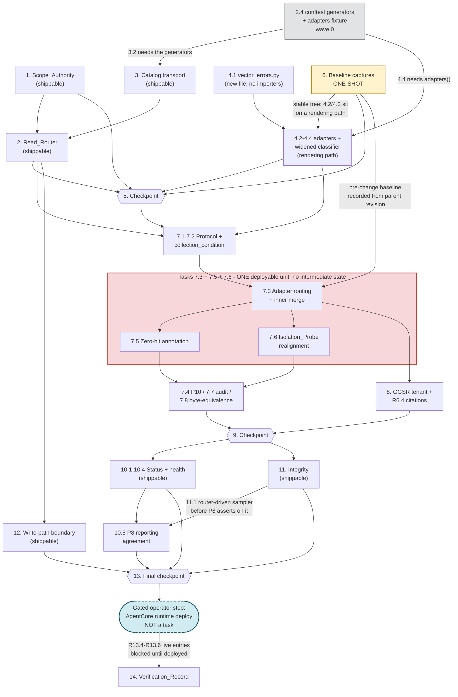

# Implementation Plan: shared-scope-query-routing

## Overview

Two new modules become the single authority for read-path collection routing —
`src/data/collection_scope.py` (Scope_Authority) and `src/data/read_router.py`
(Read_Router) — and all four defect manifestations are re-pointed at them: both
Vector_Adapters' `query()`, `semantic_search._filter_indices_by_tenant`,
`semantic_search._build_vector_sampler`, and
`UnifiedDataAccess._vector_health`. A third new module,
`src/data/vector_errors.py`, normalizes the missing-collection signal so
ChromaDB and OpenSearch classify absence identically.

The plan follows the design's "Migration and rollout" ordering, decomposed into
units that can each be completed and confirmed with a test run. Four
sequencing constraints are hard and are called out in the task text where they
bind. The first three come from the design's rollout section; the fourth was
found while preparing the first parallel execution round.

1. **Task 6 (baseline captures) must complete before Task 7.** The captures have
   to be recorded from the parent revision. Once the adapters route through the
   Read_Router there is no valid pre-change baseline and R6.5 becomes
   unverifiable.
2. **Task 6 must not run concurrently with Task 4.** Task 6 records rendered
   tool output; Task 4 modifies `_common.py` (widening `_is_missing_index_exc`,
   which decides whether a tool renders a Skip_Block or an error) and both
   adapters. Interleaving them can capture a baseline from a partially mutated
   tree, and because Task 6 is one-shot the corruption is unrecoverable and
   would first surface at 7.8 as an unattributable difference. All of Task 6
   precedes 4.2, 4.3, and 4.4. Task 4.1 creates a new file nothing imports yet
   and is harmless early.
3. **Task 2.4 precedes Tasks 3.2 and 4.4.** Both consume the `adapters()`
   fixture and generators that 2.4 creates in `tests/properties/conftest.py`.
4. **Task 7's sub-tasks 7.3, 7.5, and 7.6 land together.** Design steps 4, 5,
   and 8. Shipping 7.3 alone turns a passing `branch_isolation` assertion into a
   failing one for the correct reason, because assertion 4 currently treats
   develop-sourced content under `gw_v17` as an isolation violation. No
   intermediate state between 7.3 and 7.6 is shippable.
5. **The AgentCore runtime deploy is a gated operator step and is not a task
   here.** Task 14's live-invocation entries depend on it.

Tasks 1-4, 8, 10, 11, and 12 are each independently shippable and independently
valuable. Task 4 in particular is a fix in its own right: it makes a COTS
missing-collection read render a Skip_Block instead of `[ERROR]`, regardless of
the rest of this change.

Standing constraints for every task below:

- **Read path only.** No task may modify any file under
  `mcp_server_python/scripts/`. R12.2 freezes that directory byte-for-byte,
  which is why the capture harness (Task 6) and the digest manifest (Task 12)
  live under `tests/`.
- **Nothing creates, deletes, or writes a Physical_Collection** (R12.5),
  including an absent member of a Resolved_Collection_Set.
- **ASCII-only** console and diagnostic output. `pycodestyle` for Python,
  numpy-style docstrings, 2-space indent in shell.
- **Default `gw` byte-equivalence is the hard constraint.** Where a task could
  trade it for a cleaner internal shape, take preservation.

## Tasks

- [ ] 1. Scope_Authority — one component owns collection scope
  - Design step 1. Independently shippable; adds no runtime behaviour, only a
    fail-on-drift guard.

  - [ ] 1.1 Create `src/data/collection_scope.py` with the built-in tables and accessors
    - New file `mcp_server_python/src/data/collection_scope.py`.
    - Define `CollectionScope = Literal["shared", "tenant"]`, `SCOPE_SHARED`,
      `SCOPE_TENANT`, `_BUILTIN_SCOPES` (the five Logical_Collections:
      `global-workflow-docs-v8-0-0`, `ee2-standards-v5-0-0-enhanced`,
      `community-summaries` as `shared`; `code-with-context-v8-0-0`,
      `jjobs-v8-0-0` as `tenant`), and
      `_BUILTIN_HYBRID = frozenset({"global-workflow-docs-v8-0-0"})`.
    - Implement `scope_of`, `is_hybrid_domain`, `logical_collections`.
      `scope_of` returns `None` for an identifier that is not a
      Logical_Collection — the Read_Router owns the R1.5 fallback, not this
      module.
    - Assert the Hybrid_Domain invariant at **import time**: every member of
      `_BUILTIN_HYBRID` must classify `shared`. A future mistake fails the
      process at load, not at query time.
    - Import stdlib only. Nothing from this repository, so both the read path
      and (later) the write path can consume it without a cycle.
    - Unit tests in `mcp_server_python/tests/unit/test_collection_scope.py`:
      the five classifications; `scope_of` is deterministic across repeated
      calls; `logical_collections()` order is stable; `scope_of` returns `None`
      for an unknown identifier; the hybrid set is exactly
      `{global-workflow-docs-v8-0-0}`; a table violating the import-time
      invariant fails at import.
    - _Requirements: 1.1, 1.2, 1.8_

  - [ ] 1.2 Add the scope override Configuration_Transport chain
    - Modify `mcp_server_python/src/data/collection_scope.py`.
    - Precedence: `MCP_COLLECTION_SCOPE_JSON` (inline JSON content), then
      `MCP_COLLECTION_SCOPE_PATH` (path to a JSON file), then the built-in
      tables. Same precedence under both Form_Factors — one rule, no
      per-environment branching.
    - An override **replaces both tables wholesale** rather than merging, so the
      active classification is always readable from one document. Validate on
      load: `schema_version == 1`; every `scopes` value in `{shared, tenant}`;
      every `hybrid_domains` entry present in `scopes` and classified `shared`.
    - Any violation raises `ScopeConfigError`. This is the R5.6 hard-error path:
      resolve nothing, issue no read, never degrade to treating every collection
      as `tenant`.
    - Implement `active_scope_transport()` returning `"builtin"`, `"env"`, or
      `"file"`. Memoize the content read so the no-per-resolution-I/O guarantee
      holds.
    - Unit tests: corrupt inline JSON, corrupt override file, unreadable
      override path, and each schema violation raise `ScopeConfigError` naming
      the failing source and record zero adapter calls; inline content wins over
      a file path; `active_scope_transport()` reports each of the three layers.
    - _Requirements: 1.8, 5.6, 5.7_

  - [ ] 1.3 Implement `check_scope_consistency` and wire it in as a drift gate
    - Modify `mcp_server_python/src/data/collection_scope.py`; new test file
      `mcp_server_python/tests/unit/test_collection_scope_consistency.py`.
    - `check_scope_consistency(manifest_path=None)` returns one human-readable
      finding per discrepancy across four classes: (a) a Logical_Collection
      whose classification differs from its sources' declared `scope`; (b) a
      non-Hybrid_Domain `collection_target` whose enabled sources declare more
      than one distinct `scope`; (c) a source whose `scope` is absent or outside
      `{shared, tenant}`; (d) a `collection_target` with no table entry.
    - Read `src/config/unified_manifest.json` **directly with `json.load`**.
      Deliberately NOT through `src.manifest.loader.load_manifest`: that loader
      catches `JSONDecodeError`/`OSError`/`ValueError`, falls back to
      `documentation_sources.json`, and finally returns an empty registry — the
      exact silent degradation this check exists to catch. An unreadable
      manifest is itself a finding, never an exception.
    - Encode the hybridity derivation rule as this check's *expectation*: a
      `shared` collection is hybrid exactly when it has an enabled source whose
      `source_type` reads the repo tree (`on_disk_submodule` today, which is
      `global-workflow-rst` alone). If a second repo-local `shared` source
      appears, the check fails and points at the declaration.
    - Add `test_no_scope_drift` calling the check against the bundled manifest
      and asserting the finding list is empty, failing with every finding named.
      This runs as an ordinary pytest test, **not** a boot-time validation:
      failing server startup over a manifest classification the built-in table
      already answers correctly is the wrong trade-off for a read-mostly aid
      over a production forecasting system.
    - Tests: four synthetic-manifest cases, one per finding class, each
      asserting the finding names the identifier and the conflicting values; the
      check completes with a socket-raising guard installed (no network); the
      gate test's failure message names every injected finding.
    - _Requirements: 1.6, 1.7, 1.9_

  - [ ] 1.4 Assert the module's import boundary
    - New test in `mcp_server_python/tests/unit/test_collection_scope.py`.
    - Assert `src.data.collection_scope` imports no `read_router`, no
      Vector_Adapter, and no `src.tools` module. This is R12.6's condition for
      classifying the Scope_Authority as a shared module rather than a
      write-path modification.
    - Note in the test docstring that the write path is **not** re-pointed at
      this module in this change: R12.2 freezes `scripts/`, including
      `_ingest_common.py`, so adoption is a later step. The dotted edge in the
      design's dependency diagram is a future path.
    - _Requirements: 12.6_

- [ ] 2. Read_Router — one resolver for all four consumer paths
  - Design step 2. Independently shippable; nothing calls it yet.

  - [ ] 2.1 Define the routing data models
    - New file `mcp_server_python/src/data/read_router.py`.
    - `ResolvedTarget(physical, scope, prefixed)`, frozen with slots.
    - `ResolvedCollectionSet(logical, scope, hybrid, tenant_id, index_prefix,
      profile, targets, fallback_applied, unmapped_profile)` with a
      `physical_names` property. `targets` is an **ordered tuple**, not a Python
      `set`: R3.1 requires the unprefixed member first and R3.7's tie-break
      reads member position. Enforce distinctness by `physical` at construction.
    - `TenantCollectionSet(tenant_id, index_prefix, profile, targets,
      by_logical)`.
    - `CollectionCondition` as a `StrEnum` with `UNPROVISIONED`,
      `PROVISIONED_EMPTY`, `PROVISIONED_POPULATED`.
    - `RoutingDiagnostic(tenant_id, logical, profile, members, transport,
      classification)` with `render()` producing one line. Enforce R7.6 inside
      `render()`, not at call sites: explicit ASCII encode check, a
      1000-character cap with a truncation marker, and a field whitelist that
      structurally cannot carry query text or document content because neither
      is a field of the record.
    - Unit tests: `render()` output is ASCII-only and `<= 1000` chars for
      generated field values including non-ASCII input and a 10 KB collection
      name; output contains no query text and no document content; the models
      reject a duplicate `physical` at construction.
    - _Requirements: 3.5, 7.2, 7.6, 7.8_

  - [ ] 2.2 Implement `resolve_read_targets`
    - Modify `mcp_server_python/src/data/read_router.py`; new test file
      `mcp_server_python/tests/unit/test_read_router.py`.
    - Signature `resolve_read_targets(collection, tenant=None, *, profile=None)`.
      Take `Tenant` **explicitly**; do not read the tenancy `ContextVar`. Both
      adapters already accept `tenant=` and every tool already passes
      `_tenant()`, so the explicit form is the smaller change and keeps the
      router a pure function of its arguments, which the Hypothesis suite
      depends on.
    - **Resolve the physical name first, then prepend the prefix.** Call
      `resolve_index(collection, profile)` and prefix its result — never prefix
      the logical identifier. This preserves the `opensearch-tenant-resolution-fix`
      ordering rather than reintroducing the prefix-first bug.
    - Cardinality per the design's table: `shared` non-hybrid -> one unprefixed
      member for every tenant; `tenant` -> one prefixed member only when the
      prefix is non-empty; `shared` hybrid with a non-empty prefix -> two
      members, unprefixed first; empty prefix collapses every case to one member
      equal to `resolve_index(collection, profile)`.
    - R1.5 fallback: an identifier the Scope_Authority does not classify is
      treated as `tenant`, yields one prefixed member, sets
      `fallback_applied=True`, and emits a Routing_Diagnostic with
      `classification="tenant-fallback"`. It never raises and never returns an
      empty set. This path is reachable only once a table is in hand — a
      configuration load failure raises in `collection_scope` before the router
      is called, so a load failure structurally cannot reach the fallback.
    - R2.8 unmapped profile: `get_production_indices("nova1024")` returns `{}`
      and `resolve_index` passes the logical name through. Apply the same scope
      decision to the passthrough identifier, leave cardinality unchanged, and
      emit a diagnostic with `classification="unmapped-profile"`.
    - R7.5 post-condition: a `shared` set with no unprefixed member emits
      `classification="routing-misconfiguration"` naming the collection and
      tenant, and still returns the set so the read proceeds over its remaining
      members.
    - Emit **exactly one** Routing_Diagnostic per resolution, on the log channel
      only.
    - Pure: a frozen dict lookup, a frozenset membership test, a
      `PRODUCTION_INDICES_BY_PROFILE` lookup, a string concatenation, and an
      `os.environ` read for the profile default. No socket, no file handle, no
      collection-existence probe.
    - Unit tests: the R13.1 matrix — the four non-hybrid collections x
      `{gw, gw_v17}` x `{titan1024, mpnet768}`, asserting the set equals exactly
      `{resolve_index(c, p)}` where the scope is `shared` and exactly
      `{prefix + resolve_index(c, p)}` where the scope is `tenant`. Plus the
      R13.2 case: the Hybrid_Domain under `gw_v17` has exactly two members,
      exactly one prefixed and exactly one unprefixed. Plus the R1.5, R2.8, and
      R7.5 paths.
    - _Requirements: 1.3, 1.5, 2.1, 2.2, 2.3, 2.8, 3.1, 3.6, 5.1, 5.4, 5.5, 6.1, 6.7, 7.2, 7.5, 13.1, 13.2_

  - [ ] 2.3 Implement `tenant_collection_set`
    - Modify `mcp_server_python/src/data/read_router.py`.
    - Union of `resolve_read_targets` over every Logical_Collection, de-duplicated
      by physical name and ordered by `logical_collections()` then by within-set
      position, so repeated invocations enumerate identically.
    - This is the single answer to "which physical collections belong to tenant
      T", consumed by the Status_Reporter, Integrity_Checker, and
      Health_Reporter so all three agree with the query path.
    - Unit tests: under `gw_v17` / `titan1024` the set holds **six** members for
      five logical collections (the Hybrid_Domain contributes two); under `gw` it
      holds five; `by_logical` maps each logical collection to its physical
      names; ordering is stable across invocations.
    - _Requirements: 1.4, 9.1, 10.1, 11.1_

  - [ ] 2.4 Create the shared property generators and the cross-adapter fixture
    - New file `mcp_server_python/tests/properties/conftest.py`.
    - **Runs in wave 0, ahead of Task 1**, even though it is numbered under Task
      2. It is test infrastructure with no production dependency —
      `PRODUCTION_INDICES_BY_PROFILE`, `src/config/tenants.yaml`, and both
      adapter classes already exist, and the fixture does not reference the
      Read_Router. Tasks 3.2 and 4.4 both consume what it defines, so it is
      pulled forward to unblock them.
    - `logical_collections()` — the five keys of `PRODUCTION_INDICES_BY_PROFILE`.
    - `tenants()` — every tenant in `src/config/tenants.yaml` (`gw`, `gw_sfs`,
      `gw_jedi_gfs`, `gw_v17`, `gw_gefs_v12`).
    - `prefixed_tenants()` — the subset with a non-empty `index_prefix`.
    - `profiles()` — `titan1024`, `mpnet768`, plus `nova1024` where R5.4 applies.
    - `adapters()` — `@pytest.fixture(params=["chromadb", "opensearch"])`
      yielding a `ChromaDBAdapter` or an `OpenSearchAdapter` over a stubbed
      client, each constructed with an explicit `embedding_function` so no
      Bedrock or sentence-transformers dependency is required, and with a client
      double that serves recorded responses and records every call.
    - _Requirements: 4.5, 13.7_

  - [ ]* 2.5 Add the fixture meta-test guarding the backend sweep
    - New file `mcp_server_python/tests/properties/test_scope_fixture_meta.py`,
      kept separate so it does not collide with the property modules.
    - Assert both `chromadb` and `opensearch` parameter ids appear in the
      collected node ids for the tests that take `adapters()`, so a future change
      cannot quietly drop one backend from the sweep.
    - Defense-in-depth beyond R4.5, which the fixture itself satisfies.
    - _Requirements: 4.5_

  - [ ] 2.6 Write property tests P1 and P2
    - New file `mcp_server_python/tests/properties/test_scope_routing.py`.
    - Each test marked `@pytest.mark.property`, `max_examples` at 100 or above
      (200 for P1), `deadline=None`, and tagged with the comment
      `# Feature: shared-scope-query-routing, Property N: <name>`.
    - **P1 — Prefix applies exactly when scope is tenant.** For any non-hybrid
      `c`, any tenant `T`, any profile `p`, every member of
      `resolve_read_targets(c, T, profile=p)` carries `T.index_prefix` iff
      `scope_of(c) == "tenant"`. For the Hybrid_Domain under a non-empty prefix,
      exactly two members, unprefixed first. Generators:
      `logical_collections`, `tenants`, `profiles`.
    - **P2 — Default-tenant identity.** For any `c` and `p`,
      `resolve_read_targets(c, T_default, profile=p).physical_names ==
      (resolve_index(c, p),)`, including for the Hybrid_Domain where the empty
      prefix collapses the pair.
    - _Requirements: 1.1, 1.2, 1.8, 2.2, 2.3, 3.1, 6.1, 6.7, 13.7_

  - [ ] 2.7 Write property tests P5, P6, P3 (router half), and P9
    - Modify `mcp_server_python/tests/properties/test_scope_routing.py`.
    - **P5 — Cross-tenant disjointness of tenant scope.** For any pair of
      tenants with distinct non-empty prefixes and any `tenant`-scoped `c`, the
      two resolved sets are disjoint; and no physical name in one tenant's
      `tenant_collection_set` carries another tenant's prefix. Generator:
      `prefixed_tenants` pairs.
    - **P6 — Universal reachability of shared scope.** For any tenant, any
      profile, and any `shared` collection, `resolve_index(c, p)` is a member of
      the resolved set, and membership does not vary with provisioning state.
    - **P3 — Backend invariance (router half).** For any `(c, T, p)`, the
      resolved physical names under `DB_BACKEND=aws` equal those under
      `DB_BACKEND=cots`, compared as case-sensitive exact strings without regard
      to ordering. Established structurally by the router taking no backend
      argument and reading no backend environment variable.
    - **P9 — Router purity.** Repeated invocations return equal sets and no
      invocation issues a network request, a collection-existence probe, or a
      filesystem read. Assert this **structurally** by exercising the router with
      socket and filesystem access replaced by raising doubles, not by
      inspection.
    - _Requirements: 2.3, 2.9, 3.6, 4.1, 4.2, 5.1, 5.5, 8.1, 8.2, 8.3, 9.4, 11.2, 11.3, 13.7_

- [ ] 3. Content-carrying tenant catalog transport
  - The design records that this transport does not exist today:
    `runtime.get_catalog()` reads `MCP_TENANT_CATALOG_PATH`, which names a
    *path*. R5.3 and R5.7 presuppose an environment variable whose *content* is
    byte-identical to a mounted file. This task adds it.

  - [ ] 3.1 Add `load_catalog_from_transport` and switch the runtime accessor
    - Modify `mcp_server_python/src/config/tenants.py` and
      `mcp_server_python/src/tenancy/runtime.py`.
    - Precedence: `MCP_TENANT_CATALOG_YAML` (inline YAML content), then
      `MCP_TENANT_CATALOG_PATH` (path), then the bundled
      `src/config/tenants.yaml`. Same rule under both Form_Factors.
    - **`load_catalog(path)` keeps its signature and behaviour untouched.** The
      ingestion scripts and `src/tools/smoke_queries.py` import it, and R12.2
      freezes `scripts/`. Only `runtime.get_catalog()` switches to the new
      function.
    - Both transports parse through the same parser, so byte-identical content
      yields an equal `TenantCatalog`, an equal `index_prefix`, and an equal
      Resolved_Collection_Set. Memoize the content read.
    - A catalog source that cannot be read or parsed is the R5.6 hard-error path:
      raise, name the failing source, resolve nothing, issue no read.
    - New unit tests in
      `mcp_server_python/tests/unit/test_tenant_catalog_transport.py`: inline
      content beats a file path; byte-identical content through either transport
      yields equal catalogs; corrupt catalog YAML raises naming the source and
      records zero adapter calls; `load_catalog(path)` behaviour is unchanged.
    - _Requirements: 5.3, 5.6, 5.7, 12.2_

  - [ ] 3.2 Write property test P4
    - New file `mcp_server_python/tests/properties/test_scope_transport.py`.
    - **P4 — Form-factor and transport invariance.** For any `(c, T, p)` and any
      pair of Configuration_Transports carrying byte-identical content — inline
      environment content versus a mounted file — `resolve_read_targets` returns
      equal sets; likewise equal across simulated `agentcore` and `container`
      environments. Generators: `logical_collections`, generated catalog YAML
      content, transport in `{env, file}`, form factor in
      `{agentcore, container}`.
    - Marked `@pytest.mark.property`, `max_examples >= 100`, tagged
      `# Feature: shared-scope-query-routing, Property 4: Form-factor and transport invariance`.
    - _Requirements: 5.2, 5.3, 5.7, 13.7_

- [ ] 4. Cross-backend missing-collection normalization
  - Design step 3. Independently shippable and valuable on its own: it makes a
    COTS missing-collection read render a Skip_Block instead of `[ERROR]`.
  - **Sub-tasks 4.2, 4.3, and 4.4 must not begin until Task 6 has recorded its
    baselines.** They modify `_common.py` and both adapters;
    `_is_missing_index_exc` decides whether a tool renders a Skip_Block or an
    error, so it sits on a rendering path. Running them while Task 6 captures
    pre-change output yields a baseline from a partially mutated tree, and Task
    6 is one-shot. 4.1 only creates a new file that nothing imports yet and may
    run in wave 0.

  - [ ] 4.1 Create `src/data/vector_errors.py`
    - New file `mcp_server_python/src/data/vector_errors.py`.
    - `VectorReadError(RuntimeError)` as the base; `CollectionNotProvisionedError(
      physical, *, logical=None, tenant_id=None)` carrying the physical name and
      the logical collection it resolved from, so the tool layer can render a
      Skip_Block without re-deriving either.
    - Raised by **both** adapters, so downstream classification is independent of
      the client library's exception taxonomy.
    - _Requirements: 4.3_

  - [ ] 4.2 Classify ChromaDB collection absence before the existing wrap
    - Modify `mcp_server_python/src/data/chromadb_adapter.py`.
    - Today `query` catches everything and re-raises
      `ValueError(f"ChromaDB query failed on index={index!r}: {exc}")`, which
      erases the distinction and is why `_is_missing_index_exc` never matches on
      COTS. Classify **before** that wrap.
    - Detection: guarded import of `chromadb.errors.NotFoundError` /
      `InvalidCollectionException` when importable, plus a case-insensitive
      `"does not exist"` / `"collection not found"` substring fallback. The
      concrete class varies across releases and the pin is `chromadb==1.3.4`
      (`pyproject.toml`, `cots` extra), so both forms are needed — mirroring the
      two-form approach `_is_missing_index_exc` already uses for `opensearchpy`.
    - On a match raise `CollectionNotProvisionedError`; otherwise fall through to
      the existing `ValueError` wrap **with its current message unchanged**, so
      connection, authentication, and embedding-generation failures keep their
      present shape.
    - Unit tests in
      `mcp_server_python/tests/unit/test_vector_errors_normalization.py`: each
      detection form raises the normalized error; a connection failure, an
      authentication failure, and an embedding-generation failure each surface as
      a query failure with the existing message and are never presented as
      unprovisioned.
    - _Requirements: 4.3, 4.6_

  - [ ] 4.3 Normalize the OpenSearch signal and widen the shared classifier
    - Modify `mcp_server_python/src/data/opensearch_adapter.py` and
      `mcp_server_python/src/tools/_common.py`.
    - Reuse the existing `index_not_found_exception` detection verbatim
      (`opensearchpy.NotFoundError` with
      `info["error"]["type"] == "index_not_found_exception"`, or the literal
      token in `str(exc)`) so no behaviour shifts for the paths that call it
      today, and raise `CollectionNotProvisionedError` from the adapter.
    - **Widen** `_is_missing_index_exc` to
      `isinstance(exc, CollectionNotProvisionedError) or <existing checks>`.
      Widen rather than replace: the four existing call sites
      (`semantic_search._tool_search_documentation`,
      `graph_rag._tool_search_architecture`,
      `graph_rag._tool_find_similar_code`,
      `operational._tool_get_operational_guidance`) must keep working unchanged
      for R6.2.
    - Extend `mcp_server_python/tests/unit/test_tool_common_helpers.py` with the
      new accepted type, leaving the existing detection-matrix assertions intact.
    - _Requirements: 4.3, 4.6, 6.2_

  - [ ] 4.4 Add the cross-backend Skip_Block identity test
    - New tests using the `adapters()` fixture from Task 2.4. **2.4 is a
      prerequisite** and runs in wave 0; do not duplicate the fixture locally if
      it is missing, stop and report instead.
    - Also requires Task 6 complete, per the Task 4 parent note.
    - `_missing_index_skip` in `src/tools/_common.py` is already the single
      renderer and its text is already backend-independent — it interpolates only
      `tool`, `collection`, and `tenant_id`. **Do not change its text.** Assert
      character-for-character identity across backends for the same
      `(tool, Logical_Collection, tenant_id)` triple.
    - Assert that when every member of a Resolved_Collection_Set is absent the
      adapter raises **once for the whole set** and the tool renders **exactly
      one** Skip_Block naming the *logical* collection and the `tenant_id` —
      never the physical names, which would leak routing detail R7.6 confines to
      the log channel.
    - _Requirements: 4.4, 4.7_

- [ ] 5. Checkpoint - foundations complete
  - Ensure all tests pass, ask the user if questions arise.
  - At this point the Scope_Authority, the Read_Router, the transports, and the
    error normalization all exist and are tested, and no query behaviour has
    changed. Confirm `pycodestyle` is clean on the four new modules.

- [ ] 6. Baseline captures for default-tenant byte-equivalence
  - **This task must also not run concurrently with Task 4.** Task 4.2/4.3
    modify `_common.py` and both adapters, all on a rendering path. Because this
    task is one-shot, a baseline captured mid-mutation is unrecoverable and the
    damage surfaces only at 7.8. Task 6 occupies waves 0-2; 4.2 starts at wave 3.
  - **This task must complete before Task 7.** R6.5 requires comparison against a
    capture recorded from the revision immediately preceding the routing change.
    Once the adapters route through the Read_Router there is no valid pre-change
    baseline and default-tenant byte-equivalence becomes unverifiable.

  - [ ] 6.1 Build the capture harness and recorded backend responses
    - New files under `mcp_server_python/tests/baselines/`: `capture.py`,
      `recorded_backend/*.json`, `README.md`.
    - `capture.py` lives under `tests/` and **not** under
      `mcp_server_python/scripts/`: R12.2 freezes that directory, so a capture
      harness placed there would itself violate the requirement it exists to
      verify.
    - Each scenario replays a recorded adapter response through a stub adapter
      rather than hitting a live backend, so store content is frozen by
      construction and the comparison isolates rendering from data drift. The
      same recorded responses must feed the pre-change and post-change runs.
    - Freeze per scenario: tool name, query text, `max_results`, every other tool
      argument, `DB_BACKEND`, `MCP_EMBEDDING_PROFILE`, and no `tenant_id`.
    - Cover at least one tool from each of `src/tools/semantic_search.py`,
      `src/tools/ee2_compliance.py`, `src/tools/graph_rag.py`, and
      `src/tools/operational.py`.
    - Reuse `tests/parity/parity_runner.py::_strip_tenant_header` for
      attribution-header handling so treatment stays consistent with the tenancy
      parity suite.
    - `README.md` records the regeneration procedure and the frozen input set.
    - _Requirements: 6.5, 13.3_

  - [ ] 6.2 Record pre-change output and derive the volatility masks
    - New files under `mcp_server_python/tests/baselines/pre_change/*.md`.
    - Run the harness against the **parent revision** for every scenario.
    - Run it **twice** over the same inputs and diff the two outputs. Record each
      differing span as a volatility mask; generated timestamps in the integrity
      report are the known instance.
    - A mask must be **earned by a demonstrated pre-change difference**. Do not
      allow a hand-added mask — the mechanism must not be usable to paper over a
      real regression. Enforce that with a check that every mask traces to a
      recorded diff.
    - _Requirements: 6.5_

  - [ ] 6.3 Write the byte-equivalence regression tests
    - New file
      `mcp_server_python/tests/unit/test_default_tenant_byte_equivalence.py`.
    - For each scenario, compare post-change rendered output against the masked
      pre-change baseline, applying only the masks derived in 6.2.
    - Include the Status_Reporter, Integrity_Checker, and Health_Reporter
      no-`tenant_id` responses (R6.3), which must list the same
      Physical_Collections with the same document counts as before this change,
      in preference to the scope-labelling and totalling behaviour Requirements
      9, 10, and 11 introduce for a prefixed tenant.
    - Before Task 7 lands these pass trivially. That is intended: they become the
      guard on Task 7.
    - _Requirements: 6.2, 6.3, 6.5, 13.3_

- [ ] 7. Adapter routing, zero-hit annotation, and probe realignment
  - **Design steps 4, 5, and 8 — one atomic unit.** Sub-tasks 7.3, 7.5, and 7.6
    land together in a single deployable commit. Assertion 4 of the current
    `branch_isolation` probe treats develop-sourced content under `gw_v17` as an
    isolation violation, so shipping 7.3 without 7.6 turns a passing probe into a
    failing one for the correct reason — worse than either end state. Do not stop
    between them.
  - Requires Task 6 complete.

  - [ ] 7.1 Widen `VectorDBProtocol` and update the mock
    - Modify `mcp_server_python/src/data/protocols.py` and
      `mcp_server_python/tests/conftest.py`.
    - Add `tenant: Any = None` to `query` — documenting existing reality, since
      both adapters already accept it and every tool already passes it, a latent
      drift this closes rather than creates.
    - Document the `physical_collection` key on results and add it to
      `VECTOR_RESULT_KEYS`.
    - Declare the new `collection_condition(physical_collection) ->
      CollectionCondition` member. `multi_collection_query`, `sample_metadata`,
      `count_documents`, and `health_check` are **unchanged**.
    - Update `MockVectorDB` in `tests/conftest.py` with the new method and key.
      It is a test double, not production code, and is not covered by R12.2.
    - Extend `tests/unit/test_conftest_mocks.py` for the widened key set.
    - _Requirements: 3.5, 7.8_

  - [ ] 7.2 Implement `collection_condition` on both adapters
    - Modify `mcp_server_python/src/data/chromadb_adapter.py` and
      `mcp_server_python/src/data/opensearch_adapter.py`.
    - Three-way classification, taking the free answers first: `UNPROVISIONED`
      comes from the normalized exception at zero cost; `PROVISIONED_POPULATED`
      is implied at zero cost whenever a member returned at least one hit.
    - **Probe only the ambiguous case** — a member that returned zero hits and
      did not raise. That is the sole state where `provisioned-empty` and
      `provisioned-populated` are indistinguishable from the read alone. Back it
      with the existing non-raising `count_documents`.
    - TTL cache keyed by physical name, default 300 s via
      `MCP_COLLECTION_CONDITION_TTL_S`. **Never cache `UNPROVISIONED`** — a
      collection can be provisioned at any time and a stale absence is the more
      damaging error.
    - Kill switch `MCP_COLLECTION_CONDITION_PROBE=0`: treat any non-raising
      member as `PROVISIONED_POPULATED`, degrade the R7.7 annotation to naming
      only unprovisioned members, and record on the log channel that the probe is
      off. Default enabled.
    - Never raises. Never creates, deletes, or writes a collection.
    - Cost to accept and not hide: R6.8 requires the Collection_Condition to be
      logged even for the Default_Tenant, so the probe fires for `gw` too on
      zero-hit reads. Response bytes are unchanged because a log line is not
      rendered output; backend call volume on the `gw` zero-hit path rises by at
      most one O(1) metadata `count` per collection per TTL window.
    - Unit tests via the `adapters()` fixture: each of the three
      classifications; a populated collection returning zero hits classifies
      `PROVISIONED_POPULATED`; `UNPROVISIONED` is not cached; the kill switch
      path; no mutating call is made.
    - _Requirements: 6.8, 7.3, 7.4, 7.8, 12.5_

  - [ ] 7.3 Route both adapters through the Read_Router and implement the inner merge
    - Modify `mcp_server_python/src/data/chromadb_adapter.py` and
      `mcp_server_python/src/data/opensearch_adapter.py`.
    - Replace the unconditional `resolve_tenant_index(...)` call in `query` with
      `resolve_read_targets(...)`. The Read_Router becomes the **only** component
      that applies an `index_prefix` on the read path, so substituting its
      behaviour changes what both adapters address identically.
    - Implement the inner fan-out and merge exactly as the design's seven numbered
      steps:
      1. Fan out one read per member with **identical** `query_text`, `k`,
         `similarity_threshold`, and `where`, concurrently via
         `asyncio.gather(..., return_exceptions=True)`. Ask each member for `k`,
         not `k/n` — a member may legitimately supply all `k` survivors.
      2. Classify and triage: a `CollectionNotProvisionedError` marks that member
         `UNPROVISIONED` and contributes zero hits; any other failure propagates
         as a query failure; only when **every** member is absent does the
         adapter raise, once for the whole set.
      3. Attach provenance: stamp `physical_collection = m_i.physical` on every
         hit. Exactly one name per hit, always a member of the addressed set.
      4. Order by the total-order key `(-score, member_index, str(hit["id"]))`.
         The key is total because `(member_index, id)` is unique within one read.
      5. De-duplicate on a SHA-256 digest of normalized content (`content`, else
         `document`, else `text`, else `""`; `strip()`; collapse internal
         whitespace runs to one space; UTF-8). Keep the first in the step-4
         order and keep its own `physical_collection`, so a document present in
         both members is retained as the shared copy and attributed to the shared
         collection.
      6. Cap at the first `k`, or all survivors if fewer.
      7. Emit one `RoutingDiagnostic` for the resolution plus per-member
         condition records for any `UNPROVISIONED` or `PROVISIONED_EMPTY` member.
    - Add `physical_collection` as a **new** key. **Do not repurpose
      `collection`**: `semantic_search._format_search_hit` renders it
      (`source_line += f" | **Collection:** {collection_name}"`), so changing it
      would move `gw` output bytes and violate R6.2.
    - Leave `multi_collection_query` unchanged in signature and in its
      cross-collection merge, including its `content[:200]` fingerprint and its
      cap. Because each per-logical-collection `query` now performs the intra-set
      fan-out internally, the outer loop sees exactly what it saw before. The two
      de-duplication rules coexist on purpose; tightening the outer one would
      change which hits survive for `gw`.
    - Under the Default_Tenant every set has exactly one member, so the inner
      merge is the identity **by construction** — no `if tenant is default`
      branch in the merge path to get wrong.
    - Where the merged ordering could be made more score-accurate by normalizing
      or RRF-fusing across members, **take preservation instead**. That would
      have to apply to the outer merge to be coherent, which moves `gw` ordering.
      Record it as follow-up, not as work here.
    - Unit tests via `adapters()`: two members produce two reads with identical
      arguments; a partially absent set returns the present member's hits with no
      Skip_Block; a fully absent set raises once; provenance is attached from the
      producing member; the P3 substitutability half — patching the router changes
      what both adapters address identically.
    - _Requirements: 2.4, 2.6, 2.7, 2.9, 3.2, 3.3, 3.4, 3.5, 3.7, 3.8, 3.9, 4.1, 4.2, 4.8, 6.1, 6.7, 7.1, 7.9_

  - [ ] 7.4 Write property test P10
    - New file `mcp_server_python/tests/properties/test_scope_merge.py`.
    - **P10 — Result cap, provenance, and total ordering.** For any
      Resolved_Collection_Set and any `k` in `[1, 1000]`: a multi-member read
      returns at most `k` hits; every hit carries exactly one
      `physical_collection` drawn from the addressed set; the returned score
      sequence is non-increasing; the ordering key
      `(-score, member_index, hit_id)` is injective over the returned hits; and
      no two returned hits share a normalized content digest.
    - **Forced score collisions must be a first-class generation strategy, not an
      incidental case.** OpenSearch's `[0.0, 1.0]` clamp on a `bool.should` of
      BM25 plus k-NN means raw BM25 scores above 1.0 all land on exactly `1.0`,
      so ties are common in production rather than rare. A generator producing
      only distinct scores would exercise the tie-break almost never and would
      pass while the total-order guarantee was broken. Draw scores from a small
      discrete set including `1.0` with elevated weight, alongside a continuous
      range.
    - Also generate duplicate content and duplicate ids, and member counts in
      `{1, 2}`. Run against both adapters through the `adapters()` fixture.
    - Marked `@pytest.mark.property`, `max_examples >= 100`, tagged
      `# Feature: shared-scope-query-routing, Property 10: Result cap, provenance, and total ordering`.
    - _Requirements: 3.4, 3.5, 3.7, 3.8, 13.7_

  - [ ] 7.5 Add the zero-hit annotation, gated on a non-empty prefix
    - Modify the zero-hit renderers in
      `mcp_server_python/src/tools/semantic_search.py`,
      `mcp_server_python/src/tools/ee2_compliance.py`,
      `mcp_server_python/src/tools/graph_rag.py`, and
      `mcp_server_python/src/tools/operational.py`.
    - When a read returns zero hits under a tenant whose `index_prefix` is
      non-empty and at least one addressed member is `unprovisioned` or
      `provisioned-empty`, name each such Physical_Collection and its
      Collection_Scope in the response body, indicate that the zero-hit result
      reflects an unreachable or empty collection rather than an absence of
      matching content, and leave the remainder of the body unchanged from the
      all-populated zero-hit response.
    - **Gate on `tenant.index_prefix` being non-empty.** Under `gw` the condition
      is recorded on the log channel and nowhere else, so the rendered zero-hit
      body stays byte-equivalent.
    - Confine every `RoutingDiagnostic` to `log.info`, including the R1.5
      fallback diagnostic. Add a unit test asserting the diagnostic string never
      appears in any rendered tool output on any path.
    - _Requirements: 6.6, 6.8, 7.7_

  - [ ] 7.6 Realign the Isolation_Probe
    - Modify `mcp_server_python/src/tools/smoke_queries.py::_smoke_branch_isolation`.
    - Replace assertion 4's origin test. It currently classifies leakage with
      `"/develop/" in (h.get("metadata", {}).get("source") or "")` — a
      source-path substring match R8.4 forbids. Derive origin from the
      `physical_collection` name attached in 7.3: a hit originates from a tenant
      when that name carries that tenant's non-empty `index_prefix`, and is
      shared when it carries no tenant's non-empty prefix.
    - Restate the invariant the probe encodes: a hit whose attached name carries
      one tenant's non-empty prefix is absent from results returned to any other
      tenant; a hit whose attached name carries no tenant's non-empty prefix is
      present in results returned to **every** tenant, prefixed tenants included.
    - Add the R8.3 assertion: `ee2-standards-v5-0-0-enhanced` with `k=10` under
      `gw_v17` returns at least one hit whose attached name carries no tenant's
      non-empty prefix.
    - Add the R8.6 assertion: `global-workflow-docs-v8-0-0` with `k=10` under
      `gw_v17` returns at least one hit carrying the `gw_v17` prefix **and** at
      least one carrying no tenant prefix.
    - Add the R8.2 assertion in its restated form for both `gw_v17` and the
      Default_Tenant.
    - Failure modes: a hit with no attached name fails its assertion naming the
      collection and tenant (R8.7); an unprovisioned member, a
      provisioned-and-empty member, or a query error each fails naming the
      collection, its scope, and which of the three conditions was observed,
      keeping unprovisioned distinct from provisioned-empty (R8.8).
    - **Leave the two graph-side assertions alone.** Their query text and label
      scoping must stay byte-identical and produce the same pass/fail outcome for
      any given data state. Add a unit test comparing the two query strings to
      their pre-change form.
    - Unit tests feeding fixtures whose metadata deliberately contradicts the
      attached `physical_collection`: classification must follow the name.
    - _Requirements: 8.1, 8.2, 8.3, 8.4, 8.5, 8.6, 8.7, 8.8_

  - [ ] 7.7 Audit the query call sites against the logical-collection contract
    - New test asserting every shared-scope-reachable adapter call expression
      across `src/tools/semantic_search.py` (including both
      `_tool_search_documentation` branches — the explicit-collection `query()`
      and the `multi_collection_query()` fan-out),
      `src/tools/ee2_compliance.py` (the three `EE2_COLLECTION` sites),
      `src/tools/graph_rag.py` (`_tool_search_architecture`,
      `_render_community_section` feeding `get_code_context`, and
      `_fetch_community_context` feeding `get_change_impact` — note the
      requirements attribute both community sites to `get_code_context`; the
      second actually feeds `get_change_impact`, and both realign identically),
      and `src/tools/operational.py` passes an identifier that is a key of the
      active profile's entry in `PRODUCTION_INDICES_BY_PROFILE`, never a physical
      name.
    - Assert the tenant-scoped tools `find_similar_code`, `get_job_details`, and
      `list_job_scripts` return only prefixed-member hits under a prefixed
      tenant — they are correct today and must stay correct.
    - _Requirements: 2.5, 2.9_

  - [ ] 7.8 Confirm default-tenant byte-equivalence against the Task 6 baselines
    - Run `mcp_server_python/tests/unit/test_default_tenant_byte_equivalence.py`
      and resolve any difference in favour of preservation.
    - Any span that differs and is not covered by a mask earned in 6.2 is a
      regression, not a mask candidate.
    - _Requirements: 6.2, 6.3, 6.5_

- [ ] 8. Remaining read-path corrections
  - Both independently shippable.

  - [ ] 8.1 Forward `tenant=` through GraphGuidedRetrieval
    - Modify
      `mcp_server_python/src/graphrag/graph_guided_retrieval.py::_safe_semantic_enrich`
      to accept and forward `tenant=` to `self._vector_db.query(...)`.
    - Without it, GGSR-enriched reads resolve unprefixed regardless of the active
      tenant, bypassing tenancy entirely.
    - `DEFAULT_SEMANTIC_COLLECTION = "mdc-code-context-mpnet768"` is a *physical*
      name that bypasses profile resolution. The layering violation is latent,
      not live, because `graph_rag.get_code_context` passes
      `default_collection=CODE_COLLECTION` and `collection=CODE_COLLECTION`.
      **Leave the constant's profile pinning alone — it is out of scope.** Verify
      only that if that physical name does reach the Read_Router it takes the
      R1.5 `tenant` fallback cleanly rather than raising.
    - Unit tests: the tenant reaches the adapter; the fallback path for the
      physical-name default.
    - _Requirements: 1.5, 2.5_

  - [ ] 8.2 Correct the preservation-invariant citations
    - Modify `mcp_server_python/src/tools/semantic_search.py` (the comment at the
      `_is_missing_index_exc` branch reading `(Property 4 / R3.5)` and the
      tenant-prefix comment reading `(Property 4)`) and
      `mcp_server_python/src/data/opensearch_adapter.py`
      (`resolve_tenant_index`'s docstring, which cites `(R3.3)`).
    - All three must cite **Property 3 (Empty-prefix passthrough)** of
      `.kiro/specs/omd-tenants-1-foundation/design.md`. Property 4 is Resolution
      determinism; the mis-citation has already propagated and must not remain.
    - Add a unit test asserting neither file cites Property 4 as the
      default-preservation invariant.
    - _Requirements: 6.4_

- [ ] 9. Checkpoint - the fix is in place
  - Ensure all tests pass, ask the user if questions arise.
  - Shared content is now reachable for non-default tenants, the probe asserts
    that rather than forbidding it, and `gw` output is byte-equivalent. The
    reporting paths still under-report; Tasks 10 and 11 close them.

- [ ] 10. Status and health reporting through the Read_Router
  - Design step 6. Independently shippable.

  - [ ] 10.1 Rebuild `_render_vector_status_block` on the router
    - Modify
      `mcp_server_python/src/tools/semantic_search.py::_render_vector_status_block`.
    - Take collection **names** from `tenant_collection_set(...)` and use
      `health_check` only as a **count source** for those names, never as the
      name source. This is what structurally prevents a bookkeeping index like
      `mdc-content-sha-registry` from entering a prefixed tenant's listing.
    - Label each listed collection with the single Collection_Scope the
      Scope_Authority reports for the logical collection it resolved from,
      labelling both Hybrid_Domain members with that same value.
    - Compute the reported total as the arithmetic sum over the listed
      collections, counting an unprovisioned collection as zero, rather than from
      a backend aggregate spanning collections outside the listed set.
    - Render a present-but-empty collection as a count of zero, and an absent
      collection as unprovisioned, **distinguishably**. One or more absent
      collections must not turn the report into an error result.
    - Omit every collection carrying another tenant's declared prefix.
    - The `gw` block stays byte-equivalent per R6.3, which is why the
      scope-labelling and re-totalling apply only where `index_prefix` is
      non-empty. This deliberately leaves the pre-existing
      `mdc-content-sha-registry` over-count in the `gw` total; a follow-up spec
      converges the two paths.
    - _Requirements: 6.3, 9.1, 9.2, 9.3, 9.4, 9.5, 9.6, 9.7, 9.8_

  - [ ] 10.2 Delete `_filter_indices_by_tenant` and update its callers and tests
    - Modify `mcp_server_python/src/tools/semantic_search.py`; remove
      `_filter_indices_by_tenant` and `_index_in_tenant_scope`.
    - Its `_index_in_tenant_scope` prefix test is precisely what excluded shared
      collections from the non-default view: a name-shape test cannot distinguish
      a shared collection from another tenant's, so it cannot express "the
      unprefixed shared collection belongs to `gw_v17` too".
    - Update the tests that import them:
      `mcp_server_python/tests/unit/test_kb_status_and_sampler.py` and
      `mcp_server_python/tests/unit/test_semantic_search_tools.py`. Re-express
      their intent against `tenant_collection_set` rather than deleting the
      coverage — the ChromaDB-shaped-payload and empty-tenant-is-healthy cases
      must still be asserted.
    - _Requirements: 1.4, 9.1, 9.4_

  - [ ] 10.3 Scope `UnifiedDataAccess._vector_health`'s index count
    - Modify `mcp_server_python/src/data/unified_data_access.py` and, where it
      renders the value, `mcp_server_python/src/tools/utility.py`.
    - This is the fourth defect manifestation the requirements do not name:
      `_vector_health` computes
      `indexCount = len(raw.get("indices") or raw.get("collections") or [])` with
      no tenant scoping, then gates overall health on
      `index_count >= min_indices`, and `mcp_health_check` renders that count
      verbatim. R11.1 names the Health_Reporter as the consumer; the change lands
      one layer below the tool.
    - `indexCount` becomes the cardinality of `tenant_collection_set(...)`.
      Include the unprefixed member of every `shared` collection for a prefixed
      tenant. Omit every collection carrying another tenant's prefix. Name each
      enumerated collection with its Collection_Scope, read off
      `ResolvedTarget.scope` rather than re-derived.
    - Report the vector component **degraded only where the absent collection is
      the unprefixed member of a `shared` logical collection**. A tenant that
      simply has not ingested its own code is not unhealthy — this preserves the
      existing `rag-data-plane-gap-closure` R6.2 behaviour that a fresh tenant is
      healthy.
    - _Requirements: 11.1, 11.2, 11.3, 11.5, 11.6_

  - [ ] 10.4 Report the Isolation_Probe result as pass, skip, or fail
    - Modify the health path in `mcp_server_python/src/tools/utility.py` /
      `mcp_server_python/src/data/unified_data_access.py` as the probe wiring
      requires.
    - With `functional=True` and a data state satisfying the realigned
      assertions, report the probe as passing.
    - When the probe cannot execute, report `skipped` — distinct from passing and
      from failing — with an indication of the blocking condition. Unit test with
      a raised `SkipProbe`.
    - _Requirements: 11.4, 11.7_

  - [ ] 10.5 Write property test P8
    - New file `mcp_server_python/tests/properties/test_scope_reporting.py`.
    - **P8 — Reporting agreement.** For any tenant and any profile, the set the
      Status_Reporter lists, the set the Integrity_Checker samples, and the set
      the Health_Reporter enumerates are each equal to
      `tenant_collection_set(T, profile=p)`.
    - The generator must **inject arbitrary non-member names into the stubbed
      enumeration**, including foreign-prefixed names and bookkeeping indices
      such as `mdc-content-sha-registry`, and assert none appears in any of the
      three outputs. Run against both adapters through `adapters()`.
    - Marked `@pytest.mark.property`, `max_examples >= 100`, tagged
      `# Feature: shared-scope-query-routing, Property 8: Reporting agreement`.
    - The Integrity_Checker half of this property depends on Task 11. **11.1 is
      a scheduling prerequisite**, not just a caveat: 10.5 runs in wave 15,
      after 11.1 (wave 13) and 11.2 (wave 14), so the property can assert
      against the router-driven sampler rather than deferring part of itself.
    - _Requirements: 1.4, 9.1, 9.7, 10.1, 11.1, 13.7_

- [ ] 11. Integrity checking through the Read_Router
  - Design step 7. Independently shippable.

  - [ ] 11.1 Replace `_build_vector_sampler` with a router-driven allocator
    - Modify `mcp_server_python/src/tools/semantic_search.py`:
      `_build_vector_sampler`, `_check_path_consistency`,
      `_check_stale_embeddings`.
    - The current sampler calls `sample_metadata(collection=None)` — no scoping at
      all, so findings describe an unscoped mixture of every tenant. Replace it
      with an allocator that iterates the members of
      `tenant_collection_set(...)` and names each collection explicitly.
    - `sample_metadata` itself is **unchanged**. Both adapters already accept a
      named collection with a `limit` (and the legacy `n` alias), which is all
      the scoped checker needs. Widening the protocol here was considered and
      rejected as an unnecessary change.
    - Retain the existing `_scroll_sampler` fallback for adapters without
      `sample_metadata`.
    - Draw at most `sample_size` records, only from the union. Exclude every
      collection that is not a member, including foreign-prefixed collections and
      collections that are not the resolution of any logical collection.
    - Limit any single member's contribution to
      `ceil(sample_size / member_count)` for as long as another member holds
      unsampled records, and allocate in an order identical across repeated
      invocations for the same `(tenant, profile, sample_size)` triple.
    - Track per-member counts — R10.6's budget needs them anyway — and name each
      union member in the report with the number of records drawn from it.
    - An absent or empty member contributes zero records and the remaining
      sub-checks still complete and render.
    - Clamp `sample_size` outside `[1, 1000]` to the nearest in-range value and
      state the value used in the report.
    - _Requirements: 10.1, 10.2, 10.3, 10.6, 10.7, 10.8_

  - [-] 11.2 Scope the coverage-gap ingested-document count -- STRUCK, no target
    - Modify
      `mcp_server_python/src/tools/semantic_search.py::_check_coverage_gap`.
    - Compute the ingested-document count as the sum of per-collection document
      counts over every member of the active tenant's union, counting both the
      `shared` and the `tenant` members.
    - Preserve the existing per-language check structure from
      `fortran-coverage-gap-path-fix`; `tests/unit/test_coverage_gap_multilang.py`
      must keep passing.
    - **STRUCK 2026-08-19: this sub-task has no target in the current code.**
      `fortran-coverage-gap-path-fix` already replaced `_check_coverage_gap`'s
      vector ingested-document count with an on-disk-source vs
      `<Language>*`-labelled-graph-node comparison (tenant-scoped, with a
      graph-only fallback when the filesystem is not mounted). There is no vector
      document count left to re-scope. Manufacturing one would break
      `tests/unit/test_coverage_gap_multilang.py` and contradict this sub-task's
      own instruction to preserve that per-language structure. `_check_coverage_gap`
      is left unchanged. R10.4 is satisfied by the existing tenant-scoped graph
      comparison rather than by a change here.
    - _Requirements: 10.4 (satisfied by existing code; see strike note)_

  - [ ] 11.3 Unit-test the integrity scoping edge cases
    - Extend `mcp_server_python/tests/unit/test_kb_status_and_sampler.py`.
    - Without a `tenant_id` the sampled collections equal the Default_Tenant's
      union across all five logical collections.
    - A member that is absent, and a member that holds zero documents, each
      contribute zero records while the remaining sub-checks complete.
    - An out-of-range `sample_size` clamps and the value used appears in the
      rendered report.
    - _Requirements: 10.5, 10.7, 10.8_

- [ ] 12. Write-path boundary enforcement
  - Independently shippable; 12.1 can land at any point.

  - [ ] 12.1 Add the write-path immutability check
    - New file `mcp_server_python/tests/unit/test_write_path_frozen.py` plus a
      digest manifest asset under `mcp_server_python/tests/` (for example
      `tests/assets/write_path_digests.json`).
    - The manifest lives under `tests/` for the same reason `capture.py` does: a
      file placed under `scripts/` to check that `scripts/` has not changed would
      itself change `scripts/`.
    - Assertion one: compare the SHA-256 of every file under
      `mcp_server_python/scripts/` against the recorded digests, failing with the
      names of any files that differ.
    - Assertion two: sweep `resolve_collection_name` over the R12.1 combination
      space — the five logical-collection domains x both Collection_Scope values x
      every tenant in the catalog x the default and one non-default collection
      version x each of `titan1024`, `mpnet768`, `nova1024` — and compare each
      result against a pinned expected name, or assert the same rejection of the
      combination.
    - _Requirements: 12.1, 12.2, 12.7_

  - [ ] 12.2 Write property test P7
    - New file `mcp_server_python/tests/properties/test_scope_write_read.py`.
    - **P7 — Write-read round trip.** For any manifest source with a
      `collection_target` and a `scope`, and any tenant for which it was
      ingested, the physical name `resolve_collection_name` produces is a member
      of `resolve_read_targets(s.collection_target, T, profile=p)` for the profile
      that ingested it. Every collection the write path created is reachable by
      the read path for the tenant that owns it, so no re-ingestion is required.
    - Generators: manifest sources parsed from `src/config/unified_manifest.json`,
      `tenants`, `profiles`.
    - Marked `@pytest.mark.property`, `max_examples >= 100`, tagged
      `# Feature: shared-scope-query-routing, Property 7: Write-read round trip`.
    - _Requirements: 1.6, 12.1, 12.3, 13.7_

  - [ ] 12.3 Assert nothing on the new paths writes
    - New file `mcp_server_python/tests/properties/test_scope_no_writes.py`, kept
      separate from `test_scope_merge.py` so the two can be worked independently.
    - Sweep every path introduced by this change — `query`,
      `collection_condition`, the status, integrity, and health enumerations —
      against an adapter double that **raises on any mutating call**:
      `upsert_document`, `get_or_create_collection`, any index-creation API, any
      delete.
    - Include an absent member of a Resolved_Collection_Set: an absent collection
      is reported, never created to make a read succeed.
    - _Requirements: 12.5_

- [ ] 13. Final checkpoint
  - Ensure all tests pass, ask the user if questions arise.
  - Run the suite twice, once per `DB_BACKEND` value, because the `adapters()`
    sweep covers both adapters but the tool-layer backend labels read
    `DB_BACKEND` directly. Record the passed count, failed count, `DB_BACKEND`,
    and revision identifier for each run — Task 14 needs them.
  - Confirm `pycodestyle` is clean across every modified module and that no file
    under `mcp_server_python/scripts/` has changed.

- [ ] 14. Verification_Record
  - **Operator-gated.** The R13.4 and R13.5 live invocations require the
    AgentCore runtime deploy, which is an operator action per workspace
    convention and is not performed here. The implementing agent writes the
    record's structure, the test-suite entries, and the R13.9 substitution
    analysis; the live-invocation entries are filled in from the operator's
    post-deploy session. Whoever runs the deploy must carry the full
    `update-agent-runtime` payload — including
    `--metadata-configuration '{"requireMMDSV2":true}'` and
    `requireServiceS3Endpoint:true` — and use a new ECR tag so the preceding
    image stays available as a rollback target.

  - [ ] 14.1 Create the Verification_Record and record the test-suite entries
    - New file
      `docs/reports/<YYYY-MM-DD>-shared-scope-query-routing-verification.md`,
      matching the directory's existing naming convention.
    - ASCII characters only, no credentials, no document body text.
    - Each test-suite entry records the count of passed tests, the count of
      failed tests, the `DB_BACKEND` value the suite ran under, and the revision
      identifier of the code under test.
    - Each live-invocation entry records the UTC timestamp, the `DB_BACKEND`
      value, the Form_Factor, the active Embedding_Profile, the tool name, the
      complete argument list including `tenant_id`, the resolved tenant
      attribution header, every Physical_Collection named in the
      Routing_Diagnostic together with its Collection_Scope, the returned hit
      count, and at least one returned hit identifier.
    - Three live entries are required: `search_ee2_standards(tenant_id="gw_v17")`
      on `aws` / `agentcore` / `titan1024` returning at least one standard with
      the Routing_Diagnostic naming unprefixed `mdc-ee2-standards-titan1024` as
      `shared`; `search_documentation(tenant_id="gw_v17")` on the same stack
      returning at least one hit naming `mdc-workflow-docs-titan1024` and at
      least one naming `gw_v17_mdc-workflow-docs-titan1024`, each read from the
      attached `physical_collection`; and one tool on `cots` / `container` /
      `mpnet768` with a prefixed tenant returning at least one hit from an
      unprefixed shared `mpnet768` collection, with every absent prefixed member
      reported as unprovisioned rather than as a query failure.
    - _Requirements: 13.4, 13.5, 13.6, 13.8_

  - [ ] 14.2 Handle the blocked-invocation path
    - Modify the same record file.
    - The COTS entry is the one most likely to be blocked: the COTS ChromaDB
      deployment is `mpnet768` and the `gw_v17` `mpnet768` collections were never
      ingested, so four of six members are expected absent. That state is
      **sufficient** for R13.6 as written — the criterion asks for a hit from an
      unprefixed shared collection plus a diagnostic reporting absent prefixed
      members as unprovisioned. It is blocked only if the COTS shared `mpnet768`
      collections are themselves unpopulated or the container service is
      unreachable.
    - If any required invocation cannot be executed, or an entry omits a required
      item, mark the corresponding criterion **unmet**, name the blocking
      condition, and identify the unit or property test covering the same
      `(Logical_Collection, Tenant, Embedding_Profile)` triple in its place — for
      the COTS entry: P3, P4, the R4.3/R4.6 classification tests over the
      ChromaDB exception family, and the R4.4 Skip_Block identity test.
    - Do **not** present a substitution as equivalent to a live run. It
      demonstrates the routing algebra on the COTS adapter, not that the COTS
      deployment is reachable and populated.
    - _Requirements: 13.9_

## Notes

- Each task references the specific requirements it implements for traceability.
- Test sub-tasks are written in the same task as the code they cover, not as a
  trailing test phase.
- **Very few sub-tasks are marked optional.** Requirement 13 makes the unit
  tests, the regression tests, and all ten property tests contractual
  deliverables, so they are not skippable for a faster path. Only 2.5 (the
  fixture meta-test) is marked `*` — the design frames it as a guard against
  future drift rather than as a criterion.
- The hard sequencing constraints: Task 2.4 before 3.2 and 4.4; all of Task 6
  before 4.2/4.3/4.4 and before Task 7; 7.3, 7.5, and 7.6 land together with no
  shippable intermediate state; 11.1 before 10.5; the gated operator deploy
  blocks Task 14's live entries.
- The wave assignment was corrected after the initial plan: 2.4 moved from wave 4
  to wave 0 (its consumers 3.2 and 4.4 were scheduled ahead of it), 4.2 moved
  from wave 1 to wave 3 (it mutated a rendering path while Task 6 was capturing
  baselines), and 10.5 moved from wave 13 to wave 15 (it shared a wave with the
  11.1 it depends on).
- Independently shippable and independently valuable: Tasks 1, 2, 3, 4, 8, 10,
  11, and 12. Task 4 fixes COTS missing-collection rendering on its own.
- Rollback for the atomic unit is `git revert` of the 7.3/7.5/7.6 commit. No data
  migration is involved in either direction because this change creates, deletes,
  and writes nothing. A configuration-level mitigation exists without a code
  change: setting `MCP_COLLECTION_SCOPE_JSON` to a document classifying all five
  collections as `tenant` with an empty `hybrid_domains` reproduces the
  pre-change routing exactly — useful on a runtime whose redeploy is gated.
- Out of scope and recorded as follow-up: RRF or normalized score fusion across
  either merge layer (it necessarily moves `gw` output and needs a
  quality-benchmark gate); dropping `mdc-content-sha-registry` from the `gw`
  status total; `DEFAULT_SEMANTIC_COLLECTION`'s profile pinning; adopting the
  Scope_Authority on the write path.

## Task Dependency Graph



Execution waves for parallel scheduling. Tasks within a wave are independent;
wave N runs only after waves 0..N-1 complete. File-write conflicts are resolved
by wave separation — `src/tools/semantic_search.py` is written by 7.5, 8.2, 10.1,
10.2, 11.1, and 11.2, each in a distinct wave.

```json
{
  "waves": [
    { "id": 0,  "tasks": ["1.1", "2.4", "3.1", "4.1", "6.1", "12.1"] },
    { "id": 1,  "tasks": ["1.2", "2.1", "6.2"] },
    { "id": 2,  "tasks": ["1.3", "2.2", "6.3"] },
    { "id": 3,  "tasks": ["1.4", "2.3", "4.2"] },
    { "id": 4,  "tasks": ["2.6", "4.3", "12.2"] },
    { "id": 5,  "tasks": ["2.5", "2.7", "3.2", "4.4", "7.1"] },
    { "id": 6,  "tasks": ["7.2"] },
    { "id": 7,  "tasks": ["7.3"] },
    { "id": 8,  "tasks": ["7.4", "7.5", "7.6", "12.3"] },
    { "id": 9,  "tasks": ["7.7", "7.8", "8.1"] },
    { "id": 10, "tasks": ["8.2", "10.3"] },
    { "id": 11, "tasks": ["10.1"] },
    { "id": 12, "tasks": ["10.2", "10.4"] },
    { "id": 13, "tasks": ["11.1"] },
    { "id": 14, "tasks": ["11.2"] },
    { "id": 15, "tasks": ["10.5", "11.3"] },
    { "id": 16, "tasks": ["14.1"] },
    { "id": 17, "tasks": ["14.2"] }
  ]
}
```
