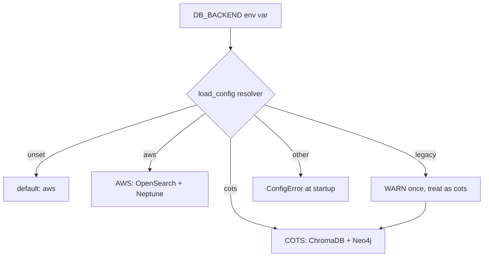

# Phase 63a — Backend Label Rename (`legacy` → `cots`)

**Version**: 1.0.0
**Created**: 2026-07-02
**Status**: ready
**Estimated effort**: 1 day
**Depends on**: Phase 46 (aws-infrastructure-port)
**Split from**: original Phase 63 (Python container parity + label rename). Container work moved to Phase 63b.

---

## 1. Executive Summary

The `develop_aws_startpoint` branch introduced a `DB_BACKEND` selector so the same MCP server can uniformly target either the on-prem stack (ChromaDB + Neo4j Community) or AWS (OpenSearch + Neptune). The on-prem selector is currently labelled `legacy`, which is semantically wrong — this stack is a first-class, currently-supported **COTS** (Commercial Off-The-Shelf) deployment, not a deprecated implementation. The label misleads onboarding and implies deprecation of a supported path.

This phase renames the selector value **`legacy` → `cots`** across the code, tests, and configuration SPOTs, with a one-release deprecation shim so `DB_BACKEND=legacy` continues to work (with a WARN) until Phase 64 removes it. `DB_BACKEND=aws` is unchanged.

Container parity between the Docker MCP Gateway and the stdio server is deferred to Phase 63b.

---

## 2. Scope

### 2.1 In Scope

- Rename the accepted value `legacy` → `cots` in the Python server's backend selector.
- Introduce a shim so `DB_BACKEND=legacy` still routes to the COTS backend and emits a one-time deprecation warning.
- Rename the value everywhere it appears as a config value or accepted CLI choice in:
  - `mcp_server_python/src/config/environment.py` (SPOT — `VALID_BACKENDS` tuple, `is_legacy()` helper, docstrings)
  - `mcp_server_python/src/data/backend_selector.py` (adapter router)
  - `mcp_server_python/src/data/aws_backend.py` (docstring)
  - `mcp_server_python/src/data/protocols.py` (docstring)
  - `mcp_server_python/src/data/unified_data_access.py` (docstring)
  - `mcp_server_python/src/tools/semantic_search.py` (multiple prose + one comparison)
  - `mcp_server_python/src/tools/smoke_queries.py`
  - `mcp_server_python/src/tools/graph_rag.py`
  - `mcp_server_python/scripts/run_mcp_stdio.sh` (shell SPOT)
  - `mcp_server_node/scripts/aws_backend.py`, `ingest_code_v8.py`, `ingest_cross_language_bridges.py`, `ingest_env_variables.py`, `ingestion_base.py`, `hard_negative_miner.py`
  - `.vscode/mcp.json` (commented hint)
  - `SETUP/mcp-env.sh` (if it references `DB_BACKEND`)
- Update tests to cover the rename and the shim:
  - Rename existing test descriptions in `mcp_server_node/src/__tests__/step21-*.test.js`
  - Add `mcp_server_python/tests/unit/test_environment_backend_resolver.py` covering `cots`, `aws`, `legacy` (shim + WARN), invalid values.
- CHANGELOG `[Unreleased]` entry documenting rename + shim policy.

### 2.2 Out of Scope

- **Renaming code identifiers** like `ChromaDBLegacyAdapter`, `is_legacy()`, module docstrings that use "legacy" to mean "historical" or "prose-legacy" (as in "legacy Node.js port", "legacy parity-debug fallback"). Those are contextual, not config values — renaming them expands blast radius without user benefit. Deferred to Phase 64 cleanup.
- **Container / gateway parity** — moved to Phase 63b.
- **Removing the `legacy` shim** — deferred to Phase 64 (one release grace period).
- **Historical `.kiro/specs/` documents** referencing `legacy` — point-in-time records, not touched.

---

## 3. Acceptance Criteria

| # | Probe | Pass condition |
|---|-------|----------------|
| 1 | `DB_BACKEND=cots` accepted | `load_config(env={"DB_BACKEND": "cots"})` returns `db_backend == "cots"` without warnings |
| 2 | `DB_BACKEND=aws` unchanged | AWS path continues to work byte-identical |
| 3 | Legacy shim | `DB_BACKEND=legacy` returns `db_backend == "cots"` and emits exactly one WARN: `DB_BACKEND=legacy is deprecated; use DB_BACKEND=cots (auto-mapped)` |
| 4 | Shim emits at most once | Calling `load_config` repeatedly with `legacy` emits the WARN exactly once per process |
| 5 | Unknown value fails fast | `DB_BACKEND=bogus` raises `ConfigError` listing accepted values (`aws`, `cots`) |
| 6 | Python tests green | `pytest mcp_server_python/tests/unit/test_environment*.py` passes |
| 7 | Node tests green | `npx vitest run mcp_server_node/src/__tests__/step21-reingest-integration.test.js` passes with renamed test names |
| 8 | No stale `legacy` config values | `grep -rn '"legacy"\|=legacy\b' SETUP/ mcp_server_python/scripts/ mcp_server_python/src/config/environment.py` returns zero hits outside the resolver's shim branch |
| 9 | Node ingestion `--backend` CLI | `hard_negative_miner.py --help` shows `--backend {aws,cots}`; passing `legacy` still works with a WARN on stderr |
| 10 | CHANGELOG updated | `CHANGELOG.md` has a `[Unreleased]` entry documenting rename + shim + Phase 64 removal plan |
| 11 | `run_mcp_stdio.sh` default | Shell launcher exports `DB_BACKEND=cots` when unset; passing `DB_BACKEND=legacy` explicitly still boots the server (via shim) |

---

## 4. Implementation Plan

### Step 1 — Shim in `environment.py`

- Change `VALID_BACKENDS` to `("aws", "cots")`.
- In `load_config`, wrap the raw `DB_BACKEND` read with a resolver:
  - Empty / unset → keep existing default (`aws`).
  - `"legacy"` → map to `"cots"`, emit one-time WARN via module-level guard (mirroring the existing `_MPNET_WARN_EMITTED` pattern).
  - `"aws"` / `"cots"` → pass through.
  - Anything else → raise `ConfigError` listing accepted values.
- Keep the `is_legacy()` helper name for backwards binary compat with any external callers, but have it return `db_backend == "cots"` (the same runtime meaning). Add a new `is_cots()` alias as the preferred name.

Tag: `implement`.

### Step 2 — Rename occurrences elsewhere (mechanical)

Update the file list in scope §2.1 to use `"cots"` in every place a string literal appears as a `DB_BACKEND` config value. Keep contextual prose references to "legacy" (meaning historical / older).

Tag: `configure`.

### Step 3 — Tests

- **New** `mcp_server_python/tests/unit/test_environment_backend_resolver.py` covering AC 1, 3, 4, 5. Uses the existing `env=` dict injection pattern from `load_config`.
- **Update** `mcp_server_node/src/__tests__/step21-reingest-integration.test.js` — rename test descriptions from `legacy` → `cots`, add one new test that asserts the shim still routes correctly when `DB_BACKEND=legacy`.

Tag: `validate`.

### Step 4 — CHANGELOG + docs

- Add `[Unreleased]` entry to [CHANGELOG.md](CHANGELOG.md):
  - **Changed**: `DB_BACKEND=legacy` → `DB_BACKEND=cots`. Old value auto-maps with a deprecation WARN; removal scheduled for Phase 64.
- Update `.github/copilot-instructions.md` where it references `DB_BACKEND=aws routes to OpenSearch + Neptune via adapter pattern` to also state `DB_BACKEND=cots (default) routes to ChromaDB + Neo4j Community; DB_BACKEND=legacy still accepted for one release`.

Tag: `document`.

---

## 5. Design & Architecture

### 5.1 Why `cots`

- **`onprem`** implies a physical location — misleading; the stack runs equally well on Parallel Works cloud nodes.
- **`local`** collides with the developer sense of "local mode" and doesn't convey what's being selected.
- **`cots`** (Commercial Off-The-Shelf) is accurate: both ChromaDB and Neo4j Community Edition are shipped, unmodified, third-party products. It parallels `aws` (managed cloud stack) at the same conceptual level — the label describes the **stack**, not location or lifecycle.

### 5.2 Resolver state machine

Fail-fast on unknown values prevents silent misconfiguration where a typo could cascade into empty query results.

### 5.3 Backwards-compat contract

| Consumer | Before | After Phase 63a | After Phase 64 |
|---|---|---|---|
| `DB_BACKEND=legacy` env | Works, no warn | Works, one WARN, routes to COTS | Rejected (ConfigError) |
| `DB_BACKEND=cots` env | Rejected (ConfigError) | Works, no warn | Works, no warn |
| `DB_BACKEND=aws` env | Works | Works | Works |
| `DB_BACKEND` unset | Defaults to `aws` (Python server) | Defaults to `aws` (unchanged) | Defaults to `aws` (unchanged) |
| Shell launcher `DB_BACKEND:-legacy` | Sets `legacy` | Sets `cots` | Sets `cots` |
| `ServerConfig.is_legacy()` | Returns `db_backend == "legacy"` | Returns `db_backend == "cots"` (semantically unchanged for existing callers) | Same |
| `ServerConfig.is_cots()` | Does not exist | Alias for `is_legacy()` | Preferred name; `is_legacy()` deprecated |

---

## 6. Artifacts Produced

| Artifact | Path | Purpose |
|---|---|---|
| Resolver + validation update | `mcp_server_python/src/config/environment.py` | Accept `cots`, shim `legacy` with WARN |
| Unit test | `mcp_server_python/tests/unit/test_environment_backend_resolver.py` | Cover AC 1, 3, 4, 5 |
| Updated integration test | `mcp_server_node/src/__tests__/step21-reingest-integration.test.js` | Rename + shim regression |
| Migration entry | `CHANGELOG.md` | Documents rename + shim window |
| Config SPOT edits | 8 Python + shell files | Consistent use of `cots` |

---

## 7. Risks & Mitigations

| Risk | Mitigation |
|---|---|
| Silent breakage of cron/CI scripts that hard-code `DB_BACKEND=legacy` | One-release shim + WARN line + CHANGELOG banner; AC 3–4 test the shim explicitly |
| Warning noise if a caller invokes `load_config` many times per process | Module-level `_LEGACY_WARN_EMITTED` guard (mirrors existing `_MPNET_WARN_EMITTED` pattern) — AC 4 covers this |
| Confusion between "legacy" as a config value vs. "legacy" as prose ("legacy Node.js port") | Explicit scope carve-out in §2.2; grep for `"legacy"` string literals only, not the word "legacy" in comments/docstrings |
| Callers using `is_legacy()` break at semantic runtime (still gets True for COTS) | Keep `is_legacy()` returning True for the COTS path — behaviour identical, name misleading but non-breaking. Deprecation of the method name is a Phase 64 concern |
